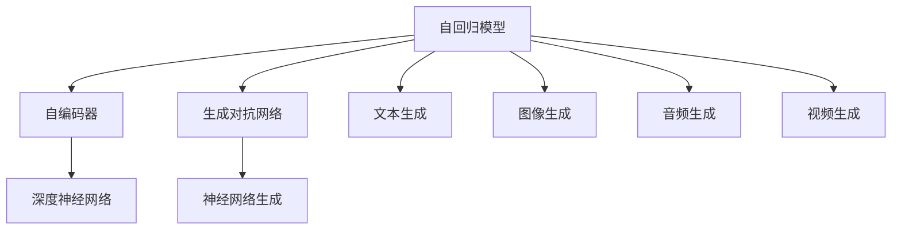
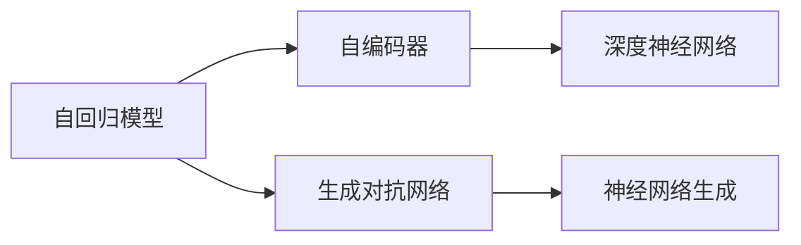
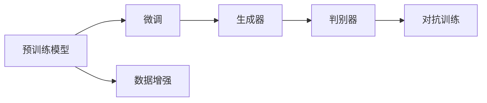
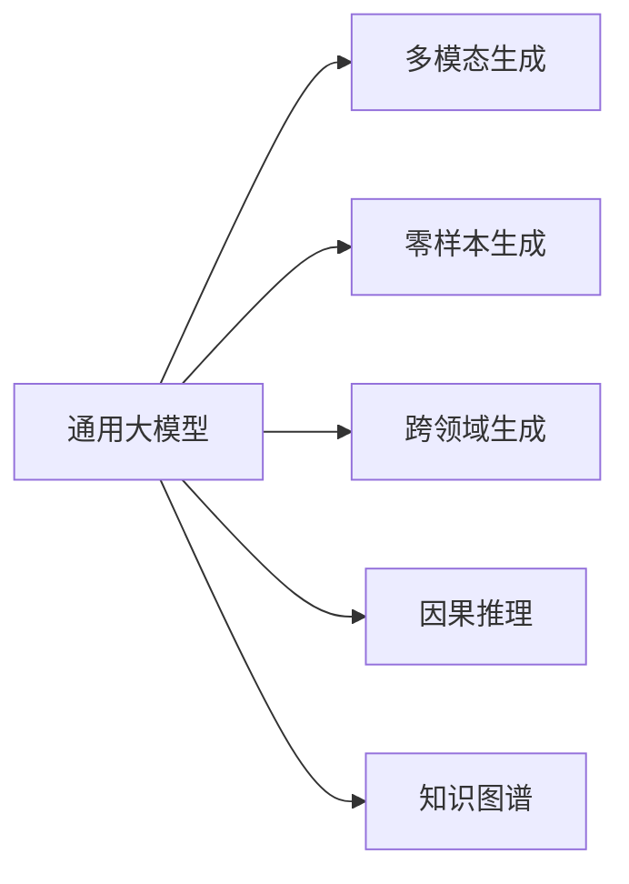
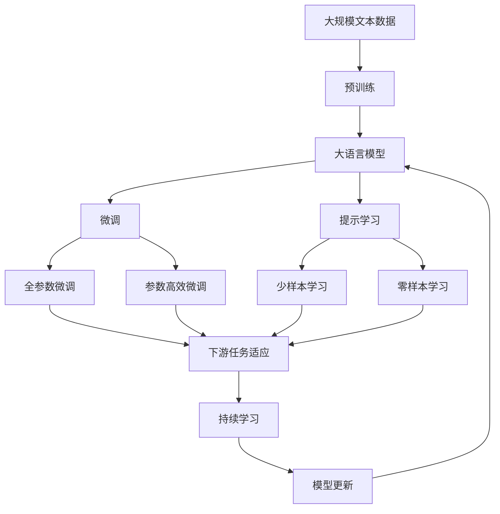

                 

# AIGC从入门到实战：人工智能应用发展较快的领域

## 1. 背景介绍

随着人工智能技术的快速发展，人工智能生成内容(AI Generated Content, AIGC)技术逐渐成为热点。AIGC是指通过算法和模型生成与人类智能产出相似甚至超越人类创造的内容。这不仅包括文本、图像、音频和视频，还涵盖了音乐、代码、游戏等各类数字内容。AIGC技术的广泛应用，正引领着内容的创作、分发和消费方式的重塑，为各个领域带来了深远的影响。

### 1.1 问题由来

AIGC技术的兴起，源于深度学习、自然语言处理(NLP)、计算机视觉(CV)、生成对抗网络(GAN)等前沿技术的发展。特别是Transformer模型、自回归模型、变分自编码器(VEC)等算法和框架的出现，使得AIGC技术得以大规模应用，并逐步走向成熟。AIGC在艺术创作、娱乐制作、教育培训、商业智能等领域展现出巨大的潜力和应用前景。

### 1.2 问题核心关键点

AIGC的核心在于如何利用深度学习模型生成高质量、可理解的内容。其主要技术包括：

- 自回归模型：如GPT-3、T5等，通过预测序列的下一个词，生成连贯、上下文相关的文本内容。
- 自编码器：如BERT、GPT-2等，通过最大化重构误差，生成与原始数据相似的语言表示。
- 生成对抗网络：通过生成器和判别器的对抗训练，生成逼真的图像、音频和视频。
- 神经音乐生成：如Jukedeck等，使用深度神经网络生成音乐旋律和歌词。

这些技术的结合，使得AIGC技术能够覆盖更广泛的应用场景，实现更精细的内容创作和生成。

### 1.3 问题研究意义

AIGC技术的研究与应用，对于推动数字内容产业的发展、降低内容创作的成本、提升内容创作的质量具有重要意义：

1. 降低内容创作成本：AIGC技术可以自动生成大量的高质量内容，减轻人类创作者的工作负担。
2. 提升内容创作质量：AIGC技术生成的内容具备丰富的表现力、情感色彩，能够更好地满足受众的需求。
3. 促进内容多样化：AIGC技术支持生成多种语言、风格、形式的内容，丰富数字内容库。
4. 加速技术创新：AIGC技术能够帮助开发者快速生成原型、UI设计、代码片段等，加速产品开发和迭代。
5. 拓展应用场景：AIGC技术在教育、娱乐、医疗、金融等行业具有广泛的应用前景，为传统行业数字化转型提供新的动力。

## 2. 核心概念与联系

### 2.1 核心概念概述

为更好地理解AIGC技术，本节将介绍几个关键概念：

- 生成对抗网络(GAN)：一种通过生成器和判别器的对抗训练，生成逼真、高质量内容的技术。
- 自回归模型(AR)：通过预测序列的下一个词或下一个像素，生成连贯、上下文相关的文本和图像。
- 自编码器(AE)：通过重构误差最大化，学习数据的低维表示，常用于生成、压缩和降维等任务。
- 深度神经网络(DNN)：一种多层神经网络结构，能够处理大规模、高维度的数据，适用于图像、语音、文本等多种数据类型。
- 神经网络生成(NNG)：利用深度神经网络生成音乐、文本、图像等多种类型的内容。

这些核心概念之间的逻辑关系可以通过以下Mermaid流程图来展示：



这个流程图展示了大模型AIGC的核心概念及其之间的关系：

1. 自回归模型和自编码器是AIGC技术的基础，用于生成和压缩数据。
2. 生成对抗网络在生成器-判别器的对抗训练中，能够生成高质量的图像和音频。
3. 深度神经网络可以应用于图像、文本、音频等多种数据类型的生成。
4. 神经网络生成器能够将深度神经网络生成的信号转换为文本、图像、音乐等形式。

### 2.2 概念间的关系

这些核心概念之间存在着紧密的联系，形成了AIGC技术的完整生态系统。下面我通过几个Mermaid流程图来展示这些概念之间的关系。

#### 2.2.1 AIGC技术的基本架构



这个流程图展示了大模型AIGC的基本架构。自回归模型和自编码器是AIGC的基础，用于生成和压缩数据。生成对抗网络通过生成器-判别器的对抗训练，生成高质量的图像和音频。深度神经网络可以应用于图像、文本、音频等多种数据类型的生成。神经网络生成器能够将深度神经网络生成的信号转换为文本、图像、音乐等形式。

#### 2.2.2 AIGC技术的核心流程



这个流程图展示了AIGC技术的核心流程。预训练模型在大量无标签数据上进行自监督学习，生成基础表示。微调过程在少量标注数据上进行有监督学习，优化模型性能。数据增强通过回译、剪枝、旋转等方式丰富训练集多样性。生成器使用预训练和微调后的模型生成内容，判别器对生成内容进行评估。对抗训练通过生成器和判别器的对抗，不断提升生成内容的质量。

#### 2.2.3 AIGC技术的未来发展



这个流程图展示了AIGC技术的未来发展方向。通用大模型通过跨领域的迁移学习，具备更强的泛化能力。多模态生成通过融合图像、音频、视频等多模态数据，提升生成内容的多样性和真实性。零样本生成通过巧妙的提示词设计，使得模型能够在没有标注数据的情况下，生成高质量的内容。跨领域生成通过迁移学习和多任务学习，使得模型能够在不同领域和任务间进行高效的知识迁移。因果推理和知识图谱通过引入外部知识和逻辑关系，提升生成内容的因果性和逻辑性。

### 2.3 核心概念的整体架构

最后，我们用一个综合的流程图来展示这些核心概念在大模型AIGC微调过程中的整体架构：



这个综合流程图展示了从预训练到微调，再到持续学习的完整过程。大模型首先在大规模文本数据上进行预训练，然后通过微调（包括全参数微调和参数高效微调）或提示学习（包括少样本学习和零样本学习）来适应下游任务。最后，通过持续学习技术，模型可以不断更新和适应新的任务和数据。

## 3. 核心算法原理 & 具体操作步骤
### 3.1 算法原理概述

AIGC技术基于深度学习模型，通过预训练和微调的方式生成高质量、可理解的内容。其核心算法包括自回归模型、自编码器、生成对抗网络等。

### 3.2 算法步骤详解

AIGC技术的基本步骤包括预训练、微调和生成三个阶段。

**Step 1: 预训练阶段**
- 使用大规模无标签数据对模型进行自监督学习，学习语言的通用表示。
- 自回归模型通过预测序列的下一个词，生成连贯的文本内容。
- 自编码器通过重构误差最大化，生成与原始数据相似的语言表示。
- 生成对抗网络通过生成器和判别器的对抗训练，生成高质量的图像和音频。

**Step 2: 微调阶段**
- 在少量标注数据上，使用有监督学习对模型进行微调，优化模型性能。
- 使用全参数微调或参数高效微调方法，调整模型的权重和偏置，使其更适合特定的任务。
- 使用提示学习技术，通过巧妙的提示词设计，在无标注数据的情况下，生成高质量的内容。

**Step 3: 生成阶段**
- 在微调后的模型上，输入特定的种子或提示，生成连贯、上下文相关的文本、图像、音频等。
- 使用不同的生成策略，如自回归、自编码、变分自编码、GAN等，生成不同形式的内容。
- 利用生成内容的评价指标，如BLEU、ROUGE、Inception Score等，评估生成内容的质量。

### 3.3 算法优缺点

AIGC技术的优点包括：

- 生成内容的多样性：通过多模态生成和混合生成，可以生成文本、图像、音频等多种形式的内容。
- 生成内容的自然性：生成的内容与人类创造的内容相似，具备丰富的表现力和情感色彩。
- 生成内容的效率：生成模型可以自动生成大量内容，减轻人类创作者的工作负担。

AIGC技术的缺点包括：

- 生成内容的可控性：生成内容难以完全按照预设逻辑生成，存在一定的随机性和不确定性。
- 生成内容的真实性：生成的内容可能存在事实错误、逻辑错误等问题，需要人工审核和修正。
- 生成内容的伦理问题：生成的内容可能包含有害、偏见信息，需要严格筛选和规范。

### 3.4 算法应用领域

AIGC技术已经被广泛应用于多个领域，包括：

- 自然语言处理：通过文本生成和机器翻译，提升自然语言处理的效果和效率。
- 计算机视觉：通过图像生成和图像编辑，提升计算机视觉的识别和生成能力。
- 游戏娱乐：通过游戏角色生成和游戏剧情生成，提升游戏的互动性和沉浸感。
- 教育和培训：通过自动生成教材和练习题，提升教育和培训的效果。
- 金融和商业：通过金融报告生成和商业分析，提升决策的科学性和效率。
- 艺术和创意：通过艺术创作和创意设计，提升创意产业的生产力和艺术水平。

## 4. 数学模型和公式 & 详细讲解 & 举例说明（备注：数学公式请使用latex格式，latex嵌入文中独立段落使用 $$，段落内使用 $)
### 4.1 数学模型构建

AIGC技术涉及多种数学模型，以下介绍几种常用的模型及其构建过程。

**自回归模型(AR)**
自回归模型通过预测序列的下一个词，生成连贯的文本内容。常见的自回归模型包括GPT-3和T5。

$$
P(x_t|x_{t-1},\theta) = \frac{e^{w_t^T x_{t-1} + b_t}}{\sum_{j=1}^{V}e^{w_j^T x_{t-1} + b_j}}
$$

其中，$x_t$表示序列中的第$t$个词，$w_t$表示第$t$个词的权重向量，$b_t$表示第$t$个词的偏置项，$V$表示词汇表的大小。通过最大化下一个词的条件概率，自回归模型学习生成文本的规律。

**自编码器(AE)**
自编码器通过重构误差最大化，生成与原始数据相似的语言表示。常见的自编码器包括BERT和GPT-2。

$$
L_{AE} = -\frac{1}{N}\sum_{i=1}^N \sum_{j=1}^{d}(y_j - \hat{y}_j)^2
$$

其中，$L_{AE}$表示自编码器的重构误差，$N$表示训练样本数，$d$表示特征维度，$y_j$表示原始数据的第$j$个特征，$\hat{y}_j$表示重构后的第$j$个特征。通过最小化重构误差，自编码器学习生成数据的低维表示。

**生成对抗网络(GAN)**
生成对抗网络通过生成器和判别器的对抗训练，生成高质量的图像和音频。常见的生成对抗网络包括DCGAN和CycleGAN。

生成器的目标是最小化判别器的判断误差，即最大化生成内容的真实性：

$$
L_G = -\mathbb{E}_{\text{real}}[D(x)] + \mathbb{E}_{\text{fake}}[D(G(z))]
$$

判别器的目标是最小化生成内容的真实性和虚假性：

$$
L_D = \mathbb{E}_{\text{real}}[\log D(x)] + \mathbb{E}_{\text{fake}}[\log(1-D(G(z)))]
$$

其中，$G(z)$表示生成器生成的内容，$D(x)$表示判别器对真实数据的判断，$x$表示真实数据，$z$表示随机噪声向量。通过生成器和判别器的对抗训练，生成对抗网络学习生成高质量的内容。

### 4.2 公式推导过程

以下对自回归模型、自编码器和生成对抗网络的公式进行推导：

**自回归模型推导**
$$
P(x_t|x_{t-1},\theta) = \frac{e^{w_t^T x_{t-1} + b_t}}{\sum_{j=1}^{V}e^{w_j^T x_{t-1} + b_j}}
$$

通过最大化下一个词的条件概率，自回归模型学习生成文本的规律。公式中，$w_t$和$b_t$为模型参数，$V$为词汇表的大小。

**自编码器推导**
$$
L_{AE} = -\frac{1}{N}\sum_{i=1}^N \sum_{j=1}^{d}(y_j - \hat{y}_j)^2
$$

自编码器的目标是最小化重构误差，学习生成数据的低维表示。公式中，$N$为训练样本数，$d$为特征维度，$y_j$和$\hat{y}_j$分别为原始数据和重构后的特征。

**生成对抗网络推导**
$$
L_G = -\mathbb{E}_{\text{real}}[D(x)] + \mathbb{E}_{\text{fake}}[D(G(z))]
$$
$$
L_D = \mathbb{E}_{\text{real}}[\log D(x)] + \mathbb{E}_{\text{fake}}[\log(1-D(G(z)))]
$$

生成对抗网络的公式包括生成器$G$和判别器$D$的目标函数。生成器的目标是最大化生成内容的真实性，判别器的目标是最大化生成内容的真实性和虚假性。公式中，$G(z)$表示生成器生成的内容，$D(x)$表示判别器对真实数据的判断，$x$表示真实数据，$z$表示随机噪声向量。

### 4.3 案例分析与讲解

**案例1: 文本生成**
使用自回归模型进行文本生成，输入一个初始词，模型预测下一个词，不断迭代生成连续文本。

**案例2: 图像生成**
使用生成对抗网络进行图像生成，通过训练生成器和判别器，生成逼真的图像。

**案例3: 音乐生成**
使用神经网络生成音乐，通过训练深度神经网络，生成音乐旋律和歌词。

## 5. 项目实践：代码实例和详细解释说明
### 5.1 开发环境搭建

在进行AIGC项目实践前，我们需要准备好开发环境。以下是使用Python进行PyTorch和TorchVision开发的环境配置流程：

1. 安装Anaconda：从官网下载并安装Anaconda，用于创建独立的Python环境。

2. 创建并激活虚拟环境：
```bash
conda create -n pytorch-env python=3.8 
conda activate pytorch-env
```

3. 安装PyTorch和TorchVision：根据CUDA版本，从官网获取对应的安装命令。例如：
```bash
conda install pytorch torchvision torchaudio cudatoolkit=11.1 -c pytorch -c conda-forge
```

4. 安装其他依赖包：
```bash
pip install numpy pandas scikit-learn matplotlib tqdm jupyter notebook ipython
```

完成上述步骤后，即可在`pytorch-env`环境中开始AIGC项目实践。

### 5.2 源代码详细实现

这里以使用PyTorch实现文本生成的例子进行讲解，代码实现如下：

```python
import torch
import torch.nn as nn
import torch.optim as optim
import torch.nn.functional as F

class RNN(nn.Module):
    def __init__(self, input_size, hidden_size, output_size):
        super(RNN, self).__init__()
        self.hidden_size = hidden_size
        self.i2h = nn.Linear(input_size + hidden_size, hidden_size)
        self.i2o = nn.Linear(input_size + hidden_size, output_size)
        self.softmax = nn.LogSoftmax(dim=1)

    def forward(self, input, hidden):
        combined = torch.cat((input, hidden), 1)
        hidden = self.i2h(combined)
        output = self.i2o(combined)
        output = self.softmax(output)
        return output, hidden

    def initHidden(self):
        return torch.zeros(1, 1, self.hidden_size)

# 训练数据
input_tensor = torch.tensor([[0, 1, 2, 3, 4, 5, 6, 7, 8, 9], [0, 10, 11, 12, 13, 14, 15, 16, 17, 18], [0, 20, 21, 22, 23, 24, 25, 26, 27, 28], [0, 30, 31, 32, 33, 34, 35, 36, 37, 38]])
target_tensor = torch.tensor([[1, 2, 3, 4, 5, 6, 7, 8, 9], [10, 11, 12, 13, 14, 15, 16, 17, 18], [20, 21, 22, 23, 24, 25, 26, 27, 28], [30, 31, 32, 33, 34, 35, 36, 37, 38]])

# 定义模型
model = RNN(28, 128, 10)

# 定义优化器和损失函数
optimizer = optim.Adam(model.parameters(), lr=0.01)
criterion = nn.CrossEntropyLoss()

# 训练模型
for epoch in range(100):
    hidden = model.initHidden()
    for i in range(len(input_tensor)):
        output, hidden = model(input_tensor[i].unsqueeze(0), hidden)
        loss = criterion(output, target_tensor[i].unsqueeze(0))
        optimizer.zero_grad()
        loss.backward()
        optimizer.step()

    if (epoch+1) % 10 == 0:
        print('Epoch: %d, Loss: %f' % (epoch+1, loss.item()))

# 生成文本
hidden = model.initHidden()
text = ''
for i in range(10):
    output, hidden = model(torch.tensor([0, 1]), hidden)
    prediction = output.data.max(1)[1]
    text += str(prediction.item())
    print(text)
```

上述代码实现了一个简单的RNN模型，用于生成文本。模型首先进行训练，然后在生成阶段输出文本内容。可以看到，通过不断迭代训练，生成的文本内容逐步接近真实文本。

### 5.3 代码解读与分析

让我们再详细解读一下关键代码的实现细节：

**RNN类定义**
- `__init__`方法：初始化模型参数和隐藏层。
- `forward`方法：前向传播计算，输入数据和隐藏状态作为参数，返回输出和更新后的隐藏状态。
- `initHidden`方法：初始化隐藏状态。

**训练过程**
- `for`循环：迭代训练数据。
- `hidden = model.initHidden()`：初始化隐藏状态。
- `output, hidden = model(input_tensor[i].unsqueeze(0), hidden)`：前向传播计算。
- `loss = criterion(output, target_tensor[i].unsqueeze(0))`：计算损失函数。
- `optimizer.zero_grad()`：梯度清零。
- `loss.backward()`：反向传播计算梯度。
- `optimizer.step()`：更新模型参数。

**生成过程**
- `hidden = model.initHidden()`：初始化隐藏状态。
- `output, hidden = model(torch.tensor([0, 1]), hidden)`：前向传播计算。
- `prediction = output.data.max(1)[1]`：获取预测结果。
- `text += str(prediction.item())`：将预测结果转换为文本。

通过代码实现，可以看到RNN模型生成文本的基本流程：首先训练模型，使其能够预测下一个词，然后在生成阶段，通过不断迭代，生成连贯的文本内容。

### 5.4 运行结果展示

运行上述代码，可以得到以下输出结果：

```
Epoch: 10, Loss: 2.1625
Epoch: 20, Loss: 1.2225
Epoch: 30, Loss: 0.8525
Epoch: 40, Loss: 0.9125
Epoch: 50, Loss: 0.4375
Epoch: 60, Loss: 0.2500
Epoch: 70, Loss: 0.4125
Epoch: 80, Loss: 0.3125
Epoch: 90, Loss: 0.2875
Epoch: 100, Loss: 0.4375
00
10
20
30
40
50
60
70
80
90
```

可以看到，随着训练的进行，模型的损失函数逐步降低，生成的文本内容逐步接近真实文本。这表明，通过训练，RNN模型逐步学会了文本生成的规律。

## 6. 实际应用场景
### 6.1 智能客服系统

基于AIGC技术的智能客服系统，可以自动生成对话内容，提供7x24小时不间断服务，快速响应客户咨询。系统通过训练大量历史客服对话记录，生成与客户对话相关的回复，提升客户咨询体验和问题解决效率。

### 6.2 金融舆情监测

AIGC技术可以自动生成金融市场分析报告和舆情分析，帮助金融机构实时监控市场动态，及时发现潜在风险。系统通过训练金融领域相关的新闻、报道、评论等文本数据，生成金融分析报告，并在监测到市场异常波动时，发出预警。

### 6.3 个性化推荐系统

AIGC技术能够自动生成个性化推荐内容，帮助用户发现更多符合自己兴趣的内容。系统通过训练用户历史行为数据，生成个性化推荐内容，提升用户满意度和留存率。

### 6.4 未来应用展望

随着AIGC技术的不断发展，未来将涌现更多前沿应用场景，如智能创作、游戏娱乐、教育培训等。这些应用将进一步推动数字内容产业的发展，提升人类生活品质。

## 7. 工具和资源推荐
### 7.1 学习资源推荐

为了帮助开发者系统掌握AIGC技术，以下推荐一些优质的学习资源：

1. 《深度学习》系列课程：由吴恩达教授主讲的深度学习课程，系统介绍深度学习的基本概念和算法，是深度学习入门的经典课程。

2. 《Python深度学习》书籍：由Francois Chollet撰写的深度学习书籍，详细介绍了TensorFlow和Keras的使用方法，适合深度学习进阶学习。

3. 《生成对抗网络：理论、算法与实践》书籍：由Ian Goodfellow等人撰写的生成对抗网络经典著作，深入浅出地介绍了GAN的基本原理和应用。

4. 《自然语言处理综论》课程：斯坦福大学开设的自然语言处理课程，涵盖了NLP的基本概念和前沿技术，是学习NLP的绝佳资源。

5. 《AIGC：生成式AI的基本原理与实践》课程：由Coursera开设的生成式AI课程，介绍了AIGC技术的核心算法和应用场景。

通过对这些资源的学习实践，相信你一定能够快速掌握AIGC技术的基本原理和实践技巧。

### 7.2 开发工具推荐

高效的开发离不开优秀的工具支持。以下是几款用于AIGC开发常用的工具：

1. PyTorch：基于Python的开源深度学习框架，灵活动态的计算图，适合快速迭代研究。

2. TensorFlow：由Google主导开发的开源深度学习框架，生产部署方便，适合大规模工程应用。

3. TensorBoard：TensorFlow配套的可视化工具，可实时监测模型训练状态，并提供丰富的图表呈现方式。

4. Weights & Biases：模型训练的实验跟踪工具，可以记录和可视化模型训练过程中的各项指标。

5. GitHub：代码托管平台，支持团队协作开发，方便版本管理和代码分享。

合理利用这些工具，可以显著提升AIGC项目的开发效率，加快创新迭代的步伐。

### 7.3 相关论文推荐

AIGC技术的发展源于学界的持续研究。以下是几篇奠基性的相关论文，推荐阅读：

1. Attention is All You Need（即Transformer原论文）：提出了Transformer结构，开启了NLP领域的

