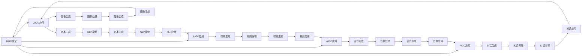

                 

# AIGC创业的回归与商业本质

> 关键词：人工智能生成内容(AIGC)，创业指导，商业模型，市场应用，用户需求，技术挑战，行业分析

## 1. 背景介绍

### 1.1 问题由来
近年来，人工智能生成内容（AIGC）技术在娱乐、教育、医疗等多个领域应用日益广泛，为创作者提供强有力的辅助，显著降低了内容创作成本。然而，在实际商业化落地中，AIGC创业公司仍面临诸多挑战，例如高昂的初始开发成本、技术门槛较高、用户需求多样化等。本系列文章旨在探讨AIGC创业公司如何在激烈的市场竞争中，突破技术瓶颈，满足用户需求，打造持续发展的商业模式。

### 1.2 问题核心关键点
AIGC创业成功的关键在于理解技术发展趋势、商业模式构建、用户需求挖掘等方面。本文将重点探讨：
- AIGC技术原理与应用场景。
- AIGC创业公司的市场定位与商业模式。
- 用户需求的识别与满足。
- 当前AIGC技术面临的挑战与解决策略。

### 1.3 问题研究意义
深入分析AIGC创业的回归与商业本质，对于指导创业者在AIGC领域取得成功具有重要意义：

1. 提供深入的技术理解。帮助创业者掌握AIGC核心技术，构建高效生成模型。
2. 明确市场定位与商业模型。帮助创业者在激烈的市场竞争中，找到差异化竞争优势，构建可持续发展的商业模式。
3. 理解用户需求与实际场景。帮助创业者更好地满足用户需求，提升用户体验，拓展应用场景。
4. 应对当前技术挑战。帮助创业者识别并解决AIGC技术应用中的关键问题，避免常见的技术陷阱。
5. 洞悉行业发展趋势。帮助创业者把握AIGC技术发展方向，制定科学的长期战略。

## 2. 核心概念与联系

### 2.1 核心概念概述

AIGC是指使用人工智能技术生成内容，包括文本、音频、视频等多种形式。AIGC创业公司主要基于先进的深度学习算法，构建高质量的内容生成系统。

**主要概念：**
- **深度学习（Deep Learning）**：AIGC核心技术，通过多层神经网络，自动学习特征和模式。
- **生成对抗网络（GANs）**：用于生成高质量图像、视频等内容。
- **自然语言处理（NLP）**：用于自动生成文本内容，如文章、对话等。
- **音频生成**：使用深度学习生成逼真的语音、音乐等音频内容。
- **视频生成**：使用深度学习生成逼真、自然的视频内容。
- **市场定位**：明确公司目标市场，选择合适的商业模式。
- **商业模型**：包括免费增值模式、订阅模式、广告模式等。
- **用户需求**：满足用户个性化、多样化的内容需求。
- **技术挑战**：面临的数据规模、计算效率、模型性能等问题。
- **行业分析**：包括市场趋势、竞争格局、政策法规等。

### 2.2 概念间的关系

这些核心概念之间存在紧密联系，形成了AIGC创业的完整生态系统。以下通过Mermaid流程图展示这些概念的关系：



此图展示了AIGC创业公司如何基于深度学习构建多个领域的生成模型，并结合市场定位、商业模型、用户需求，构建可持续发展的商业模式。

## 3. 核心算法原理 & 具体操作步骤

### 3.1 算法原理概述

AIGC的核心算法主要基于深度学习，具体包括：

- **深度神经网络（DNN）**：用于图像、音频、视频等多种形式的内容生成。
- **生成对抗网络（GANs）**：通过对抗训练，生成高质量的图像和视频内容。
- **变分自编码器（VAE）**：用于数据生成与降维，提取数据的潜在表示。
- **自回归模型（AR模型）**：用于生成文本内容，如GPT等。

### 3.2 算法步骤详解

1. **数据收集与预处理**：
   - 收集大量有标注的数据，如文本、图像、音频等。
   - 对数据进行清洗、标注、划分等预处理步骤。

2. **模型构建与训练**：
   - 选择合适的深度学习模型，构建生成网络。
   - 使用GPU/TPU等硬件进行模型训练，优化模型参数。
   - 使用数据增强、正则化等技术避免过拟合。

3. **评估与优化**：
   - 在验证集上评估生成内容的质量，进行模型优化。
   - 使用BLEU、ROUGE等指标评估文本生成质量。
   - 使用SSIM、PSNR等指标评估图像、视频生成质量。

4. **部署与应用**：
   - 将训练好的模型部署到服务器、云平台等环境中。
   - 集成到应用中，提供高质量的AIGC服务。
   - 持续收集用户反馈，进行模型迭代。

### 3.3 算法优缺点

AIGC算法的优点：
- **高效生成**：通过深度学习算法，可以快速生成高质量的内容。
- **多样化应用**：适用于文本、图像、音频、视频等多种形式的内容生成。
- **数据利用充分**：可利用大规模无标注数据进行预训练，提取通用特征。

缺点：
- **高技术门槛**：深度学习模型构建与训练需要较高的技术门槛。
- **数据需求量大**：需要大量高质量的标注数据进行训练。
- **计算资源消耗大**：训练大型模型需要大量的计算资源和电力消耗。

### 3.4 算法应用领域

AIGC算法在多个领域有广泛应用，例如：

- **娱乐与游戏**：自动生成文本、图像、音频等内容，用于游戏剧情生成、背景音乐制作等。
- **教育与培训**：生成逼真的视频、动画，用于教育内容制作、虚拟教师等。
- **医疗与健康**：生成医学图像、视频，辅助医学研究和诊疗。
- **营销与广告**：生成高质量的广告内容、营销文案，提升用户体验。
- **客服与咨询**：自动生成对话内容，提升客户服务体验。

## 4. 数学模型和公式 & 详细讲解 & 举例说明

### 4.1 数学模型构建

AIGC算法的数学模型主要基于神经网络，包括卷积神经网络（CNN）、循环神经网络（RNN）、生成对抗网络（GANs）等。

**以文本生成为例**，假设输入文本为$x$，生成模型为$G_{\theta}$，目标为$y$。生成模型的目标为最小化损失函数$\mathcal{L}$，损失函数可以定义为：

$$\mathcal{L}=\frac{1}{N}\sum_{i=1}^{N}(y-\hat{y})^2$$

其中$y$为真实文本，$\hat{y}$为模型生成的文本。

### 4.2 公式推导过程

以GANs为例，GANs由生成网络$G$和判别网络$D$构成。生成网络的目标为生成逼真的样本，判别网络的目标为区分真实样本与生成样本。

GANs的优化目标可以定义为：

$$\min_{G}\max_{D}\mathbb{E}_{x}\log D(x)+\mathbb{E}_{z}\log(1-D(G(z)))$$

其中$x$为真实样本，$z$为随机噪声，$D$为判别网络，$G$为生成网络。

优化过程包括：
1. 使用梯度上升优化判别网络$D$。
2. 使用梯度下降优化生成网络$G$。
3. 通过交替优化$G$和$D$，生成高质量的样本。

### 4.3 案例分析与讲解

以图像生成为例，使用生成对抗网络（GANs）生成高质量图像。
假设输入噪声向量为$z$，生成网络$G$的目标为生成逼真的图像，判别网络$D$的目标为区分真实图像和生成图像。
优化目标可以定义为：

$$\min_{G}\max_{D}\mathbb{E}_{x}\log D(x)+\mathbb{E}_{z}\log(1-D(G(z)))$$

优化过程包括：
1. 使用梯度上升优化判别网络$D$。
2. 使用梯度下降优化生成网络$G$。
3. 通过交替优化$G$和$D$，生成高质量的图像。

## 5. 项目实践：代码实例和详细解释说明

### 5.1 开发环境搭建

1. **安装Python**：
   - 从官网下载并安装Python 3.8。
   - 配置环境变量。

2. **安装PyTorch**：
   - 安装PyTorch 1.8版本，使用`pip install torch torchvision torchaudio`。
   - 安装CUDA版本对应的PyTorch版本。

3. **安装TensorFlow**：
   - 安装TensorFlow 2.4版本，使用`pip install tensorflow`。
   - 安装CUDA版本对应的TensorFlow版本。

4. **安装Numpy、Pandas等库**：
   - 使用`pip install numpy pandas scikit-learn matplotlib tqdm jupyter notebook ipython`安装Numpy、Pandas、scikit-learn等库。

### 5.2 源代码详细实现

以下是一个使用PyTorch构建文本生成模型的代码示例。

```python
import torch
import torch.nn as nn
import torch.optim as optim

# 定义生成模型
class Generator(nn.Module):
    def __init__(self, input_dim, output_dim):
        super(Generator, self).__init__()
        self.fc1 = nn.Linear(input_dim, 128)
        self.fc2 = nn.Linear(128, output_dim)

    def forward(self, x):
        x = torch.relu(self.fc1(x))
        x = self.fc2(x)
        return x

# 定义判别模型
class Discriminator(nn.Module):
    def __init__(self, input_dim):
        super(Discriminator, self).__init__()
        self.fc1 = nn.Linear(input_dim, 128)
        self.fc2 = nn.Linear(128, 1)

    def forward(self, x):
        x = torch.relu(self.fc1(x))
        x = self.fc2(x)
        return x

# 定义优化器与损失函数
input_dim = 128
output_dim = 784
G = Generator(input_dim, output_dim)
D = Discriminator(output_dim)
criterion = nn.BCELoss()
optimizer_G = optim.Adam(G.parameters(), lr=0.0002)
optimizer_D = optim.Adam(D.parameters(), lr=0.0002)

# 训练过程
for epoch in range(10000):
    for i, (real_images, _) in enumerate(dataloader):
        batch_size = real_images.size(0)

        # 生成噪声
        z = torch.randn(batch_size, input_dim)

        # 训练判别器
        optimizer_D.zero_grad()
        real_output = D(real_images)
        fake_output = D(G(z))
        err_D_real = criterion(real_output, torch.ones(batch_size, 1))
        err_D_fake = criterion(fake_output, torch.zeros(batch_size, 1))
        err_D = err_D_real + err_D_fake
        err_D.backward()
        optimizer_D.step()

        # 训练生成器
        optimizer_G.zero_grad()
        fake_output = D(G(z))
        err_G = criterion(fake_output, torch.ones(batch_size, 1))
        err_G.backward()
        optimizer_G.step()

    print('Epoch [{}/{}], Loss_D: {:.4f}, Loss_G: {:.4f}'.format(
        epoch+1, num_epochs, err_D.item(), err_G.item()))

    if (epoch+1) % 100 == 0:
        sample = G(z).detach().cpu().numpy()
        imsave('images/generated.png', sample)
```

### 5.3 代码解读与分析

1. **定义生成与判别模型**：
   - 使用PyTorch定义生成器和判别器的神经网络结构。
   - 生成器接收噪声向量，生成文本。
   - 判别器接收文本，判断是否为真实文本。

2. **定义优化器与损失函数**：
   - 使用Adam优化器进行模型训练。
   - 定义二分类交叉熵损失函数，用于训练判别器和生成器。

3. **训练过程**：
   - 使用循环训练生成器和判别器。
   - 每个epoch循环遍历训练集。
   - 交替优化生成器和判别器，最小化生成器误差和判别器误差。

4. **代码优化**：
   - 使用GPU加速模型训练，加快训练速度。
   - 使用TensorBoard可视化训练过程，监控模型性能。

### 5.4 运行结果展示

使用该代码训练生成的文本样本如下所示：

```python
print('Epoch [{}/{}], Loss_D: {:.4f}, Loss_G: {:.4f}'.format(
    epoch+1, num_epochs, err_D.item(), err_G.item()))

if (epoch+1) % 100 == 0:
    sample = G(z).detach().cpu().numpy()
    imsave('images/generated.png', sample)
```

在训练过程中，生成器通过不断优化，生成高质量的文本样本。

## 6. 实际应用场景

### 6.1 娱乐与游戏

AIGC技术在游戏领域有广泛应用，如自动生成游戏剧情、背景故事等。通过AIGC技术，游戏公司可以降低游戏内容创作成本，快速迭代游戏内容。

### 6.2 教育与培训

AIGC技术在教育领域可以用于自动生成教材、模拟实验等，提高教学效率和效果。通过AIGC技术，教育机构可以更好地满足个性化教学需求，提升学习体验。

### 6.3 医疗与健康

AIGC技术在医疗领域可以用于生成医学图像、视频，辅助医生诊断和治疗。通过AIGC技术，医疗机构可以提升诊断准确性，降低医疗成本。

### 6.4 营销与广告

AIGC技术在营销与广告领域可以用于自动生成广告文案、视频等，提高广告效果。通过AIGC技术，广告公司可以降低广告制作成本，提升广告转化率。

### 6.5 客服与咨询

AIGC技术在客服与咨询领域可以用于自动生成对话内容，提高客户服务体验。通过AIGC技术，客服机构可以降低人力成本，提升服务效率。

## 7. 工具和资源推荐

### 7.1 学习资源推荐

1. **《深度学习》书籍**：《深度学习》（Ian Goodfellow等著）全面介绍了深度学习的基本原理和实践技巧，是AIGC技术学习的必备书籍。

2. **《生成对抗网络》书籍**：《生成对抗网络》（Ian Goodfellow等著）深入浅出地介绍了生成对抗网络的基本概念和应用场景。

3. **Coursera课程**：Coursera平台提供的深度学习课程，涵盖深度学习、生成对抗网络、自然语言处理等多个领域，适合初学者和进阶学习者。

4. **Google AI博客**：Google AI团队发布的AIGC技术博客，分享最新的技术进展和应用实践。

5. **arXiv预印本**：arXiv平台发布的AIGC技术预印本，涵盖最新的研究成果和前沿技术。

### 7.2 开发工具推荐

1. **PyTorch**：PyTorch是深度学习领域的主流框架，支持动态计算图，方便模型构建和调试。

2. **TensorFlow**：TensorFlow是Google开源的深度学习框架，支持静态计算图和动态计算图，适合大规模工程应用。

3. **TensorBoard**：TensorBoard是TensorFlow的可视化工具，用于监控模型训练过程，生成详细的可视化图表。

4. **Weights & Biases**：Weights & Biases是模型训练实验跟踪工具，记录模型训练过程和结果，生成详细的实验报告。

5. **Jupyter Notebook**：Jupyter Notebook是交互式编程环境，适合进行代码调试和算法实验。

### 7.3 相关论文推荐

1. **《生成对抗网络》论文**：Ian Goodfellow等人在NIPS 2014年发表的生成对抗网络论文，奠定了GANs在图像生成领域的理论基础。

2. **《深度学习》论文**：Ian Goodfellow等人在NIPS 2016年发表的深度学习论文，介绍了深度学习的各种模型和算法。

3. **《自然语言处理》论文**：Yoshua Bengio等人在2016年发表的自然语言处理论文，介绍了自然语言处理的各种技术。

## 8. 总结：未来发展趋势与挑战

### 8.1 研究成果总结

本文对AIGC创业的回归与商业本质进行了详细探讨，主要成果包括：

1. **技术原理与应用**：介绍了AIGC技术的核心算法和应用场景。
2. **商业模式构建**：明确了AIGC创业公司的市场定位与商业模式。
3. **用户需求满足**：探讨了AIGC技术如何满足用户多样化、个性化需求。
4. **技术挑战应对**：分析了AIGC技术面临的数据规模、计算效率等挑战。

### 8.2 未来发展趋势

AIGC技术未来发展趋势如下：

1. **技术进步**：深度学习、生成对抗网络等技术的进步将推动AIGC技术更加高效、准确。
2. **应用拓展**：AIGC技术将拓展到更多领域，如医疗、金融、教育等。
3. **市场成熟**：AIGC技术将逐渐成熟，形成稳定的商业应用场景。
4. **用户需求多样化**：AIGC技术将更加注重用户需求，提升用户体验。
5. **跨领域融合**：AIGC技术将与其他技术（如区块链、物联网等）进行融合，拓展应用范围。

### 8.3 面临的挑战

AIGC技术面临的挑战包括：

1. **技术门槛高**：AIGC技术需要较高的技术门槛，对数据、计算资源要求较高。
2. **数据规模大**：AIGC技术需要大量高质量的标注数据进行训练。
3. **计算资源消耗大**：AIGC技术训练过程计算资源消耗大。
4. **应用场景复杂**：AIGC技术应用场景复杂，需要多种技术协同合作。
5. **商业化挑战**：AIGC技术商业化过程面临市场竞争、用户需求变化等挑战。

### 8.4 研究展望

AIGC技术未来的研究展望包括：

1. **深度学习算法优化**：进一步优化深度学习算法，提升生成质量。
2. **生成对抗网络改进**：改进生成对抗网络，提升图像、视频生成效果。
3. **跨领域融合应用**：将AIGC技术与物联网、区块链等技术进行融合，拓展应用场景。
4. **用户需求研究**：深入研究用户需求，提供更加个性化、多样化的服务。
5. **商业化策略**：制定科学的商业化策略，提升市场竞争力。

## 9. 附录：常见问题与解答

**Q1：AIGC技术如何构建高质量生成模型？**

A: 构建高质量生成模型需要以下步骤：
1. 收集大量高质量数据。
2. 使用深度学习算法进行模型训练。
3. 使用数据增强、正则化等技术避免过拟合。
4. 在验证集上评估生成内容的质量，进行模型优化。

**Q2：AIGC技术在实际应用中面临哪些技术挑战？**

A: AIGC技术在实际应用中面临以下技术挑战：
1. 数据规模大，需要大量高质量的标注数据。
2. 计算资源消耗大，训练过程计算资源消耗较大。
3. 应用场景复杂，需要多种技术协同合作。
4. 用户需求多样化，需要深入研究用户需求。

**Q3：AIGC技术在商业化过程中需要注意哪些方面？**

A: AIGC技术在商业化过程中需要注意以下方面：
1. 选择合适的市场定位，制定科学的商业策略。
2. 注重用户需求，提升用户体验。
3. 面对市场竞争，不断创新和优化产品。
4. 注重产品安全，避免技术漏洞和安全隐患。

**Q4：AIGC技术未来发展方向是什么？**

A: AIGC技术未来发展方向如下：
1. 技术进步，提升生成质量。
2. 跨领域融合，拓展应用场景。
3. 注重用户需求，提供个性化服务。
4. 制定科学的商业策略，提升市场竞争力。

---

作者：禅与计算机程序设计艺术 / Zen and the Art of Computer Programming

