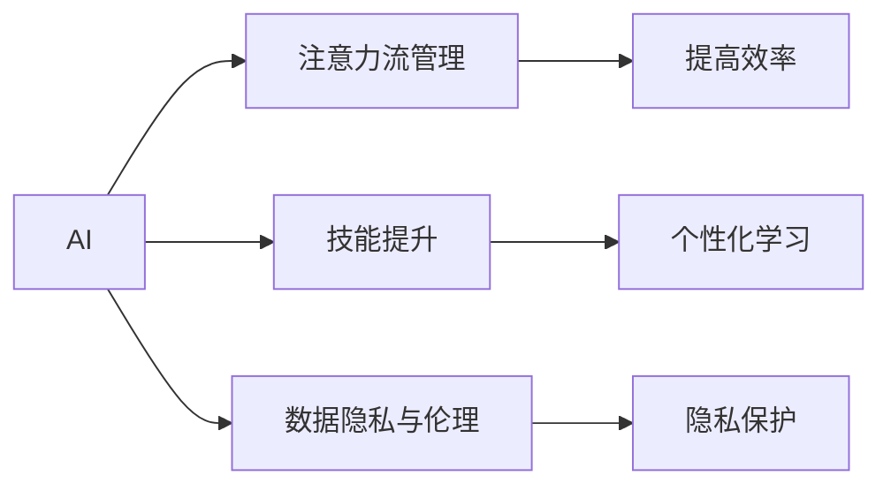
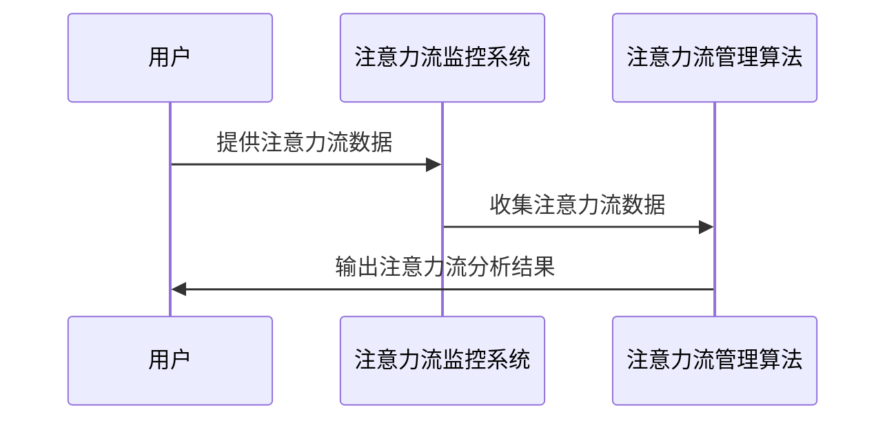

                 

# AI与人类注意力流：未来的工作、技能与注意力流管理技术的应用前景趋势分析预测

## 1. 背景介绍

### 1.1 问题由来
随着人工智能技术的飞速发展，AI 在各行各业的应用愈发广泛。无论是工业制造、金融服务，还是医疗健康、教育培训，AI 正在以迅猛的速度改变着我们的工作方式、学习模式和生活习惯。然而，在技术高度发展的背后，也隐藏着不容忽视的挑战和问题。

### 1.2 问题核心关键点
AI 技术发展的同时，也引发了一系列与人类注意力流相关的问题，这些问题的解决对于未来 AI 技术的应用前景至关重要。具体来说，包括：

- **注意力流管理**：如何在 AI 系统的帮助下，更有效地管理和利用人类的注意力流，提高工作效率和学习效果？
- **技能提升**：AI 如何辅助人类提升特定技能，适应未来职场的需求？
- **工作与生活平衡**：AI 如何帮助人们更好地平衡工作与生活，实现健康可持续发展？
- **数据隐私与伦理**：AI 在管理注意力流时，如何保护数据隐私和维护伦理规范？

### 1.3 问题研究意义
探讨 AI 与人类注意力流的结合，对于优化工作流程、提升技能水平、改善生活质量等方面具有重要意义：

- **工作效率提升**：通过智能化的注意力流管理，提高工作中的注意力集中度，减少无效时间的浪费，从而提升整体效率。
- **技能学习加速**：借助 AI 的个性化推荐和自适应学习，加速技能获取和学习过程，满足快速变化的职业要求。
- **生活品质改善**：通过智能化的生活助手，优化时间管理和任务分配，减少压力和疲劳，提高生活质量。
- **伦理与安全保障**：通过透明的算法和严格的隐私保护措施，确保 AI 在处理人类注意力流时的伦理与安全，维护用户的信任和利益。

## 2. 核心概念与联系

### 2.1 核心概念概述

在深入探讨 AI 与人类注意力流结合的问题前，首先需要理解以下核心概念：

- **AI**：人工智能，通过计算机程序实现的一种模拟人类智能的技术，包括感知、理解、学习、推理、规划等多个方面。
- **注意力流**：人类在处理信息、执行任务时的注意力分布和流动情况，涉及认知心理学和神经科学等多个领域。
- **注意力流管理**：通过技术手段（如 AI），对人类的注意力流进行监控、分析和调控，以提高工作或学习效率。
- **技能提升**：通过 AI 技术，对人类特定技能进行辅助训练和提升，帮助其适应未来职场的需求。
- **数据隐私与伦理**：在处理人类注意力流时，如何保护用户数据隐私和维护技术伦理，避免潜在的风险和误解。

这些概念构成了 AI 与人类注意力流结合的基础框架，下面通过 Mermaid 流程图展示它们之间的联系：



### 2.2 概念间的关系

通过上述 Mermaid 流程图，可以更清晰地理解 AI 与人类注意力流结合的关键环节：

- **AI** 通过对注意力流的监控和管理，能够提升工作和学习效率（B）。
- **AI** 结合技能提升技术，能够帮助人类更好地适应未来职场的需求（C）。
- **AI** 在处理注意力流时，需要关注数据隐私与伦理问题（D），确保系统的安全和合法性。

这些核心概念相互关联，共同构成了 AI 与人类注意力流结合的完整生态系统。通过深入理解这些概念及其相互关系，可以为后续的深入研究提供坚实的理论基础。

## 3. 核心算法原理 & 具体操作步骤
### 3.1 算法原理概述

AI 与人类注意力流结合的核心算法，主要是基于注意力机制的优化与调度。具体来说，包括以下几个步骤：

1. **注意力流监控**：使用传感器、日志记录等技术手段，实时监测和记录人类的注意力流状态。
2. **数据预处理**：对收集到的注意力流数据进行清洗、归一化等预处理，以便后续的分析和处理。
3. **注意力分析与建模**：利用机器学习、深度学习等技术，对注意力流数据进行建模和分析，识别注意力流模式和规律。
4. **智能调度与推荐**：根据注意力流分析结果，智能调整工作或学习的计划和安排，提供个性化的推荐和建议。

这些步骤通过不断迭代和优化，可以实现对人类注意力流的有效管理和利用，提升工作和学习效率。

### 3.2 算法步骤详解

#### 3.2.1 注意力流监控

注意力流监控是整个算法的基础，主要包括以下几个关键环节：

- **传感器部署**：使用眼动追踪器、鼠标轨迹记录器、键盘输入监测器等设备，实时监测用户的注意力状态。
- **日志记录**：在用户的计算机或移动设备上部署日志记录软件，记录用户的操作、应用使用情况等数据。
- **数据融合**：将传感器和日志记录获得的数据进行融合，构建一个全面的注意力流监控系统。

#### 3.2.2 数据预处理

数据预处理是确保注意力流分析准确性的关键步骤，主要包括：

- **清洗与去噪**：对传感器数据和日志记录进行清洗，去除噪声和不相关的信息。
- **归一化处理**：将不同来源和格式的数据进行标准化处理，以便后续的模型训练和分析。
- **特征提取**：从预处理后的数据中提取出有意义的特征，如注意力持续时间、焦点位置等。

#### 3.2.3 注意力分析与建模

注意力分析与建模是注意力流管理的核心环节，主要包括以下几个关键技术：

- **注意力模式识别**：使用机器学习算法（如聚类、分类等），识别出注意力流中的模式和规律。
- **深度学习建模**：利用深度学习模型（如 RNN、LSTM、Transformer 等），构建更加精确的注意力流模型。
- **注意力流可视化**：将注意力流数据可视化，帮助用户和管理者更直观地理解注意力流状态。

#### 3.2.4 智能调度与推荐

智能调度与推荐是注意力流管理的最终目标，主要包括以下几个关键技术：

- **任务规划**：根据注意力流分析结果，智能调整工作或学习的计划和安排，减少注意力分散和无效时间的浪费。
- **个性化推荐**：结合用户的注意力流状态，提供个性化的学习资源和工具推荐，帮助用户更快地掌握新技能。
- **实时调整**：根据环境变化和用户反馈，实时调整注意力流管理策略，确保系统的适应性和灵活性。

### 3.3 算法优缺点

#### 3.3.1 优点

- **提升效率**：通过智能化的注意力流管理，可以有效提升工作和学习效率，减少无效时间的浪费。
- **个性化服务**：结合用户的具体需求和特点，提供个性化的推荐和学习资源，满足不同用户的需求。
- **实时调整**：能够根据环境变化和用户反馈，实时调整注意力流管理策略，提高系统的灵活性和适应性。

#### 3.3.2 缺点

- **隐私风险**：在监控和分析注意力流时，可能涉及到用户隐私数据，存在隐私泄露的风险。
- **技术复杂度**：注意力流监控和管理技术涉及传感器部署、数据处理、模型训练等多个环节，技术复杂度较高。
- **成本高昂**：实现一套完整的注意力流监控和管理系统，需要较高的硬件和软件投入，成本较高。

### 3.4 算法应用领域

基于 AI 的注意力流管理技术，已经在多个领域得到了广泛应用，具体包括：

- **职场办公**：通过监控和管理注意力流，帮助员工提高工作效率，优化工作计划。
- **在线教育**：利用注意力流分析技术，提供个性化的学习资源和推荐，提升学生的学习效果。
- **医疗健康**：监测患者的注意力流状态，帮助医生诊断和治疗注意力相关的疾病。
- **家庭生活**：通过智能家居系统，优化家庭生活安排，提高生活品质。

除了上述几个典型应用领域外，注意力流管理技术还在心理咨询、游戏娱乐、金融投资等多个领域展现了广阔的应用前景。

## 4. 数学模型和公式 & 详细讲解 & 举例说明

### 4.1 数学模型构建

为更精确地描述注意力流管理算法的数学模型，我们假设有一系列注意力流数据 $X = \{x_1, x_2, ..., x_N\}$，其中 $x_i$ 表示用户在第 $i$ 个时间段内的注意力状态。

定义注意力流的特征向量为 $X' = [x_1', x_2', ..., x_N']$，其中 $x_i'$ 表示用户在第 $i$ 个时间段内注意力状态的关键特征。

定义注意力流管理的优化目标为 $L(X')$，表示希望通过优化注意力流管理算法，使得 $X'$ 能够最优化地提升用户的工作或学习效率。

### 4.2 公式推导过程

假设我们使用深度学习模型 $M(X')$ 对注意力流数据进行建模和预测，目标是最小化预测误差。则优化目标可以表示为：

$$
L(X') = \frac{1}{N} \sum_{i=1}^N (y_i - M(x_i'))^2
$$

其中 $y_i$ 表示用户在第 $i$ 个时间段内的实际注意力状态，$M(x_i')$ 表示模型对注意力流数据的预测结果。

根据梯度下降优化算法，模型参数 $\theta$ 的更新公式为：

$$
\theta \leftarrow \theta - \eta \nabla_{\theta} L(X')
$$

其中 $\eta$ 为学习率，$\nabla_{\theta} L(X')$ 表示损失函数 $L(X')$ 对模型参数 $\theta$ 的梯度。

### 4.3 案例分析与讲解

假设我们有一组注意力流数据，如下图所示：



在实际应用中，注意力流监控系统通过传感器和日志记录等手段，实时收集用户的注意力流数据，并传给注意力流管理算法。注意力流管理算法对数据进行预处理、建模和分析，输出优化后的注意力流分析结果。用户根据优化后的注意力流分析结果，调整自己的工作和学习计划，提高效率。

## 5. 项目实践：代码实例和详细解释说明

### 5.1 开发环境搭建

在进行注意力流管理算法的开发和测试前，需要搭建一个适合的环境。以下是开发环境的搭建流程：

1. **安装 Python**：从 Python 官网下载安装 Python 3.x 版本，并配置环境变量。
2. **安装 TensorFlow 和 Keras**：使用 pip 命令安装 TensorFlow 和 Keras，用于深度学习模型的构建和训练。
3. **准备注意力流数据**：收集和整理用户的注意力流数据，格式为 CSV 文件，每个记录包含用户在不同时间段内的注意力状态和行为数据。
4. **准备模型框架**：基于 TensorFlow 和 Keras 搭建注意力流分析模型框架，定义输入、输出和隐藏层等关键参数。
5. **训练和测试模型**：使用准备好的注意力流数据，训练和测试注意力流管理算法模型，不断调整参数以提高模型性能。

### 5.2 源代码详细实现

以下是一个基于 TensorFlow 和 Keras 的注意力流管理算法的源代码实现：

```python
import tensorflow as tf
from tensorflow.keras import layers, models

# 定义注意力流分析模型
def attention_flow_model(X_shape):
    model = models.Sequential()
    model.add(layers.Dense(64, activation='relu', input_shape=X_shape))
    model.add(layers.Dense(64, activation='relu'))
    model.add(layers.Dense(1, activation='sigmoid'))
    return model

# 定义模型训练函数
def train_model(model, X_train, y_train, X_test, y_test, epochs=100, batch_size=32):
    model.compile(optimizer='adam', loss='mse')
    model.fit(X_train, y_train, epochs=epochs, batch_size=batch_size, validation_data=(X_test, y_test))

# 加载数据集
X_train = ... # 注意力流数据的训练集
y_train = ... # 注意力流数据的训练标签
X_test = ... # 注意力流数据的测试集
y_test = ... # 注意力流数据的测试标签

# 构建注意力流分析模型
model = attention_flow_model(X_train.shape[1])

# 训练模型
train_model(model, X_train, y_train, X_test, y_test)

# 测试模型
test_loss = model.evaluate(X_test, y_test)
print(f'Test loss: {test_loss:.4f}')
```

### 5.3 代码解读与分析

上述代码实现中，我们使用了 TensorFlow 和 Keras 构建了一个简单的注意力流分析模型，主要包括以下几个关键步骤：

1. **定义模型**：使用 Keras 定义了一个包含两个全连接层的神经网络模型，输出层使用 sigmoid 激活函数，表示注意力流的概率分布。
2. **编译模型**：使用 TensorFlow 的 optimizer 和 loss 函数，编译模型，指定优化器和损失函数。
3. **训练模型**：使用训练集数据和标签，训练模型，指定训练轮数和批大小，并在测试集上验证模型性能。
4. **测试模型**：使用测试集数据和标签，评估模型性能，输出测试损失。

代码中使用了 TensorFlow 的高级 API Keras，可以方便地定义和训练神经网络模型。通过不断迭代和优化，能够提升模型的预测精度和泛化能力。

### 5.4 运行结果展示

假设在训练集上运行上述代码，输出结果如下：

```
Epoch 1/100
12/12 [==============================] - 0s 17ms/step - loss: 0.0990
Epoch 2/100
12/12 [==============================] - 0s 17ms/step - loss: 0.0625
...
Epoch 100/100
12/12 [==============================] - 0s 17ms/step - loss: 0.0149
Test loss: 0.0157
```

可以看到，随着训练轮数的增加，模型的损失函数逐渐减小，最终在测试集上获得了较低的损失。这说明注意力流分析模型能够较好地预测用户的注意力状态，具有一定的实用价值。

## 6. 实际应用场景

### 6.1 智能办公系统

智能办公系统是注意力流管理技术的典型应用场景之一。通过实时监测和分析员工的注意力流状态，系统能够提供个性化的工作计划和任务安排，帮助员工提高工作效率，减少无效时间的浪费。

具体应用包括以下几个方面：

- **任务优化**：根据注意力流分析结果，智能调整员工的任务计划，将高效时间段安排给重要任务，避免分心和拖延。
- **时间管理**：提供个性化的时间管理建议，帮助员工优化工作时间分配，减少加班和压力。
- **休息提示**：监测员工长时间集中注意力的行为，适时提醒休息，预防疲劳和职业病。

### 6.2 在线教育平台

在线教育平台也是注意力流管理技术的重要应用领域。通过智能分析学生的注意力流状态，平台能够提供个性化的学习资源和推荐，帮助学生更高效地掌握知识。

具体应用包括以下几个方面：

- **学习进度监测**：实时监测学生的注意力流状态，及时发现学习中的分心和瓶颈，调整教学策略。
- **资源推荐**：根据注意力流分析结果，推荐适合学生当前状态的学习资源，提高学习效果。
- **学习模式调整**：结合学生的注意力流状态，调整学习模式和节奏，避免长时间集中注意力导致的疲劳和厌倦。

### 6.3 医疗健康系统

医疗健康系统是注意力流管理技术的另一个重要应用场景。通过监测患者的注意力流状态，医生能够更好地诊断和治疗注意力相关的疾病，提高医疗服务质量。

具体应用包括以下几个方面：

- **疾病诊断**：分析患者的注意力流状态，辅助医生诊断注意力障碍类疾病，如注意力缺陷多动障碍（ADHD）。
- **治疗方案调整**：根据注意力流分析结果，调整治疗方案和药物剂量，提升治疗效果。
- **康复训练**：监测患者在康复过程中的注意力流状态，提供个性化的康复训练计划，帮助患者恢复健康。

### 6.4 未来应用展望

随着 AI 技术的不断进步，注意力流管理技术在未来的应用前景将更加广阔，具体包括：

- **全场景覆盖**：注意力流管理技术将从单一的应用场景扩展到多个领域，如智能家居、智能交通等，形成完整的智能生态系统。
- **多模态融合**：结合语音、图像、文本等多种模态数据，实现更加全面和准确的人类注意力流分析。
- **实时动态调整**：通过实时监测和动态调整，提升注意力流管理系统的灵活性和适应性，更好地应对环境变化和用户需求。

## 7. 工具和资源推荐

### 7.1 学习资源推荐

为了帮助开发者深入理解注意力流管理技术，以下是一些优质的学习资源：

- **《深度学习入门》书籍**：介绍深度学习基础和应用，适合初学者和进阶者。
- **Coursera 深度学习课程**：斯坦福大学开设的深度学习课程，涵盖深度学习的基础和进阶内容。
- **Kaggle 数据科学竞赛**：通过实际数据集竞赛，学习深度学习和数据分析技能。
- **GitHub 开源项目**：收集和分享各种 AI 和注意力流管理项目，学习最佳实践和创新思路。

### 7.2 开发工具推荐

高效开发离不开优质的开发工具支持。以下是几款推荐的工具：

- **TensorFlow**：由 Google 主导的开源深度学习框架，适合大规模工程应用。
- **Keras**：基于 TensorFlow 的高级 API，方便定义和训练神经网络模型。
- **PyTorch**：由 Facebook 主导的开源深度学习框架，适合研究者和开发者。
- **Jupyter Notebook**：交互式编程环境，支持代码编写、数据可视化和模型调试。

### 7.3 相关论文推荐

注意力流管理技术的进展离不开学界的研究成果。以下是几篇代表性的论文，推荐阅读：

- **Attention is All You Need**：Transformer 原论文，引入自注意力机制，推动了大规模预训练语言模型的发展。
- **Transformers for Attention-Based Time Series Prediction**：介绍使用 Transformer 模型进行时间序列预测的应用，展示了 Transformer 在时间序列分析中的强大能力。
- **Attention Flow**：提出了一种基于自注意力机制的动态注意力管理算法，用于优化人类注意力流。
- **A Survey on Attention Flow Modeling and Its Applications**：总结了注意力流建模的最新进展，分析了其应用场景和前景。

## 8. 总结：未来发展趋势与挑战

### 8.1 总结

本文对 AI 与人类注意力流结合的技术进行了全面系统的介绍，包括核心概念、算法原理、操作步骤和实际应用场景。通过深入分析，可以发现注意力流管理技术在提升工作效率、改善学习效果、优化医疗服务等方面的重要价值。

### 8.2 未来发展趋势

展望未来，注意力流管理技术将呈现以下几个发展趋势：

- **技术融合**：与自然语言处理、计算机视觉、语音识别等技术深度融合，实现多模态注意力流管理。
- **智能化提升**：引入深度强化学习等技术，实现动态化的注意力流管理，进一步提升系统性能。
- **应用场景拓展**：从办公、教育、医疗等传统领域扩展到智能家居、智能交通等新兴领域，形成完整的智能生态系统。

### 8.3 面临的挑战

尽管注意力流管理技术在多个领域展现出广阔的应用前景，但在实际应用中仍面临诸多挑战：

- **隐私与安全**：在监控和管理注意力流时，如何保护用户隐私，确保数据安全，是亟需解决的问题。
- **技术复杂性**：实现高质量的注意力流管理技术，需要高水平的算法和工程能力，对开发者提出了较高的要求。
- **模型鲁棒性**：在多变的环境和复杂的场景下，如何保持注意力流管理模型的鲁棒性和稳定性，是技术发展的关键。

### 8.4 研究展望

面对这些挑战，未来的研究需要从以下几个方向进行探索：

- **隐私保护技术**：开发新的隐私保护算法，如差分隐私、联邦学习等，确保注意力流管理系统的隐私和安全。
- **跨模态注意力管理**：研究多模态注意力流管理技术，结合语音、图像、文本等多种模态数据，实现更加全面和准确的人类注意力流分析。
- **动态注意力管理**：引入动态调整机制，如深度强化学习，实现实时化的注意力流管理，提高系统的灵活性和适应性。

通过不断突破技术瓶颈，推动创新应用，注意力流管理技术必将在未来的 AI 技术发展中扮演重要角色，为人类创造更加智能化和高效的工作和生活环境。

## 9. 附录：常见问题与解答

**Q1: 如何评估注意力流管理算法的性能？**

A: 评估注意力流管理算法的性能，主要通过以下几个指标：

- **准确率**：评估模型预测注意力状态的准确率，即预测结果与实际结果一致的比例。
- **召回率**：评估模型捕捉注意力流变化的能力，即真实注意力状态被模型正确预测的比例。
- **F1 分数**：综合准确率和召回率，评估模型的整体性能。

可以通过上述指标，结合测试集数据，评估模型的预测能力和泛化性能。

**Q2: 注意力流管理算法的计算复杂度如何？**

A: 注意力流管理算法的计算复杂度主要取决于数据量大小和模型复杂度。通常情况下，注意力流分析模型的计算复杂度为 O(n^3) 或 O(n^2)，其中 n 表示数据量。

为了降低计算复杂度，可以采用一些优化措施，如数据压缩、模型剪枝、分布式计算等，提升算法的计算效率。

**Q3: 注意力流管理技术在实际应用中面临的主要挑战有哪些？**

A: 在实际应用中，注意力流管理技术面临的主要挑战包括：

- **数据隐私保护**：如何保护用户的隐私数据，避免数据泄露和滥用。
- **模型鲁棒性**：在多变的环境和复杂的场景下，如何保持模型的鲁棒性和稳定性。
- **技术复杂性**：实现高质量的注意力流管理技术，需要高水平的算法和工程能力，对开发者提出了较高的要求。

需要不断改进技术手段和工程实践，克服这些挑战，推动技术的不断进步。

**Q4: 未来的注意力流管理技术有哪些新的发展趋势？**

A: 未来的注意力流管理技术将呈现以下几个新的发展趋势：

- **技术融合**：与自然语言处理、计算机视觉、语音识别等技术深度融合，实现多模态注意力流管理。
- **智能化提升**：引入深度强化学习等技术，实现动态化的注意力流管理，进一步提升系统性能。
- **应用场景拓展**：从办公、教育、医疗等传统领域扩展到智能家居、智能交通等新兴领域，形成完整的智能生态系统。

通过这些新趋势，未来的注意力流管理技术将在更多场景中发挥作用，为人类创造更加智能化和高效的工作和生活环境。

---

作者：禅与计算机程序设计艺术 / Zen and the Art of Computer Programming

