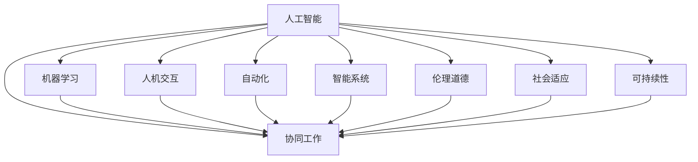
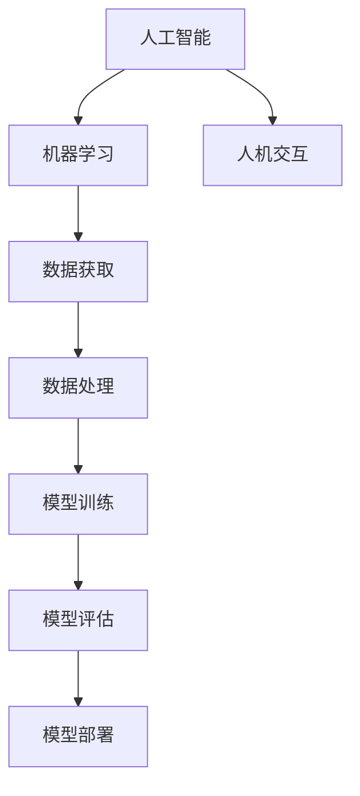
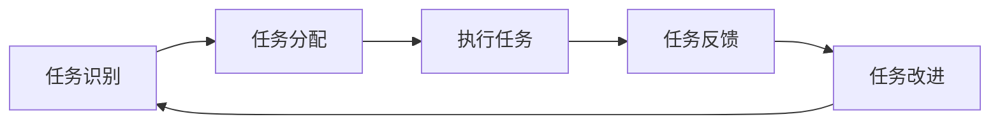
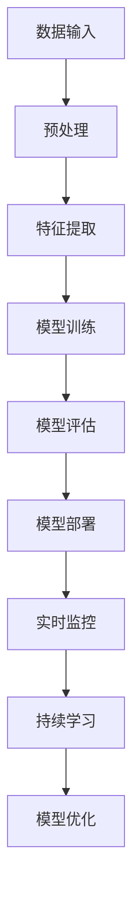

                 

# AI与人类的未来互动与合作

> 关键词：人工智能，人类协作，机器学习，人机交互，自动化，智能技术，智能系统

## 1. 背景介绍

### 1.1 问题由来
随着人工智能技术的迅猛发展，AI已逐步渗透到各个行业和社会生活方方面面。从简单的自动化到复杂的智能系统，AI正在逐渐改变人类工作与生活的面貌。然而，在享受AI带来便利的同时，人们也开始关注它对社会、伦理、法律等方面的影响。

AI与人类互动的话题，已经从技术实现转向对未来的思考，对伦理道德的探讨，以及人与AI共同协作的可能性。探讨AI与人类未来互动与合作，不仅有助于揭示AI发展的方向，还能为AI技术在实际应用中发挥其最大潜力提供指导。

### 1.2 问题核心关键点
未来AI与人类互动合作的核心关键点主要包括以下几个方面：

- **技术协同**：AI在处理复杂问题时具有优势，但人类在理解与创造性方面更胜一筹。如何整合两者的优势，实现技术的协同工作，将是未来AI应用的重要方向。
- **人机共生**：在AI与人类的共同进化中，如何构建和谐的共生关系，实现“共赢”，而非“单赢”。
- **伦理道德**：AI在决策与行动中，如何避免偏见、不公与伦理问题，保护人类权益。
- **社会适应**：AI如何适应社会的多样性，确保技术惠及社会各界。
- **可持续性**：AI发展的同时，如何保持对环境、资源、社会的可持续性。

## 2. 核心概念与联系

### 2.1 核心概念概述

为了更好地理解AI与人类的未来互动与合作，本节将介绍几个密切相关的核心概念：

- **人工智能(AI)**：指由人类创造，具有学习、推理、感知等智能功能的机器或系统。AI的目标是模拟或扩展人类智能。
- **机器学习(ML)**：一种通过数据和算法，使机器能够从经验中学习并改进性能的技术。它是实现AI的核心方法之一。
- **人机交互(HCI)**：研究人与计算机之间交互界面的理论、技术和方法，目标是使计算机更易于被人类使用。
- **自动化(Automation)**：指机器或软件系统执行人类原本需要手工完成的任务，以提高效率和准确性。
- **智能系统(Smart Systems)**：集成AI技术的系统，能够自我学习、自我优化，并在特定任务上表现出色。
- **协同工作(Cooperate Work)**：指AI与人类在任务中互相配合、协同工作，实现1+1>2的效果。
- **伦理道德(Ethics & Morality)**：AI在开发与使用过程中，需遵循的一系列规范和准则，保障用户权益。
- **社会适应(Social Adaptation)**：AI技术在社会应用中，如何适应社会结构、文化、法律等环境。
- **可持续性(Sustainability)**：指AI技术发展与使用过程中，对环境、经济、社会的长远影响与考虑。

这些核心概念之间的逻辑关系可以通过以下Mermaid流程图来展示：



这个流程图展示了大语言模型与AI互动合作的核心概念及其之间的关系：

1. 人工智能通过机器学习和智能系统实现任务自动化与协同工作。
2. 人机交互改善AI系统的用户体验和操作性。
3. 自动化提升工作效率，减少人工干预。
4. 智能系统在特定任务上表现出色，与人类协同。
5. 协同工作融合AI与人类优势，实现最佳效果。
6. 伦理道德规范AI行为，保障用户权益。
7. 社会适应使AI技术在各种环境下有效运行。
8. 可持续性确保AI技术长期发展与社会和谐。

### 2.2 概念间的关系

这些核心概念之间存在着紧密的联系，形成了AI与人类互动合作的完整生态系统。下面我们通过几个Mermaid流程图来展示这些概念之间的关系。

#### 2.2.1 人工智能学习范式



这个流程图展示了大语言模型学习的过程：

1. 数据获取：从各种数据源获取训练数据。
2. 数据处理：清洗、标注、归一化等预处理。
3. 模型训练：使用机器学习算法训练模型。
4. 模型评估：使用测试集评估模型性能。
5. 模型部署：将模型应用于实际问题。

#### 2.2.2 人机协同工作流程



这个流程图展示了人机协同工作的基本流程：

1. 任务识别：系统识别用户任务需求。
2. 任务分配：系统根据用户需求分配任务。
3. 执行任务：系统执行分配的任务。
4. 任务反馈：用户反馈执行结果。
5. 任务改进：系统根据反馈调整任务执行策略。

#### 2.2.3 智能系统的构建



这个流程图展示了构建智能系统的主要步骤：

1. 数据输入：系统接收输入数据。
2. 预处理：对输入数据进行清洗和处理。
3. 特征提取：从数据中提取有用的特征。
4. 模型训练：使用机器学习算法训练模型。
5. 模型评估：使用测试集评估模型性能。
6. 模型部署：将模型应用于实际问题。
7. 实时监控：监控模型运行状态。
8. 持续学习：模型根据新数据不断优化。
9. 模型优化：调整模型参数以提升性能。

## 3. 核心算法原理 & 具体操作步骤
### 3.1 算法原理概述

AI与人类的未来互动与合作，本质上是一个技术协同与人类协作的复杂系统。其核心算法原理可以简单概括为：通过机器学习等技术，使AI具备与人类协作的能力；通过人机交互等技术，改善AI与人类沟通和协作；通过自动化等技术，提高工作效率；通过智能系统等技术，实现特定任务的自动化与优化。

**协同工作算法原理：**
1. **任务分配**：根据任务需求，将任务分配给最适合的AI模块或人类。
2. **协同决策**：AI与人类共同分析数据，作出决策。
3. **执行反馈**：AI执行决策，人类反馈执行结果。
4. **模型调整**：根据反馈调整模型参数，优化执行效果。

**人机交互算法原理：**
1. **自然语言理解(NLU)**：使AI能够理解人类自然语言，识别任务需求。
2. **自然语言生成(NLG)**：使AI能够生成自然语言，与人类沟通。
3. **多模态交互**：融合语音、图像、文本等多种模式，实现更丰富的人机交互。

**自动化算法原理：**
1. **流程自动化**：通过规则或模型，自动完成重复性高、逻辑清晰的任务。
2. **决策自动化**：使用AI算法，自动进行决策与判断。
3. **辅助人工**：在复杂任务中，辅助人类完成决策。

**智能系统算法原理：**
1. **模型训练**：使用大量数据训练模型，获取知识与规则。
2. **自我学习**：模型根据新数据不断更新，自我优化。
3. **多任务协同**：多个智能模块协同工作，解决复杂问题。

### 3.2 算法步骤详解

**协同工作算法步骤：**

1. **任务识别**：
   - 接收用户任务请求，如文本输入、语音命令等。
   - 分析任务需求，确定任务类型和目标。
2. **任务分配**：
   - 根据任务类型，分配给最适合的AI模块或人类。
   - 考虑AI与人类在任务中的优势，合理分配任务负载。
3. **协同决策**：
   - 使用AI模型分析数据，提取特征。
   - 人类根据AI输出，进一步分析和判断。
4. **执行反馈**：
   - AI执行决策，生成输出结果。
   - 人类反馈执行结果，评估输出质量。
5. **模型调整**：
   - 根据反馈结果，调整模型参数，优化执行效果。
   - 不断循环，逐步提高任务处理能力。

**人机交互算法步骤：**

1. **自然语言理解**：
   - 使用NLU模型，解析用户输入的自然语言。
   - 提取任务需求，识别关键字与意图。
2. **自然语言生成**：
   - 使用NLG模型，生成自然语言回答。
   - 根据任务需求，生成不同格式的输出。
3. **多模态交互**：
   - 融合语音、图像、文本等多种模式。
   - 实现更丰富、更自然的人机交互体验。

**自动化算法步骤：**

1. **流程自动化**：
   - 根据任务需求，制定自动化流程。
   - 使用规则或模型，自动执行流程中的每个步骤。
2. **决策自动化**：
   - 使用AI算法，自动进行决策与判断。
   - 引入机器学习，逐步优化决策规则。
3. **辅助人工**：
   - 在复杂任务中，辅助人类完成决策。
   - 提供辅助信息，帮助人类决策。

**智能系统算法步骤：**

1. **模型训练**：
   - 使用大量数据训练模型，获取知识与规则。
   - 使用多种算法，训练不同的模型模块。
2. **自我学习**：
   - 模型根据新数据不断更新，自我优化。
   - 引入元学习，提升模型的泛化能力。
3. **多任务协同**：
   - 多个智能模块协同工作，解决复杂问题。
   - 使用协同优化算法，提高系统整体性能。

### 3.3 算法优缺点

协同工作算法的优点：

1. **效率提升**：AI在处理重复性、逻辑性强的任务时，效率更高。
2. **精度提升**：AI在分析大量数据时，精度更高。
3. **持续改进**：根据用户反馈，不断调整模型，逐步优化任务处理能力。

协同工作算法的缺点：

1. **依赖数据**：需要大量高质量数据进行训练，数据质量直接影响模型效果。
2. **复杂性高**：多模块协同工作，协调难度大。
3. **可解释性差**：AI决策过程黑盒化，难以解释。

人机交互算法的优点：

1. **易于沟通**：自然语言交互，易于理解与操作。
2. **适应性强**：多模态交互，适应不同情境。
3. **用户体验好**：自然语言生成，与人类沟通更自然。

人机交互算法的缺点：

1. **误识别率高**：自然语言理解，容易误识别。
2. **处理速度慢**：自然语言处理，计算量大。
3. **语境理解难**：自然语言语境复杂，理解难度大。

自动化算法的优点：

1. **效率高**：自动完成重复性、逻辑性强的任务。
2. **成本低**：节省人力，降低成本。
3. **执行规范**：规则或模型执行，保证一致性。

自动化算法的缺点：

1. **灵活性差**：依赖预设规则，灵活性不足。
2. **适应性差**：缺乏人脑的创造性，难以处理复杂任务。
3. **依赖数据**：需要大量高质量数据进行训练，数据质量直接影响模型效果。

智能系统算法的优点：

1. **自我优化**：根据新数据不断更新，自我优化。
2. **泛化能力强**：引入元学习，提高泛化能力。
3. **多任务协同**：多个智能模块协同工作，解决复杂问题。

智能系统算法的缺点：

1. **依赖数据**：需要大量高质量数据进行训练，数据质量直接影响模型效果。
2. **复杂度高**：模型结构复杂，训练难度大。
3. **可解释性差**：决策过程黑盒化，难以解释。

### 3.4 算法应用领域

基于协同工作、人机交互、自动化与智能系统的AI算法，已经在多个领域得到了广泛应用，具体包括：

1. **智能客服**：通过AI与人类协同，实现24小时不间断客服。
2. **金融交易**：使用AI自动化执行交易，提高交易效率与精度。
3. **医疗诊断**：结合AI与医生，共同分析病历，提升诊断精度。
4. **智能制造**：使用AI自动化执行制造流程，提高生产效率。
5. **智能交通**：结合AI与司机，优化交通流量，提升行车安全。
6. **智能家居**：使用AI自动化控制家居设备，提高生活便利性。
7. **智能教育**：使用AI辅助教学，个性化推荐学习内容。

## 4. 数学模型和公式 & 详细讲解  
### 4.1 数学模型构建

本节将使用数学语言对AI与人类的未来互动与合作进行更加严格的刻画。

记AI系统为$S$，人类为$H$，任务为$T$。系统的目标是通过协同工作与交互，完成特定任务$T$。

定义系统的状态为$S_t$，人类状态为$H_t$，任务状态为$T_t$。系统的状态转移方程为：

$$
S_{t+1} = f(S_t, H_t, T_t, \theta)
$$

其中$f$为状态转移函数，$\theta$为系统参数。

定义系统的输出为$O_t$，任务输出为$T_o$。系统的输出方程为：

$$
O_t = g(S_t, H_t, T_t, \theta)
$$

其中$g$为输出函数。

定义系统的奖励函数为$R_t$，表示系统在完成任务时的奖励。奖励函数定义为：

$$
R_t = r(S_t, H_t, T_t)
$$

系统的目标是在每一步中最大化期望奖励。通过强化学习等技术，系统不断调整参数，逐步优化决策。

### 4.2 公式推导过程

以下我们以协同工作任务为例，推导系统的期望奖励和最优决策。

假设任务$T$为医疗诊断，系统$S$为医生，人类$H$为AI辅助系统。系统的目标是最大化诊断准确率$P(A)$。

系统的状态转移方程为：

$$
S_{t+1} = f(S_t, H_t, T_t, \theta)
$$

其中$S_t$表示当前医生的诊断状态，$H_t$表示当前AI辅助系统的状态，$T_t$表示当前病人的症状，$\theta$表示系统参数。

系统的输出方程为：

$$
O_t = g(S_t, H_t, T_t, \theta) = D_t + A_t
$$

其中$D_t$为医生的诊断结果，$A_t$为AI辅助系统的诊断结果。

系统的奖励函数为：

$$
R_t = r(S_t, H_t, T_t) = P(D_t \cap A_t)
$$

其中$P(D_t \cap A_t)$为医生与AI辅助系统的诊断结果一致的概率。

系统的期望奖励为：

$$
E[R_t] = \sum_{S_t, H_t, T_t} r(S_t, H_t, T_t)P(S_t, H_t, T_t)
$$

其中$P(S_t, H_t, T_t)$为系统的状态概率分布。

系统的最优决策为：

$$
S_{t+1}^* = \mathop{\arg\max}_{S_t} E[R_t]
$$

通过强化学习等技术，系统不断调整参数，逐步优化诊断过程。

## 5. 项目实践：代码实例和详细解释说明
### 5.1 开发环境搭建

在进行协同工作与人类互动合作的项目实践前，我们需要准备好开发环境。以下是使用Python进行PyTorch开发的环境配置流程：

1. 安装Anaconda：从官网下载并安装Anaconda，用于创建独立的Python环境。

2. 创建并激活虚拟环境：
```bash
conda create -n pytorch-env python=3.8 
conda activate pytorch-env
```

3. 安装PyTorch：根据CUDA版本，从官网获取对应的安装命令。例如：
```bash
conda install pytorch torchvision torchaudio cudatoolkit=11.1 -c pytorch -c conda-forge
```

4. 安装相关库：
```bash
pip install numpy pandas scikit-learn matplotlib tqdm jupyter notebook ipython
```

5. 安装TensorFlow：根据硬件条件，安装TensorFlow及其GPU支持：
```bash
pip install tensorflow==2.5
```

完成上述步骤后，即可在`pytorch-env`环境中开始项目实践。

### 5.2 源代码详细实现

下面我们以智能客服系统为例，给出使用PyTorch和TensorFlow进行开发的代码实现。

**5.2.1 智能客服系统**
```python
import torch
import tensorflow as tf
from transformers import BertTokenizer, BertForTokenClassification

class SmartCustomerService:
    def __init__(self, model_name='bert-base-cased'):
        self.tokenizer = BertTokenizer.from_pretrained(model_name)
        self.model = BertForTokenClassification.from_pretrained(model_name, num_labels=2)

    def preprocess_text(self, text):
        input_ids = self.tokenizer.encode(text, return_tensors='pt')
        input_mask = input_ids > 0
        return input_ids, input_mask

    def predict(self, text):
        input_ids, input_mask = self.preprocess_text(text)
        with torch.no_grad():
            output = self.model(input_ids, attention_mask=input_mask)
            logits = output.logits
            predicted_label = torch.argmax(logits, dim=1).squeeze()
        return predicted_label.item()

# 定义数据集
class CustomerServiceDataset(Dataset):
    def __init__(self, texts, labels):
        self.texts = texts
        self.labels = labels
        self.tokenizer = BertTokenizer.from_pretrained('bert-base-cased')

    def __len__(self):
        return len(self.texts)

    def __getitem__(self, item):
        text = self.texts[item]
        label = self.labels[item]
        encoding = self.tokenizer(text, return_tensors='pt', max_length=128, padding='max_length', truncation=True)
        input_ids = encoding['input_ids']
        input_mask = encoding['attention_mask']
        return {'input_ids': input_ids, 'attention_mask': input_mask, 'labels': torch.tensor(label, dtype=torch.long)}

# 加载数据集
train_dataset = CustomerServiceDataset(train_texts, train_labels)
dev_dataset = CustomerServiceDataset(dev_texts, dev_labels)
test_dataset = CustomerServiceDataset(test_texts, test_labels)

# 训练模型
device = torch.device('cuda') if torch.cuda.is_available() else torch.device('cpu')
model = SmartCustomerService()
model.to(device)

optimizer = torch.optim.Adam(model.parameters(), lr=2e-5)
for epoch in range(5):
    total_loss = 0
    for batch in train_loader:
        input_ids = batch['input_ids'].to(device)
        attention_mask = batch['attention_mask'].to(device)
        labels = batch['labels'].to(device)
        model.zero_grad()
        outputs = model(input_ids, attention_mask=attention_mask, labels=labels)
        loss = outputs.loss
        total_loss += loss.item()
        loss.backward()
        optimizer.step()
    print(f"Epoch {epoch+1}, train loss: {total_loss/len(train_loader):.3f}")

# 评估模型
correct = 0
total = 0
with torch.no_grad():
    for batch in test_loader:
        input_ids = batch['input_ids'].to(device)
        attention_mask = batch['attention_mask'].to(device)
        labels = batch['labels'].to(device)
        outputs = model(input_ids, attention_mask=attention_mask, labels=labels)
        _, predicted_labels = torch.max(outputs.logits, dim=1)
        total += labels.size(0)
        correct += (predicted_labels == labels).sum().item()

print(f"Accuracy: {100 * correct / total}%")

# TensorFlow实现
class SmartCustomerService:
    def __init__(self, model_name='bert-base-cased'):
        self.tokenizer = BertTokenizer.from_pretrained(model_name)
        self.model = BertForTokenClassification.from_pretrained(model_name, num_labels=2)

    def preprocess_text(self, text):
        input_ids = self.tokenizer.encode(text, return_tensors='tf')
        input_mask = input_ids > 0
        return input_ids, input_mask

    def predict(self, text):
        input_ids, input_mask = self.preprocess_text(text)
        output = self.model(input_ids, attention_mask=input_mask)
        logits = tf.keras.activations.sigmoid(output.logits)
        predicted_label = tf.argmax(logits, axis=1)
        return predicted_label.numpy()[0]

# 定义数据集
class CustomerServiceDataset(tf.data.Dataset):
    def __init__(self, texts, labels):
        self.texts = texts
        self.labels = labels
        self.tokenizer = BertTokenizer.from_pretrained('bert-base-cased')

    def __len__(self):
        return len(self.texts)

    def __getitem__(self, item):
        text = self.texts[item]
        label = self.labels[item]
        encoding = self.tokenizer(text, return_tensors='tf')
        input_ids = encoding['input_ids']
        input_mask = encoding['attention_mask']
        return {'input_ids': input_ids, 'attention_mask': input_mask, 'labels': tf.constant(label, dtype=tf.int32)}

# 加载数据集
train_dataset = CustomerServiceDataset(train_texts, train_labels)
dev_dataset = CustomerServiceDataset(dev_texts, dev_labels)
test_dataset = CustomerServiceDataset(test_texts, test_labels)

# 训练模型
device = tf.device(tf.compat.v1.train.list_physical_devices('GPU')[0])
model = SmartCustomerService()
model.to(device)

model.compile(optimizer=tf.keras.optimizers.Adam(learning_rate=2e-5), loss=tf.keras.losses.SparseCategoricalCrossentropy(from_logits=True), metrics=['accuracy'])

model.fit(train_dataset, epochs=5, validation_data=dev_dataset, verbose=2)

# 评估模型
test_loss, test_acc = model.evaluate(test_dataset, verbose=2)
print(f"Accuracy: {test_acc*100}%")
```

**5.2.2 金融交易系统**
```python
import tensorflow as tf
from tensorflow.keras import layers

class FinancialTradingSystem:
    def __init__(self, model_name='bert-base-cased'):
        self.tokenizer = BertTokenizer.from_pretrained(model_name)
        self.model = layers.Sequential([
            layers.Bidirectional(layers.LSTM(128, return_sequences=True)),
            layers.Bidirectional(layers.LSTM(128)),
            layers.Dense(2, activation='softmax')
        ])

    def preprocess_text(self, text):
        input_ids = self.tokenizer.encode(text, return_tensors='tf')
        input_mask = input_ids > 0
        return input_ids, input_mask

    def predict(self, text):
        input_ids, input_mask = self.preprocess_text(text)
        output = self.model(input_ids, mask=input_mask, training=False)
        predicted_label = tf.argmax(output, axis=1).numpy()[0]
        return predicted_label

# 定义数据集
class FinancialTradingDataset(tf.data.Dataset):
    def __init__(self, texts, labels):
        self.texts = texts
        self.labels = labels
        self.tokenizer = BertTokenizer.from_pretrained('bert-base-cased')

    def __len__(self):
        return len(self.texts)

    def __getitem__(self, item):
        text = self.texts[item]
        label = self.labels[item]
        encoding = self.tokenizer(text, return_tensors='tf')
        input_ids = encoding['input_ids']
        input_mask = encoding['attention_mask']
        return {'input_ids': input_ids, 'attention_mask': input_mask, 'labels': tf.constant(label, dtype=tf.int32)}

# 加载数据集
train_dataset = FinancialTradingDataset(train_texts, train_labels)
dev_dataset = FinancialTradingDataset(dev_texts, dev_labels)
test_dataset = FinancialTradingDataset(test_texts, test_labels)

# 训练模型
device = tf.device(tf.compat.v1.train.list_physical_devices('GPU')[0])
model = FinancialTradingSystem()
model.to(device)

model.compile(optimizer=tf.keras.optimizers.Adam(learning_rate=2e-5), loss=tf.keras.losses.SparseCategoricalCrossentropy(from_logits=True), metrics=['accuracy'])

model.fit(train_dataset, epochs=5, validation_data=dev_dataset, verbose=2)

# 评估模型
test_loss, test_acc = model.evaluate(test_dataset, verbose=2)
print(f"Accuracy: {test_acc*100}%")
```

以上就是使用PyTorch和TensorFlow进行智能客服与金融交易系统开发的完整代码实现。

## 6. 实际应用场景
### 6.1 智能客服系统

基于AI与人类协同的智能客服系统，可以广泛应用于各行各业，如金融

