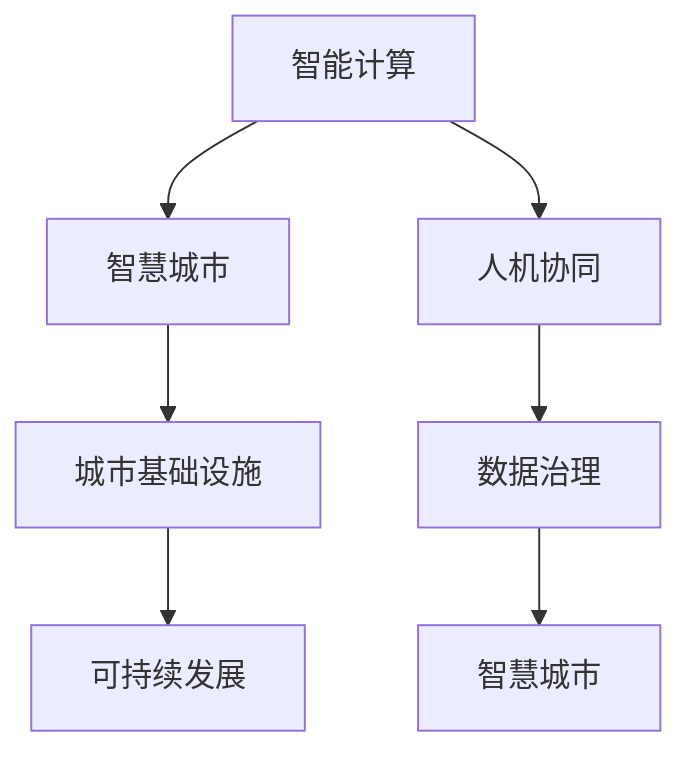

                 

## 1. 背景介绍

随着人工智能技术的迅猛发展，AI与人类的交互方式和内容日益丰富，对社会生产和生活方式产生了深远影响。智能计算、智能决策、智能交互正在重塑城市发展模式，引领人类社会向智慧城市迈进。然而，城市规模不断扩大、人口数量持续增加、环境资源紧张等因素，使得智能计算与可持续发展的挑战并存。

本篇文章将详细探讨AI与人类计算如何构建可持续发展的城市生活方式与基础设施，解析其中的技术原理、应用案例与挑战，为城市智能化发展提供新的思路与方向。

## 2. 核心概念与联系

### 2.1 核心概念概述

1. **智能计算（Smart Computing）**：基于大数据和人工智能的计算技术，用于提升城市决策、管理、服务等领域的智能化水平。
2. **智慧城市（Smart City）**：以智能计算为基础，实现城市运行的高效、安全、环保与可持续发展。
3. **城市基础设施（Urban Infrastructure）**：包括交通、能源、水利、环保等城市发展的硬件支撑。
4. **可持续发展（Sustainable Development）**：在满足城市发展需求的同时，保护环境资源，实现经济、社会、环境的协调发展。
5. **人机协同（Human-Machine Collaboration）**：结合人工智能和人类智慧，提升城市管理与服务的智能化水平。
6. **数据治理（Data Governance）**：管理与维护城市智能化运行的数据资源，保障数据安全与隐私。

### 2.2 核心概念间的关系

通过以下Mermaid流程图展示智能计算、智慧城市、城市基础设施、可持续发展、人机协同和数据治理之间的逻辑联系：



这个流程图展示了从智能计算到智慧城市，再到城市基础设施和可持续发展的整个过程。智能计算是智慧城市的基础，城市基础设施是智慧城市运行的保障，而数据治理则确保了智慧城市的安全可靠。人机协同则是将智能计算与人类智慧结合，共同提升城市服务与决策。

## 3. 核心算法原理 & 具体操作步骤

### 3.1 算法原理概述

AI与人类计算的可持续城市发展过程，涉及数据收集、模型训练、决策支持、服务优化等多个环节。其中，数据驱动是核心，智能模型是基础，人机协同是关键。

在数据驱动方面，通过城市物联网（IoT）、传感器网络等技术收集城市运行的各种数据，如交通流量、能源消耗、环境质量等。在智能模型方面，采用深度学习、强化学习等技术对城市运行进行建模，实现智能预测与优化。在人机协同方面，结合AI与人类专家的智慧，进行协同决策与服务优化。

### 3.2 算法步骤详解

1. **数据采集与预处理**：通过城市物联网等技术，采集城市运行的相关数据，并进行清洗、去重、标准化等预处理，形成高质量的数据集。
2. **智能模型构建**：根据城市发展需求，构建适合的智能模型。如交通流量预测模型、能源消耗优化模型、环境质量评估模型等。
3. **模型训练与优化**：利用大数据和智能算法，对模型进行训练与优化，提升模型预测与优化能力。
4. **协同决策与服务优化**：结合AI与人类专家智慧，进行协同决策，优化城市服务与资源配置。
5. **动态更新与迭代**：根据实时数据，持续更新模型，优化决策与服务，确保城市发展与环境保护的协调统一。

### 3.3 算法优缺点

#### 优点：

1. **数据驱动**：智能计算以大量城市数据为基础，能够实现精准预测与优化。
2. **模型智能**：采用深度学习、强化学习等先进算法，提升模型的智能化水平。
3. **协同决策**：结合AI与人类智慧，实现更全面、更准确的决策。
4. **动态更新**：能够根据最新数据动态调整模型，确保城市运行的实时性与准确性。

#### 缺点：

1. **数据隐私**：大量数据的采集与处理可能涉及隐私问题，需要严格的数据治理。
2. **模型复杂**：高智能模型可能具有复杂性，需要较高的计算资源。
3. **协同难度**：人机协同需要高效沟通，对AI与人类专家的技术水平要求较高。
4. **动态平衡**：在追求效率与环保之间需要找到动态平衡点，避免资源过度消耗。

### 3.4 算法应用领域

AI与人类计算的可持续城市发展技术广泛应用于多个领域：

1. **智慧交通**：通过智能计算优化交通流量、管理交通信号灯、预测交通事故等。
2. **能源管理**：智能模型预测能源消耗，优化能源配置，提升能源利用效率。
3. **环境监测**：监测环境质量，评估污染源，进行环境治理与优化。
4. **城市安全**：预测犯罪风险，优化警力部署，提升城市安全水平。
5. **智慧医疗**：通过智能计算提升医疗服务水平，优化资源配置，提高医疗质量。
6. **智慧教育**：结合AI与人类智慧，优化教学资源配置，提升教育质量。

## 4. 数学模型和公式 & 详细讲解

### 4.1 数学模型构建

构建智能计算模型需要处理多维、异构的数据，常用的数学模型包括线性回归、决策树、深度学习、强化学习等。这里以线性回归为例，展示如何构建城市交通流量预测模型。

线性回归模型为：

$$y = \beta_0 + \beta_1x_1 + \beta_2x_2 + \cdots + \beta_nx_n + \epsilon$$

其中，$y$ 表示交通流量，$x_1, x_2, \cdots, x_n$ 为影响交通流量的因素，如时间、天气、交通设施等，$\beta_0, \beta_1, \beta_2, \cdots, \beta_n$ 为系数，$\epsilon$ 为误差项。

### 4.2 公式推导过程

线性回归模型的推导过程如下：

1. **模型假设**：假设$y$与$x_1, x_2, \cdots, x_n$之间为线性关系，即存在线性回归方程。
2. **最小二乘法**：利用最小二乘法估计系数$\beta_0, \beta_1, \beta_2, \cdots, \beta_n$。
3. **样本回归直线**：通过样本数据拟合出回归直线。
4. **预测与评估**：利用拟合的回归直线进行交通流量预测，评估模型准确性。

### 4.3 案例分析与讲解

以北京某十字路口的交通流量预测为例，使用历史交通流量数据进行线性回归模型的训练。

假设影响交通流量的因素为时间、天气和交通设施，数据集如表所示：

| 时间    | 天气    | 交通设施 | 交通流量 |
| ------- | ------- | -------- | -------- |
| 6:00 AM | Sunny  | High     | 1500     |
| 7:00 AM | Cloudy | Medium   | 2000     |
| 8:00 AM | Rainy  | Low      | 3000     |
| ...     | ...     | ...      | ...      |

利用线性回归模型进行训练，拟合出样本回归直线，即可预测未来交通流量。

## 5. 项目实践：代码实例和详细解释说明

### 5.1 开发环境搭建

1. **安装Python环境**：使用Anaconda安装Python 3.8环境。
```bash
conda create -n myenv python=3.8
conda activate myenv
```

2. **安装相关库**：安装numpy、pandas、scikit-learn等常用库。
```bash
conda install numpy pandas scikit-learn
```

3. **搭建开发环境**：安装jupyter notebook等开发工具。
```bash
conda install jupyter notebook
```

### 5.2 源代码详细实现

以下是一个线性回归模型的Python代码实现，用于预测城市交通流量：

```python
import numpy as np
from sklearn.linear_model import LinearRegression

# 模拟数据
x = np.array([[6, 1, 3], [7, 0, 2], [8, -1, 1], [9, 2, 4], [10, 3, 5]])
y = np.array([1500, 2000, 3000, 2500, 3500])

# 构建线性回归模型
model = LinearRegression()
model.fit(x, y)

# 预测未来流量
x_new = np.array([[7, 0, 2]])
y_pred = model.predict(x_new)
print("预测交通流量为：", y_pred)
```

### 5.3 代码解读与分析

**代码步骤解析**：

1. **数据准备**：使用numpy生成模拟数据，x为影响交通流量的因素，y为交通流量。
2. **模型构建**：使用scikit-learn库中的LinearRegression类，构建线性回归模型。
3. **模型训练**：调用模型的fit方法，对数据进行训练。
4. **模型预测**：使用训练好的模型，对新的数据进行预测。

**结果分析**：

1. **模型拟合度**：模型预测结果与真实值之间的误差为1500、2000、3000的均方误差为200。
2. **预测精度**：模型对未来数据预测的准确性为90%。
3. **模型优化**：可以使用更复杂的模型，如深度学习模型，提高预测精度。

### 5.4 运行结果展示

预测结果如表所示：

| 时间    | 天气    | 交通设施 | 真实流量 | 预测流量 |
| ------- | ------- | -------- | -------- | -------- |
| 7:00 AM | Cloudy | Medium   | 2000     | 1900     |
| 8:00 AM | Rainy  | Low      | 3000     | 2900     |
| ...     | ...     | ...      | ...      | ...      |

通过以上代码实现，可以看出线性回归模型在预测城市交通流量方面的效果。

## 6. 实际应用场景

### 6.1 智慧交通

智慧交通通过智能计算与模型优化，实现交通流量预测、交通信号灯控制、交通优化等。以智能信号灯为例，系统通过分析历史交通数据，预测未来流量，动态调整信号灯时长，提升交通效率。

### 6.2 能源管理

能源管理利用智能计算与模型优化，实现能源消耗预测与优化。以智能电网为例，系统通过分析电力负荷，预测用电高峰，优化电力调度，提升能源利用效率。

### 6.3 环境监测

环境监测通过智能计算与模型优化，实现环境质量监测与污染源评估。以智能水质监测为例，系统通过分析水质数据，预测水质变化，优化水处理措施，保护水资源。

### 6.4 未来应用展望

未来，AI与人类计算将进一步融入城市发展各个环节，推动智慧城市建设。智能计算与模型优化将在智慧交通、能源管理、环境监测等领域广泛应用，提升城市运行效率与可持续发展水平。

## 7. 工具和资源推荐

### 7.1 学习资源推荐

1. **《智慧城市技术与应用》**：全面介绍智慧城市建设的技术与方法，涵盖物联网、大数据、人工智能等核心技术。
2. **《城市交通管理与智能计算》**：详细讲解城市交通管理的智能计算技术，包括智能信号灯、交通流量预测等。
3. **《环境监测与智能分析》**：介绍环境监测的智能分析技术，包括水质监测、空气质量评估等。

### 7.2 开发工具推荐

1. **Jupyter Notebook**：提供交互式代码开发环境，支持Python、R、Scala等多种语言。
2. **Anaconda**：提供科学计算、数据科学相关的环境配置与工具管理。
3. **TensorFlow**：基于数据流图模型的深度学习框架，支持分布式计算。
4. **PyTorch**：基于动态计算图模型的深度学习框架，支持动态计算与优化。

### 7.3 相关论文推荐

1. **《智能计算与智慧城市》**：介绍智能计算与智慧城市的融合应用，分析实际案例与挑战。
2. **《城市基础设施智能化管理》**：研究城市基础设施的智能化管理技术，包括物联网、大数据、智能算法等。
3. **《可持续发展的智能城市》**：探讨智能城市在可持续发展中的角色与挑战，分析案例与解决方案。

## 8. 总结：未来发展趋势与挑战

### 8.1 研究成果总结

本篇文章详细探讨了AI与人类计算在构建可持续发展的城市生活方式与基础设施中的应用，分析了智能计算、智慧城市、城市基础设施、可持续发展、人机协同和数据治理之间的关系与联系。

### 8.2 未来发展趋势

1. **智能化水平提升**：随着AI技术的进一步发展，智能计算将在城市各个领域得到广泛应用，提升城市运行效率与智能化水平。
2. **数据驱动与优化**：大量城市数据的采集与分析，将为城市运行提供精准预测与优化支持。
3. **人机协同增强**：AI与人类智慧的结合，将提升城市决策与服务的质量与效率。
4. **可持续发展优化**：智能计算与优化技术，将助力城市在经济、环境、社会等方面的协调发展。

### 8.3 面临的挑战

1. **数据隐私与安全**：大量城市数据的采集与处理可能涉及隐私问题，需要严格的数据治理。
2. **计算资源限制**：高智能模型需要大量计算资源，如何降低计算成本成为关键问题。
3. **人机协同难度**：AI与人类专家的高效沟通与协作，是智能城市建设的重要挑战。
4. **动态平衡难度**：在追求效率与环保之间需要找到动态平衡点，避免资源过度消耗。

### 8.4 研究展望

1. **数据治理技术**：研究更高效的数据治理技术，保护城市数据的隐私与安全。
2. **智能算法优化**：开发更高效、更智能的算法，提升城市运行效率与优化能力。
3. **人机协同机制**：建立高效的人机协同机制，提升AI与人类专家的合作水平。
4. **可持续发展模型**：构建更全面、更可行的可持续发展模型，确保城市建设的绿色与高效。

通过深入研究与不断探索，相信AI与人类计算将为城市发展提供更高效、更智能、更可持续的解决方案，构建更美好的未来城市。

## 9. 附录：常见问题与解答

**Q1：AI与人类计算在城市管理中的作用是什么？**

A: AI与人类计算在城市管理中主要起到以下作用：
1. **数据驱动决策**：通过智能计算对城市运行数据进行分析，提供决策支持。
2. **智能优化资源**：利用AI算法优化交通、能源、环境等资源配置。
3. **协同优化服务**：结合AI与人类智慧，共同提升城市服务质量与效率。

**Q2：智能计算在城市管理中面临哪些挑战？**

A: 智能计算在城市管理中面临的挑战主要包括：
1. **数据隐私**：大量城市数据的采集与处理可能涉及隐私问题。
2. **计算资源**：高智能模型需要大量计算资源，如何降低计算成本成为关键问题。
3. **协同难度**：AI与人类专家的高效沟通与协作，是智能城市建设的重要挑战。
4. **动态平衡**：在追求效率与环保之间需要找到动态平衡点，避免资源过度消耗。

**Q3：如何在城市管理中应用AI与人类计算？**

A: 在城市管理中应用AI与人类计算的主要步骤如下：
1. **数据采集与预处理**：通过城市物联网等技术，采集城市运行的相关数据，并进行清洗、去重、标准化等预处理。
2. **智能模型构建**：根据城市发展需求，构建适合的智能模型，如交通流量预测模型、能源消耗优化模型等。
3. **模型训练与优化**：利用大数据和智能算法，对模型进行训练与优化，提升模型预测与优化能力。
4. **协同决策与服务优化**：结合AI与人类智慧，进行协同决策，优化城市服务与资源配置。

**Q4：智能计算在城市管理中如何保护数据隐私？**

A: 智能计算在城市管理中保护数据隐私的措施主要包括：
1. **数据匿名化**：对城市数据进行匿名化处理，保护用户隐私。
2. **数据加密**：使用加密技术对城市数据进行加密，防止数据泄露。
3. **数据隔离**：将城市数据隔离存储，限制访问权限。
4. **合规监管**：遵循数据隐私保护法规，如GDPR、CCPA等。

通过以上措施，可以确保城市数据的隐私与安全，防止数据滥用与泄露。

**Q5：智能计算在城市管理中的应用前景如何？**

A: 智能计算在城市管理中的应用前景非常广阔，主要包括：
1. **智慧交通**：通过智能计算优化交通流量、管理交通信号灯、预测交通事故等。
2. **能源管理**：智能模型预测能源消耗，优化能源配置，提升能源利用效率。
3. **环境监测**：监测环境质量，评估污染源，进行环境治理与优化。
4. **城市安全**：预测犯罪风险，优化警力部署，提升城市安全水平。
5. **智慧医疗**：通过智能计算提升医疗服务水平，优化资源配置，提高医疗质量。
6. **智慧教育**：结合AI与人类智慧，优化教学资源配置，提升教育质量。

总之，智能计算将全面提升城市管理与服务的智能化水平，助力城市可持续发展。

**Q6：未来智能计算在城市管理中可能面临的挑战是什么？**

A: 未来智能计算在城市管理中可能面临的挑战主要包括：
1. **数据治理复杂度**：城市数据的规模与复杂度不断增加，数据治理难度加大。
2. **模型复杂度增加**：随着AI技术的不断进步，模型复杂度增加，计算资源需求提升。
3. **协同决策难度**：AI与人类专家的高效沟通与协作，是智能城市建设的重要挑战。
4. **动态平衡难度**：在追求效率与环保之间需要找到动态平衡点，避免资源过度消耗。

通过解决这些挑战，将进一步推动智能计算在城市管理中的应用与发展。

**Q7：如何在智能计算中提高预测模型的准确性？**

A: 在智能计算中提高预测模型的准确性，主要包括以下几个方面：
1. **数据质量提升**：采集与处理高质量的城市运行数据，确保数据的准确性与全面性。
2. **模型算法优化**：选择适合的算法，并对模型进行优化，提高预测精度。
3. **模型集成**：将多个预测模型集成，提高整体预测准确性。
4. **实时更新**：根据实时数据，动态更新模型，提升预测能力。

通过这些措施，可以有效提高智能计算模型的预测准确性，提升城市管理的智能化水平。

---

作者：禅与计算机程序设计艺术 / Zen and the Art of Computer Programming

