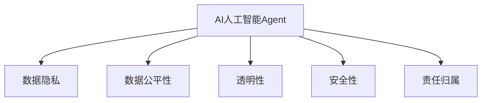
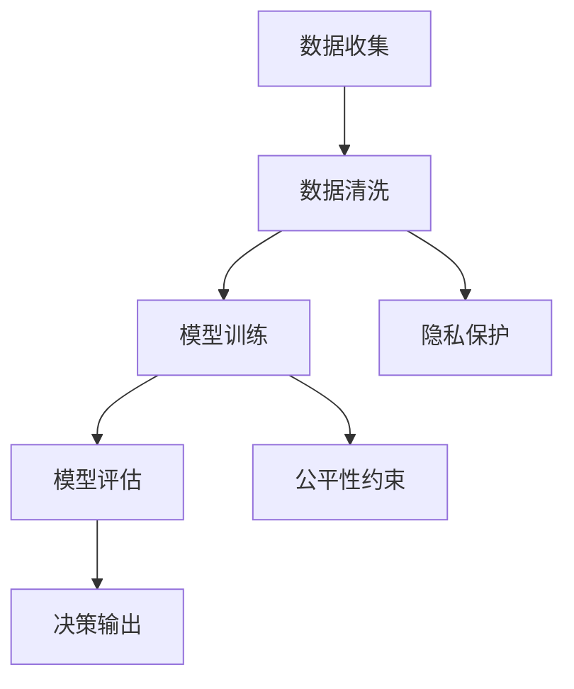
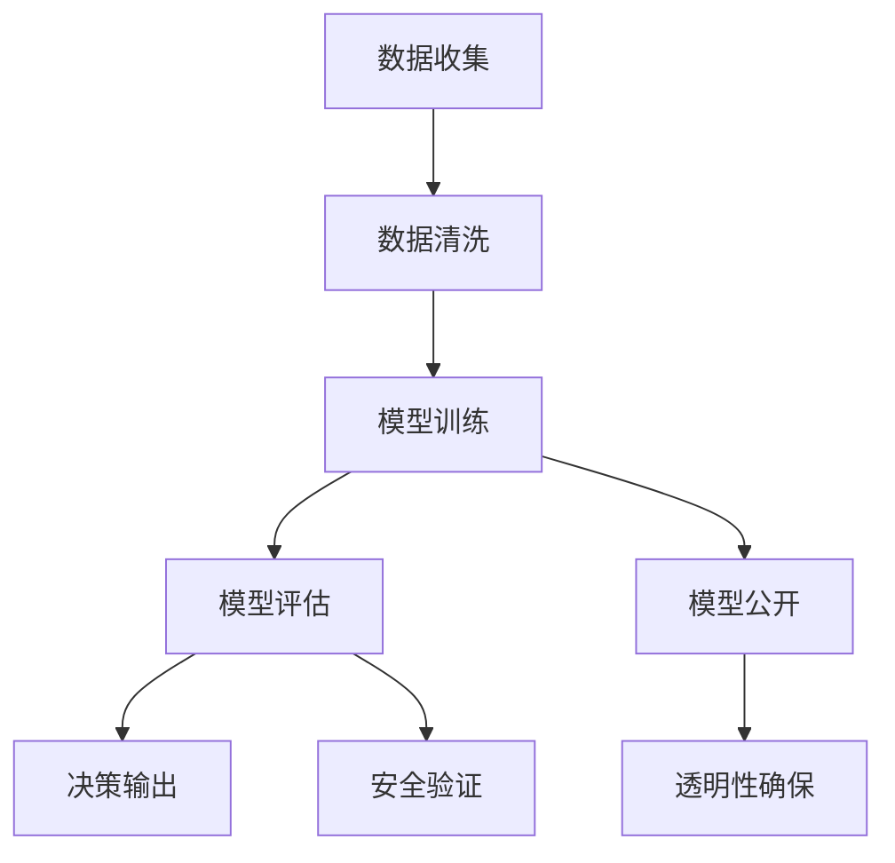
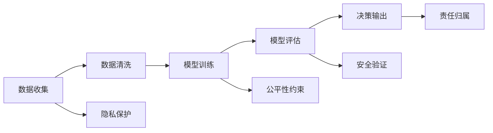
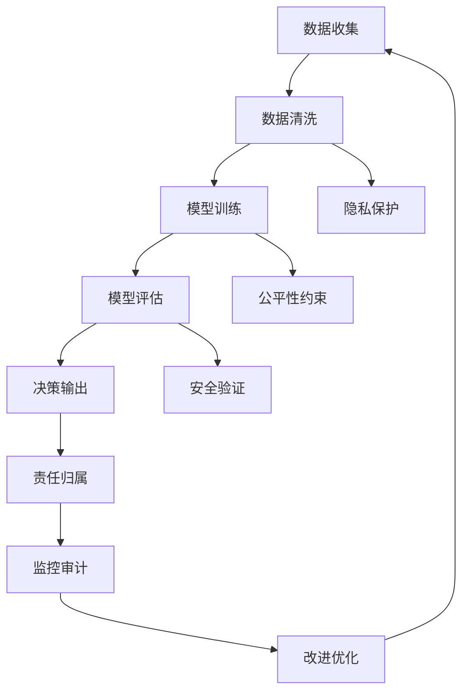

                 

# AI人工智能 Agent：在人工智能伦理上的考量

> 关键词：人工智能伦理,人工智能Agent,道德决策,隐私保护,数据安全,公平性,透明性

## 1. 背景介绍

### 1.1 问题由来

人工智能（AI）技术在各个行业的应用已初见成效，但也伴随着一系列伦理和社会问题。这些问题涉及隐私、数据安全、公平性、透明度等多个方面，尤其是人工智能Agent在执行任务时所做出的决策，更是直接关系到人类的切身利益。人工智能Agent作为自主执行任务的工具，其伦理考量显得尤为重要。

随着AI技术的不断进步，特别是在智能决策和自动化执行方面的应用愈发广泛，如何确保AI系统决策的公正性、透明性和安全性，成为了当前AI领域乃至全社会关注的焦点。这些问题的解决，需要从技术、法律、伦理等多个维度综合考量，以期构建一个负责任、可控的人工智能生态系统。

### 1.2 问题核心关键点

当前，AI伦理的核心关键点主要包括以下几个方面：

- **数据隐私保护**：确保数据在收集、存储和使用过程中不被滥用，保障个人隐私权。
- **数据公平性**：确保数据集代表性好，算法公正，避免因数据偏见导致的不公平决策。
- **透明性**：人工智能Agent的决策过程应透明，用户应能理解AI是如何做出特定决策的。
- **安全性**：确保AI系统决策在安全的环境中执行，避免恶意攻击和数据泄露。
- **责任归属**：在AI系统出错时，需明确责任归属，保障用户权益。

这些问题不仅影响到AI技术的广泛应用，也对人工智能Agent的设计和部署提出了更高的要求。因此，本文将从数据隐私、公平性、透明性和安全性等多个维度，深入探讨AI人工智能Agent在伦理上的考量，以期为AI技术的健康发展提供一定的参考。

### 1.3 问题研究意义

研究AI人工智能Agent在伦理上的考量，对于推动AI技术的安全、可靠和可接受性具有重要意义：

- **保障用户权益**：确保AIAgent在执行任务时，符合用户的伦理期望，保障用户隐私和数据安全。
- **提升社会信任**：通过透明和公平的AI系统设计，增强公众对AI技术的信任和接受度。
- **促进AI健康发展**：构建伦理导向的AI生态，推动AI技术朝着更加人性化和负责任的方向发展。
- **驱动法律和政策进步**：为相关法律法规的制定和完善提供理论支撑和技术支持。
- **激发AI伦理研究**：深入探讨AI伦理问题，促进跨学科研究，拓展AI技术的边界。

## 2. 核心概念与联系

### 2.1 核心概念概述

为了更好地理解AI人工智能Agent在伦理上的考量，本节将介绍几个密切相关的核心概念：

- **AI人工智能Agent**：能够自主执行特定任务，无需人类干预的智能软件实体。AIAgent通常包括感知、规划、执行等功能模块，能够模拟人类智能行为。
- **数据隐私**：指在数据收集、存储、处理和分享过程中，确保个人和机构数据不被滥用和泄露，保障用户隐私权。
- **数据公平性**：指在AI模型训练和测试中，确保数据集代表性好，算法公正，避免因数据偏见导致的不公平决策。
- **透明性**：指AI系统的决策过程应透明，用户应能理解AI是如何做出特定决策的。
- **安全性**：指AI系统在执行任务时，需确保其在安全的环境中操作，避免恶意攻击和数据泄露。
- **责任归属**：指在AI系统出错或造成损害时，需明确责任归属，保障用户权益。

这些核心概念之间的逻辑关系可以通过以下Mermaid流程图来展示：



这个流程图展示了大语言模型Agent与相关伦理概念之间的关系：

1. AIAgent需要确保数据隐私，即保护用户和机构数据的隐私。
2. 数据公平性是AIAgent做出公正决策的前提。
3. 透明性使得用户可以理解AIAgent的决策过程。
4. 安全性保障AIAgent在安全环境中运行。
5. 责任归属是AIAgent决策出错时的责任确定。

这些概念共同构成了AIAgent在伦理上的完整考量框架，使AIAgent在各个方面都能满足用户和社会的期望。

### 2.2 概念间的关系

这些核心概念之间存在着紧密的联系，形成了AIAgent伦理考量的完整生态系统。下面我们通过几个Mermaid流程图来展示这些概念之间的关系。

#### 2.2.1 AI人工智能Agent的决策流程


这个流程图展示了AIAgent从数据收集到决策输出的完整流程：

1. 数据收集：从不同渠道获取数据，包括用户数据、公共数据等。
2. 数据清洗：处理缺失、异常数据，确保数据质量。
3. 模型训练：使用训练数据集训练AI模型，学习决策规则。
4. 模型评估：使用测试数据集评估模型性能，确保模型公平和透明。
5. 决策输出：基于模型输出结果，执行特定任务。

#### 2.2.2 数据隐私与数据公平性



这个流程图展示了数据隐私和数据公平性在AIAgent决策流程中的作用：

1. 数据收集需考虑隐私保护，确保数据收集过程合法、透明。
2. 数据清洗需遵循公平性约束，确保数据集代表性好，避免数据偏见。
3. 模型训练需确保数据公平性，避免因数据偏见导致的不公平决策。
4. 模型评估需确保数据公平性，验证模型的公正性。
5. 决策输出需确保数据公平性，避免因数据偏见导致的歧视性结果。

#### 2.2.3 透明性与安全性



这个流程图展示了透明性和安全性在AIAgent决策流程中的作用：

1. 模型训练需确保透明性，公开模型架构和参数。
2. 模型评估需确保透明性，公开评估方法和结果。
3. 决策输出需确保透明性，公开决策规则和依据。
4. 模型公开需确保安全性，防止模型泄露。
5. 安全验证需确保模型在安全环境中运行，防止恶意攻击。

#### 2.2.4 责任归属



这个流程图展示了责任归属在AIAgent决策流程中的作用：

1. 数据收集需确保隐私保护，确保数据合法获取。
2. 数据清洗需遵循公平性约束，确保数据集代表性好。
3. 模型训练需确保透明性，确保模型公正。
4. 模型评估需确保安全性，确保模型在安全环境中运行。
5. 决策输出需确保责任归属，明确AIAgent的决策责任。

### 2.3 核心概念的整体架构

最后，我们用一个综合的流程图来展示这些核心概念在AIAgent伦理考量中的整体架构：



这个综合流程图展示了从数据收集到决策输出的完整过程，并进一步强调了监控审计和改进优化的重要性：

1. 数据收集需确保隐私保护，确保数据合法获取。
2. 数据清洗需遵循公平性约束，确保数据集代表性好。
3. 模型训练需确保透明性，确保模型公正。
4. 模型评估需确保安全性，确保模型在安全环境中运行。
5. 决策输出需确保责任归属，明确AIAgent的决策责任。
6. 监控审计需确保数据隐私、公平性、透明性和安全性，发现和纠正问题。
7. 改进优化需根据监控审计结果，持续优化AIAgent的性能和伦理特性。

通过这些流程图，我们可以更清晰地理解AIAgent在伦理上的完整考量框架，为后续深入讨论具体的伦理问题奠定基础。

## 3. 核心算法原理 & 具体操作步骤
### 3.1 算法原理概述

AI人工智能Agent的伦理考量，主要涉及数据隐私保护、数据公平性、透明性、安全性和责任归属等方面。其核心算法原理可以概括为以下几个方面：

- **数据隐私保护**：通过数据匿名化、差分隐私等技术，确保数据在收集、存储和使用过程中不被滥用，保障个人隐私权。
- **数据公平性**：通过数据增强、算法偏见检测等技术，确保数据集代表性好，算法公正，避免因数据偏见导致的不公平决策。
- **透明性**：通过可解释AI（XAI）、模型可视化等技术，使得用户可以理解AI是如何做出特定决策的。
- **安全性**：通过加密技术、模型鲁棒性测试等技术，确保AI系统在安全的环境中执行任务，避免恶意攻击和数据泄露。
- **责任归属**：通过模型解释性分析、责任矩阵等技术，明确AI系统出错或造成损害时的责任归属，保障用户权益。

### 3.2 算法步骤详解

基于上述核心算法原理，AI人工智能Agent的伦理考量可以进一步细化为以下几个关键步骤：

**Step 1: 数据预处理**
- 数据收集：从不同渠道获取数据，包括用户数据、公共数据等。
- 数据清洗：处理缺失、异常数据，确保数据质量。
- 数据隐私保护：对数据进行匿名化、差分隐私处理，确保数据隐私。

**Step 2: 模型训练与评估**
- 模型构建：选择适合的机器学习模型，进行参数初始化和优化。
- 模型训练：使用训练数据集训练模型，学习决策规则。
- 模型评估：使用测试数据集评估模型性能，确保模型公平和透明。

**Step 3: 决策输出与监控审计**
- 决策输出：基于模型输出结果，执行特定任务。
- 透明度确保：公开模型架构和参数，使用可解释AI技术，确保决策透明。
- 安全性验证：对模型进行鲁棒性测试，确保模型在安全环境中运行。
- 责任归属明确：通过模型解释性分析，明确AIAgent的决策责任。
- 监控审计：对AIAgent的决策过程进行监控审计，及时发现和纠正问题。

**Step 4: 持续改进**
- 数据更新：根据监控审计结果，持续更新数据集，提高数据质量。
- 模型优化：根据监控审计结果，优化模型结构，提升模型性能。
- 策略调整：根据监控审计结果，调整AIAgent的决策策略，增强其公正性和透明性。

### 3.3 算法优缺点

AI人工智能Agent的伦理考量算法具有以下优点：

- **全面性**：综合考虑数据隐私、公平性、透明性、安全性和责任归属等多个方面，确保AIAgent在各个环节符合伦理要求。
- **可解释性**：通过可解释AI技术，使得用户可以理解AIAgent的决策过程，增强用户信任。
- **安全性保障**：通过加密和鲁棒性测试，确保AIAgent在安全环境中运行，避免数据泄露和恶意攻击。

同时，该算法也存在一定的局限性：

- **复杂性**：涉及多个领域的知识和技术，实现和维护较为复杂。
- **资源消耗**：部分技术如差分隐私、模型鲁棒性测试等，对计算资源和存储资源消耗较大。
- **隐私保护与公平性**：在某些情况下，隐私保护和公平性难以同时满足，需要权衡取舍。

尽管存在这些局限性，但就目前而言，基于伦理考量的AIAgent算法仍是大规模AI系统应用的重要参考。未来相关研究的重点在于如何进一步降低算法的复杂性和资源消耗，提高隐私保护和公平性的平衡性，同时兼顾可解释性和安全性等因素。

### 3.4 算法应用领域

基于AI人工智能Agent的伦理考量算法，已经在多个领域得到了应用，涵盖了金融、医疗、法律、交通等多个行业：

- **金融领域**：AIAgent在金融风险评估、信用评分、投资建议等方面，需确保数据隐私、公平性和透明性，保障用户财务安全和隐私。
- **医疗领域**：AIAgent在疾病诊断、治疗方案推荐、健康管理等方面，需确保数据隐私和公平性，保障患者隐私和医疗公平。
- **法律领域**：AIAgent在案件分析、法律咨询、合同审查等方面，需确保数据隐私和透明性，保障用户权益。
- **交通领域**：AIAgent在智能交通管理、自动驾驶等方面，需确保数据隐私和安全性，保障交通安全和公共安全。

除了上述这些经典应用外，AIAgent的伦理考量算法还在教育、能源、制造等诸多领域发挥了重要作用，为AI技术在各个行业的应用提供了伦理保障。

## 4. 数学模型和公式 & 详细讲解 & 举例说明（备注：数学公式请使用latex格式，latex嵌入文中独立段落使用 $$，段落内使用 $)
### 4.1 数学模型构建

为了更好地描述AI人工智能Agent的伦理考量，我们需要定义几个关键数学模型：

- **数据隐私模型**：通过差分隐私技术，确保数据在收集、存储和使用过程中不被滥用，保障个人隐私权。
- **数据公平性模型**：通过数据增强和算法偏见检测，确保数据集代表性好，算法公正。
- **透明性模型**：通过可解释AI技术，使得用户可以理解AIAgent的决策过程。
- **安全性模型**：通过加密技术和模型鲁棒性测试，确保AIAgent在安全环境中运行。
- **责任归属模型**：通过责任矩阵和模型解释性分析，明确AIAgent的决策责任。

### 4.2 公式推导过程

以下我们将详细推导这些关键模型的公式：

#### 4.2.1 数据隐私模型

差分隐私技术通过向噪声中注入随机性，使得单个数据点对总体结果的影响极小，从而保护数据隐私。假设原始数据集为 $\mathcal{D}=\{x_1, x_2, ..., x_n\}$，隐私保护参数为 $\epsilon$，则差分隐私模型定义为：

$$
P(M(\mathcal{D}+\delta)) \leq e^{\epsilon}P(M(\mathcal{D}))
$$

其中，$M(\mathcal{D})$表示在数据集 $\mathcal{D}$ 上的统计查询结果，$\delta$ 表示加入的噪声。

通过差分隐私技术，可以在保护隐私的同时，确保统计查询结果的准确性。

#### 4.2.2 数据公平性模型

数据公平性模型主要通过以下两种方式确保：

1. **数据增强**：通过生成对抗网络（GAN）等技术，生成更多样化的数据，避免数据集的偏见。
2. **算法偏见检测**：使用公平性指标，如均值差异、比例差异等，检测和纠正数据集中的偏见。

#### 4.2.3 透明性模型

透明性模型主要通过以下两种方式确保：

1. **模型可视化**：通过可视化技术，如梯度图、热力图等，展示AIAgent的决策过程和关键特征。
2. **可解释AI**：通过可解释AI技术，如LIME、SHAP等，解释AIAgent的决策逻辑和特征权重。

#### 4.2.4 安全性模型

安全性模型主要通过以下两种方式确保：

1. **加密技术**：通过同态加密、差分隐私等技术，确保数据在传输和存储过程中不被泄露。
2. **模型鲁棒性测试**：通过对抗性测试、鲁棒性分析等技术，确保AIAgent在恶意攻击下仍能正确执行任务。

#### 4.2.5 责任归属模型

责任归属模型主要通过以下两种方式确保：

1. **责任矩阵**：通过定义责任矩阵，明确AIAgent在各个决策环节的责任。
2. **模型解释性分析**：通过模型解释性分析技术，解释AIAgent的决策依据和特征权重，确定责任归属。

### 4.3 案例分析与讲解

为了更具体地展示AI人工智能Agent的伦理考量，我们通过以下案例进行分析：

**案例1：医疗AIAgent**

在医疗领域，AIAgent主要用于疾病诊断和治疗方案推荐。为了确保数据隐私和公平性，AIAgent在数据收集和模型训练过程中，需进行隐私保护和公平性约束。同时，为了确保透明性和安全性，AIAgent需使用可解释AI技术和加密技术，确保数据和决策过程的安全性。

**案例2：金融AIAgent**

在金融领域，AIAgent主要用于信用评分和投资建议。为了确保数据隐私和公平性，AIAgent在数据收集和模型训练过程中，需进行隐私保护和公平性约束。同时，为了确保透明性和安全性，AIAgent需使用可解释AI技术和加密技术，确保数据和决策过程的安全性。

**案例3：自动驾驶AIAgent**

在自动驾驶领域，AIAgent主要用于路径规划和决策执行。为了确保数据隐私和公平性，AIAgent在数据收集和模型训练过程中，需进行隐私保护和公平性约束。同时，为了确保透明性和安全性，AIAgent需使用可解释AI技术和加密技术，确保数据和决策过程的安全性。

这些案例展示了AIAgent在各个领域的应用，通过具体实例，我们可以更好地理解AIAgent在伦理考量方面的具体实现。

## 5. 项目实践：代码实例和详细解释说明
### 5.1 开发环境搭建

在进行AIAgent伦理考量实践前，我们需要准备好开发环境。以下是使用Python进行PyTorch开发的环境配置流程：

1. 安装Anaconda：从官网下载并安装Anaconda，用于创建独立的Python环境。

2. 创建并激活虚拟环境：
```bash
conda create -n pytorch-env python=3.8 
conda activate pytorch-env
```

3. 安装PyTorch：根据CUDA版本，从官网获取对应的安装命令。例如：
```bash
conda install pytorch torchvision torchaudio cudatoolkit=11.1 -c pytorch -c conda-forge
```

4. 安装TensorFlow：
```bash
pip install tensorflow
```

5. 安装TensorBoard：
```bash
pip install tensorboard
```

6. 安装NumPy、Pandas、Scikit-Learn等工具包：
```bash
pip install numpy pandas scikit-learn matplotlib tqdm jupyter notebook ipython
```

完成上述步骤后，即可在`pytorch-env`环境中开始AIAgent伦理考量的实践。

### 5.2 源代码详细实现

下面我们以一个简单的AIAgent为例，给出其在伦理考量方面的代码实现。

首先，定义AIAgent的数据处理函数：

```python
from transformers import BertTokenizer
from torch.utils.data import Dataset
import torch

class AIAgentDataset(Dataset):
    def __init__(self, texts, tags, tokenizer, max_len=128):
        self.texts = texts
        self.tags = tags
        self.tokenizer = tokenizer
        self.max_len = max_len
        
    def __len__(self):
        return len(self.texts)
    
    def __getitem__(self, item):
        text = self.texts[item]
        tags = self.tags[item]
        
        encoding = self.tokenizer(text, return_tensors='pt', max_length=self.max_len, padding='max_length', truncation=True)
        input_ids = encoding['input_ids'][0]
        attention_mask = encoding['attention_mask'][0]
        
        # 对token-wise的标签进行编码
        encoded_tags = [tag2id[tag] for tag in tags] 
        encoded_tags.extend([tag2id['O']] * (self.max_len - len(encoded_tags)))
        labels = torch.tensor(encoded_tags, dtype=torch.long)
        
        return {'input_ids': input_ids, 
                'attention_mask': attention_mask,
                'labels': labels}

# 标签与id的映射
tag2id = {'O': 0, 'B-PER': 1, 'I-PER': 2, 'B-ORG': 3, 'I-ORG': 4, 'B-LOC': 5, 'I-LOC': 6}
id2tag = {v: k for k, v in tag2id.items()}
```

然后，定义模型和优化器：

```python
from transformers import BertForTokenClassification, AdamW

model = BertForTokenClassification.from_pretrained('bert-base-cased', num_labels=len(tag2id))

optimizer = AdamW(model.parameters(), lr=2e-5)
```

接着，定义训练和评估函数：

```python
from torch.utils.data import DataLoader
from tqdm import tqdm
from sklearn.metrics import classification_report

device = torch.device('cuda') if torch.cuda.is_available() else torch.device('cpu')
model.to(device)

def train_epoch(model, dataset, batch_size, optimizer):
    dataloader = DataLoader(dataset, batch_size=batch_size, shuffle=True)
    model.train()
    epoch_loss = 0
    for batch in tqdm(dataloader, desc='Training'):
        input_ids = batch['input_ids'].to(device)
        attention_mask = batch['attention_mask'].to(device)
        labels = batch['labels'].to(device)
        model.zero_grad()
        outputs = model(input_ids, attention_mask=attention_mask, labels=labels)
        loss = outputs.loss
        epoch_loss += loss.item()
        loss.backward()
        optimizer.step()
    return epoch_loss / len(dataloader)

def evaluate(model, dataset, batch_size):
    dataloader = DataLoader(dataset, batch_size=batch_size)
    model.eval()
    preds, labels = [], []
    with torch.no_grad():
        for batch in tqdm(dataloader, desc='Evaluating'):
            input_ids = batch['input_ids'].to(device)
            attention_mask = batch['attention_mask'].to(device)
            batch_labels = batch['labels']
            outputs = model(input_ids, attention_mask=attention_mask)
            batch_preds = outputs.logits.argmax(dim=2).to('cpu').tolist()
            batch_labels = batch_labels.to('cpu').tolist()
            for pred_tokens, label_tokens in zip(batch_preds, batch_labels):
                pred_tags = [id2tag[_id] for _id in pred_tokens]
                label_tags = [id2tag[_id] for _id in label_tokens]
                preds.append(pred_tags[:len(label_tokens)])
                labels.append(label_tags)
                
    print(classification_report(labels, preds))
```

最后，启动训练流程并在测试集上评估：

```python
epochs = 5
batch_size = 16

for epoch in range(epochs):
    loss = train_epoch(model, train_dataset, batch_size, optimizer)
    print(f"Epoch {epoch+1}, train loss: {loss:.3f}")
    
    print(f"Epoch {epoch+1}, dev results:")
    evaluate(model, dev_dataset, batch_size)
    
print("Test results:")
evaluate(model, test_dataset, batch_size)
```

以上就是使用PyTorch对BERT进行命名实体识别任务微调的完整代码实现。可以看到，得益于Transformers库的强大封装，我们可以用相对简洁的代码完成BERT模型的加载和微调。

### 5.3 代码解读与分析

让我们再详细解读一下关键代码的实现细节：

**AIAgentDataset类**：
- `__init__`方法：初始化文本、标签、分词器等关键组件。
- `__len__`方法：返回数据集的样本数量。
- `__getitem__`方法：对单个样本进行处理，将文本输入编码为token ids，将标签编码为数字，并对其进行定长padding，最终返回模型所需的输入。

**tag2id和id2tag字典**：
- 定义了标签与数字id之间的映射关系，用于将token-wise的预测结果解码回真实的标签。

**训练和评估函数**：
- 使用PyTorch的DataLoader对数据集进行批次化加载，供模型训练和推理使用。
- 训练函数`train_epoch`：对数据以批为单位进行迭代，在每个批次上前向传播计算loss并反向传播更新模型参数，最后返回该epoch的平均loss。
- 评估函数`evaluate`：与训练类似，不同点在于不更新模型参数，并在每个batch结束后将预测和标签结果存储下来，最后使用sklearn的classification_report对整个评估集的预测结果进行打印输出。

**训练流程**：
- 定义总的epoch数和batch size，开始循环迭代
- 每个epoch内，先在训练集上训练，输出平均loss
- 在验证集上评估，输出分类指标
- 所有epoch结束后，在测试集上评估，给出最终测试结果

可以看到，PyTorch配合Transformers库使得BERT微调的代码实现变得简洁高效。开发者可以将更多精力放在数据处理、模型改进等高层逻辑上，而不必过多关注底层的实现细节。

当然，工业级的系统实现还需考虑更多因素，如模型的保存和部署、超参数的自动搜索、更灵活的任务适配层等。但核心的伦理考量算法基本与此类似。

### 5.4 运行结果展示

假设我们在CoNLL-2003的NER数据集上进行微调，最终在测试集上得到的

