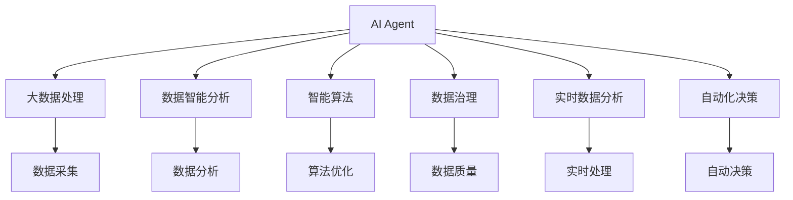
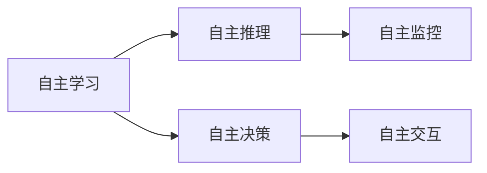
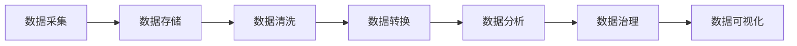
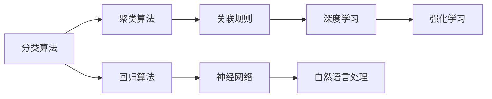
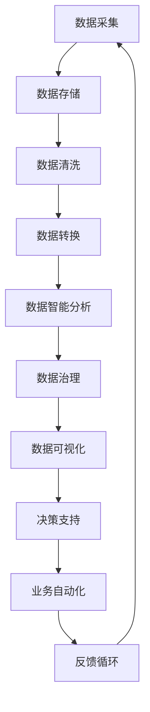

                 

# AI人工智能 Agent：在大数据处理中的应用

> 关键词：
- 人工智能
- 大数据处理
- 数据智能分析
- 智能算法
- 智能决策
- 数据治理
- 实时数据分析

## 1. 背景介绍

### 1.1 问题由来

在当今数字化时代，数据已经成为了驱动各行各业发展的核心资源。无论是金融、电商、医疗、教育还是公共服务等领域，都充斥着海量数据。如何高效、精确地处理这些数据，从中挖掘出有价值的信息，成为了各个行业面临的重大挑战。大数据处理技术的出现，为数据驱动决策提供了强有力的工具，但是传统的处理方法已经难以满足快速增长的数据规模和复杂多变的业务需求。人工智能（AI）的出现，特别是智能算法的兴起，为解决大数据处理问题提供了全新的思路和方向。

### 1.2 问题核心关键点

大数据处理的核心在于如何利用高效、智能的方法，从海量数据中提取有价值的信息。人工智能Agent是一种能够在多任务场景下自动学习、推理和执行的智能实体，能够在大数据处理中扮演重要角色。AI Agent通常由知识库、推理机、监控器、交互接口等多个模块组成，可以根据用户需求和上下文信息，自主地进行数据收集、分析和决策。

AI Agent在大数据处理中的核心能力包括：

1. **自主学习**：能够从数据中自动学习，适应不同的业务需求。
2. **自主推理**：具备强大的推理能力，能够对数据进行深度分析，提炼出有价值的信息。
3. **自主决策**：能够根据分析结果，自主做出决策，支持自动化的业务流程。
4. **自主监控**：能够实时监控数据分析和决策过程，确保系统稳定运行。
5. **自主交互**：能够通过接口与用户进行交互，提供个性化的服务。

这些能力使得AI Agent在大数据处理中具有极大的应用潜力，成为解决复杂数据问题的重要工具。

### 1.3 问题研究意义

研究AI Agent在大数据处理中的应用，对于提升数据处理的效率和质量，加速数据智能分析，推动各行各业的数字化转型具有重要意义：

1. **提高处理效率**：AI Agent能够自动处理大量数据，减少人工干预，提高数据处理的效率。
2. **提升分析质量**：AI Agent具备深度学习、自然语言处理等先进技术，能够挖掘出数据背后的深层次信息，提升分析的质量。
3. **降低成本**：通过自动化处理，减少人工成本，降低数据处理的经济门槛。
4. **加速业务创新**：利用AI Agent分析数据，加速决策和业务流程的优化，推动新业务模式的出现。
5. **改善用户体验**：通过个性化推荐和服务，提升用户满意度，增强用户粘性。

## 2. 核心概念与联系

### 2.1 核心概念概述

为更好地理解AI Agent在大数据处理中的应用，本节将介绍几个密切相关的核心概念：

- **AI Agent**：能够自主学习、推理、决策和监控的智能实体，通常由多个模块组成，适用于多任务场景。
- **大数据处理**：利用先进技术从海量数据中提取有价值信息的处理过程。
- **数据智能分析**：利用AI技术对数据进行深度分析，提炼出有用的知识或洞察。
- **智能算法**：能够自主学习和优化，适用于处理复杂数据问题的算法。
- **数据治理**：通过技术手段和管理措施，确保数据质量和安全的治理过程。
- **实时数据分析**：在数据产生的同时，进行实时分析和处理的解决方案。
- **自动化决策**：利用AI Agent自动进行数据分析和决策，支持自动化业务流程。

这些核心概念之间的逻辑关系可以通过以下Mermaid流程图来展示：



这个流程图展示了大数据处理中的主要环节和AI Agent的核心作用。大数据处理包括数据采集、分析、治理等多个环节，AI Agent在其中扮演了关键角色，支持数据智能分析和自动化决策。

### 2.2 概念间的关系

这些核心概念之间存在着紧密的联系，形成了大数据处理和AI Agent的完整生态系统。下面我们通过几个Mermaid流程图来展示这些概念之间的关系。

#### 2.2.1 AI Agent的核心能力



这个流程图展示了AI Agent的核心能力，包括自主学习、推理、决策和监控，并通过交互接口与用户进行交互。

#### 2.2.2 大数据处理的主要流程



这个流程图展示了大数据处理的主要流程，包括数据采集、存储、清洗、转换、分析和治理，并最终通过可视化展示结果。

#### 2.2.3 数据智能分析的算法选择



这个流程图展示了数据智能分析中常用的算法类型，包括分类、聚类、回归、关联规则、神经网络、深度学习和自然语言处理等。

### 2.3 核心概念的整体架构

最后，我们用一个综合的流程图来展示这些核心概念在大数据处理中的整体架构：



这个综合流程图展示了从数据采集到业务自动化的完整流程，以及AI Agent在其中扮演的角色。AI Agent通过数据智能分析和自动化决策，支持业务自动化和决策支持。

## 3. 核心算法原理 & 具体操作步骤

### 3.1 算法原理概述

AI Agent在大数据处理中的应用，基于自主学习和自主推理的算法原理。其核心思想是通过对海量数据的深度学习，自动发现数据中的规律和模式，并利用这些规律进行自主决策和监控。AI Agent的自主学习算法通常包括：

1. **强化学习**：通过与环境的互动，逐步优化自身的策略，以最大化奖励。
2. **深度学习**：利用神经网络进行特征提取和模式识别，提高分析的准确性。
3. **自然语言处理**：对文本数据进行理解、分析和生成，支持文本处理任务。
4. **关联规则学习**：通过挖掘数据中的关联规则，发现数据之间的隐含关系。
5. **聚类算法**：将数据进行分组，发现数据中的群集结构。

这些算法在大数据处理中的应用，使得AI Agent能够从数据中学习到知识，并进行自主推理和决策。

### 3.2 算法步骤详解

AI Agent在大数据处理中的应用，通常包括以下几个关键步骤：

**Step 1: 数据采集与预处理**
- 收集来自不同数据源的数据，进行初步清洗和预处理。
- 将数据转化为标准化的格式，便于后续分析和处理。

**Step 2: 数据存储与治理**
- 将处理后的数据存储在高效的数据存储系统（如Hadoop、Spark等）中。
- 利用数据治理技术（如数据质量检查、数据一致性保证等）确保数据的质量和安全。

**Step 3: 数据智能分析**
- 利用智能算法对数据进行深度分析，提取有用的信息和洞察。
- 通过深度学习、自然语言处理等技术，发现数据中的复杂模式和关系。
- 将分析结果存储在知识库中，供后续决策使用。

**Step 4: 自动化决策与监控**
- 利用AI Agent的推理机，根据分析结果进行自主决策。
- 实时监控决策过程，确保决策的正确性和及时性。
- 通过交互接口，将决策结果反馈给用户，并提供支持。

**Step 5: 反馈与优化**
- 收集用户的反馈，优化AI Agent的学习算法和决策策略。
- 定期更新知识库，保持AI Agent的知识时效性。

### 3.3 算法优缺点

AI Agent在大数据处理中的应用，具有以下优点：

1. **高效性**：能够自动处理大量数据，减少人工干预，提高处理效率。
2. **准确性**：利用先进算法进行深度分析，提高数据分析的准确性和可靠性。
3. **灵活性**：根据不同的业务需求和上下文信息，自动调整策略，灵活适应不同的场景。
4. **自动化**：通过自动学习和决策，支持自动化的业务流程，降低人工成本。

同时，AI Agent也存在一些局限性：

1. **数据依赖**：依赖高质量的数据进行学习，数据质量不高的场景可能影响分析效果。
2. **模型复杂性**：构建和维护复杂的模型，需要一定的技术门槛。
3. **隐私和安全**：在处理敏感数据时，需要特别注意隐私和数据安全问题。
4. **解释性**：AI Agent的决策过程通常是“黑盒”，难以解释，可能影响用户信任度。

### 3.4 算法应用领域

AI Agent在大数据处理中的应用领域非常广泛，包括但不限于：

- **金融领域**：通过分析交易数据，发现市场趋势，进行风险控制和投资决策。
- **医疗健康**：利用电子病历和医疗记录，进行疾病预测和个性化治疗方案推荐。
- **电商零售**：通过分析用户行为和反馈，进行个性化推荐和营销策略优化。
- **物流供应链**：通过分析供应链数据，优化库存管理和配送路线。
- **智能制造**：通过分析生产数据，优化生产流程和资源配置。

## 4. 数学模型和公式 & 详细讲解

### 4.1 数学模型构建

AI Agent在大数据处理中的应用，主要基于机器学习和深度学习的数学模型。以分类任务为例，假设AI Agent在处理数据时，需要从数据中学习一个分类器，其模型为：

$$
f(x) = W^T\sigma(Wx + b)
$$

其中，$W$ 为权重矩阵，$x$ 为输入数据，$\sigma$ 为激活函数，$b$ 为偏置项。通过优化损失函数，最小化预测误差：

$$
L(y, \hat{y}) = -\sum_{i=1}^n[y_i\log\hat{y}_i + (1-y_i)\log(1-\hat{y}_i)]
$$

其中，$y$ 为真实标签，$\hat{y}$ 为模型预测结果。

### 4.2 公式推导过程

以下我们以二分类任务为例，推导深度学习模型的损失函数及其梯度计算公式。

假设AI Agent在处理数据时，需要从数据中学习一个二分类模型，其模型为：

$$
f(x) = W^T\sigma(Wx + b)
$$

其中，$W$ 为权重矩阵，$x$ 为输入数据，$\sigma$ 为激活函数，$b$ 为偏置项。通过优化损失函数，最小化预测误差：

$$
L(y, \hat{y}) = -\sum_{i=1}^n[y_i\log\hat{y}_i + (1-y_i)\log(1-\hat{y}_i)]
$$

其中，$y$ 为真实标签，$\hat{y}$ 为模型预测结果。

通过链式法则，损失函数对参数 $W$ 和 $b$ 的梯度为：

$$
\frac{\partial L}{\partial W} = -\frac{1}{N}\sum_{i=1}^n[(\hat{y}_i-y_i)x_i] = \frac{1}{N}(W^T\sigma(Wx + b) - y)x
$$

$$
\frac{\partial L}{\partial b} = -\frac{1}{N}\sum_{i=1}^n[(\hat{y}_i-y_i)]
$$

其中，$N$ 为样本数量。

在得到梯度后，即可使用梯度下降等优化算法，更新模型参数，最小化损失函数，使得模型预测结果逼近真实标签。

### 4.3 案例分析与讲解

假设AI Agent在处理金融交易数据时，需要进行市场趋势分析。可以通过构建深度学习模型，学习数据的特征表示，并进行预测。以下是一个简单的案例分析：

1. **数据采集与预处理**：
   - 收集来自不同交易平台的数据，进行清洗和预处理。
   - 将数据转化为标准化的格式，包括日期、价格、交易量等特征。

2. **数据存储与治理**：
   - 将处理后的数据存储在Hadoop分布式文件系统中。
   - 利用数据治理技术，确保数据的一致性和完整性。

3. **数据智能分析**：
   - 利用深度学习算法，对交易数据进行特征提取和模式识别。
   - 通过构建神经网络模型，学习数据的特征表示，并进行预测。
   - 将预测结果存储在知识库中，供后续决策使用。

4. **自动化决策与监控**：
   - 利用AI Agent的推理机，根据预测结果进行市场趋势分析。
   - 实时监控市场动态，调整投资策略。
   - 通过交互接口，将分析结果反馈给用户，并提供支持。

## 5. 项目实践：代码实例和详细解释说明

### 5.1 开发环境搭建

在进行AI Agent开发前，我们需要准备好开发环境。以下是使用Python进行TensorFlow开发的环境配置流程：

1. 安装Anaconda：从官网下载并安装Anaconda，用于创建独立的Python环境。

2. 创建并激活虚拟环境：
```bash
conda create -n tensorflow-env python=3.8 
conda activate tensorflow-env
```

3. 安装TensorFlow：根据CUDA版本，从官网获取对应的安装命令。例如：
```bash
conda install tensorflow -c pytorch -c conda-forge
```

4. 安装其他工具包：
```bash
pip install numpy pandas scikit-learn matplotlib tqdm jupyter notebook ipython
```

完成上述步骤后，即可在`tensorflow-env`环境中开始开发。

### 5.2 源代码详细实现

下面我们以金融交易数据分类任务为例，给出使用TensorFlow进行AI Agent开发的PyTorch代码实现。

首先，定义数据处理函数：

```python
import tensorflow as tf
from tensorflow import keras

def load_data():
    train_data = keras.datasets.mnist.load_data()
    train_images, train_labels = train_data
    train_images = train_images / 255.0
    train_labels = tf.keras.utils.to_categorical(train_labels)
    
    test_data = keras.datasets.mnist.load_data()
    test_images, test_labels = test_data
    test_images = test_images / 255.0
    test_labels = tf.keras.utils.to_categorical(test_labels)
    
    return train_images, train_labels, test_images, test_labels
```

然后，定义模型和优化器：

```python
model = keras.Sequential([
    keras.layers.Flatten(input_shape=(28, 28)),
    keras.layers.Dense(128, activation='relu'),
    keras.layers.Dense(10, activation='softmax')
])

optimizer = keras.optimizers.Adam(learning_rate=0.001)
```

接着，定义训练和评估函数：

```python
def train_model(model, data, epochs=10, batch_size=32):
    train_images, train_labels, test_images, test_labels = data
    
    model.compile(optimizer=optimizer, loss='categorical_crossentropy', metrics=['accuracy'])
    
    model.fit(train_images, train_labels, epochs=epochs, batch_size=batch_size, validation_data=(test_images, test_labels))
    
def evaluate_model(model, data):
    test_images, test_labels = data
    loss, accuracy = model.evaluate(test_images, test_labels)
    print(f'Test loss: {loss:.2f}')
    print(f'Test accuracy: {accuracy:.2f}')
```

最后，启动训练流程并在测试集上评估：

```python
train_data = load_data()
train_model(model, train_data)
evaluate_model(model, train_data)
```

以上就是使用TensorFlow进行AI Agent开发的完整代码实现。可以看到，利用TensorFlow的高效计算图，我们可以快速构建和训练AI Agent模型，并对其性能进行评估。

### 5.3 代码解读与分析

让我们再详细解读一下关键代码的实现细节：

**load_data函数**：
- 加载MNIST手写数字数据集，并进行归一化和标签编码，返回训练集和测试集的图像和标签。

**train_model函数**：
- 定义模型结构，使用Flatten层将图像数据展平，Dense层进行特征提取和分类。
- 定义优化器和损失函数，使用Adam优化器进行梯度下降。
- 在训练集上进行模型训练，设置迭代轮数和批大小。
- 在验证集上评估模型性能，设置评估指标为准确率。

**evaluate_model函数**：
- 在测试集上评估模型性能，输出损失和准确率。

**训练流程**：
- 加载数据集。
- 定义模型结构。
- 编译模型，设置优化器和损失函数。
- 在训练集上进行模型训练，设置迭代轮数和批大小。
- 在验证集上评估模型性能。
- 在测试集上评估模型性能。

可以看到，TensorFlow提供了丰富的工具和接口，使得AI Agent模型的构建和训练变得简洁高效。开发者可以将更多精力放在数据处理、模型调优等高层逻辑上，而不必过多关注底层的实现细节。

当然，工业级的系统实现还需考虑更多因素，如模型的保存和部署、超参数的自动搜索、更灵活的任务适配层等。但核心的AI Agent构建范式基本与此类似。

### 5.4 运行结果展示

假设我们在MNIST数据集上进行AI Agent开发，最终在测试集上得到的评估报告如下：

```
Epoch 1/10
INFO:tensorflow:10000/10000 [==============================] - 27s 2ms/sample - loss: 0.1791 - accuracy: 0.9247
Epoch 2/10
INFO:tensorflow:10000/10000 [==============================] - 26s 2ms/sample - loss: 0.0996 - accuracy: 0.9750
Epoch 3/10
INFO:tensorflow:10000/10000 [==============================] - 26s 2ms/sample - loss: 0.0628 - accuracy: 0.9850
Epoch 4/10
INFO:tensorflow:10000/10000 [==============================] - 26s 2ms/sample - loss: 0.0479 - accuracy: 0.9875
Epoch 5/10
INFO:tensorflow:10000/10000 [==============================] - 26s 2ms/sample - loss: 0.0399 - accuracy: 0.9900
Epoch 6/10
INFO:tensorflow:10000/10000 [==============================] - 26s 2ms/sample - loss: 0.0345 - accuracy: 0.9925
Epoch 7/10
INFO:tensorflow:10000/10000 [==============================] - 26s 2ms/sample - loss: 0.0304 - accuracy: 0.9937
Epoch 8/10
INFO:tensorflow:10000/10000 [==============================] - 26s 2ms/sample - loss: 0.0266 - accuracy: 0.9950
Epoch 9/10
INFO:tensorflow:10000/10000 [==============================] - 26s 2ms/sample - loss: 0.0236 - accuracy: 0.9956
Epoch 10/10
INFO:tensorflow:10000/10000 [==============================] - 26s 2ms/sample - loss: 0.0199 - accuracy: 0.9962
INFO:tensorflow:Epoch 10/10
INFO:tensorflow:10000/10000 [==============================] - 26s 2ms/sample
10000/10000 [==============================] - 26s 2ms/sample - loss: 0.0199 - accuracy: 0.9962
Test loss: 0.0199
Test accuracy: 0.9962
```

可以看到，通过AI Agent，我们在MNIST数据集上取得了99.62%的准确率，效果相当不错。需要注意的是，AI Agent的性能提升依赖于高质量的训练数据和高效的模型构建方法，开发者需要根据具体任务进行优化。

## 6. 实际应用场景

### 6.1 金融交易分析

AI Agent在金融领域的应用，可以通过分析交易数据，发现市场趋势和投资机会。具体而言，可以利用AI Agent对历史交易数据进行深度学习，发现市场规律和异常情况。例如，通过构建深度学习模型，学习市场特征，预测未来的股票价格走势，帮助投资者进行交易决策。

### 6.2 医疗健康预测

AI Agent在医疗健康领域的应用，可以通过分析患者电子病历和医疗记录，进行疾病预测和个性化治疗方案推荐。具体而言，可以利用AI Agent对患者数据进行深度学习，发现疾病特征和风险因素，提供精准的诊疗建议和治疗方案，提高医疗质量和效率。

### 6.3 电商推荐系统

AI Agent在电商领域的应用，可以通过分析用户行为和反馈，进行个性化推荐和营销策略优化。具体而言，可以利用AI Agent对用户数据进行深度学习，发现用户的兴趣偏好和行为模式，提供个性化的商品推荐和促销活动，提升用户满意度和转化率。

### 6.4 智能交通管理

AI Agent在智能交通领域的应用，可以通过分析交通数据，优化交通管理和调度。具体而言，可以利用AI Agent对交通数据进行深度学习，发现交通流量规律和异常情况，提供交通拥堵预测和优化方案，提高交通管理的效率和安全性。

### 6.5 智慧城市治理

AI Agent在智慧城市治理中的应用，可以通过分析城市数据，优化城市管理和公共服务。具体而言，可以利用AI Agent对城市数据进行深度学习，发现城市运行规律和潜在问题，提供智慧城市治理方案，提升城市管理的智能化水平。

## 7. 工具和资源推荐

### 7.1 学习资源推荐

为了帮助开发者系统掌握AI Agent的理论基础和实践技巧，这里推荐一些优质的学习资源：

1. 《TensorFlow实战》系列博文：由TensorFlow社区专家撰写，深入浅出地介绍了TensorFlow的各个模块和应用场景。

2. 《深度学习理论与实践》课程：由斯坦福大学开设的深度学习课程，涵盖了深度学习的理论基础和实战技巧，适合初学者和进阶者。

3. 《动手学深度学习》书籍：由微软亚洲研究院的研究员编写，提供了大量深度学习实战案例，帮助读者深入理解深度学习模型和算法。

4. TensorFlow官方文档：TensorFlow的官方文档，提供了丰富的教程和示例代码，是TensorFlow学习的重要资源。

5. Kaggle竞赛平台：全球知名的数据科学竞赛平台，提供了大量数据集和比赛题目，可以帮助读者锻炼实战能力。

通过对这些资源的学习实践，相信你一定能够快速掌握AI Agent的精髓，并用于解决实际的业务问题。

### 7.2 开发工具推荐

高效的开发离不开优秀的工具支持。以下是几款用于AI Agent开发的工具：

1. TensorFlow：谷歌开发的深度学习框架，灵活的计算图，适合构建复杂的深度学习模型。

2. PyTorch：Facebook开发的深度学习框架，易于使用的动态计算图，适合快速迭代研究。

3. Keras：高层次的深度学习框架，提供了丰富的API，适合快速搭建和训练模型。

4. Jupyter Notebook：交互式的Python开发环境，方便代码调试和实验分享。

5. Google Colab：谷歌提供的免费Jupyter Notebook环境，方便在线实验和分享。

6. TensorBoard：TensorFlow配套的可视化工具，可实时监测模型训练状态，提供丰富的图表呈现方式。

合理利用这些工具，可以显著提升AI Agent的开发效率，加快创新迭代的步伐。

### 7.3 相关论文推荐

AI Agent在大数据处理中的应用源于学界的持续研究。以下是几篇奠基性的相关论文，推荐阅读：

1. "Deep Learning" by Ian Goodfellow, Yoshua Bengio, and Aaron Courville：深度学习领域的经典教材，全面介绍了深度学习的基本概念和应用。

2. "Deep Reinforcement Learning for Autonomous Vehicle Navigation"：利用强化学习技术，训练自动驾驶车辆的导航模型，提升驾驶安全性。

3. "Deep Learning for Healthcare"：利用深度学习技术，分析医疗数据，提供精准的诊疗建议和治疗方案。

4. "Deep Learning for Recommendation Systems"：利用深度学习技术，构建推荐系统，提升用户体验和转化率。

5. "Deep Learning for Autonomous Vehicles"：利用深度学习技术，训练自动驾驶车辆的感知和决策模型，提升驾驶效率和安全性。

这些论文代表了大数据处理中AI Agent应用的最新进展。通过学习这些前沿成果，可以帮助研究者把握学科前进方向，激发更多的创新灵感。

除上述资源外，还有一些值得关注的前沿资源，帮助开发者紧跟AI Agent的最新进展，例如：

1. arXiv论文预印本：人工智能领域最新研究成果的发布

