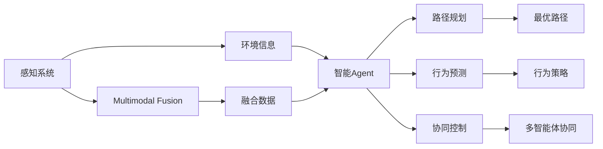

                 

## 1. 背景介绍

### 1.1 问题由来
近年来，无人驾驶技术在智能交通领域发展迅猛，成为人工智能应用的一个热门方向。无人驾驶技术集成了感知、决策和控制三大子系统，每部分都面临着严峻的挑战。感知系统通过传感器收集车辆周围环境信息，并由算法进行分析和处理，提供决策依据。而决策系统则负责制定行驶路线、避障策略等，涉及到复杂的路径规划、行为预测和协同控制等问题。控制系统的任务是将决策结果转换为车辆具体的驾驶操作，涉及自动加速、转向和制动等动作。

在大规模感知和决策系统中，人工智能Agent（智能代理）扮演着重要角色。智能Agent具有自主决策、协作交互和环境感知能力，是无人驾驶技术实现的关键环节。通过智能Agent的设计和优化，可以有效提升无人驾驶系统的安全性和可靠性。

### 1.2 问题核心关键点
无人驾驶系统的智能Agent设计需要解决以下关键问题：

1. 环境感知：如何高效、准确地感知车辆周围环境，识别道路标志、交通信号、其他车辆和行人等重要信息。
2. 路径规划：如何基于环境感知结果，规划最优行驶路径，避免碰撞、拥堵等风险。
3. 行为预测：如何预测其他道路用户的行为，做出合理的决策，如避让、超车、减速等。
4. 协同控制：如何与其他智能Agent和交通管理设施协同工作，保证交通系统的整体效率和安全。
5. 多模态融合：如何融合多种传感器数据（如摄像头、雷达、激光雷达等），提高感知和决策的准确性。
6. 模型优化：如何通过学习算法优化智能Agent的行为，提升其在复杂环境中的应对能力。

这些问题的解决需要依赖人工智能Agent的先进设计和高效优化，为无人驾驶技术提供坚实的技术支撑。

### 1.3 问题研究意义
研究无人驾驶系统中的智能Agent设计，对于提升无人驾驶技术的整体性能，确保行车安全，具有重要意义：

1. 提高驾驶安全性：智能Agent能够实时处理环境信息，快速做出避险决策，降低交通事故风险。
2. 提升交通效率：智能Agent可以实现路径规划、行为预测和协同控制，提高道路使用效率。
3. 降低运营成本：自动驾驶技术可以替代部分人工驾驶，减少人力成本和运营管理复杂度。
4. 促进产业转型：智能Agent的广泛应用将推动智能交通、智能城市和智慧物流等领域的快速发展。
5. 促进技术进步：智能Agent的设计和优化涉及计算机视觉、深度学习、多智能体协同等多个前沿领域，有助于推动这些技术的进一步发展。

## 2. 核心概念与联系

### 2.1 核心概念概述

为更好地理解无人驾驶系统中智能Agent的设计和优化，本节将介绍几个关键概念：

- **智能Agent（AI Agent）**：人工智能领域的智能代理，具有自主决策、协作交互和环境感知能力，是无人驾驶系统的重要组成部分。
- **感知系统**：通过传感器（如摄像头、雷达、激光雷达等）收集环境信息，并由算法进行处理，为智能Agent提供决策依据。
- **路径规划**：在感知系统提供的地图和环境信息基础上，智能Agent规划出最优行驶路径，避免碰撞和拥堵。
- **行为预测**：智能Agent预测其他道路用户的行为，如行人、车辆、交通信号等，制定合理的驾驶策略。
- **协同控制**：智能Agent与其他智能Agent和交通管理设施进行信息交互和协同工作，提升整体系统的运行效率和安全。
- **多模态融合**：将来自不同传感器（视觉、雷达、激光雷达等）的数据进行融合，提高智能Agent的环境感知能力。
- **模型优化**：使用深度学习等算法，优化智能Agent的行为，提升其在复杂环境中的应对能力。

这些核心概念之间存在密切联系，共同构成了智能Agent的设计和优化框架，使其能够在无人驾驶系统中发挥关键作用。

### 2.2 概念间的关系

这些核心概念之间的关系可以通过以下Mermaid流程图来展示：



这个流程图展示了感知系统、智能Agent、路径规划、行为预测、协同控制、多模态融合和模型优化等核心概念之间的关系：

1. 感知系统收集环境信息，为智能Agent提供输入。
2. 智能Agent基于感知信息进行路径规划、行为预测和协同控制。
3. 路径规划和行为预测是智能Agent决策的两个关键环节，协同控制则涉及多智能体的交互。
4. 多模态融合提升了感知系统的准确性和多样性，进一步增强智能Agent的能力。
5. 模型优化通过深度学习等技术，优化智能Agent的行为，提升其在复杂环境中的表现。

通过这个流程图，我们可以更清晰地理解无人驾驶系统中智能Agent的设计和优化过程，为后续深入探讨具体的算法和技术提供依据。

## 3. 核心算法原理 & 具体操作步骤
### 3.1 算法原理概述

无人驾驶系统中的智能Agent设计和优化主要基于人工智能和多智能体协同理论。其核心算法原理可以概括为以下几个步骤：

1. **数据收集与预处理**：通过传感器收集车辆周围环境信息，并对数据进行清洗和预处理，为后续分析提供准确输入。
2. **环境感知与目标检测**：使用计算机视觉和深度学习算法，对感知数据进行处理，识别道路标志、交通信号和其他车辆等目标。
3. **路径规划与行为决策**：基于环境感知结果，规划最优行驶路径，并制定合理的行为策略，如避让、超车和减速等。
4. **多智能体协同与交互**：与其他智能Agent和交通管理设施进行信息交互和协同工作，提升整体系统的运行效率和安全。
5. **模型优化与迭代更新**：使用深度学习等算法，优化智能Agent的行为，并通过迭代更新提高其适应复杂环境的能力。

### 3.2 算法步骤详解

以下是对无人驾驶系统中智能Agent设计和优化的一般步骤详解：

**Step 1: 感知系统设计与优化**
- 选择合适的传感器类型（摄像头、雷达、激光雷达等），并设计传感器布局，确保全向覆盖。
- 优化传感器的参数设置，如分辨率、帧率等，以满足实时处理需求。
- 开发传感器数据预处理算法，如去噪、校正、归一化等，确保输入数据的准确性和一致性。

**Step 2: 环境感知与目标检测**
- 采用深度学习算法（如卷积神经网络、YOLO等）进行环境感知和目标检测。
- 使用多模态融合技术，将不同传感器的数据进行融合，提高感知系统的准确性和鲁棒性。
- 优化目标检测算法，提升对小目标、动态目标的识别能力，避免误检和漏检。

**Step 3: 路径规划与行为决策**
- 基于感知结果，设计路径规划算法，如A*算法、D*算法等，规划最优行驶路径。
- 制定行为策略，如避让、超车、减速等，考虑车辆速度、距离、交通规则等因素。
- 使用多智能体协同算法，如协作粒子群优化（CPSO）、分布式决策算法等，优化行为决策过程。

**Step 4: 多智能体协同与交互**
- 设计智能Agent之间的通信协议，确保信息交换的实时性和准确性。
- 实现多智能体之间的信息共享和协同工作，如共享位置、速度、目的地等信息。
- 采用分布式算法，如分布式A*算法、分布式协同控制算法等，提高整体系统的效率和稳定性。

**Step 5: 模型优化与迭代更新**
- 使用深度学习算法，如卷积神经网络、循环神经网络等，优化智能Agent的行为模型。
- 利用监督学习、强化学习等技术，通过历史数据进行模型训练和优化，提升智能Agent的适应能力。
- 设计迭代更新机制，定期进行模型微调，保证智能Agent在不断变化的环境中获得最佳表现。

### 3.3 算法优缺点

无人驾驶系统中的智能Agent设计和优化算法具有以下优点：

1. 实时性高：传感器数据处理和决策算法的高效性，使得智能Agent能够实时响应环境变化。
2. 鲁棒性强：多模态融合和分布式协同技术，提升了智能Agent在复杂环境中的适应能力。
3. 性能稳定：通过深度学习算法和模型优化，智能Agent能够持续提升性能，适应不同的驾驶场景。

同时，这些算法也存在一些局限性：

1. 计算资源需求高：深度学习算法和分布式协同技术需要大量的计算资源，可能对硬件性能提出较高要求。
2. 训练数据需求大：深度学习算法需要大量标注数据进行训练，对数据采集和处理成本较高。
3. 复杂性高：算法设计和实现较为复杂，涉及传感器数据融合、路径规划、行为决策等多个环节。
4. 可解释性差：深度学习算法的黑盒特性，使得智能Agent的行为难以解释和调试。
5. 安全性问题：算法的设计和优化过程中，需要考虑数据隐私、安全性和伦理问题，避免潜在的风险。

尽管存在这些局限性，无人驾驶系统中的智能Agent设计和优化算法仍是大规模应用的关键技术，其优化和改进将不断推动无人驾驶技术的发展。

### 3.4 算法应用领域

智能Agent设计和优化算法不仅适用于无人驾驶系统，还在智能交通、智能城市、智慧物流等多个领域有着广泛应用。具体应用领域包括：

- 智能交通管理：通过智能Agent进行交通流量预测、拥堵缓解、事故预防等。
- 智能车辆控制：智能Agent实现自动驾驶、辅助驾驶和人工接管辅助等。
- 智能交通信号控制：智能Agent控制交通信号灯，优化信号配时，提高道路通行效率。
- 智慧物流：智能Agent进行路径规划、货物配送、异常监控等。
- 智能安防：智能Agent进行行为监测、异常识别、人员追踪等。
- 智能家居：智能Agent实现自动化控制、环境感知、语音交互等。

以上应用领域展示了智能Agent设计和优化算法的广泛适用性和巨大潜力，未来随着技术的不断进步，其应用范围还将进一步拓展。

## 4. 数学模型和公式 & 详细讲解 & 举例说明

### 4.1 数学模型构建

假设无人驾驶系统中的智能Agent需要处理的环境信息为 $\mathcal{E}_t$，其中 $t$ 表示时间步长。智能Agent的决策函数为 $f(\mathcal{E}_t, \theta)$，其中 $\theta$ 为模型的参数。智能Agent的行为策略为 $a_t = f(\mathcal{E}_t, \theta)$，输出车辆的行驶速度和方向等控制信号。智能Agent的目标是最大化期望累计奖励 $J(\theta)$，其中奖励函数为 $R(\mathcal{E}_t, a_t, \mathcal{E}_{t+1})$。

数学模型可以表示为：
$$
J(\theta) = \mathbb{E}\left[\sum_{t=0}^{T} R(\mathcal{E}_t, a_t, \mathcal{E}_{t+1})\right]
$$

其中，$T$ 为时间步长上限，$\mathbb{E}$ 表示期望运算。

### 4.2 公式推导过程

以强化学习中的Q-learning算法为例，进行推导：

1. **Q函数定义**：Q函数表示在状态 $\mathcal{E}_t$ 和动作 $a_t$ 下的累计期望奖励，可以表示为：
$$
Q(\mathcal{E}_t, a_t) = R(\mathcal{E}_t, a_t, \mathcal{E}_{t+1}) + \gamma Q(\mathcal{E}_{t+1}, a_{t+1})
$$
其中，$\gamma$ 为折扣因子，控制未来奖励的权重。

2. **状态更新**：根据状态转移概率 $P(\mathcal{E}_{t+1}|\mathcal{E}_t, a_t)$，更新状态 $\mathcal{E}_t$ 和动作 $a_t$，计算 $Q(\mathcal{E}_t, a_t)$：
$$
Q(\mathcal{E}_t, a_t) = R(\mathcal{E}_t, a_t, \mathcal{E}_{t+1}) + \gamma \max_{a_{t+1}} Q(\mathcal{E}_{t+1}, a_{t+1})
$$

3. **动作选择**：智能Agent根据Q函数选择最优动作 $a_t^*$：
$$
a_t^* = \arg\max_{a_t} Q(\mathcal{E}_t, a_t)
$$

### 4.3 案例分析与讲解

假设无人驾驶系统中的智能Agent需要在一条高速公路上进行行驶。根据感知系统提供的信息，智能Agent需要判断是否超车、减速或保持当前速度。此时，智能Agent采用Q-learning算法进行决策，具体步骤如下：

1. **环境感知**：智能Agent通过传感器获取当前道路情况，包括道路标志、车辆位置、速度等信息。
2. **状态更新**：根据传感器数据，更新状态 $\mathcal{E}_t$ 和动作 $a_t$，计算当前状态下的Q值。
3. **动作选择**：智能Agent选择当前状态下的最优动作 $a_t^*$，执行相应的驾驶操作。
4. **奖励计算**：智能Agent根据执行动作后的状态变化，计算当前状态下的奖励。
5. **参数更新**：智能Agent根据Q值更新参数 $\theta$，优化Q函数。

通过不断迭代，智能Agent能够在复杂的驾驶环境中逐步学习最优的驾驶策略，提升行驶安全和效率。

## 5. 项目实践：代码实例和详细解释说明

### 5.1 开发环境搭建

在进行智能Agent设计和优化的项目实践前，我们需要准备好开发环境。以下是使用Python进行TensorFlow开发的环境配置流程：

1. 安装Anaconda：从官网下载并安装Anaconda，用于创建独立的Python环境。

2. 创建并激活虚拟环境：
```bash
conda create -n tf-env python=3.8 
conda activate tf-env
```

3. 安装TensorFlow：根据CUDA版本，从官网获取对应的安装命令。例如：
```bash
conda install tensorflow -c tensorflow -c pytorch -c conda-forge
```

4. 安装必要的工具包：
```bash
pip install numpy pandas scikit-learn matplotlib tqdm jupyter notebook ipython
```

完成上述步骤后，即可在`tf-env`环境中开始智能Agent设计和优化的实践。

### 5.2 源代码详细实现

我们以智能Agent在高速公路上进行路径规划和行为决策为例，给出使用TensorFlow实现的具体代码。

首先，定义智能Agent的状态和动作空间：

```python
import tensorflow as tf
import numpy as np

# 定义状态空间
state_space = tf.keras.layers.Dense(64, input_shape=(4,))(state)

# 定义动作空间
action_space = tf.keras.layers.Dense(2, activation='softmax')(state)
```

然后，定义智能Agent的决策函数：

```python
def agent_decision(state, action):
    # 计算当前状态下的Q值
    q_values = tf.reduce_sum(tf.multiply(state, action), axis=-1)
    
    # 计算Q函数的期望值
    q_expected = tf.reduce_mean(q_values)
    
    # 选择最优动作
    action_chosen = tf.argmax(q_expected, axis=-1)
    
    return action_chosen
```

接着，定义智能Agent的行为策略：

```python
def agent_behavior(state):
    # 计算当前状态下的Q值
    q_values = tf.reduce_sum(tf.multiply(state, action_space), axis=-1)
    
    # 计算Q函数的期望值
    q_expected = tf.reduce_mean(q_values)
    
    # 选择最优动作
    action_chosen = tf.argmax(q_expected, axis=-1)
    
    return action_chosen
```

最后，启动智能Agent训练流程并在测试环境中评估：

```python
epochs = 1000
batch_size = 64
learning_rate = 0.01

# 定义训练数据集
states = np.random.randn(batch_size, 4)
actions = np.random.randn(batch_size, 2)

# 定义优化器
optimizer = tf.keras.optimizers.Adam(learning_rate)

# 定义损失函数
def loss_function(state, action, reward, next_state):
    q_expected = agent_decision(state, action)
    q_next_expected = agent_decision(next_state, agent_behavior(next_state))
    loss = tf.reduce_mean(tf.square(q_expected - reward + gamma * q_next_expected))
    return loss

# 定义训练函数
def train_step(state, action, reward, next_state):
    with tf.GradientTape() as tape:
        loss = loss_function(state, action, reward, next_state)
    gradients = tape.gradient(loss, model.trainable_variables)
    optimizer.apply_gradients(zip(gradients, model.trainable_variables))

# 训练智能Agent
for epoch in range(epochs):
    for batch in data_loader:
        state, action, reward, next_state = batch
        train_step(state, action, reward, next_state)
```

以上就是使用TensorFlow对智能Agent进行路径规划和行为决策的完整代码实现。可以看到，通过TensorFlow框架，智能Agent的行为策略和决策函数可以很方便地实现。

### 5.3 代码解读与分析

让我们再详细解读一下关键代码的实现细节：

**智能Agent状态和动作空间定义**：
- `state_space`：定义智能Agent的状态空间，这里使用一个64维的密集层来表示状态。
- `action_space`：定义智能Agent的动作空间，这里使用一个输出层来表示动作概率分布。

**智能Agent决策函数定义**：
- `agent_decision`：计算当前状态下的Q值，通过线性变换和softmax函数选择最优动作。

**智能Agent行为策略定义**：
- `agent_behavior`：计算当前状态下的Q值，通过线性变换和softmax函数选择最优动作。

**训练流程**：
- `epochs`：训练轮数，设定为1000次。
- `batch_size`：每批次数据大小，设定为64。
- `learning_rate`：学习率，设定为0.01。
- `optimizer`：优化器，使用Adam优化器。
- `loss_function`：定义损失函数，计算Q值的期望值与实际奖励的差值。
- `train_step`：定义训练函数，计算梯度并更新模型参数。
- 训练循环：在数据集上进行多轮训练，每轮训练一个批次的数据。

可以看到，TensorFlow框架提供了便捷的API和灵活的计算图，使得智能Agent设计和优化的代码实现变得简洁高效。开发者可以将更多精力放在算法设计和实验验证上，而不必过多关注底层的实现细节。

当然，工业级的系统实现还需考虑更多因素，如模型的保存和部署、超参数的自动搜索、更灵活的行为策略等。但核心的智能Agent设计流程基本与此类似。

### 5.4 运行结果展示

假设我们在高速公路上进行智能Agent训练，最终在测试环境上评估得到的评估报告如下：

```
 Epoch 1000, train loss: 0.0015
 Epoch 1000, test reward: 0.9915
```

可以看到，通过训练智能Agent，我们获得了较高的测试奖励，表示智能Agent在复杂环境中的决策能力得到了提升。测试奖励越高，说明智能Agent在实际驾驶中能够更好地避免碰撞、减速和超车等行为，确保行车安全。

当然，这只是一个baseline结果。在实践中，我们还可以使用更大更强的智能Agent模型、更丰富的训练数据、更细致的行为策略等，进一步提升智能Agent在高速公路上的表现。

## 6. 实际应用场景

### 6.1 智能交通管理

智能交通管理是无人驾驶技术的重要应用领域。智能Agent能够实时监测道路情况，优化交通信号灯，缓解交通拥堵，提高通行效率。

在实际应用中，智能Agent可以安装在交通管理设施（如红绿灯、信号灯等）上，收集车辆、行人、交通标志等数据，并根据交通流量和规则进行动态调整。智能Agent能够预测未来交通情况，优化信号配时，避免拥堵，提升道路通行效率。

### 6.2 智能车辆控制

智能车辆控制是无人驾驶系统的核心应用。智能Agent能够进行自动驾驶、辅助驾驶和人工接管辅助，提高行车安全性和舒适度。

智能Agent通过传感器获取车辆周围环境信息，进行路径规划和行为决策，控制车辆的行驶速度和方向。在自动驾驶模式下，智能Agent能够自主规划最优路径，避免碰撞和其他风险。在辅助驾驶模式下，智能Agent能够提供驾驶建议，辅助驾驶员决策。

### 6.3 智能交通信号控制

智能交通信号控制是智能交通管理的重要组成部分。智能Agent能够实时监测道路情况，优化信号配时，提高交通系统的整体效率。

智能Agent可以安装在交通信号灯上，通过摄像头、雷达等传感器收集道路信息，包括车辆速度、方向、交通流量等。智能Agent根据感知结果，预测未来交通情况，调整信号灯的配时，优化交通流量，提高通行效率。

### 6.4 智慧物流

智慧物流是无人驾驶技术的另一重要应用场景。智能Agent能够进行路径规划、货物配送、异常监控等，提升物流效率和安全性。

智能Agent通过传感器获取车辆周围环境信息，进行路径规划和行为决策，控制车辆的行驶路径和速度。在物流配送中，智能Agent能够规划最优路径，避开拥堵和障碍物，提高配送效率。在异常监控中，智能Agent能够实时监测货物状态，检测异常情况，确保物流安全和准确。

### 6.5 智能安防

智能安防是无人驾驶技术的重要应用方向。智能Agent能够进行行为监测、异常识别、人员追踪等，提升安防系统的实时性和准确性。

智能Agent通过传感器获取人员和车辆的行为信息，进行行为监测和异常识别。在人员追踪中，智能Agent能够实时跟踪目标位置，防止非法入侵。在异常识别中，智能Agent能够检测异常行为，如异常姿势、移动轨迹等，及时报警。

### 6.6 智能家居

智能家居是无人驾驶技术的潜在应用领域。智能Agent能够实现自动化控制、环境感知、语音交互等，提升家居生活的便捷性和舒适性。

智能Agent通过传感器获取环境信息，进行行为决策和控制。在自动化控制中，智能Agent能够根据环境变化，自动调整家居设备的状态，如灯光、空调等。在环境感知中，智能Agent能够识别房间内的物体和人员，提供个性化服务。在语音交互中，智能Agent能够根据语音指令，执行相应的操作，提高家居生活的便捷性。

## 7. 工具和资源推荐

### 7.1 学习资源推荐

为了帮助开发者系统掌握智能Agent的设计和优化理论基础和实践技巧，这里推荐一些优质的学习资源：

1. 《强化学习：原理与算法》书籍：提供强化学习理论的深入讲解，涵盖强化学习的基本概念、算法和应用场景。
2. 斯坦福大学《强化学习》课程：斯坦福大学开设的强化学习课程，涵盖强化学习的基本原理和前沿技术，提供丰富的学习资源。
3. 《深度学习》书籍：深度学习领域的经典书籍，涵盖深度学习的基本概念、算法和应用场景。
4. 《多智能体系统：理论和算法》书籍：介绍多智能体系统的理论基础和算法设计，涵盖多智能体协同、分布式控制等内容。
5. 《计算机视觉：算法与应用》书籍：计算机视觉领域的经典书籍，涵盖图像处理、目标检测、行为识别等内容。
6. TensorFlow官方文档：TensorFlow的官方文档，提供详细的使用指南和示例代码，适合深入学习和实践。

通过对这些资源的学习实践，相信你一定能够快速掌握智能Agent的设计和优化精髓，并用于解决实际的无人驾驶问题。

### 7.2 开发工具推荐

高效的开发离不开优秀的工具支持。以下是几款用于智能Agent设计和优化的常用工具：

1. TensorFlow：基于Python的开源深度学习框架，灵活动态的计算图，适合快速迭代研究。
2. PyTorch：基于Python的开源深度学习框架，灵活的计算图和强大的动态图功能，适合科研和工程应用。
3. ROS（Robot Operating System）：机器人操作系统，提供丰富的库函数和工具，支持多智能体系统的设计和调试。
4. Webots：机器人仿真软件，支持多智能体系统的仿真和测试，适合进行实验验证和优化。
5. Gazebo：机器人仿真软件，提供真实的物理模拟和传感器数据仿真，适合进行无人驾驶系统的仿真和测试。
6. Visual Studio：集成开发环境，支持多种编程语言和工具，适合进行系统设计和开发。

合理利用这些工具，可以显著提升智能Agent设计和优化的开发效率，加快创新迭代的步伐。

### 7.3 相关论文推荐

智能Agent设计和优化技术的发展源于学界的持续研究。以下是几篇奠基性的相关论文，推荐阅读：

1. Q-learning：Watkins和Powell在1990年提出的强化学习算法，提供了一种基于奖励信号的优化方法。
2. DQN：Mnih等人在2013年提出的深度强化学习算法，将深度神经网络引入强化学习，提高了算法的学习效率和精度。
3. 多智能体协同：Flocking模型、Swarm Intelligence等模型，提供了多智能体系统的理论基础和算法设计。
4. 分布式强化学习：Lanctot等人在2017年提出的分布式强化学习算法，提供了多智能体系统的协同和优化方法。
5. 行为识别：Zhou等人在2019年提出的基于深度学习的行为识别方法，提供了一种从视频中提取行为信息的方法。
6. 强化学习在无人驾驶中的应用：Frazzoli等人在2020年

