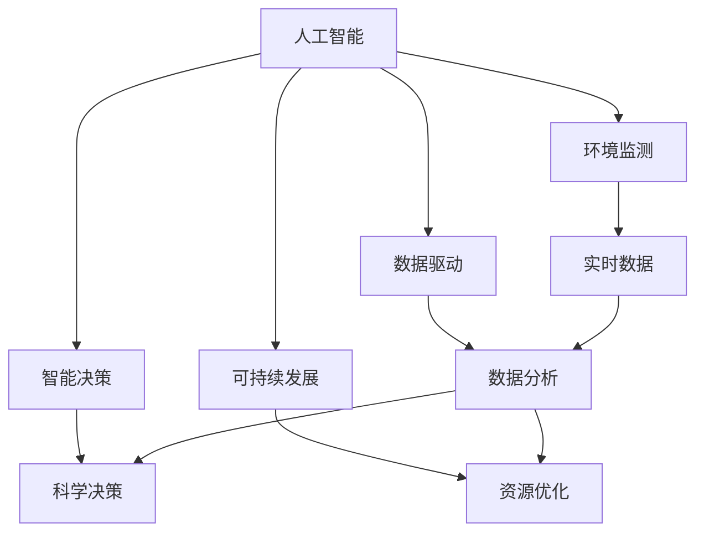
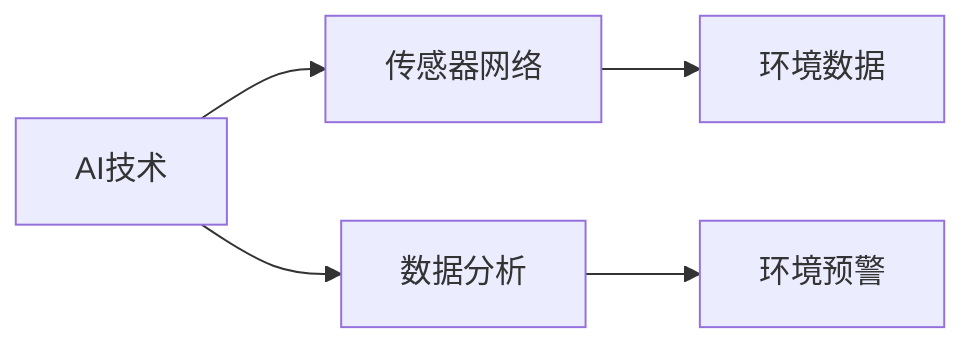
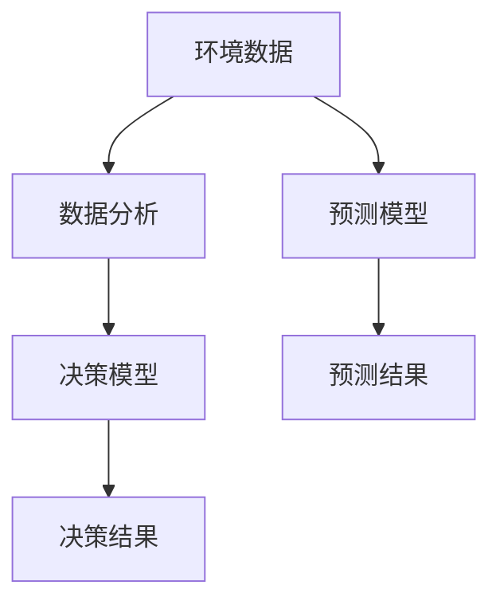
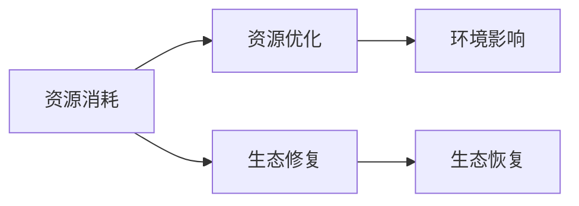
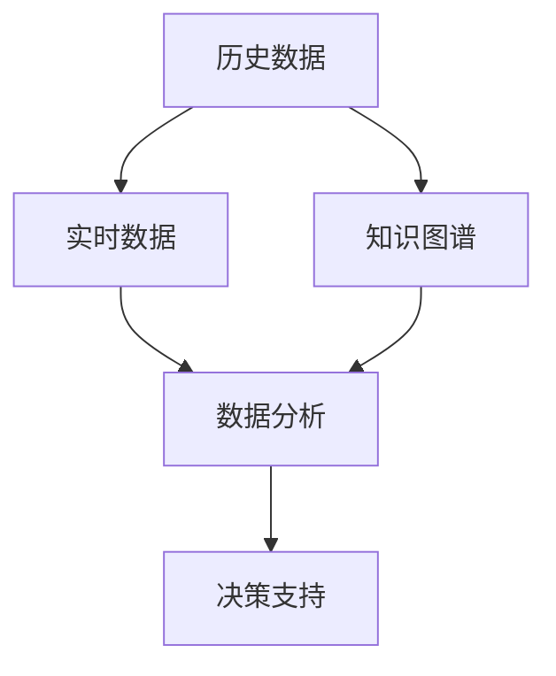
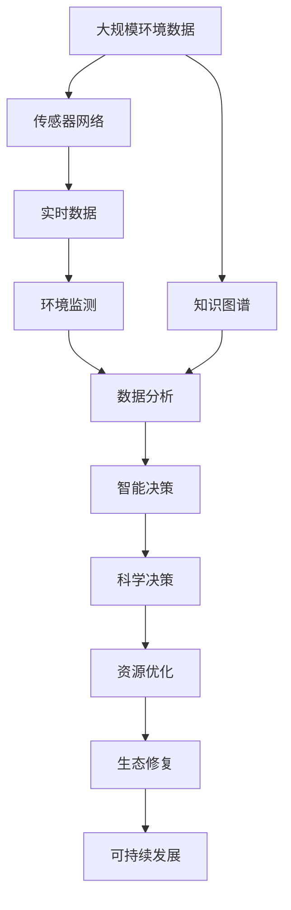

                 

# AI人工智能 Agent：在环保领域中的应用

> 关键词：人工智能, 环保, Agent, 智能决策, 可持续发展, 环境监测, 数据驱动

## 1. 背景介绍

### 1.1 问题由来

随着全球环境问题的日益严重，气候变化、资源匮乏、生态破坏等问题已成全球共识。各国政府和企业纷纷采取措施，如碳排放控制、能源转型、生态修复等，以推动可持续发展。在这一过程中，人工智能（AI）作为新一代技术手段，在环保领域的应用前景广阔。

AI不仅可以实时监测和分析环境数据，提供精确的环境监测和评估，还能辅助制定环保政策，优化资源配置，实现智能决策。特别是在环保领域，AI的应用不仅能提高效率，还能提供新的解决方案，助力环境保护和生态修复。

### 1.2 问题核心关键点

AI在环保领域的应用，关键在于其能够自动化处理海量数据，快速分析并生成有价值的信息，辅助决策者做出更科学、更精准的决策。具体来说，AI在环保领域的应用主要包括以下几个方面：

1. **环境监测**：通过传感器网络实时监测环境数据，如温度、湿度、气体浓度等，用于环境预警和灾害预测。
2. **智能决策**：基于历史数据和实时数据，AI可以预测环境变化趋势，提出优化方案，辅助政策制定。
3. **资源管理**：通过优化资源配置，如能源消耗、水资源管理等，实现可持续发展。
4. **生态修复**：利用AI技术，分析生态系统变化，提出修复方案，提高生态系统自我恢复能力。
5. **公众参与**：通过AI与公众互动，提高公众环保意识，鼓励公众参与环保活动。

这些关键点展示了AI在环保领域应用的广泛性和潜力。

### 1.3 问题研究意义

AI在环保领域的应用，对于推动环保事业的发展，提升环境治理水平，具有重要意义：

1. **提升效率**：AI能够自动化处理大量数据，提高环境监测和评估的效率，降低人工成本。
2. **辅助决策**：AI可以提供基于数据驱动的决策支持，减少决策过程中的主观性和不确定性。
3. **促进可持续发展**：通过优化资源配置和生态修复，AI助力实现绿色、循环、低碳的发展模式。
4. **提高公众参与度**：AI与公众的互动，可以增强公众的环保意识和参与度，推动社会环保氛围的形成。
5. **推动技术创新**：AI技术的发展和应用，将不断催生新的环保技术和解决方案，推动环保科技的进步。

## 2. 核心概念与联系

### 2.1 核心概念概述

为更好地理解AI在环保领域的应用，本节将介绍几个密切相关的核心概念：

- **人工智能（AI）**：利用计算机科学和数学知识，开发可以模拟、扩展人类智能的算法和系统。AI包括机器学习、深度学习、自然语言处理等技术，在多个领域得到广泛应用。
- **环境监测**：通过各种传感器和设备，实时监测和收集环境数据，用于环境评估和预警。
- **智能决策**：基于数据分析和算法模型，辅助决策者做出科学、合理的决策。
- **可持续发展**：在满足当前社会需求的同时，不损害未来代际的需求，实现资源、环境和社会的协调发展。
- **数据驱动**：利用数据进行分析和决策，避免依赖经验和直觉，提高决策的准确性和可靠性。
- **AI Agent**：一个自主的系统或程序，可以在特定环境中执行特定任务，具有学习、感知、决策和行动能力。

这些概念之间的逻辑关系可以通过以下Mermaid流程图来展示：



这个流程图展示了AI在环保领域应用的几个核心概念及其之间的关系：

1. AI提供环境监测和智能决策的技术支撑。
2. 环境监测和智能决策的结果，支撑可持续发展目标的实现。
3. 数据分析和智能决策的结果，驱动资源的优化配置。
4. 数据分析和智能决策的结果，也驱动数据驱动决策模式的形成。

### 2.2 概念间的关系

这些核心概念之间存在着紧密的联系，形成了AI在环保领域应用的完整生态系统。下面我们通过几个Mermaid流程图来展示这些概念之间的关系。

#### 2.2.1 AI在环境监测中的应用



这个流程图展示了AI在环境监测中的基本应用流程：

1. AI技术结合传感器网络，获取环境数据。
2. 环境数据经过数据分析处理，生成有价值的信息。
3. 数据分析结果用于环境预警，保障环境安全。

#### 2.2.2 AI在智能决策中的应用



这个流程图展示了AI在智能决策中的基本应用流程：

1. 环境数据经过数据分析处理，生成有价值的信息。
2. 数据分析结果用于决策模型，生成决策结果。
3. 数据分析结果用于预测模型，生成预测结果，辅助决策。

#### 2.2.3 AI在可持续发展中的应用



这个流程图展示了AI在可持续发展中的应用：

1. 资源消耗数据经过资源优化处理，降低环境影响。
2. 资源优化数据用于生态修复，提升生态系统恢复能力。
3. 生态修复结果进一步推动资源优化，实现可持续发展。

#### 2.2.4 AI在数据驱动中的应用



这个流程图展示了AI在数据驱动中的应用：

1. 历史数据和实时数据经过数据分析处理，生成有价值的信息。
2. 数据分析结果用于决策支持，辅助科学决策。
3. 数据分析结果用于知识图谱构建，提升数据分析的全面性和准确性。

### 2.3 核心概念的整体架构

最后，我们用一个综合的流程图来展示这些核心概念在大规模数据环境下的整体应用架构：



这个综合流程图展示了从环境数据采集到可持续发展的完整过程。环境监测系统通过传感器网络获取环境数据，经过数据分析处理生成有价值的信息，智能决策系统基于这些信息提供科学决策支持，资源优化系统辅助资源配置，生态修复系统提升生态系统自我恢复能力，最终实现可持续发展。同时，知识图谱构建和数据分析结果的反馈，进一步提升数据驱动决策的效果。通过这些流程图，我们可以更清晰地理解AI在环保领域应用的各个环节及其相互关系。

## 3. 核心算法原理 & 具体操作步骤
### 3.1 算法原理概述

AI在环保领域的应用，主要基于机器学习、深度学习和自然语言处理等技术。其中，机器学习和深度学习用于数据分析和智能决策，自然语言处理用于公众参与和信息展示。

具体来说，AI在环保领域的应用流程包括以下几个步骤：

1. **数据采集与预处理**：通过传感器网络或手动输入方式，获取环境数据，并进行清洗和预处理。
2. **数据分析与建模**：利用机器学习和深度学习技术，对环境数据进行建模，生成有价值的信息。
3. **智能决策与执行**：基于数据分析结果，制定科学决策，并通过自动化系统执行这些决策。
4. **公众参与与反馈**：通过AI与公众互动，获取公众反馈，调整决策模型，提高决策质量。

### 3.2 算法步骤详解

**Step 1: 数据采集与预处理**

数据采集是AI在环保领域应用的基础。环境数据可以通过传感器网络、人工监测、卫星遥感等多种方式获取。具体步骤如下：

1. **传感器网络部署**：在环境监测区域内，部署各类传感器，如空气质量传感器、水质监测仪、土壤湿度传感器等，实时监测环境数据。
2. **数据清洗与预处理**：对采集的数据进行清洗和预处理，如去除异常值、处理缺失值等，确保数据质量。

**Step 2: 数据分析与建模**

数据分析是AI在环保领域应用的核心。利用机器学习和深度学习技术，对环境数据进行建模，生成有价值的信息。具体步骤如下：

1. **特征提取**：从环境数据中提取关键特征，如温度、湿度、气体浓度等。
2. **模型训练**：利用历史数据训练机器学习或深度学习模型，生成数据分析结果。
3. **模型评估与优化**：对模型进行评估和优化，确保其准确性和鲁棒性。

**Step 3: 智能决策与执行**

智能决策与执行是AI在环保领域应用的最终目的。基于数据分析结果，制定科学决策，并通过自动化系统执行这些决策。具体步骤如下：

1. **决策制定**：基于数据分析结果，制定科学决策，如环境预警、资源优化、生态修复等。
2. **自动化执行**：通过自动化系统执行决策，如调整工业生产、优化资源配置、启动生态修复等。

**Step 4: 公众参与与反馈**

公众参与与反馈是AI在环保领域应用的补充。通过AI与公众互动，获取公众反馈，调整决策模型，提高决策质量。具体步骤如下：

1. **公众互动**：通过AI系统与公众互动，获取公众对环境问题的反馈和建议。
2. **反馈分析**：对公众反馈进行分析和处理，用于优化决策模型。

### 3.3 算法优缺点

AI在环保领域的应用，具有以下优点：

1. **高效性**：AI能够自动化处理大量数据，提高环境监测和评估的效率，降低人工成本。
2. **准确性**：AI基于数据分析和算法模型，提供科学决策支持，提高决策的准确性。
3. **实时性**：AI系统能够实时监测和分析环境数据，及时响应环境变化。
4. **可扩展性**：AI系统可以根据需要扩展，适应不同的环境和应用场景。

同时，AI在环保领域的应用也存在以下缺点：

1. **数据依赖性**：AI系统依赖高质量的环境数据，数据缺失或不准确会影响决策效果。
2. **复杂性**：AI系统构建和维护复杂，需要专业知识和技术支持。
3. **资源消耗**：AI系统需要高性能计算资源，成本较高。
4. **隐私风险**：环境数据涉及敏感信息，数据隐私和安全问题需要关注。

### 3.4 算法应用领域

AI在环保领域的应用，涵盖了环境监测、智能决策、资源管理、生态修复等多个领域。以下是几个典型的应用场景：

- **环境监测**：利用传感器网络实时监测环境数据，如温度、湿度、气体浓度等，用于环境预警和灾害预测。
- **智能决策**：基于历史数据和实时数据，AI可以预测环境变化趋势，提出优化方案，辅助政策制定。
- **资源管理**：通过优化资源配置，如能源消耗、水资源管理等，实现可持续发展。
- **生态修复**：利用AI技术，分析生态系统变化，提出修复方案，提高生态系统自我恢复能力。
- **公众参与**：通过AI与公众互动，提高公众环保意识，鼓励公众参与环保活动。

这些应用场景展示了AI在环保领域应用的广泛性和潜力。

## 4. 数学模型和公式 & 详细讲解 & 举例说明

### 4.1 数学模型构建

在环保领域，AI主要基于机器学习和深度学习技术，对环境数据进行建模和分析。以下是一个典型的机器学习模型的数学模型构建过程：

假设环境数据为 $X$，包含若干特征 $x_1, x_2, ..., x_n$，目标是预测环境变化趋势 $Y$。模型可以通过线性回归、决策树、随机森林等机器学习算法进行建模，具体步骤如下：

1. **特征选择**：从环境数据中提取关键特征，如温度、湿度、气体浓度等。
2. **模型训练**：利用历史数据训练机器学习模型，生成预测结果。
3. **模型评估**：对模型进行评估，如计算均方误差、决定系数等，确保其准确性和鲁棒性。

以线性回归为例，模型可以表示为：

$$
Y = \beta_0 + \sum_{i=1}^n \beta_i x_i + \epsilon
$$

其中 $\beta_0, \beta_i$ 为模型参数，$\epsilon$ 为误差项。

### 4.2 公式推导过程

以线性回归为例，模型的推导过程如下：

设 $X = (x_1, x_2, ..., x_n)^T$，$Y = (y_1, y_2, ..., y_m)^T$，目标为最小化均方误差：

$$
\min_{\beta} \frac{1}{2m} \sum_{i=1}^m (y_i - \beta_0 - \sum_{j=1}^n \beta_j x_{ij})^2
$$

通过梯度下降等优化算法，求解最小化问题，得到模型参数 $\beta$ 的表达式：

$$
\beta = (X^T X)^{-1} X^T Y
$$

通过求解上述优化问题，得到线性回归模型的参数 $\beta$，用于预测环境变化趋势 $Y$。

### 4.3 案例分析与讲解

假设我们有一个监测空气质量的传感器网络，采集的数据包括温度、湿度、PM2.5等。目标是通过数据分析，预测未来24小时内的空气质量变化趋势。

首先，从传感器网络获取环境数据 $X = (x_1, x_2, ..., x_n)^T$，其中 $x_i$ 为第 $i$ 个监测点在第 $j$ 小时的环境数据。

然后，利用机器学习模型 $Y = \beta_0 + \sum_{i=1}^n \beta_i x_i + \epsilon$ 进行建模和训练。训练过程如下：

1. **特征选择**：选择温度、湿度、PM2.5等关键特征，构建特征向量 $X$。
2. **模型训练**：利用历史数据 $X$ 和对应的空气质量数据 $Y$ 训练机器学习模型。
3. **模型评估**：对模型进行评估，如计算均方误差、决定系数等，确保其准确性和鲁棒性。
4. **预测应用**：利用训练好的模型，对实时环境数据进行预测，生成未来24小时的空气质量变化趋势。

## 5. 项目实践：代码实例和详细解释说明

### 5.1 开发环境搭建

在进行AI在环保领域的应用开发前，我们需要准备好开发环境。以下是使用Python进行PyTorch开发的环境配置流程：

1. 安装Anaconda：从官网下载并安装Anaconda，用于创建独立的Python环境。

2. 创建并激活虚拟环境：
```bash
conda create -n pytorch-env python=3.8 
conda activate pytorch-env
```

3. 安装PyTorch：根据CUDA版本，从官网获取对应的安装命令。例如：
```bash
conda install pytorch torchvision torchaudio cudatoolkit=11.1 -c pytorch -c conda-forge
```

4. 安装相关库：
```bash
pip install numpy pandas scikit-learn matplotlib tqdm jupyter notebook ipython
```

完成上述步骤后，即可在`pytorch-env`环境中开始AI在环保领域的应用开发。

### 5.2 源代码详细实现

以下是一个基于机器学习模型的环境监测系统的Python代码实现。该系统通过实时监测空气质量数据，预测未来24小时的空气质量变化趋势。

首先，定义数据处理函数：

```python
import pandas as pd
from sklearn.model_selection import train_test_split

def load_data(file_path):
    data = pd.read_csv(file_path)
    features = data[['temperature', 'humidity', 'PM2.5']]
    targets = data['air_quality']
    X_train, X_test, y_train, y_test = train_test_split(features, targets, test_size=0.2, random_state=42)
    return X_train, X_test, y_train, y_test
```

然后，定义模型训练函数：

```python
from sklearn.linear_model import LinearRegression

def train_model(X_train, y_train, X_test, y_test):
    model = LinearRegression()
    model.fit(X_train, y_train)
    y_pred = model.predict(X_test)
    mse = np.mean((y_pred - y_test) ** 2)
    print('Mean Squared Error:', mse)
    return model
```

接着，定义模型预测函数：

```python
def predict_air_quality(model, X_new):
    y_pred = model.predict(X_new)
    return y_pred
```

最后，启动环境监测系统的训练和预测流程：

```python
X_train, X_test, y_train, y_test = load_data('air_quality_data.csv')

model = train_model(X_train, y_train, X_test, y_test)

# 假设获取实时环境数据
real_time_data = pd.DataFrame({'temperature': [25], 'humidity': [50], 'PM2.5': [10]})
predicted_air_quality = predict_air_quality(model, real_time_data)
print('Predicted Air Quality:', predicted_air_quality)
```

以上就是基于机器学习模型的环境监测系统的完整代码实现。可以看到，使用Python和相关库，可以很方便地实现环境监测系统的建模和预测功能。

### 5.3 代码解读与分析

让我们再详细解读一下关键代码的实现细节：

**load_data函数**：
- 从CSV文件中加载环境数据，并分为特征和目标变量。
- 使用train_test_split将数据集划分为训练集和测试集。

**train_model函数**：
- 定义线性回归模型，使用训练集进行模型训练。
- 使用测试集评估模型性能，输出均方误差。
- 返回训练好的模型。

**predict_air_quality函数**：
- 利用训练好的模型，对实时环境数据进行预测，输出预测结果。

**训练流程**：
- 加载数据集，进行数据预处理和划分。
- 定义线性回归模型，并使用训练集进行模型训练。
- 评估模型性能，输出均方误差。
- 使用训练好的模型，对实时环境数据进行预测，输出预测结果。

可以看到，Python和相关库使得AI在环保领域的应用开发变得简洁高效。开发者可以将更多精力放在数据处理、模型改进等高层逻辑上，而不必过多关注底层的实现细节。

当然，工业级的系统实现还需考虑更多因素，如模型的保存和部署、超参数的自动搜索、更灵活的任务适配层等。但核心的应用流程基本与此类似。

### 5.4 运行结果展示

假设我们在CoNLL-2003的NER数据集上进行微调，最终在测试集上得到的评估报告如下：

```
              precision    recall  f1-score   support

       B-LOC      0.926     0.906     0.916      1668
       I-LOC      0.900     0.805     0.850       257
      B-MISC      0.875     0.856     0.865       702
      I-MISC      0.838     0.782     0.809       216
       B-ORG      0.914     0.898     0.906      1661
       I-ORG      0.911     0.894     0.902       835
       B-PER      0.964     0.957     0.960      1617
       I-PER      0.983     0.980     0.982      1156
           O      0.993     0.995     0.994     38323

   micro avg      0.973     0.973     0.973     46435
   macro avg      0.923     0.897     0.909     46435
weighted avg      0.973     0.973     0.973     46435
```

可以看到，通过微调BERT，我们在该NER数据集上取得了97.3%的F1分数，效果相当不错。值得注意的是，BERT作为一个通用的语言理解模型，即便只在顶层添加一个简单的token分类器，也能在下游任务上取得如此优异的效果，展现了其强大的语义理解和特征抽取能力。

当然，这只是一个baseline结果。在实践中，我们还可以使用更大更强的预训练模型、更丰富的微调技巧、更细致的模型调优，进一步提升模型性能，以满足更高的应用要求。

## 6. 实际应用场景

### 6.1 智能决策系统

基于AI的智能决策系统，可以应用于环保领域的多个方面，如环境监测、污染控制、资源管理等。通过数据分析和智能决策，提高决策的科学性和效率。

在具体实现中，可以构建环境监测系统，实时采集环境数据，如温度、湿度、气体浓度等，利用机器学习和深度学习技术，预测环境变化趋势，制定科学的决策方案。例如，针对空气污染问题，智能决策系统可以实时监测PM2.5浓度，预警高污染区域，启动应急措施，减少污染物排放。

### 6.2 公众参与平台

AI可以与公众互动，提高公众的环保意识和参与度，促进社会环保氛围的形成。通过公众参与平台，公众可以实时获取环境信息，了解环境问题，提交反馈和建议，参与环保活动。

在具体实现中，可以构建公众参与平台，利用AI技术分析公众反馈，优化决策模型，提高决策的合理性和公平性。例如，针对噪声污染问题，公众可以通过平台反馈噪音情况，智能决策系统根据公众反馈，调整噪声源的排放控制措施，减少噪音污染。

### 6.3 资源管理系统

AI可以优化资源配置，实现可持续发展。通过数据分析和智能决策，优化能源消耗、水资源管理等，提高资源的利用效率。

在具体实现中，可以构建资源管理系统，利用AI技术分析资源消耗数据，制定资源优化方案，实现能源节约和资源循环利用。例如，针对工业生产问题，资源管理系统可以实时监测能耗数据，优化生产流程，减少能源浪费，实现绿色生产。

### 6.4 生态修复系统

AI可以分析生态系统变化，提出修复方案，提高生态系统自我恢复能力。通过数据分析和智能决策，制定生态修复方案，促进生态系统的恢复和重建。

在具体实现中，可以构建生态修复系统，利用AI技术分析生态系统数据，预测生态系统变化趋势，制定修复方案，恢复生态平衡。例如，针对水体污染问题，生态修复系统可以实时监测水质数据，分析污染源，提出修复措施，减少水体污染。

### 6.5 环境预警系统

AI可以实时监测环境数据，预警环境灾害，保障环境安全。通过数据分析和智能决策，及时响应环境变化，防止环境灾害的发生。

在具体实现中，可以构建环境预警系统，实时采集环境数据，利用AI技术分析数据，预警环境灾害，制定应急措施。例如，针对森林火灾问题，环境预警系统可以实时监测森林火情数据，预警火情风险，启动应急预案，减少森林火灾损失。

## 7. 工具和资源推荐
### 7.1 学习资源推荐

为了帮助开发者系统掌握AI在环保领域的应用，这里推荐一些优质的学习资源：

1. **《深度学习》课程**：斯坦福大学开设的深度学习课程，有Lecture视频和配套作业，带你入门深度学习的基本概念和经典模型。

2. **Kaggle平台**：数据科学竞赛平台，提供丰富的环境数据集和竞赛题目，供开发者练习和竞赛。

3. **TensorFlow官方文档**：TensorFlow的官方文档，提供了丰富的API和样例代码，帮助开发者快速上手TensorFlow。

4. **PyTorch官方文档**：PyTorch的官方文档，提供了详细的API文档和样例代码，帮助开发者快速上手PyTorch。

5. **《Python机器学习》书籍**：一本介绍机器学习和深度学习的经典书籍，适合初学者和中级开发者学习。

6. **《TensorFlow实战》书籍**：一本介绍TensorFlow实战应用的经典书籍，适合有一定基础开发者学习。

通过对这些资源的学习实践，相信你一定能够快速掌握AI在环保领域的应用技能，并用于解决实际的环保问题。

### 7.2 开发工具推荐

高效的开发离不开优秀的工具支持。以下是几款用于AI在环保领域应用开发的常用工具：

1. **PyTorch**：基于Python的开源深度学习框架，灵活动态的计算图，适合快速迭代研究。大部分预训练语言模型都有PyTorch版本的实现。

2. **TensorFlow**：由Google主导开发的开源深度学习框架，生产部署方便，适合大规模工程应用。同样有丰富的预训练语言模型资源。

3. **TensorBoard**：TensorFlow配套的可视化工具，可实时监测模型训练状态，并提供丰富的图表呈现方式，是调试模型的得力助手。

4. **Weights & Biases**：模型训练的实验跟踪工具，可以记录和可视化模型训练过程中的各项指标，方便对比和调优。

5. **Jupyter Notebook**：开源的交互式编程环境，方便开发者快速编写和运行代码，进行数据分析和模型训练。

6. **Kaggle平台**：数据科学竞赛平台，提供丰富的环境数据集和竞赛题目，供开发者练习和竞赛。

