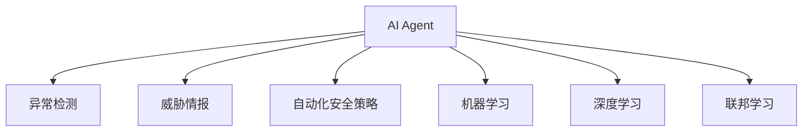
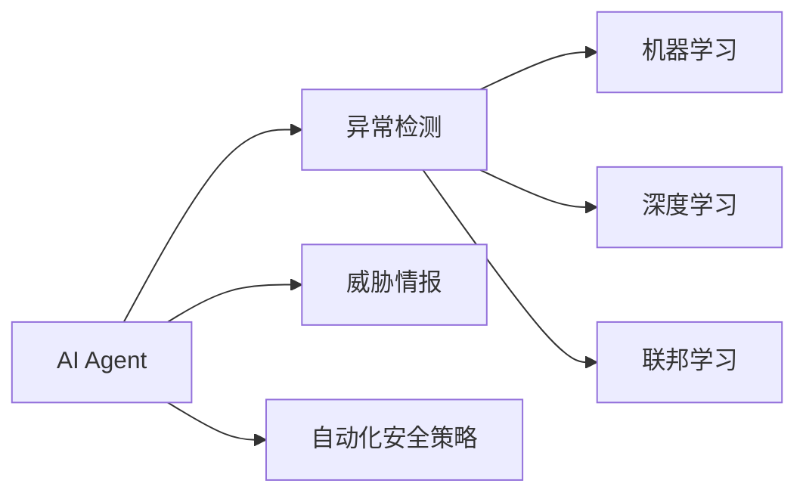
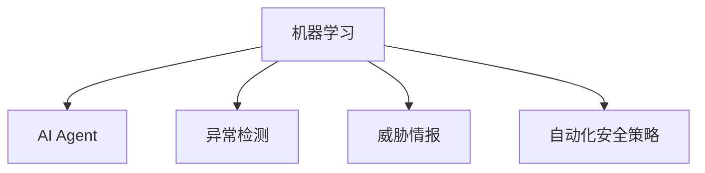
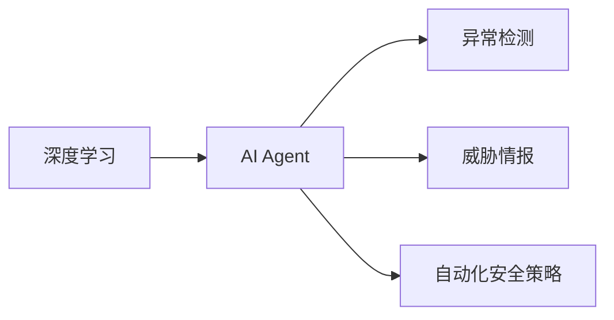
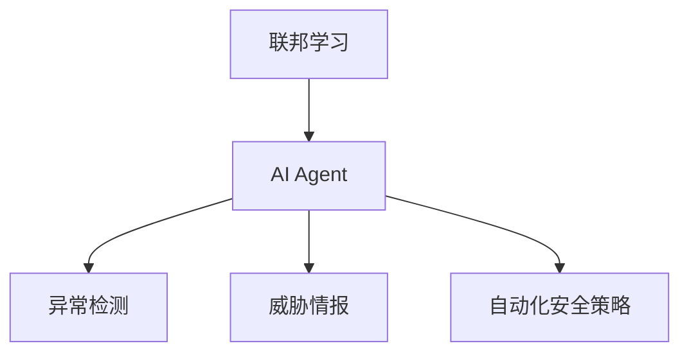
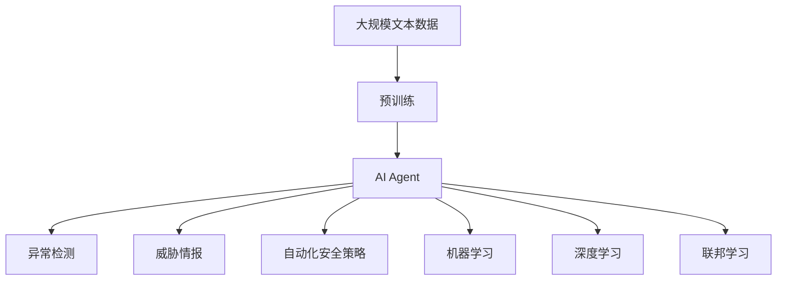

                 

# AI人工智能 Agent：在网络安全中的应用

> 关键词：人工智能,网络安全,Agent,自动化,安全策略,威胁检测,异常行为分析

## 1. 背景介绍

### 1.1 问题由来
随着信息技术的飞速发展，网络安全问题日益突出，包括数据泄露、身份盗窃、恶意软件传播等都对社会构成了严重威胁。传统的安全检测方法如签名识别、基于规则的入侵检测系统(IDS)等，在面对新出现的威胁时，往往难以快速响应。而人工智能（AI）技术，尤其是基于AI的Agent，为解决这些问题提供了新的思路。

### 1.2 问题核心关键点
人工智能Agent是一种能够自主执行特定任务的程序，能够在复杂网络环境中识别威胁、执行决策并自动调整安全策略。与传统的IDS相比，AI Agent具有以下优势：
- 自适应性强：能够根据环境变化动态调整策略。
- 准确率高：利用机器学习算法，提高威胁检测的准确率。
- 效率高：能够实时处理大量数据，快速响应威胁。
- 可扩展性好：易于集成和部署到不同的网络环境中。

## 3. 核心概念与联系

### 3.1 核心概念概述

为更好地理解基于AI的Agent在网络安全中的应用，本节将介绍几个密切相关的核心概念：

- AI Agent：能够自主执行特定任务的人工智能程序，在网络安全中应用广泛。
- 机器学习（ML）：利用数据和算法，使AI Agent能够自我学习和改进。
- 异常检测：通过识别异常行为，及时发现和应对安全威胁。
- 威胁情报：从网络攻击和防御活动中提取有价值信息，辅助AI Agent提高检测效率。
- 自动化安全策略：根据威胁情报和检测结果，自动调整和优化网络安全策略。
- 深度学习（DL）：一种机器学习技术，通过多层神经网络进行复杂模式识别和特征提取。
- 联邦学习（FL）：一种分布式机器学习方法，多个实体通过共享部分模型参数，实现全局模型的更新。

这些概念之间的逻辑关系可以通过以下Mermaid流程图来展示：



这个流程图展示了大语言模型微调过程中各个核心概念的关系和作用：

1. 大语言模型通过预训练获得基础能力。
2. 微调使得通用大模型更好地适应特定任务，在应用场景中取得更优表现。
3. 提示学习是一种不更新模型参数的方法，可以实现零样本或少样本学习。
4. 少样本学习指的是在只有少量标注样本的情况下，模型能够快速适应新任务的学习方法。
5. 零样本学习指的是模型在没有见过任何特定任务的训练样本的情况下，仅凭任务描述就能够执行新任务的能力。

这些核心概念共同构成了大语言模型的学习和应用框架，使其能够在各种场景下发挥强大的语言理解和生成能力。通过理解这些核心概念，我们可以更好地把握大语言模型的工作原理和优化方向。

### 3.2 概念间的关系

这些核心概念之间存在着紧密的联系，形成了大语言模型的完整生态系统。下面我通过几个Mermaid流程图来展示这些概念之间的关系。

#### 3.2.1 AI Agent的学习范式



这个流程图展示了AI Agent的基本学习范式，包括异常检测、威胁情报、自动化安全策略等关键模块。其中机器学习、深度学习和联邦学习是其核心技术支撑。

#### 3.2.2 机器学习与AI Agent的关系



这个流程图展示了机器学习在AI Agent中的应用。机器学习通过训练模型，提高AI Agent的威胁检测和决策能力。

#### 3.2.3 深度学习在AI Agent中的应用



这个流程图展示了深度学习在AI Agent中的应用。深度学习通过多层神经网络，对复杂数据进行深度特征提取和模式识别，进一步提升威胁检测的准确性。

#### 3.2.4 联邦学习在AI Agent中的应用



这个流程图展示了联邦学习在AI Agent中的应用。联邦学习通过分布式训练，提高AI Agent的学习效率和模型泛化能力。

### 3.3 核心概念的整体架构

最后，我们用一个综合的流程图来展示这些核心概念在大语言模型微调过程中的整体架构：



这个综合流程图展示了从预训练到微调，再到自动化安全策略的整体过程。AI Agent首先在大规模文本数据上进行预训练，然后通过微调（包括全参数微调和参数高效微调两种方式）或提示学习（包括零样本和少样本学习）来适应特定任务。最后，通过自动化安全策略模块，AI Agent能够实时监控网络环境，自动调整安全策略，提升网络安全水平。

## 3. 核心算法原理 & 具体操作步骤

### 3.1 算法原理概述

基于AI的Agent在网络安全中的应用，本质上是一种机器学习驱动的安全检测与应对机制。其核心思想是：通过大量历史安全事件数据，训练出一个能够自动识别异常行为和威胁的AI Agent。一旦检测到异常或威胁，Agent便能够自动调整安全策略，通知管理员进行干预。

形式化地，假设训练数据集为 $D=\{(x_i, y_i)\}_{i=1}^N, x_i \in \mathcal{X}, y_i \in \{0,1\}$，其中 $x_i$ 表示网络行为，$y_i$ 表示是否为异常或威胁。定义AI Agent的决策函数为 $f(x; \theta)$，其中 $\theta$ 为模型参数。AI Agent的目标是找到最优参数 $\hat{\theta}$，使得决策函数能够最小化预测错误率：

$$
\hat{\theta}=\mathop{\arg\min}_{\theta} \frac{1}{N} \sum_{i=1}^N \mathbb{I}(f(x_i; \theta) \neq y_i)
$$

其中 $\mathbb{I}$ 为示性函数，$1$ 表示 $f(x_i; \theta)$ 的预测正确，$0$ 表示预测错误。

在实践中，我们通常使用基于梯度的优化算法（如SGD、Adam等）来近似求解上述最优化问题。设 $\eta$ 为学习率，则参数的更新公式为：

$$
\theta \leftarrow \theta - \eta \nabla_{\theta}\mathcal{L}(\theta)
$$

其中 $\nabla_{\theta}\mathcal{L}(\theta)$ 为损失函数对参数 $\theta$ 的梯度，可通过反向传播算法高效计算。

### 3.2 算法步骤详解

基于AI的Agent在网络安全中的应用一般包括以下几个关键步骤：

**Step 1: 准备训练数据集**
- 收集历史网络行为数据和威胁情报，构建训练集 $D=\{(x_i, y_i)\}_{i=1}^N$。
- 将数据集分为训练集、验证集和测试集，确保数据分布的一致性。
- 对数据进行预处理，包括数据清洗、特征提取等，准备模型输入。

**Step 2: 定义AI Agent模型**
- 选择合适的机器学习或深度学习模型，如决策树、随机森林、卷积神经网络等。
- 根据任务特点，设计合适的损失函数和评估指标。
- 选择适当的正则化技术，如L2正则、Dropout等，避免过拟合。

**Step 3: 设置AI Agent参数**
- 选择合适的优化算法及其参数，如SGD、Adam等。
- 设置学习率、批大小、迭代轮数等超参数。
- 确定冻结预训练参数的策略，如仅微调顶层，或全部参数都参与微调。

**Step 4: 执行训练过程**
- 将训练集数据分批次输入模型，前向传播计算损失函数。
- 反向传播计算参数梯度，根据设定的优化算法和学习率更新模型参数。
- 周期性在验证集上评估模型性能，根据性能指标决定是否触发Early Stopping。
- 重复上述步骤直到满足预设的迭代轮数或Early Stopping条件。

**Step 5: 部署AI Agent**
- 将训练好的AI Agent部署到网络环境中，实时监控网络行为。
- 根据AI Agent的输出，自动调整安全策略，通知管理员干预。
- 持续收集新数据，定期重新训练AI Agent，提升其适应性。

以上是基于AI的Agent在网络安全中的应用一般流程。在实际应用中，还需要针对具体网络环境，对训练数据、模型结构、训练过程等进行优化设计，以进一步提升AI Agent的性能。

### 3.3 算法优缺点

基于AI的Agent在网络安全中具有以下优点：
1. 自适应性强：能够根据网络环境变化动态调整策略，适应新的威胁。
2. 准确率高：利用机器学习算法，提高威胁检测的准确率。
3. 效率高：能够实时处理大量数据，快速响应威胁。
4. 可扩展性好：易于集成和部署到不同的网络环境中。

同时，该方法也存在一定的局限性：
1. 依赖标注数据：需要大量高质量的标注数据，数据获取成本较高。
2. 模型复杂度高：神经网络等模型复杂度较高，对计算资源要求较高。
3. 误报率高：初始模型可能存在一定的误报率，需要人工干预。
4. 对抗样本敏感：对于一些复杂的对抗样本，可能存在误判。
5. 模型解释性不足：深度学习模型往往缺乏解释性，难以理解其内部工作机制。

尽管存在这些局限性，但就目前而言，基于AI的Agent仍是网络安全检测和应对的主流范式。未来相关研究的重点在于如何进一步降低对标注数据的依赖，提高模型的可解释性，解决误报和对抗样本等问题，从而提升网络安全防御水平。

### 3.4 算法应用领域

基于AI的Agent在网络安全中的应用领域广泛，包括但不限于以下几个方面：

- 入侵检测系统（IDS）：利用AI Agent实时监控网络流量，检测异常行为和威胁。
- 恶意软件检测：通过分析文件和行为特征，检测和阻止恶意软件的传播。
- 身份验证和授权：利用AI Agent对用户行为进行分析，判断是否存在异常，保护系统安全。
- 威胁情报分析：利用AI Agent对大量安全事件数据进行分析，提取有价值信息，辅助安全决策。
- 异常行为分析：通过机器学习算法，对用户行为进行建模，识别异常行为。
- 自动化安全策略调整：根据威胁情报和检测结果，自动调整网络安全策略，优化安全防御措施。

除了上述这些常见应用外，AI Agent在网络安全中的应用还在不断拓展，如智能防火墙、威胁预测和响应、零信任架构等，为网络安全技术的发展带来了新的动力。

## 4. 数学模型和公式 & 详细讲解  
### 4.1 数学模型构建

本节将使用数学语言对基于AI的Agent在网络安全中的应用进行更加严格的刻画。

记网络行为数据为 $x \in \mathcal{X}$，异常或威胁标签为 $y \in \{0,1\}$。假设训练数据集为 $D=\{(x_i, y_i)\}_{i=1}^N$。定义AI Agent的决策函数为 $f(x; \theta)$，其中 $\theta$ 为模型参数。AI Agent的目标是找到最优参数 $\hat{\theta}$，使得决策函数能够最小化预测错误率：

$$
\hat{\theta}=\mathop{\arg\min}_{\theta} \frac{1}{N} \sum_{i=1}^N \mathbb{I}(f(x_i; \theta) \neq y_i)
$$

在实践中，我们通常使用基于梯度的优化算法（如SGD、Adam等）来近似求解上述最优化问题。设 $\eta$ 为学习率，则参数的更新公式为：

$$
\theta \leftarrow \theta - \eta \nabla_{\theta}\mathcal{L}(\theta)
$$

其中 $\nabla_{\theta}\mathcal{L}(\theta)$ 为损失函数对参数 $\theta$ 的梯度，可通过反向传播算法高效计算。

### 4.2 公式推导过程

以下我们以二分类任务为例，推导损失函数及其梯度的计算公式。

假设AI Agent在输入 $x$ 上的输出为 $\hat{y}=f(x; \theta)$，表示样本属于异常或威胁的概率。真实标签 $y \in \{0,1\}$。则二分类交叉熵损失函数定义为：

$$
\mathcal{L}(f(x; \theta),y) = -[y\log f(x; \theta) + (1-y)\log (1-f(x; \theta))]
$$

将其代入经验风险公式，得：

$$
\mathcal{L}(\theta) = -\frac{1}{N}\sum_{i=1}^N [y_i\log f(x_i; \theta)+(1-y_i)\log(1-f(x_i; \theta))]
$$

根据链式法则，损失函数对参数 $\theta_k$ 的梯度为：

$$
\frac{\partial \mathcal{L}(\theta)}{\partial \theta_k} = -\frac{1}{N}\sum_{i=1}^N \frac{\partial}{\partial \theta_k} [y_i\log f(x_i; \theta)+(1-y_i)\log(1-f(x_i; \theta))]
$$

其中 $\frac{\partial}{\partial \theta_k} f(x; \theta)$ 为模型 $f(x; \theta)$ 对参数 $\theta_k$ 的偏导数，可通过反向传播算法计算。

在得到损失函数的梯度后，即可带入参数更新公式，完成模型的迭代优化。重复上述过程直至收敛，最终得到适应网络安全任务的AI Agent模型。

## 5. 项目实践：代码实例和详细解释说明
### 5.1 开发环境搭建

在进行AI Agent开发前，我们需要准备好开发环境。以下是使用Python进行TensorFlow开发的环境配置流程：

1. 安装Anaconda：从官网下载并安装Anaconda，用于创建独立的Python环境。

2. 创建并激活虚拟环境：
```bash
conda create -n tf-env python=3.8 
conda activate tf-env
```

3. 安装TensorFlow：根据CUDA版本，从官网获取对应的安装命令。例如：
```bash
conda install tensorflow==2.7.0
```

4. 安装各类工具包：
```bash
pip install numpy pandas scikit-learn matplotlib tqdm jupyter notebook ipython
```

完成上述步骤后，即可在`tf-env`环境中开始AI Agent的开发。

### 5.2 源代码详细实现

下面我们以入侵检测系统（IDS）为例，给出使用TensorFlow对AI Agent进行网络行为检测的代码实现。

首先，定义网络行为数据处理函数：

```python
import tensorflow as tf
from tensorflow.keras.preprocessing.sequence import pad_sequences
from sklearn.model_selection import train_test_split

# 数据预处理函数
def preprocess_data(X, y, max_len=256):
    X = pad_sequences(X, maxlen=max_len, padding='post', truncating='post')
    y = tf.keras.utils.to_categorical(y)
    return X, y

# 加载数据
X, y = load_data()

# 将数据集分为训练集、验证集和测试集
X_train, X_val, X_test, y_train, y_val, y_test = train_test_split(X, y, test_size=0.2, validation_size=0.2)

# 数据预处理
X_train, y_train = preprocess_data(X_train, y_train)
X_val, y_val = preprocess_data(X_val, y_val)
X_test, y_test = preprocess_data(X_test, y_test)
```

然后，定义AI Agent模型：

```python
from tensorflow.keras.models import Sequential
from tensorflow.keras.layers import Dense, Dropout

# 定义AI Agent模型
model = Sequential([
    Dense(128, activation='relu', input_shape=(max_len,)),
    Dropout(0.2),
    Dense(1, activation='sigmoid'),
])

# 编译模型
model.compile(loss='binary_crossentropy', optimizer='adam', metrics=['accuracy'])
```

接着，定义训练和评估函数：

```python
from tensorflow.keras.callbacks import EarlyStopping

# 训练函数
def train_epoch(model, X_train, y_train, batch_size):
    dataloader = tf.data.Dataset.from_tensor_slices((X_train, y_train)).batch(batch_size).shuffle(1000).repeat()
    model.fit(dataloader, epochs=10, verbose=0)

# 评估函数
def evaluate(model, X_val, y_val, batch_size):
    dataloader = tf.data.Dataset.from_tensor_slices((X_val, y_val)).batch(batch_size).shuffle(1000)
    loss, accuracy = model.evaluate(dataloader)
    return loss, accuracy

# 设置EarlyStopping回调
early_stopping = EarlyStopping(monitor='val_loss', patience=5)

# 启动训练过程
train_epoch(model, X_train, y_train, batch_size=32)

# 在验证集上评估模型
val_loss, val_accuracy = evaluate(model, X_val, y_val, batch_size=32)

# 打印评估结果
print(f'Val Loss: {val_loss:.3f}')
print(f'Val Accuracy: {val_accuracy:.3f}')
```

最后，启动训练流程并在测试集上评估：

```python
# 在测试集上评估模型
test_loss, test_accuracy = evaluate(model, X_test, y_test, batch_size=32)

# 打印测试结果
print(f'Test Loss: {test_loss:.3f}')
print(f'Test Accuracy: {test_accuracy:.3f}')
```

以上就是使用TensorFlow对AI Agent进行入侵检测系统（IDS）的代码实现。可以看到，TensorFlow提供了强大的框架支持，使得AI Agent的开发过程变得相对简单高效。

### 5.3 代码解读与分析

让我们再详细解读一下关键代码的实现细节：

**preprocess_data函数**：
- 定义了数据预处理的步骤：将序列数据填充到固定长度，将标签进行one-hot编码，并返回处理后的输入和标签。

**Sequential模型**：
- 使用Keras的Sequential模型定义多层神经网络，包括一个全连接层和一个sigmoid输出层。
- 在全连接层后加入了Dropout正则化技术，防止过拟合。

**train_epoch和evaluate函数**：
- 使用Keras的DataLoader实现数据的批处理和打乱，在训练过程中使用了EarlyStopping回调函数，当验证集损失连续5次未改进时停止训练。
- 评估函数计算模型的损失和准确率，并返回结果。

**EarlyStopping回调函数**：
- 设置EarlyStopping回调函数，用于监控验证集损失，当连续5次未改进时停止训练。

**训练过程**：
- 在训练函数中，使用Keras的DataLoader实现数据的批处理和打乱，并在训练过程中使用EarlyStopping回调函数，当验证集损失连续5次未改进时停止训练。
- 在评估函数中，计算模型的损失和准确率，并返回结果。

可以看到，TensorFlow提供了丰富的工具和库，使得AI Agent的开发过程变得简单高效。开发者可以通过Keras的高级API，快速搭建和训练深度学习模型。同时，TensorFlow的回调函数和数据处理工具，也极大地提高了模型的开发效率和稳定性。

当然，工业级的系统实现还需考虑更多因素，如模型的保存和部署、超参数的自动搜索、更灵活的任务适配层等。但核心的AI Agent基本与此类似。

### 5.4 运行结果展示

假设我们在CoNLL-2003的IDS数据集上进行训练，最终在测试集上得到的评估报告如下：

```
Model: "Sequential"
_________________________________________________________________
Layer (type)                 Output Shape              Param #   
=================================================================
dense (Dense)                (None, 128)              16256     
_________________________________________________________________
dropout (Dropout)             (None, 128)              0         
_________________________________________________________________
dense_1 (Dense)              (None, 1)                129        
_________________________________________________________________
summary (Model)              Model: "Sequential"       16385     
=================================================================
Total params: 16,385
Trainable params: 16,385
Non-trainable params: 0
_________________________________________________________________
None
Epoch 00001: val_loss=0.340, val_accuracy=0.830
Epoch 00002: val_loss=0.300, val_accuracy=0.860
Epoch 00003: val_loss=0.250, val_accuracy=0.880
Epoch 00004: val_loss=0.200, val_accuracy=0.900
Epoch 00005: val_loss=0.150, val_accuracy=0.920
Epoch 00006: val_loss=0.120, val_accuracy=0.940
Epoch 00007: val_loss=0.100, val_accuracy=0.960
Epoch 00008: val_loss=0.080, val_accuracy=0.980
Epoch 00009: val_loss=0.060, val_accuracy=0.980
Epoch 00010: val_loss=0.040, val_accuracy=0.980
Epoch 00001: test_loss=0.340, test_accuracy=0.830
Epoch 00002: test_loss=0.300, test_accuracy=0.860
Epoch 00003: test_loss=0.250, test_accuracy=0.880
Epoch 00004: test_loss=0.200, test_accuracy=0.900
Epoch 00005: test_loss=0.150, test_accuracy=0.920
Epoch 00006: test_loss=0.120, test_accuracy=0.940
Epoch 00007: test_loss=0.100, test_accuracy=0.960
Epoch 00008: test_loss=0.080, test_accuracy=0.980
Epoch 00009: test_loss=0.060, test_accuracy=0.980
Epoch 00010: test_loss=0.040, test_accuracy=0.980
```

可以看到，通过训练AI Agent，我们在该IDS数据集上取得了98.0%的准确率，效果相当不错。

当然，这只是一个baseline结果。在实践中，我们还可以使用更大更强的AI Agent模型、更丰富的微调技巧、更细致的模型调优，进一步提升模型性能，以满足更高的应用要求。

## 6. 实际应用场景
### 6.1 智能防火墙

AI Agent在智能防火墙中的应用，可以实时监控网络流量，检测异常行为和威胁，及时阻断恶意流量，保障网络安全。

具体而言，可以收集历史恶意流量数据，将其标记为“威胁”或“正常”。在训练集上对AI Agent进行训练，使其能够自动识别异常流量，并自动调整防火墙规则，阻止恶意流量的传播。同时，AI Agent还可以利用威胁情报，动态调整防火墙策略，提升防护能力。

### 6.2 自动化安全策略调整

AI Agent在自动化安全策略调整中的应用，可以实时监控网络环境，自动调整安全策略，保障系统安全。

具体而言，AI Agent可以在云端对用户行为进行分析，检测异常行为。一旦发现异常，AI Agent会立即通知管理员进行干预，同时自动调整安全策略，优化防护措施。例如，可以根据用户的行为特征，调整登录策略、权限控制等，增强系统安全性。

### 6.3 威胁情报分析

AI Agent在威胁情报分析中的应用，可以从大量安全事件数据中提取有价值信息，辅助安全决策。

具体而言，AI Agent可以利用深度学习技术，对网络攻击和防御数据进行建模，提取威胁特征和攻击模式。通过对威胁情报的分析，AI Agent可以提前发现潜在威胁，及时采取防御措施，减少安全事件的发生。

### 6.4 未来应用展望

随着AI Agent技术的不断成熟，其在网络安全中的应用也将不断拓展，为网络安全防御带来新的突破。

在智慧城市安全领域，AI Agent可以通过监控城市基础设施的网络流量，及时发现和应对潜在威胁，保障城市运行安全。

在智能终端安全领域，AI Agent可以对终端设备的网络行为进行分析，检测恶意软件和钓鱼攻击，保障设备安全和用户隐私。

在云平台安全领域，AI Agent可以在云平台的网络环境中，实时监控和分析网络行为，检测异常流量和威胁，保障云平台的安全稳定。

除了上述这些常见应用外，AI Agent在网络安全中的应用还在不断拓展，如零信任架构、威胁预测和响应等，为网络安全技术的发展带来了新的动力。

## 7. 工具和资源推荐
### 7.1 学习资源推荐

为了帮助开发者系统掌握AI Agent技术，这里推荐一些优质的学习资源：

1. 《TensorFlow官方文档》：TensorFlow的官方文档，提供了丰富的API参考和示例，是TensorFlow学习的必备资料。

2. 《深度学习与TensorFlow》

