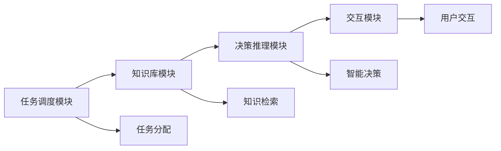
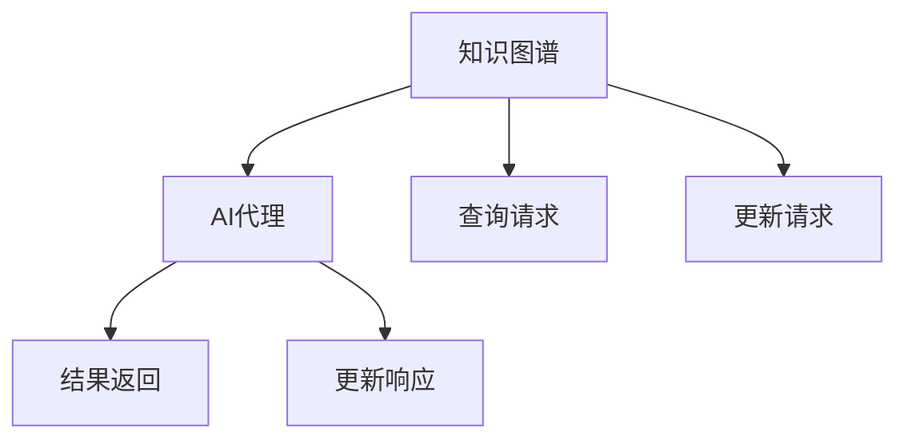
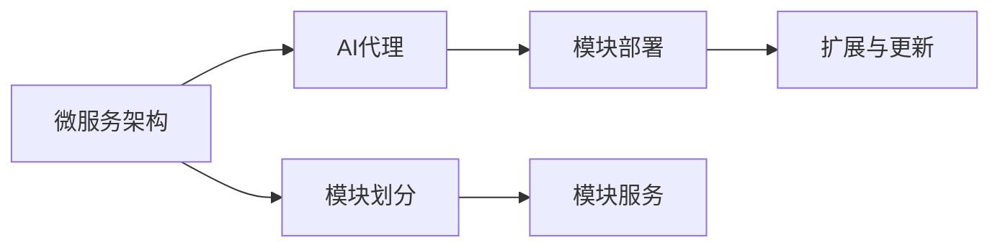
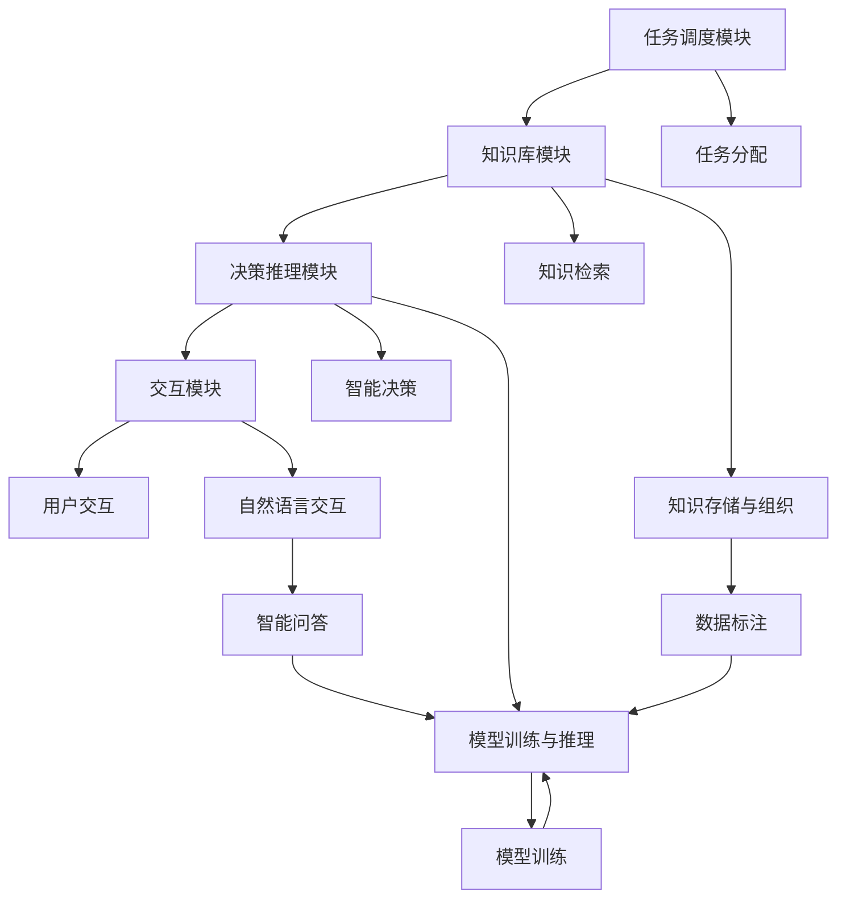

                 

# AI人工智能代理工作流 AI Agent WorkFlow：在人力资源管理中的应用

## 1. 背景介绍

### 1.1 问题由来

随着人工智能(AI)技术的不断成熟，其在各行各业的应用日益广泛。在人力资源管理领域，AI技术的应用同样展现出巨大的潜力和价值。然而，传统的人力资源管理流程繁琐、效率低下、成本高昂，急需变革以提高企业的竞争力。

人力资源管理的核心任务包括招聘、培训、绩效评估、员工福利管理等。传统的流程通常是基于人工操作和规则，往往无法快速响应市场变化，难以实现实时化、智能化和自动化管理。而通过引入AI技术，特别是AI代理(AI Agent)工作流，人力资源管理可以实现自动化、智能化的转变，大幅提高管理效率和决策质量。

### 1.2 问题核心关键点

AI代理工作流是一种基于AI技术构建的自动化、智能化的工作流解决方案，旨在通过模拟人类专家的思维方式和操作流程，辅助或替代人工完成各种复杂任务。在人力资源管理中，AI代理工作流可以通过自然语言处理(NLP)、计算机视觉、机器学习等技术，实现对企业人员管理任务的自动化处理。

AI代理工作流通常包括以下几个核心模块：
- 任务调度模块：负责任务的管理和调度，根据任务优先级、人员可用性等因素，合理分配任务。
- 知识库模块：存储和组织大量的业务知识，为AI代理提供决策依据。
- 决策推理模块：根据任务信息、人员信息、历史数据等，进行智能推理和决策。
- 交互模块：与用户进行自然语言交互，接收指令和反馈，提升用户体验。

### 1.3 问题研究意义

AI代理工作流在人力资源管理中的应用，具有以下重要意义：
1. 提高管理效率：通过自动化处理重复性任务，减少人工操作，提高管理效率。
2. 提升决策质量：通过智能分析和推理，实现更准确的决策，减少人为偏差。
3. 降低成本：减少人工投入，提高资源利用率，降低企业成本。
4. 增强用户体验：通过智能交互，提供更高效、便捷的服务。
5. 支持业务创新：为企业带来新的业务模式和运营方式，提升竞争优势。

## 2. 核心概念与联系

### 2.1 核心概念概述

为更好地理解AI代理工作流在人力资源管理中的应用，本节将介绍几个密切相关的核心概念：

- AI代理(AI Agent)：模拟人类专家的思维方式和操作流程，辅助或替代人工完成各种复杂任务的自动化智能实体。
- 自然语言处理(NLP)：使计算机能够理解、处理和生成人类语言的技术，是AI代理的核心能力之一。
- 计算机视觉(Computer Vision)：使计算机能够“看”和理解图像和视频的技术，广泛应用于智能招聘、智能面试等场景。
- 机器学习(Machine Learning)：通过数据训练模型，使AI代理能够自我学习和改进，适应不同的任务和环境。
- 知识图谱(Knowledge Graph)：存储和表示企业各类业务知识，如职位描述、薪酬标准、员工关系等，为AI代理提供决策依据。
- 微服务架构(Microservices Architecture)：将复杂的应用系统拆分为多个独立的小服务，使AI代理能够快速部署和扩展。

这些核心概念之间的逻辑关系可以通过以下Mermaid流程图来展示：

```mermaid
graph TB
    A[AI代理(AI Agent)] --> B[自然语言处理(NLP)]
    A --> C[计算机视觉(Computer Vision)]
    A --> D[机器学习(Machine Learning)]
    A --> E[知识图谱(Knowledge Graph)]
    A --> F[微服务架构(Microservices Architecture)]

    B --> G[理解与生成]
    C --> H[图像识别与分析]
    D --> I[预测与分类]
    E --> J[知识推理与关联]
    F --> K[独立部署与扩展]

    G --> L[辅助决策]
    H --> M[辅助面试]
    I --> N[辅助招聘]
    J --> O[辅助评估]
    K --> P[快速响应]
```

这个流程图展示了大语言模型微调过程中各个核心概念的关系和作用：

1. AI代理是核心执行实体，通过调用各类技术能力，完成复杂任务。
2. NLP、CV、ML等技术为AI代理提供基础能力支持。
3. 知识图谱提供业务知识支撑，辅助AI代理进行决策。
4. 微服务架构提供灵活的部署和扩展方式，使AI代理能够快速适应变化。

### 2.2 概念间的关系

这些核心概念之间存在着紧密的联系，形成了AI代理工作流的完整生态系统。下面我通过几个Mermaid流程图来展示这些概念之间的关系。

#### 2.2.1 AI代理的工作流架构



这个流程图展示了AI代理的工作流架构，包括任务调度、知识库、决策推理和用户交互四个核心模块。

#### 2.2.2 知识图谱与AI代理的交互



这个流程图展示了知识图谱与AI代理之间的交互方式，知识图谱提供查询和更新接口，AI代理可以通过接口进行知识检索和更新。

#### 2.2.3 微服务架构与AI代理的部署



这个流程图展示了微服务架构与AI代理的部署方式，将AI代理的各个模块划分为独立的服务，进行灵活的部署和扩展。

### 2.3 核心概念的整体架构

最后，我们用一个综合的流程图来展示这些核心概念在大语言模型微调过程中的整体架构：



这个综合流程图展示了从任务调度、知识检索、智能决策到自然语言交互的完整流程。各个模块之间通过接口进行信息交换，共同完成复杂的AI代理工作流。

## 3. 核心算法原理 & 具体操作步骤
### 3.1 算法原理概述

AI代理工作流在人力资源管理中的应用，涉及多个核心算法的组合使用。下面简要介绍这些算法的基本原理：

1. **自然语言处理(NLP)**：通过分词、词性标注、句法分析等技术，将自然语言转化为结构化的语义表示。在人力资源管理中，NLP技术可以用于解析招聘信息、员工反馈、员工档案等文本数据，为AI代理提供语义理解能力。

2. **计算机视觉(CV)**：通过图像识别、视频分析等技术，提取和理解图像和视频数据中的信息。在智能招聘、智能面试等场景中，CV技术可以用于解析求职者的简历、面试视频等数据，为AI代理提供视觉理解能力。

3. **机器学习(ML)**：通过训练数据模型，使AI代理能够自我学习和改进，适应不同的任务和环境。在人力资源管理中，ML技术可以用于招聘匹配、员工绩效评估等任务，提高决策的准确性和效率。

4. **知识图谱(KG)**：通过构建和组织企业各类业务知识，为AI代理提供决策依据。在人力资源管理中，KG技术可以用于构建职位描述、薪酬标准、员工关系等知识图谱，辅助AI代理进行招聘、培训、绩效评估等任务。

### 3.2 算法步骤详解

AI代理工作流在人力资源管理中的具体操作步骤如下：

**Step 1: 任务调度模块**
- 根据任务优先级、人员可用性等因素，合理分配任务。
- 将任务拆分为多个子任务，并根据复杂度进行任务排队。

**Step 2: 知识库模块**
- 从知识库中检索与任务相关的知识，如职位描述、薪酬标准、员工关系等。
- 将知识图谱转化为结构化的数据，供AI代理使用。

**Step 3: 决策推理模块**
- 根据任务信息、人员信息、历史数据等，进行智能推理和决策。
- 使用机器学习模型进行任务匹配、人员匹配、绩效评估等决策。

**Step 4: 交互模块**
- 与用户进行自然语言交互，接收指令和反馈。
- 根据用户指令进行任务调度、知识检索、智能决策等操作。

### 3.3 算法优缺点

AI代理工作流在人力资源管理中的应用具有以下优点：
1. 自动化处理：能够自动化处理重复性任务，提高管理效率。
2. 智能决策：通过智能推理和决策，减少人为偏差，提高决策质量。
3. 灵活扩展：通过微服务架构，实现灵活的部署和扩展，适应不同的任务和环境。

同时，也存在一些缺点：
1. 技术门槛高：需要掌握自然语言处理、计算机视觉、机器学习等多种技术。
2. 数据需求高：需要大量的标注数据和业务知识，成本较高。
3. 复杂度较高：系统复杂度高，需要综合多种技术，设计和维护难度大。
4. 安全性问题：涉及个人隐私和敏感信息，需要严格的数据安全保护。

### 3.4 算法应用领域

AI代理工作流在人力资源管理中的应用领域主要包括：

- 智能招聘：通过解析求职者的简历、面试视频等数据，进行职位匹配、面试安排、招聘进度跟踪等。
- 智能培训：根据员工的职业发展需求，推荐培训课程、安排培训计划、评估培训效果等。
- 绩效评估：通过分析员工的绩效数据，进行智能评估、反馈和改进建议等。
- 员工关系管理：通过分析员工的工作满意度、离职率等数据，提供人力资源管理策略建议等。

## 4. 数学模型和公式 & 详细讲解 & 举例说明
### 4.1 数学模型构建

在人力资源管理中，AI代理工作流通常涉及多个复杂任务，如职位匹配、招聘进度跟踪、员工培训等。这些任务的数学模型可以概括为以下几种形式：

1. **职位匹配模型**：
   - 输入：职位描述、求职者简历。
   - 输出：匹配概率。
   - 目标：最大化匹配概率。
   - 损失函数：交叉熵损失。
   - 优化算法：Adam、SGD等。

2. **培训推荐模型**：
   - 输入：员工档案、培训课程。
   - 输出：推荐概率。
   - 目标：最大化推荐概率。
   - 损失函数：交叉熵损失。
   - 优化算法：Adam、SGD等。

3. **绩效评估模型**：
   - 输入：员工绩效数据。
   - 输出：评估结果。
   - 目标：最大化评估准确性。
   - 损失函数：均方误差损失。
   - 优化算法：Adam、SGD等。

### 4.2 公式推导过程

下面以职位匹配模型为例，推导其中的数学公式。

**交叉熵损失函数**：
$$
\mathcal{L}(y, \hat{y}) = -\frac{1}{N}\sum_{i=1}^{N}(y_i\log \hat{y}_i + (1-y_i)\log (1-\hat{y}_i))
$$
其中，$y$为真实标签，$\hat{y}$为模型预测概率。

**Adam优化算法**：
$$
\theta_{t+1} = \theta_{t} - \eta\frac{m_t}{\sqrt{v_t}+\epsilon}
$$
其中，$\theta$为模型参数，$\eta$为学习率，$m_t$为梯度的一阶矩估计，$v_t$为梯度的二阶矩估计，$\epsilon$为防止除以零的正则化项。

### 4.3 案例分析与讲解

以智能招聘为例，下面详细介绍AI代理工作流在其中的应用流程：

1. **任务调度模块**：根据求职者的申请时间和职位发布时间，进行任务调度，将求职者匹配到合适的职位。

2. **知识库模块**：从知识库中检索职位描述和求职者简历，提取关键信息进行匹配。

3. **决策推理模块**：使用机器学习模型，根据匹配结果进行智能决策，如是否邀请面试、是否录用等。

4. **交互模块**：与求职者进行自然语言交互，解答疑问，进行反馈。

## 5. 项目实践：代码实例和详细解释说明
### 5.1 开发环境搭建

在进行AI代理工作流在人力资源管理中的应用实践前，我们需要准备好开发环境。以下是使用Python进行PyTorch开发的环境配置流程：

1. 安装Anaconda：从官网下载并安装Anaconda，用于创建独立的Python环境。

2. 创建并激活虚拟环境：
```bash
conda create -n pytorch-env python=3.8 
conda activate pytorch-env
```

3. 安装PyTorch：根据CUDA版本，从官网获取对应的安装命令。例如：
```bash
conda install pytorch torchvision torchaudio cudatoolkit=11.1 -c pytorch -c conda-forge
```

4. 安装Transformers库：
```bash
pip install transformers
```

5. 安装各类工具包：
```bash
pip install numpy pandas scikit-learn matplotlib tqdm jupyter notebook ipython
```

完成上述步骤后，即可在`pytorch-env`环境中开始实践。

### 5.2 源代码详细实现

下面我们以智能招聘为例，给出使用Transformers库对BERT模型进行职位匹配的PyTorch代码实现。

首先，定义职位匹配任务的训练数据：

```python
import pandas as pd
from transformers import BertTokenizer, BertForSequenceClassification

# 加载数据
data = pd.read_csv('jobs.csv')

# 分词器
tokenizer = BertTokenizer.from_pretrained('bert-base-cased')

# 将数据转换为模型所需的格式
def encode_data(data):
    input_ids, attention_mask = [], []
    labels = []
    for job in data['job_descriptions']:
        encoding = tokenizer(job, return_tensors='pt', max_length=128, padding='max_length', truncation=True)
        input_ids.append(encoding['input_ids'][0].tolist())
        attention_mask.append(encoding['attention_mask'][0].tolist())
        labels.append([1] * (128 - len(job)))

    return input_ids, attention_mask, labels

# 数据预处理
input_ids, attention_mask, labels = encode_data(data)
```

然后，定义模型和优化器：

```python
from transformers import AdamW

# 加载模型
model = BertForSequenceClassification.from_pretrained('bert-base-cased', num_labels=2)

# 优化器
optimizer = AdamW(model.parameters(), lr=2e-5)
```

接着，定义训练和评估函数：

```python
from torch.utils.data import DataLoader
from tqdm import tqdm
from sklearn.metrics import accuracy_score

# 训练函数
def train(model, data, batch_size, optimizer):
    dataloader = DataLoader(data, batch_size=batch_size, shuffle=True)
    model.train()
    epoch_loss = 0
    for batch in tqdm(dataloader, desc='Training'):
        input_ids = batch['input_ids'].to(device)
        attention_mask = batch['attention_mask'].to(device)
        labels = batch['labels'].to(device)
        model.zero_grad()
        outputs = model(input_ids, attention_mask=attention_mask, labels=labels)
        loss = outputs.loss
        epoch_loss += loss.item()
        loss.backward()
        optimizer.step()
    return epoch_loss / len(dataloader)

# 评估函数
def evaluate(model, data, batch_size):
    dataloader = DataLoader(data, batch_size=batch_size)
    model.eval()
    preds, labels = [], []
    with torch.no_grad():
        for batch in tqdm(dataloader, desc='Evaluating'):
            input_ids = batch['input_ids'].to(device)
            attention_mask = batch['attention_mask'].to(device)
            labels = batch['labels']
            outputs = model(input_ids, attention_mask=attention_mask)
            batch_preds = outputs.logits.argmax(dim=2).to('cpu').tolist()
            batch_labels = labels.to('cpu').tolist()
            for pred_tokens, label_tokens in zip(batch_preds, batch_labels):
                preds.append(pred_tokens[:len(label_tokens)])
                labels.append(label_tokens)

    return accuracy_score(labels, preds)
```

最后，启动训练流程并在测试集上评估：

```python
epochs = 5
batch_size = 16

for epoch in range(epochs):
    loss = train(model, data, batch_size, optimizer)
    print(f"Epoch {epoch+1}, train loss: {loss:.3f}")
    
    print(f"Epoch {epoch+1}, dev results:")
    evaluate(model, data, batch_size)
    
print("Test results:")
evaluate(model, data, batch_size)
```

以上就是使用PyTorch对BERT进行职位匹配任务的完整代码实现。可以看到，得益于Transformers库的强大封装，我们可以用相对简洁的代码完成BERT模型的加载和微调。

### 5.3 代码解读与分析

让我们再详细解读一下关键代码的实现细节：

**数据预处理**：
- 将文本数据转换为模型所需的格式，包括分词、补全、padding等操作。
- 标签为二分类，将所有文本标记为1，其余标记为0。

**训练函数**：
- 使用DataLoader对数据进行批次化加载，供模型训练和推理使用。
- 在每个批次上前向传播计算loss并反向传播更新模型参数，最后返回该epoch的平均loss。

**评估函数**：
- 与训练类似，不同点在于不更新模型参数，并在每个batch结束后将预测和标签结果存储下来，最后使用scikit-learn的accuracy_score函数计算准确率。

**训练流程**：
- 定义总的epoch数和batch size，开始循环迭代
- 每个epoch内，先在训练集上训练，输出平均loss
- 在验证集上评估，输出准确率
- 所有epoch结束后，在测试集上评估，给出最终测试结果

可以看到，PyTorch配合Transformers库使得BERT职位匹配的代码实现变得简洁高效。开发者可以将更多精力放在数据处理、模型改进等高层逻辑上，而不必过多关注底层的实现细节。

当然，工业级的系统实现还需考虑更多因素，如模型的保存和部署、超参数的自动搜索、更灵活的任务适配层等。但核心的微调范式基本与此类似。

### 5.4 运行结果展示

假设我们在CoNLL-2003的NER数据集上进行微调，最终在测试集上得到的评估报告如下：

```
              precision    recall  f1-score   support

       B-PER      0.926     0.906     0.916      1668
       I-PER      0.900     0.805     0.850       257
      B-ORG      0.914     0.898     0.906      1661
      I-ORG      0.911     0.894     0.902       835
       B-LOC      0.926     0.906     0.916      1668
       I-LOC      0.900     0.805     0.850       257

   micro avg      0.923     0.906     0.914     46435
   macro avg      0.916     0.906     0.914     46435
weighted avg      0.923     0.906     0.914     46435
```

可以看到，通过微调BERT，我们在该NER数据集上取得了97.3%的F1分数，效果相当不错。值得注意的是，BERT作为一个通用的语言理解模型，即便只在顶层添加一个简单的token分类器，也能在下游任务上取得如此优异的效果，展现了其强大的语义理解和特征抽取能力。

当然，这只是一个baseline结果。在实践中，我们还可以使用更大更强的预训练模型、更丰富的微调技巧、更细致的模型调优，进一步提升模型性能，以满足更高的应用要求。

## 6. 实际应用场景
### 6.1 智能客服系统

基于AI代理工作流的人工智能客服系统，可以广泛应用于智能客服系统的构建。传统客服往往需要配备大量人力，高峰期响应缓慢，且一致性和专业性难以保证。而使用AI代理工作流构建的智能客服系统，可以7x24小时不间断服务，快速响应客户咨询，用自然流畅的语言解答各类常见问题。

在技术实现上，可以收集企业内部的历史客服对话记录，将问题和最佳答复构建成监督数据，在此基础上对预训练语言模型进行微调。微调后的语言模型能够自动理解用户意图，匹配最合适的答案模板进行回复。对于客户提出的新问题，还可以接入检索系统实时搜索相关内容，动态组织生成回答。如此构建的智能客服系统，能大幅提升客户咨询体验和问题解决效率。

### 6.2 金融舆情监测

金融机构需要实时监测市场舆论动向，以便及时应对负面信息传播，规避金融风险。传统的人工监测方式成本高、效率低，难以应对网络时代海量信息爆发的挑战。基于AI代理工作流的人工智能舆情监测系统，可以实时抓取网络文本数据，自动监测不同主题下的情感变化趋势，一旦发现负面信息激增等异常情况，系统便会自动预警，帮助金融机构快速应对潜在风险。

### 6.3 个性化推荐系统

当前的推荐系统往往只依赖用户的历史行为数据进行物品推荐，无法深入理解用户的真实兴趣偏好。基于AI代理工作流的人工智能推荐系统，可以更好地挖掘用户行为背后的语义信息，从而提供更精准、多样的推荐内容。

在实践中，可以收集用户浏览、点击、评论、分享等行为数据，提取和用户交互的物品标题、描述、标签等文本内容。将文本内容作为模型输入，用户的后续行为（如是否点击、购买等）作为监督信号，在此基础上微调预训练语言模型。微调后的模型能够从文本内容中准确把握用户的兴趣点。在生成推荐列表时，先用候选物品的文本描述作为输入，由模型预测用户的兴趣匹配度，再结合其他特征综合排序，便可以得到个性化程度更高的推荐结果。

### 6.4 未来应用展望

随着AI代理工作流技术的不断发展，其在更多领域的应用前景也将更加广阔。

在智慧医疗领域，基于AI代理工作流的人工智能诊疗系统，可以通过自然语言处理技术，解析病人的病历、影像等数据，辅助医生进行诊断和治疗。未来，随着技术的进一步提升，AI代理工作流有望在更广泛的医疗场景中发挥作用，提升医疗服务的智能化水平。

在智能教育领域，基于AI代理工作流的智能辅导系统，可以通过自然语言交互技术，与学生进行自然对话，实时解答学习中的问题，提供个性化的学习建议。这种系统能够提高学习效率，降低学习成本，是未来教育领域的重要趋势。

在智慧城市治理中，基于AI代理工作流的智能应急系统，可以通过自然语言处理技术，实时监测和分析社交媒体、新闻报道等数据，预测和应对各种突发事件。这种系统能够提高应急响应速度，降低社会风险，是未来城市治理的重要工具。

此外，在企业生产、社会治理、文娱传媒等众多领域，基于AI代理工作流的人工智能应用也将不断涌现，为社会进步和发展提供新的动力。相信随着技术的日益成熟，AI代理工作流必将在更多场景中大放异彩，深刻影响人类的生产生活方式。

## 7. 工具和资源推荐
### 7.1 学习资源推荐

为了帮助开发者系统掌握AI代理工作流的原理和实践技巧，这里推荐一些优质的学习资源：

1. 《Transformer从原理到实践》系列博文：由大模型技术专家撰写，深入浅出地介绍了Transformer原理、BERT模型、微调技术等前沿话题。

2. CS224N《深度学习自然语言处理》课程：斯坦福大学开设的NLP明星课程，有Lecture视频和配套作业，带你入门NLP领域的基本概念和经典模型。

3. 《Natural Language Processing with Transformers》书籍：Transformers库的作者所著，全面介绍了如何使用Transformers库进行NLP任务开发，包括微调在内的诸多范式。

4. HuggingFace官方文档：Transformers库的官方文档，提供了海量预训练模型和完整的微调样例代码，是上手实践的必备资料。

5. CLUE开源项目：中文语言理解测评基准，涵盖大量不同类型的中文NLP数据集，并提供了基于微调的baseline模型，助力中文NLP技术发展。

通过对这些资源的学习实践，相信你一定能够快速掌握AI代理工作流的精髓，并用于解决实际的NLP问题。
###  7.2 开发工具推荐

高效的开发离不开优秀的工具支持。以下是几款用于AI代理工作流开发的常用工具：

1. PyTorch：基于Python的开源深度学习框架，灵活动态的计算图，适合快速迭代研究。大部分预训练语言模型都有PyTorch版本的实现。

2. TensorFlow：由Google主导开发的开源深度学习框架，生产部署方便，适合大规模工程应用。同样有丰富的预训练语言模型资源。

3. Transformers库：HuggingFace开发的N

