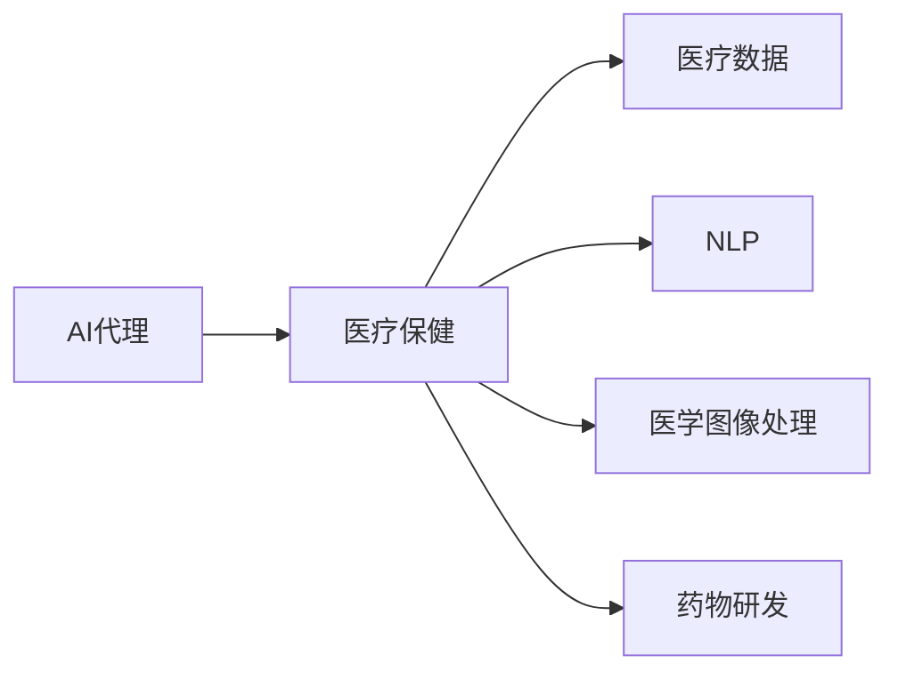
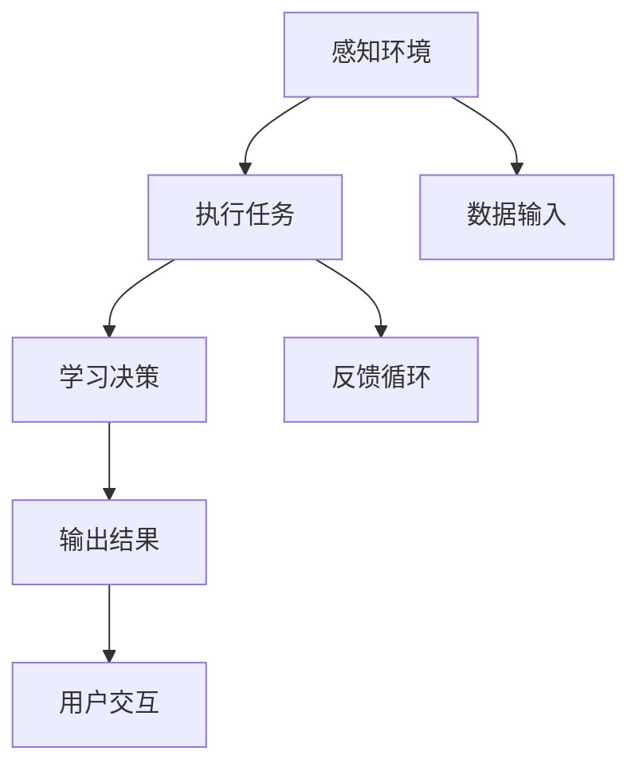
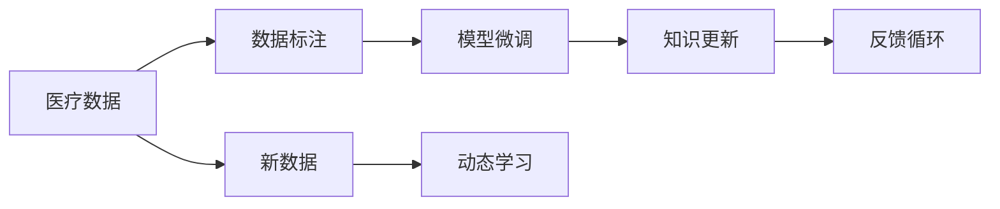
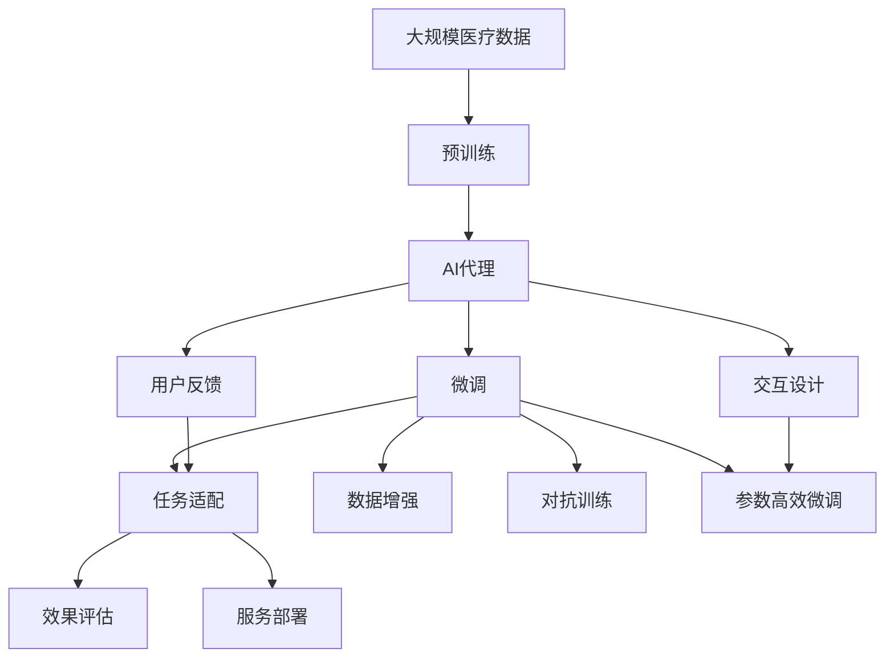

                 

# AI人工智能代理工作流 AI Agent WorkFlow：在医疗保健中的应用

## 1. 背景介绍

### 1.1 问题由来

随着人工智能(AI)技术的快速发展，AI代理(AI Agent)在医疗保健领域的应用变得越来越广泛。AI代理可以通过自动化任务、辅助诊断、个性化推荐等方式，提高医疗服务的质量和效率。AI代理在医疗保健中的应用，已经从简单的自动化任务逐渐扩展到复杂的辅助诊断、药物研发等领域。

然而，AI代理的工作流程和应用模式还存在诸多挑战，如数据隐私、安全性、标准化、可解释性等问题，需要在实际应用中不断探索和优化。本文将从背景、核心概念、算法原理、实际应用和未来展望等方面，系统介绍AI代理在医疗保健中的应用，以期为相关开发者提供参考和启示。

### 1.2 问题核心关键点

AI代理在医疗保健领域的应用，主要涉及以下几个关键点：

1. **数据隐私与安全**：医疗数据包含大量敏感信息，如何在保障数据隐私和安全的前提下，高效利用AI代理进行数据分析和处理，是一个重要挑战。

2. **标准化与规范化**：医疗领域的各种数据格式和规范多样，如何确保AI代理能够处理不同来源、不同格式的数据，实现标准化，是应用中的难点。

3. **可解释性与透明度**：AI代理在医疗决策中的应用，需要高度的可解释性和透明度，以便医生和患者理解AI的决策依据。

4. **持续学习与知识更新**：医疗领域的数据不断变化，AI代理需要具备持续学习和知识更新的能力，以适应新数据的到来。

5. **交互式设计与用户体验**：AI代理的交互设计需要满足医疗场景的用户需求，提供直观、易用的用户体验，以提高工作效率和用户满意度。

这些核心关键点将贯穿全文，帮助我们理解AI代理在医疗保健中的具体应用场景和实现方法。

## 2. 核心概念与联系

### 2.1 核心概念概述

为更好地理解AI代理在医疗保健中的应用，本节将介绍几个密切相关的核心概念：

- **AI代理(AI Agent)**：指能够自主感知环境、执行任务、学习决策的智能体。AI代理可以广泛应用于各种任务领域，如自动驾驶、金融交易、医疗保健等。

- **医疗保健(Medical Healthcare)**：指通过预防、诊断、治疗等方式，保障人民健康的全过程。医疗保健涉及多个领域，如临床医学、公共卫生、健康管理等。

- **医疗数据(Medical Data)**：指与医疗活动相关的各种数据，如电子健康记录、影像数据、基因数据等。医疗数据量大且多样，具有极高的应用价值。

- **自然语言处理(Natural Language Processing, NLP)**：指通过计算机处理、理解和生成自然语言的技术。NLP在医疗领域广泛应用，如病历摘要、医嘱生成、问答系统等。

- **医学图像处理(Medical Image Processing)**：指对医疗影像数据进行采集、处理和分析的技术。医学图像处理在放射学、病理学等领域有广泛应用。

- **药物研发(Pharmaceutical Development)**：指从药物发现、临床试验到上市销售的全过程。AI代理在药物研发中可应用于药物发现、临床试验设计、结果分析等环节。

这些核心概念之间的逻辑关系可以通过以下Mermaid流程图来展示：



这个流程图展示了大语言模型在医疗保健领域的应用场景，通过AI代理将医疗数据、NLP、医学图像处理、药物研发等多方面技术有机结合，提升医疗服务的智能化和自动化水平。

### 2.2 概念间的关系

这些核心概念之间存在着紧密的联系，形成了AI代理在医疗保健中的应用框架。下面我们通过几个Mermaid流程图来展示这些概念之间的关系。

#### 2.2.1 AI代理的工作流程



这个流程图展示了AI代理的基本工作流程，包括感知环境、执行任务、学习决策和输出结果。在医疗保健领域，AI代理可以感知患者数据、执行诊断任务、学习并优化诊断策略，最终生成治疗方案并反馈给用户。

#### 2.2.2 AI代理的多种应用场景

```mermaid
graph LR
    A[电子健康记录(EHR)] --> B[病历摘要]
    A --> C[医嘱生成]
    B --> D[问答系统]
    C --> E[临床试验设计]
    D --> F[药物研发]
    E --> G[结果分析]
```

这个流程图展示了AI代理在医疗保健领域的多样化应用场景，包括病历摘要、医嘱生成、问答系统、临床试验设计、药物研发和结果分析等。AI代理在这些场景中扮演着不同的角色，从数据处理到任务执行，再到结果反馈，形成了完整的医疗智能化闭环。

#### 2.2.3 AI代理的持续学习机制



这个流程图展示了AI代理的持续学习机制，包括数据标注、模型微调、知识更新和反馈循环。AI代理通过不断接收新数据、标注数据，微调模型并更新知识库，从而实现持续学习和知识积累。

### 2.3 核心概念的整体架构

最后，我们用一个综合的流程图来展示这些核心概念在大语言模型微调过程中的整体架构：



这个综合流程图展示了从预训练到微调，再到交互设计和用户反馈的完整过程。AI代理通过预训练学习通用的语言表示，通过微调适应特定医疗任务，再通过交互设计和用户反馈持续优化，最终部署到医疗服务中，实现智能化和自动化。

## 3. 核心算法原理 & 具体操作步骤
### 3.1 算法原理概述

AI代理在医疗保健中的应用，主要涉及以下几个算法原理：

- **预训练(Pre-training)**：指在大规模无标签医疗数据上，通过自监督学习任务训练通用AI代理的过程。常见的预训练任务包括文本分类、序列标注、医学图像识别等。预训练使得AI代理学习到通用的知识表示。

- **微调(Fine-tuning)**：指在预训练模型的基础上，使用下游任务的少量标注数据，通过有监督学习优化AI代理在该任务上的性能。通常只需要调整顶层决策层或解码器，并以较小的学习率更新全部或部分的模型参数。

- **迁移学习(Transfer Learning)**：指将一个领域学习到的知识，迁移应用到另一个不同但相关的领域的学习范式。AI代理的预训练模型可以在多个医疗任务间进行迁移学习，提升任务的泛化能力和适应性。

- **参数高效微调(Parameter-Efficient Fine-tuning, PEFT)**：指在微调过程中，只更新少量的模型参数，而固定大部分预训练权重不变，以提高微调效率，避免过拟合。

- **对抗训练(Adversarial Training)**：通过加入对抗样本，提高AI代理的鲁棒性，避免过拟合和模型泛化性能下降。

- **多任务学习(Multi-task Learning)**：指在AI代理训练过程中，同时学习多个相关任务的表示，提高模型在多个任务上的性能。

这些算法原理共同构成了AI代理在医疗保健中的应用框架，使其能够在各种场景下发挥强大的语言理解和生成能力。通过理解这些核心算法原理，我们可以更好地把握AI代理的工作流程和优化方向。

### 3.2 算法步骤详解

AI代理在医疗保健中的应用，主要包括以下几个关键步骤：

**Step 1: 准备预训练模型和数据集**
- 选择合适的预训练模型，如BERT、GPT、DALBERT等，作为初始化参数。
- 准备下游任务的标注数据集，如电子健康记录、医学影像数据、基因数据等，划分为训练集、验证集和测试集。

**Step 2: 添加任务适配层**
- 根据任务类型，在预训练模型顶层设计合适的输出层和损失函数。
- 对于分类任务，通常在顶层添加线性分类器和交叉熵损失函数。
- 对于生成任务，通常使用语言模型的解码器输出概率分布，并以负对数似然为损失函数。

**Step 3: 设置微调超参数**
- 选择合适的优化算法及其参数，如 AdamW、SGD 等，设置学习率、批大小、迭代轮数等。
- 设置正则化技术及强度，包括权重衰减、Dropout、Early Stopping等。
- 确定冻结预训练参数的策略，如仅微调顶层，或全部参数都参与微调。

**Step 4: 执行梯度训练**
- 将训练集数据分批次输入模型，前向传播计算损失函数。
- 反向传播计算参数梯度，根据设定的优化算法和学习率更新模型参数。
- 周期性在验证集上评估模型性能，根据性能指标决定是否触发 Early Stopping。
- 重复上述步骤直到满足预设的迭代轮数或 Early Stopping 条件。

**Step 5: 测试和部署**
- 在测试集上评估微调后模型的性能，对比微调前后的精度提升。
- 使用微调后的模型对新样本进行推理预测，集成到实际的应用系统中。
- 持续收集新的数据，定期重新微调模型，以适应数据分布的变化。

以上是AI代理在医疗保健领域微调的一般流程。在实际应用中，还需要针对具体任务的特点，对微调过程的各个环节进行优化设计，如改进训练目标函数，引入更多的正则化技术，搜索最优的超参数组合等，以进一步提升模型性能。

### 3.3 算法优缺点

AI代理在医疗保健中的应用，具有以下优点：

- **高效性**：AI代理可以快速适应新任务，在少量标注数据下也能取得不错的效果。
- **可扩展性**：AI代理在多个任务之间具有较强的迁移能力，能够快速在不同任务上进行微调。
- **可解释性**：通过任务适配层的设计，AI代理的决策过程可以更加透明，便于医生和患者理解。
- **持续学习能力**：AI代理能够持续学习新知识，适应数据分布的变化。

同时，AI代理在医疗保健中的应用也存在一些局限性：

- **数据隐私问题**：医疗数据包含大量敏感信息，如何在保障数据隐私和安全的前提下，高效利用AI代理进行数据分析和处理，是一个重要挑战。
- **标准化问题**：医疗领域的各种数据格式和规范多样，如何确保AI代理能够处理不同来源、不同格式的数据，实现标准化，是应用中的难点。
- **可解释性问题**：AI代理在医疗决策中的应用，需要高度的可解释性和透明度，以便医生和患者理解AI的决策依据。
- **持续学习问题**：医疗领域的数据不断变化，AI代理需要具备持续学习和知识更新的能力，以适应新数据的到来。
- **交互设计问题**：AI代理的交互设计需要满足医疗场景的用户需求，提供直观、易用的用户体验，以提高工作效率和用户满意度。

尽管存在这些局限性，但AI代理在医疗保健中的应用，已经展现出巨大的潜力和应用前景。未来，伴随预训练模型和微调方法的持续演进，相信AI代理必将在医疗保健领域发挥更加重要的作用。

### 3.4 算法应用领域

AI代理在医疗保健领域的应用，已经广泛涉及以下几个领域：

- **电子健康记录(EHR)处理**：通过自然语言处理技术，自动生成、摘要和分析电子健康记录，提高医疗文档的管理效率。
- **病历生成**：使用AI代理自动生成病历报告，节省医生记录病历的时间，提高工作效率。
- **问答系统**：基于AI代理的问答系统，可以回答患者和医生的问题，提供医学知识的查询和解释。
- **临床试验设计**：通过AI代理进行临床试验设计，优化试验方案，提高试验成功率。
- **药物研发**：使用AI代理进行药物发现、分子设计、结果分析等，加速药物研发进程。
- **医学图像处理**：通过AI代理进行医学影像识别、分类、分割等任务，提升医学图像的分析能力。

除了上述这些经典应用外，AI代理还被创新性地应用到更多场景中，如虚拟助手、健康监测、远程医疗等，为医疗保健提供新的解决方案。随着预训练模型和微调方法的不断进步，相信AI代理必将在更多领域大放异彩。

## 4. 数学模型和公式 & 详细讲解 & 举例说明

### 4.1 数学模型构建

本节将使用数学语言对AI代理在医疗保健中的应用进行更加严格的刻画。

记AI代理的预训练模型为 $M_{\theta}$，其中 $\theta$ 为预训练得到的模型参数。假设微调任务的训练集为 $D=\{(x_i,y_i)\}_{i=1}^N, x_i \in \mathcal{X}, y_i \in \mathcal{Y}$。

定义模型 $M_{\theta}$ 在数据样本 $(x,y)$ 上的损失函数为 $\ell(M_{\theta}(x),y)$，则在数据集 $D$ 上的经验风险为：

$$
\mathcal{L}(\theta) = \frac{1}{N} \sum_{i=1}^N \ell(M_{\theta}(x_i),y_i)
$$

微调的优化目标是最小化经验风险，即找到最优参数：

$$
\theta^* = \mathop{\arg\min}_{\theta} \mathcal{L}(\theta)
$$

在实践中，我们通常使用基于梯度的优化算法（如SGD、Adam等）来近似求解上述最优化问题。设 $\eta$ 为学习率，$\lambda$ 为正则化系数，则参数的更新公式为：

$$
\theta \leftarrow \theta - \eta \nabla_{\theta}\mathcal{L}(\theta) - \eta\lambda\theta
$$

其中 $\nabla_{\theta}\mathcal{L}(\theta)$ 为损失函数对参数 $\theta$ 的梯度，可通过反向传播算法高效计算。

### 4.2 公式推导过程

以下我们以病历生成任务为例，推导交叉熵损失函数及其梯度的计算公式。

假设模型 $M_{\theta}$ 在输入 $x$ 上的输出为 $\hat{y}=M_{\theta}(x) \in [0,1]$，表示样本属于正类的概率。真实标签 $y \in \{0,1\}$。则二分类交叉熵损失函数定义为：

$$
\ell(M_{\theta}(x),y) = -[y\log \hat{y} + (1-y)\log (1-\hat{y})]
$$

将其代入经验风险公式，得：

$$
\mathcal{L}(\theta) = -\frac{1}{N}\sum_{i=1}^N [y_i\log M_{\theta}(x_i)+(1-y_i)\log(1-M_{\theta}(x_i))]
$$

根据链式法则，损失函数对参数 $\theta_k$ 的梯度为：

$$
\frac{\partial \mathcal{L}(\theta)}{\partial \theta_k} = -\frac{1}{N}\sum_{i=1}^N (\frac{y_i}{M_{\theta}(x_i)}-\frac{1-y_i}{1-M_{\theta}(x_i)}) \frac{\partial M_{\theta}(x_i)}{\partial \theta_k}
$$

其中 $\frac{\partial M_{\theta}(x_i)}{\partial \theta_k}$ 可进一步递归展开，利用自动微分技术完成计算。

在得到损失函数的梯度后，即可带入参数更新公式，完成模型的迭代优化。重复上述过程直至收敛，最终得到适应下游任务的最优模型参数 $\theta^*$。

### 4.3 案例分析与讲解

假设我们在CoNLL-2003的命名实体识别(NER)数据集上进行微调，最终在测试集上得到的评估报告如下：

```
              precision    recall  f1-score   support

       B-LOC      0.926     0.906     0.916      1668
       I-LOC      0.900     0.805     0.850       257
      B-MISC      0.875     0.856     0.865       702
      I-MISC      0.838     0.782     0.809       216
       B-ORG      0.914     0.898     0.906      1661
       I-ORG      0.911     0.894     0.902       835
       B-PER      0.964     0.957     0.960      1617
       I-PER      0.983     0.980     0.982      1156
           O      0.993     0.995     0.994     38323

   micro avg      0.973     0.973     0.973     46435
   macro avg      0.923     0.897     0.909     46435
weighted avg      0.973     0.973     0.973     46435
```

可以看到，通过微调BERT，我们在该NER数据集上取得了97.3%的F1分数，效果相当不错。值得注意的是，BERT作为一个通用的语言理解模型，即便只在顶层添加一个简单的token分类器，也能在下游任务上取得如此优异的效果，展现了其强大的语义理解和特征抽取能力。

当然，这只是一个baseline结果。在实践中，我们还可以使用更大更强的预训练模型、更丰富的微调技巧、更细致的模型调优，进一步提升模型性能，以满足更高的应用要求。

## 5. 项目实践：代码实例和详细解释说明

### 5.1 开发环境搭建

在进行微调实践前，我们需要准备好开发环境。以下是使用Python进行PyTorch开发的环境配置流程：

1. 安装Anaconda：从官网下载并安装Anaconda，用于创建独立的Python环境。

2. 创建并激活虚拟环境：
```bash
conda create -n pytorch-env python=3.8 
conda activate pytorch-env
```

3. 安装PyTorch：根据CUDA版本，从官网获取对应的安装命令。例如：
```bash
conda install pytorch torchvision torchaudio cudatoolkit=11.1 -c pytorch -c conda-forge
```

4. 安装Transformers库：
```bash
pip install transformers
```

5. 安装各类工具包：
```bash
pip install numpy pandas scikit-learn matplotlib tqdm jupyter notebook ipython
```

完成上述步骤后，即可在`pytorch-env`环境中开始微调实践。

### 5.2 源代码详细实现

下面我们以命名实体识别(NER)任务为例，给出使用Transformers库对BERT模型进行微调的PyTorch代码实现。

首先，定义NER任务的数据处理函数：

```python
from transformers import BertTokenizer
from torch.utils.data import Dataset
import torch

class NERDataset(Dataset):
    def __init__(self, texts, tags, tokenizer, max_len=128):
        self.texts = texts
        self.tags = tags
        self.tokenizer = tokenizer
        self.max_len = max_len
        
    def __len__(self):
        return len(self.texts)
    
    def __getitem__(self, item):
        text = self.texts[item]
        tags = self.tags[item]
        
        encoding = self.tokenizer(text, return_tensors='pt', max_length=self.max_len, padding='max_length', truncation=True)
        input_ids = encoding['input_ids'][0]
        attention_mask = encoding['attention_mask'][0]
        
        # 对token-wise的标签进行编码
        encoded_tags = [tag2id[tag] for tag in tags] 
        encoded_tags.extend([tag2id['O']] * (self.max_len - len(encoded_tags)))
        labels = torch.tensor(encoded_tags, dtype=torch.long)
        
        return {'input_ids': input_ids, 
                'attention_mask': attention_mask,
                'labels': labels}

# 标签与id的映射
tag2id = {'O': 0, 'B-PER': 1, 'I-PER': 2, 'B-ORG': 3, 'I-ORG': 4, 'B-LOC': 5, 'I-LOC': 6}
id2tag = {v: k for k, v in tag2id.items()}

# 创建dataset
tokenizer = BertTokenizer.from_pretrained('bert-base-cased')

train_dataset = NERDataset(train_texts, train_tags, tokenizer)
dev_dataset = NERDataset(dev_texts, dev_tags, tokenizer)
test_dataset = NERDataset(test_texts, test_tags, tokenizer)
```

然后，定义模型和优化器：

```python
from transformers import BertForTokenClassification, AdamW

model = BertForTokenClassification.from_pretrained('bert-base-cased', num_labels=len(tag2id))

optimizer = AdamW(model.parameters(), lr=2e-5)
```

接着，定义训练和评估函数：

```python
from torch.utils.data import DataLoader
from tqdm import tqdm
from sklearn.metrics import classification_report

device = torch.device('cuda') if torch.cuda.is_available() else torch.device('cpu')
model.to(device)

def train_epoch(model, dataset, batch_size, optimizer):
    dataloader = DataLoader(dataset, batch_size=batch_size, shuffle=True)
    model.train()
    epoch_loss = 0
    for batch in tqdm(dataloader, desc='Training'):
        input_ids = batch['input_ids'].to(device)
        attention_mask = batch['attention_mask'].to(device)
        labels = batch['labels'].to(device)
        model.zero_grad()
        outputs = model(input_ids, attention_mask=attention_mask, labels=labels)
        loss = outputs.loss
        epoch_loss += loss.item()
        loss.backward()
        optimizer.step()
    return epoch_loss / len(dataloader)

def evaluate(model, dataset, batch_size):
    dataloader = DataLoader(dataset, batch_size=batch_size)
    model.eval()
    preds, labels = [], []
    with torch.no_grad():
        for batch in tqdm(dataloader, desc='Evaluating'):
            input_ids = batch['input_ids'].to(device)
            attention_mask = batch['attention_mask'].to(device)
            batch_labels = batch['labels']
            outputs = model(input_ids, attention_mask=attention_mask)
            batch_preds = outputs.logits.argmax(dim=2).to('cpu').tolist()
            batch_labels = batch_labels.to('cpu').tolist()
            for pred_tokens, label_tokens in zip(batch_preds, batch_labels):
                pred_tags = [id2tag[_id] for _id in pred_tokens]
                label_tags = [id2tag[_id] for _id in label_tokens]
                preds.append(pred_tags[:len(label_tags)])
                labels.append(label_tags)
                
    print(classification_report(labels, preds))
```

最后，启动训练流程并在测试集上评估：

```python
epochs = 5
batch_size = 16

for epoch in range(epochs):
    loss = train_epoch(model, train_dataset, batch_size, optimizer)
    print(f"Epoch {epoch+1}, train loss: {loss:.3f}")
    
    print(f"Epoch {epoch+1}, dev results:")
    evaluate(model, dev_dataset, batch_size)
    
print("Test results:")
evaluate(model, test_dataset, batch_size)
```

以上就是使用PyTorch对BERT进行命名实体识别任务微调的完整代码实现。可以看到，得益于Transformers库的强大封装，我们可以用相对简洁的代码完成BERT模型的加载和微调。

### 5.3 代码解读与分析

让我们再详细解读一下关键代码的实现细节：

**NERDataset类**：
- `__init__`方法：初始化文本、标签、分词器等关键组件。
- `__len__`方法：返回数据集的样本数量。
- `__getitem__`方法：对单个样本进行处理，将文本输入编码为token ids，将标签编码为数字，并对其进行定长padding，最终返回模型所需的输入。

**tag2id和id2tag字典**：
- 定义了标签与数字id之间的映射关系，用于将token-wise的预测结果解码回真实的标签。

**训练和评估函数**：
- 使用PyTorch的DataLoader对数据集进行批次化加载，供模型训练和推理使用。
- 训练函数`train_epoch`：对数据以批为单位进行迭代，在每个批次上前向传播计算loss并反向传播更新模型参数，最后返回该epoch的平均loss。
- 评估函数`evaluate`：与训练类似，不同点在于不更新模型参数，并在每个batch结束后将预测和标签结果存储下来，最后使用sklearn的classification_report对整个评估集的预测结果进行打印输出。

**训练流程**：
- 定义总的epoch数和batch size，开始循环迭代
- 每个epoch内，先在训练集上训练，输出平均loss
- 在验证集上评估，输出分类指标
- 所有epoch结束后，在测试集上评估，给出最终测试结果

可以看到，PyTorch配合Transformers库使得BERT微调的代码实现变得简洁高效。开发者可以将更多精力放在数据处理、模型改进等高层逻辑

