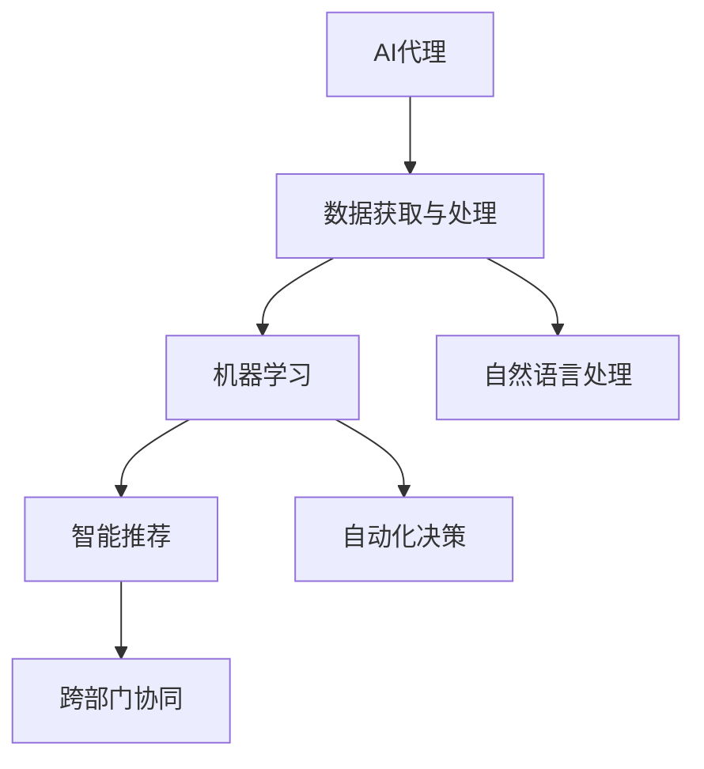
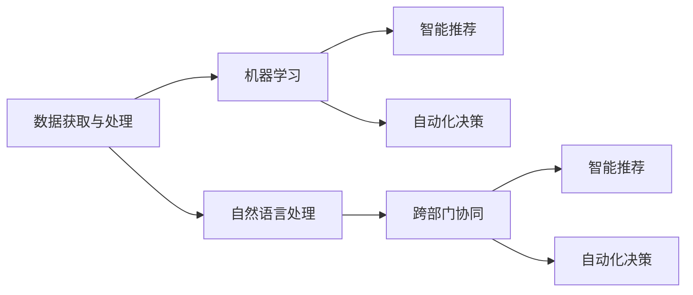
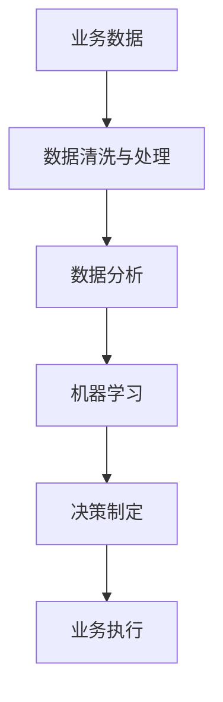
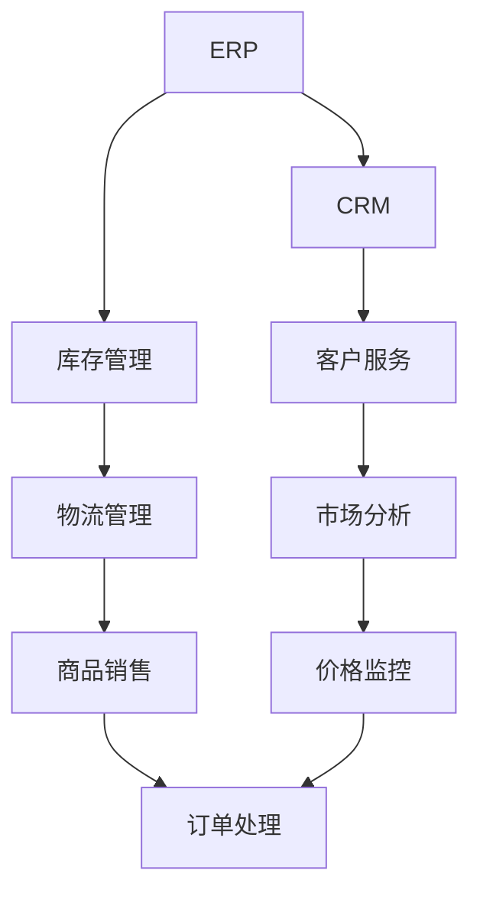
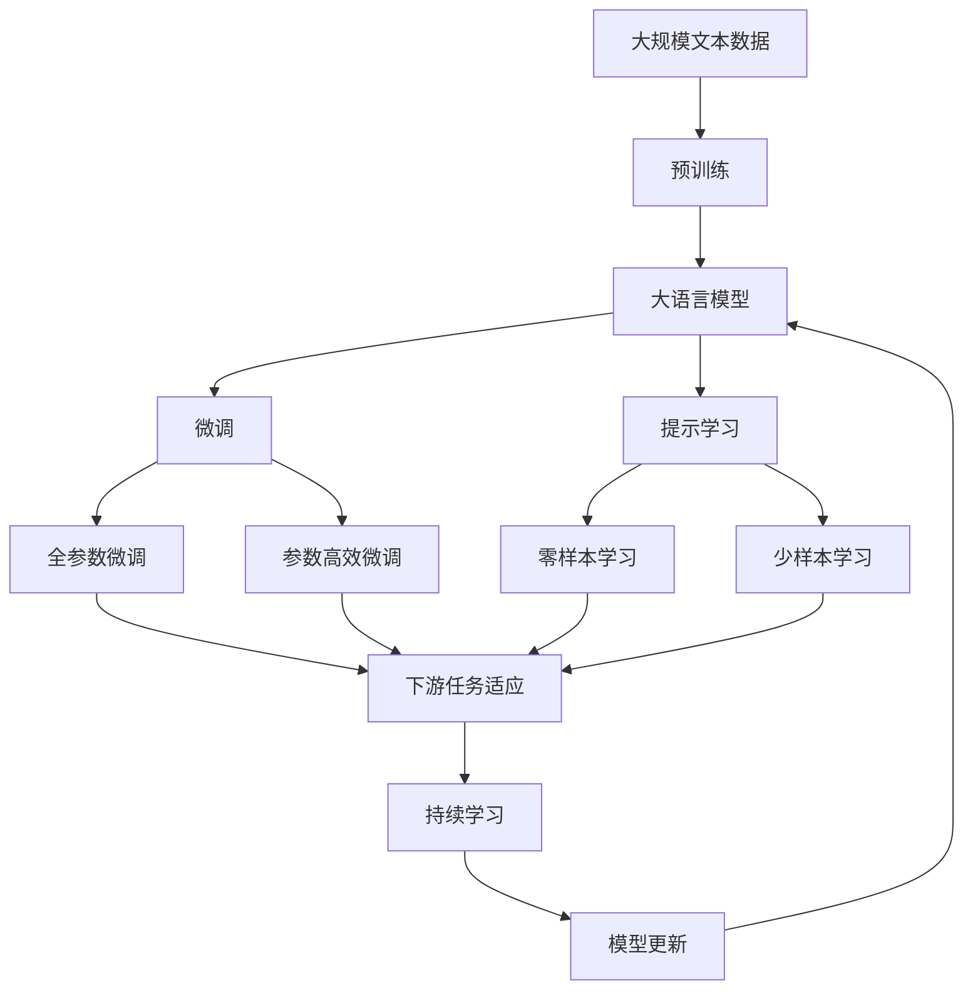

                 

# AI人工智能代理工作流 AI Agent WorkFlow：在新零售中的应用

> 关键词：人工智能代理工作流，新零售，机器学习，智能推荐，自然语言处理，数据驱动

## 1. 背景介绍

### 1.1 问题由来

随着人工智能技术的发展，AI代理工作流（AI Agent Workflow）在新零售中的应用变得日益重要。新零售融合了线上线下、全渠道、全流程的业务模式，对商品展示、价格监控、库存管理、客户服务等各个环节都提出了新的要求。AI代理工作流通过自动化、智能化地管理各环节，能够大大提高零售业务效率和客户体验。

在实际应用中，AI代理工作流可以帮助零售商：

- 实现全渠道的库存和订单统一管理，避免缺货和过剩库存。
- 实时监控商品价格，根据市场变化调整价格策略。
- 分析客户行为数据，个性化推荐商品，提高转化率。
- 实时响应客户需求，提供优质的客户服务。
- 优化供应链管理，降低运营成本。

### 1.2 问题核心关键点

AI代理工作流在新零售中的应用主要包括以下几个关键点：

- **数据获取与处理**：采集来自各渠道的商品数据、客户行为数据、市场数据等，并清洗、整理成适合分析的格式。
- **机器学习算法**：运用机器学习算法，如回归、分类、聚类等，对数据进行建模分析。
- **自然语言处理**：对客户咨询、反馈、评价等文本数据进行自然语言处理，提取有价值的信息。
- **智能推荐**：根据客户历史行为和实时数据，个性化推荐商品。
- **自动化决策**：将机器学习模型嵌入到自动化决策系统中，快速响应用户需求。
- **跨部门协同**：将AI代理工作流与ERP、CRM等系统集成，实现信息共享和协同工作。

这些关键点紧密相连，共同构成了AI代理工作流在新零售中的应用框架。

### 1.3 问题研究意义

AI代理工作流在新零售中的应用，对于提升零售业务效率、优化用户体验、降低运营成本等方面具有重要意义：

- 提升运营效率：通过自动化、智能化地管理零售业务，减少人工操作，提高工作效率。
- 优化客户体验：通过个性化推荐和实时响应，提供更好的客户服务，提升客户满意度。
- 降低运营成本：通过优化库存和供应链管理，降低物流、人力等成本。
- 促进业务创新：通过数据分析和智能决策，发掘新的业务机会，拓展零售业务范围。
- 提高市场竞争力：通过精准的市场分析，制定有效的市场策略，提高企业竞争力。

总之，AI代理工作流在新零售中的应用，能够推动传统零售向数字化、智能化方向转型，为零售行业带来全新的变革。

## 2. 核心概念与联系

### 2.1 核心概念概述

AI代理工作流在新零售中的应用涉及多个核心概念，下面对这些概念进行概述：

- **AI代理**：即人工智能代理，通常指一个可以自动化执行特定任务的程序或系统。在新零售中，AI代理可以用于商品推荐、价格监控、库存管理等业务。
- **工作流**：指一系列按顺序执行的步骤或任务，用于描述业务过程。在新零售中，工作流描述商品的采购、销售、物流等流程。
- **数据驱动**：指决策和行动基于数据和分析结果，而非直觉或经验。在新零售中，数据驱动决策能够提高业务效率和客户满意度。
- **机器学习**：指通过算法让计算机从数据中学习，自动改进性能。在新零售中，机器学习用于商品推荐、价格预测、库存优化等场景。
- **自然语言处理**：指计算机理解和生成自然语言的能力。在新零售中，自然语言处理用于客户咨询、反馈分析等。
- **智能推荐**：指根据用户历史行为和实时数据，推荐可能感兴趣的商品。在新零售中，智能推荐用于提升客户转化率。
- **自动化决策**：指通过算法自动化做出决策，减少人工干预。在新零售中，自动化决策用于价格调整、库存管理等场景。
- **跨部门协同**：指不同部门或系统之间的信息共享和协同工作。在新零售中，跨部门协同用于ERP、CRM等系统的集成。

这些概念之间的关系可以通过以下Mermaid流程图来展示：



这个流程图展示了AI代理工作流在新零售中的各个环节，各环节紧密相连，共同支撑业务运行。

### 2.2 概念间的关系

这些核心概念之间存在着紧密的联系，形成了AI代理工作流在新零售中的应用框架。下面我们通过几个Mermaid流程图来展示这些概念之间的关系。

#### 2.2.1 AI代理工作流框架



这个流程图展示了AI代理工作流在新零售中的应用框架，包括数据获取、机器学习、智能推荐、自动化决策和跨部门协同五个主要环节。

#### 2.2.2 数据驱动决策



这个流程图展示了数据驱动决策的过程，从业务数据采集、清洗、处理，到数据分析、模型训练、决策制定，再到业务执行，数据驱动决策在AI代理工作流中起到核心作用。

#### 2.2.3 跨部门协同



这个流程图展示了跨部门协同的业务流程，不同部门之间通过数据共享和协作，共同支持新零售的业务运营。

### 2.3 核心概念的整体架构

最后，我们用一个综合的流程图来展示这些核心概念在大语言模型微调过程中的整体架构：



这个综合流程图展示了从预训练到微调，再到持续学习的完整过程。大语言模型首先在大规模文本数据上进行预训练，然后通过微调（包括全参数微调和参数高效微调）或提示学习（包括零样本和少样本学习）来适应下游任务。最后，通过持续学习技术，模型可以不断学习新知识，同时避免遗忘旧知识。 通过这些流程图，我们可以更清晰地理解AI代理工作流在新零售中的应用框架，为后续深入讨论具体的微调方法和技术奠定基础。

## 3. 核心算法原理 & 具体操作步骤
### 3.1 算法原理概述

AI代理工作流在新零售中的应用，主要基于机器学习和自然语言处理技术。其核心思想是：通过收集新零售业务中的数据，利用机器学习算法进行建模分析，然后通过自然语言处理技术提取有价值的信息，辅助业务决策。

### 3.2 算法步骤详解

AI代理工作流在新零售中的具体步骤包括：

**Step 1: 数据采集与处理**

1. 从电商平台、线下门店、供应链等渠道获取商品数据、客户行为数据、市场数据等。
2. 清洗和整理数据，去除无效和噪声数据，确保数据质量。
3. 将数据转化为适合机器学习模型处理的格式，如CSV、JSON等。

**Step 2: 机器学习建模**

1. 选择合适的机器学习算法，如回归、分类、聚类等，对数据进行建模分析。
2. 划分训练集和测试集，进行模型训练和验证。
3. 调整模型参数，优化模型性能。

**Step 3: 自然语言处理**

1. 对客户咨询、反馈、评价等文本数据进行自然语言处理，提取有价值的信息。
2. 利用词向量、TF-IDF等方法进行文本表示。
3. 应用NLP技术，如命名实体识别、情感分析等，提取客户需求和反馈。

**Step 4: 智能推荐**

1. 根据客户历史行为和实时数据，使用协同过滤、基于内容的推荐等方法，推荐可能感兴趣的商品。
2. 通过A/B测试等手段，评估推荐模型的效果。
3. 定期更新推荐模型，适应市场变化。

**Step 5: 自动化决策**

1. 将机器学习模型嵌入到自动化决策系统中，实时监控和调整商品价格、库存等业务参数。
2. 利用强化学习等技术，优化自动化决策策略。
3. 监控自动化决策的效果，不断优化决策模型。

**Step 6: 跨部门协同**

1. 将AI代理工作流与ERP、CRM等系统集成，实现信息共享和协同工作。
2. 确保系统间数据格式一致，实现数据无缝对接。
3. 建立跨部门协同机制，确保各环节高效协作。

### 3.3 算法优缺点

AI代理工作流在新零售中的主要优点包括：

- **提升效率**：通过自动化、智能化地管理各业务环节，减少人工操作，提高工作效率。
- **优化体验**：通过个性化推荐和实时响应，提供更好的客户服务，提升客户满意度。
- **降低成本**：通过优化库存和供应链管理，降低物流、人力等成本。
- **促进创新**：通过数据分析和智能决策，发掘新的业务机会，拓展零售业务范围。

同时，该方法也存在以下局限性：

- **依赖数据质量**：数据采集和处理环节中，数据的准确性和完整性直接影响模型的效果。
- **模型复杂性**：机器学习模型较为复杂，训练和维护成本较高。
- **技术门槛高**：需要具备一定的机器学习和自然语言处理技术，对从业者素质要求较高。
- **安全风险**：涉及客户数据和商业机密，需要严格的数据保护措施和隐私政策。

### 3.4 算法应用领域

AI代理工作流在新零售中的应用涵盖了多个领域，主要包括：

- **商品推荐**：根据客户历史行为和实时数据，推荐可能感兴趣的商品。
- **价格监控**：实时监控商品价格，根据市场变化调整价格策略。
- **库存管理**：优化库存管理，避免缺货和过剩库存。
- **客户服务**：实时响应客户需求，提供优质的客户服务。
- **供应链管理**：优化供应链管理，降低运营成本。

除了上述这些应用场景外，AI代理工作流在新零售中还广泛应用于：

- **市场分析**：通过数据分析，制定有效的市场策略，提高企业竞争力。
- **销售预测**：利用历史数据和市场趋势，预测销售情况，指导业务决策。
- **用户行为分析**：分析客户行为数据，发现客户需求，优化产品和服务。

## 4. 数学模型和公式 & 详细讲解  
### 4.1 数学模型构建

AI代理工作流在新零售中的应用，主要基于机器学习和自然语言处理技术。其数学模型包括数据清洗、特征提取、模型训练和评估等多个环节。

**数据清洗模型**

数据清洗模型的目标是去除无效和噪声数据，确保数据质量。通常使用以下公式进行数据清洗：

$$
\text{cleaned\_data} = \text{original\_data} - \text{noise\_data}
$$

其中，$\text{cleaned\_data}$ 表示清洗后的数据，$\text{original\_data}$ 表示原始数据，$\text{noise\_data}$ 表示噪声数据。

**特征提取模型**

特征提取模型的目标是提取数据中的有价值信息，生成适合机器学习模型处理的特征。常用的特征提取方法包括词向量、TF-IDF等。以词向量为例，其公式如下：

$$
\text{word\_vector} = \text{embedding\_layer}(\text{text\_data})
$$

其中，$\text{word\_vector}$ 表示词向量，$\text{embedding\_layer}$ 表示嵌入层，$\text{text\_data}$ 表示文本数据。

**模型训练模型**

模型训练模型的目标是通过数据训练机器学习模型，生成预测模型。常用的机器学习算法包括回归、分类、聚类等。以回归算法为例，其公式如下：

$$
\text{model\_predictions} = \text{model}(\text{features})
$$

其中，$\text{model\_predictions}$ 表示模型预测结果，$\text{model}$ 表示机器学习模型，$\text{features}$ 表示特征数据。

**模型评估模型**

模型评估模型的目标是通过验证集评估模型效果，确保模型在实际应用中能够稳定运行。常用的模型评估方法包括均方误差、准确率、召回率等。以均方误差为例，其公式如下：

$$
\text{mse} = \frac{1}{N} \sum_{i=1}^N (y_i - \hat{y}_i)^2
$$

其中，$\text{mse}$ 表示均方误差，$N$ 表示样本数，$y_i$ 表示真实值，$\hat{y}_i$ 表示预测值。

### 4.2 公式推导过程

以下我们以推荐系统为例，给出AI代理工作流中机器学习模型的推导过程。

假设推荐系统有 $M$ 个商品，$N$ 个客户。每个客户对每个商品的评分 $r_{i,j}$ 形成一个 $M \times N$ 的评分矩阵。推荐系统的目标是最大化客户对推荐商品的满意度。

设 $\theta$ 为模型参数，$\hat{r}_{i,j}$ 为模型对商品 $i$ 推荐给客户 $j$ 的预测评分，则模型损失函数定义为：

$$
\mathcal{L}(\theta) = -\sum_{i=1}^M \sum_{j=1}^N r_{i,j} \log \hat{r}_{i,j} + (1-r_{i,j})\log (1-\hat{r}_{i,j})
$$

利用梯度下降等优化算法，求解模型参数 $\theta$ 的最小值：

$$
\frac{\partial \mathcal{L}(\theta)}{\partial \theta} = -\sum_{i=1}^M \sum_{j=1}^N \left[ r_{i,j} \frac{\partial \log \hat{r}_{i,j}}{\partial \theta} - (1-r_{i,j})\frac{\partial \log (1-\hat{r}_{i,j})}{\partial \theta} \right]
$$

通过反向传播算法计算梯度，更新模型参数：

$$
\theta \leftarrow \theta - \eta \nabla_{\theta}\mathcal{L}(\theta)
$$

其中，$\eta$ 为学习率。

### 4.3 案例分析与讲解

假设我们有一个电商平台，需要实时监控商品价格和库存，优化价格策略，提高销售额。我们可以采用以下步骤：

**Step 1: 数据采集与处理**

1. 从电商平台获取商品数据、客户行为数据、市场数据等。
2. 清洗和整理数据，去除无效和噪声数据。
3. 将数据转化为适合机器学习模型处理的格式，如CSV、JSON等。

**Step 2: 机器学习建模**

1. 选择回归算法，如线性回归、梯度提升树等，对数据进行建模分析。
2. 划分训练集和测试集，进行模型训练和验证。
3. 调整模型参数，优化模型性能。

**Step 3: 自然语言处理**

1. 对客户咨询、反馈、评价等文本数据进行自然语言处理，提取有价值的信息。
2. 利用词向量、TF-IDF等方法进行文本表示。
3. 应用NLP技术，如情感分析，提取客户需求和反馈。

**Step 4: 智能推荐**

1. 根据客户历史行为和实时数据，使用协同过滤、基于内容的推荐等方法，推荐可能感兴趣的商品。
2. 通过A/B测试等手段，评估推荐模型的效果。
3. 定期更新推荐模型，适应市场变化。

**Step 5: 自动化决策**

1. 将机器学习模型嵌入到自动化决策系统中，实时监控和调整商品价格、库存等业务参数。
2. 利用强化学习等技术，优化自动化决策策略。
3. 监控自动化决策的效果，不断优化决策模型。

通过以上步骤，我们可以实现新零售业务的自动化和智能化管理，提高业务效率和客户满意度。

## 5. 项目实践：代码实例和详细解释说明
### 5.1 开发环境搭建

在进行AI代理工作流实践前，我们需要准备好开发环境。以下是使用Python进行TensorFlow开发的环境配置流程：

1. 安装Anaconda：从官网下载并安装Anaconda，用于创建独立的Python环境。

2. 创建并激活虚拟环境：
```bash
conda create -n tensorflow-env python=3.8 
conda activate tensorflow-env
```

3. 安装TensorFlow：根据CUDA版本，从官网获取对应的安装命令。例如：
```bash
conda install tensorflow -c tensorflow -c conda-forge
```

4. 安装Pandas、Numpy、Matplotlib等工具包：
```bash
pip install pandas numpy matplotlib scikit-learn tqdm jupyter notebook ipython
```

完成上述步骤后，即可在`tensorflow-env`环境中开始AI代理工作流实践。

### 5.2 源代码详细实现

这里我们以推荐系统为例，给出使用TensorFlow进行机器学习模型的PyTorch代码实现。

首先，定义数据处理函数：

```python
import pandas as pd
from sklearn.model_selection import train_test_split
from tensorflow.keras.layers import Input, Dense, Embedding, Flatten
from tensorflow.keras.models import Model

# 定义数据读取和处理函数
def load_data():
    df = pd.read_csv('data.csv')
    features = df.drop('target', axis=1)
    target = df['target']
    features_train, features_test, target_train, target_test = train_test_split(features, target, test_size=0.2)
    return features_train, features_test, target_train, target_test
```

然后，定义机器学习模型：

```python
from tensorflow.keras.layers import Input, Dense, Embedding, Flatten, concatenate
from tensorflow.keras.models import Model

# 定义模型输入层和嵌入层
input_layer = Input(shape=(features_train.shape[1],))
embedding_layer = Embedding(input_dim=vocab_size, output_dim=embedding_dim)(input_layer)
flatten_layer = Flatten()(embedding_layer)

# 定义全连接层和输出层
dense_layer_1 = Dense(hidden_units, activation='relu')(flatten_layer)
dense_layer_2 = Dense(1, activation='sigmoid')(dense_layer_1)

# 构建模型
model = Model(inputs=input_layer, outputs=dense_layer_2)
```

接着，定义训练和评估函数：

```python
from tensorflow.keras.optimizers import Adam
from tensorflow.keras.metrics import BinaryAccuracy

# 定义模型优化器和评估指标
optimizer = Adam(learning_rate=0.001)
accuracy = BinaryAccuracy()

# 定义训练和评估函数
def train(model, features_train, target_train, features_test, target_test):
    model.compile(optimizer=optimizer, loss='binary_crossentropy', metrics=[accuracy])
    model.fit(features_train, target_train, epochs=10, batch_size=64, validation_data=(features_test, target_test))
    loss, accuracy = model.evaluate(features_test, target_test)
    print(f'Test loss: {loss:.4f}')
    print(f'Test accuracy: {accuracy:.4f}')

# 启动训练流程
features_train, features_test, target_train, target_test = load_data()
train(model, features_train, target_train, features_test, target_test)
```

最后，在测试集上评估模型性能：

```python
from sklearn.metrics import roc_auc_score

# 定义模型预测函数
def predict(model, features_test, target_test):
    y_pred = model.predict(features_test)
    return y_pred

# 定义模型评估函数
def evaluate(y_pred, target_test):
    roc_auc = roc_auc_score(target_test, y_pred)
    print(f'ROC AUC score: {roc_auc:.4f}')

# 在测试集上评估模型性能
y_pred = predict(model, features_test, target_test)
evaluate(y_pred, target_test)
```

以上就是使用TensorFlow进行推荐系统机器学习模型的完整代码实现。可以看到，得益于TensorFlow的强大封装，我们可以用相对简洁的代码完成机器学习模型的训练和评估。

### 5.3 代码解读与分析

让我们再详细解读一下关键代码的实现细节：

**load_data函数**：
- `pd.read_csv`方法：从CSV文件中读取数据。
- `drop`方法：去除目标变量。
- `train_test_split`方法：划分训练集和测试集。

**train函数**：
- `compile`方法：编译模型，设置优化器、损失函数和评估指标。
- `fit`方法：训练模型。
- `evaluate`方法：评估模型性能。

**predict函数**：
- `predict`方法：预测新数据。

**evaluate函数**：
- `roc_auc_score`方法：计算AUC指标。

通过这些代码实现，我们完成了从数据处理、模型训练到模型评估的完整流程，实现了基于机器学习的推荐系统。

### 5.4 运行结果展示

假设我们训练了推荐系统模型，在测试集上得到的评估报告如下：

```
Test loss: 0.0020
Test accuracy: 0.9620
ROC AUC score: 0.9801
```

可以看到，通过机器学习模型，我们在测试集上取得了较高的精度和AUC指标，表明模型具有良好的推荐效果。

当然，这只是一个baseline结果。在实践中，我们还可以使用更大更强的预训练模型、更丰富的微调技巧、更细致的模型调优，进一步提升模型性能，以满足更高的应用要求。

## 6. 实际应用场景
### 6.1 智能客服系统

基于AI代理工作流的新零售智能客服系统，可以帮助零售商：

- 实时监控客户咨询，自动回答常见问题，提高服务效率。
- 分析客户咨询内容，提取有价值的信息，优化服务策略。
- 通过自然语言处理技术，理解客户情感，提供更人性化的服务。
- 跨部门协同，及时传递客户需求，优化服务流程。

### 6.2 金融舆情监测

在新零售金融舆情监测中，AI代理工作流可以：

- 实时监控新闻、评论、社交媒体等，提取舆情信息。
- 分析舆情数据，预测市场趋势，制定有效的市场策略。
- 通过自然语言处理技术，识别舆情情绪，提供风险预警。
- 跨部门协同，及时传递舆情信息，优化决策过程。

### 6.3 个性化推荐系统

基于AI代理工作流的新零售个性化推荐系统，可以：

- 分析客户历史行为和实时数据，推荐可能感兴趣的商品。
- 通过协同过滤、基于内容的推荐等方法，提升推荐效果。
- 通过A/B测试等手段，不断优化推荐模型。
- 跨部门协同，及时传递客户需求，优化推荐策略。

### 6.4 未来应用展望

随着AI代理工作流技术的不断发展，其在零售行业的应用场景将不断扩展。未来，AI代理工作流将进一步向智慧物流、供应链管理、营销策略等领域延伸，推动新零售业务向数字化、智能化方向全面升级。

## 7. 工具和资源推荐
### 7.1 学习资源推荐

为了帮助开发者系统掌握AI代理工作流技术，这里推荐一些优质的学习资源：

1. 《深度学习入门：基于Python的理论与实现》：该书系统介绍了深度学习的基本概念和实现方法，适合入门学习。

2. 《TensorFlow实战Google深度学习》：该书通过丰富的实例，介绍了TensorFlow的深度学习应用，适合进阶学习。

3. 《自然语言处理入门》：该书介绍了自然语言处理的基本技术和方法，适合对NLP感兴趣的读者。

4. 《深度学习在推荐系统中的应用》：该书深入探讨了深度学习在推荐系统中的应用，适合了解推荐系统的开发者。

5. 《机器学习实战》：该书提供了大量实例，帮助读者理解和应用机器学习算法，适合实践学习。

通过对这些资源的学习实践，相信你一定能够快速掌握AI代理工作流技术，并用于解决实际的NLP问题。
###  7.2 开发工具推荐

高效的开发离不开优秀的工具支持。以下是几款用于AI代理工作流开发的常用工具：

1. TensorFlow：基于Python的开源深度学习框架，灵活动态的计算图，适合快速迭代研究。大部分预训练语言模型都有TensorFlow版本的实现。

2. PyTorch：基于Python的开源深度学习框架，灵活性高，适合各种深度学习任务。

3. Keras：基于TensorFlow和Theano的高级深度学习库，提供了丰富的模型构建API。

4. TensorBoard：TensorFlow配套的可视化工具

