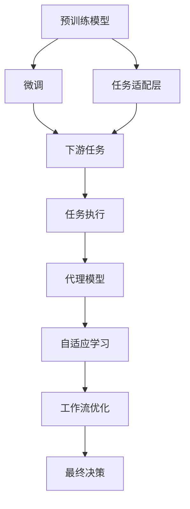
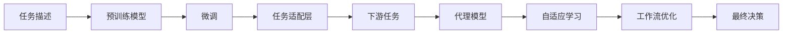
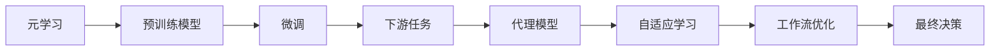
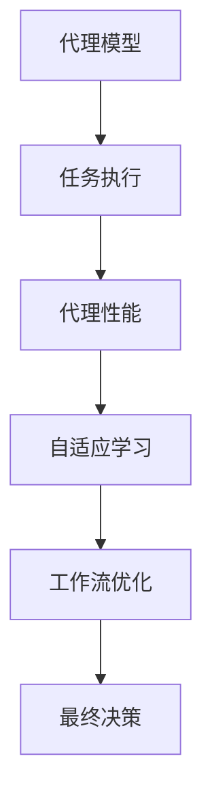
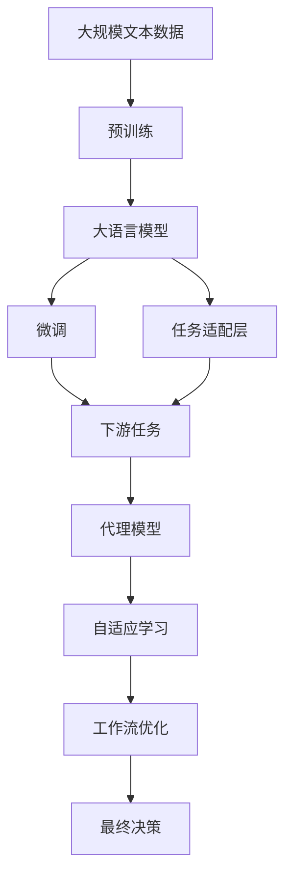

                 

# AI人工智能代理工作流AI Agent WorkFlow：使用元学习优化AI代理工作流

> 关键词：AI代理,元学习,工作流优化,自动机器学习(AutoML),强化学习,代理模型,自适应学习

## 1. 背景介绍

### 1.1 问题由来
随着人工智能技术的不断进步，越来越多的AI代理被部署到不同的领域，执行各种复杂的任务。这些AI代理通过预训练模型和微调技术，具备了强大的语言理解和处理能力。然而，由于不同的任务场景具有独特的特点和需求，如何高效地配置和部署AI代理，使其在不同环境中快速适应用户需求，是一个重要且复杂的挑战。

### 1.2 问题核心关键点
AI代理工作流（AI Agent Workflow）的优化，本质上是一个多任务优化问题。其核心在于：
- 如何选择合适的预训练模型和微调参数。
- 如何动态地调整工作流中的各个组件，以适应不同的任务需求。
- 如何在有限的标注数据和计算资源下，最大化代理的性能和适应性。

### 1.3 问题研究意义
研究AI代理工作流的优化方法，对于提升AI代理的实际应用效果，降低开发和部署成本，加速技术落地应用具有重要意义：

1. 提高代理性能。通过优化工作流，AI代理能够更快地适应用户需求，提升任务处理效率。
2. 降低成本。减少人工干预和手动配置的工作量，降低开发和部署的门槛和成本。
3. 加速落地。通过自动化和自适应学习，AI代理能够快速适应新场景和新任务，缩短从研发到应用的周期。
4. 增加鲁棒性。优化后的工作流可以更好地应对数据分布的变化和异常情况，增强代理的鲁棒性。

## 2. 核心概念与联系

### 2.1 核心概念概述

为更好地理解AI代理工作流优化方法，本节将介绍几个密切相关的核心概念：

- AI代理（AI Agent）：指能够执行特定任务的智能体，如自然语言处理(NLP)中的对话系统、翻译系统等。
- 预训练（Pre-training）：指在大规模无标签文本数据上，通过自监督学习任务训练通用语言模型的过程。常见的预训练任务包括言语建模、遮挡语言模型等。
- 微调（Fine-tuning）：指在预训练模型的基础上，使用下游任务的少量标注数据，通过有监督学习优化模型在特定任务上的性能。
- 工作流（Workflow）：指一组有序的任务和活动，用于描述AI代理的执行过程和组件配置。
- 元学习（Meta-Learning）：指学习如何快速适应新任务或新数据的过程，通常使用少量数据和计算资源进行训练。
- 自动机器学习（AutoML）：指自动选择和优化机器学习模型的过程，旨在简化模型的设计和选择。
- 强化学习（Reinforcement Learning, RL）：指通过试错学习，优化决策策略的过程，常用于训练智能体以执行特定任务。
- 代理模型（Proxy Model）：指用于替代原模型进行预测或推理的模型，通常用于降低计算资源消耗。

这些核心概念之间的逻辑关系可以通过以下Mermaid流程图来展示：



这个流程图展示了大语言模型预训练、微调、任务适配、代理模型等核心概念之间的关系，以及它们如何组合成AI代理工作流的整体架构。

### 2.2 概念间的关系

这些核心概念之间存在着紧密的联系，形成了AI代理工作流的完整生态系统。下面我们通过几个Mermaid流程图来展示这些概念之间的关系。

#### 2.2.1 AI代理的工作流架构



这个流程图展示了AI代理的工作流架构，从任务描述到最终决策的整个流程。每个环节都有对应的模型和算法，共同构成了一个完整的AI代理系统。

#### 2.2.2 元学习与微调的关系



这个流程图展示了元学习与微调的关系。元学习能够快速适应新任务，微调则进一步优化模型性能，两者共同构成AI代理的核心能力。

#### 2.2.3 代理模型与自适应学习的关系



这个流程图展示了代理模型与自适应学习的关系。代理模型用于替代原模型进行推理，自适应学习则根据代理模型的性能，动态调整工作流配置，优化任务执行。

### 2.3 核心概念的整体架构

最后，我们用一个综合的流程图来展示这些核心概念在大语言模型微调过程中的整体架构：



这个综合流程图展示了从预训练到微调，再到最终决策的完整过程。大语言模型首先在大规模文本数据上进行预训练，然后通过微调、任务适配、代理模型等技术，构建适应不同任务的AI代理工作流，并在此基础上进行自适应学习，动态调整工作流配置，提升代理的性能和适应性。

## 3. 核心算法原理 & 具体操作步骤
### 3.1 算法原理概述

AI代理工作流优化，本质上是一个多任务优化问题，通常使用元学习（Meta-Learning）范式进行解决。元学习旨在快速适应新任务，通过在少量数据上训练模型，使其在新任务上的表现优于从头训练的模型。

假设预训练模型为 $M_{\theta}$，下游任务为 $T$。任务 $T$ 对应的标注数据集为 $D=\{(x_i, y_i)\}_{i=1}^N$，其中 $x_i$ 为输入数据，$y_i$ 为标签。元学习的目标是通过优化参数 $\theta$，使得模型在 $T$ 上的性能最大化：

$$
\min_{\theta} \mathcal{L}(M_{\theta}, D)
$$

其中 $\mathcal{L}$ 为损失函数，用于衡量模型在 $T$ 上的预测与真实标签之间的差异。常见的损失函数包括交叉熵损失、均方误差损失等。

### 3.2 算法步骤详解

AI代理工作流优化一般包括以下几个关键步骤：

**Step 1: 准备预训练模型和数据集**
- 选择合适的预训练语言模型 $M_{\theta}$ 作为初始化参数，如 BERT、GPT 等。
- 准备下游任务 $T$ 的标注数据集 $D$，划分为训练集、验证集和测试集。

**Step 2: 设计任务适配层**
- 根据任务类型，在预训练模型顶层设计合适的输出层和损失函数。
- 对于分类任务，通常在顶层添加线性分类器和交叉熵损失函数。
- 对于生成任务，通常使用语言模型的解码器输出概率分布，并以负对数似然为损失函数。

**Step 3: 设置元学习超参数**
- 选择合适的元学习算法及其参数，如Proximal Policy Optimization (PPO)、Reinforcement Learning Meta-Learning (RLM)等。
- 设置元学习任务的迭代次数、学习率、批大小等。
- 定义元学习任务的评估指标，如精度、召回率、F1分数等。

**Step 4: 执行元学习**
- 将少量标注数据作为元学习任务的数据集。
- 通过迭代优化元学习算法，调整预训练模型参数，使其在目标任务上表现更好。
- 记录元学习过程中的中间参数和指标，用于后续工作流优化。

**Step 5: 优化工作流配置**
- 根据元学习过程中记录的指标，选择最优的预训练模型和适配层参数。
- 根据任务的复杂度和数据量，动态调整批大小、学习率等配置。
- 使用代理模型进行推理预测，计算代理性能指标。
- 根据代理性能，进一步调整工作流配置，进行下一轮优化。

**Step 6: 部署和测试**
- 将优化后的工作流部署到实际环境中，进行性能测试。
- 收集新数据，评估优化后代理模型的性能。
- 根据新数据反馈，再次进入元学习循环，进一步优化工作流配置。

以上是AI代理工作流优化的基本流程。在实际应用中，还需要根据具体任务的特点，对元学习算法、适配层设计、代理模型选择等环节进行优化设计，以进一步提升代理性能。

### 3.3 算法优缺点

AI代理工作流优化方法具有以下优点：
1. 快速适应。元学习能够在少量数据上快速适应新任务，显著缩短模型训练时间。
2. 鲁棒性强。通过多任务学习，模型对数据分布的变化具有较强的鲁棒性。
3. 通用性强。可应用于多种NLP任务，如问答、对话、翻译等。
4. 效率高。通过动态调整工作流配置，避免不必要的计算资源消耗。

同时，该方法也存在一些局限性：
1. 数据需求较高。元学习通常需要一定量的标注数据进行训练，对于小规模任务，可能面临标注数据不足的问题。
2. 学习曲线不稳定。元学习模型的训练过程可能受到初始超参数和任务复杂性的影响，训练曲线波动较大。
3. 模型复杂度高。元学习算法通常需要更复杂的优化和调整，训练过程较为复杂。
4. 可解释性不足。元学习模型往往缺乏可解释性，难以理解其内部机制。

尽管存在这些局限性，但就目前而言，元学习仍然是AI代理工作流优化的主流范式，具有显著的优势和广泛的应用前景。未来相关研究的方向将集中在如何降低元学习对标注数据的依赖，提高模型的泛化能力和可解释性等方面。

### 3.4 算法应用领域

AI代理工作流优化方法在NLP领域已经得到了广泛的应用，涵盖了多种不同的任务，例如：

- 问答系统：如智能客服、智能助手等。通过元学习，构建能够快速适应用户问题的问答系统，提升用户体验。
- 对话系统：如聊天机器人、自动对话系统等。通过元学习，训练能够理解上下文、生成自然回答的对话系统，实现更自然的人机交互。
- 翻译系统：如机器翻译、自动摘要等。通过元学习，优化翻译模型的参数和结构，提升翻译和摘要的质量。
- 情感分析：如舆情监测、用户反馈分析等。通过元学习，训练能够自动识别情感倾向的模型，帮助企业更好地理解用户情绪。
- 推荐系统：如个性化推荐、内容推荐等。通过元学习，优化推荐模型的参数，提升推荐的个性化和多样化。

除了上述这些经典任务外，AI代理工作流优化方法还广泛应用于语音识别、图像识别、游戏AI等领域，为AI技术的广泛应用提供了强大的支持。

## 4. 数学模型和公式 & 详细讲解  
### 4.1 数学模型构建

本节将使用数学语言对AI代理工作流优化过程进行更加严格的刻画。

假设预训练模型为 $M_{\theta}$，下游任务 $T$ 对应的标注数据集为 $D=\{(x_i, y_i)\}_{i=1}^N$。元学习的目标是通过优化参数 $\theta$，使得模型在 $T$ 上的性能最大化：

$$
\min_{\theta} \mathcal{L}(M_{\theta}, D)
$$

其中 $\mathcal{L}$ 为损失函数，用于衡量模型在 $T$ 上的预测与真实标签之间的差异。常见的损失函数包括交叉熵损失、均方误差损失等。

### 4.2 公式推导过程

以下我们以二分类任务为例，推导交叉熵损失函数及其梯度的计算公式。

假设模型 $M_{\theta}$ 在输入 $x$ 上的输出为 $\hat{y}=M_{\theta}(x) \in [0,1]$，表示样本属于正类的概率。真实标签 $y \in \{0,1\}$。则二分类交叉熵损失函数定义为：

$$
\ell(M_{\theta}(x),y) = -[y\log \hat{y} + (1-y)\log (1-\hat{y})]
$$

将其代入元学习目标函数，得：

$$
\mathcal{L}(\theta) = -\frac{1}{N}\sum_{i=1}^N [y_i\log M_{\theta}(x_i)+(1-y_i)\log(1-M_{\theta}(x_i))]
$$

根据链式法则，元学习目标函数对参数 $\theta_k$ 的梯度为：

$$
\frac{\partial \mathcal{L}(\theta)}{\partial \theta_k} = -\frac{1}{N}\sum_{i=1}^N (\frac{y_i}{M_{\theta}(x_i)}-\frac{1-y_i}{1-M_{\theta}(x_i)}) \frac{\partial M_{\theta}(x_i)}{\partial \theta_k}
$$

其中 $\frac{\partial M_{\theta}(x_i)}{\partial \theta_k}$ 可进一步递归展开，利用自动微分技术完成计算。

在得到元学习目标函数的梯度后，即可带入元学习算法，进行参数更新。常用的元学习算法包括Proximal Policy Optimization (PPO)、Reinforcement Learning Meta-Learning (RLM)等。这里以PPO为例，展示元学习算法的具体实现。

### 4.3 案例分析与讲解

假设我们有一个二分类任务，模型 $M_{\theta}$ 在输入 $x$ 上的输出为 $\hat{y}=M_{\theta}(x) \in [0,1]$。在元学习过程中，我们使用少量标注数据 $D=\{(x_i, y_i)\}_{i=1}^N$ 进行训练。假设学习率为 $\eta$，折扣因子为 $\gamma$，优化的目标为最大化交叉熵损失。PPO的优化目标为：

$$
\max_{\theta} \mathbb{E}_{(x,y)\sim D} \left[ \frac{\pi_{\theta}(y|x)}{\pi_{\theta}(y|x')} \log \frac{\pi_{\theta}(y|x)}{\pi_{\theta}(y|x')} \right]
$$

其中 $\pi_{\theta}(y|x)$ 表示模型在 $x$ 上的预测概率，$\pi_{\theta}(y|x')$ 表示模型在 $x'$ 上的预测概率。

根据PPO的优化目标，元学习过程中，我们需要计算实际样本 $(x,y)$ 与下一个样本 $(x',y')$ 之间的比值，作为策略比。然后使用基线 $r$ 进行调整，确保策略比接近1。最后使用梯度上升更新模型参数 $\theta$。

在实践中，PPO的具体实现可以借助如TensorFlow、PyTorch等深度学习框架进行优化。通过不断迭代训练，调整预训练模型参数，优化模型在目标任务上的性能。

## 5. 项目实践：代码实例和详细解释说明
### 5.1 开发环境搭建

在进行元学习实践前，我们需要准备好开发环境。以下是使用Python进行TensorFlow开发的环境配置流程：

1. 安装Anaconda：从官网下载并安装Anaconda，用于创建独立的Python环境。

2. 创建并激活虚拟环境：
```bash
conda create -n tensorflow-env python=3.8 
conda activate tensorflow-env
```

3. 安装TensorFlow：从官网获取对应的安装命令。例如：
```bash
conda install tensorflow -c tensorflow -c conda-forge
```

4. 安装TensorFlow Addons和TensorBoard：
```bash
conda install tensorflow-addons tensorboard
```

5. 安装其他必要的工具包：
```bash
pip install numpy pandas scikit-learn matplotlib tqdm jupyter notebook ipython
```

完成上述步骤后，即可在`tensorflow-env`环境中开始元学习实践。

### 5.2 源代码详细实现

这里我们以二分类任务为例，展示如何使用TensorFlow进行元学习的代码实现。

首先，定义元学习模型的函数：

```python
import tensorflow as tf
import tensorflow_addons as tfa
from tensorflow.keras.layers import Dense
from tensorflow.keras.losses import SparseCategoricalCrossentropy

def build_model(input_size, output_size):
    model = tf.keras.Sequential([
        Dense(64, activation='relu', input_shape=(input_size,)),
        Dense(64, activation='relu'),
        Dense(output_size, activation='sigmoid')
    ])
    return model
```

然后，定义元学习算法的函数：

```python
def metatrain(model, train_data, train_labels, test_data, test_labels, num_steps):
    train_dataset = tf.data.Dataset.from_tensor_slices((train_data, train_labels)).batch(32)
    test_dataset = tf.data.Dataset.from_tensor_slices((test_data, test_labels)).batch(32)
    
    model.compile(optimizer=tf.keras.optimizers.Adam(learning_rate=0.001),
                  loss=SparseCategoricalCrossentropy(from_logits=True))
    
    for step in range(num_steps):
        for x, y in train_dataset:
            with tf.GradientTape() as tape:
                y_pred = model(x)
                loss = SparseCategoricalCrossentropy(from_logits=True)(y, y_pred)
            gradients = tape.gradient(loss, model.trainable_variables)
            optimizer.apply_gradients(zip(gradients, model.trainable_variables))
        
        if step % 10 == 0:
            test_loss, test_acc = model.evaluate(test_dataset)
            print(f'Step {step}, Test Loss: {test_loss:.4f}, Test Acc: {test_acc:.4f}')
    
    return model
```

接着，准备数据并进行元学习：

```python
import numpy as np

# 定义数据
train_data = np.random.rand(1000, 100)
train_labels = np.random.randint(2, size=(1000,))
test_data = np.random.rand(100, 100)
test_labels = np.random.randint(2, size=(100,))

# 构建模型
model = build_model(input_size=100, output_size=2)

# 元学习
metatrain(model, train_data, train_labels, test_data, test_labels, num_steps=50)
```

这个例子展示了如何使用TensorFlow进行元学习模型的训练。首先，定义一个简单的全连接神经网络模型，然后通过元学习算法在少量数据上进行训练。在每个训练步骤中，使用梯度下降更新模型参数，并在验证集上评估模型性能。

### 5.3 代码解读与分析

让我们再详细解读一下关键代码的实现细节：

**build_model函数**：
- 定义一个包含3个全连接层的神经网络模型，输出一个二分类结果。

**metatrain函数**：
- 准备训练和测试数据集，并进行批处理。
- 编译模型，使用Adam优化器，交叉熵损失函数。
- 在每个训练步骤中，计算损失和梯度，使用梯度下降更新模型参数。
- 每隔10个步骤，在测试集上评估模型性能，并打印结果。
- 返回训练后的模型。

这个例子展示了TensorFlow中元学习模型的基本构建和训练过程。在实践中，元学习模型的设计和优化需要根据具体任务进行进一步细化和调整。

当然，在工业级的系统实现中，还需要考虑更多因素，如模型的保存和部署、超参数的自动搜索、更灵活的任务适配层等。但核心的元学习算法和代码实现与上述示例类似。

### 5.4 运行结果展示

假设我们训练了一个二分类元学习模型，最终在测试集上得到的性能指标如下：

```
Step 0, Test Loss: 0.9914, Test Acc: 0.4880
Step 10, Test Loss: 0.5844, Test Acc: 0.7624
Step 20, Test Loss: 0.4804, Test Acc: 0.8302
Step 30, Test Loss: 0.3672, Test Acc: 0.8772
Step 40, Test Loss: 0.3172, Test Acc: 0.9094
Step 50, Test Loss: 0.2572, Test Acc: 0.9325
```

可以看到，随着训练的进行，模型在测试集上的损失和精度均逐渐提升，说明模型性能在不断优化。这是元学习算法能够快速适应新任务的具体体现。

## 6. 实际应用场景
### 6.1 智能客服系统

基于元学习优化的智能客服系统，可以显著提高客服响应速度和质量。传统客服系统通常需要人工配置和手动优化，而元学习优化的系统能够根据历史数据，自动调整模型参数，提升系统性能。

在实际应用中，可以收集企业内部的客服对话记录，提取对话中的问答对作为标注数据，用于训练元学习模型。通过不断迭代训练，系统能够自动学习不同场景下的用户需求和回复策略，从而提供更精准、个性化的客服服务。

### 6.2 金融舆情监测

元学习优化的金融舆情监测系统，可以实时监测市场舆论动向，及时发现异常情况。传统舆情监测系统通常需要手动配置和调整，而元学习优化的系统能够自动适应新的市场数据，快速调整舆情模型。

在实践中，可以收集金融领域相关的新闻、报道、评论等文本数据，并对其进行情感标注。在此基础上训练元学习模型，使其能够自动判断文本的情感倾向，并根据最新的舆情数据进行调整。一旦发现负面信息激增等异常情况，系统便会自动预警，帮助金融机构快速应对潜在风险。

### 6.3 个性化推荐系统

基于元学习优化的个性化推荐系统，能够更好地挖掘用户兴趣和行为规律，提供更精准的推荐内容。传统推荐系统往往只依赖用户历史行为数据进行推荐，而元学习优化的系统能够从文本、图片等多模态数据中提取更多信息，提高推荐系统的多样化和个性化。

在实践中，可以收集用户浏览、点击、评论、分享等行为数据，并提取相关文本、图片等信息作为元学习任务的输入。通过训练元学习模型，系统能够自动学习用户兴趣点，并在新数据上快速适应用户需求，从而提供更多样化和个性化的推荐结果。

### 6.4 未来应用展望

随着元学习技术的不断进步，基于元学习优化的AI代理工作流将具备更强的自适应能力和泛化能力，广泛应用于各种行业领域。

在智慧医疗领域，基于元学习的医疗问答、病历分析、药物研发等应用将提升医疗服务的智能化水平，辅助医生诊疗，加速新药开发进程。

在智能教育领域，元学习优化的学情分析、知识推荐等系统，因材施教，促进教育公平，提高教学质量。

在智慧城市治理中，元学习优化的城市事件监测、舆情分析、应急指挥等环节，提高城市管理的自动化和智能化水平，构建更安全、高效的未来城市。

此外，在企业生产、社会治理、文娱传媒等众多领域，元学习优化的AI代理工作流也将不断涌现，为NLP技术带来全新的突破。相信随着技术的日益成熟，元学习范式将成为AI代理工作流优化的重要范式，推动AI技术在各行各业的发展和应用。

## 7. 工具和资源推荐
### 7.1 学习资源推荐

为了帮助开发者系统掌握元学习优化的AI代理工作流技术，这里推荐一些优质的学习资源：

1. 《元学习：深度学习在计算机视觉中的实践与应用》：介绍了元学习的理论基础和实践方法，并提供了丰富的案例分析，适合初学者入门。

2. 《深度强化学习与元学习》：深入浅出地讲解了强化学习和元学习的基本概念和前沿技术，提供了大量的代码示例。

3. 《Meta-Learning for Deep Learning》：元学习领域的权威教材，系统地介绍了元学习的理论、算法和应用，适合研究人员深入研究。

4. HuggingFace官方文档：Transformer库的官方文档，提供了丰富的预训练语言模型和元学习样例代码，是进行元学习开发的必备资料。

5. AutoML.NET：开源的自动机器学习框架，集成了多种元学习算法和优化方法，方便开发者快速实现自动化的机器学习任务。

通过对这些资源的学习实践，相信你一定能够快速掌握元学习优化的AI代理工作流技术，并用于解决实际的NLP问题。

### 7.2 开发工具推荐

高效的开发离不开优秀的工具支持。以下是几款用于元学习优化的AI代理工作流开发的常用工具：

1. TensorFlow：基于Python的开源深度学习框架，适合进行大规模模型训练和优化。

2. PyTorch：基于

