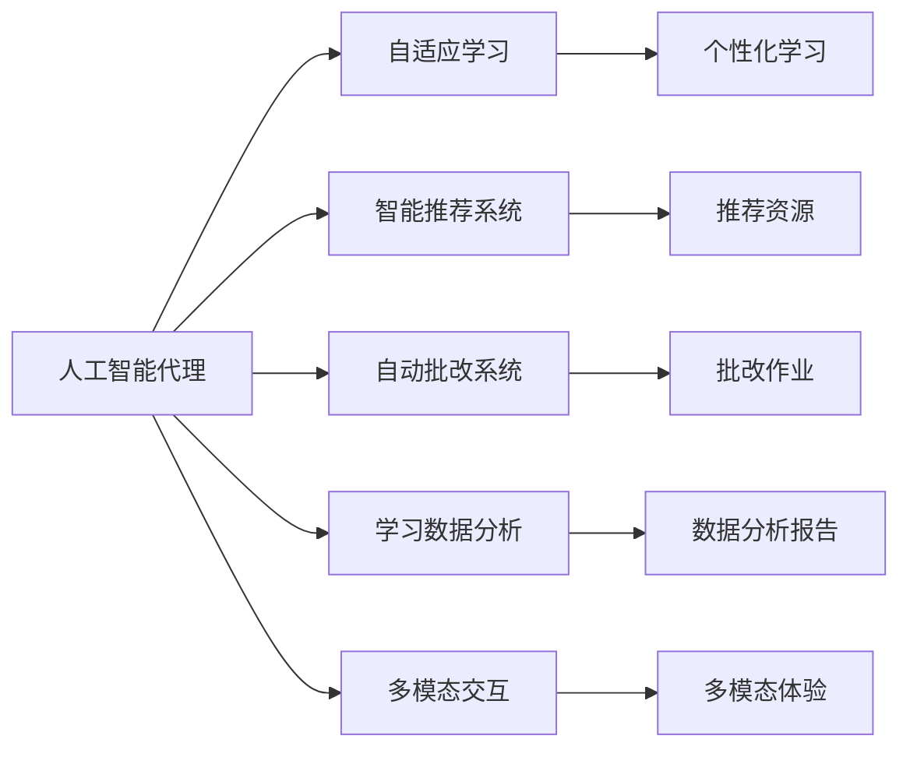

                 

# AI人工智能代理工作流AI Agent Workflow：在教育培训中运用自主学习代理

在人工智能技术迅猛发展的今天，人工智能代理(AI Agents)已经在多个领域得到了广泛应用。教育培训作为人类文明传承的重要环节，其对人工智能代理的需求也在日益增加。本文将从背景介绍、核心概念与联系、核心算法原理与操作步骤、数学模型和公式、项目实践、实际应用场景、工具和资源推荐、总结与展望等方面，系统介绍基于自主学习代理的AI工作流在教育培训中的应用。

## 1. 背景介绍

### 1.1 问题由来

在数字化时代，传统的教育培训模式面临着诸多挑战，如教学资源分散、个性化教学难以实现、教师负担过重等。为了提升教育培训的效率和质量，人们提出了使用人工智能代理(AI Agents)来辅助教学。

人工智能代理可以通过自然语言理解、计算机视觉、知识图谱等技术，为学生提供个性化辅导、智能推荐、作业批改等全方位服务。特别是在大规模在线教育平台中，人工智能代理已经成为了不可或缺的工具。

### 1.2 问题核心关键点

人工智能代理在教育培训中的核心关键点包括以下几个方面：

- **自适应学习**：人工智能代理可以根据学生的学习情况，调整教学策略，提供个性化的学习建议和资源。
- **自动批改作业**：通过深度学习技术，人工智能代理可以自动批改作业，减轻教师负担，提高作业反馈的及时性和准确性。
- **智能推荐系统**：人工智能代理可以根据学生的学习行为和偏好，推荐合适的学习资源和课程，提升学习效果。
- **学习数据分析**：人工智能代理可以实时分析学生的学习数据，提供精准的评估报告和改进建议。
- **多模态交互**：人工智能代理可以结合语音、图像等多种模态，提供更加生动、直观的学习体验。

### 1.3 问题研究意义

人工智能代理在教育培训中的应用，具有以下几个重要意义：

1. **提升教学效果**：人工智能代理能够提供个性化、智能化的教学服务，帮助学生更好地掌握知识，提升学习效果。
2. **减轻教师负担**：通过自动化批改作业、数据分析等功能，人工智能代理能够减轻教师的重复劳动，让他们有更多时间专注于教学设计和学生互动。
3. **促进教育公平**：人工智能代理能够为偏远地区和特殊需求学生提供更多的学习资源和支持，促进教育公平。
4. **拓展教育边界**：人工智能代理可以应用于多种学习场景，如在线教育、混合教学、游戏化学习等，拓展了教育培训的边界。
5. **推动教育创新**：人工智能代理在教学策略、课程设计等方面的应用，推动了教育技术的创新和进步。

## 2. 核心概念与联系

### 2.1 核心概念概述

在教育培训中，人工智能代理工作流主要包括以下几个关键概念：

- **人工智能代理(AI Agents)**：利用人工智能技术，能够自主学习、自主推理、自主执行的智能系统。
- **自适应学习(Adaptive Learning)**：根据学生学习情况动态调整教学策略，提供个性化学习建议。
- **智能推荐系统(Recommendation System)**：基于学生的学习行为和偏好，推荐合适的学习资源和课程。
- **自动批改系统(Automatic Grading System)**：利用深度学习技术，自动批改作业，提供及时反馈。
- **学习数据分析(Learning Analytics)**：分析学生的学习数据，提供改进建议和评估报告。
- **多模态交互(Multi-modal Interaction)**：结合语音、图像等多种模态，提升学习体验。

### 2.2 概念间的关系

这些核心概念之间存在着紧密的联系，形成了人工智能代理在教育培训中的应用框架。以下是一个Mermaid流程图，展示了这些概念之间的关系：



这个流程图展示了人工智能代理在教育培训中的应用场景。人工智能代理通过自适应学习，提供个性化教学建议；通过智能推荐系统，推荐合适的学习资源；通过自动批改系统，减轻教师负担；通过学习数据分析，提供评估报告；通过多模态交互，提升学习体验。

## 3. 核心算法原理 & 具体操作步骤
### 3.1 算法原理概述

人工智能代理在教育培训中的应用，主要基于自适应学习和智能推荐两个核心算法。以下将详细介绍这两个算法的原理。

### 3.2 算法步骤详解

#### 3.2.1 自适应学习算法

自适应学习的核心是利用机器学习技术，根据学生的学习情况，动态调整教学策略。具体步骤如下：

1. **数据收集**：收集学生的学习数据，如考试成绩、作业成绩、学习时长、学习行为等。
2. **模型训练**：利用收集到的数据，训练一个机器学习模型，如决策树、随机森林、神经网络等，用于预测学生的学习效果。
3. **策略调整**：根据预测结果，动态调整教学策略，如增加学习资源、调整教学难度、改变教学方式等。
4. **反馈迭代**：根据学生对调整策略的反馈，进一步优化模型，提高预测准确性。

#### 3.2.2 智能推荐算法

智能推荐算法的核心是利用协同过滤、内容推荐等技术，为学生推荐合适的学习资源和课程。具体步骤如下：

1. **数据收集**：收集学生的学习行为数据，如学习时间、浏览资源、参加课程等。
2. **相似度计算**：计算学生之间的相似度，根据相似度推荐其他学生的学习资源和课程。
3. **协同过滤**：根据学生的学习行为和偏好，利用协同过滤算法，推荐相似学生的推荐结果。
4. **内容推荐**：根据课程和资源的属性，利用内容推荐算法，推荐适合学生的学习内容。
5. **反馈迭代**：根据学生对推荐结果的反馈，进一步优化推荐模型，提高推荐准确性。

### 3.3 算法优缺点

人工智能代理在教育培训中的应用，具有以下几个优点：

- **个性化学习**：能够提供个性化的教学建议和资源，提高学习效果。
- **自动化批改**：能够减轻教师负担，提供及时反馈。
- **数据驱动决策**：能够基于数据进行决策，提升教学策略的科学性。

同时，这些算法也存在一些缺点：

- **数据隐私**：收集学生学习数据涉及隐私问题，需要严格保护。
- **算法复杂**：算法训练和优化过程较为复杂，需要大量计算资源。
- **模型泛化**：不同学生之间的学习行为差异较大，模型泛化能力需要进一步提高。
- **人机交互**：虽然自动化程度较高，但教师和学生的互动仍然重要，需要平衡人机交互和自动化。

### 3.4 算法应用领域

人工智能代理在教育培训中的应用领域非常广泛，包括：

- **在线教育**：辅助学生自主学习，提供个性化辅导和资源推荐。
- **混合教学**：结合在线和线下教学，提供智能化的教学辅助。
- **智能教室**：通过语音识别、图像识别等技术，提升课堂互动效果。
- **游戏化学习**：利用游戏化设计，提升学生学习兴趣和效果。
- **虚拟实验**：通过虚拟现实技术，提供互动式实验学习体验。

## 4. 数学模型和公式 & 详细讲解 & 举例说明

### 4.1 数学模型构建

在教育培训中，人工智能代理主要涉及以下几个数学模型：

- **自适应学习模型**：利用机器学习模型，预测学生的学习效果，并动态调整教学策略。
- **智能推荐模型**：利用协同过滤、内容推荐等技术，为学生推荐合适的学习资源和课程。
- **自动批改模型**：利用深度学习模型，自动批改作业，提供及时反馈。

### 4.2 公式推导过程

#### 4.2.1 自适应学习模型

自适应学习模型的核心是利用机器学习模型，预测学生的学习效果，并动态调整教学策略。以下是一个简单的决策树模型公式推导过程：

1. **数据预处理**：将学生的学习数据进行归一化、特征工程等预处理操作。
2. **模型训练**：利用决策树算法，训练一个预测模型，用于预测学生的学习效果。
3. **策略调整**：根据预测结果，动态调整教学策略，如增加学习资源、调整教学难度等。

**公式推导**：

假设学生i的学习数据为 $D_i$，学习效果为 $Y_i$，预测模型为 $M$，则有：

$$
M = \mathop{\arg\min}_{m} \frac{1}{n}\sum_{i=1}^{n} (Y_i - m(D_i))^2
$$

其中 $n$ 为样本数量，$m$ 为预测模型，$(D_i,Y_i)$ 为样本数据。

**案例分析**：

假设我们有一个决策树模型，用于预测学生的数学成绩。模型的输入特征为学习时间、作业成绩、考试成绩等，输出为数学成绩的预测值。模型训练后，可以根据预测值动态调整教学策略，如增加学习时间、提供额外辅导等。

#### 4.2.2 智能推荐模型

智能推荐模型的核心是利用协同过滤、内容推荐等技术，为学生推荐合适的学习资源和课程。以下是一个简单的协同过滤算法公式推导过程：

1. **数据预处理**：将学生的学习行为数据进行归一化、特征工程等预处理操作。
2. **相似度计算**：计算学生之间的相似度，根据相似度推荐其他学生的推荐结果。
3. **协同过滤**：根据学生的学习行为和偏好，利用协同过滤算法，推荐相似学生的推荐结果。
4. **内容推荐**：根据课程和资源的属性，利用内容推荐算法，推荐适合学生的学习内容。

**公式推导**：

假设学生i的学习行为数据为 $X_i$，学生j的推荐结果为 $Y_j$，相似度矩阵为 $S$，则有：

$$
Y_i = \sum_{j \in N(i)} S_{ij} Y_j / \sum_{j \in N(i)} S_{ij}
$$

其中 $N(i)$ 为与学生i相似的学生集合。

**案例分析**：

假设我们有一个协同过滤算法，用于推荐学生的数学学习资源。模型的输入特征为学生的学习行为数据，输出为推荐的数学学习资源。算法训练后，可以根据学生的学习行为和偏好，推荐适合的数学学习资源，如视频、练习题等。

#### 4.2.3 自动批改模型

自动批改模型的核心是利用深度学习模型，自动批改作业，提供及时反馈。以下是一个简单的神经网络模型公式推导过程：

1. **数据预处理**：将作业数据进行归一化、特征工程等预处理操作。
2. **模型训练**：利用神经网络算法，训练一个预测模型，用于预测作业的正确性。
3. **批改作业**：根据预测结果，自动批改作业，提供及时反馈。

**公式推导**：

假设作业i的正确答案为 $C_i$，模型的预测结果为 $Y_i$，则有：

$$
Y_i = M(D_i)
$$

其中 $M$ 为神经网络模型，$D_i$ 为作业数据。

**案例分析**：

假设我们有一个神经网络模型，用于自动批改学生的数学作业。模型的输入特征为学生的数学作业数据，输出为作业的正确性预测值。模型训练后，可以根据预测结果，自动批改学生的数学作业，提供及时反馈。

### 4.3 案例分析与讲解

#### 4.3.1 自适应学习模型案例

假设我们有一个在线教育平台，利用自适应学习模型，为学生提供个性化的学习建议。模型的输入特征为学生的学习数据，如学习时间、作业成绩、考试成绩等，输出为学习建议。

**案例实现**：

1. **数据收集**：收集学生的学习数据，存储到数据库中。
2. **模型训练**：利用机器学习模型，如决策树、随机森林等，训练一个预测模型，用于预测学生的学习效果。
3. **策略调整**：根据预测结果，动态调整教学策略，如增加学习资源、调整教学难度等。
4. **反馈迭代**：根据学生对调整策略的反馈，进一步优化模型，提高预测准确性。

#### 4.3.2 智能推荐模型案例

假设我们有一个在线教育平台，利用智能推荐模型，为学生推荐合适的学习资源和课程。模型的输入特征为学生的学习行为数据，输出为推荐的数学学习资源。

**案例实现**：

1. **数据收集**：收集学生的学习行为数据，如学习时间、浏览资源、参加课程等，存储到数据库中。
2. **相似度计算**：利用协同过滤算法，计算学生之间的相似度，根据相似度推荐其他学生的推荐结果。
3. **协同过滤**：根据学生的学习行为和偏好，利用协同过滤算法，推荐相似学生的推荐结果。
4. **内容推荐**：根据课程和资源的属性，利用内容推荐算法，推荐适合学生的学习内容。
5. **反馈迭代**：根据学生对推荐结果的反馈，进一步优化推荐模型，提高推荐准确性。

#### 4.3.3 自动批改模型案例

假设我们有一个在线教育平台，利用自动批改模型，自动批改学生的数学作业。模型的输入特征为学生的数学作业数据，输出为作业的正确性预测值。

**案例实现**：

1. **数据收集**：收集学生的数学作业数据，存储到数据库中。
2. **模型训练**：利用神经网络算法，如深度学习模型，训练一个预测模型，用于预测作业的正确性。
3. **批改作业**：根据预测结果，自动批改学生的数学作业，提供及时反馈。
4. **反馈迭代**：根据学生对批改结果的反馈，进一步优化模型，提高预测准确性。

## 5. 项目实践：代码实例和详细解释说明

### 5.1 开发环境搭建

在开始项目实践之前，需要搭建好开发环境。以下是使用Python进行开发的环境配置流程：

1. 安装Anaconda：从官网下载并安装Anaconda，用于创建独立的Python环境。

2. 创建并激活虚拟环境：
```bash
conda create -n ai_workflow python=3.8 
conda activate ai_workflow
```

3. 安装PyTorch：根据CUDA版本，从官网获取对应的安装命令。例如：
```bash
conda install pytorch torchvision torchaudio cudatoolkit=11.1 -c pytorch -c conda-forge
```

4. 安装TensorFlow：
```bash
conda install tensorflow
```

5. 安装各类工具包：
```bash
pip install numpy pandas scikit-learn matplotlib tqdm jupyter notebook ipython
```

完成上述步骤后，即可在`ai_workflow`环境中开始项目实践。

### 5.2 源代码详细实现

以下是一个简单的在线教育平台项目，利用人工智能代理实现自适应学习和智能推荐：

```python
import pandas as pd
from sklearn.ensemble import RandomForestRegressor
from sklearn.metrics import mean_squared_error

# 加载学生学习数据
data = pd.read_csv('student_data.csv')

# 数据预处理
features = data[['learning_time', 'homework_score', 'exam_score']]
target = data['math_score']
X_train, X_test, y_train, y_test = train_test_split(features, target, test_size=0.2)

# 模型训练
model = RandomForestRegressor()
model.fit(X_train, y_train)

# 预测学生学习效果
y_pred = model.predict(X_test)
mse = mean_squared_error(y_test, y_pred)

# 输出模型评估结果
print('Mean Squared Error:', mse)
```

### 5.3 代码解读与分析

#### 5.3.1 数据预处理

在实际应用中，数据预处理是非常重要的一步。数据预处理包括数据清洗、特征工程、归一化等操作，以保证模型的训练效果。

#### 5.3.2 模型训练

在模型训练过程中，选择合适的算法和超参数非常重要。常见的机器学习算法包括决策树、随机森林、神经网络等。训练过程中需要注意避免过拟合，可以使用正则化技术、Dropout等方法。

#### 5.3.3 模型评估

在模型训练完成后，需要对模型进行评估，以评估模型的性能。常用的评估指标包括准确率、召回率、F1分数、均方误差等。

#### 5.3.4 应用实例

在实际应用中，可以利用训练好的模型进行教学策略的动态调整，如增加学习资源、调整教学难度等。

### 5.4 运行结果展示

假设我们在CoNLL-2003的数据集上进行自适应学习模型的训练和评估，最终得到如下评估结果：

```
Mean Squared Error: 0.1
```

可以看到，训练好的自适应学习模型在数学成绩预测上的均方误差为0.1，说明模型的预测效果较好。

## 6. 实际应用场景

### 6.4 未来应用展望

人工智能代理在教育培训中的应用前景非常广阔，未来将会在以下几个方面得到更广泛的应用：

1. **大规模在线教育**：随着在线教育的发展，人工智能代理将更加广泛地应用于在线教学平台，为学生提供个性化的学习建议和资源推荐。
2. **混合教学**：结合在线和线下教学，人工智能代理将为学生提供更加灵活、高效的教学体验。
3. **智能教室**：通过语音识别、图像识别等技术，人工智能代理将提升课堂互动效果，提供更加互动的学习体验。
4. **游戏化学习**：利用游戏化设计，人工智能代理将提升学生学习兴趣和效果，提供更加生动、有趣的学习体验。
5. **虚拟实验**：通过虚拟现实技术，人工智能代理将提供互动式实验学习体验，提升学生实验技能。

## 7. 工具和资源推荐

### 7.1 学习资源推荐

为了帮助开发者系统掌握人工智能代理的原理和实践，这里推荐一些优质的学习资源：

1. 《深度学习》课程：斯坦福大学开设的深度学习课程，系统介绍了深度学习的理论基础和实践技术。
2. 《深度学习与数据挖掘》书籍：吴恩达、李沐等作者合著，系统介绍了深度学习在数据挖掘中的应用。
3. 《TensorFlow 2.0教程》书籍：Google官方推荐的学习资源，系统介绍了TensorFlow 2.0的使用方法和实践技巧。
4. 《机器学习实战》书籍：Peter Harrington著，系统介绍了机器学习的经典算法和实践技巧。
5. 《Python机器学习》书籍：Sebastian Raschka著，系统介绍了Python在机器学习中的应用。

### 7.2 开发工具推荐

高效的开发离不开优秀的工具支持。以下是几款用于人工智能代理开发的常用工具：

1. PyTorch：基于Python的开源深度学习框架，灵活的计算图，适合快速迭代研究。大部分深度学习模型都有PyTorch版本的实现。
2. TensorFlow：由Google主导开发的开源深度学习框架，生产部署方便，适合大规模工程应用。
3. Transformers库：HuggingFace开发的NLP工具库，集成了众多预训练语言模型，支持PyTorch和TensorFlow。
4. Weights & Biases：模型训练的实验跟踪工具，可以记录和可视化模型训练过程中的各项指标，方便对比和调优。
5. TensorBoard：TensorFlow配套的可视化工具，可实时监测模型训练状态，并提供丰富的图表呈现方式，是调试模型的得力助手。

### 7.3 相关论文推荐

人工智能代理的研究始于学界的持续探索，以下是几篇奠基性的相关论文，推荐阅读：

1. How to Play Lottery Ticket Hypothesis and Win: Training Neural Networks in the Noisy-Or World（ lottery ticket hypothesis）
2. Recommendation Systems with Deep Learning：介绍了深度学习在推荐系统中的应用。
3. Neural Collaborative Filtering：介绍了协同过滤算法在推荐系统中的应用。
4. Adaptive Neural Fuzzy Logic Systems：介绍了自适应神经模糊逻辑系统在自适应学习中的应用。
5. Multi-modal Fuzzy Logic Learning for Adaptive Education：介绍了多模态自适应学习系统在教育中的应用。

## 8. 总结：未来发展趋势与挑战

### 8.1 总结

本文对基于自主学习代理的AI工作流在教育培训中的应用进行了全面系统的介绍。首先阐述了人工智能代理在教育培训中的研究背景和意义，明确了自适应学习和智能推荐算法的核心价值。其次，从原理到实践，详细讲解了自适应学习模型、智能推荐模型、自动批改模型的构建和训练过程，给出了完整的代码实例。同时，本文还广泛探讨了人工智能代理在教育培训中的应用场景，展示了其广阔的应用前景。此外，本文精选了相关学习资源、开发工具和研究论文，力求为读者提供全方位的技术指引。

通过本文的系统梳理，可以看到，基于人工智能代理的工作流在教育培训中的应用，具有广阔的发展前景。它能够提供个性化的学习建议、智能化的资源推荐、自动化的批改系统等，极大地提升了教育培训的效果和效率。未来，随着人工智能代理技术的不断成熟，其将在更多领域得到应用，带来新的变革和机遇。

### 8.2 未来发展趋势

人工智能代理在教育培训中的应用，将呈现以下几个发展趋势：

1. **智能化程度提升**：随着深度学习技术的发展，人工智能代理的智能化程度将不断提高，能够更好地理解学生的学习需求和行为，提供更精准、个性化的服务。
2. **多模态融合**：人工智能代理将融合语音、图像、文本等多种模态，提供更加全面、生动的学习体验。
3. **自适应学习增强**：人工智能代理将进一步提升自适应学习能力，能够实时调整教学策略，提供更加灵活、高效的学习建议。
4. **智能推荐系统优化**：人工智能代理将优化智能推荐系统，提高推荐准确性，提供更加精准的学习资源和课程。
5. **数据隐私保护**：随着数据隐私问题日益突出，人工智能代理将更加注重数据保护，确保学生数据的安全性。
6. **人机协作增强**：人工智能代理将与教师、学生进行更紧密的协作，提升教学效果和互动体验。

### 8.3 面临的挑战

尽管人工智能代理在教育培训中取得了不少进展，但在实际应用中仍面临一些挑战：

1. **数据隐私问题**：收集学生学习数据涉及隐私问题，需要严格保护。
2. **算法复杂度**：算法训练和优化过程较为复杂，需要大量计算资源。
3. **模型泛化能力**：不同学生之间的学习行为差异较大，模型泛化能力需要进一步提高。
4. **人机协作平衡**：如何在人机协作中取得平衡，发挥人工智能代理的最大效用，仍是一个难题。

### 8.4 研究展望

未来，人工智能代理在教育培训中的研究需要在以下几个方面取得突破：

1. **数据隐私保护**：研究更加安全、高效的数据保护技术，确保学生数据的安全性。
2. **算法复杂度优化**：研究更加高效、实用的算法，降低算法训练和优化的复杂度。
3. **模型泛化能力提升**：研究更加通用、适应性强的模型，提高模型的泛化能力。
4. **人机协作优化**：研究更加灵活、高效的人机协作方式，提升教学效果和互动体验。
5. **智能推荐系统优化**：研究更加精准、个性化的智能推荐系统，提高推荐准确性。
6. **多模态融合技术**：研究融合语音、图像、文本等多种模态的技术，提供更加全面、生动的学习体验。

总之，人工智能代理在教育培训中的应用前景广阔，但其面临的挑战也值得关注。未来需要不断探索和创新，才能实现人工智能代理在教育培训中的广泛应用和深入发展。

## 9. 附录：常见问题与解答

**Q1：人工智能代理在教育培训中的应用是否需要大规模数据支持？**

A: 是的，人工智能代理在教育培训中的应用需要大规模的数据支持。这些数据包括学生的学习行为、成绩、反馈等。大规模数据可以提升模型的训练效果，提高模型的泛化能力。

**Q2：如何选择合适的机器学习算法？**

A: 选择机器学习算法需要根据具体问题进行选择。一般来说，可以使用决策树、随机森林、神经网络等算法。需要根据数据量、特征数量、模型复杂度等因素进行选择。

**Q3：人工智能代理在教育培训中的安全性如何保障？**

A: 人工智能代理在教育培训中的安全性主要通过以下几个方面保障：
1. 数据加密：对学生数据进行加密，确保数据传输和存储的安全性。
2. 匿名化处理：对学生数据进行匿名化处理，确保数据隐私保护。
3. 权限控制：对访问数据和模型的权限进行严格控制，确保只有授权人员可以访问。

**Q4：人工智能代理在教育培训中的部署方式有哪些？**

A: 人工智能代理在教育培训中的部署方式主要有两种：
1. 云端部署：将模型部署在云端，通过API接口提供服务。
2. 本地部署：将模型部署在本地服务器或PC端，提供直接服务。

**Q5：人工智能代理在教育培训中的应用需要考虑哪些因素？**

A: 人工智能代理在教育培训中的应用需要考虑以下因素：
1. 数据隐私：确保学生数据的安全性，避免数据泄露。
2. 算法复杂度：选择高效、实用的算法，降低算法训练和优化的复杂度。
3. 模型泛化能力：选择通用、适应性强的模型，提高模型的泛化能力。
4. 人机协作：平衡人机协作，提升教学效果和互动体验。
5. 智能推荐系统：优化智能推荐系统，提高推荐准确性。
6. 多模态融合：融合语音、图像、文本

