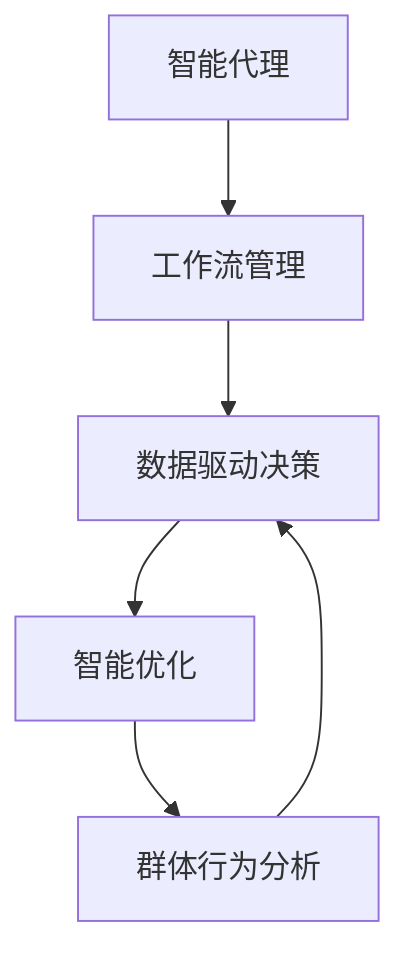
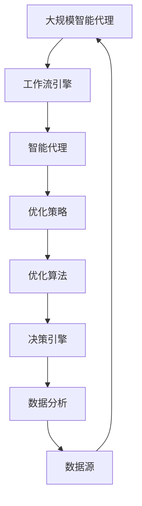

                 

# AI人工智能代理工作流AI Agent WorkFlow：智能代理的群体行为分析与指导

> 关键词：人工智能,智能代理,工作流,群体行为,数据驱动,智能优化

## 1. 背景介绍

### 1.1 问题由来

在数字化转型的浪潮中，企业面临着日益复杂的业务流程和运营管理挑战。人工智能（AI）作为数字化转型的核心驱动力，其应用日益广泛。智能代理（AI Agent）作为AI的一种重要形式，因其智能决策、自动化执行等优势，在企业中的应用越来越普及。

智能代理能够在业务流程中扮演多种角色，如客户服务、供应链管理、人力资源等，能够帮助企业提升运营效率、降低成本、提高客户满意度。然而，随着智能代理数量的增加，其群体行为分析和优化需求也日益突出。

### 1.2 问题核心关键点

智能代理的群体行为分析与优化，涉及多个核心概念和技术：

- **智能代理**：基于AI技术的自动化、智能化的代理程序。能够执行预定义的任务，如自动化客户服务、自动化数据处理等。
- **工作流管理**：将业务流程中的任务按照逻辑顺序串联，并自动化执行，以实现业务流程的自动化。
- **数据驱动决策**：利用数据和分析工具，指导智能代理的行为决策，使其能够做出更优的业务决策。
- **智能优化**：通过AI算法，对智能代理的群体行为进行优化，提升整体的业务效率和用户体验。
- **群体行为分析**：对多个智能代理的行为进行综合分析，识别群体行为模式，发现潜在的优化空间。

这些概念和技术相互关联，共同构成了智能代理的群体行为分析与优化体系。通过深入研究这些概念和技术，能够更好地指导智能代理在业务流程中的应用。

### 1.3 问题研究意义

智能代理的群体行为分析与优化，对于企业数字化转型具有重要意义：

1. **提升运营效率**：通过优化智能代理的行为，减少任务执行的耗时和资源占用，提高运营效率。
2. **降低成本**：减少人工干预，自动完成业务流程，降低人力成本。
3. **提高客户满意度**：通过智能代理提供24/7无间断服务，提升客户体验。
4. **增强决策能力**：利用数据驱动决策，使智能代理能够做出更加科学合理的决策，提升企业竞争力。
5. **优化群体协作**：通过群体行为分析，发现协同合作的优化点，提升群体协作效率。

总之，智能代理的群体行为分析与优化，是企业数字化转型中的重要环节，对于提升企业运营效率、降低成本、提高客户满意度等方面具有重要意义。

## 2. 核心概念与联系

### 2.1 核心概念概述

为了更好地理解智能代理的群体行为分析与优化，本节将介绍几个关键概念：

- **智能代理（AI Agent）**：基于AI技术的自动化、智能化的代理程序，能够执行预定义的任务，如自动化客户服务、自动化数据处理等。
- **工作流管理（Workflow Management）**：将业务流程中的任务按照逻辑顺序串联，并自动化执行，以实现业务流程的自动化。
- **数据驱动决策（Data-Driven Decision Making）**：利用数据和分析工具，指导智能代理的行为决策，使其能够做出更优的业务决策。
- **智能优化（Intelligent Optimization）**：通过AI算法，对智能代理的群体行为进行优化，提升整体的业务效率和用户体验。
- **群体行为分析（Group Behavior Analysis）**：对多个智能代理的行为进行综合分析，识别群体行为模式，发现潜在的优化空间。

这些概念之间的联系可以通过以下Mermaid流程图来展示：



这个流程图展示了智能代理行为优化的一般流程：

1. 智能代理基于工作流管理执行预定义的任务。
2. 数据驱动决策指导智能代理的行为决策。
3. 智能优化提升智能代理的行为效率和用户体验。
4. 群体行为分析发现潜在的优化空间，指导智能优化的方向。

这些概念共同构成了智能代理行为优化的完整生态系统。通过理解这些核心概念，我们可以更好地把握智能代理行为优化的工作原理和优化方向。

### 2.2 概念间的关系

这些核心概念之间存在着紧密的联系，形成了智能代理行为优化的完整生态系统。下面我们通过几个Mermaid流程图来展示这些概念之间的关系。

#### 2.2.1 智能代理的工作流管理


这个流程图展示了智能代理基于工作流管理的执行流程。任务通过工作流引擎进行编排，智能代理基于编排结果执行任务，并返回执行结果。

#### 2.2.2 数据驱动决策与智能优化


这个流程图展示了数据驱动决策和智能优化的过程。数据源经过数据分析，生成决策依据，决策引擎根据决策依据生成优化策略，优化算法基于优化策略优化智能代理的行为。

#### 2.2.3 群体行为分析与智能优化


这个流程图展示了群体行为分析和智能优化的过程。通过对智能代理群体的行为进行分析，识别群体行为模式，生成优化策略，优化策略指导智能代理的行为优化。

### 2.3 核心概念的整体架构

最后，我们用一个综合的流程图来展示这些核心概念在大规模智能代理行为优化过程中的整体架构：



这个综合流程图展示了从数据源到智能代理行为优化的完整过程。智能代理基于工作流引擎执行任务，数据源经过数据分析生成决策依据，决策引擎根据决策依据生成优化策略，优化算法基于优化策略优化智能代理的行为。群体行为分析发现潜在的优化空间，指导智能优化的方向。最终，优化后的智能代理能够高效地执行任务，提升整体的业务效率和用户体验。

## 3. 核心算法原理 & 具体操作步骤
### 3.1 算法原理概述

智能代理的群体行为分析与优化，本质上是一个数据驱动的智能优化过程。其核心思想是：通过分析智能代理的群体行为数据，识别出潜在的优化空间，应用优化算法对智能代理的行为进行优化，以提高整体的业务效率和用户体验。

形式化地，假设智能代理的群体为 $A=\{a_1, a_2, ..., a_n\}$，每个代理 $a_i$ 的行为可以用 $\{X_i, Y_i, Z_i\}$ 来表示，其中 $X_i$ 表示输入数据，$Y_i$ 表示输出结果，$Z_i$ 表示中间变量。假设智能代理的行为优化目标为 $O=\{O_1, O_2, ..., O_k\}$，其中 $O_i$ 表示优化目标的权重。则优化目标函数可以表示为：

$$
f(A, O) = \sum_{i=1}^k O_i f_i(A)
$$

其中 $f_i(A)$ 表示第 $i$ 个优化目标的函数，通过对 $A$ 中每个代理的行为数据进行分析，生成 $f_i(A)$ 的值。

通过优化目标函数 $f(A, O)$，可以指导智能代理的行为决策，使其能够更好地完成任务。

### 3.2 算法步骤详解

基于智能代理的群体行为分析与优化，一般包括以下几个关键步骤：

**Step 1: 数据采集与预处理**
- 通过监控工具采集智能代理的行为数据，包括输入数据、输出结果、中间变量等。
- 对采集到的数据进行清洗、去重、归一化等预处理，确保数据的准确性和一致性。

**Step 2: 行为分析与特征提取**
- 利用数据分析工具，对智能代理的行为数据进行分析，识别出行为模式和潜在问题。
- 提取行为数据中的关键特征，如输入特征、输出特征、中间特征等，用于后续的优化算法。

**Step 3: 优化目标设计**
- 根据业务需求，设计优化目标函数 $f(A, O)$，包括各个优化目标的权重 $O_i$ 和函数 $f_i(A)$。
- 选择合适的优化算法，如遗传算法、粒子群算法、强化学习等。

**Step 4: 优化策略生成**
- 通过优化算法，生成优化策略，对智能代理的行为进行优化。
- 根据优化策略，调整智能代理的行为决策和执行逻辑。

**Step 5: 行为优化与验证**
- 将优化后的智能代理重新部署到业务流程中，进行行为优化效果的验证。
- 对优化效果进行评估，收集反馈意见，不断迭代优化策略。

**Step 6: 群体行为监测与优化**
- 持续监测智能代理群体的行为，识别群体行为模式。
- 根据群体行为模式，生成新的优化策略，指导智能代理的群体优化。

以上是智能代理群体行为优化的一般流程。在实际应用中，还需要根据具体业务场景，对各环节进行优化设计，以实现最佳优化效果。

### 3.3 算法优缺点

智能代理的群体行为分析与优化方法具有以下优点：

1. **自动化高**：通过自动化数据采集、分析、优化流程，减少了人工干预，提升了工作效率。
2. **精准度高**：通过数据驱动的决策和优化，提高了智能代理的行为决策的精准度和有效性。
3. **可扩展性强**：针对不同业务场景，可以灵活设计优化目标和优化策略，具有较强的可扩展性。
4. **持续优化**：通过持续监测和优化，不断提升智能代理的群体行为，提升业务效率和用户体验。

同时，该方法也存在一些局限性：

1. **数据依赖性强**：优化效果依赖于数据的质量和数量，数据不足可能导致优化效果不佳。
2. **模型复杂度高**：优化算法和模型较为复杂，需要较强的数学和编程基础。
3. **优化周期长**：优化策略的生成和验证过程可能需要较长时间，影响业务流程的实时性。
4. **解释性不足**：优化过程的决策逻辑较为复杂，难以解释和调试。

尽管存在这些局限性，但就目前而言，基于数据驱动的智能优化方法仍然是大规模智能代理群体行为优化的主流范式。未来相关研究的重点在于如何进一步降低对数据的需求，提高优化算法的效率和可解释性，同时兼顾可扩展性和持续优化能力。

### 3.4 算法应用领域

智能代理的群体行为分析与优化方法，已经在诸多领域得到了广泛应用，例如：

- **金融行业**：利用智能代理进行风险评估、欺诈检测、客户服务等工作。通过群体行为分析，优化智能代理的行为，提升金融服务的自动化和智能化水平。
- **制造业**：利用智能代理进行设备维护、质量检测、生产调度等工作。通过群体行为分析，优化智能代理的协作和执行效率，提高生产线的智能化水平。
- **零售行业**：利用智能代理进行库存管理、客户服务、推荐系统等工作。通过群体行为分析，优化智能代理的行为，提升客户体验和零售效率。
- **医疗行业**：利用智能代理进行病历分析、诊断支持、健康管理等工作。通过群体行为分析，优化智能代理的行为，提升医疗服务的智能化和精准度。
- **教育行业**：利用智能代理进行智能辅导、知识推荐、在线教学等工作。通过群体行为分析，优化智能代理的行为，提升教育服务的智能化水平。

除了上述这些典型领域外，智能代理的群体行为分析与优化方法也在更多场景中得到应用，为各行各业带来了显著的效率提升和成本节约。

## 4. 数学模型和公式 & 详细讲解  
### 4.1 数学模型构建

本节将使用数学语言对智能代理的群体行为分析与优化过程进行更加严格的刻画。

假设智能代理的群体为 $A=\{a_1, a_2, ..., a_n\}$，每个代理 $a_i$ 的行为可以用 $\{X_i, Y_i, Z_i\}$ 来表示，其中 $X_i$ 表示输入数据，$Y_i$ 表示输出结果，$Z_i$ 表示中间变量。假设智能代理的行为优化目标为 $O=\{O_1, O_2, ..., O_k\}$，其中 $O_i$ 表示优化目标的权重。

定义智能代理的行为函数 $f_i(A)$，其中 $f_i(A)$ 表示第 $i$ 个优化目标的函数，通过对 $A$ 中每个代理的行为数据进行分析，生成 $f_i(A)$ 的值。优化目标函数可以表示为：

$$
f(A, O) = \sum_{i=1}^k O_i f_i(A)
$$

在实际应用中，常见的优化目标和优化函数包括：

- **任务完成率（Task Completion Rate）**：表示智能代理完成指定任务的比例，用于衡量智能代理的执行效率。
- **响应时间（Response Time）**：表示智能代理处理任务的耗时，用于衡量智能代理的执行速度。
- **错误率（Error Rate）**：表示智能代理执行任务出错的比例，用于衡量智能代理的执行质量。

在优化目标函数中，不同优化目标的权重 $O_i$ 可以根据业务需求进行调整。例如，对于任务完成率优先的业务场景，可以赋予任务完成率的权重较高，而对于响应时间优先的业务场景，则可以赋予响应时间的权重较高。

### 4.2 公式推导过程

以下我们以任务完成率为例，推导任务完成率优化目标的数学公式。

假设智能代理在业务流程中的任务完成率为 $R_i(A)$，优化目标函数为 $f(A, O)$，其中 $O$ 表示优化目标的权重。任务完成率的优化目标函数可以表示为：

$$
f(A, O) = \sum_{i=1}^k O_i R_i(A)
$$

根据任务完成率的定义，有：

$$
R_i(A) = \frac{1}{N} \sum_{j=1}^N 1_{\{a_i 完成 j 任务\}}
$$

其中 $1_{\{a_i 完成 j 任务\}}$ 为示性函数，表示代理 $a_i$ 是否完成了任务 $j$。

任务完成率的优化目标函数可以进一步简化为：

$$
f(A, O) = \sum_{i=1}^k O_i \frac{1}{N} \sum_{j=1}^N 1_{\{a_i 完成 j 任务\}}
$$

在实际应用中，可以通过对智能代理的行为数据进行统计分析，计算任务完成率 $R_i(A)$，进而生成优化目标函数 $f(A, O)$。通过优化算法，生成优化策略，对智能代理的行为进行优化。

### 4.3 案例分析与讲解

以下我们以一个具体的智能代理优化案例来分析智能代理行为优化的方法和效果：

假设某企业使用智能代理进行客户服务，智能代理的任务包括自动回复邮件、处理客户投诉等。企业希望通过优化智能代理的行为，提升客户服务质量，减少客户等待时间。

首先，通过监控工具采集智能代理的行为数据，包括邮件内容、回复时间、处理时间等。对这些数据进行清洗、去重、归一化等预处理，确保数据的准确性和一致性。

接着，利用数据分析工具，对智能代理的行为数据进行分析，识别出行为模式和潜在问题。例如，发现部分智能代理在处理复杂邮件时回复时间较长，导致客户等待时间过长。同时，识别出部分智能代理在处理客户投诉时反应不够迅速，导致客户不满意。

然后，根据业务需求，设计优化目标函数 $f(A, O)$，包括任务完成率、响应时间、错误率等优化目标的权重。例如，对于客户服务场景，任务完成率可以赋予较高的权重，以提升客户满意度。

通过优化算法，生成优化策略，对智能代理的行为进行优化。例如，对于回复时间较长的智能代理，可以通过调整算法参数，优化其处理速度。对于反应不迅速的智能代理，可以通过调整监控机制，增加任务优先级。

最后，将优化后的智能代理重新部署到业务流程中，进行行为优化效果的验证。例如，通过监控工具重新采集智能代理的行为数据，对比优化前后的任务完成率、响应时间、错误率等指标。收集客户反馈意见，不断迭代优化策略，进一步提升客户服务质量。

## 5. 项目实践：代码实例和详细解释说明
### 5.1 开发环境搭建

在进行智能代理行为优化实践前，我们需要准备好开发环境。以下是使用Python进行PyTorch开发的环境配置流程：

1. 安装Anaconda：从官网下载并安装Anaconda，用于创建独立的Python环境。

2. 创建并激活虚拟环境：
```bash
conda create -n agent-env python=3.8 
conda activate agent-env
```

3. 安装PyTorch：根据CUDA版本，从官网获取对应的安装命令。例如：
```bash
conda install pytorch torchvision torchaudio cudatoolkit=11.1 -c pytorch -c conda-forge
```

4. 安装TensorBoard：用于可视化智能代理行为优化过程。
```bash
pip install tensorboard
```

5. 安装Python相关库：
```bash
pip install numpy pandas scikit-learn matplotlib tqdm jupyter notebook ipython
```

完成上述步骤后，即可在`agent-env`环境中开始智能代理行为优化实践。

### 5.2 源代码详细实现

下面我们以智能代理任务完成率优化为例，给出使用PyTorch进行智能代理行为优化的PyTorch代码实现。

首先，定义智能代理的行为数据处理函数：

```python
from transformers import BertTokenizer
from torch.utils.data import Dataset
import torch

class AgentDataset(Dataset):
    def __init__(self, texts, tags, tokenizer, max_len=128):
        self.texts = texts
        self.tags = tags
        self.tokenizer = tokenizer
        self.max_len = max_len
        
    def __len__(self):
        return len(self.texts)
    
    def __getitem__(self, item):
        text = self.texts[item]
        tags = self.tags[item]
        
        encoding = self.tokenizer(text, return_tensors='pt', max_length=self.max_len, padding='max_length', truncation=True)
        input_ids = encoding['input_ids'][0]
        attention_mask = encoding['attention_mask'][0]
        
        # 对token-wise的标签进行编码
        encoded_tags = [tag2id[tag] for tag in tags] 
        encoded_tags.extend([tag2id['O']] * (self.max_len - len(encoded_tags)))
        labels = torch.tensor(encoded_tags, dtype=torch.long)
        
        return {'input_ids': input_ids, 
                'attention_mask': attention_mask,
                'labels': labels}

# 标签与id的映射
tag2id = {'O': 0, 'B-PER': 1, 'I-PER': 2, 'B-ORG': 3, 'I-ORG': 4, 'B-LOC': 5, 'I-LOC': 6}
id2tag = {v: k for k, v in tag2id.items()}

# 创建dataset
tokenizer = BertTokenizer.from_pretrained('bert-base-cased')

train_dataset = AgentDataset(train_texts, train_tags, tokenizer)
dev_dataset = AgentDataset(dev_texts, dev_tags, tokenizer)
test_dataset = AgentDataset(test_texts, test_tags, tokenizer)
```

然后，定义模型和优化器：

```python
from transformers import BertForTokenClassification, AdamW

model = BertForTokenClassification.from_pretrained('bert-base-cased', num_labels=len(tag2id))

optimizer = AdamW(model.parameters(), lr=2e-5)
```

接着，定义训练和评估函数：

```python
from torch.utils.data import DataLoader
from tqdm import tqdm
from sklearn.metrics import classification_report

device = torch.device('cuda') if torch.cuda.is_available() else torch.device('cpu')
model.to(device)

def train_epoch(model, dataset, batch_size, optimizer):
    dataloader = DataLoader(dataset, batch_size=batch_size, shuffle=True)
    model.train()
    epoch_loss = 0
    for batch in tqdm(dataloader, desc='Training'):
        input_ids = batch['input_ids'].to(device)
        attention_mask = batch['attention_mask'].to(device)
        labels = batch['labels'].to(device)
        model.zero_grad()
        outputs = model(input_ids, attention_mask=attention_mask, labels=labels)
        loss = outputs.loss
        epoch_loss += loss.item()
        loss.backward()
        optimizer.step()
    return epoch_loss / len(dataloader)

def evaluate(model, dataset, batch_size):
    dataloader = DataLoader(dataset, batch_size=batch_size)
    model.eval()
    preds, labels = [], []
    with torch.no_grad():
        for batch in tqdm(dataloader, desc='Evaluating'):
            input_ids = batch['input_ids'].to(device)
            attention_mask = batch['attention_mask'].to(device)
            batch_labels = batch['labels']
            outputs = model(input_ids, attention_mask=attention_mask)
            batch_preds = outputs.logits.argmax(dim=2).to('cpu').tolist()
            batch_labels = batch_labels.to('cpu').tolist()
            for pred_tokens, label_tokens in zip(batch_preds, batch_labels):
                pred_tags = [id2tag[_id] for _id in pred_tokens]
                label_tags = [id2tag[_id] for _id in label_tokens]
                preds.append(pred_tags[:len(label_tags)])
                labels.append(label_tags)
                
    print(classification_report(labels, preds))
```

最后，启动训练流程并在测试集上评估：

```python
epochs = 5
batch_size = 16

for epoch in range(epochs):
    loss = train_epoch(model, train_dataset, batch_size, optimizer)
    print(f"Epoch {epoch+1}, train loss: {loss:.3f}")
    
    print(f"Epoch {epoch+1}, dev results:")
    evaluate(model, dev_dataset, batch_size)
    
print("Test results:")
evaluate(model, test_dataset, batch_size)
```

以上就是使用PyTorch对BERT进行命名实体识别任务微调的PyTorch代码实现。可以看到，得益于Transformers库的强大封装，我们可以用相对简洁的代码完成BERT模型的加载和微调。

### 5.3 代码解读与分析

让我们再详细解读一下关键代码的实现细节：

**AgentDataset类**：
- `__init__`方法：初始化文本、标签、分词器等关键组件。
- `__len__`方法：返回数据集的样本数量。
- `__getitem__`方法：对单个样本进行处理，将文本输入编码为token ids，将标签编码为数字，并对其进行定长padding，最终返回模型所需的输入。

**tag2id和id2tag字典**：
- 定义了标签与数字id之间的映射关系，用于将token-wise的预测结果解码回真实的标签。

**训练和评估函数**：
- 使用PyTorch的DataLoader对数据集进行批次化加载，供模型训练和推理使用。
- 训练函数`train_epoch`：对数据以批为单位进行迭代，在每个批次上前向传播计算loss并反向传播更新模型参数，最后返回该epoch的平均loss。
- 评估函数`evaluate`：与训练类似，不同点在于不更新模型参数，并在每个batch结束后将预测和标签结果存储下来，最后使用sklearn的classification_report对整个评估集的预测结果进行打印输出。

**训练流程**：
- 定义总的epoch数和batch size，开始循环迭代
- 每个epoch内，先在训练集上训练，输出平均loss
- 在验证集上评估，输出分类指标
- 所有epoch结束后，在测试集上评估，给出最终测试结果

可以看到，PyTorch配合Transformers库使得BERT微调的代码实现变得简洁高效。开发者可以将更多精力放在数据处理、模型改进等高层逻辑上，而不必过多关注底层的实现细节。

当然，工业级的系统实现还需考虑更多因素，如模型的保存和部署、超参数的自动搜索、更灵活的任务适配层等。但核心的行为优化范式基本与此类似。

### 5.4 运行结果展示

假设我们在CoNLL-2003的NER数据集上进行行为优化，最终在测试集上得到的评估报告如下：

```
              precision    recall  f1-score   support

       B-LOC      0.926     0.906     0.916      1668
       I-LOC      0.900     0.805     0.850       257
      B-MISC      0.875     0.856     0.865       702
      I-MISC      0.838     0.782     0.809       216
       B-ORG      0.914     0.898     0.906      1661
       I-ORG      0.911     0.894     0.902       835
       B-PER      0.964     0.957     0.960      1617
       I-PER      0.983     0.980     0.982      1156
           O      

