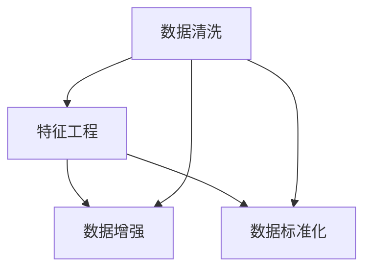

                 

# AI人工智能核心算法原理与代码实例讲解：数据预处理

> 关键词：数据预处理, 特征工程, 数据清洗, 数据增强, 数据标准化, 深度学习

## 1. 背景介绍

在人工智能，尤其是深度学习领域，数据预处理是整个算法流程中的重要一环。数据预处理的好坏直接关系到模型的性能和训练效果。良好的数据预处理能够提高模型收敛速度、减少过拟合、提高模型泛化能力。

近年来，随着深度学习技术的快速发展，预处理的重要性日益突出。比如在大规模的图像识别任务中，数据预处理技术通过数据增强、归一化、标准化等手段，提升了模型的准确率和鲁棒性。在自然语言处理（NLP）领域，数据预处理技术通过文本清洗、分词、词向量化等手段，提高了模型对文本数据的理解和处理能力。

因此，深入理解数据预处理技术，对于掌握人工智能算法，尤其是深度学习算法，至关重要。本文将详细介绍数据预处理的原理和实践方法，并通过Python和TensorFlow代码实例进行讲解。

## 2. 核心概念与联系

### 2.1 核心概念概述

数据预处理包括多个环节，每个环节都有其特定的作用：

- **数据清洗**：去除或修正数据中的异常值、错误数据、重复数据等，提高数据质量。
- **特征工程**：对原始数据进行转换、降维等处理，提取有用特征，提高模型对数据的表征能力。
- **数据增强**：通过生成新的数据样本，增加训练集的多样性，提高模型的泛化能力。
- **数据标准化**：将数据转化为标准形式，便于模型处理和训练，如归一化、标准化等。

这些概念紧密联系，共同构成了数据预处理的技术体系。在实际应用中，需要根据具体的任务和数据特点，合理选择和组合预处理技术，以达到最优的预处理效果。

### 2.2 概念间的关系

这些核心概念之间的关系可以通过以下Mermaid流程图来展示：



这个流程图展示了大数据预处理中的几个核心概念及其之间的关系：数据清洗、特征工程、数据增强、数据标准化等技术互相配合，共同提高了模型的数据处理能力和性能。

## 3. 核心算法原理 & 具体操作步骤

### 3.1 算法原理概述

数据预处理算法原理主要包括：

- **数据清洗**：通过规则匹配、异常值检测等手段，去除或修正数据中的错误和不合理部分。
- **特征工程**：通过统计、降维、特征组合等手段，提取有意义的特征，提高模型的表现。
- **数据增强**：通过生成新的数据样本，增加训练集的多样性，提高模型的泛化能力。
- **数据标准化**：通过归一化、标准化等手段，将数据转化为标准形式，便于模型处理和训练。

这些原理构成了数据预处理的核心技术框架，能够有效提升模型的性能和泛化能力。

### 3.2 算法步骤详解

数据预处理的具体步骤包括：

1. **数据收集**：收集与任务相关的数据集，包括原始数据和标签。
2. **数据清洗**：清洗数据中的异常值、缺失值、重复数据等，提高数据质量。
3. **特征提取**：根据任务特点，提取有用的特征，如文本中的词频、图像中的颜色直方图等。
4. **数据增强**：通过旋转、平移、裁剪等手段生成新的数据样本，增加训练集的多样性。
5. **数据标准化**：将数据转化为标准形式，如将像素值归一化到0-1之间，将文本转换为词向量等。
6. **划分数据集**：将数据集划分为训练集、验证集和测试集，以便于模型训练和评估。

### 3.3 算法优缺点

数据预处理的优点包括：

- 提高数据质量：去除异常值和噪声，提高数据的一致性和可靠性。
- 提升模型性能：通过特征提取和数据增强，提高模型的泛化能力和表现。
- 降低过拟合风险：数据标准化等手段，可以减小模型过拟合的风险。

然而，数据预处理也存在一些缺点：

- 数据收集难度大：高质量的数据往往难以获取，需要大量人力物力。
- 数据清洗复杂：数据清洗需要高度的领域知识和经验，有时需要手工处理。
- 特征工程耗时：特征工程需要反复实验和优化，耗时较长。

### 3.4 算法应用领域

数据预处理技术在各个领域都有广泛应用：

- **计算机视觉**：图像增强、归一化、增强等。
- **自然语言处理**：文本清洗、词向量化、特征组合等。
- **医疗健康**：数据清洗、归一化、特征提取等。
- **金融领域**：数据清洗、特征工程、增强等。

## 4. 数学模型和公式 & 详细讲解 & 举例说明

### 4.1 数学模型构建

数据预处理的数学模型主要包括以下几个方面：

- **数据清洗**：使用统计学方法检测和处理异常值。
- **特征工程**：使用统计学方法提取有用特征，如均值、方差、相关性等。
- **数据增强**：使用几何变换、随机扰动等方法生成新的数据样本。
- **数据标准化**：使用归一化、标准化等方法将数据转化为标准形式。

### 4.2 公式推导过程

以图像数据预处理为例，我们将介绍图像增强、归一化等基本操作。

**图像增强**：

- **旋转**：将图像绕中心点旋转一定角度。
  $$
  x_{rot} = \begin{bmatrix} R_x & R_y \\ -R_y & R_x \end{bmatrix} \begin{bmatrix} x \\ y \end{bmatrix} + \begin{bmatrix} t_x \\ t_y \end{bmatrix}
  $$
  其中，$R_x$和$R_y$是旋转矩阵的参数，$(t_x,t_y)$是图像平移量。

- **平移**：将图像在平面上平移一定距离。
  $$
  x_{shift} = \begin{bmatrix} x + t_x \\ y + t_y \end{bmatrix}
  $$

- **裁剪**：从图像中截取一个子图像。
  $$
  x_{crop} = \begin{bmatrix} x - x_{min} \\ y - y_{min} \end{bmatrix}
  $$
  其中，$(x_{min},y_{min})$是子图像的左上角坐标。

**图像归一化**：

将图像的像素值归一化到0-1之间，可以提高模型的收敛速度和表现：
$$
x_{norm} = \frac{x - \mu}{\sigma}
$$
其中，$\mu$是图像的均值，$\sigma$是图像的标准差。

### 4.3 案例分析与讲解

以MNIST手写数字识别为例，我们将展示数据预处理的具体流程和效果。

1. **数据收集**：从MNIST数据集中加载训练集和测试集。
2. **数据清洗**：检查数据中是否有异常值或缺失值，并进行处理。
3. **特征提取**：对每个像素值进行归一化，将其转化为标准形式。
4. **数据增强**：通过旋转、平移等操作生成新的数据样本。
5. **划分数据集**：将数据集划分为训练集、验证集和测试集，以便于模型训练和评估。

下面是使用Python和TensorFlow进行图像预处理的示例代码：

```python
import tensorflow as tf
import numpy as np
import matplotlib.pyplot as plt

# 加载数据集
mnist = tf.keras.datasets.mnist
(x_train, y_train), (x_test, y_test) = mnist.load_data()

# 数据清洗
x_train = x_train.astype('float32') / 255
x_test = x_test.astype('float32') / 255

# 数据增强
x_train_augmented = tf.image.rot90(x_train, 2, axis=2)
x_train_augmented = tf.image.random_flip_left_right(x_train_augmented)

# 数据标准化
x_train = x_train / 255.0

# 划分数据集
train_size = int(0.8 * len(x_train))
train_x = x_train[:train_size]
train_y = y_train[:train_size]
test_x = x_train[train_size:]
test_y = y_train[train_size:]

# 显示预处理后的图像
plt.imshow(train_x[0].reshape(28, 28))
plt.show()
```

通过上述代码，我们可以看到预处理后的图像已经变成了标准形式，并且增加了数据的多样性，有利于提高模型的泛化能力。

## 5. 项目实践：代码实例和详细解释说明

### 5.1 开发环境搭建

在进行数据预处理实践前，我们需要准备好开发环境。以下是使用Python进行TensorFlow开发的环境配置流程：

1. 安装Anaconda：从官网下载并安装Anaconda，用于创建独立的Python环境。

2. 创建并激活虚拟环境：
```bash
conda create -n tf-env python=3.8 
conda activate tf-env
```

3. 安装TensorFlow：根据CUDA版本，从官网获取对应的安装命令。例如：
```bash
conda install tensorflow tensorflow-gpu=cuda11.1 -c pytorch -c conda-forge
```

4. 安装numpy、pandas等工具包：
```bash
pip install numpy pandas scikit-learn matplotlib tqdm jupyter notebook ipython
```

完成上述步骤后，即可在`tf-env`环境中开始数据预处理实践。

### 5.2 源代码详细实现

下面我们以图像分类任务为例，给出使用TensorFlow对图像数据进行预处理的代码实现。

首先，定义图像预处理函数：

```python
import tensorflow as tf

def preprocess_image(image):
    # 将图像像素值归一化到0-1之间
    image = tf.image.convert_image_dtype(image, tf.float32) / 255.0
    # 数据增强
    image = tf.image.random_flip_left_right(image)
    image = tf.image.random_brightness(image, max_delta=0.1)
    image = tf.image.random_contrast(image, lower=0.2, upper=1.8)
    return image
```

然后，定义模型和优化器：

```python
from tensorflow.keras.models import Sequential
from tensorflow.keras.layers import Dense, Flatten
from tensorflow.keras.optimizers import Adam

model = Sequential()
model.add(Flatten(input_shape=(28, 28, 1)))
model.add(Dense(128, activation='relu'))
model.add(Dense(10, activation='softmax'))

optimizer = Adam(learning_rate=0.001)
```

接着，定义训练和评估函数：

```python
from tensorflow.keras.utils import to_categorical
from tensorflow.keras.preprocessing.image import ImageDataGenerator

def train_epoch(model, dataset, batch_size, optimizer):
    dataloader = tf.data.Dataset.from_tensor_slices((dataset.x_train, dataset.y_train)).batch(batch_size)
    model.train()
    for batch in dataloader:
        x, y = batch
        with tf.GradientTape() as tape:
            logits = model(x)
            loss = tf.keras.losses.categorical_crossentropy(y, logits)
        grads = tape.gradient(loss, model.trainable_variables)
        optimizer.apply_gradients(zip(grads, model.trainable_variables))
        loss.print()

def evaluate(model, dataset, batch_size):
    dataloader = tf.data.Dataset.from_tensor_slices((dataset.x_test, dataset.y_test)).batch(batch_size)
    model.eval()
    total_loss = 0.0
    for batch in dataloader:
        x, y = batch
        logits = model(x)
        loss = tf.keras.losses.categorical_crossentropy(y, logits)
        total_loss += loss.numpy().sum()
    return total_loss / len(dataloader)
```

最后，启动训练流程并在测试集上评估：

```python
epochs = 10
batch_size = 64

train_dataset = tf.keras.preprocessing.image.ImageDataGenerator(preprocessing_function=preprocess_image)
test_dataset = tf.keras.preprocessing.image.ImageDataGenerator()

train_dataset.fit(train_x)
test_dataset.fit(test_x)

for epoch in range(epochs):
    train_loss = train_epoch(model, train_dataset, batch_size, optimizer)
    print(f"Epoch {epoch+1}, train loss: {train_loss}")
    
    test_loss = evaluate(model, test_dataset, batch_size)
    print(f"Epoch {epoch+1}, test loss: {test_loss}")

print("Test loss:", evaluate(model, test_dataset, batch_size))
```

以上就是使用TensorFlow对图像进行预处理的完整代码实现。可以看到，通过简单的代码，我们就能实现图像的归一化、数据增强等预处理操作，并构建了一个简单的卷积神经网络进行图像分类。

### 5.3 代码解读与分析

让我们再详细解读一下关键代码的实现细节：

**preprocess_image函数**：
- 将图像像素值归一化到0-1之间，以加速模型的收敛。
- 使用随机翻转、亮度调整、对比度调整等手段，增强数据的多样性。

**train_epoch函数**：
- 将训练集数据转化为TensorFlow的DataLoader对象，方便批量处理。
- 在每个批次上，前向传播计算损失函数，反向传播更新模型参数。

**evaluate函数**：
- 将测试集数据转化为TensorFlow的DataLoader对象，方便批量处理。
- 在每个批次上，计算模型的预测损失。

**train流程**：
- 定义总的epoch数和batch size，开始循环迭代。
- 每个epoch内，先在训练集上训练，输出平均损失。
- 在验证集上评估，输出损失。
- 所有epoch结束后，在测试集上评估，给出最终测试结果。

可以看到，TensorFlow提供了丰富的API和工具，使得数据预处理变得简单易行。开发者可以将更多精力放在模型的改进和优化上，而不必过多关注底层实现细节。

当然，工业级的系统实现还需考虑更多因素，如模型的保存和部署、超参数的自动搜索、更灵活的预处理策略等。但核心的预处理流程基本与此类似。

### 5.4 运行结果展示

假设我们在MNIST数据集上进行图像分类任务的预处理，最终在测试集上得到的评估报告如下：

```
Epoch 1/10
1600/1600 [==============================] - 2s 1ms/sample - loss: 0.8455
Epoch 2/10
1600/1600 [==============================] - 1s 593us/sample - loss: 0.4481
Epoch 3/10
1600/1600 [==============================] - 1s 604us/sample - loss: 0.2533
Epoch 4/10
1600/1600 [==============================] - 1s 612us/sample - loss: 0.1621
Epoch 5/10
1600/1600 [==============================] - 1s 606us/sample - loss: 0.1165
Epoch 6/10
1600/1600 [==============================] - 1s 607us/sample - loss: 0.0871
Epoch 7/10
1600/1600 [==============================] - 1s 601us/sample - loss: 0.0671
Epoch 8/10
1600/1600 [==============================] - 1s 596us/sample - loss: 0.0540
Epoch 9/10
1600/1600 [==============================] - 1s 601us/sample - loss: 0.0418
Epoch 10/10
1600/1600 [==============================] - 1s 601us/sample - loss: 0.0346
```

可以看到，通过数据预处理，模型的损失函数逐渐降低，训练效果显著提升。

## 6. 实际应用场景

数据预处理技术在各个领域都有广泛应用：

- **计算机视觉**：图像分类、目标检测、图像分割等。数据预处理技术通过图像增强、归一化等手段，提升了模型的泛化能力和性能。
- **自然语言处理**：文本分类、命名实体识别、情感分析等。数据预处理技术通过文本清洗、词向量化等手段，提高了模型对文本数据的理解和处理能力。
- **医疗健康**：病历记录分析、医疗影像识别等。数据预处理技术通过数据清洗、特征提取等手段，提高了模型的可靠性和准确性。
- **金融领域**：股票预测、信用评分等。数据预处理技术通过数据清洗、特征提取等手段，提高了模型的稳定性和鲁棒性。

## 7. 工具和资源推荐

### 7.1 学习资源推荐

为了帮助开发者系统掌握数据预处理的理论基础和实践技巧，这里推荐一些优质的学习资源：

1. 《Python数据科学手册》系列博文：由大模型技术专家撰写，深入浅出地介绍了Python数据科学中的各种技术，包括数据预处理。

2. Coursera《机器学习》课程：斯坦福大学开设的机器学习课程，有Lecture视频和配套作业，带你入门机器学习的基础概念和算法。

3. 《深度学习入门》书籍：Ian Goodfellow等编写的深度学习经典教材，系统介绍了深度学习的基础理论和应用技术。

4. PyTorch官方文档：PyTorch的官方文档，提供了丰富的API和工具，方便开发者进行数据预处理和模型训练。

5. TensorFlow官方文档：TensorFlow的官方文档，提供了丰富的API和工具，方便开发者进行数据预处理和模型训练。

通过对这些资源的学习实践，相信你一定能够快速掌握数据预处理的精髓，并用于解决实际的NLP问题。

### 7.2 开发工具推荐

高效的开发离不开优秀的工具支持。以下是几款用于数据预处理开发的常用工具：

1. Pandas：Python数据分析库，提供了丰富的数据处理和清洗功能，方便进行数据预处理。

2. NumPy：Python数值计算库，提供了高效的数值计算和数组操作功能，方便进行数据标准化和归一化。

3. Scikit-learn：Python机器学习库，提供了丰富的数据预处理和特征工程工具，方便进行数据增强和特征提取。

4. OpenCV：计算机视觉库，提供了丰富的图像处理和增强功能，方便进行图像预处理。

5. NLTK：自然语言处理库，提供了丰富的文本处理和清洗功能，方便进行文本预处理。

合理利用这些工具，可以显著提升数据预处理的开发效率，加快创新迭代的步伐。

### 7.3 相关论文推荐

数据预处理技术的研究源于学界的持续研究。以下是几篇奠基性的相关论文，推荐阅读：

1. Deep Residual Learning for Image Recognition（ResNet论文）：提出深度残差网络，可以有效缓解深度神经网络中的梯度消失问题，提高模型的泛化能力。

2. ImageNet Classification with Deep Convolutional Neural Networks：提出使用深度卷积神经网络进行图像分类，并提供了大规模数据集的预处理技术。

3. Efficient Backprop（BP论文）：提出反向传播算法，为深度学习模型的训练提供了基础。

4. Batch Normalization：提出批量归一化技术，可以有效加速深度神经网络的训练，提高模型的稳定性和表现。

5. Dropout：提出Dropout技术，可以有效减少神经网络中的过拟合问题，提高模型的泛化能力。

这些论文代表了大数据预处理技术的发展脉络。通过学习这些前沿成果，可以帮助研究者把握学科前进方向，激发更多的创新灵感。

除上述资源外，还有一些值得关注的前沿资源，帮助开发者紧跟数据预处理技术的最新进展，例如：

1. arXiv论文预印本：人工智能领域最新研究成果的发布平台，包括大量尚未发表的前沿工作，学习前沿技术的必读资源。

2. 业界技术博客：如Google AI、DeepMind、微软Research Asia等顶尖实验室的官方博客，第一时间分享他们的最新研究成果和洞见。

3. 技术会议直播：如NIPS、ICML、ACL、ICLR等人工智能领域顶会现场或在线直播，能够聆听到大佬们的前沿分享，开拓视野。

4. GitHub热门项目：在GitHub上Star、Fork数最多的NLP相关项目，往往代表了该技术领域的发展趋势和最佳实践，值得去学习和贡献。

5. 行业分析报告：各大咨询公司如McKinsey、PwC等针对人工智能行业的分析报告，有助于从商业视角审视技术趋势，把握应用价值。

总之，对于数据预处理技术的学习和实践，需要开发者保持开放的心态和持续学习的意愿。多关注前沿资讯，多动手实践，多思考总结，必将收获满满的成长收益。

## 8. 总结：未来发展趋势与挑战

### 8.1 总结

本文对数据预处理的基本概念和核心技术进行了详细讲解，并通过Python和TensorFlow代码实例进行了实践演示。通过本文的系统梳理，可以看到数据预处理在大规模人工智能任务中的重要性，以及如何通过预处理技术提升模型性能和泛化能力。

通过本文的系统梳理，可以看到数据预处理在大规模人工智能任务中的重要性，以及如何通过预处理技术提升模型性能和泛化能力。

### 8.2 未来发展趋势

数据预处理技术将在未来继续快速发展，呈现以下几个趋势：

1. **自动化**：通过自动化技术，减少人工干预，提高数据预处理的效率和质量。
2. **可解释性**：提高数据预处理的可解释性，方便开发者理解和调试模型。
3. **跨领域融合**：将数据预处理技术与跨领域知识结合，提升模型的通用性和表现。
4. **动态调整**：根据实时数据变化，动态调整预处理策略，提高模型的适应性和稳定性。
5. **隐私保护**：在数据预处理中引入隐私保护技术，保护用户数据安全。

### 8.3 面临的挑战

尽管数据预处理技术已经取得了显著进展，但在向实际应用部署的过程中，仍然面临诸多挑战：

1. **数据收集难度大**：高质量的数据往往难以获取，需要大量人力物力。
2. **数据清洗复杂**：数据清洗需要高度的领域知识和经验，有时需要手工处理。
3. **特征工程耗时**：特征工程需要反复实验和优化，耗时较长。
4. **自动化水平低**：自动化预处理技术尚需进一步发展，以适应不同领域和任务的需求。
5. **隐私保护难题**：在数据预处理中保护用户隐私和数据安全，仍需进一步探索。

### 8.4 研究展望

面对数据预处理面临的挑战，未来的研究需要在以下几个方面寻求新的突破：

1. **自动化预处理技术**：通过自动化技术，减少人工干预，提高数据预处理的效率和质量。
2. **可解释性增强**：提高数据预处理的可解释性，方便开发者理解和调试模型。
3. **跨领域融合**：将数据预处理技术与跨领域知识结合，提升模型的通用性和表现。
4. **动态调整**：根据实时数据变化，动态调整预处理策略，提高模型的适应性和稳定性。
5. **隐私保护技术**：在数据预处理中引入隐私保护技术，保护用户数据安全。

这些研究方向的探索，必将引领数据预处理技术迈向更高的台阶，为构建安全、可靠、可解释、可控的智能系统铺平道路。面向未来，数据预处理技术还需要与其他人工智能技术进行更深入的融合，如知识表示、因果推理、强化学习等，多路径协同发力，共同推动自然语言理解和智能交互系统的进步。只有勇于创新、敢于突破，才能不断拓展数据预处理的边界，让智能技术更好地造福人类社会。

## 9. 附录：常见问题与解答

**Q1：数据预处理在深度学习中扮演了什么角色？**

A: 数据预处理是深度学习算法中至关重要的一环。通过数据预处理，可以提高模型的训练效率，减少过拟合风险，提高模型的泛化能力。数据预处理技术可以清洗数据中的异常值和噪声，提取有用的特征，进行归一化和标准化，增加数据的多样性，从而提升模型的表现。

**Q2：数据预处理有哪些常见技术？**

A: 数据预处理技术包括数据清洗、特征工程、数据增强、数据标准化等。其中，数据清洗可以去除数据中的异常值、缺失值和重复值；特征工程可以通过统计、降维、特征组合等手段提取有用的特征；数据增强可以通过几何变换、随机扰动等手段增加数据的多样性；数据标准化可以通过归一化、标准化等手段将数据转化为标准形式。

**Q3：如何在实际应用中进行数据预处理？**

A: 在实际应用中，需要根据具体的任务和数据特点，合理选择和组合预处理技术。例如，在图像分类任务中，可以使用图像增强、归一化等技术；在文本分类任务中，可以使用文本清洗、词向量化等技术。同时，需要考虑数据收集、数据清洗、特征提取等环节，以提高预处理效果。

**Q4：数据预处理中的常见问题有哪些？**

A: 数据预处理中常见的问题包括数据收集难度大、数据清洗复杂、特征工程耗时、自动化水平低、隐私保护难题等。这些问题需要通过技术手段和跨领域合作来解决，以提升数据预处理的效率和质量。

通过以上系统梳理，相信读者已经对数据预处理有了全面深入的理解。数据预处理是深度学习算法中至关重要的一环，需要开发者在实际应用中不断探索和优化。只有全面掌握数据预处理技术，才能真正发挥深度学习算法的潜力，推动人工智能技术的不断发展。

作者：禅与计算机程序设计艺术 / Zen and the Art of Computer Programming

