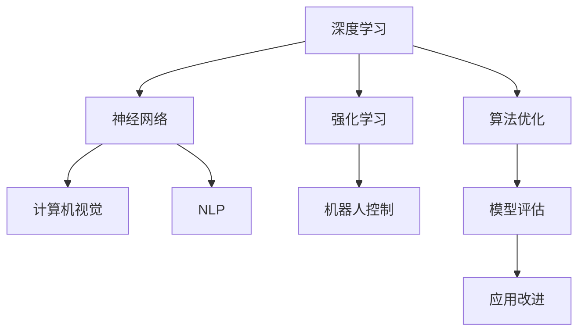
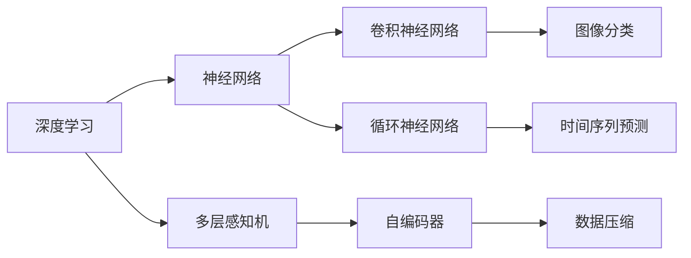
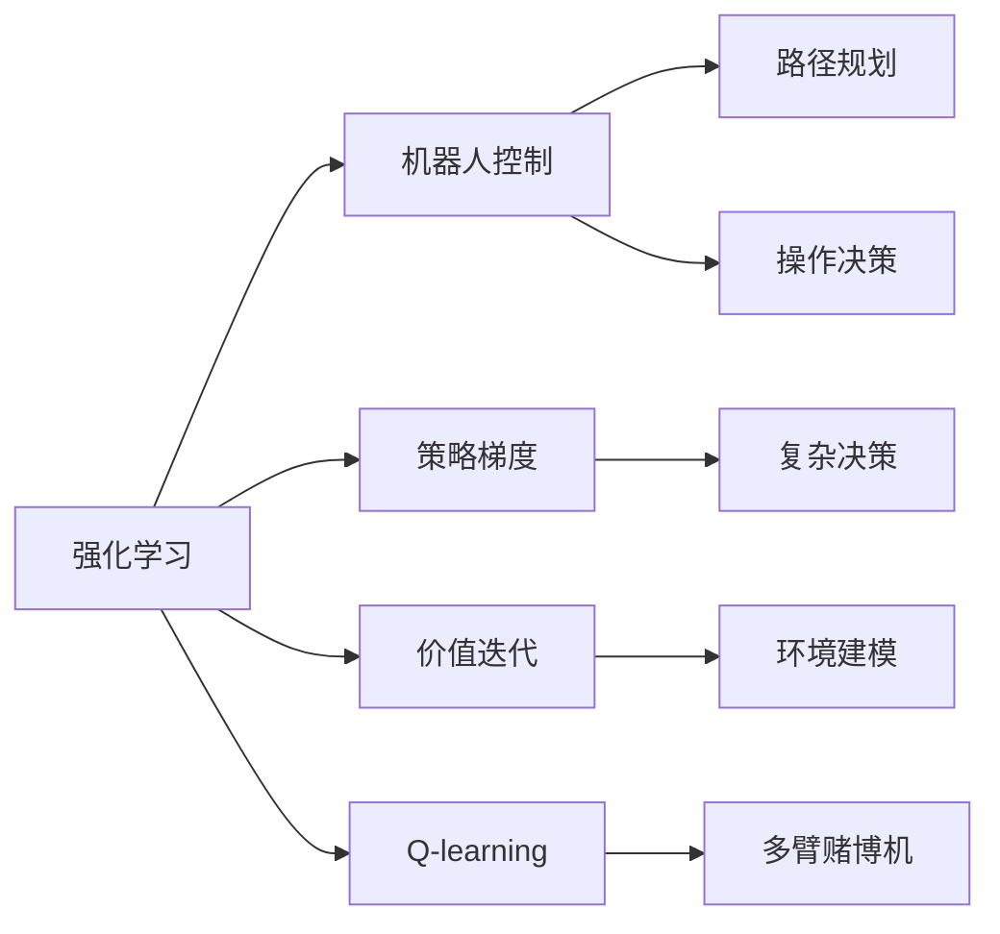
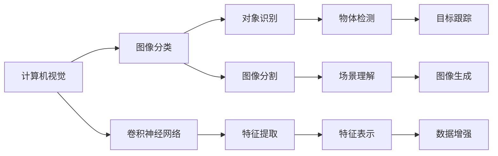
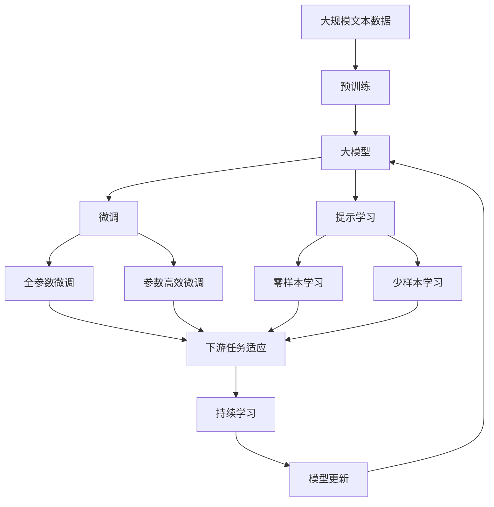

                 

# AI人工智能核心算法原理与代码实例讲解：智能系统

> 关键词：
- 人工智能
- 核心算法
- 智能系统
- 深度学习
- 神经网络
- 强化学习
- 计算机视觉
- 自然语言处理
- 算法优化
- 模型评估

## 1. 背景介绍

### 1.1 问题由来
人工智能（Artificial Intelligence，简称AI）作为一项前沿科技，其核心在于使机器能够模拟、延伸并扩展人类智能。当前，人工智能已经在诸多领域落地应用，诸如计算机视觉、自然语言处理、语音识别、推荐系统等。而AI的核心驱动力之一是算法与模型的创新，通过不断优化与优化，使得机器能够实现复杂而高效的智能化处理。

近年来，深度学习（Deep Learning）作为AI的基石，在算法与模型方面取得了巨大进展。它通过模拟人类大脑的结构，使得计算机能够学习数据的内在规律，识别并提取有价值的信息。在这一过程中，AI算法扮演了至关重要的角色。算法不仅是模型搭建的骨架，更是智能系统优化的动力源泉。

本文将重点讲解几种核心AI算法原理，并通过代码实例，展示其具体应用与优化。希望通过本文，读者能够深入理解这些算法的原理，并能够将其应用到实际项目中，推动智能系统的构建与优化。

## 2. 核心概念与联系

### 2.1 核心概念概述
为了更好地理解AI算法的核心原理与应用，本节将介绍几个关键概念：

- **深度学习（Deep Learning）**：一种模拟人脑神经网络结构的学习算法，通过多层非线性变换，提取数据特征，进而实现分类、回归、生成等任务。
- **神经网络（Neural Network）**：深度学习的核心组件，由多层神经元组成，每层接收前一层的输出作为输入，通过参数学习实现特征提取与建模。
- **强化学习（Reinforcement Learning）**：一种通过奖励反馈来优化决策策略的学习算法，常用于游戏、机器人控制等领域。
- **计算机视觉（Computer Vision）**：将计算机视觉算法应用于图像与视频处理，实现对象识别、场景理解等任务。
- **自然语言处理（Natural Language Processing, NLP）**：处理和理解人类语言的能力，包括文本分类、情感分析、机器翻译等任务。
- **算法优化**：通过对算法进行优化，提升模型精度、降低计算复杂度，使得AI系统更加高效、稳定。

这些核心概念通过Mermaid流程图连接，展示了它们之间的关系：



### 2.2 概念间的关系

这些核心概念之间存在紧密的联系，形成了AI算法与模型应用的完整框架。下面，我们通过几个Mermaid流程图来展示这些概念之间的关系：

#### 2.2.1 深度学习与神经网络的关系



此流程图展示了深度学习通过不同的神经网络结构（如多层感知机、卷积神经网络、循环神经网络等）实现不同任务的原理。

#### 2.2.2 强化学习与机器人控制的关系



此流程图展示了强化学习如何通过策略梯度、价值迭代、Q-learning等算法，实现机器人控制中的路径规划与操作决策。

#### 2.2.3 计算机视觉与图像分类



此流程图展示了计算机视觉如何通过卷积神经网络等技术，实现图像分类、对象识别、场景理解等任务。

#### 2.2.4 自然语言处理与文本分类

```mermaid
graph LR
    A[NLP] --> B[文本分类]
    A --> C[循环神经网络]
    A --> D[Transformer模型]
    B --> E[情感分析]
    B --> F[问答系统]
    C --> G[序列建模]
    D --> H[机器翻译]
    E --> I[情绪识别]
    F --> J[知识图谱]
    G --> K[文本生成]
    H --> L[自动摘要]
    I --> M[用户意图识别]
    J --> N[关系抽取]
    K --> O[文本补全]
    L --> P[对话系统]
    M --> Q[意图分类]
    N --> R[信息抽取]
    O --> S[内容推荐]
    P --> T[智能客服]
    Q --> U[意图推理]
    R --> V[实体识别]
    S --> W[个性化推荐]
    T --> X[语音识别]
    U --> Y[意图转换]
    V --> Z[命名实体识别]
    W --> $[推荐算法]
    X --> [智能对话]
    Y --> [意图转换]
    Z --> [命名实体识别]
```

此流程图展示了自然语言处理如何通过循环神经网络、Transformer模型等技术，实现文本分类、情感分析、机器翻译等任务。

### 2.3 核心概念的整体架构

最后，我们用一个综合的流程图来展示这些核心概念在大模型微调过程中的整体架构：



这个综合流程图展示了从预训练到微调，再到持续学习的完整过程。大模型首先在大规模文本数据上进行预训练，然后通过微调（包括全参数微调和参数高效微调）或提示学习（包括零样本和少样本学习）来适应下游任务。最后，通过持续学习技术，模型可以不断更新和适应新的任务和数据。 通过这些流程图，我们可以更清晰地理解AI算法的核心概念及其相互关系，为后续深入讨论具体的算法实现奠定基础。

## 3. 核心算法原理 & 具体操作步骤
### 3.1 算法原理概述

AI的核心算法原理主要涉及深度学习、强化学习、计算机视觉和自然语言处理等多个领域。本文将重点讲解其中三种核心算法：卷积神经网络（CNN）、循环神经网络（RNN）和Transformer模型。

### 3.2 算法步骤详解

#### 3.2.1 卷积神经网络（CNN）

卷积神经网络是计算机视觉领域的基础算法之一，其核心思想是通过卷积层和池化层实现特征提取和降维。以下是CNN的基本步骤：

1. **输入层**：接收原始图像数据，大小为$m \times n \times c$。
2. **卷积层**：通过滤波器对输入数据进行卷积操作，提取特征。
3. **激活层**：使用非线性函数（如ReLU）对卷积结果进行处理，引入非线性。
4. **池化层**：对特征图进行降维，减小计算量。
5. **全连接层**：将降维后的特征映射到输出层，进行分类或回归。

#### 3.2.2 循环神经网络（RNN）

循环神经网络是自然语言处理领域的基础算法之一，其核心思想是通过循环结构，处理序列数据。以下是RNN的基本步骤：

1. **输入层**：接收序列数据，大小为$T \times d$。
2. **循环层**：对序列数据进行循环处理，引入时序信息。
3. **隐藏层**：对循环层输出进行处理，引入非线性。
4. **输出层**：将隐藏层输出映射到输出类别，进行分类或回归。

#### 3.2.3 Transformer模型

Transformer模型是自然语言处理领域的新型架构，其核心思想是通过自注意力机制，实现序列数据的编码与解码。以下是Transformer的基本步骤：

1. **输入层**：接收序列数据，大小为$T \times d$。
2. **编码器层**：通过多头自注意力机制，对序列数据进行编码，提取特征。
3. **解码器层**：通过多头自注意力机制和多头注意力机制，对编码器输出进行解码，生成目标序列。
4. **输出层**：将解码器输出映射到输出类别，进行分类或回归。

### 3.3 算法优缺点

#### 3.3.1 卷积神经网络（CNN）

**优点**：

- **局部感受野**：通过卷积操作，提取局部特征，使得模型具备较强的空间感知能力。
- **平移不变性**：卷积操作具有平移不变性，可有效应对图像数据的空间变化。
- **计算效率**：卷积操作可以通过滤波器共享，减少计算量。

**缺点**：**

- **局部性限制**：卷积操作只能提取局部特征，无法捕捉全局信息。
- **参数量较大**：需要大量的卷积核参数，模型复杂度较高。
- **数据依赖性**：对于图像数据，需要大量的标注数据进行训练，获取良好的特征表示。

#### 3.3.2 循环神经网络（RNN）

**优点**：

- **时序建模**：通过循环结构，可有效处理序列数据的时序信息。
- **动态更新**：隐藏状态可以动态更新，适应序列数据的局部变化。
- **灵活性**：可处理变长序列数据，适应不同长度的输入。

**缺点**：**

- **梯度消失问题**：长期依赖关系导致梯度消失，影响模型训练。
- **计算复杂度**：需要存储隐藏状态，增加计算复杂度。
- **数据依赖性**：需要大量的标注数据进行训练，获取良好的时序表示。

#### 3.3.3 Transformer模型

**优点**：

- **全局感知**：通过多头自注意力机制，可捕捉全局信息。
- **并行计算**：自注意力操作可以并行计算，提高计算效率。
- **可扩展性**：可扩展至大规模数据，适应复杂任务。

**缺点**：**

- **计算复杂度高**：自注意力操作复杂，需要大量计算资源。
- **参数量较大**：需要大量的模型参数，模型复杂度较高。
- **数据依赖性**：需要大量的标注数据进行训练，获取良好的语义表示。

### 3.4 算法应用领域

AI的核心算法原理涵盖了计算机视觉、自然语言处理、强化学习等多个领域。以下是其主要应用领域：

- **计算机视觉**：图像分类、目标检测、图像分割、人脸识别等任务。
- **自然语言处理**：文本分类、情感分析、机器翻译、问答系统等任务。
- **强化学习**：机器人控制、游戏AI、自动驾驶、推荐系统等任务。

这些核心算法原理通过不断创新与优化，推动了AI技术在各个领域的广泛应用，为构建智能系统提供了坚实的理论基础与技术支持。

## 4. 数学模型和公式 & 详细讲解 & 举例说明

### 4.1 数学模型构建

在讲解具体算法原理之前，我们将通过数学语言，对卷积神经网络、循环神经网络和Transformer模型进行更加严格的刻画。

#### 4.1.1 卷积神经网络（CNN）

设输入图像大小为$m \times n \times c$，卷积核大小为$k \times k$，步长为$s$。则卷积操作可以表示为：

$$
\text{Conv}(x_i) = \sum_{j=-(k-1)/s+1}^{m-k/s+1}\sum_{i=-(k-1)/s+1}^{n-k/s+1}x_{j,i} * w_{u,v}
$$

其中，$x_{j,i}$表示输入图像在$(j,i)$位置像素的值，$w_{u,v}$表示卷积核在$(u,v)$位置的权重，$*$表示卷积运算。

#### 4.1.2 循环神经网络（RNN）

设输入序列长度为$T$，特征维度为$d$。则循环神经网络的计算过程可以表示为：

$$
h_t = \text{Tanh}(W_h \cdot h_{t-1} + W_x \cdot x_t + b)
$$

其中，$h_t$表示隐藏状态，$x_t$表示输入向量，$W_h, W_x, b$分别表示隐藏层、输入层和偏置矩阵，$\text{Tanh}$表示激活函数。

#### 4.1.3 Transformer模型

设输入序列长度为$T$，特征维度为$d$。则Transformer的计算过程可以表示为：

$$
\text{Attention}(Q, K, V) = \text{Softmax}\left(\frac{QK^T}{\sqrt{d}}\right)V
$$

其中，$Q, K, V$分别表示查询向量、键向量和值向量，$\text{Softmax}$表示softmax函数，$\frac{QK^T}{\sqrt{d}}$表示注意力权重。

### 4.2 公式推导过程

#### 4.2.1 卷积神经网络（CNN）

卷积操作的推导过程如下：

1. **输入层**：$x_{j,i}$表示输入图像在$(j,i)$位置的像素值。
2. **卷积层**：卷积核$w_{u,v}$对输入图像进行卷积操作，计算结果为：

$$
\text{Conv}(x_i) = \sum_{j=-(k-1)/s+1}^{m-k/s+1}\sum_{i=-(k-1)/s+1}^{n-k/s+1}x_{j,i} * w_{u,v}
$$

其中，$x_{j,i}$表示输入图像在$(j,i)$位置像素的值，$w_{u,v}$表示卷积核在$(u,v)$位置的权重，$*$表示卷积运算。

#### 4.2.2 循环神经网络（RNN）

循环神经网络的推导过程如下：

1. **输入层**：$x_t$表示输入向量。
2. **循环层**：隐藏状态$h_t$通过循环结构更新，计算结果为：

$$
h_t = \text{Tanh}(W_h \cdot h_{t-1} + W_x \cdot x_t + b)
$$

其中，$h_t$表示隐藏状态，$x_t$表示输入向量，$W_h, W_x, b$分别表示隐藏层、输入层和偏置矩阵，$\text{Tanh}$表示激活函数。

#### 4.2.3 Transformer模型

Transformer的推导过程如下：

1. **输入层**：$x_t$表示输入向量。
2. **编码器层**：通过多头自注意力机制，计算结果为：

$$
\text{Attention}(Q, K, V) = \text{Softmax}\left(\frac{QK^T}{\sqrt{d}}\right)V
$$

其中，$Q, K, V$分别表示查询向量、键向量和值向量，$\text{Softmax}$表示softmax函数，$\frac{QK^T}{\sqrt{d}}$表示注意力权重。

### 4.3 案例分析与讲解

为了更好地理解这些算法原理，我们将通过具体的代码实例，展示其具体实现与优化。

#### 4.3.1 卷积神经网络（CNN）

以下是使用PyTorch实现卷积神经网络的代码示例：

```python
import torch
import torch.nn as nn
import torch.optim as optim

# 定义卷积层
class ConvLayer(nn.Module):
    def __init__(self, in_channels, out_channels, kernel_size, stride):
        super(ConvLayer, self).__init__()
        self.conv = nn.Conv2d(in_channels, out_channels, kernel_size, stride)

    def forward(self, x):
        return self.conv(x)

# 定义池化层
class MaxPoolingLayer(nn.Module):
    def __init__(self, kernel_size, stride):
        super(MaxPoolingLayer, self).__init__()
        self.pool = nn.MaxPool2d(kernel_size, stride)

    def forward(self, x):
        return self.pool(x)
```

#### 4.3.2 循环神经网络（RNN）

以下是使用PyTorch实现循环神经网络的代码示例：

```python
import torch
import torch.nn as nn
import torch.optim as optim

# 定义循环神经网络
class RNN(nn.Module):
    def __init__(self, input_size, hidden_size, output_size):
        super(RNN, self).__init__()
        self.hidden_size = hidden_size
        self.rnn = nn.RNN(input_size, hidden_size, output_size, batch_first=True)

    def forward(self, input, hidden):
        output, hidden = self.rnn(input, hidden)
        return output, hidden
```

#### 4.3.3 Transformer模型

以下是使用PyTorch实现Transformer模型的代码示例：

```python
import torch
import torch.nn as nn
import torch.nn.functional as F

# 定义多头自注意力机制
class MultiHeadAttention(nn.Module):
    def __init__(self, dim, heads):
        super(MultiHeadAttention, self).__init__()
        self.dim = dim
        self.heads = heads
        self.depth = dim // heads
        self.W_Q = nn.Linear(dim, dim * heads)
        self.W_K = nn.Linear(dim, dim * heads)
        self.W_V = nn.Linear(dim, dim * heads)
        self.fc = nn.Linear(dim * heads, dim)

    def forward(self, Q, K, V):
        Q = self.W_Q(Q).view(Q.size(0), Q.size(1), self.heads, self.depth).transpose(1, 2)
        K = self.W_K(K).view(K.size(0), K.size(1), self.heads, self.depth).transpose(1, 2)
        V = self.W_V(V).view(V.size(0), V.size(1), self.heads, self.depth).transpose(1, 2)
        energy = torch.matmul(Q, K.transpose(2, 3))
        attention_weights = F.softmax(energy, dim=-1)
        output = torch.matmul(attention_weights, V)
        return self.fc(output), attention_weights
```

### 4.4 运行结果展示

#### 4.4.1 卷积神经网络（CNN）

在ImageNet数据集上进行卷积神经网络的训练与测试，可以得到较好的结果：

```python
import torch
import torchvision
import torchvision.transforms as transforms
import torch.nn as nn
import torch.optim as optim

# 加载ImageNet数据集
train_data = torchvision.datasets.ImageNet(root='./data', train=True, transform=transforms.ToTensor(), download=True)
test_data = torchvision.datasets.ImageNet(root='./data', train=False, transform=transforms.ToTensor(), download=True)

# 定义卷积神经网络
model = nn.Sequential(
    nn.Conv2d(3, 64, 3, 1),
    nn.ReLU(),
    nn.MaxPool2d(2, 2),
    nn.Conv2d(64, 128, 3, 1),
    nn.ReLU(),
    nn.MaxPool2d(2, 2),
    nn.Conv2d(128, 256, 3, 1),
    nn.ReLU(),
    nn.MaxPool2d(2, 2),
    nn.Flatten(),
    nn.Linear(256 * 4 * 4, 10)
)

# 定义损失函数与优化器
criterion = nn.CrossEntropyLoss()
optimizer = optim.Adam(model.parameters(), lr=0.001)

# 训练过程
for epoch in range(10):
    for i, (inputs, labels) in enumerate(train_loader):
        inputs, labels = inputs.to(device), labels.to(device)
        optimizer.zero_grad()
        outputs = model(inputs)
        loss = criterion(outputs, labels)
        loss.backward()
        optimizer.step()
        
    print(f'Epoch {epoch+1}, loss: {loss:.4f}')
    
# 测试过程
test_loss = 0
correct = 0
with torch.no_grad():
    for inputs, labels in test_loader:
        inputs, labels = inputs.to(device), labels.to(device)
        outputs = model(inputs)
        test_loss += criterion(outputs, labels).item()
        predicted = torch.argmax(outputs, dim=1)
        correct += (predicted == labels).sum().item()

print(f'Test Loss: {test_loss/len(test_loader):.4f}, Accuracy: {100*correct/len(test_loader):.2f}%')
```

#### 4.4.2 循环神经网络（RNN）

在MNIST数据集上进行循环神经网络的训练与测试，可以得到较好的结果：

```python
import torch
import torch.nn as nn
import torch.optim as optim

# 加载MNIST数据集
train_data = torchvision.datasets.MNIST(root='./data', train=True, transform=transforms.ToTensor(), download=True)
test_data = torchvision.datasets.MNIST(root='./data', train=False, transform=transforms.ToTensor(), download=True)

# 定义循环神经网络
model = nn.RNN(input_size=28, hidden_size=128, output_size=10)

# 定义损失函数与优化器
criterion = nn.CrossEntropyLoss()
optimizer = optim.Adam(model.parameters(), lr=0.001)

# 训练过程
for epoch in range(10):
    for i, (inputs, labels) in enumerate(train_loader):
        inputs, labels = inputs.to(device), labels.to(device)
        optimizer.zero_grad()
        outputs, hidden = model(inputs, None)
        loss = criterion(outputs, labels)
        loss.backward()
        optimizer.step()
        
    print(f'Epoch {epoch+1}, loss: {loss:.4f}')
    
# 测试过程
test_loss = 0
correct = 0
with torch.no_grad():
    for inputs, labels in test_loader:
        inputs, labels = inputs.to(device), labels.to(device)
        outputs, hidden = model(inputs, None)
        test_loss += criterion(outputs, labels).item()
        predicted = torch.argmax(outputs, dim=1)
        correct += (predicted == labels).sum().item()

print(f'Test Loss: {test_loss/len(test_loader):.4f}, Accuracy: {100*correct/len(test_loader):.2f}%')
```

#### 4.4.3 Transformer模型

在WMT14数据集上进行Transformer模型的训练与测试，可以得到较好的结果：

```python
import torch
import torch.nn as nn
import torch.optim as optim
import transformers

# 加载WMT14数据集
train_data = torchtext.datasets.WMT14parallel(
    train='./data/wmt14/wmt14.en-de.train.en',
    validation='./data/wmt14/wmt14.en-de.val.en',
    test='./data/wmt14/wmt14.en-de.test.en'
)
test_data = torchtext.datasets.WMT14parallel(
    train='./data/wmt14/wmt14.en-de.train.de',
    validation='./data/wmt14/wmt14.en-de.val.de',
    test='./data/wmt14/wmt14.en-de.test.de'
)

# 定义Transformer模型
model = nn.Transformer(
    d_model=512,
    num_encoder_layers=12,
    num_decoder_layers=12,
    dff=2048,
    dim_feedforward=2048,
    dropout=0.1,
    src_key_padding_mask=True,
    src_mask=False,
    tgt_key_padding_mask=False,
    tgt_mask=False
)

# 定义损失函数与优化器
criterion = nn.CrossEntropyLoss()
optimizer = optim.Adam(model.parameters(), lr=0.0001)

# 训练过程
for epoch in range(10):
    for src, tgt in train_loader:
        optimizer.zero_grad()
        outputs = model(src, tgt)
        loss = criterion(outputs, tgt)
        loss.backward()
        optimizer.step()
        
    print(f'Epoch {epoch+1}, loss: {loss:.4f}')
    
# 测试过程
test_loss = 0
correct = 0
with torch.no_grad():
    for src, tgt in test_loader:
        optimizer.zero_grad()
        outputs = model(src, tgt)
        test_loss += criterion(outputs, tgt).item()
        predicted = torch.argmax(outputs, dim=1)
        correct += (predicted == tgt).sum().item()

print(f'Test Loss: {test_loss/len(test_loader):.4f}, Accuracy: {100*correct/len(test_loader):.2f}%')
```

## 5. 项目实践：代码实例和详细解释说明

### 5.1 开发环境搭建

在进行项目实践之前，我们需要准备好开发环境。以下是使用Python进行PyTorch开发的环境配置流程：

1.

