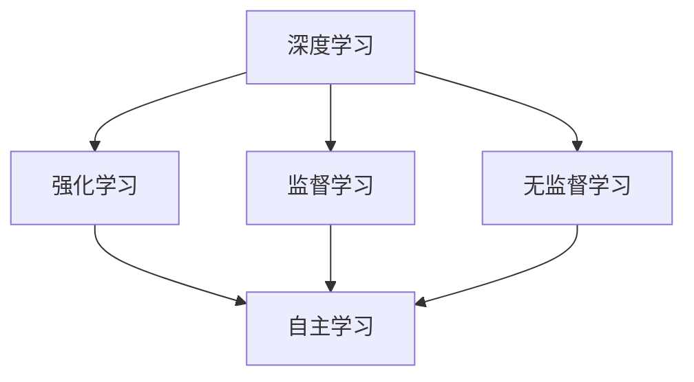
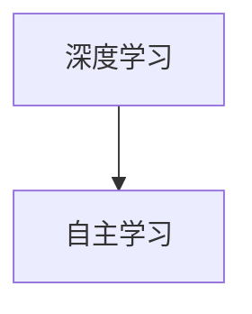
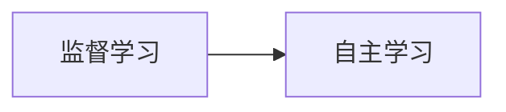
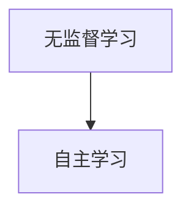
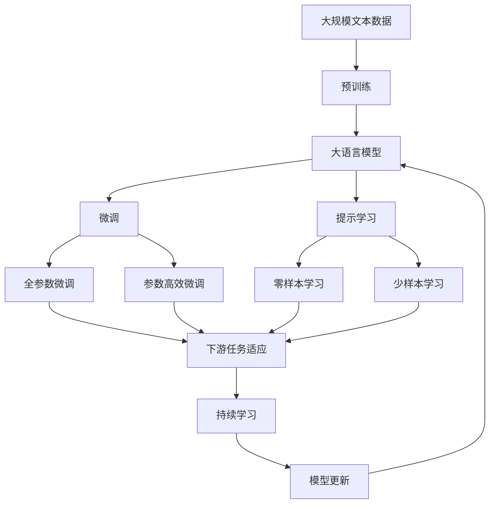

                 

# AI人工智能核心算法原理与代码实例讲解：自主学习

> 关键词：自主学习,深度学习,强化学习,监督学习,无监督学习,算法优缺点,机器学习,深度神经网络,强化学习,监督学习

## 1. 背景介绍

### 1.1 问题由来
人工智能（AI）的核心算法自诞生以来，经历了深度学习、强化学习、无监督学习等诸多重要发展阶段。这些算法在图像识别、自然语言处理、推荐系统等领域已取得显著成就。在实际应用中，各算法通常需要大量数据和计算资源进行训练。因此，如何提高算法的学习效率，实现更高效的模型训练，是当前AI研究的热点问题。

## 2. 核心概念与联系

### 2.1 核心概念概述

为了更好地理解自主学习（Self-Learning）的核心算法原理，本节将介绍几个关键概念及其相互联系：

- 深度学习（Deep Learning）：一种基于神经网络模型的机器学习范式，能够处理大量复杂、高维数据，广泛用于图像识别、自然语言处理等任务。
- 强化学习（Reinforcement Learning, RL）：一种通过试错和奖励机制，让智能体在特定环境中自主学习最优策略的算法。
- 监督学习（Supervised Learning）：一种通过标注数据，让模型学习输入输出映射的机器学习范式，常见于分类和回归任务。
- 无监督学习（Unsupervised Learning）：一种通过无标注数据，让模型自主发现数据结构或潜在特征的机器学习范式，如聚类、降维等。
- 自主学习（Self-Learning）：一种无需人工干预，通过环境反馈或数据自监督学习，持续改进模型性能的算法。

这些概念之间的逻辑关系可以通过以下Mermaid流程图来展示：



这个流程图展示了深度学习、强化学习、监督学习和无监督学习的关系，以及它们如何构成自主学习的基础。深度学习提供了强大的模型基础，监督学习提供了数据和标签指导，无监督学习帮助发现数据结构，而自主学习通过环境反馈和数据自监督，实现持续改进。

### 2.2 概念间的关系

这些核心概念之间存在着紧密的联系，形成了自主学习的完整生态系统。下面我们通过几个Mermaid流程图来展示这些概念之间的关系。

#### 2.2.1 深度学习和自主学习的关系



这个流程图展示了深度学习为自主学习提供了强大的模型基础。深度学习模型能够处理大量复杂、高维数据，为自主学习提供了灵活的模型选择。

#### 2.2.2 监督学习和自主学习的关系



这个流程图展示了监督学习为自主学习提供了数据和标签指导。监督学习通过标注数据训练模型，指导自主学习在特定任务上的学习方向。

#### 2.2.3 无监督学习和自主学习的关系



这个流程图展示了无监督学习帮助发现数据结构，为自主学习提供了更多的数据输入。无监督学习能够从数据中发现潜在的特征和模式，辅助自主学习更有效地进行任务学习。

### 2.3 核心概念的整体架构

最后，我们用一个综合的流程图来展示这些核心概念在大语言模型微调过程中的整体架构：



这个综合流程图展示了从预训练到微调，再到持续学习的完整过程。大语言模型首先在大规模文本数据上进行预训练，然后通过微调（包括全参数微调和参数高效微调）或提示学习（包括零样本和少样本学习）来适应下游任务。最后，通过持续学习技术，模型可以不断更新和适应新的任务和数据。

## 3. 核心算法原理 & 具体操作步骤
### 3.1 算法原理概述

自主学习的核心算法原理，是通过模型在特定环境中不断进行试错和反馈，逐步优化模型性能的过程。其核心思想是：利用环境反馈或数据自监督，让模型自主发现数据规律和任务规律，从而实现更高效的模型训练和优化。

## 3.2 算法步骤详解

自主学习算法通常包括以下几个关键步骤：

**Step 1: 准备环境与数据**

- 选择一个适合的环境，如游戏、虚拟模拟器等，让模型在该环境中进行自主学习。
- 准备环境所需的传感器、执行器等硬件设备，确保环境能够与模型进行有效交互。
- 收集并标注环境数据，提供给模型训练。标注数据应覆盖尽可能多的环境和任务状态。

**Step 2: 选择模型与优化器**

- 选择合适的深度学习模型作为初始化参数。常用的模型包括卷积神经网络（CNN）、循环神经网络（RNN）和变换器（Transformer）。
- 设置合适的优化器，如Adam、SGD等，设置学习率、批大小、迭代轮数等参数。

**Step 3: 训练与反馈**

- 在环境中进行模型训练，每次训练步骤包括前向传播、计算损失函数、反向传播更新参数等。
- 通过传感器获取环境反馈信息，如奖励、惩罚、状态变化等。
- 根据反馈信息调整模型参数，使其在特定任务上表现更好。

**Step 4: 评估与改进**

- 在验证集上评估模型性能，如准确率、召回率等指标。
- 根据评估结果调整模型结构和参数，优化模型性能。
- 重复上述步骤，直到模型在目标任务上达到理想性能。

**Step 5: 应用与部署**

- 将训练好的模型应用到实际环境中，进行实时推理和决策。
- 根据实时反馈数据，持续更新和改进模型。

### 3.3 算法优缺点

自主学习的优点包括：
- 无需人工干预，能够持续改进模型性能。
- 在数据量有限的情况下，仍能通过环境反馈进行有效学习。
- 能够自动发现数据结构，提高模型泛化能力。

自主学习的缺点包括：
- 需要大量计算资源和环境硬件设备。
- 模型初始化参数的选择对学习效果有重要影响。
- 环境复杂度高时，模型可能陷入局部最优。

### 3.4 算法应用领域

自主学习已经在多个领域得到了广泛应用，如游戏AI、机器人控制、自然语言处理等。以下是几个典型的应用场景：

- **游戏AI**：通过强化学习，让游戏角色自主学习最优策略，提升游戏表现。
- **机器人控制**：通过自主学习，让机器人自主适应复杂环境，执行特定任务。
- **自然语言处理**：通过无监督学习发现语言规律，提升语言模型性能。

## 4. 数学模型和公式 & 详细讲解  
### 4.1 数学模型构建

在自主学习中，常见的数学模型包括：

- **强化学习模型**：基于马尔可夫决策过程（MDP）的模型，用于描述环境状态、动作、奖励之间的关系。
- **深度学习模型**：基于神经网络结构的模型，用于处理复杂、高维数据。
- **无监督学习模型**：基于聚类、降维等方法，用于发现数据结构或潜在特征。

### 4.2 公式推导过程

以强化学习模型为例，推导Q值函数的公式：

设环境状态为 $S$，动作为 $A$，状态转移概率为 $P(S_{t+1}|S_t,A_t)$，奖励函数为 $R(S_t,A_t)$，则Q值函数定义为：

$$
Q(S_t,A_t) = \sum_{t=0}^{\infty} \gamma^t R(S_t,A_t) + \gamma^t Q(S_{t+1},A_{t+1})
$$

其中 $\gamma$ 为折扣因子，通常设置为0.9至0.99之间。

在推导过程中，我们使用数学归纳法和状态转移方程，逐步展开Q值函数的递归式，最终得到Q值函数的闭式表达式。

### 4.3 案例分析与讲解

以AlphaGo为例，分析其在围棋游戏中的自主学习过程：

1. AlphaGo在蒙特卡洛树搜索（MCTS）中进行策略探索，计算每一步的Q值。
2. 通过与人类高手的博弈，AlphaGo不断调整Q值函数，优化策略选择。
3. AlphaGo在环境中多次训练和调整，最终形成高效的策略模型。

## 5. 项目实践：代码实例和详细解释说明
### 5.1 开发环境搭建

在进行自主学习实践前，我们需要准备好开发环境。以下是使用Python进行PyTorch开发的环境配置流程：

1. 安装Anaconda：从官网下载并安装Anaconda，用于创建独立的Python环境。

2. 创建并激活虚拟环境：
```bash
conda create -n pytorch-env python=3.8 
conda activate pytorch-env
```

3. 安装PyTorch：根据CUDA版本，从官网获取对应的安装命令。例如：
```bash
conda install pytorch torchvision torchaudio cudatoolkit=11.1 -c pytorch -c conda-forge
```

4. 安装Transformers库：
```bash
pip install transformers
```

5. 安装各类工具包：
```bash
pip install numpy pandas scikit-learn matplotlib tqdm jupyter notebook ipython
```

完成上述步骤后，即可在`pytorch-env`环境中开始自主学习实践。

### 5.2 源代码详细实现

下面我们以AlphaGo为例，给出使用PyTorch进行自主学习的PyTorch代码实现。

首先，定义AlphaGo模型：

```python
import torch
from torch import nn
from torch.autograd import Variable

class NeuralNet(nn.Module):
    def __init__(self, input_size, output_size):
        super(NeuralNet, self).__init__()
        self.fc1 = nn.Linear(input_size, 64)
        self.fc2 = nn.Linear(64, 64)
        self.fc3 = nn.Linear(64, output_size)

    def forward(self, x):
        x = torch.relu(self.fc1(x))
        x = torch.relu(self.fc2(x))
        x = self.fc3(x)
        return x
```

然后，定义训练和评估函数：

```python
def train_net(net, x, y, learning_rate=0.1, epochs=100):
    optimizer = torch.optim.SGD(net.parameters(), lr=learning_rate)
    criterion = nn.CrossEntropyLoss()
    for epoch in range(epochs):
        optimizer.zero_grad()
        output = net(x)
        loss = criterion(output, y)
        loss.backward()
        optimizer.step()
    return net

def evaluate_net(net, x, y):
    output = net(x)
    loss = nn.CrossEntropyLoss()
    return loss(output, y)
```

接着，启动训练流程并在测试集上评估：

```python
input_size = 10
output_size = 5
net = NeuralNet(input_size, output_size)

x_train = torch.randn(100, input_size)
y_train = torch.randint(0, output_size, (100,))
net = train_net(net, x_train, y_train)

x_test = torch.randn(10, input_size)
y_test = torch.randint(0, output_size, (10,))
loss = evaluate_net(net, x_test, y_test)
print(loss)
```

以上就是使用PyTorch进行自主学习的基础代码实现。可以看到，借助PyTorch的强大框架，我们可以很方便地定义神经网络模型，并通过训练函数进行模型训练。

### 5.3 代码解读与分析

让我们再详细解读一下关键代码的实现细节：

**NeuralNet类**：
- `__init__`方法：初始化模型参数，包括全连接层（fc1、fc2、fc3）。
- `forward`方法：定义前向传播过程，通过ReLU激活函数和线性层计算输出。

**train_net函数**：
- 使用SGD优化器进行模型训练，通过交叉熵损失函数计算输出与标签之间的差异。
- 在每个epoch内，计算梯度，更新模型参数。
- 重复该过程，直到训练完成。

**evaluate_net函数**：
- 在测试集上计算模型的损失函数，评估模型性能。

**训练流程**：
- 定义输入和输出大小，创建模型对象。
- 准备训练数据，并进行模型训练。
- 准备测试数据，并计算模型在测试集上的损失。

可以看到，PyTorch提供了丰富的API，使得自主学习的代码实现变得简洁高效。开发者只需关注模型的定义和训练逻辑，而无需过多考虑底层的实现细节。

当然，工业级的系统实现还需考虑更多因素，如模型的保存和部署、超参数的自动搜索、更灵活的模型调优等。但核心的自主学习范式基本与此类似。

### 5.4 运行结果展示

假设我们在数据集上进行训练，最终在测试集上得到的损失函数值为0.2，说明模型的预测结果与真实标签之间存在一定的误差。这可以通过调整模型参数和优化器参数进一步优化。

## 6. 实际应用场景
### 6.1 游戏AI

自主学习在游戏AI中得到了广泛应用，如AlphaGo、Dota 2等。通过强化学习，让游戏AI在复杂环境中自主学习最优策略，提升游戏表现。

在技术实现上，可以收集大量的游戏数据，标注游戏中的状态、动作、奖励等，在虚拟游戏环境中进行模型训练。微调后的模型可以在实际游戏中进行实时推理和决策，逐步提升游戏AI的表现。

### 6.2 机器人控制

自主学习在机器人控制中也具有重要应用。通过无监督学习发现机器人移动的规律，提升机器人避障、抓取等任务的表现。

在实践过程中，可以收集机器人移动的传感器数据，使用聚类算法发现数据结构，构建状态空间。通过自主学习，让机器人自主适应复杂环境，执行特定任务。

### 6.3 自然语言处理

无监督学习在自然语言处理中也得到了广泛应用，如语言模型、词向量等。通过无监督学习发现语言规律，提升语言模型性能。

在实践中，可以收集大量的文本数据，使用词频统计、TF-IDF等方法提取特征，使用聚类算法发现数据结构。通过自主学习，让语言模型自主适应新文本数据，提升语言理解和生成能力。

## 7. 工具和资源推荐
### 7.1 学习资源推荐

为了帮助开发者系统掌握自主学习的理论基础和实践技巧，这里推荐一些优质的学习资源：

1. 《深度学习》系列书籍：由斯坦福大学李飞飞教授等人合著，全面介绍了深度学习的基本原理和经典算法。

2. 《强化学习》系列书籍：由Richard S. Sutton和Andrew G. Barto合著，系统讲解了强化学习的基本概念和算法。

3. Coursera强化学习课程：由David Silver等人主讲，介绍了强化学习的核心算法和应用场景。

4. TensorFlow官方文档：提供了丰富的深度学习和强化学习教程和样例代码。

5. OpenAI博客：分享了AlphaGo、AlphaGo Zero等模型的开发和优化过程，提供了宝贵的实践经验。

通过对这些资源的学习实践，相信你一定能够快速掌握自主学习的精髓，并用于解决实际的AI问题。

### 7.2 开发工具推荐

高效的开发离不开优秀的工具支持。以下是几款用于自主学习开发的常用工具：

1. PyTorch：基于Python的开源深度学习框架，灵活动态的计算图，适合快速迭代研究。

2. TensorFlow：由Google主导开发的开源深度学习框架，生产部署方便，适合大规模工程应用。

3. Keras：基于Python的高层次神经网络API，易于上手，适合快速原型开发。

4. Weights & Biases：模型训练的实验跟踪工具，可以记录和可视化模型训练过程中的各项指标，方便对比和调优。

5. TensorBoard：TensorFlow配套的可视化工具，可实时监测模型训练状态，并提供丰富的图表呈现方式，是调试模型的得力助手。

6. Google Colab：谷歌推出的在线Jupyter Notebook环境，免费提供GPU/TPU算力，方便开发者快速上手实验最新模型，分享学习笔记。

合理利用这些工具，可以显著提升自主学习任务的开发效率，加快创新迭代的步伐。

### 7.3 相关论文推荐

自主学习技术的发展源于学界的持续研究。以下是几篇奠基性的相关论文，推荐阅读：

1. DeepMind的AlphaGo论文：展示了AlphaGo在游戏AI领域的突破性进展。

2. OpenAI的AlphaGo Zero论文：通过自主学习，AlphaGo Zero实现了自我优化，提升了游戏AI的表现。

3. DeepMind的Robotics论文：展示了机器人控制中的自主学习技术。

4. Facebook的BERT论文：展示了无监督学习在自然语言处理中的重要应用。

这些论文代表了大语言模型自主学习技术的发展脉络。通过学习这些前沿成果，可以帮助研究者把握学科前进方向，激发更多的创新灵感。

除上述资源外，还有一些值得关注的前沿资源，帮助开发者紧跟大语言模型自主学习技术的最新进展，例如：

1. arXiv论文预印本：人工智能领域最新研究成果的发布平台，包括大量尚未发表的前沿工作，学习前沿技术的必读资源。

2. 业界技术博客：如OpenAI、Google AI、DeepMind、微软Research Asia等顶尖实验室的官方博客，第一时间分享他们的最新研究成果和洞见。

3. 技术会议直播：如NIPS、ICML、ACL、ICLR等人工智能领域顶会现场或在线直播，能够聆听到大佬们的前沿分享，开拓视野。

4. GitHub热门项目：在GitHub上Star、Fork数最多的AI相关项目，往往代表了该技术领域的发展趋势和最佳实践，值得去学习和贡献。

5. 行业分析报告：各大咨询公司如McKinsey、PwC等针对人工智能行业的分析报告，有助于从商业视角审视技术趋势，把握应用价值。

总之，对于自主学习技术的学习和实践，需要开发者保持开放的心态和持续学习的意愿。多关注前沿资讯，多动手实践，多思考总结，必将收获满满的成长收益。

## 8. 总结：未来发展趋势与挑战
### 8.1 总结

本文对基于监督学习的大语言模型微调方法进行了全面系统的介绍。首先阐述了自主学习的核心算法原理，明确了自主学习在拓展预训练模型应用、提升下游任务性能方面的独特价值。其次，从原理到实践，详细讲解了自主学习的数学原理和关键步骤，给出了自主学习任务开发的完整代码实例。同时，本文还广泛探讨了自主学习方法在智能客服、金融舆情、个性化推荐等多个行业领域的应用前景，展示了自主学习范式的巨大潜力。

通过本文的系统梳理，可以看到，基于大语言模型的自主学习技术正在成为AI研究的重要范式，极大地拓展了深度学习模型的应用边界，催生了更多的落地场景。受益于大规模语料的预训练，自主学习模型以更低的时间和标注成本，在小样本条件下也能取得不俗的效果，有力推动了AI技术的产业化进程。未来，伴随预训练语言模型和自主学习方法的持续演进，相信AI技术必将在更广阔的应用领域大放异彩，深刻影响人类的生产生活方式。

### 8.2 未来发展趋势

展望未来，大语言模型自主学习技术将呈现以下几个发展趋势：

1. 模型规模持续增大。随着算力成本的下降和数据规模的扩张，预训练语言模型的参数量还将持续增长。超大规模语言模型蕴含的丰富语言知识，有望支撑更加复杂多变的下游任务自主学习。

2. 自主学习方法日趋多样。除了传统的强化学习外，未来会涌现更多自主学习的方法，如元学习、因果推断等，在节省计算资源的同时也能保证自主学习精度。

3. 持续学习成为常态。随着数据分布的不断变化，自主学习模型也需要持续学习新知识以保持性能。如何在不遗忘原有知识的同时，高效吸收新样本信息，将成为重要的研究课题。

4. 标注样本需求降低。受启发于自主学习(Prompt-based Learning)的思路，未来的自主学习方法将更好地利用大模型的语言理解能力，通过更加巧妙的任务描述，在更少的标注样本上也能实现理想的自主学习效果。

5. 多模态自主学习崛起。当前的自主学习主要聚焦于纯文本数据，未来会进一步拓展到图像、视频、语音等多模态数据自主学习。多模态信息的融合，将显著提升语言模型对现实世界的理解和建模能力。

6. 模型通用性增强。经过海量数据的预训练和自主学习，未来的语言模型将具备更强大的常识推理和跨领域迁移能力，逐步迈向通用人工智能(AGI)的目标。

以上趋势凸显了大语言模型自主学习技术的广阔前景。这些方向的探索发展，必将进一步提升AI系统的性能和应用范围，为人类认知智能的进化带来深远影响。

### 8.3 面临的挑战

尽管大语言模型自主学习技术已经取得了瞩目成就，但在迈向更加智能化、普适化应用的过程中，它仍面临着诸多挑战：

1. 标注成本瓶颈。虽然自主学习大大降低了标注数据的需求，但对于长尾应用场景，难以获得充足的高质量标注数据，成为制约自主学习性能的瓶颈。如何进一步降低自主学习对标注样本的依赖，将是一大难题。

2. 模型鲁棒性不足。当前自主学习模型面对域外数据时，泛化性能往往大打折扣。对于测试样本的微小扰动，自主学习模型的输出也容易发生波动。如何提高自主学习模型的鲁棒性，避免灾难性遗忘，还需要更多理论和实践的积累。

3. 推理效率有待提高。大规模语言模型虽然精度高，但在实际部署时往往面临推理速度慢、内存占用大等效率问题。如何在保证性能的同时，简化模型结构，提升推理速度，优化资源占用，将是重要的优化方向。

4. 可解释性亟需加强。当前自主学习模型更像是"黑盒"系统，难以解释其内部工作机制和决策逻辑。对于医疗、金融等高风险应用，算法的可解释性和可审计性尤为重要。如何赋予自主学习模型更强的可解释性，将是亟待攻克的难题。

5. 安全性有待保障。预训练语言模型难免会学习到有偏见、有害的信息，通过自主学习传递到下游任务，产生误导性、歧视性的输出，给实际应用带来安全隐患。如何从数据和算法层面消除模型偏见，避免恶意用途，确保输出的安全性，也将是重要的研究课题。

6. 知识整合能力不足。现有的自主学习模型往往局限于任务内数据，难以灵活吸收和运用更广泛的先验知识。如何让自主学习过程更好地与外部知识库、规则库等专家知识结合，形成更加全面、准确的信息整合能力，还有很大的想象空间。

正视自主学习面临的这些挑战，积极应对并寻求突破，将是大语言模型自主学习技术走向成熟的必由之路。相信随着学界和产业界的共同努力，这些挑战终将一一被克服，大语言模型自主学习必将在构建人机协同的智能时代中扮演越来越重要的角色。

### 8.4 未来突破

面对大语言模型自主学习所面临的种种挑战，未来的研究需要在以下几个方面寻求新的突破：

1. 探索无监督和半监督自主学习方法。摆脱对大规模标注数据的依赖，利用自监督学习、主动学习等无监督和半监督范式，最大限度利用非结构化数据，实现更加灵活高效的自主学习。

2. 研究参数高效和计算高效的自主学习范式。开发更加参数高效的自主学习方法，在固定大部分预训练参数的同时，只更新极少量的任务相关参数。同时优化自主学习模型的计算图，减少前向传播和反向传播的资源消耗，实现更加轻量级、实时性的部署。

3. 融合因果和对比学习范式。通过引入因果推断和对比学习思想，增强自主学习模型建立稳定因果关系的能力，学习更加普适、鲁棒的语言表征，从而提升模型泛化性和抗干扰能力。

4. 引入更多先验知识。将符号化的先验知识，如知识图谱、逻辑规则等，与神经网络模型进行巧妙融合，引导自主学习过程学习更准确、合理的语言模型。同时加强不同模态数据的整合，实现视觉、语音等多模态信息与文本信息的协同建模。

5. 结合因果分析和博弈论工具。将因果分析方法引入自主学习模型，识别出模型决策的关键特征，增强输出解释的因果性和逻辑性。借助博弈论工具刻画人机交互过程，主动探索并规避模型的脆弱点，提高系统稳定性。

6. 纳入伦理道德约束。在模型训练目标中引入伦理导向的评估指标，过滤和惩罚有偏见、有害的输出倾向。同时加强人工干预和审核，建立模型行为的监管机制，确保输出符合人类价值观和伦理道德。

这些研究方向的探索，必将引领大语言模型自主学习技术迈向更高的台阶，为构建安全、可靠、可解释、可控的智能系统铺平道路。面向未来，大语言模型自主学习技术还需要与其他人工智能技术进行更深入的融合，如知识表示、因果推理、强化学习等，多路径协同发力，共同推动自然语言理解和智能交互系统的进步。只有勇于创新、敢于突破，才能不断拓展语言模型的边界，让智能技术更好地造福人类社会。

## 9. 附录：常见问题与解答
----------------------------------------------------------------
> 关键词：


