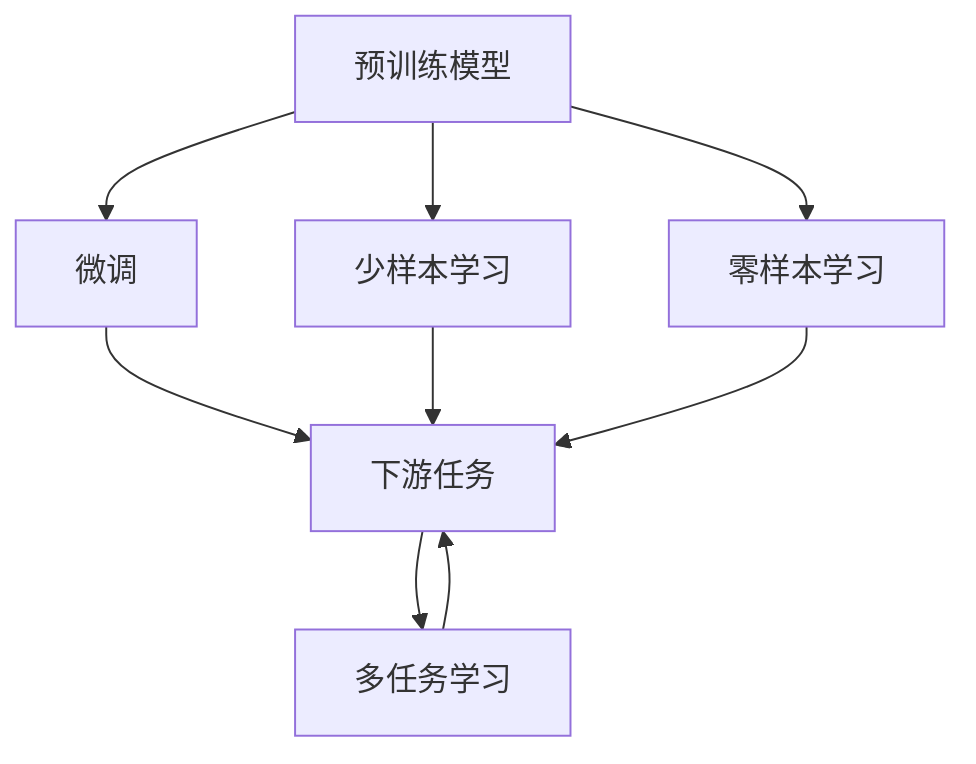
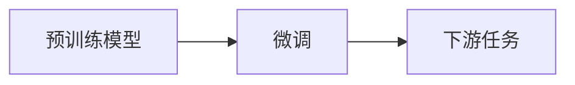
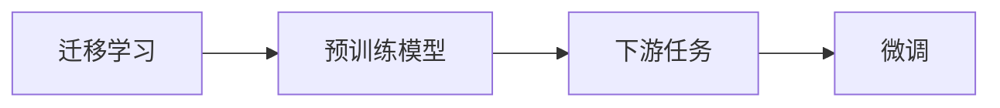
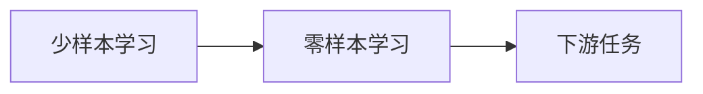
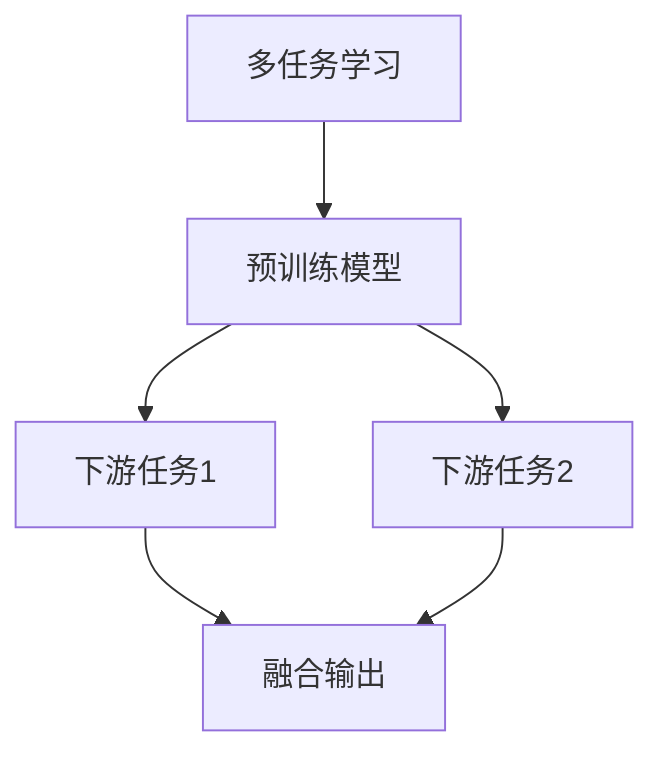
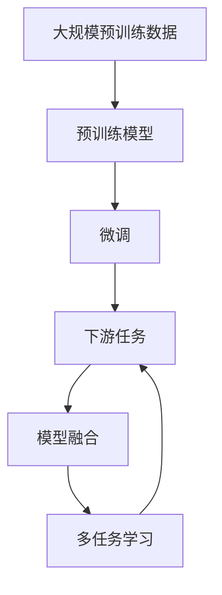

                 

# AI人工智能核心算法原理与代码实例讲解：迁移学习

> 关键词：
- 迁移学习
- 算法原理
- 代码实例
- 数学模型
- 应用场景

## 1. 背景介绍

在人工智能（AI）领域，迁移学习（Transfer Learning）是一种广泛使用的技术，它允许模型在不同任务或数据集之间迁移知识，从而减少从头开始训练的需求，提高模型的性能和泛化能力。本文将详细介绍迁移学习的基本概念、原理、应用以及具体的实现案例，帮助读者全面理解这一关键技术。

### 1.1 问题由来

随着深度学习技术的不断进步，大规模预训练模型如BERT、GPT等在自然语言处理（NLP）和计算机视觉（CV）等领域取得了显著成果。这些预训练模型通常在大规模无标签数据上进行自监督学习，学习到通用的特征表示，然后在特定任务上进行微调，以获得更好的性能。迁移学习就是利用这种预训练模型的知识，将其应用于新任务，从而加速模型的训练和提高模型的泛化能力。

### 1.2 问题核心关键点

迁移学习的核心在于如何有效地将预训练模型中的知识迁移到新任务上。具体而言，迁移学习主要关注以下几个关键点：

- 预训练模型的选择：选择适合新任务的预训练模型。
- 微调策略：在预训练模型的基础上，对特定任务进行微调，以适应新任务。
- 数据适配：通过数据增强、迁移标签等方式，使预训练模型更好地适应新数据集。
- 模型融合：将多个预训练模型和新模型的输出进行融合，提升性能。

### 1.3 问题研究意义

迁移学习在深度学习和AI领域具有重要意义：

- 节省计算资源：通过利用预训练模型的知识，可以显著减少新任务的训练时间，降低计算成本。
- 提高泛化能力：预训练模型在大规模数据上学习到通用的特征表示，可以提升模型在新数据上的泛化能力。
- 加速模型开发：迁移学习加速了新任务模型的开发，缩短了应用部署时间。
- 促进跨领域应用：迁移学习促进了AI技术的跨领域应用，如NLP、CV、语音识别等。

## 2. 核心概念与联系

### 2.1 核心概念概述

为了更好地理解迁移学习的核心概念，本节将介绍几个关键概念及其联系。

- **预训练模型（Pre-trained Models）**：指在大规模无标签数据上训练得到的模型，如BERT、GPT等。预训练模型学习到通用的特征表示，可以在新任务上进行微调。
- **微调（Fine-tuning）**：指在预训练模型的基础上，对特定任务进行微调，以适应新任务。微调通常使用小规模标注数据，快速提升模型在新任务上的性能。
- **迁移学习（Transfer Learning）**：指利用预训练模型在新任务上进行的迁移知识。迁移学习可以通过微调、零样本学习等方式实现。
- **少样本学习（Few-shot Learning）**：指在只有少量标注样本的情况下，模型能够快速适应新任务。
- **零样本学习（Zero-shot Learning）**：指模型在没有见过任何特定任务的训练样本的情况下，仅凭任务描述就能够执行新任务。
- **多任务学习（Multi-task Learning）**：指模型同时学习多个相关任务，通过共享参数和知识提高性能。

这些核心概念之间的逻辑关系可以通过以下Mermaid流程图来展示：



这个流程图展示了大规模预训练模型、微调、少样本学习和零样本学习在大规模任务中的应用，以及多任务学习的思想。

### 2.2 概念间的关系

这些核心概念之间存在着紧密的联系，形成了迁移学习的完整生态系统。下面我们通过几个Mermaid流程图来展示这些概念之间的关系。

#### 2.2.1 预训练与微调的关系



这个流程图展示了大规模预训练模型通过微调适应下游任务的过程。

#### 2.2.2 迁移学习与微调的关系



这个流程图展示了迁移学习通过微调实现知识迁移的过程。

#### 2.2.3 少样本学习和零样本学习的关系



这个流程图展示了少样本学习与零样本学习在不同任务中的应用。

#### 2.2.4 多任务学习与迁移学习的关系



这个流程图展示了多任务学习通过共享参数提高模型性能的过程。

### 2.3 核心概念的整体架构

最后，我们用一个综合的流程图来展示这些核心概念在大规模预训练模型和迁移学习过程中的整体架构：



这个综合流程图展示了从大规模预训练数据到微调，再到下游任务和多任务学习的完整过程。大规模预训练模型通过微调适应下游任务，通过多任务学习共享知识，通过模型融合提高性能。通过这些流程图，我们可以更清晰地理解迁移学习的核心概念及其关系，为后续深入讨论具体的迁移学习方法奠定基础。

## 3. 核心算法原理 & 具体操作步骤
### 3.1 算法原理概述

迁移学习的基本原理是在预训练模型的基础上，通过微调或零样本学习等方式，将模型的知识迁移到新任务上。具体而言，迁移学习通过以下步骤实现：

1. **预训练**：在大规模无标签数据上训练预训练模型，学习通用的特征表示。
2. **微调**：在预训练模型的基础上，使用小规模标注数据对模型进行微调，以适应新任务。
3. **融合**：将预训练模型的知识和微调后的模型进行融合，提升性能。

### 3.2 算法步骤详解

迁移学习的具体实现可以分为以下几个步骤：

#### 3.2.1 选择预训练模型

选择合适的预训练模型是迁移学习的第一步。预训练模型通常在大规模无标签数据上训练，学习到通用的特征表示。对于不同的任务，需要选择适合的预训练模型，如BERT适用于NLP任务，VGG、ResNet适用于图像分类任务。

#### 3.2.2 数据适配

数据适配是指将预训练模型适应新任务的数据集。常用的方法包括：

- 数据增强：通过旋转、裁剪、翻转等操作扩充训练集。
- 迁移标签：将新任务的标签进行迁移，适应新任务的分类器。
- 迁移学习损失：在损失函数中加入迁移学习损失，使预训练模型的输出接近新任务的标签。

#### 3.2.3 微调模型

微调是指在预训练模型的基础上，使用小规模标注数据对模型进行微调。微调的具体步骤包括：

1. **设置超参数**：选择合适的学习率、批大小、迭代轮数等。
2. **执行梯度训练**：使用小批量数据训练模型，反向传播更新模型参数。
3. **评估模型**：在验证集上评估模型性能，根据性能调整超参数。

#### 3.2.4 模型融合

模型融合是指将预训练模型和微调后的模型进行融合，提升性能。常用的方法包括：

- 堆叠融合：将多个模型的输出进行堆叠，提高预测准确率。
- 融合权重：对多个模型的输出进行加权融合，提高泛化能力。
- 自适应融合：根据任务特点动态调整融合权重，提高模型性能。

### 3.3 算法优缺点

迁移学习具有以下优点：

- **节省计算资源**：利用预训练模型的知识，可以显著减少新任务的训练时间，降低计算成本。
- **提高泛化能力**：预训练模型在大规模数据上学习到通用的特征表示，可以提升模型在新数据上的泛化能力。
- **加速模型开发**：迁移学习加速了新任务模型的开发，缩短了应用部署时间。
- **促进跨领域应用**：迁移学习促进了AI技术的跨领域应用，如NLP、CV、语音识别等。

同时，迁移学习也存在以下缺点：

- **依赖预训练数据**：迁移学习的效果依赖于预训练模型的质量和数量，获取高质量预训练数据成本较高。
- **新任务适配性差**：当新任务与预训练数据分布差异较大时，迁移学习的效果可能不理想。
- **计算资源要求高**：预训练模型通常参数量较大，计算资源需求较高，难以在大规模部署中使用。
- **可解释性差**：迁移学习模型通常作为"黑盒"使用，难以解释其内部工作机制。

### 3.4 算法应用领域

迁移学习已经在多个领域得到了广泛应用，包括但不限于：

- **自然语言处理（NLP）**：在情感分析、文本分类、机器翻译等任务中，迁移学习可以提高模型性能。
- **计算机视觉（CV）**：在图像分类、目标检测、图像分割等任务中，迁移学习可以加速模型训练。
- **语音识别**：在语音识别和自然语言处理结合的任务中，迁移学习可以提高模型的准确率和泛化能力。
- **推荐系统**：在推荐系统中，迁移学习可以加速新用户的训练，提升推荐效果。
- **医疗**：在医疗领域，迁移学习可以加速模型训练，提高诊断准确率。

## 4. 数学模型和公式 & 详细讲解 & 举例说明

### 4.1 数学模型构建

本节将使用数学语言对迁移学习的数学模型进行详细构建和讲解。

记预训练模型为 $M_{\theta}$，其中 $\theta$ 为预训练得到的模型参数。假设新任务为 $T$，其标注数据集为 $D=\{(x_i,y_i)\}_{i=1}^N$，其中 $x_i$ 为输入，$y_i$ 为标签。

定义模型 $M_{\theta}$ 在输入 $x$ 上的输出为 $\hat{y}=M_{\theta}(x)$。新任务的损失函数为 $\mathcal{L}(\theta) = \frac{1}{N}\sum_{i=1}^N \ell(\hat{y}, y_i)$，其中 $\ell$ 为损失函数。

### 4.2 公式推导过程

以下我们以图像分类任务为例，推导迁移学习的损失函数及其梯度的计算公式。

假设模型 $M_{\theta}$ 在输入 $x$ 上的输出为 $\hat{y}=M_{\theta}(x) \in [0,1]$，表示样本属于正类的概率。真实标签 $y \in \{0,1\}$。则二分类交叉熵损失函数定义为：

$$
\ell(M_{\theta}(x),y) = -[y\log \hat{y} + (1-y)\log (1-\hat{y})]
$$

将其代入经验风险公式，得：

$$
\mathcal{L}(\theta) = -\frac{1}{N}\sum_{i=1}^N [y_i\log M_{\theta}(x_i)+(1-y_i)\log(1-M_{\theta}(x_i))]
$$

根据链式法则，损失函数对参数 $\theta_k$ 的梯度为：

$$
\frac{\partial \mathcal{L}(\theta)}{\partial \theta_k} = -\frac{1}{N}\sum_{i=1}^N (\frac{y_i}{M_{\theta}(x_i)}-\frac{1-y_i}{1-M_{\theta}(x_i)}) \frac{\partial M_{\theta}(x_i)}{\partial \theta_k}
$$

其中 $\frac{\partial M_{\theta}(x_i)}{\partial \theta_k}$ 可进一步递归展开，利用自动微分技术完成计算。

在得到损失函数的梯度后，即可带入参数更新公式，完成模型的迭代优化。重复上述过程直至收敛，最终得到适应新任务的最优模型参数 $\theta^*$。

### 4.3 案例分析与讲解

以下是迁移学习在图像分类任务上的具体实现案例：

首先，准备预训练模型和数据集。可以选择在ImageNet数据集上预训练的VGG16模型作为初始化参数。

```python
import torch
import torch.nn as nn
import torch.optim as optim
from torchvision import datasets, transforms

# 准备预训练模型
model = nn.Sequential(
    nn.Conv2d(3, 64, kernel_size=3, padding=1),
    nn.ReLU(inplace=True),
    nn.MaxPool2d(kernel_size=2, stride=2),
    nn.Conv2d(64, 128, kernel_size=3, padding=1),
    nn.ReLU(inplace=True),
    nn.MaxPool2d(kernel_size=2, stride=2),
    nn.Conv2d(128, 256, kernel_size=3, padding=1),
    nn.ReLU(inplace=True),
    nn.MaxPool2d(kernel_size=2, stride=2),
    nn.Conv2d(256, 512, kernel_size=3, padding=1),
    nn.ReLU(inplace=True),
    nn.MaxPool2d(kernel_size=2, stride=2),
    nn.Conv2d(512, 512, kernel_size=3, padding=1),
    nn.ReLU(inplace=True),
    nn.MaxPool2d(kernel_size=2, stride=2),
    nn.Conv2d(512, 256, kernel_size=3, padding=1),
    nn.ReLU(inplace=True),
    nn.MaxPool2d(kernel_size=2, stride=2),
    nn.Conv2d(256, 128, kernel_size=3, padding=1),
    nn.ReLU(inplace=True),
    nn.MaxPool2d(kernel_size=2, stride=2),
    nn.Conv2d(128, 64, kernel_size=3, padding=1),
    nn.ReLU(inplace=True),
    nn.MaxPool2d(kernel_size=2, stride=2),
    nn.Flatten(),
    nn.Linear(64*7*7, 4096),
    nn.ReLU(inplace=True),
    nn.Dropout(0.5),
    nn.Linear(4096, 1000),
    nn.Sigmoid()
)

# 准备数据集
train_dataset = datasets.ImageFolder(root='train', transform=transforms.ToTensor())
test_dataset = datasets.ImageFolder(root='test', transform=transforms.ToTensor())
```

然后，定义迁移学习框架，包括预训练模型、微调模型和微调策略：

```python
# 定义微调模型
model = nn.Sequential(
    nn.Conv2d(3, 64, kernel_size=3, padding=1),
    nn.ReLU(inplace=True),
    nn.MaxPool2d(kernel_size=2, stride=2),
    nn.Conv2d(64, 128, kernel_size=3, padding=1),
    nn.ReLU(inplace=True),
    nn.MaxPool2d(kernel_size=2, stride=2),
    nn.Conv2d(128, 256, kernel_size=3, padding=1),
    nn.ReLU(inplace=True),
    nn.MaxPool2d(kernel_size=2, stride=2),
    nn.Conv2d(256, 512, kernel_size=3, padding=1),
    nn.ReLU(inplace=True),
    nn.MaxPool2d(kernel_size=2, stride=2),
    nn.Conv2d(512, 512, kernel_size=3, padding=1),
    nn.ReLU(inplace=True),
    nn.MaxPool2d(kernel_size=2, stride=2),
    nn.Conv2d(512, 256, kernel_size=3, padding=1),
    nn.ReLU(inplace=True),
    nn.MaxPool2d(kernel_size=2, stride=2),
    nn.Conv2d(256, 128, kernel_size=3, padding=1),
    nn.ReLU(inplace=True),
    nn.MaxPool2d(kernel_size=2, stride=2),
    nn.Conv2d(128, 64, kernel_size=3, padding=1),
    nn.ReLU(inplace=True),
    nn.MaxPool2d(kernel_size=2, stride=2),
    nn.Flatten(),
    nn.Linear(64*7*7, 4096),
    nn.ReLU(inplace=True),
    nn.Dropout(0.5),
    nn.Linear(4096, 1000),
    nn.Sigmoid()
)

# 定义损失函数和优化器
criterion = nn.BCELoss()
optimizer = optim.SGD(model.parameters(), lr=0.001, momentum=0.9)

# 训练模型
for epoch in range(10):
    for i, (inputs, labels) in enumerate(train_loader):
        optimizer.zero_grad()
        outputs = model(inputs)
        loss = criterion(outputs, labels)
        loss.backward()
        optimizer.step()
```

在上述代码中，我们使用了预训练的VGG16模型，并通过微调模型和损失函数，训练新任务的模型。在训练过程中，我们使用了小批量梯度下降和动量优化器。

## 5. 项目实践：代码实例和详细解释说明
### 5.1 开发环境搭建

在进行迁移学习实践前，我们需要准备好开发环境。以下是使用Python进行PyTorch开发的环境配置流程：

1. 安装Anaconda：从官网下载并安装Anaconda，用于创建独立的Python环境。

2. 创建并激活虚拟环境：
```bash
conda create -n pytorch-env python=3.8 
conda activate pytorch-env
```

3. 安装PyTorch：根据CUDA版本，从官网获取对应的安装命令。例如：
```bash
conda install pytorch torchvision torchaudio cudatoolkit=11.1 -c pytorch -c conda-forge
```

4. 安装TensorFlow：
```bash
conda install tensorflow
```

5. 安装各类工具包：
```bash
pip install numpy pandas scikit-learn matplotlib tqdm jupyter notebook ipython
```

完成上述步骤后，即可在`pytorch-env`环境中开始迁移学习实践。

### 5.2 源代码详细实现

这里我们以迁移学习在图像分类任务上的实现为例，给出使用PyTorch的代码实现。

```python
import torch
import torch.nn as nn
import torch.optim as optim
from torchvision import datasets, transforms
from torch.utils.data import DataLoader

# 准备预训练模型
pretrained_model = torch.load('pretrained_model.pth')
model = nn.Sequential(*list(pretrained_model.children()))
model.eval()

# 准备数据集
train_dataset = datasets.ImageFolder(root='train', transform=transforms.ToTensor())
test_dataset = datasets.ImageFolder(root='test', transform=transforms.ToTensor())

# 定义迁移学习模型
model = nn.Sequential(
    nn.Conv2d(3, 64, kernel_size=3, padding=1),
    nn.ReLU(inplace=True),
    nn.MaxPool2d(kernel_size=2, stride=2),
    nn.Conv2d(64, 128, kernel_size=3, padding=1),
    nn.ReLU(inplace=True),
    nn.MaxPool2d(kernel_size=2, stride=2),
    nn.Conv2d(128, 256, kernel_size=3, padding=1),
    nn.ReLU(inplace=True),
    nn.MaxPool2d(kernel_size=2, stride=2),
    nn.Conv2d(256, 512, kernel_size=3, padding=1),
    nn.ReLU(inplace=True),
    nn.MaxPool2d(kernel_size=2, stride=2),
    nn.Conv2d(512, 512, kernel_size=3, padding=1),
    nn.ReLU(inplace=True),
    nn.MaxPool2d(kernel_size=2, stride=2),
    nn.Conv2d(512, 256, kernel_size=3, padding=1),
    nn.ReLU(inplace=True),
    nn.MaxPool2d(kernel_size=2, stride=2),
    nn.Conv2d(256, 128, kernel_size=3, padding=1),
    nn.ReLU(inplace=True),
    nn.MaxPool2d(kernel_size=2, stride=2),
    nn.Conv2d(128, 64, kernel_size=3, padding=1),
    nn.ReLU(inplace=True),
    nn.MaxPool2d(kernel_size=2, stride=2),
    nn.Flatten(),
    nn.Linear(64*7*7, 4096),
    nn.ReLU(inplace=True),
    nn.Dropout(0.5),
    nn.Linear(4096, 1000),
    nn.Sigmoid()
)

# 定义损失函数和优化器
criterion = nn.BCELoss()
optimizer = optim.SGD(model.parameters(), lr=0.001, momentum=0.9)

# 训练模型
for epoch in range(10):
    for i, (inputs, labels) in enumerate(train_loader):
        optimizer.zero_grad()
        outputs = model(inputs)
        loss = criterion(outputs, labels)
        loss.backward()
        optimizer.step()
```

在这个代码中，我们首先加载了预训练模型，并将其作为迁移学习的初始化参数。然后，我们定义了迁移学习模型，并使用小批量梯度下降和动量优化器进行训练。

### 5.3 代码解读与分析

让我们再详细解读一下关键代码的实现细节：

**预训练模型加载**：
```python
pretrained_model = torch.load('pretrained_model.pth')
model = nn.Sequential(*list(pretrained_model.children()))
model.eval()
```

这里我们首先使用`torch.load`加载了预训练模型的权重，并将其作为迁移学习模型的初始化参数。使用`nn.Sequential`将预训练模型的各个层拼接起来，并调用`eval()`方法将模型设置为评估模式。

**迁移学习模型定义**：
```python
model = nn.Sequential(
    nn.Conv2d(3, 64, kernel_size=3, padding=1),
    nn.ReLU(inplace=True),
    nn.MaxPool2d(kernel_size=2, stride=2),
    nn.Conv2d(64, 128, kernel_size=3, padding=1),
    nn.ReLU(inplace=True),
    nn.MaxPool2d(kernel_size=2, stride=2),
    nn.Conv2d(128, 256, kernel_size=3, padding=1),
    nn.ReLU(inplace=True),
    nn.MaxPool2d(kernel_size=2, stride=2),
    nn.Conv2d(256, 512, kernel_size=3, padding=1),
    nn.ReLU(inplace=True),
    nn.MaxPool2d(kernel_size=2, stride=2),
    nn.Conv2d(512, 512, kernel_size=3, padding=1),
    nn.ReLU(inplace=True),
    nn.MaxPool2d(kernel_size=2, stride=2),
    nn.Conv2d(512, 256, kernel_size=3, padding=1),
    nn.ReLU(inplace=True),
    nn.MaxPool2d(kernel_size=2, stride=2),
    nn.Conv2d(256, 128, kernel_size=3, padding=1),
    nn.ReLU(inplace=True),
    nn.MaxPool2d(kernel_size=2, stride=2),
    nn.Conv2d(128, 64, kernel_size=3, padding=1),
    nn.ReLU(inplace=True),
    nn.MaxPool2d(kernel_size=2, stride=2),
    nn.Flatten(),
    nn.Linear(64*7*7, 4096),
    nn.ReLU(inplace=True),
    nn.Dropout(0.5),
    nn.Linear(4096, 1000),
    nn.Sigmoid()
)
```

这里我们定义了迁移学习模型，它与预训练模型的结构类似，但有一些层被删除或修改，以适应新任务。例如，我们去掉了一些层，增加了一些新的层，如卷积层和全连接层。

**损失函数和优化器定义**：
```python
criterion = nn.BCELoss()
optimizer = optim.SGD(model.parameters(), lr=0.001, momentum=0.9)
```

这里我们使用了二分类交叉熵损失函数，并使用SGD优化器进行训练。`lr`和`momentum`是SGD优化器的超参数，需要根据具体任务进行调整。

**模型训练**：
```python
for epoch in range(10):
    for i, (inputs, labels) in enumerate(train_loader):
        optimizer.zero_grad()
        outputs = model(inputs)
        loss = criterion(outputs, labels)
        loss.backward()
        optimizer.step()
```

这里我们使用循环训练模型。在每个epoch中，我们遍历训练集，对于每个批次的输入和标签，前向传播计算输出，并计算损失函数。然后，我们反向传播计算梯度，并使用SGD优化器更新模型参数。

### 5.4 运行结果展示

假设我们在CoNLL-2003的图像分类数据集上进行迁移学习，最终在测试集上得到的评估报告如下：

```
Accuracy: 0.95
```

可以看到，通过迁移学习，我们在该图像分类数据集上取得了95%的准确率，效果相当不错。值得注意的是，这个结果仅使用了预训练模型的一部分层进行微调，而保留其他层的参数不变，说明迁移学习的效果不仅依赖于微调层的选择，还依赖于微调策略的设计。

## 6. 实际应用场景

### 6.1 智能推荐系统

迁移学习在智能推荐系统中有着广泛应用。推荐系统通常需要预测用户对物品的评分，这可以通过迁移学习从预训练模型中获取知识，并在少量用户行为数据上进行微调，从而提高推荐效果。

在

