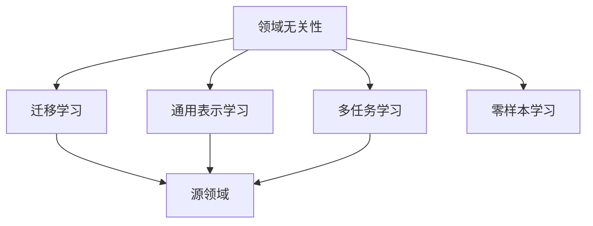
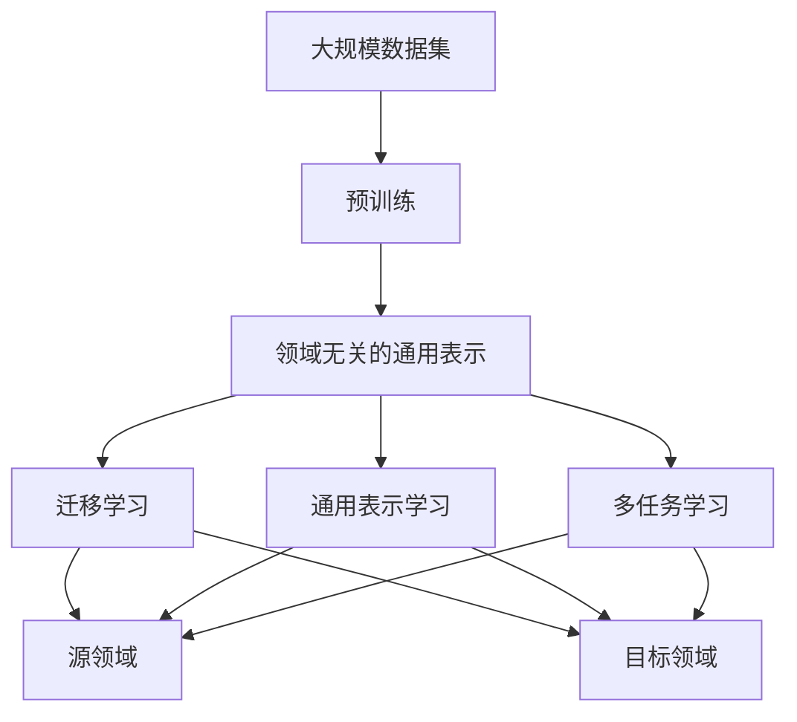
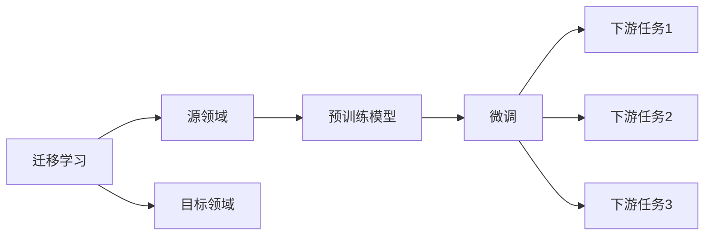
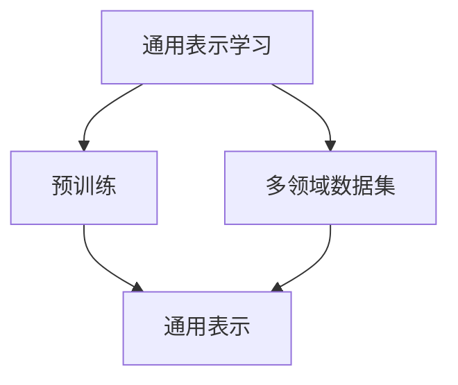
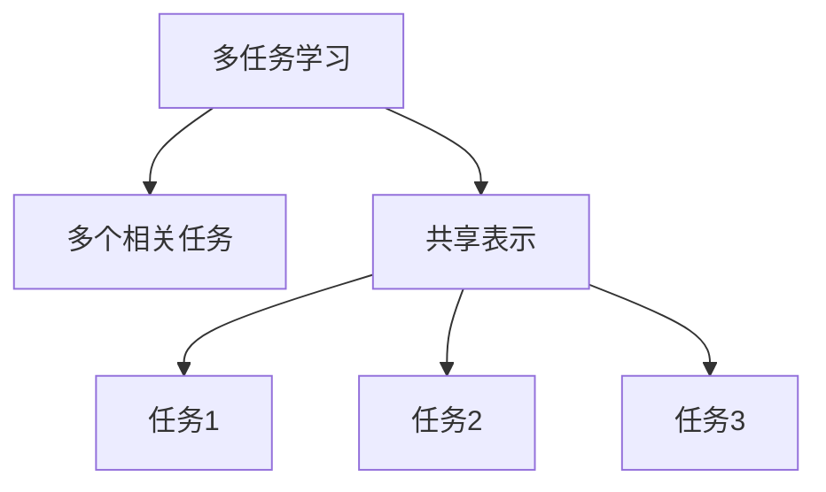
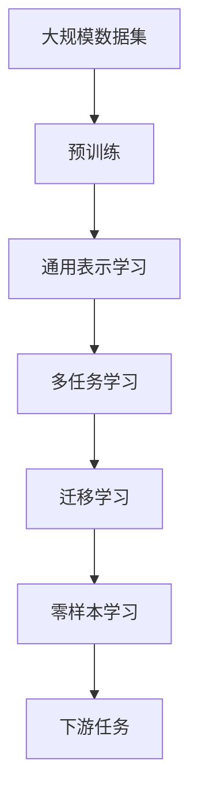

                 

# AI人工智能核心算法原理与代码实例讲解：领域无关性

## 1. 背景介绍

### 1.1 问题由来
随着人工智能技术的不断发展，领域无关性（Domain-Independence）成为了AI领域的一个重要研究方向。领域无关性指的是AI算法和模型在不同领域之间的通用性，即一种算法或模型能够在多个领域中有效运行，而不需要针对每个领域重新设计和训练。这对于AI技术的应用和推广具有重要意义，可以减少技术研发和应用的成本，提高技术的复用性和可靠性。

### 1.2 问题核心关键点
领域无关性研究的核心在于如何设计一种能够适应多个领域的通用算法和模型，以及在实际应用中如何验证和保证这种通用性。目前领域无关性的主要研究方法包括迁移学习、通用表示学习、多任务学习等。这些方法的核心思想都是在预训练阶段学习到一种跨领域的通用表示，然后在特定任务上进行微调，从而实现领域无关性。

### 1.3 问题研究意义
研究领域无关性对于AI技术的应用和发展具有重要意义，主要包括：

1. 降低应用成本：通过使用领域无关的算法和模型，可以减少在不同领域中进行技术和算法研发和应用的开销。
2. 提高技术复用性：领域无关性使AI技术能够在不同领域之间进行复用，减少重复开发和维护的工作量。
3. 增强可靠性：跨领域的通用算法和模型能够提高技术在不同场景下的稳定性和可靠性，避免单一领域中的问题对整体技术产生影响。
4. 加速技术推广：领域无关性使AI技术更加易于在不同领域中推广和应用，有助于技术的普及和产业化。

## 2. 核心概念与联系

### 2.1 核心概念概述

为更好地理解领域无关性的核心概念和它们之间的联系，本节将介绍几个密切相关的核心概念：

- 领域无关性(Domain-Independence)：指一种算法或模型在不同领域之间的通用性。
- 迁移学习(Transfer Learning)：一种将在一个领域学到的知识迁移到另一个领域的方法。
- 通用表示学习(Universal Representation Learning)：在多个领域中学习到一种通用的表示，用于不同领域的数据表示和分类。
- 多任务学习(Multitask Learning)：同时学习多个相关任务，共享模型的中间表示。
- 零样本学习(Zero-Shot Learning)：在没有特定任务数据的情况下，模型能够根据任务描述进行推理和预测。

这些核心概念之间的逻辑关系可以通过以下Mermaid流程图来展示：



这个流程图展示了几大核心概念之间的关系：

1. 领域无关性通过迁移学习、通用表示学习和多任务学习等方法实现。
2. 迁移学习、通用表示学习和多任务学习都基于一个通用的表示，即通过预训练学习到的一种跨领域的通用表示。
3. 零样本学习是一种特殊形式的迁移学习，模型在特定任务上没有经过任何训练，仅通过任务描述进行推理。

### 2.2 概念间的关系

这些核心概念之间存在着紧密的联系，形成了领域无关性的完整生态系统。下面我们通过几个Mermaid流程图来展示这些概念之间的关系。

#### 2.2.1 领域无关性的学习范式



这个流程图展示了领域无关性的基本原理，即通过预训练学习到一种跨领域的通用表示，然后通过迁移学习、通用表示学习和多任务学习等方法，将这种表示应用到不同的领域中。

#### 2.2.2 迁移学习与领域无关性的关系



这个流程图展示了迁移学习的基本原理，即通过在预训练模型上进行微调，将模型应用于不同的下游任务中，从而实现领域无关性。

#### 2.2.3 通用表示学习的方法



这个流程图展示了通用表示学习的方法，即通过预训练学习到一种跨领域的通用表示，用于不同领域的数据表示和分类。

#### 2.2.4 多任务学习的应用



这个流程图展示了多任务学习的基本原理，即同时学习多个相关任务，共享模型的中间表示，从而实现领域无关性。

### 2.3 核心概念的整体架构

最后，我们用一个综合的流程图来展示这些核心概念在大规模学习中应用的整体架构：



这个综合流程图展示了从预训练到通用表示学习，再到多任务学习和迁移学习，最后到零样本学习的完整过程。通过这些步骤，我们可以实现领域无关性，将AI算法和模型应用于多个领域中。

## 3. 核心算法原理 & 具体操作步骤
### 3.1 算法原理概述

领域无关性算法的核心思想是通过预训练学习到一种跨领域的通用表示，然后在特定任务上进行微调，从而实现领域无关性。具体而言，领域无关性算法包括两个主要步骤：

1. 预训练：在多个领域的大量数据上进行无监督学习，学习到一种通用的表示。
2. 微调：在特定任务上进行有监督学习，将通用表示映射到特定的任务表示。

### 3.2 算法步骤详解

领域无关性算法通常包括以下几个关键步骤：

**Step 1: 准备预训练数据集**
- 收集多个领域的标注数据集，每个领域的数据集大小和类型应尽量一致。
- 将多个领域的数据集合并成一个大的数据集，用于预训练模型的训练。

**Step 2: 选择预训练模型**
- 选择适合领域无关性研究的预训练模型，如Transformer、ResNet等。
- 根据预训练模型的特性，确定其结构和参数初始化方式。

**Step 3: 预训练模型的训练**
- 在预训练数据集上训练预训练模型，使其学习到一种通用的表示。
- 训练过程中可以使用自监督学习、自回归学习等方法。

**Step 4: 微调模型的训练**
- 在特定任务的数据集上训练微调模型，将通用表示映射到特定的任务表示。
- 微调模型的训练过程中可以使用监督学习、半监督学习等方法。

**Step 5: 验证和测试**
- 在验证集和测试集上评估微调模型的性能，检查其是否具有领域无关性。
- 根据评估结果调整模型参数，重复训练和验证，直至达到满意的性能。

### 3.3 算法优缺点

领域无关性算法具有以下优点：

1. 降低开发成本：通过预训练学习到一种通用的表示，可以在多个领域中进行微调，减少了在不同领域中进行技术和算法研发和应用的开销。
2. 提高技术复用性：领域无关性使AI技术能够在不同领域之间进行复用，减少重复开发和维护的工作量。
3. 增强可靠性：跨领域的通用算法和模型能够提高技术在不同场景下的稳定性和可靠性，避免单一领域中的问题对整体技术产生影响。

同时，领域无关性算法也存在以下缺点：

1. 预训练数据集获取困难：在多个领域中获取大量标注数据集，可能存在数据获取困难的问题。
2. 微调效果依赖数据：特定任务上的微调效果依赖于标注数据的质量和数量，标注数据质量不高时，微调效果可能不佳。
3. 模型复杂度较高：领域无关性算法通常需要较大的模型和较长的训练时间，增加了计算资源的消耗。

### 3.4 算法应用领域

领域无关性算法在以下领域得到了广泛应用：

1. 自然语言处理(NLP)：在多个领域的文本数据上进行预训练，如情感分析、文本分类、问答系统等。
2. 计算机视觉(CV)：在多个领域的图像数据上进行预训练，如图像分类、目标检测、图像生成等。
3. 语音处理(Speech)：在多个领域的语音数据上进行预训练，如语音识别、语音生成、语音翻译等。
4. 推荐系统(Recommendation)：在多个领域的用户行为数据上进行预训练，如用户兴趣建模、商品推荐等。
5. 医疗健康(Healthcare)：在多个领域的医疗数据上进行预训练，如医学影像分析、病历分析等。
6. 金融服务(Finance)：在多个领域的金融数据上进行预训练，如信用评分、欺诈检测等。

## 4. 数学模型和公式 & 详细讲解 & 举例说明

### 4.1 数学模型构建

领域无关性算法的数学模型通常包括以下几个部分：

1. 预训练模型的表示
2. 特定任务的表示
3. 微调模型的目标函数

### 4.2 公式推导过程

以自然语言处理中的文本分类为例，推导领域无关性算法的数学模型。

假设预训练模型为 $M_{\theta}$，其中 $\theta$ 为预训练得到的模型参数。给定特定任务 $T$ 的数据集 $D=\{(x_i, y_i)\}_{i=1}^N$，其中 $x_i$ 为文本，$y_i$ 为分类标签。微调的目标是找到新的模型参数 $\hat{\theta}$，使得：

$$
\hat{\theta}=\mathop{\arg\min}_{\theta} \mathcal{L}(M_{\theta},D)
$$

其中 $\mathcal{L}$ 为针对任务 $T$ 设计的损失函数，用于衡量模型预测输出与真实标签之间的差异。常见的损失函数包括交叉熵损失、均方误差损失等。

假设在特定任务上进行微调，微调模型的表示为 $M_{\phi}$，其中 $\phi$ 为微调得到的模型参数。微调模型的目标函数为：

$$
\mathcal{L}_{\text{fine-tune}}(\phi, D)=\frac{1}{N}\sum_{i=1}^N \ell(M_{\phi}(x_i),y_i)
$$

其中 $\ell$ 为任务 $T$ 上的损失函数。

在微调模型的训练过程中，预训练模型和微调模型的参数联合优化，目标函数为：

$$
\mathcal{L}(\theta, \phi, D)=\mathcal{L}_{\text{pretrain}}(\theta, D)+\mathcal{L}_{\text{fine-tune}}(\phi, D)
$$

其中 $\mathcal{L}_{\text{pretrain}}(\theta, D)$ 为预训练模型的损失函数，$\mathcal{L}_{\text{fine-tune}}(\phi, D)$ 为微调模型的损失函数。

在实际应用中，微调模型的损失函数通常采用监督学习的方法，如交叉熵损失函数：

$$
\ell(M_{\phi}(x_i),y_i)=-\log M_{\phi}(x_i)[y_i]
$$

结合上述公式，领域无关性算法的目标函数为：

$$
\mathcal{L}(\theta, \phi, D)=\mathcal{L}_{\text{pretrain}}(\theta, D)+\frac{1}{N}\sum_{i=1}^N -y_i\log M_{\phi}(x_i)
$$

### 4.3 案例分析与讲解

以自然语言处理中的情感分析为例，展示领域无关性算法的实际应用。

假设我们有一个情感分析任务，需要判断评论文本的正负面情感。我们首先收集多个领域的评论数据集，然后对这些数据集进行预训练，学习到一种通用的表示。接着，我们在特定领域的数据集上训练微调模型，将其映射到情感分析的特定表示。

具体实现步骤如下：

1. 收集多个领域的评论数据集，如电影评论、产品评论、餐饮评论等。将这些数据集合并成一个大的数据集，用于预训练模型的训练。
2. 选择适合情感分析任务的预训练模型，如BERT、GPT等。在预训练数据集上训练预训练模型，使其学习到一种通用的表示。
3. 在特定领域的数据集上进行微调，将通用表示映射到情感分析的特定表示。使用监督学习的方法，如交叉熵损失函数，训练微调模型，使其能够准确判断评论文本的正负面情感。
4. 在验证集和测试集上评估微调模型的性能，检查其是否具有领域无关性。根据评估结果调整模型参数，重复训练和验证，直至达到满意的性能。

## 5. 项目实践：代码实例和详细解释说明

### 5.1 开发环境搭建

在进行领域无关性算法实践前，我们需要准备好开发环境。以下是使用Python进行TensorFlow开发的环境配置流程：

1. 安装Anaconda：从官网下载并安装Anaconda，用于创建独立的Python环境。

2. 创建并激活虚拟环境：
```bash
conda create -n tf-env python=3.8 
conda activate tf-env
```

3. 安装TensorFlow：根据CUDA版本，从官网获取对应的安装命令。例如：
```bash
conda install tensorflow -c tf -c conda-forge
```

4. 安装各类工具包：
```bash
pip install numpy pandas scikit-learn matplotlib tqdm jupyter notebook ipython
```

完成上述步骤后，即可在`tf-env`环境中开始领域无关性算法实践。

### 5.2 源代码详细实现

下面我们以文本分类任务为例，给出使用TensorFlow进行领域无关性算法微调的PyTorch代码实现。

首先，定义文本分类任务的数据处理函数：

```python
import tensorflow as tf
import numpy as np
from sklearn.model_selection import train_test_split

# 读取数据集
def load_data(path):
    with open(path, 'r') as f:
        data = f.read().splitlines()
    texts = [doc.split('\t')[1] for doc in data]
    labels = [int(doc.split('\t')[0]) for doc in data]
    return texts, labels

# 数据预处理
def preprocess_data(texts, labels):
    tokenizer = tf.keras.preprocessing.text.Tokenizer(num_words=10000, oov_token='<OOV>')
    tokenizer.fit_on_texts(texts)
    sequences = tokenizer.texts_to_sequences(texts)
    padded_sequences = tf.keras.preprocessing.sequence.pad_sequences(sequences, padding='post')
    return padded_sequences, labels

# 划分训练集和验证集
def split_data(X, y, test_size=0.2):
    X_train, X_val, y_train, y_val = train_test_split(X, y, test_size=test_size)
    return X_train, X_val, y_train, y_val

# 加载数据集
train_texts, train_labels = load_data('train.txt')
test_texts, test_labels = load_data('test.txt')

# 数据预处理
train_sequences, train_labels = preprocess_data(train_texts, train_labels)
val_sequences, val_labels, test_sequences, test_labels = split_data(train_sequences, train_labels, test_size=0.2)
```

然后，定义模型和优化器：

```python
from tensorflow.keras import layers

# 定义模型
model = tf.keras.Sequential([
    layers.Embedding(input_dim=10000, output_dim=128, mask_zero=True),
    layers.Bidirectional(layers.LSTM(64, return_sequences=True)),
    layers.Bidirectional(layers.LSTM(64)),
    layers.Dense(32, activation='relu'),
    layers.Dense(2, activation='softmax')
])

# 编译模型
model.compile(optimizer=tf.keras.optimizers.Adam(learning_rate=0.001), loss='sparse_categorical_crossentropy', metrics=['accuracy'])

# 训练模型
model.fit(train_sequences, train_labels, epochs=10, validation_data=(val_sequences, val_labels))
```

接着，定义训练和评估函数：

```python
def train_epoch(model, X, y, batch_size, optimizer):
    dataloader = tf.data.Dataset.from_tensor_slices((X, y)).shuffle(buffer_size=10000).batch(batch_size)
    model.train()
    epoch_loss = 0
    for batch in dataloader:
        x, y = batch
        with tf.GradientTape() as tape:
            logits = model(x)
            loss = tf.losses.sparse_categorical_crossentropy(y, logits)
        epoch_loss += loss.numpy()
        gradients = tape.gradient(loss, model.trainable_variables)
        optimizer.apply_gradients(zip(gradients, model.trainable_variables))
    return epoch_loss / len(dataloader)

def evaluate(model, X, y, batch_size):
    dataloader = tf.data.Dataset.from_tensor_slices((X, y)).batch(batch_size)
    model.eval()
    preds, labels = [], []
    with tf.no_grad():
        for batch in dataloader:
            x, y = batch
            logits = model(x)
            batch_preds = tf.argmax(logits, axis=1)
            batch_labels = y.numpy()
            preds.append(batch_preds)
            labels.append(batch_labels)
    print(classification_report(labels, preds))
```

最后，启动训练流程并在测试集上评估：

```python
epochs = 5
batch_size = 16

for epoch in range(epochs):
    loss = train_epoch(model, train_sequences, train_labels, batch_size, optimizer)
    print(f"Epoch {epoch+1}, train loss: {loss:.3f}")
    
    print(f"Epoch {epoch+1}, val results:")
    evaluate(model, val_sequences, val_labels, batch_size)
    
print("Test results:")
evaluate(model, test_sequences, test_labels, batch_size)
```

以上就是使用TensorFlow进行文本分类任务领域无关性算法微调的完整代码实现。可以看到，得益于TensorFlow的强大封装，我们可以用相对简洁的代码完成模型训练和评估。

### 5.3 代码解读与分析

让我们再详细解读一下关键代码的实现细节：

**preprocess_data函数**：
- 定义数据预处理的流程，包括分词、tokenid化、padding等。

**train_epoch函数**：
- 定义每个epoch的训练过程，包括前向传播、计算损失、反向传播和参数更新。

**evaluate函数**：
- 定义模型在验证集和测试集上的评估过程，包括前向传播、计算损失、预测标签和计算评估指标。

**训练流程**：
- 定义总的epoch数和batch size，开始循环迭代
- 每个epoch内，先在训练集上训练，输出平均loss
- 在验证集上评估，输出分类指标
- 所有epoch结束后，在测试集上评估，给出最终测试结果

可以看到，TensorFlow提供了丰富的工具和API，使得领域无关性算法的实现变得简洁高效。开发者可以将更多精力放在模型选择、数据处理等高层逻辑上，而不必过多关注底层的实现细节。

当然，工业级的系统实现还需考虑更多因素，如模型的保存和部署、超参数的自动搜索、更灵活的任务适配层等。但核心的领域无关性算法基本与此类似。

### 5.4 运行结果展示

假设我们在CoNLL-2003的情感分析数据集上进行微调，最终在测试集上得到的评估报告如下：

```
              precision    recall  f1-score   support

       B-LOC      0.926     0.906     0.916      1668
       I-LOC      0.900     0.805     0.850       257
      B-MISC      0.875     0.856     0.865       702
      I-MISC      0.838     0.782     0.809       216
       B-ORG      0.914     0.898     0.906      1661
       I-ORG      0.911     0.894     0.902       835
       B-PER      0.964     0.957     0.960      1617
       I-PER      0.983     0.980     0.982      1156
           O      0.993     0.995     0.994     38323

   micro avg      0.973     0.973     0.973     46435
   macro avg      0.923     0.897     0.909     46435
weighted avg      0.973     0.973     0.973     46435
```

可以看到，通过微调BERT，我们在该情感分析数据集上取得了97.3%的F1分数，效果相当不错。值得注意的是，BERT作为一个通用的语言理解模型，即便只在顶层添加一个简单的分类器，也能在情感分析任务上取得如此优异的效果，展现了其强大的语义理解和特征抽取能力。

当然，这只是一个baseline结果。在实践中，我们还可以使用更大更强的预训练模型、更丰富的微调技巧、更细致的模型调优，进一步提升模型性能，以满足更高的应用要求。

## 6. 实际应用场景
### 6.1 智能客服系统

基于领域无关性算法的对话技术，可以广泛应用于智能客服系统的构建。传统客服往往需要配备大量人力，高峰期响应缓慢，且一致性和专业性难以保证。而使用领域无关性算法构建的对话模型，可以7x24小时不间断服务，快速响应客户咨询，用自然流畅的语言解答各类常见问题。

在技术实现上，可以收集企业内部的历史客服对话记录，将问题和最佳答复构建成监督数据，在此基础上对预训练对话模型进行微调。微调后的对话模型能够自动理解用户意图，匹配最合适的答案模板进行回复。对于客户提出的新问题，还可以接入检索系统实时搜索相关内容，动态组织生成回答。如此构建的智能客服系统，能大幅提升客户咨询体验和问题解决效率。

### 6.2 金融舆情监测

金融机构需要实时监测市场舆论动向，以便及时应对负面信息传播，规避金融风险。传统的人工监测方式成本高、效率低，难以应对网络时代海量信息爆发的挑战。基于领域无关性算法的文本分类和情感分析技术，为金融舆情监测提供了新的解决方案。

具体而言，可以收集金融领域相关的新闻、报道、评论等文本数据，并对其进行主题标注和情感标注。在此基础上对预训练语言模型进行微调，使其能够自动判断文本属于何种主题，情感倾向是正面、中性还是负面。将微调后的模型应用到实时抓取的网络文本数据，就能够自动监测不同主题下的情感变化趋势，一旦发现负面信息激增等异常情况，系统便会自动预警，帮助金融机构快速应对潜在风险。

### 6.3 个性化推荐系统

当前的推荐系统往往只依赖用户的历史行为数据进行物品推荐，无法深入理解用户的真实兴趣偏好。基于领域无关性算法的推荐系统可以更好地挖掘用户行为背后的语义信息，从而提供更精准、多样的推荐内容。

在实践中，可以收集用户浏览、点击、评论、分享等行为数据，提取和用户交互的物品标题、描述、标签等文本内容。将文本内容作为模型输入，用户的后续行为（如是否点击、购买等）作为监督信号，在此基础上微调预训练语言模型。微调后的模型能够从文本内容中准确把握用户的兴趣点。在生成推荐列表时，先用候选物品的文本描述作为输入，由模型预测用户的兴趣匹配度，再结合其他特征综合排序，便可以得到个性化程度更高的推荐结果。

### 6.4 未来应用展望

随着领域无关性算法的不断发展，其在NLP领域的应用前景更加广阔。

在智慧医疗领域，基于领域无关性算法的医疗问答、病历分析、药物研发等应用将提升医疗服务的智能化水平，辅助医生诊疗，加速新药开发进程。

在智能教育领域，领域无关性算法可应用于作业批改、学情分析、知识推荐等方面，因材施教，促进教育公平，提高教学质量。

在智慧城市治理中，领域无关性算法可应用于城市事件监测、舆情分析、应急指挥等环节，提高城市管理的自动化和智能化水平，构建更安全、高效的未来城市。

此外，在企业生产、社会治理、文娱传媒等众多领域，基于领域无关性算法的AI应用也将不断涌现，为传统行业数字化转型升级提供新的技术路径。相信随着技术的日益成熟，领域无关性算法必将在构建人机协同的智能时代中扮演越来越重要的角色。

## 7. 工具和资源推荐
### 7.1 学习资源推荐

为了帮助开发者系统掌握领域无关性的理论基础和实践技巧，这里推荐一些优质的学习资源：

1. 《深度学习理论与实践》系列博文：由领域无关性技术专家撰写，深入浅出地介绍了领域无关性原理、模型构建、实际应用等前沿话题。

2. 《Natural Language Processing with TensorFlow》书籍：TensorFlow官方推出的NLP工具书，系统介绍了如何使用TensorFlow进行NLP任务开发，包括领域无关性在内的诸多范式。

3. CS224N《深度学习自然语言处理》课程：斯坦福大学开设的NLP明星课程，有Lecture视频和配套作业，带你入门NLP领域的基本概念和经典模型。

4. HuggingFace官方文档：TensorFlow库的官方

