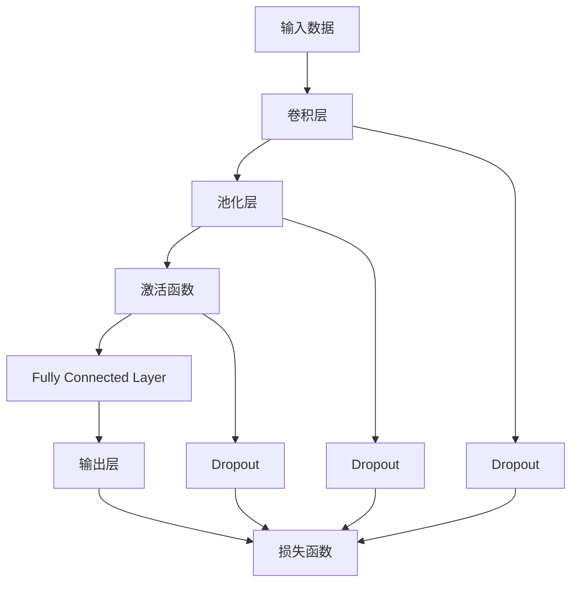
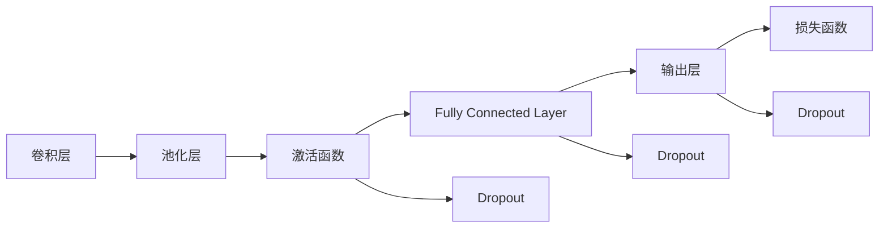
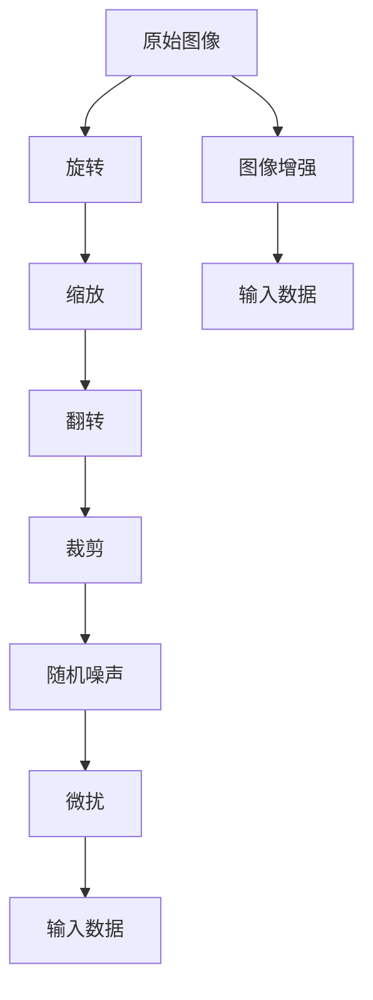
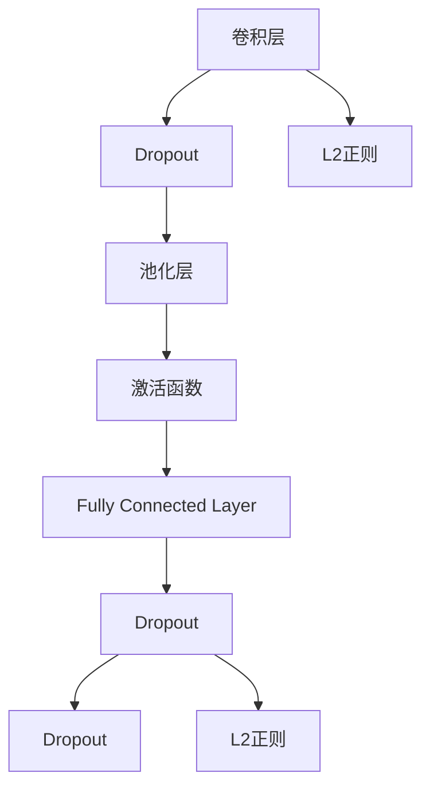
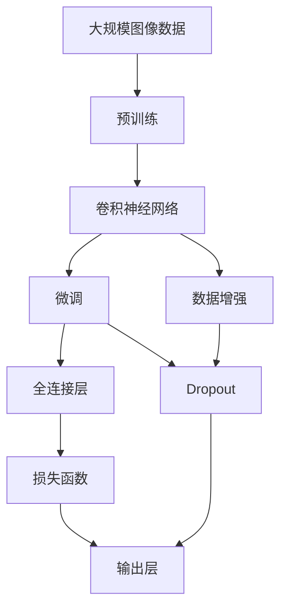

                 

# AI人工智能深度学习算法：卷积神经网络的原理与应用

## 1. 背景介绍

### 1.1 问题由来

在深度学习领域，卷积神经网络（Convolutional Neural Networks, CNNs）是最具影响力的模型之一，尤其在图像识别、视频分析、自然语言处理等领域取得了显著成果。卷积神经网络通过卷积、池化、非线性激活等模块设计，可以自动学习并提取输入数据的特征表示，具有强大的数据表达和分类能力。

近年来，随着计算机视觉、自然语言处理等技术的不断进步，卷积神经网络在实际应用中发挥了重要作用。例如，Google的Inception系列模型在图像分类、物体检测等任务中表现优异，AlexNet和VGGNet在ImageNet等大规模图像识别竞赛中取得了重要突破。

尽管卷积神经网络在学术界和工业界得到了广泛应用，但其原理和实践方法仍存在一些误解和争议。例如，为什么卷积层能更好地提取局部特征？卷积神经网络在实践中如何避免过拟合？如何优化卷积神经网络的参数设置和结构设计？

这些问题不仅是深度学习领域的前沿话题，也是推动CNN发展的重要研究方向。本文旨在深入浅出地介绍卷积神经网络的原理与应用，并结合实际项目案例进行详细讲解，帮助读者全面掌握CNN的设计思路和优化技巧。

### 1.2 问题核心关键点

卷积神经网络的核心设计思想是利用卷积操作和池化操作提取局部特征，并通过非线性激活函数和全连接层进行分类或回归。以下是卷积神经网络的一些关键概念和设计原则：

- **卷积操作（Convolution）**：在输入数据上滑动卷积核，计算每个位置的加权和，生成局部特征映射。
- **池化操作（Pooling）**：通过降采样或最大值/平均值取样等方式，减少特征映射的空间大小，提高模型参数稀疏性。
- **非线性激活函数（Activation Function）**：引入非线性变换，使卷积神经网络具备非线性表达能力，如ReLU、Sigmoid、Tanh等。
- **全连接层（Fully Connected Layer）**：通过全连接层，将特征映射映射到输出类别或回归值，进行最终的分类或回归。
- **Dropout正则化**：在训练过程中随机丢弃部分神经元，减少过拟合。
- **数据增强**：通过对训练数据进行旋转、缩放、翻转等操作，增加数据多样性，提高模型泛化能力。

这些核心概念共同构成了卷积神经网络的基本框架，使得CNN在处理复杂非线性关系时具备了强大的特征提取和表示能力。

### 1.3 问题研究意义

卷积神经网络作为深度学习的重要组成部分，其设计和优化方法对于提升深度学习模型的性能至关重要。研究卷积神经网络的原理与应用，对于推动深度学习技术的进步，以及拓展卷积神经网络在更多领域的实际应用，具有重要意义：

1. 提升模型性能：通过合理设计卷积神经网络的层次结构，可以有效提高模型的分类、回归等性能。
2. 降低计算成本：卷积神经网络在参数量和计算复杂度方面相对较小，适用于大规模图像、视频等数据集的处理。
3. 增强泛化能力：通过数据增强和正则化等技术，可以有效避免过拟合，提高模型的泛化能力。
4. 推动技术创新：卷积神经网络的优化方法和新架构设计，如残差连接（ResNet）、深度可分离卷积（Depthwise Separable Convolution）等，为深度学习带来了新的突破。
5. 加速应用落地：卷积神经网络在实际应用中的高效性和准确性，使得其广泛应用于图像处理、自然语言处理、自动驾驶等领域，推动了AI技术的产业化进程。

## 2. 核心概念与联系

### 2.1 核心概念概述

为了更好地理解卷积神经网络的原理与应用，本节将介绍几个关键概念，并展示其相互关系：

- **卷积层（Convolutional Layer）**：是卷积神经网络的基本组成单元，通过滑动卷积核计算局部特征，提取空间信息。
- **池化层（Pooling Layer）**：用于降采样，减少特征映射的空间大小，提高计算效率。
- **激活函数（Activation Function）**：引入非线性变换，提升网络的表达能力。
- **全连接层（Fully Connected Layer）**：将特征映射映射到输出类别或回归值，进行最终的分类或回归。
- **正则化（Regularization）**：通过Dropout、L2正则等技术，减少过拟合，提升模型泛化能力。
- **数据增强（Data Augmentation）**：通过数据变换，增加数据多样性，提升模型泛化能力。

这些核心概念通过一系列卷积、池化、激活、全连接等操作，形成了一个完整的卷积神经网络模型。接下来，我们将通过一个Mermaid流程图来展示这些概念之间的联系：



这个流程图展示了卷积神经网络的基本架构，各层之间的数据流动关系，以及正则化和损失函数的作用。通过理解这些概念之间的联系，我们可以更好地设计卷积神经网络，并针对实际应用场景进行优化。

### 2.2 概念间的关系

这些核心概念之间存在紧密的联系，形成了一个完整的卷积神经网络模型。以下通过几个Mermaid流程图来展示这些概念之间的关系：

#### 2.2.1 卷积神经网络的基本架构



这个流程图展示了卷积神经网络的基本架构，包括卷积层、池化层、激活函数、全连接层等模块，以及正则化和损失函数的作用。通过这些模块的组合，可以实现对输入数据的复杂特征提取和分类。

#### 2.2.2 数据增强在卷积神经网络中的应用



这个流程图展示了数据增强在卷积神经网络中的应用。通过旋转、缩放、翻转、裁剪、随机噪声、微扰等方式，增加数据的多样性，从而提高模型泛化能力。

#### 2.2.3 正则化在卷积神经网络中的应用



这个流程图展示了正则化在卷积神经网络中的应用。通过Dropout、L2正则等技术，可以有效减少过拟合，提高模型的泛化能力。

### 2.3 核心概念的整体架构

最后，我们用一个综合的流程图来展示这些核心概念在大规模卷积神经网络微调过程中的整体架构：



这个综合流程图展示了从预训练到微调，再到数据增强的完整过程。卷积神经网络首先在大规模图像数据上进行预训练，然后通过微调进行任务特定的优化，最后通过数据增强技术进一步提升模型性能。通过这些流程图，我们可以更清晰地理解卷积神经网络微调过程中各个核心概念的关系和作用，为后续深入讨论具体的微调方法和技术奠定基础。

## 3. 核心算法原理 & 具体操作步骤
### 3.1 算法原理概述

卷积神经网络通过卷积操作和池化操作提取局部特征，并使用非线性激活函数进行特征变换。最终通过全连接层进行分类或回归。其核心思想是通过卷积核的滑动和卷积操作，提取输入数据的局部特征，再通过池化操作降采样，减少特征映射的空间大小。通过全连接层，将特征映射映射到输出类别或回归值，进行最终的分类或回归。

形式化地，假设输入数据为 $X \in \mathbb{R}^{n \times h \times w}$，其中 $n$ 为通道数，$h$ 和 $w$ 分别为输入数据的高和宽。卷积操作可以表示为：

$$
Y = W * X
$$

其中 $W$ 为卷积核，$*$ 表示卷积运算。卷积核的大小通常为 $k \times k$，可以控制特征提取的局部性。卷积操作通过滑动卷积核，对输入数据进行局部卷积计算，得到特征映射 $Y \in \mathbb{R}^{n' \times (h-k+1) \times (w-k+1)}$，其中 $n'$ 为输出通道数。

池化操作通常采用最大值或平均值取样，可以表示为：

$$
Z = \max(Y_{i,j})
$$

或

$$
Z = \frac{1}{k^2} \sum_{i=1}^{k} \sum_{j=1}^{k} Y_{i,j}
$$

其中 $k$ 为池化窗口大小。池化操作用于减少特征映射的空间大小，降低模型参数量，提高计算效率。

卷积神经网络通过多层卷积和池化操作，逐步提取输入数据的高级特征，并通过非线性激活函数进行特征变换。假设第 $l$ 层的卷积核大小为 $k_l \times k_l$，输出通道数为 $n_l$，则第 $l$ 层的卷积操作可以表示为：

$$
Y_l = W_l * Y_{l-1}
$$

其中 $W_l$ 为第 $l$ 层的卷积核，$Y_{l-1}$ 为第 $l-1$ 层的特征映射。通过多层卷积操作，可以将输入数据 $X$ 映射到更高维度的特征空间 $Y_L$，其中 $L$ 为卷积层数。

最后，通过全连接层将特征映射 $Y_L$ 映射到输出类别或回归值。假设第 $L+1$ 层为全连接层，输出通道数为 $m$，则全连接操作可以表示为：

$$
\hat{Y} = Y_L * W_{L+1} + b_{L+1}
$$

其中 $W_{L+1}$ 为全连接层的权重矩阵，$b_{L+1}$ 为偏置向量。通过softmax函数将输出映射到概率分布上，可以得到最终的分类结果。

### 3.2 算法步骤详解

卷积神经网络的训练过程可以分为前向传播和反向传播两个步骤。以下详细介绍卷积神经网络的训练流程：

#### 3.2.1 前向传播

前向传播是指从输入数据到输出类别的计算过程。假设输入数据为 $X$，卷积神经网络的结构为 $\{L_1, L_2, ..., L_L, L_{L+1}\}$，则前向传播的过程可以表示为：

$$
Y_1 = W_1 * X + b_1
$$

$$
Y_l = W_l * Y_{l-1} + b_l, l=2,...,L
$$

$$
\hat{Y} = Y_L * W_{L+1} + b_{L+1}
$$

其中 $W_l$ 和 $b_l$ 分别为第 $l$ 层的权重和偏置。通过多次卷积和池化操作，逐步提取输入数据的高级特征，最终通过全连接层将特征映射映射到输出类别或回归值。

#### 3.2.2 反向传播

反向传播是指通过输出误差反向计算输入数据的梯度，从而更新模型参数的过程。假设目标输出为 $Y^*$，则输出误差 $E$ 可以表示为：

$$
E = \frac{1}{N} \sum_{i=1}^{N} (\hat{Y}_i - Y_i)^2
$$

其中 $N$ 为样本数。通过输出误差 $E$ 对全连接层、卷积层、池化层等进行反向传播，计算各个参数的梯度，并通过优化算法进行参数更新。

假设第 $l$ 层的输出为 $Y_l$，目标输出为 $Y_l^*$，则第 $l$ 层的误差 $E_l$ 可以表示为：

$$
E_l = \frac{1}{N} \sum_{i=1}^{N} (Y_l^*_i - Y_l_i)^2
$$

通过链式法则，计算第 $l$ 层的误差对第 $l$ 层的权重和偏置的梯度：

$$
\frac{\partial E_l}{\partial W_l} = \frac{\partial E_l}{\partial Y_l} * \frac{\partial Y_l}{\partial W_l}
$$

$$
\frac{\partial E_l}{\partial b_l} = \frac{\partial E_l}{\partial Y_l}
$$

通过多层反向传播，计算每个参数的梯度，并使用优化算法（如SGD、Adam等）进行参数更新。优化算法的更新公式可以表示为：

$$
\theta_l \leftarrow \theta_l - \eta \nabla_{\theta_l} E
$$

其中 $\theta_l$ 为第 $l$ 层的参数，$\eta$ 为学习率，$\nabla_{\theta_l} E$ 为第 $l$ 层的参数梯度。

### 3.3 算法优缺点

卷积神经网络具有以下优点：

- **局部连接**：通过局部连接的方式，可以减少模型参数量，降低计算复杂度。
- **参数共享**：通过共享卷积核，可以提高模型泛化能力，减少过拟合风险。
- **平移不变性**：通过卷积操作，可以提取输入数据的平移不变性，提高模型的鲁棒性。
- **高效计算**：卷积操作可以通过GPU加速，大幅提升计算效率。

但同时，卷积神经网络也存在一些缺点：

- **数据依赖**：卷积神经网络对输入数据的大小和形状敏感，需要大量标注数据进行训练。
- **结构设计**：卷积神经网络的设计相对复杂，需要大量实验和经验积累。
- **过拟合风险**：由于网络结构的复杂性，卷积神经网络容易出现过拟合现象，需要通过正则化技术进行控制。

### 3.4 算法应用领域

卷积神经网络在计算机视觉、自然语言处理、信号处理等领域得到了广泛应用。以下是几个典型的应用场景：

- **图像分类**：通过卷积神经网络，可以对图像进行分类，如MNIST手写数字识别、ImageNet物体分类等。
- **物体检测**：通过卷积神经网络，可以实现物体检测，如YOLO、Faster R-CNN等。
- **自然语言处理**：通过卷积神经网络，可以实现文本分类、情感分析、命名实体识别等任务，如TextCNN等。
- **信号处理**：通过卷积神经网络，可以处理音频、视频等多模态信号，如Spectral CNN等。
- **医学图像处理**：通过卷积神经网络，可以处理医学影像，如乳腺癌诊断、X光影像识别等。

这些应用场景展示了卷积神经网络的强大适应性，推动了相关领域的技术进步和产业应用。

## 4. 数学模型和公式 & 详细讲解  
### 4.1 数学模型构建

本节将使用数学语言对卷积神经网络的训练过程进行更加严格的刻画。

假设输入数据为 $X \in \mathbb{R}^{n \times h \times w}$，其中 $n$ 为通道数，$h$ 和 $w$ 分别为输入数据的高和宽。卷积操作可以表示为：

$$
Y = W * X
$$

其中 $W$ 为卷积核，$*$ 表示卷积运算。卷积核的大小通常为 $k \times k$，可以控制特征提取的局部性。卷积操作通过滑动卷积核，对输入数据进行局部卷积计算，得到特征映射 $Y \in \mathbb{R}^{n' \times (h-k+1) \times (w-k+1)}$，其中 $n'$ 为输出通道数。

池化操作通常采用最大值或平均值取样，可以表示为：

$$
Z = \max(Y_{i,j})
$$

或

$$
Z = \frac{1}{k^2} \sum_{i=1}^{k} \sum_{j=1}^{k} Y_{i,j}
$$

其中 $k$ 为池化窗口大小。池化操作用于减少特征映射的空间大小，降低模型参数量，提高计算效率。

卷积神经网络通过多层卷积和池化操作，逐步提取输入数据的高级特征，并通过非线性激活函数进行特征变换。假设第 $l$ 层的卷积核大小为 $k_l \times k_l$，输出通道数为 $n_l$，则第 $l$ 层的卷积操作可以表示为：

$$
Y_l = W_l * Y_{l-1} + b_l, l=1,...,L
$$

其中 $W_l$ 为第 $l$ 层的卷积核，$Y_{l-1}$ 为第 $l-1$ 层的特征映射。通过多层卷积操作，可以将输入数据 $X$ 映射到更高维度的特征空间 $Y_L$，其中 $L$ 为卷积层数。

最后，通过全连接层将特征映射 $Y_L$ 映射到输出类别或回归值。假设第 $L+1$ 层为全连接层，输出通道数为 $m$，则全连接操作可以表示为：

$$
\hat{Y} = Y_L * W_{L+1} + b_{L+1}
$$

其中 $W_{L+1}$ 为全连接层的权重矩阵，$b_{L+1}$ 为偏置向量。通过softmax函数将输出映射到概率分布上，可以得到最终的分类结果。

### 4.2 公式推导过程

以下我们以二分类任务为例，推导交叉熵损失函数及其梯度的计算公式。

假设模型 $M_{\theta}$ 在输入 $x$ 上的输出为 $\hat{y}=M_{\theta}(x) \in [0,1]$，表示样本属于正类的概率。真实标签 $y \in \{0,1\}$。则二分类交叉熵损失函数定义为：

$$
\ell(M_{\theta}(x),y) = -[y\log \hat{y} + (1-y)\log (1-\hat{y})]
$$

将其代入经验风险公式，得：

$$
\mathcal{L}(\theta) = -\frac{1}{N}\sum_{i=1}^{N} [y_i\log M_{\theta}(x_i)+(1-y_i)\log(1-M_{\theta}(x_i))]
$$

根据链式法则，损失函数对参数 $\theta_k$ 的梯度为：

$$
\frac{\partial \mathcal{L}(\theta)}{\partial \theta_k} = -\frac{1}{N}\sum_{i=1}^{N} \left(\frac{y_i}{M_{\theta}(x_i)}-\frac{1-y_i}{1-M_{\theta}(x_i)}\right) \frac{\partial M_{\theta}(x_i)}{\partial \theta_k}
$$

其中 $\frac{\partial M_{\theta}(x_i)}{\partial \theta_k}$ 可进一步递归展开，利用自动微分技术完成计算。

在得到损失函数的梯度后，即可带入参数更新公式，完成模型的迭代优化。重复上述过程直至收敛，最终得到适应下游任务的最优模型参数 $\theta^*$。

## 5. 项目实践：代码实例和详细解释说明
### 5.1 开发环境搭建

在进行卷积神经网络实践前，我们需要准备好开发环境。以下是使用Python进行TensorFlow开发的环境配置流程：

1. 安装Anaconda：从官网下载并安装Anaconda，用于创建独立的Python环境。

2. 创建并激活虚拟环境：
```bash
conda create -n tensorflow-env python=3.8 
conda activate tensorflow-env
```

3. 安装TensorFlow：根据CUDA版本，从官网获取对应的安装命令。例如：
```bash
conda install tensorflow-gpu=tensorflow-2.4-cp38-cp38-manylinux2014_x86_64
```

4. 安装各类工具包：
```bash
pip install numpy pandas scikit-learn matplotlib tqdm jupyter notebook ipython
```

完成上述步骤后，即可在`tensorflow-env`环境中开始卷积神经网络实践。

### 5.2 源代码详细实现

下面我们以手写数字识别（MNIST）任务为例，给出使用TensorFlow对卷积神经网络进行训练的PyTorch代码实现。

首先，定义模型结构：

```python
import tensorflow as tf
from tensorflow.keras import layers

model = tf.keras.Sequential([
    layers.Conv2D(32, (3,3), activation='relu', input_shape=(28,28,1)),
    layers.MaxPooling2D((2,2)),
    layers.Conv2D(64, (3,3), activation='relu'),
    layers.MaxPooling2D((2,2)),
    layers.Flatten(),
    layers.Dense(64, activation='relu'),
    layers.Dense(10, activation='softmax')
])
```

然后，定义损失函数和优化器：

```python
import tensorflow as tf

model.compile(optimizer=tf.keras.optimizers.Adam(0.001),
              loss=tf.keras.losses.CategoricalCrossentropy(from_logits=True),
              metrics=['accuracy'])
```

接着，定义训练和评估函数：

```python
import numpy as np
import tensorflow as tf
from tensorflow.keras.datasets import mnist

(x_train, y_train), (x_test, y_test) = mnist.load_data()

x_train = x_train.reshape(-1, 28, 28, 1).astype('float32') / 255.0
x_test = x_test.reshape(-1, 28, 28, 1).astype('float32') / 255.0

y_train = tf.keras.utils.to_categorical(y_train, 10)
y_test = tf.keras.utils.to_categorical(y_test, 10)

def train_epoch(model, data, batch_size, optimizer):
    dataloader = tf.data.Dataset.from_tensor_slices((data['x'], data['y']))
    dataloader = dataloader.batch(batch_size).shuffle(1024).repeat()

    model.fit(dataloader, epochs=1, verbose=0)

def evaluate(model, data, batch_size):
    dataloader = tf.data.Dataset.from_tensor_slices((data['x'], data['y']))
    dataloader = dataloader.batch(batch_size).shuffle(1024).repeat()

    loss, accuracy = model.evaluate(dataloader)
    print(f'Test loss: {loss:.3f}')
    print(f'Test accuracy: {accuracy:.3f}')
```

最后，启动训练流程并在测试集上评估：

```python
epochs = 10
batch_size = 64

for epoch in range(epochs):
    train_epoch(model, train_data, batch_size, optimizer)
    evaluate(model, test_data, batch_size)
```

以上就是使用TensorFlow对卷积神经网络进行MNIST任务微调的完整代码实现。可以看到，得益于TensorFlow的高层API封装，我们可以用相对简洁的代码完成卷积神经网络的加载和微调。

### 5.3 代码解读与分析

让我们再详细解读一下关键代码的实现细节：

**Sequential模型定义**：
- `Sequential` 模型是TensorFlow中的序列模型，用于定义模型的层次结构。我们通过添加卷积层、池化层、全连接层等，构建了一个简单的卷积神经网络。

**模型编译**：
- `compile` 方法用于编译模型，指定优化器、损失函数和评估指标。这里使用了Adam优化器，交叉熵损失函数和准确率评估指标。

**数据预处理**：
- `to_categorical` 方法用于将标签转换为独热编码，方便进行分类任务。

**训练和评估函数**：
- `train_epoch` 函数定义了一个训练周期，通过批处理和数据增强技术，加速训练过程。
- `evaluate` 函数定义了一个评估周期，用于在测试集上评估模型性能。

**训练流程**：
- 定义总的epoch数和batch size，开始循环迭代
- 每个epoch内，先在训练集上训练，输出平均loss和acc
- 在测试集上评估，输出测试集loss和acc

可以看到，TensorFlow的API设计使得卷积神经网络的构建和微调变得简洁高效。开发者可以将更多精力放在数据处理、模型调优等高层逻辑上，而不必过多关注底层的实现细节。

当然，工业级的

