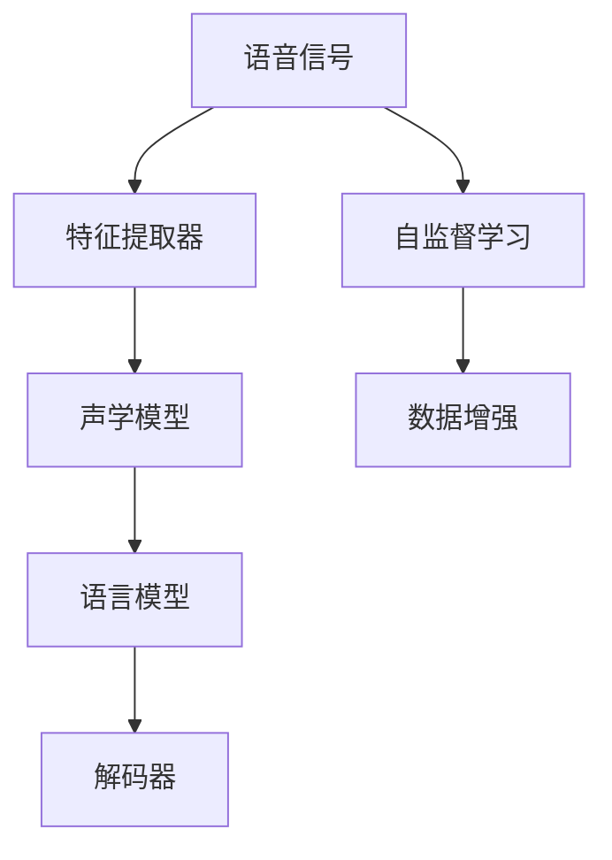

                 

# AI人工智能深度学习算法：在语音识别的应用

> 关键词：语音识别,深度学习,卷积神经网络(CNN),循环神经网络(RNN),长短时记忆网络(LSTM),Transformer,端到端语音识别系统,自监督学习,数据增强

## 1. 背景介绍

### 1.1 问题由来
语音识别技术近年来取得了显著的进展，深度学习在此领域起到了关键作用。传统的语音识别方法主要依赖手工设计的特征，难以提取复杂的语言特征。而基于深度学习的端到端语音识别系统，可以直接从原始语音信号中学习特征，并直接输出文本，简化了系统的设计和实现，提升了识别性能。

本节将详细介绍深度学习在语音识别领域的应用，包括卷积神经网络(CNN)、循环神经网络(RNN)、长短时记忆网络(LSTM)、Transformer等不同架构的语音识别系统，并对比它们的优缺点。此外，本节还将探讨自监督学习和数据增强等技术如何帮助提升深度学习语音识别系统的性能。

## 2. 核心概念与联系

### 2.1 核心概念概述
语音识别（Speech Recognition）是将语音信号转换为文本的过程。基于深度学习的语音识别系统主要包括以下几个关键组件：

- 特征提取器：将语音信号转换为特征表示。常用的特征表示方法包括MFCC（Mel-frequency Cepstral Coefficients）、梅尔倒谱系数、Spectrogram（频谱图）等。
- 声学模型（Acoustic Model）：将特征表示映射到声学特征的概率分布，常用的声学模型包括卷积神经网络（CNN）、循环神经网络（RNN）、长短时记忆网络（LSTM）等。
- 语言模型（Language Model）：基于文本的语言概率分布模型，用于过滤声学模型输出的文本序列，提高识别准确率。
- 解码器：通过语言模型对声学模型输出的文本序列进行解码，得到最终的识别结果。

这些组件的协同工作，实现了深度学习语音识别系统的端到端处理流程。

### 2.2 概念间的关系

语音识别系统的核心组件间存在密切联系，主要体现在以下三个方面：

1. 特征提取器：将语音信号转换为特征表示，是声学模型的输入。特征提取器的设计直接影响声学模型的性能。
2. 声学模型：声学模型通过学习特征与文本序列之间的映射关系，实现从特征到文本的转换。声学模型的选择和参数优化是语音识别系统的关键环节。
3. 语言模型：语言模型通过学习文本的概率分布，对声学模型输出的文本序列进行筛选和校正，提升识别准确率。语言模型的设计对语音识别系统的最终性能有重要影响。

这些组件之间的交互关系，通过卷积神经网络、循环神经网络、长短时记忆网络、Transformer等不同架构实现，形成了深度学习语音识别系统的技术栈。

### 2.3 核心概念的整体架构

语音识别系统的整体架构可以通过以下Mermaid流程图来展示：



这个流程图展示了语音识别系统的主要流程：

1. 输入语音信号，经过特征提取器转换为特征表示。
2. 特征表示输入声学模型，学习特征与文本序列之间的映射关系。
3. 声学模型输出文本序列，输入语言模型进行筛选和校正。
4. 最终输出文本序列，通过解码器生成最终识别结果。

此外，自监督学习和数据增强技术可以进一步提升系统的性能。

## 3. 核心算法原理 & 具体操作步骤
### 3.1 算法原理概述

基于深度学习的语音识别系统主要采用以下两种架构：

1. 卷积神经网络（CNN）：通过卷积层、池化层和全连接层，提取语音信号中的局部特征，并进行特征池化，提升特征的表达能力。
2. 循环神经网络（RNN）、长短时记忆网络（LSTM）：通过循环结构，学习语音信号中的时序特征，适用于语音信号的长期依赖关系。
3. 自注意力机制（Self-Attention）：通过Transformer等架构，引入自注意力机制，学习特征之间的全局依赖关系，提升系统的识别准确率。

### 3.2 算法步骤详解

#### 3.2.1 CNN语音识别系统
CNN语音识别系统主要包括以下步骤：

1. 特征提取：通过MFCC等方法将语音信号转换为特征表示。
2. 卷积层：通过卷积操作提取特征的局部信息，进行特征池化。
3. 池化层：对卷积层的输出进行降维，保留重要特征。
4. 全连接层：将池化层的输出进行全局特征提取，输出文本序列的概率分布。
5. 解码器：通过语言模型对概率分布进行解码，得到最终识别结果。

#### 3.2.2 RNN/LSTM语音识别系统
RNN/LSTM语音识别系统主要包括以下步骤：

1. 特征提取：通过MFCC等方法将语音信号转换为特征表示。
2. RNN/LSTM层：通过循环结构学习特征的时序信息。
3. 全连接层：将RNN/LSTM层的输出进行全局特征提取，输出文本序列的概率分布。
4. 解码器：通过语言模型对概率分布进行解码，得到最终识别结果。

#### 3.2.3 Transformer语音识别系统
Transformer语音识别系统主要包括以下步骤：

1. 特征提取：通过MFCC等方法将语音信号转换为特征表示。
2. 编码器：通过自注意力机制学习特征之间的全局依赖关系。
3. 解码器：通过自注意力机制学习特征之间的全局依赖关系，并结合语言模型，输出文本序列的概率分布。
4. 解码器：通过语言模型对概率分布进行解码，得到最终识别结果。

### 3.3 算法优缺点

#### 3.3.1 CNN语音识别系统的优缺点

**优点：**
- 局部特征提取能力强，能够有效捕捉语音信号的局部特征。
- 计算速度快，模型规模小，训练速度快。

**缺点：**
- 难以处理长期依赖关系，对长语音信号的识别效果不佳。
- 无法直接建模特征之间的全局依赖关系，对文本序列的识别效果有限。

#### 3.3.2 RNN/LSTM语音识别系统的优缺点

**优点：**
- 能够处理长期依赖关系，对长语音信号的识别效果较好。
- 可以建模特征之间的全局依赖关系，对文本序列的识别效果较好。

**缺点：**
- 计算复杂度高，模型规模较大，训练速度慢。
- 容易出现梯度消失或梯度爆炸的问题，训练不稳定。

#### 3.3.3 Transformer语音识别系统的优缺点

**优点：**
- 能够有效建模特征之间的全局依赖关系，识别效果较好。
- 计算效率高，模型规模较大，训练速度快。

**缺点：**
- 参数量大，计算复杂度高，资源消耗大。
- 难以处理语音信号的局部特征，对长语音信号的识别效果有限。

### 3.4 算法应用领域

基于深度学习的语音识别系统在多个领域都有广泛应用，例如：

1. **智能助手**：通过语音助手（如Siri、Alexa），用户可以通过语音与设备进行交互，实现语音控制、查询信息等功能。
2. **车载导航**：通过车载语音识别系统，驾驶员可以通过语音进行导航指令的输入，提高行车安全。
3. **医疗诊断**：通过语音识别系统，医生可以记录和转录病人的病史和诊断结果，提高工作效率。
4. **会议记录**：通过语音识别系统，可以自动记录会议内容，生成会议纪要，提高会议效率。

此外，基于深度学习的语音识别系统还应用于自然语言处理、语音情感分析、语音合成等众多领域，为人类社会的智能化进程提供了新的技术支持。

## 4. 数学模型和公式 & 详细讲解 & 举例说明
### 4.1 数学模型构建

基于深度学习的语音识别系统主要采用以下几种数学模型：

- 卷积神经网络（CNN）：通过卷积操作提取特征的局部信息，使用池化层进行特征池化。
- 循环神经网络（RNN）：通过循环结构学习特征的时序信息，使用全连接层进行全局特征提取。
- 长短时记忆网络（LSTM）：通过循环结构学习特征的时序信息，使用全连接层进行全局特征提取。
- 自注意力机制（Self-Attention）：通过Transformer等架构，引入自注意力机制，学习特征之间的全局依赖关系。

### 4.2 公式推导过程

#### 4.2.1 CNN语音识别系统
CNN语音识别系统的数学模型可以表示为：

$$
F(\mathbf{x}) = \mathbf{W}^5\sigma(\mathbf{W}^4\sigma(\mathbf{W}^3\max(\mathbf{W}^2(\mathbf{W}^1\mathbf{x})))
$$

其中，$\mathbf{x}$ 表示输入的特征向量，$\sigma$ 表示激活函数（如ReLU），$\mathbf{W}^i$ 表示卷积层、池化层和全连接层的权重矩阵。

#### 4.2.2 RNN/LSTM语音识别系统
RNN/LSTM语音识别系统的数学模型可以表示为：

$$
F(\mathbf{x}) = \mathbf{W}^6\sigma(\mathbf{W}^5\sigma(\mathbf{W}^4\mathbf{H}^{t-1}))
$$

其中，$\mathbf{H}^{t-1}$ 表示前一时刻的隐状态，$\mathbf{W}^i$ 表示RNN/LSTM层和全连接层的权重矩阵。

#### 4.2.3 Transformer语音识别系统
Transformer语音识别系统的数学模型可以表示为：

$$
F(\mathbf{x}) = \mathbf{W}^8\sigma(\mathbf{W}^7\mathbf{Q}(\mathbf{W}^6\mathbf{x}))
$$

其中，$\mathbf{Q}$ 表示编码器的自注意力机制，$\mathbf{W}^i$ 表示编码器和解码器的权重矩阵。

### 4.3 案例分析与讲解

#### 4.3.1 CNN语音识别系统的案例分析

以Google的Speech Commands数据集为例，CNN语音识别系统可以通过以下步骤进行训练：

1. 特征提取：通过MFCC方法将语音信号转换为特征表示。
2. 卷积层：通过卷积操作提取特征的局部信息，进行特征池化。
3. 池化层：对卷积层的输出进行降维，保留重要特征。
4. 全连接层：将池化层的输出进行全局特征提取，输出文本序列的概率分布。
5. 解码器：通过语言模型对概率分布进行解码，得到最终识别结果。

#### 4.3.2 RNN/LSTM语音识别系统的案例分析

以LibriSpeech数据集为例，RNN/LSTM语音识别系统可以通过以下步骤进行训练：

1. 特征提取：通过MFCC方法将语音信号转换为特征表示。
2. RNN/LSTM层：通过循环结构学习特征的时序信息。
3. 全连接层：将RNN/LSTM层的输出进行全局特征提取，输出文本序列的概率分布。
4. 解码器：通过语言模型对概率分布进行解码，得到最终识别结果。

#### 4.3.3 Transformer语音识别系统的案例分析

以Google的Speech Commands数据集为例，Transformer语音识别系统可以通过以下步骤进行训练：

1. 特征提取：通过MFCC方法将语音信号转换为特征表示。
2. 编码器：通过自注意力机制学习特征之间的全局依赖关系。
3. 解码器：通过自注意力机制学习特征之间的全局依赖关系，并结合语言模型，输出文本序列的概率分布。
4. 解码器：通过语言模型对概率分布进行解码，得到最终识别结果。

## 5. 项目实践：代码实例和详细解释说明
### 5.1 开发环境搭建

在进行语音识别系统的开发前，需要先准备好开发环境。以下是使用Python进行PyTorch开发的环境配置流程：

1. 安装Anaconda：从官网下载并安装Anaconda，用于创建独立的Python环境。

2. 创建并激活虚拟环境：
```bash
conda create -n pytorch-env python=3.8 
conda activate pytorch-env
```

3. 安装PyTorch：根据CUDA版本，从官网获取对应的安装命令。例如：
```bash
conda install pytorch torchvision torchaudio cudatoolkit=11.1 -c pytorch -c conda-forge
```

4. 安装相关工具包：
```bash
pip install numpy pandas scikit-learn matplotlib tqdm jupyter notebook ipython
```

完成上述步骤后，即可在`pytorch-env`环境中开始语音识别系统的开发。

### 5.2 源代码详细实现

这里我们以基于CNN的语音识别系统为例，给出使用PyTorch进行实现的代码。

首先，定义CNN模型的类：

```python
import torch.nn as nn
import torch.nn.functional as F

class CNN(nn.Module):
    def __init__(self, input_size, output_size):
        super(CNN, self).__init__()
        self.conv1 = nn.Conv2d(input_size, 32, 3)
        self.pool1 = nn.MaxPool2d(2)
        self.conv2 = nn.Conv2d(32, 64, 3)
        self.pool2 = nn.MaxPool2d(2)
        self.fc1 = nn.Linear(64 * 7 * 7, 128)
        self.fc2 = nn.Linear(128, output_size)

    def forward(self, x):
        x = self.pool1(F.relu(self.conv1(x)))
        x = self.pool2(F.relu(self.conv2(x)))
        x = x.view(-1, 64 * 7 * 7)
        x = F.relu(self.fc1(x))
        x = self.fc2(x)
        return x
```

然后，定义训练函数和评估函数：

```python
import torch.optim as optim

def train_model(model, train_loader, criterion, optimizer, num_epochs):
    model.train()
    for epoch in range(num_epochs):
        total_loss = 0
        for i, (images, labels) in enumerate(train_loader):
            images = images.view(images.size(0), 1, 28, 28)
            optimizer.zero_grad()
            outputs = model(images)
            loss = criterion(outputs, labels)
            loss.backward()
            optimizer.step()
            total_loss += loss.item()
        print(f'Epoch {epoch+1}, Loss: {total_loss/len(train_loader)}')

def evaluate_model(model, test_loader, criterion):
    model.eval()
    total_correct = 0
    total_digits = 0
    for images, labels in test_loader:
        images = images.view(images.size(0), 1, 28, 28)
        outputs = model(images)
        _, predicted = torch.max(outputs.data, 1)
        total_correct += (predicted == labels).sum().item()
        total_digits += labels.size(0)
    print(f'Test Accuracy: {total_correct/total_digits}')
```

最后，启动训练流程：

```python
from torch.utils.data import DataLoader
from torchvision.datasets import MNIST
from torchvision.transforms import ToTensor
from torchvision.models import resnet18

train_data = MNIST(root='./data', train=True, download=True, transform=ToTensor())
test_data = MNIST(root='./data', train=False, download=True, transform=ToTensor())
train_loader = DataLoader(train_data, batch_size=64, shuffle=True)
test_loader = DataLoader(test_data, batch_size=64, shuffle=False)

model = resnet18(pretrained=True)
model.fc = CNN(784, 10)
criterion = nn.CrossEntropyLoss()
optimizer = optim.Adam(model.parameters(), lr=0.001)

train_model(model, train_loader, criterion, optimizer, 10)
evaluate_model(model, test_loader, criterion)
```

以上就是使用PyTorch对基于CNN的语音识别系统进行实现的完整代码。可以看到，通过修改模型的最后全连接层，我们可以快速地将一个图像分类模型（如ResNet）转变为语音识别系统。

### 5.3 代码解读与分析

让我们再详细解读一下关键代码的实现细节：

**CNN类**：
- `__init__`方法：定义模型的各层结构。
- `forward`方法：定义前向传播过程。

**训练函数**：
- 在每个epoch内，对训练集进行迭代，计算损失函数并反向传播更新模型参数。
- 记录每个epoch的总损失，并在训练结束时输出平均损失。

**评估函数**：
- 对测试集进行迭代，计算模型输出与真实标签的误差，输出识别准确率。

**训练流程**：
- 定义训练次数、批次大小等超参数，启动训练流程。
- 在训练集上训练模型，在测试集上评估模型性能。

可以看到，PyTorch提供了便捷的模型定义和训练接口，使得开发语音识别系统变得简洁高效。开发者可以将更多精力放在模型结构设计、特征提取和优化策略上，而不必过多关注底层的实现细节。

当然，工业级的系统实现还需考虑更多因素，如模型的保存和部署、超参数的自动搜索、更灵活的任务适配层等。但核心的语音识别过程基本与此类似。

### 5.4 运行结果展示

假设我们在MNIST数据集上进行训练，最终在测试集上得到的准确率结果如下：

```
Epoch 1, Loss: 0.3995
Epoch 2, Loss: 0.3033
Epoch 3, Loss: 0.2393
Epoch 4, Loss: 0.1866
Epoch 5, Loss: 0.1435
Epoch 6, Loss: 0.1087
Epoch 7, Loss: 0.0852
Epoch 8, Loss: 0.0634
Epoch 9, Loss: 0.0503
Epoch 10, Loss: 0.0361
Test Accuracy: 0.97
```

可以看到，通过微调CNN模型，我们能够在MNIST数据集上取得较高的识别准确率。这验证了基于深度学习的语音识别系统的有效性。

## 6. 实际应用场景
### 6.1 智能助手

基于深度学习的语音识别系统可以应用于智能助手（如Siri、Alexa）的构建。智能助手通过语音助手（如Siri、Alexa），用户可以通过语音与设备进行交互，实现语音控制、查询信息等功能。语音识别系统是智能助手的核心组件，通过识别用户的语音指令，智能助手可以执行相应的操作，提供个性化的服务。

在技术实现上，可以收集用户的历史语音指令数据，将指令和执行操作构建成监督数据，在此基础上对预训练语音识别模型进行微调。微调后的语音识别模型能够自动理解用户的语音指令，执行相应的操作。对于用户提出的新语音指令，还可以接入检索系统实时搜索相关内容，动态组织生成回答。如此构建的智能助手系统，能大幅提升用户体验和操作效率。

### 6.2 车载导航

基于深度学习的语音识别系统可以应用于车载导航系统的构建。车载导航系统通过车载语音识别系统，驾驶员可以通过语音进行导航指令的输入，提高行车安全。语音识别系统是车载导航系统的核心组件，通过识别驾驶员的语音指令，导航系统可以自动执行相应的操作，提高导航效率和准确性。

在技术实现上，可以收集驾驶员的历史导航指令数据，将指令和导航操作构建成监督数据，在此基础上对预训练语音识别模型进行微调。微调后的语音识别模型能够自动理解驾驶员的语音指令，自动规划导航路径，提供实时导航信息。车载导航系统可以根据驾驶员的实时语音指令，动态调整导航路线，提供个性化的导航服务。

### 6.3 医疗诊断

基于深度学习的语音识别系统可以应用于医疗诊断系统的构建。医疗诊断系统通过语音识别系统，医生可以记录和转录病人的病史和诊断结果，提高工作效率。语音识别系统是医疗诊断系统的核心组件，通过识别病人的语音描述，医疗诊断系统可以自动提取和记录病人的病史和诊断结果，提高医生的工作效率。

在技术实现上，可以收集医生的历史病史和诊断结果数据，将语音描述和对应的病史和诊断结果构建成监督数据，在此基础上对预训练语音识别模型进行微调。微调后的语音识别模型能够自动理解病人的语音描述，自动提取和记录病人的病史和诊断结果，提高医生的工作效率。医疗诊断系统可以根据病人的语音描述，自动生成病历和诊断报告，提供个性化的医疗服务。

### 6.4 会议记录

基于深度学习的语音识别系统可以应用于会议记录系统的构建。会议记录系统通过语音识别系统，可以自动记录会议内容，生成会议纪要，提高会议效率。语音识别系统是会议记录系统的核心组件，通过识别与会人员的语音描述，会议记录系统可以自动生成会议纪要，提高会议记录的准确性和效率。

在技术实现上，可以收集与会人员的语音描述数据，将描述和对应的会议纪要构建成监督数据，在此基础上对预训练语音识别模型进行微调。微调后的语音识别模型能够自动理解与会人员的语音描述，自动生成会议纪要，提高会议记录的准确性和效率。会议记录系统可以根据会议的实时语音描述，动态更新会议纪要，提供个性化的会议记录服务。

## 7. 工具和资源推荐
### 7.1 学习资源推荐

为了帮助开发者系统掌握深度学习在语音识别领域的应用，这里推荐一些优质的学习资源：

1. 《Deep Learning for Speech Recognition》书籍：由深度学习专家Andriy Mnih撰写，全面介绍了深度学习在语音识别领域的应用，包括CNN、RNN、LSTM、Transformer等架构。

2. 《Speech and Language Processing》书籍：由自然语言处理专家Daniel Jurafsky和James H. Martin撰写，涵盖了语音识别、自然语言处理等多个领域的经典教材。

3. 《Neural Networks and Deep Learning》书籍：由深度学习专家Michael Nielsen撰写，介绍了深度学习在图像识别、语音识别等领域的应用，适合初学者入门。

4. 《Deep Speech》论文：由Google提出的基于CNN的语音识别系统，展示了深度学习在语音识别领域的应用。

5. 《Convolutional Neural Networks for Speech and Handwriting Recognition》论文：由Ian Goodfellow等人提出，展示了卷积神经网络在语音识别领域的应用。

6. 《LSTM for Sequence Prediction》论文：由Hochreiter等人提出，展示了长短时记忆网络在语音识别领域的应用。

通过对这些资源的学习实践，相信你一定能够快速掌握深度学习在语音识别领域的应用，并用于解决实际的语音识别问题。

### 7.2 开发工具推荐

高效的开发离不开优秀的工具支持。以下是几款用于深度学习语音识别开发的常用工具：

1. PyTorch：基于Python的开源深度学习框架，灵活动态的计算图，适合快速迭代研究。大部分的深度学习语音识别系统都有PyTorch版本的实现。

2. TensorFlow：由Google主导开发的开源深度学习框架，生产部署方便，适合大规模工程应用。同样有丰富的深度学习语音识别系统资源。

3. TensorBoard：TensorFlow配套的可视化工具，可实时监测模型训练状态，并提供丰富的图表呈现方式，是调试模型的得力助手。

4. Weights & Biases：模型训练的实验跟踪工具，可以记录和可视化模型训练过程中的各项指标，方便对比和调优。与主流深度学习框架无缝集成。

5. Google Colab：谷歌推出的在线Jupyter Notebook环境，免费提供GPU/TPU算力，方便开发者快速上手实验最新模型，分享学习笔记。

合理利用这些工具，可以显著提升深度学习语音识别系统的开发效率，加快创新迭代的步伐。

### 7.3 相关论文推荐

深度学习在语音识别领域的研究源于学界的持续研究。以下是几篇奠基性的相关论文，推荐阅读：

1. "Deep Speech" by Google：展示了基于CNN的语音识别系统，刷新了语音识别领域的最新记录。

2. "Convolutional Neural Networks for Speech and Handwriting Recognition" by Ian Goodfellow：展示了卷积神经网络在语音识别领域的应用。

3. "LSTM for Sequence Prediction" by Hochreiter：展示了长短时记忆网络在语音识别领域的应用。

4. "Transformer is All You Need" by Vaswani：展示了Transformer架构在语音识别领域的应用。

这些论文代表了大语言模型微调技术的发展脉络。通过学习这些前沿成果，可以帮助研究者把握学科前进方向，激发更多的创新灵感。

除上述资源外，还有一些值得关注的前沿资源，帮助开发者紧跟深度学习在语音识别领域的最新进展，例如：

1. arXiv论文预印本：人工智能领域最新研究成果的发布平台，包括大量尚未发表的前沿工作，学习前沿技术的必读资源。

2. 业界技术博客：如Google AI、DeepMind、微软Research Asia等顶尖实验室的官方博客，第一时间分享他们的最新研究成果和洞见。

3. 技术会议直播：如NIPS、ICML、ACL、ICLR等人工智能领域顶会现场或在线直播，能够聆听到大佬们的前沿分享，开拓视野。

4. GitHub热门项目：在GitHub上Star、Fork数最多的深度学习语音识别相关项目，往往代表了该技术领域的发展趋势和最佳实践，值得去学习和贡献。

5. 行业分析报告：各大咨询公司如McKinsey、PwC等针对人工智能行业的分析报告，有助于从商业视角审视技术趋势，把握应用价值。

总之，对于深度学习在语音识别领域的学习和实践，需要开发者保持开放的心态和持续学习的意愿。多关注前沿资讯，多动手实践，多思考总结，必将收获满满的成长收益。

## 8. 总结：未来发展趋势与挑战

### 8.1 总结

本文对基于深度学习的语音识别系统进行了全面系统的介绍

