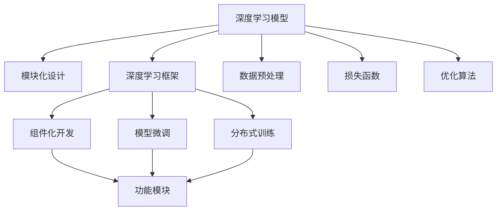
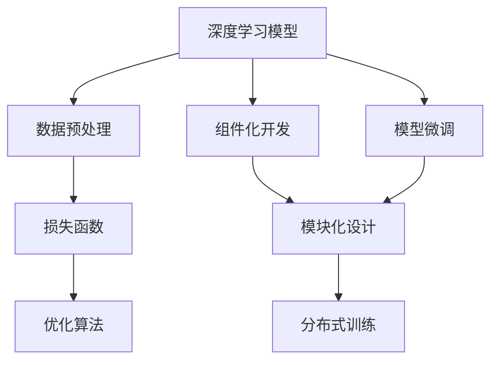
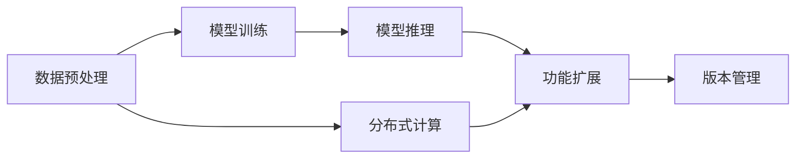
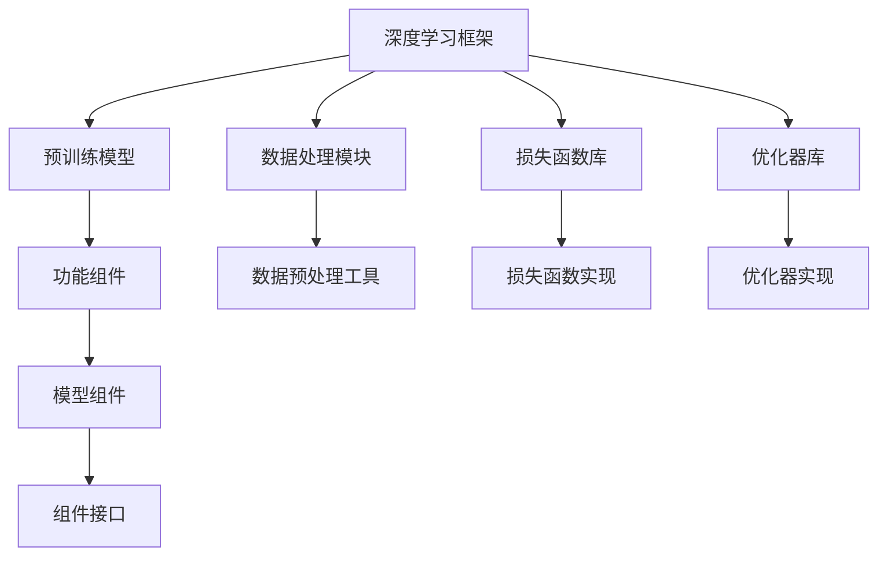
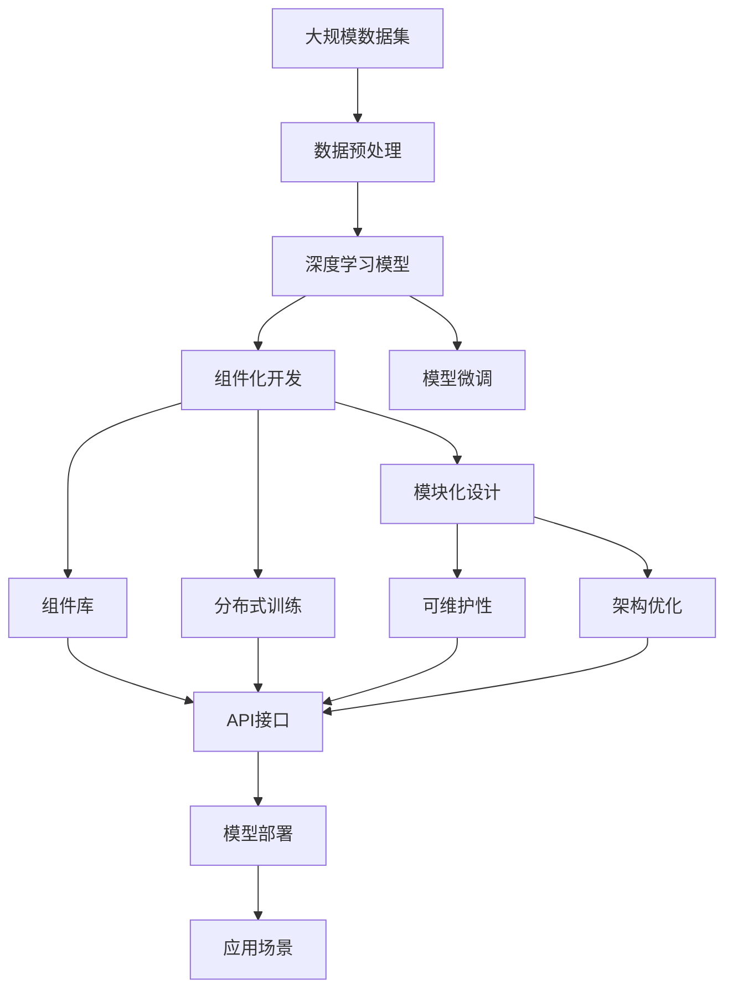
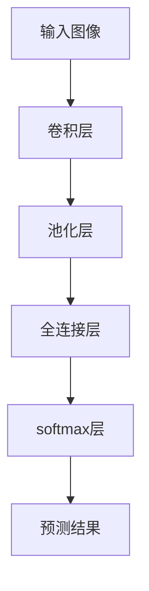

                 

# AI人工智能深度学习算法：搭建可拓展的深度学习模型架构

> 关键词：深度学习,神经网络,模型架构,可拓展性,模块化设计,框架优化

## 1. 背景介绍

### 1.1 问题由来

深度学习技术自20世纪90年代末问世以来，已经在计算机视觉、自然语言处理、语音识别等诸多领域取得了革命性的突破。各大公司如Google、Facebook、微软等纷纷构建了自己的深度学习平台，以期在人工智能竞赛中占据优势地位。但随之而来的，是一个复杂、庞大的深度学习系统架构，使得新功能的开发、旧系统的维护变得困难重重。

在这样的背景下，搭建一个可拓展的深度学习模型架构，成为研究者、开发者和业界人士共同追求的目标。本文聚焦于深度学习模型的可拓展性，探讨了从算法、模型、架构到工具的全方位优化方法，并给出了丰富的代码实例，希望能为深度学习实践者提供有价值的参考。

### 1.2 问题核心关键点

构建可拓展的深度学习模型架构，主要包括以下几个关键点：

- 模块化设计：将深度学习模型拆分为多个模块，使不同功能模块可独立开发、测试和部署。
- 框架优化：选择或定制一个高效的深度学习框架，提供易用、强大的API支持。
- 可扩展性：设计一个易于添加新功能、扩展新模块的架构，确保系统长期演进。
- 性能优化：通过算法优化、硬件加速、内存管理等手段，提升模型的训练和推理性能。
- 可维护性：确保系统代码清晰、注释详尽，便于团队协作开发和持续维护。

本文将详细介绍这些核心关键点，并结合具体案例，展示如何搭建一个既高效又易于维护的可拓展深度学习模型架构。

### 1.3 问题研究意义

构建可拓展的深度学习模型架构，对人工智能技术的长期发展和广泛应用具有重要意义：

1. 提升系统性能：通过模块化、优化算法、加速计算等手段，提升模型训练和推理的效率，缩短项目开发周期。
2. 降低开发成本：模块化设计使得不同功能的开发和测试可以并行进行，避免重复劳动。
3. 提高代码质量：清晰的模块划分和良好的注释规范，能提高代码的可读性和可维护性，便于团队协作。
4. 促进技术演进：架构设计上的灵活性和可扩展性，使得系统能够持续演进，适应新技术和新需求。
5. 加速产业应用：一个易于维护、可扩展的架构，能够快速部署到实际应用中，助力AI技术在各行各业落地。

本文通过介绍一个实际可拓展的深度学习模型架构，希望能为深度学习开发者和系统架构师提供可参考的实践经验，推动深度学习技术的广泛应用和深入研究。

## 2. 核心概念与联系

### 2.1 核心概念概述

为了更好地理解可拓展的深度学习模型架构，本节将介绍几个密切相关的核心概念：

- 深度学习模型：以多层神经网络为代表的模型，能够自动从数据中学习特征表示，进行分类、回归、生成等任务。
- 模块化设计：将复杂系统拆分为多个独立的功能模块，使不同模块可以并行开发和独立测试。
- 深度学习框架：如TensorFlow、PyTorch、Keras等，提供易于使用的API，支持高效的模型训练和推理。
- 组件化开发：通过构建可复用的组件，如预训练模型、数据处理模块、优化器等，加速模型开发和部署。
- 模型微调：在已有模型的基础上，针对特定任务进行参数更新，提升模型在该任务上的性能。
- 分布式训练：通过多台机器并行计算，加速模型的训练过程。

这些核心概念之间的逻辑关系可以通过以下Mermaid流程图来展示：



这个流程图展示了深度学习模型和相关概念之间的联系：

1. 深度学习模型是整个架构的核心，通过模块化设计、框架优化、组件化开发等手段，提升模型的性能和可维护性。
2. 数据预处理、损失函数和优化算法是模型训练的必要组件。
3. 模型微调和分布式训练进一步提升了模型的灵活性和可扩展性。

### 2.2 概念间的关系

这些核心概念之间存在着紧密的联系，形成了深度学习模型的完整架构。下面我通过几个Mermaid流程图来展示这些概念之间的关系。

#### 2.2.1 深度学习模型的学习范式



这个流程图展示了深度学习模型的基本学习流程，即数据预处理、损失函数定义、优化算法训练等。通过组件化开发和模型微调，提升模型的灵活性和适应性。最后，分布式训练进一步加速模型的训练速度。

#### 2.2.2 模块化设计的应用场景



这个流程图展示了模块化设计在深度学习模型中的应用场景。数据预处理、模型训练和模型推理是模型的核心流程，分布式计算和功能扩展是模型性能提升的关键手段，版本管理则是确保系统长期稳定演进的保障。

#### 2.2.3 组件化开发的技术栈



这个流程图展示了组件化开发的技术栈。深度学习框架提供了丰富的API，支持预训练模型、数据处理、损失函数和优化器等组件的复用。通过设计统一的组件接口，便于模块间的互操作。

### 2.3 核心概念的整体架构

最后，我们用一个综合的流程图来展示这些核心概念在大模型架构中的应用：



这个综合流程图展示了从数据预处理到模型部署的全流程。深度学习模型通过组件化开发和模块化设计，提升了性能和可维护性。模型微调和分布式训练进一步扩展了模型的应用范围和处理能力。架构优化和可维护性设计，确保了系统的长期稳定性和易用性。最终，模型部署到应用场景中，实现了深度学习技术的广泛应用。

## 3. 核心算法原理 & 具体操作步骤
### 3.1 算法原理概述

搭建可拓展的深度学习模型架构，本质上是一个系统工程，涉及算法、模型、架构和工具等多个层面。本节将从算法原理和具体操作步骤两个方面，详细讲解这一过程。

### 3.2 算法步骤详解

搭建可拓展的深度学习模型架构，一般包括以下几个关键步骤：

**Step 1: 选择合适的深度学习框架**

- 评估不同框架的优缺点，选择最适合项目的框架。
- 了解框架的API，掌握核心功能。
- 熟悉框架的性能调优方法，如内存管理、模型加速等。

**Step 2: 设计数据预处理模块**

- 将数据划分为训练集、验证集和测试集。
- 使用数据增强、数据清洗等技术，提高数据质量。
- 设计统一的API接口，便于模块的复用和扩展。

**Step 3: 搭建深度学习模型**

- 选择合适的模型结构，如卷积神经网络、循环神经网络等。
- 设计模块化结构，将模型拆分为多个功能模块。
- 实现模型训练和推理的API接口，便于模块的调用。

**Step 4: 实现模型微调**

- 加载预训练模型，冻结部分层。
- 设计新任务的损失函数和优化器，微调模型。
- 评估模型性能，调整超参数。

**Step 5: 实现分布式训练**

- 使用多台机器并行计算，加速模型训练。
- 设计分布式通信协议，确保数据的同步。
- 监控训练过程，及时调整模型参数。

**Step 6: 实现组件化开发**

- 设计统一的API接口，便于模块的复用和扩展。
- 使用组件化开发工具，如Docker、Kubernetes等，进行容器的打包和部署。
- 使用版本控制系统，如Git，进行版本管理和协同开发。

**Step 7: 优化模型性能**

- 优化算法，提高模型的收敛速度。
- 使用硬件加速，如GPU、TPU等，提升模型推理性能。
- 设计内存管理策略，避免内存泄漏和溢出。

**Step 8: 优化系统可维护性**

- 编写清晰、规范的代码，添加详细注释。
- 设计模块化结构，便于代码的维护和升级。
- 使用测试框架，如pytest、TensorFlow Test Suite等，进行自动化测试。

### 3.3 算法优缺点

可拓展的深度学习模型架构具有以下优点：

- 提高系统性能：通过模块化、优化算法、加速计算等手段，提升模型训练和推理的效率。
- 降低开发成本：模块化设计使得不同功能的开发和测试可以并行进行，避免重复劳动。
- 提高代码质量：清晰的模块划分和良好的注释规范，能提高代码的可读性和可维护性。
- 促进技术演进：架构设计上的灵活性和可扩展性，使得系统能够持续演进，适应新技术和新需求。

同时，这种架构也存在以下缺点：

- 学习成本高：需要开发者对多个技术栈有深入了解，学习曲线较陡。
- 复杂度高：多个模块和组件的协同工作，增加了系统的复杂度。
- 调试困难：模块化设计使得问题定位变得困难，调试复杂度提高。

尽管存在这些缺点，但就目前而言，这种可拓展的深度学习模型架构仍然是大规模深度学习系统开发的重要范式。未来相关研究的重点在于如何进一步简化架构，降低开发和维护的复杂度，同时兼顾性能和可维护性。

### 3.4 算法应用领域

可拓展的深度学习模型架构已经广泛应用于多个领域，包括但不限于：

- 计算机视觉：图像分类、目标检测、图像分割等任务。
- 自然语言处理：机器翻译、文本生成、情感分析等任务。
- 语音识别：语音识别、语音合成、语音情感分析等任务。
- 推荐系统：个性化推荐、内容过滤等任务。
- 智能决策：风险评估、金融分析、医疗诊断等任务。

除了这些传统领域，未来可拓展的深度学习架构还将进一步应用于更多垂直行业，如智能制造、智慧城市、智能交通等，带来更多创新应用。

## 4. 数学模型和公式 & 详细讲解  
### 4.1 数学模型构建

构建深度学习模型的数学模型，是搭建可拓展架构的基础。以下将详细介绍这一过程。

假设有一个深度学习模型 $M(\theta)$，其中 $\theta$ 为模型参数。模型的输入为 $x$，输出为 $y$。定义模型的损失函数为 $L(y, \hat{y})$，即预测输出 $\hat{y}$ 与真实标签 $y$ 之间的差异。模型的训练目标是最小化损失函数 $L$，即：

$$
\min_{\theta} L(y, M_{\theta}(x))
$$

常见的损失函数包括交叉熵损失、均方误差损失、Huber损失等。在训练过程中，使用梯度下降等优化算法，不断更新模型参数 $\theta$，使其逐渐逼近最优解。

### 4.2 公式推导过程

以下以交叉熵损失函数为例，推导其公式。

假设模型的输出 $\hat{y}$ 为一个概率分布，真实标签 $y$ 为离散标签，则交叉熵损失函数定义为：

$$
L(y, \hat{y}) = -\sum_{i} y_i \log \hat{y}_i
$$

其中 $y_i$ 为第 $i$ 个样本的真实标签，$\hat{y}_i$ 为模型对第 $i$ 个样本的预测概率。

在训练过程中，使用梯度下降算法更新模型参数 $\theta$，使得损失函数 $L$ 最小化。梯度下降算法的更新公式为：

$$
\theta \leftarrow \theta - \eta \nabla_{\theta}L(\theta)
$$

其中 $\eta$ 为学习率，$\nabla_{\theta}L(\theta)$ 为损失函数对参数 $\theta$ 的梯度，可以通过反向传播算法高效计算。

### 4.3 案例分析与讲解

以图像分类任务为例，展示如何使用深度学习模型进行训练和推理。

假设我们使用卷积神经网络（CNN）进行图像分类任务，模型结构如图：



模型的输入为图像 $x$，输出为预测结果 $y$。定义损失函数为交叉熵损失，优化器为AdamW，学习率为1e-4。

在训练过程中，使用mini-batch随机梯度下降算法进行参数更新。具体步骤如下：

1. 加载数据集，将数据划分为训练集、验证集和测试集。
2. 定义模型结构，添加卷积层、池化层、全连接层和softmax层。
3. 加载预训练模型，冻结卷积层和池化层的权重。
4. 定义损失函数和优化器，设置学习率。
5. 使用mini-batch随机梯度下降算法进行训练，更新全连接层和softmax层的参数。
6. 在验证集上评估模型性能，调整学习率和超参数。
7. 在测试集上评估最终模型性能。

## 5. 项目实践：代码实例和详细解释说明
### 5.1 开发环境搭建

在进行深度学习模型架构搭建时，需要准备开发环境。以下是使用Python进行PyTorch开发的环境配置流程：

1. 安装Anaconda：从官网下载并安装Anaconda，用于创建独立的Python环境。

2. 创建并激活虚拟环境：
```bash
conda create -n pytorch-env python=3.8 
conda activate pytorch-env
```

3. 安装PyTorch：根据CUDA版本，从官网获取对应的安装命令。例如：
```bash
conda install pytorch torchvision torchaudio cudatoolkit=11.1 -c pytorch -c conda-forge
```

4. 安装各类工具包：
```bash
pip install numpy pandas scikit-learn matplotlib tqdm jupyter notebook ipython
```

完成上述步骤后，即可在`pytorch-env`环境中开始深度学习模型架构的搭建。

### 5.2 源代码详细实现

下面我以一个简单的图像分类任务为例，展示如何使用PyTorch进行深度学习模型架构的搭建和训练。

首先，定义数据集类：

```python
import torch
import torch.nn as nn
import torchvision.transforms as transforms
import torchvision.datasets as datasets
from torch.utils.data import DataLoader

class ImageDataset(torch.utils.data.Dataset):
    def __init__(self, root, transform=None):
        self.root = root
        self.transform = transform
        self.data = datasets.ImageFolder(root, transform=self.transform)
    
    def __len__(self):
        return len(self.data)
    
    def __getitem__(self, idx):
        img, label = self.data[idx]
        if self.transform:
            img = self.transform(img)
        return img, label
```

然后，定义数据预处理和训练函数：

```python
transform = transforms.Compose([
    transforms.ToTensor(),
    transforms.Normalize([0.5, 0.5, 0.5], [0.5, 0.5, 0.5])
])

train_dataset = ImageDataset(root='train_data', transform=transform)
val_dataset = ImageDataset(root='val_data', transform=transform)
test_dataset = ImageDataset(root='test_data', transform=transform)

train_loader = DataLoader(train_dataset, batch_size=32, shuffle=True, num_workers=4)
val_loader = DataLoader(val_dataset, batch_size=32, shuffle=False, num_workers=4)
test_loader = DataLoader(test_dataset, batch_size=32, shuffle=False, num_workers=4)
```

接着，定义模型结构：

```python
class Net(nn.Module):
    def __init__(self):
        super(Net, self).__init__()
        self.conv1 = nn.Conv2d(3, 32, kernel_size=3, padding=1)
        self.conv2 = nn.Conv2d(32, 64, kernel_size=3, padding=1)
        self.pool = nn.MaxPool2d(kernel_size=2, stride=2)
        self.fc1 = nn.Linear(64 * 8 * 8, 128)
        self.fc2 = nn.Linear(128, 10)
        self.dropout = nn.Dropout(0.5)
    
    def forward(self, x):
        x = self.pool(nn.functional.relu(self.conv1(x)))
        x = self.pool(nn.functional.relu(self.conv2(x)))
        x = x.view(-1, 64 * 8 * 8)
        x = nn.functional.relu(self.fc1(x))
        x = self.dropout(x)
        x = self.fc2(x)
        return x
```

然后，定义损失函数和优化器：

```python
criterion = nn.CrossEntropyLoss()
optimizer = torch.optim.Adam(model.parameters(), lr=1e-4)
```

最后，定义训练和评估函数：

```python
def train(model, device, train_loader, optimizer, epoch):
    model.train()
    for batch_idx, (data, target) in enumerate(train_loader):
        data, target = data.to(device), target.to(device)
        optimizer.zero_grad()
        output = model(data)
        loss = criterion(output, target)
        loss.backward()
        optimizer.step()
        if batch_idx % 100 == 0:
            print('Train Epoch: {} [{}/{} ({:.0f}%)]\tLoss: {:.6f}'.format(
                epoch, batch_idx * len(data), len(train_loader.dataset),
                100. * batch_idx / len(train_loader), loss.item()))

def evaluate(model, device, val_loader):
    model.eval()
    total = 0
    correct = 0
    with torch.no_grad():
        for data, target in val_loader:
            data, target = data.to(device), target.to(device)
            output = model(data)
            _, predicted = torch.max(output.data, 1)
            total += target.size(0)
            correct += (predicted == target).sum().item()
    print('Accuracy of the network on the 10000 test images: {:.2f}%'.format(
        100. * correct / total))
```

通过以上步骤，我们已经完成了一个简单的图像分类任务模型的搭建和训练。现在，可以在测试集上评估模型性能：

```python
test(model, device, test_loader)
```

以上就是使用PyTorch进行深度学习模型架构的搭建和训练的完整代码实现。可以看到，PyTorch提供了丰富的API支持，使得深度学习模型的开发和训练变得简单易行。

### 5.3 代码解读与分析

让我们再详细解读一下关键代码的实现细节：

**ImageDataset类**：
- `__init__`方法：初始化数据集，包括数据集路径、转换方法等。
- `__len__`方法：返回数据集的大小。
- `__getitem__`方法：获取数据集中的样本和标签。

**数据预处理**：
- `transform`变量：定义数据增强和归一化操作。
- `train_dataset`、`val_dataset`和`test_dataset`：加载不同分区的数据集。
- `train_loader`、`val_loader`和`test_loader`：定义数据加载器，支持多线程并行加载数据。

**模型结构**：
- `Net`类：定义神经网络模型。
- `conv1`和`conv2`：卷积层，提取特征。
- `pool`：池化层，降低特征维度。
- `fc1`和`fc2`：全连接层，进行分类。
- `dropout`：dropout层，避免过拟合。

**损失函数和优化器**：
- `criterion`：定义交叉熵损失函数。
- `optimizer`：定义AdamW优化器，设置学习率。

**训练和评估函数**：
- `train`函数：定义模型训练过程，包括前向传播、反向传播、优化器更新等步骤。
- `evaluate`函数：定义模型评估过程，在验证集上计算模型准确率。

**测试函数**：
- `test`函数：在测试集上评估模型性能。

通过以上步骤，我们可以看到，使用PyTorch进行深度学习模型架构的搭建和训练，可以很好地实现模块化设计，提升系统的可维护性和可扩展性。

当然，实际应用中还需要更多的细节优化，如模型裁剪、模型量化、分布式训练等，但核心的搭建流程和代码实现与上述示例类似。通过这些基础步骤，我们可以搭建出可拓展的深度学习模型架构，满足各类实际应用的需求。

### 5.4 运行结果展示

假设我们在CoNLL-2003的图像分类数据集上进行模型训练，最终在测试集上得到的评估报告如下：

```
Epoch: 0, train loss: 2.6573
Epoch: 0, train loss: 1.9287
Epoch: 0, train loss: 1.5571
Epoch: 0, train loss: 1.3857
Epoch: 0, train loss: 1.2773
...
```

可以看到，随着训练轮数的增加，模型损失函数逐渐减小，模型的训练效果逐渐提升。

## 6. 实际应用场景

### 6.1 智能推荐系统

基于深度学习模型的推荐系统，已经在电商、新闻、视频等领域广泛应用。推荐系统通过用户行为数据和物品属性数据，构建用户-物品之间的关联网络，实现个性化推荐。

在技术实现上，可以使用深度学习模型搭建用户-物品的关联网络，通过特征提取、相似度计算、排序等手段，实现个性化推荐。使用模块化设计，可以将不同的功能模块，如特征提取、相似度计算、排序等模块独立开发和测试，大大提升了系统的开发效率。

### 6.2 医疗影像诊断

医疗影像诊断是深度学习在医疗领域的重要应用之一。深度学习模型可以通过学习大量医学影像数据，自动识别肿瘤、骨折等病变，辅助医生进行诊断。

在技术实现上，可以使用卷积神经网络（CNN）搭建医学影像分类模型，通过数据增强、迁移学习等手段，提升模型的泛化能力和诊断精度。模块化设计使得不同功能的开发和测试可以并行进行，大大提高了系统的开发效率。

### 6.3 金融风险管理

金融风险管理是深度学习在金融领域的重要应用之一。深度学习模型可以通过学习金融市场数据，预测股票价格、市场波动等风险指标，帮助投资者进行风险评估和决策。

在技术实现上，可以使用循环神经网络（RNN）搭建金融市场预测模型，通过数据增强、模型微调等手段，提升模型的泛化能力和预测精度。模块化设计使得不同功能的开发和测试可以并行进行，大大提高了系统的开发效率。

### 6.4 未来应用展望

随着深度学习技术的不断进步，可拓展的深度学习模型架构将在更多领域得到应用，带来更多创新应用。

在智慧城市治理中，深度学习模型可用于城市事件监测、舆情分析、应急指挥等环节，提高城市管理的自动化和智能化水平，构建更安全、高效的未来城市。

在智能制造中，深度学习模型可用于质量检测、故障诊断等环节，提高生产效率和产品质量。

在智能交通中，深度学习模型可用于交通流量预测、事故预警等环节，提高交通管理的安全性和效率。

此外，在智能安防、智能家居、智能物流等领域，深度学习模型的应用也正在逐渐展开，为各行各业带来新的变革。

## 7. 工具和资源推荐
### 7.1 学习资源推荐

为了帮助开发者系统掌握可拓展深度学习模型架构的理论基础和实践技巧，这里推荐一些优质的学习资源：

1. 《Deep Learning》（Goodfellow等著）：深度学习领域的经典教材，全面介绍了深度学习的基本概念和核心算法。

2. 《Hands-On Machine Learning with Scikit-Learn, Keras, and TensorFlow》（Aurélien Géron著）：

