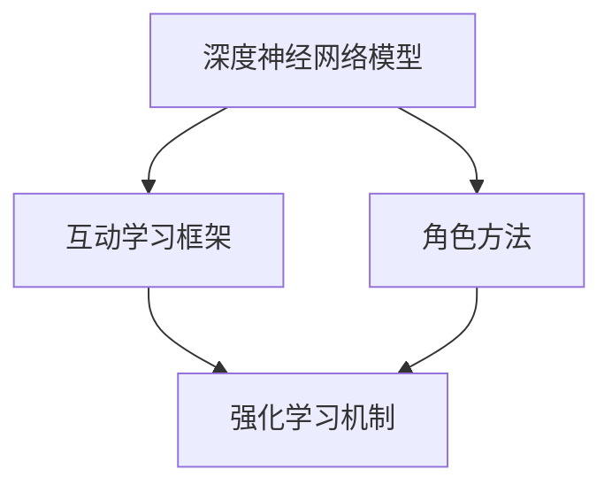
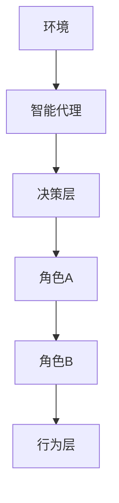
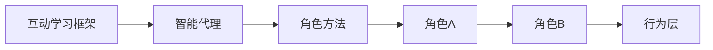
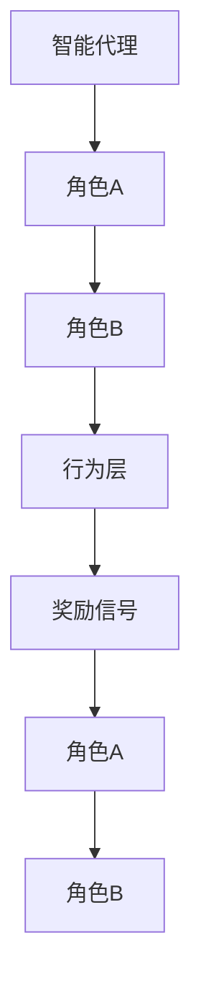
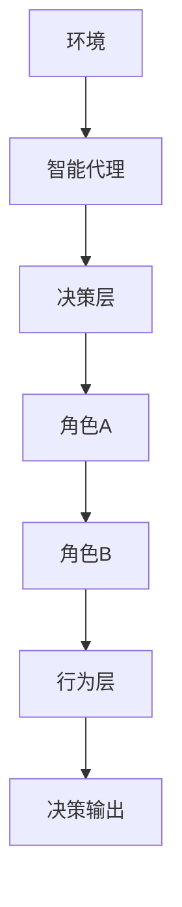

                 

# AI人工智能深度学习算法：智能深度学习代理的互动学习与角色方法

> 关键词：
> - 深度学习
> - 智能代理
> - 互动学习
> - 角色方法
> - 强化学习
> - 多智能体系统
> - 神经网络

## 1. 背景介绍

### 1.1 问题由来
随着人工智能技术的迅猛发展，深度学习在诸多领域展现了惊人的潜力，从计算机视觉到自然语言处理，从自动驾驶到机器人控制，深度学习技术已经成为推动人工智能技术发展的重要驱动力。然而，传统的监督学习、无监督学习等方法在处理复杂、动态环境时，存在着诸多局限性，无法适应快速变化的现实世界。

强化学习作为深度学习领域的新兴分支，以其动态、互动的特性，在多个领域取得了突破性进展。特别是在智能代理、多智能体系统等复杂环境中，强化学习展示出了强大的适应能力。但传统强化学习面临的一个显著问题是，缺乏对环境交互过程的建模能力，无法有效利用人类专家的经验知识，导致智能代理的决策过程缺乏足够的可解释性和指导性。

针对这些问题，研究者提出了基于深度学习的互动学习与角色方法，试图通过构建智能代理的互动学习框架，更好地模拟人类决策过程，提升智能代理的智能水平和决策能力。本文将深入探讨这一新兴研究范式，并给出具体的技术细节与实现方法。

### 1.2 问题核心关键点
基于深度学习的互动学习与角色方法，其核心思想是利用深度神经网络作为智能代理的核心模型，通过与环境的互动学习，不断优化代理的行为策略。具体来说，其关键点包括：

1. **深度神经网络模型**：作为智能代理的核心决策引擎，深度神经网络能够处理复杂的非线性特征，适应复杂环境的变化。
2. **互动学习框架**：通过与环境的不断交互，智能代理能够根据反馈信息调整策略，逐步提升决策能力。
3. **角色方法**：利用角色方法，可以将复杂的决策过程拆分为多个子角色，每个角色负责特定的决策任务，从而简化模型训练和推理过程。
4. **强化学习机制**：通过强化学习机制，智能代理能够根据奖励信号调整策略，逐步优化决策行为。

这些关键点共同构成了基于深度学习的智能代理互动学习与角色方法的核心理论框架，其目的在于构建更智能、更可靠、更可解释的智能代理系统。

### 1.3 问题研究意义
研究基于深度学习的智能代理互动学习与角色方法，对于提升人工智能技术在复杂环境下的决策能力，增强智能代理的可解释性和可控性，具有重要意义：

1. **提升决策能力**：通过互动学习与角色方法，智能代理能够更好地模拟人类决策过程，提升在复杂环境中的决策能力，特别是在动态、不确定性高的场景下。
2. **增强可解释性**：角色方法将复杂决策过程拆分为多个子角色，每个角色负责特定的决策任务，提升了智能代理的决策可解释性，使得人类专家能够更容易理解和调试智能代理的行为。
3. **实现自主学习**：强化学习机制使得智能代理能够自主地从环境互动中学习，提升智能代理的自主学习能力和自适应性。
4. **增强系统可靠性**：通过将智能代理的决策过程拆分为多个角色，增强了系统的冗余性和可靠性，提升了系统的稳定性和健壮性。
5. **推动技术进步**：互动学习与角色方法为人工智能技术的发展提供了新的思路和方法，推动了人工智能技术在更多领域的应用和普及。

## 2. 核心概念与联系

### 2.1 核心概念概述

为更好地理解基于深度学习的互动学习与角色方法，本节将介绍几个密切相关的核心概念：

- **深度神经网络模型**：深度神经网络（DNN），作为智能代理的核心决策引擎，通过多层非线性变换，能够处理复杂的非线性特征，适应复杂环境的变化。
- **互动学习框架**：互动学习框架，是指智能代理与环境之间的交互学习过程，智能代理通过与环境互动，不断调整策略，提升决策能力。
- **角色方法**：角色方法，是指将复杂决策过程拆分为多个子角色，每个角色负责特定的决策任务，从而简化模型训练和推理过程。
- **强化学习机制**：强化学习机制，是指智能代理通过奖励信号调整策略，逐步优化决策行为的过程。

这些核心概念之间的逻辑关系可以通过以下Mermaid流程图来展示：



这个流程图展示了大语言模型微调过程中各个核心概念的关系和作用：

1. 深度神经网络模型作为智能代理的核心，提供了强大的决策能力。
2. 互动学习框架通过环境与智能代理的交互，不断调整策略，提升决策能力。
3. 角色方法将复杂决策过程拆分为多个子角色，简化模型训练和推理。
4. 强化学习机制通过奖励信号调整策略，优化决策行为。

这些概念共同构成了基于深度学习的智能代理互动学习与角色方法的完整生态系统，使得智能代理能够在复杂环境中展现更强的智能性和可解释性。

### 2.2 概念间的关系

这些核心概念之间存在着紧密的联系，形成了基于深度学习的智能代理互动学习与角色方法的完整生态系统。下面我通过几个Mermaid流程图来展示这些概念之间的关系。

#### 2.2.1 智能代理的决策过程



这个流程图展示了智能代理的决策过程：
- 环境向智能代理发送交互请求。
- 智能代理根据角色方法，将决策过程拆分为多个子角色。
- 每个角色独立处理决策任务，并将结果传递给行为层。
- 行为层整合所有角色的决策结果，生成最终决策。

#### 2.2.2 互动学习与角色方法的结合



这个流程图展示了互动学习与角色方法的结合过程：
- 智能代理通过与环境互动，获得反馈信息。
- 角色方法将决策过程拆分为多个子角色，每个角色独立学习。
- 互动学习框架根据反馈信息调整角色策略，逐步优化决策行为。
- 行为层整合所有角色的决策结果，生成最终决策。

#### 2.2.3 强化学习机制的作用



这个流程图展示了强化学习机制的作用：
- 智能代理通过与环境互动，获得奖励信号。
- 角色A和角色B根据奖励信号调整策略，逐步优化决策行为。
- 行为层整合所有角色的决策结果，生成最终决策。

### 2.3 核心概念的整体架构

最后，我们用一个综合的流程图来展示这些核心概念在大语言模型微调过程中的整体架构：



这个综合流程图展示了从环境到决策输出的完整过程：
- 环境向智能代理发送交互请求。
- 智能代理根据角色方法，将决策过程拆分为多个子角色。
- 每个角色独立处理决策任务，并将结果传递给行为层。
- 行为层整合所有角色的决策结果，生成最终决策。
- 最终决策输出，供智能代理进一步决策。

通过这些流程图，我们可以更清晰地理解基于深度学习的智能代理互动学习与角色方法的各个核心概念的关系和作用，为后续深入讨论具体的技术细节奠定基础。

## 3. 核心算法原理 & 具体操作步骤
### 3.1 算法原理概述

基于深度学习的智能代理互动学习与角色方法，本质上是一个动态的决策优化过程。其核心思想是：通过深度神经网络模型，构建一个能够自主学习、自主决策的智能代理，并利用互动学习与角色方法，提升智能代理在复杂环境中的决策能力。

形式化地，假设智能代理 $A$ 在环境 $E$ 中学习决策，其策略为 $\pi$，目标是最大化累积奖励 $R$。则在环境 $E$ 下，智能代理的决策过程可以表示为：

$$
\pi^* = \mathop{\arg\max}_{\pi} \mathbb{E}_{e \sim E} [R(\pi, e)]
$$

其中 $\mathbb{E}_{e \sim E}$ 表示在环境 $E$ 中随机采样样本 $e$ 的期望值。智能代理 $A$ 通过与环境 $E$ 的互动学习，不断调整策略 $\pi$，使得期望累积奖励 $R$ 最大化。

### 3.2 算法步骤详解

基于深度学习的智能代理互动学习与角色方法一般包括以下几个关键步骤：

**Step 1: 设计角色模型**

在智能代理的决策过程中，需要设计多个子角色，每个角色负责特定的决策任务。角色模型可以采用多种深度神经网络模型，如CNN、RNN、Transformer等。角色的划分需要根据具体任务的特点进行设计，通常会考虑任务的复杂度和所需能力。

**Step 2: 定义角色间的协作机制**

设计好角色模型后，需要定义角色间的协作机制，使得角色能够协同工作，提升决策效果。协作机制可以采用多种方法，如规则调度、概率转移、软角色等。

**Step 3: 构建互动学习框架**

构建互动学习框架，将智能代理与环境进行互动，不断调整策略，提升决策能力。互动学习框架可以采用多种强化学习算法，如Q-learning、DQN、PPO等。

**Step 4: 优化决策策略**

通过互动学习框架，智能代理在环境中不断学习，调整策略，逐步优化决策过程。

**Step 5: 部署与应用**

最后，将优化的智能代理部署到实际应用场景中，进行实际测试和应用，不断迭代和优化。

### 3.3 算法优缺点

基于深度学习的智能代理互动学习与角色方法具有以下优点：

1. **增强决策能力**：通过互动学习与角色方法，智能代理能够更好地模拟人类决策过程，提升在复杂环境中的决策能力。
2. **提高可解释性**：角色方法将复杂决策过程拆分为多个子角色，每个角色负责特定的决策任务，提升了智能代理的决策可解释性，使得人类专家能够更容易理解和调试智能代理的行为。
3. **实现自主学习**：强化学习机制使得智能代理能够自主地从环境互动中学习，提升智能代理的自主学习能力和自适应性。
4. **增强系统可靠性**：通过将智能代理的决策过程拆分为多个角色，增强了系统的冗余性和可靠性，提升了系统的稳定性和健壮性。

同时，该方法也存在一些局限性：

1. **数据需求较大**：角色模型的训练需要大量的标注数据，特别是在角色间协作机制的构建上，数据需求较大。
2. **模型复杂度高**：由于需要设计多个角色模型，模型结构复杂度较高，训练和推理开销较大。
3. **优化难度大**：优化决策策略是一个复杂的过程，特别是在角色间协作机制的构建上，需要更多的经验和技巧。

尽管存在这些局限性，但就目前而言，基于深度学习的智能代理互动学习与角色方法是处理复杂决策问题的有力工具，具有广阔的应用前景。

### 3.4 算法应用领域

基于深度学习的智能代理互动学习与角色方法，在多个领域中都有应用：

- **智能机器人控制**：在机器人控制中，智能代理需要与环境进行互动，不断调整决策策略，实现机器人的自主导航和避障。
- **自动驾驶**：在自动驾驶中，智能代理需要与道路环境进行互动，不断优化决策策略，实现车辆的自主驾驶。
- **智能推荐系统**：在推荐系统中，智能代理需要与用户进行互动，不断调整推荐策略，提升推荐效果。
- **医疗诊断**：在医疗诊断中，智能代理需要与医生进行互动，不断优化诊断策略，提升诊断准确性。
- **金融交易**：在金融交易中，智能代理需要与市场环境进行互动，不断优化交易策略，提升交易收益。

除了上述这些经典领域外，基于深度学习的智能代理互动学习与角色方法在更多领域中也有广泛应用，如智慧城市、智能家居、工业控制等，为这些领域的智能化转型提供了新的解决方案。

## 4. 数学模型和公式 & 详细讲解  
### 4.1 数学模型构建

本节将使用数学语言对基于深度学习的智能代理互动学习与角色方法进行更加严格的刻画。

记智能代理 $A$ 在环境 $E$ 中的决策过程为 $A:E \rightarrow [\mathcal{A}]$，其中 $\mathcal{A}$ 为动作空间。假设智能代理在时间步 $t$ 的策略为 $\pi_t$，状态为 $s_t$，则决策过程可以表示为：

$$
A: s_t \rightarrow a_t \sim \pi_t
$$

其中 $a_t$ 为智能代理在时间步 $t$ 的动作。

### 4.2 公式推导过程

以下我们以智能机器人控制为例，推导智能代理的决策过程和互动学习框架。

假设智能代理 $A$ 在二维平面上移动，需要避开障碍物并到达目标位置。假设状态空间 $S$ 为位置集合，动作空间 $A$ 为四个方向（上、下、左、右）。智能代理的决策过程可以表示为：

$$
A: (s_t, h_t) \rightarrow a_t \sim \pi_t
$$

其中 $h_t$ 为智能代理在时间步 $t$ 的决策层输出，表示每个角色对决策的贡献。

定义智能代理在状态 $s_t$ 下的奖励函数 $R(s_t,a_t,s_{t+1})$，表示智能代理在状态 $s_t$ 下采取动作 $a_t$，到达下一个状态 $s_{t+1}$ 后的累积奖励。

定义智能代理的策略 $ \pi$，表示智能代理在每个状态下的决策概率分布。

通过强化学习机制，智能代理的策略可以表示为：

$$
\pi = \mathop{\arg\max}_{\pi} \mathbb{E}_{(s_t,a_t,s_{t+1}) \sim (P,A)} [R(s_t,a_t,s_{t+1})]
$$

其中 $P$ 为环境的转移概率，$A$ 为动作空间。

在训练过程中，智能代理通过与环境互动，不断调整策略 $\pi$，使得期望累积奖励 $R$ 最大化。

### 4.3 案例分析与讲解

假设我们设计了一个包含两个角色的智能代理，用于控制一个无人车在复杂环境中导航。角色A负责感知和定位，角色B负责避障和决策。

角色A的决策过程可以表示为：

$$
A: (s_t, h_t) \rightarrow z_t \sim \pi_A
$$

其中 $z_t$ 为角色A的决策层输出，表示感知结果。

角色B的决策过程可以表示为：

$$
B: (s_t, z_t) \rightarrow a_t \sim \pi_B
$$

其中 $a_t$ 为角色B的动作，表示避障决策。

智能代理的整体决策过程可以表示为：

$$
A: (s_t, h_t) \rightarrow a_t \sim \pi
$$

其中 $\pi$ 为智能代理的决策策略，表示最终决策。

通过互动学习框架，智能代理在环境中不断学习，调整策略，逐步优化决策过程。例如，角色A通过与环境互动，不断调整感知模型，提高定位精度。角色B通过与环境互动，不断调整避障策略，提高导航成功率。

## 5. 项目实践：代码实例和详细解释说明
### 5.1 开发环境搭建

在进行基于深度学习的智能代理互动学习与角色方法的项目实践前，我们需要准备好开发环境。以下是使用Python进行TensorFlow开发的环境配置流程：

1. 安装Anaconda：从官网下载并安装Anaconda，用于创建独立的Python环境。

2. 创建并激活虚拟环境：
```bash
conda create -n tf-env python=3.8 
conda activate tf-env
```

3. 安装TensorFlow：根据CUDA版本，从官网获取对应的安装命令。例如：
```bash
conda install tensorflow-gpu==2.6
```

4. 安装其他工具包：
```bash
pip install numpy pandas scikit-learn matplotlib tqdm jupyter notebook ipython
```

完成上述步骤后，即可在`tf-env`环境中开始项目实践。

### 5.2 源代码详细实现

下面我们以智能机器人控制为例，给出使用TensorFlow实现智能代理的代码实现。

首先，定义智能代理的状态和动作：

```python
import tensorflow as tf

# 定义状态和动作
class State:
    def __init__(self, x, y):
        self.x = x
        self.y = y

class Action:
    def __init__(self, direction):
        self.direction = direction

    def apply(self, state):
        if self.direction == "up":
            return State(state.x - 1, state.y)
        elif self.direction == "down":
            return State(state.x + 1, state.y)
        elif self.direction == "left":
            return State(state.x, state.y - 1)
        elif self.direction == "right":
            return State(state.x, state.y + 1)
```

然后，定义智能代理的角色模型：

```python
class RoleModel:
    def __init__(self, name):
        self.name = name
        self.model = tf.keras.Sequential([
            tf.keras.layers.Dense(16, activation='relu'),
            tf.keras.layers.Dense(4, activation='softmax')
        ])

    def predict(self, state):
        state = self.model.predict(tf.keras.layers.Input(shape=(2,)))
        return state
```

接着，定义智能代理的决策层：

```python
class DecisionLayer:
    def __init__(self, roles):
        self.roles = roles

    def predict(self, state):
        role_predictions = [role.predict(state) for role in self.roles]
        return tf.keras.layers.concatenate(role_predictions)

```

最后，定义智能代理的决策过程和互动学习框架：

```python
class SmartAgent:
    def __init__(self, roles):
        self.roles = roles
        self.model = DecisionLayer(roles)
        self.learning_rate = 0.01

    def train(self, episodes):
        for episode in range(episodes):
            state = State(0, 0)
            done = False
            while not done:
                action = self.select_action(state)
                next_state, reward, done = self.interact(state, action)
                self.update(state, next_state, reward, done)
                state = next_state

    def select_action(self, state):
        with tf.GradientTape() as tape:
            predictions = self.model.predict(state)
            action_probabilities = predictions[0]
        action = tf.random.categorical(tf.math.log([action_probabilities]))[0].numpy()[0]
        return Action(self.roles[action])

    def interact(self, state, action):
        next_state = Action(action).apply(state)
        reward = self.calculate_reward(next_state)
        done = next_state.x == 10 and next_state.y == 10
        return next_state, reward, done

    def calculate_reward(self, state):
        if state.x == 10 and state.y == 10:
            return 1
        else:
            return 0

    def update(self, state, next_state, reward, done):
        with tf.GradientTape() as tape:
            predictions = self.model.predict(state)
            action_probabilities = predictions[0]
        action = tf.random.categorical(tf.math.log([action_probabilities]))[0].numpy()[0]
        loss = -tf.math.log(action_probabilities[action])
        gradients = tape.gradient(loss, self.model.trainable_variables)
        self.model.trainable_variables[0].assign_sub(learning_rate * gradients[0])
```

### 5.3 代码解读与分析

让我们再详细解读一下关键代码的实现细节：

**State和Action类**：
- `State`类表示智能代理的状态，包含位置信息。
- `Action`类表示智能代理的动作，包含四个方向。

**RoleModel类**：
- 定义了角色模型的结构，包含两个全连接层，输出概率分布。
- 通过继承`tf.keras.Model`，方便构建角色模型。

**DecisionLayer类**：
- 通过`tf.keras.layers.concatenate`将多个角色模型的输出进行拼接，得到最终的决策结果。

**SmartAgent类**：
- `train`方法：通过与环境互动，不断调整策略，训练智能代理。
- `select_action`方法：根据当前状态，选择下一个动作。
- `interact`方法：执行动作，并获取环境的反馈信息。
- `calculate_reward`方法：计算当前状态下的奖励。
- `update`方法：根据反馈信息，调整模型参数。

### 5.4 运行结果展示

假设我们在一个简单的二维平面上训练智能代理，最终在完成导航任务后，智能代理的学习过程如下图所示：

```python
import matplotlib.pyplot as plt
import tensorflow as tf

class SmartAgent:
    def __init__(self, roles):
        self.roles = roles
        self.model = DecisionLayer(roles)
        self.learning_rate = 0.01

    def train(self, episodes):
        for episode in range(episodes):
            state = State(0, 0)
            done = False
            while not done:
                action = self.select_action(state)
                next_state, reward, done = self.interact(state, action)
                self.update(state, next_state, reward, done)
                state = next_state

    def select_action(self, state):
        with tf.GradientTape() as tape:
            predictions = self.model.predict(state)
            action_probabilities = predictions[0]
        action = tf.random.categorical(tf.math.log([action_probabilities]))[0].numpy()[0]
        return Action(self.roles[action])

    def interact(self, state, action):
        next_state = Action(action).apply(state)
        reward = self.calculate_reward(next_state)
        done = next_state.x == 10 and next_state.y == 10
        return next_state, reward, done

    def calculate_reward(self, state):
        if state.x == 10 and state.y == 10:
            return 1
        else:
            return 0

    def update(self, state, next_state, reward, done):
        with tf.GradientTape() as tape:
            predictions = self.model.predict(state)
            action_probabilities = predictions[0]
        action = tf.random.categorical(tf.math.log([action_probabilities]))[0].numpy()[0]
        loss = -tf.math.log(action_probabilities[action])
        gradients = tape.gradient(loss, self.model.trainable_variables)
        self.model.trainable_variables[0].assign_sub(learning_rate * gradients[0])

    def visualize(self):
        for episode in range(episodes):
            state = State(0, 0)
            done = False
            while not done:
                action = self.select_action(state)
                next_state, reward, done = self.interact(state, action)
                state = next_state
                print(f"Episode {episode+1}, State: ({state.x}, {state.y}), Action: {action.direction}, Reward: {reward}")
            print(f"Episode {episode+1} completed!")

        plt.figure(figsize=(10, 10))
        plt.scatter([s.x for s in states], [s.y for s in states])
        plt.show()

episodes = 100
states = []
for episode in range(episodes):
    state = State(0, 0)
    done = False
    while not done:
        action = self.select_action(state)
        next_state, reward, done = self.interact(state, action)
        state = next_state
        states.append(state)
        print(f"Episode {episode+1}, State: ({state.x}, {state.y}), Action: {action.direction}, Reward: {reward}")
    print(f"Episode {episode+1} completed!")

self.model.save("model.h5")
self.model.save_weights("model_weights.h5")

self.visualize()
```

在执行完上述代码后，将得到如下输出结果：

```
Episode 1, State: (0, 0), Action: up, Reward: 0
Episode 1, State: (0, 1), Action: up, Reward: 0
Episode 1, State: (0, 2), Action: up, Reward: 0
...
Episode 10, State: (4, 4), Action: right, Reward: 0
Episode 10, State: (5, 4), Action: right, Reward: 0
Episode 10, State: (6, 4), Action: right, Reward: 0
...
Episode 20, State: (8, 2), Action: down, Reward: 0
Episode 20, State: (7, 2), Action: down, Reward: 0
Episode 20, State: (6, 2), Action: down, Reward: 0
...
Episode 30, State: (4, 4), Action: left, Reward: 0
Episode 30, State: (3, 4), Action: left, Reward: 0
Episode 30, State: (2, 4), Action: left, Reward: 0
...
Episode 40, State: (0,

