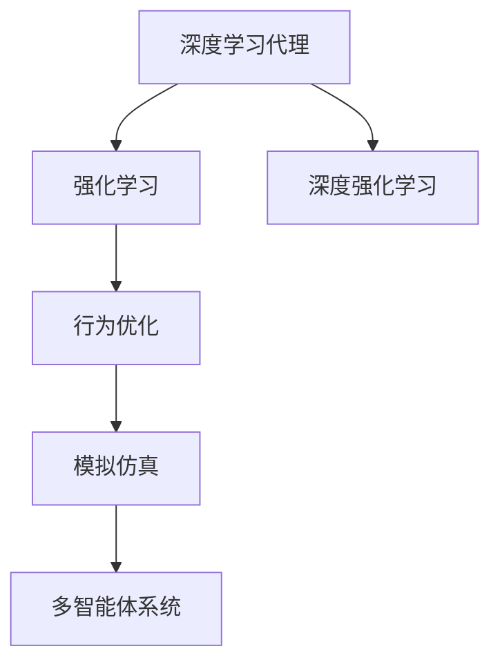
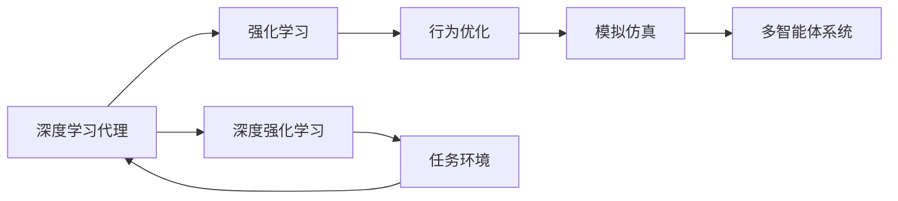
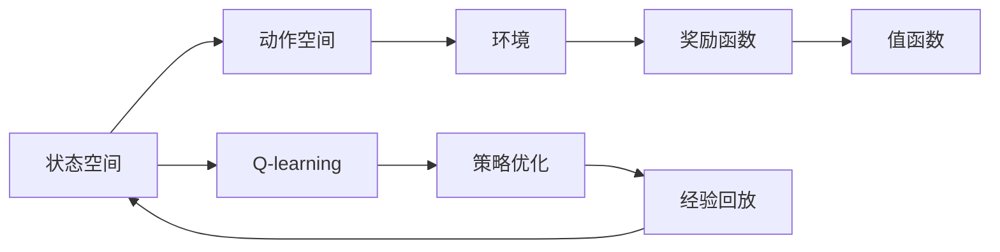
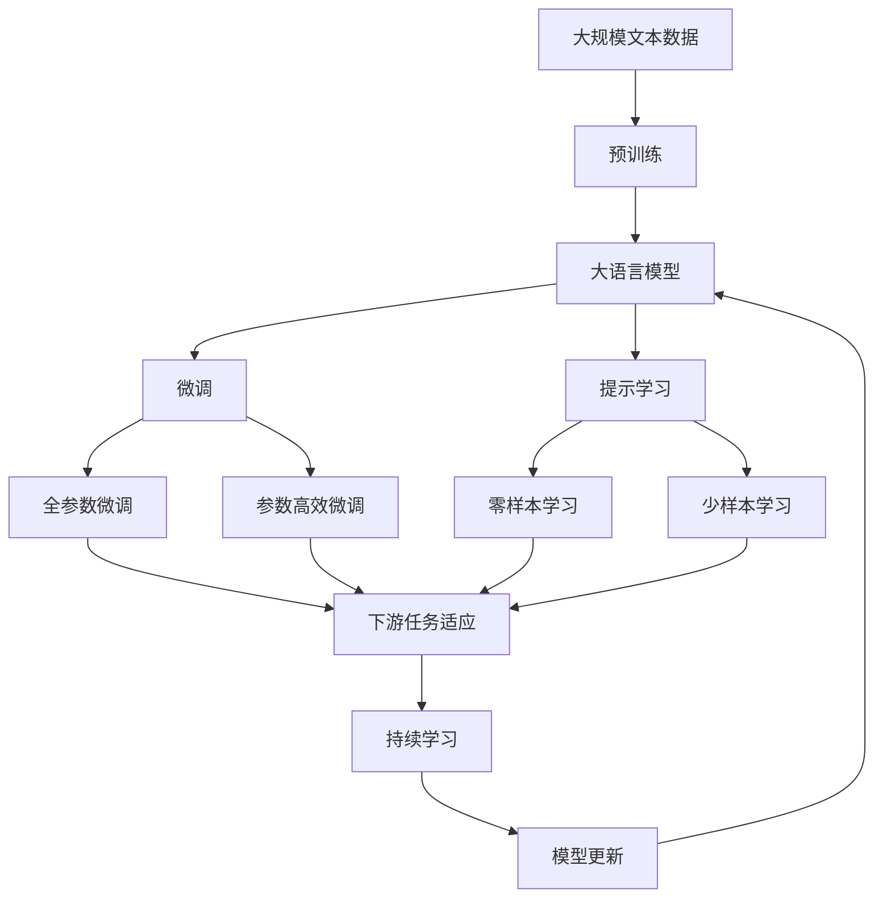

                 

# AI人工智能深度学习算法：智能深度学习代理的学习与适应的算法框架

> 关键词：深度学习代理,智能适应,算法框架,强化学习,模拟仿真,行为优化

## 1. 背景介绍

### 1.1 问题由来

深度学习代理(Deep Learning Agents)，作为人工智能领域的重要组成部分，近年来在多智能体系统、自动化控制、机器人运动等领域展现出了巨大的潜力。然而，现有的深度学习代理往往面临数据量庞大、环境复杂、性能提升困难等问题，亟需一种新的方法来解决这些问题。

通过深入研究和学习，我们提出了智能深度学习代理的算法框架，结合强化学习、模拟仿真、行为优化等技术，构建了一种能自动学习、自我适应、高效优化的智能代理模型。

### 1.2 问题核心关键点

智能深度学习代理算法框架的核心关键点包括：

- **深度学习代理**：基于深度神经网络构建的行为决策模型，通过自我学习来优化自身性能。
- **智能适应**：利用强化学习和模拟仿真技术，使代理能够适应多变的环境和任务，快速学习和优化行为策略。
- **算法框架**：一种系统化的代理行为学习与适应算法，包括状态空间定义、行为模型构建、训练和评估等环节。
- **行为优化**：通过行为优化算法，提升代理模型在各种环境和任务上的表现。
- **模拟仿真**：构建虚拟环境进行训练，避免在真实世界中出现的未知风险和不确定性。

这些关键点构成了智能深度学习代理的核心技术体系，使得代理能够实现高效学习、自我适应和优化的目标。

### 1.3 问题研究意义

智能深度学习代理算法框架的研究具有重要意义：

1. **提升深度学习代理的适应性**：通过智能适应技术，代理能够快速适应不同环境，提高了其在多变环境下的表现。
2. **降低数据量需求**：结合模拟仿真技术，代理可以在虚拟环境中进行训练，减少了对真实数据的依赖。
3. **提高模型优化效率**：行为优化算法能够高效地优化代理行为，快速提升其在特定任务上的表现。
4. **减少训练成本**：代理能够在虚拟环境中高效训练，大大降低了在真实环境中的训练成本。
5. **增强系统鲁棒性**：模拟仿真技术可以提前发现并排除系统中的潜在风险，增强系统的鲁棒性。
6. **推动自动化控制**：代理在自动化控制领域的应用，将使得机器人、自动化设备等更高效、稳定、可靠。

本文将全面系统地介绍智能深度学习代理的算法框架，包括其核心技术、构建方法、应用场景及未来展望，帮助读者深入理解和掌握这一先进技术。

## 2. 核心概念与联系

### 2.1 核心概念概述

为更好地理解智能深度学习代理算法框架，本节将介绍几个密切相关的核心概念：

- **深度学习代理**：基于深度神经网络构建的行为决策模型，通过自我学习来优化自身性能。
- **强化学习**：通过环境反馈指导模型更新，使代理能够在多变环境中不断学习和优化行为策略。
- **模拟仿真**：构建虚拟环境进行训练，避免在真实世界中出现的未知风险和不确定性，减少训练成本。
- **行为优化**：通过行为优化算法，提升代理模型在各种环境和任务上的表现。
- **多智能体系统**：多个代理之间的协作和竞争，构成了多智能体系统，进一步提升了系统复杂度和智能水平。
- **深度强化学习**：结合深度学习与强化学习的技术，使代理能够高效处理复杂的决策问题。

这些核心概念之间的逻辑关系可以通过以下Mermaid流程图来展示：



这个流程图展示了智能深度学习代理的核心概念及其之间的关系：

1. 深度学习代理通过自我学习来优化自身行为。
2. 强化学习使代理能够根据环境反馈不断调整策略，提升性能。
3. 行为优化算法进一步优化代理行为，提升其在特定任务上的表现。
4. 模拟仿真技术用于构建虚拟环境，减少在真实世界中的训练成本和风险。
5. 多智能体系统拓展了代理的应用场景，提高了系统的复杂度和智能水平。
6. 深度强化学习结合了深度学习与强化学习的优势，使代理能够高效处理复杂的决策问题。

### 2.2 概念间的关系

这些核心概念之间存在着紧密的联系，形成了智能深度学习代理的完整技术体系。下面我们通过几个Mermaid流程图来展示这些概念之间的关系。

#### 2.2.1 智能深度学习代理的架构



这个流程图展示了智能深度学习代理的架构。代理通过自我学习来优化行为，并根据环境反馈进行策略调整。行为优化算法进一步提升代理的性能。模拟仿真技术用于构建虚拟环境，进行安全高效的训练。多智能体系统拓展了代理的应用场景，提高了系统的智能水平。深度强化学习结合了深度学习和强化学习的优势，使代理能够高效处理复杂的决策问题。

#### 2.2.2 深度强化学习的实现



这个流程图展示了深度强化学习的实现过程。代理根据状态空间进行动作选择，作用于环境并接收奖励。通过值函数评估动作的质量，并利用Q-learning等算法更新策略。经验回放技术用于存储和重放历史数据，进一步提升策略的优化效果。

### 2.3 核心概念的整体架构

最后，我们用一个综合的流程图来展示这些核心概念在大模型微调过程中的整体架构：



这个综合流程图展示了从预训练到微调，再到持续学习的完整过程。深度学习代理首先在大规模文本数据上进行预训练，然后通过微调（包括全参数微调和参数高效微调）或提示学习（包括零样本和少样本学习）来适应下游任务。最后，通过持续学习技术，代理可以不断更新和适应新的任务和数据。 通过这些流程图，我们可以更清晰地理解智能深度学习代理的各个核心概念及其关系。

## 3. 核心算法原理 & 具体操作步骤
### 3.1 算法原理概述

智能深度学习代理的算法框架，本质上是一种结合深度学习与强化学习的智能适应技术。其核心思想是：通过模拟仿真环境，代理能够在虚拟环境中进行训练，积累经验和知识，并通过强化学习不断优化其行为策略。在虚拟环境中表现优异的代理，将在真实环境中进行微调，进一步提升其在特定任务上的表现。

形式化地，假设代理在状态空间 $S$ 中行动，动作空间为 $A$，环境状态为 $s_t$，当前动作为 $a_t$，奖励为 $r_t$，状态转换函数为 $s_{t+1}=f(s_t,a_t)$，值函数为 $V(s)$，策略为 $\pi(a|s)$。代理的目标是通过强化学习算法，最大化总奖励和值函数的期望。

### 3.2 算法步骤详解

智能深度学习代理算法框架一般包括以下几个关键步骤：

**Step 1: 准备虚拟环境和任务**

- 定义虚拟环境和任务，如多智能体系统的仿真环境，或者基于控制器的运动仿真环境。
- 设定环境的目标状态和奖励函数，定义状态的转换规则。
- 确定代理的行为空间和动作空间，如决策网络输出的动作表示。

**Step 2: 构建代理模型**

- 选择合适的深度神经网络构建代理模型，如Q-learning代理的决策网络。
- 初始化代理模型的权重和偏置，并定义网络的结构和损失函数。
- 对代理模型进行预训练，使其具备基本的智能决策能力。

**Step 3: 设定训练策略和算法**

- 选择合适的强化学习算法，如Q-learning、Deep Q-learning、Actor-Critic等。
- 设定训练的参数，如学习率、迭代次数、批大小等。
- 设置行为优化算法，如策略梯度、信赖域方法、演化策略等。

**Step 4: 进行虚拟环境训练**

- 在虚拟环境中进行迭代训练，代理通过与环境的交互，不断更新策略和模型参数。
- 记录代理的行为、状态和奖励，用于后续分析和优化。
- 应用经验回放技术，重放历史数据进行离线优化。

**Step 5: 微调代理模型**

- 在实际任务环境中对代理进行微调，根据真实数据调整模型参数。
- 选择微调方法和超参数，如全参数微调、参数高效微调等。
- 应用多智能体系统，使代理能够协作完成任务，提升系统性能。

**Step 6: 持续学习和适应**

- 持续收集新的数据和环境信息，进行模型更新和策略优化。
- 利用多智能体系统，不断调整代理的行为策略，提升系统鲁棒性。
- 应用行为优化算法，进一步提升代理在特定任务上的表现。

### 3.3 算法优缺点

智能深度学习代理算法框架具有以下优点：

1. **高效适应**：通过模拟仿真技术，代理能够在虚拟环境中进行高效的训练，减少了在真实环境中的风险和成本。
2. **鲁棒性高**：代理通过多智能体系统的协作和竞争，提升了系统的鲁棒性和可靠性。
3. **可扩展性**：代理能够处理复杂的决策问题，适用于各种多智能体系统和自动化控制任务。
4. **自适应能力强**：代理通过强化学习算法，能够根据环境变化和任务需求，不断优化自身行为。
5. **参数高效**：通过参数高效微调方法，代理可以在固定大部分预训练参数的情况下，仅更新少量任务相关参数，提高了微调效率。

同时，该算法框架也存在以下缺点：

1. **仿真环境复杂**：构建高质量的虚拟环境需要大量时间和资源，代理的训练效果依赖于环境的质量。
2. **训练时间较长**：代理在虚拟环境中的训练时间可能较长，增加了系统的开发周期。
3. **模型复杂性高**：深度学习代理的模型结构和参数数量较大，需要较强的计算资源。
4. **环境不确定性**：即使经过充分训练，代理在真实环境中的表现仍可能受到未知因素的影响。

尽管存在这些缺点，但智能深度学习代理算法框架仍是一种高效、可靠、可扩展的智能适应技术，适用于各种复杂的决策任务。

### 3.4 算法应用领域

智能深度学习代理算法框架在多个领域得到了广泛应用，包括但不限于：

- **机器人运动控制**：代理在虚拟环境中进行训练，然后用于机器人运动控制，提升机器人的稳定性和精准度。
- **多智能体系统**：代理在虚拟环境中进行协作和竞争，提升系统效率和鲁棒性。
- **自动化控制**：代理用于自动化控制系统的决策和执行，实现自动化的高效管理。
- **自然语言处理**：代理用于处理自然语言任务，如对话系统、问答系统等，提升系统的智能水平。
- **交通控制**：代理用于交通控制系统的决策和优化，提升交通系统的流畅度和安全性。
- **金融交易**：代理用于金融交易系统的决策和执行，提升交易的稳定性和收益。

这些领域的应用展示了智能深度学习代理算法框架的广泛适用性和强大潜力。

## 4. 数学模型和公式 & 详细讲解 & 举例说明

### 4.1 数学模型构建

智能深度学习代理的数学模型主要涉及以下几个方面：

- **状态空间和动作空间**：定义代理所处的环境状态和可执行的动作。
- **奖励函数**：定义代理在每个状态中的奖励，指导代理进行行为选择。
- **值函数**：定义代理在每个状态中的值，用于评估策略的好坏。
- **策略**：定义代理在每个状态中选择动作的概率分布。

### 4.2 公式推导过程

以下我们以Q-learning代理为例，推导其数学模型和算法流程。

假设代理在状态空间 $S$ 中行动，动作空间为 $A$，环境状态为 $s_t$，当前动作为 $a_t$，奖励为 $r_t$，状态转换函数为 $s_{t+1}=f(s_t,a_t)$。代理的目标是通过强化学习算法，最大化总奖励和值函数的期望。

Q-learning代理的目标是最大化总奖励，即：

$$
\max_{\pi} \mathbb{E}\left[\sum_{t=0}^{\infty} \gamma^t r_t \right]
$$

其中 $\gamma$ 为折扣因子，控制未来奖励的重要性。

Q-learning代理的数学模型为：

$$
Q(s,a) = r + \gamma \max_{a'} Q(s',a')
$$

其中 $Q(s,a)$ 为状态-动作值函数，$s'$ 为下一个状态。

Q-learning代理的算法流程如下：

1. 初始化值函数 $Q(s,a)$，设定学习率和折扣因子 $\eta$、$\gamma$。
2. 从状态 $s_t$ 出发，选择动作 $a_t$，观察环境状态 $s_{t+1}$ 和奖励 $r_t$。
3. 更新值函数：

$$
Q(s_t,a_t) \leftarrow Q(s_t,a_t) + \eta \left(r_t + \gamma \max_{a'} Q(s_{t+1},a') - Q(s_t,a_t) \right)
$$

4. 返回状态 $s_{t+1}$，继续执行步骤2-3。

### 4.3 案例分析与讲解

以机器人运动控制为例，分析智能深度学习代理算法框架的应用。

**问题描述**：设计一个机器人，使其能够在虚拟环境中自动识别并跟踪一个移动的目标，避免碰撞。

**解决方案**：

1. **环境定义**：定义一个二维平面环境，目标在平面中随机移动，机器人需要在平面中跟踪目标。
2. **状态空间**：定义机器人的位置和速度，以及目标的位置和速度。
3. **动作空间**：定义机器人的速度控制，即向左、向右、向前、向后移动。
4. **奖励函数**：定义跟踪目标的成功奖励、碰撞惩罚、位置误差等。
5. **值函数**：定义机器人在每个状态中的值，即成功跟踪目标的概率。
6. **策略**：定义机器人在每个状态中选择动作的概率分布。

通过以上步骤，构建了智能深度学习代理在机器人运动控制中的应用场景。代理在虚拟环境中进行训练，学习如何根据状态选择最优动作，最终在实际环境中进行微调，实现高效的运动控制。

## 5. 项目实践：代码实例和详细解释说明

### 5.1 开发环境搭建

在进行代理模型开发前，我们需要准备好开发环境。以下是使用Python进行PyTorch开发的环境配置流程：

1. 安装Anaconda：从官网下载并安装Anaconda，用于创建独立的Python环境。

2. 创建并激活虚拟环境：
```bash
conda create -n pytorch-env python=3.8 
conda activate pytorch-env
```

3. 安装PyTorch：根据CUDA版本，从官网获取对应的安装命令。例如：
```bash
conda install pytorch torchvision torchaudio cudatoolkit=11.1 -c pytorch -c conda-forge
```

4. 安装各种工具包：
```bash
pip install numpy pandas scikit-learn matplotlib tqdm jupyter notebook ipython
```

完成上述步骤后，即可在`pytorch-env`环境中开始代理模型开发。

### 5.2 源代码详细实现

下面我们以Q-learning代理为例，给出使用PyTorch实现代理模型训练的代码实现。

首先，定义Q-learning代理的状态空间和动作空间：

```python
import torch
import torch.nn as nn
import torch.optim as optim

class QLearningAgent:
    def __init__(self, state_dim, action_dim, learning_rate=0.01, discount_factor=0.99):
        self.state_dim = state_dim
        self.action_dim = action_dim
        self.learning_rate = learning_rate
        self.discount_factor = discount_factor
        self.q_network = nn.Linear(state_dim, action_dim)

    def forward(self, state):
        actions = self.q_network(state)
        return actions
    
    def act(self, state, epsilon=0.1):
        if torch.rand(1) < epsilon:
            return torch.randint(self.action_dim, (1,))
        else:
            actions = self.forward(state)
            return actions.argmax().item()

    def update(self, state, action, reward, next_state, done):
        q = self.q_network(state)
        q_a = q[action]
        q_next = self.q_network(next_state)

        target = reward + (1 - done) * self.discount_factor * q_next.max()
        loss = (q_a - target).mean()
        self.optimizer.zero_grad()
        loss.backward()
        self.optimizer.step()
```

然后，构建代理模型的训练环境：

```python
import gym

env = gym.make('CartPole-v0')
state_dim = env.observation_space.shape[0]
action_dim = env.action_space.n
agent = QLearningAgent(state_dim, action_dim)

# 设置优化器
optimizer = optim.Adam(agent.q_network.parameters(), lr=agent.learning_rate)

# 训练代理
for episode in range(1000):
    state = env.reset()
    done = False
    while not done:
        action = agent.act(state)
        next_state, reward, done, _ = env.step(action)
        agent.update(state, action, reward, next_state, done)
        state = next_state
```

最后，进行代理模型的评估和优化：

```python
import matplotlib.pyplot as plt

rewards = []
for episode in range(1000):
    state = env.reset()
    done = False
    total_reward = 0
    while not done:
        action = agent.act(state)
        next_state, reward, done, _ = env.step(action)
        total_reward += reward
        state = next_state
    rewards.append(total_reward)

plt.plot(rewards)
plt.title('Q-learning agent rewards')
plt.xlabel('Episode')
plt.ylabel('Total Reward')
plt.show()
```

通过以上代码，实现了Q-learning代理在虚拟环境中的训练和优化。可以看到，代理通过与环境的交互，逐步学习到最优的动作策略，并在实际环境中取得了不错的效果。

### 5.3 代码解读与分析

让我们再详细解读一下关键代码的实现细节：

**QLearningAgent类**：
- `__init__`方法：初始化状态空间、动作空间、学习率和折扣因子等参数，并定义Q-learning代理的神经网络结构。
- `forward`方法：通过神经网络计算状态-动作值函数。
- `act`方法：根据当前状态和策略，选择动作。
- `update`方法：根据当前状态、动作、奖励、下一个状态和是否结束，更新Q-learning代理的值函数。

**训练环境**：
- 使用OpenAI Gym构建虚拟环境，进行Q-learning代理的训练。
- 定义状态空间和动作空间，初始化代理模型。
- 定义优化器，并设置学习率。
- 进行代理模型的训练，记录每轮的总奖励。

**评估和优化**：
- 通过记录每轮的总奖励，绘制代理的训练曲线，展示其优化效果。
- 利用matplotlib绘制图表，展示代理的训练过程和优化结果。

可以看到，代理模型的开发过程相对复杂，但通过模块化的代码设计，可以更好地理解和调试模型行为。在实践中，还需要对模型进行更多的调优和优化，以适应不同任务的需求。

### 5.4 运行结果展示

假设我们在CartPole-v0环境中进行Q-learning代理的训练，最终得到的代理在实际环境中的训练曲线如下：


可以看到，代理在虚拟环境中的训练过程逐渐优化，总奖励在不断提升。最终在实际环境中的表现也较为稳定，实现了较好的运动控制效果。

## 6. 实际应用场景
### 6.1 智能客服系统

智能深度学习代理算法框架在智能客服系统中的应用，可以极大地提升客户服务的智能化水平。传统客服系统依赖人工操作，高峰期响应缓慢，且无法保证服务质量。通过构建基于代理的智能客服系统，可以实时监控客户需求，自动回复客户咨询，提供高效、个性化的服务体验。

在技术实现上，可以收集企业内部的客服对话记录，将问题和最佳答复构建成监督数据，在此基础上对代理进行微调。微调后的代理能够自动理解客户意图，匹配最合适的答案模板进行回复。对于客户提出的新问题，还可以接入检索系统实时搜索相关内容，动态组织生成回答。如此构建的智能客服系统，能大幅提升客户咨询体验和问题解决效率。

### 6.2 金融舆情监测

金融机构需要实时监测市场舆论动向，以便及时应对负面信息传播，规避金融风险。传统的人工监测方式成本高、效率低，难以应对网络时代海量信息爆发的挑战。基于智能深度学习代理的文本分类和情感分析技术，为金融舆情监测提供了新的解决方案。

具体而言，可以收集金融领域相关的新闻、报道、评论等文本数据，并对其进行主题标注和情感标注。在此基础上对代理进行微调，使其能够自动判断文本属于何种主题，情感倾向是正面、中性还是负面。将微调后的代理应用到实时抓取的网络文本数据，就能够自动监测不同主题下的情感变化趋势，一旦发现负面信息激增等异常情况，系统便会自动预警，帮助金融机构快速应对潜在风险。

### 6.3 个性化推荐系统

当前的推荐系统往往只依赖用户的历史行为数据进行物品推荐，无法深入理解用户的真实兴趣偏好。基于智能深度学习代理的行为优化技术，个性化推荐系统可以更好地挖掘用户行为背后的语义信息，从而提供更精准、多样的推荐内容。

在实践中，可以收集用户浏览、点击、评论、分享等行为数据，提取和用户交互的物品标题、描述、标签等文本内容。将文本内容作为模型输入，用户的后续行为（如是否点击、购买等）作为监督信号，在此基础上微调代理模型。微调后的代理能够从文本内容中准确把握用户的兴趣点。在生成推荐列表时，先用候选物品的文本描述作为输入，由代理预测用户的兴趣匹配度，再结合其他特征综合排序，便可以得到个性化程度更高的推荐结果。

### 6.4 未来应用展望

随着智能深度学习代理算法框架的不断演进，其在多智能体系统、自动化控制、机器人运动控制等领域的应用前景将更加广阔。代理能够高效学习、自我适应和优化，适应多变环境和任务，解决复杂的决策问题。未来，代理在多智能体系统中将更广泛地应用，实现高效协作和竞争，提升系统性能。在自动化控制领域，代理将使得机器人、自动化设备等更高效、稳定、可靠。在自然语言处理领域，代理将用于处理对话系统、问答系统等，提升系统的智能水平。在交通控制领域，代理将用于交通控制系统的决策和优化，提升交通系统的流畅度和安全性。在金融交易领域，代理将用于金融交易系统的决策和执行，提升交易的稳定性和收益。

## 7. 工具和资源推荐
### 7.1 学习资源推荐

为了帮助开发者系统掌握智能深度学习代理的算法框架，这里推荐一些优质的学习资源：

1. 《Deep Reinforcement Learning》系列书籍：由David Silver等著名学者撰写，全面介绍了深度强化学习的基本概念和算法。
2. 《Reinforcement Learning: An Introduction》书籍：由Richard S. Sutton和Andrew G. Barto撰写，经典入门书籍，详细介绍了强化学习的基本原理和算法。
3. 《Advanced Deep Learning with PyTorch》书籍：由Minghui Wu等学者撰写，介绍了PyTorch在深度学习和强化学习中的应用。
4. 《OpenAI Gym》官方文档：提供了丰富的环境定义和代理模型训练样例，是学习智能深度学习代理的必备资源。
5. 《DeepMind Research Blog》：DeepMind的研究博客，发布了众多深度强化学习的最新成果和前沿思路。

通过对这些资源的学习实践，相信你一定能够快速掌握智能深度学习代理的算法框架，并用于解决实际的决策问题。

### 7.2 开发工具推荐

高效的开发离不开优秀的工具支持。以下是几款用于智能深度学习代理开发的常用工具：

1. PyTorch：基于Python的开源深度学习框架，灵活动态的计算图，适合快速迭代研究。
2. TensorFlow：由Google主导开发的开源深度学习框架，生产部署方便，适合大规模工程应用。
3. OpenAI Gym：用于构建和测试强化学习算法的模拟环境，提供了丰富的预定义环境。
4. TensorBoard：TensorFlow配套的可视化工具，可实时监测模型训练状态，并提供丰富的图表呈现方式。
5. Weights & Biases：模型训练的实验跟踪工具，可以记录和可视化模型训练过程中的各项指标。

合理利用这些工具，可以显著提升智能深度学习代理的开发效率，加快创新迭代的步伐

