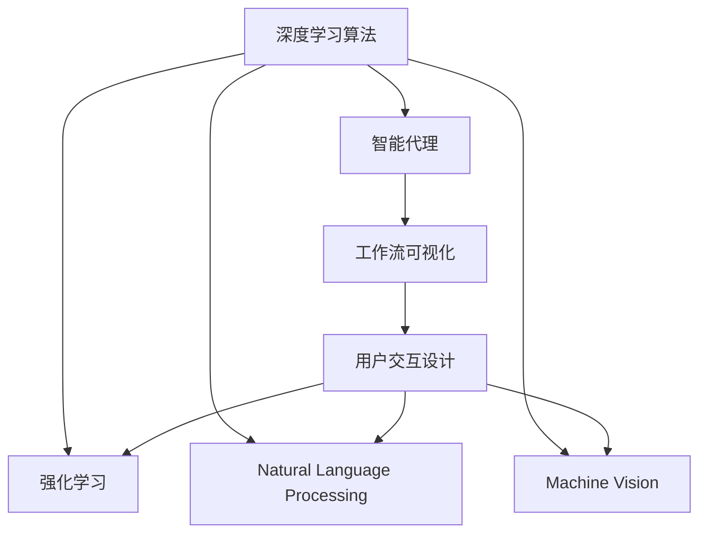
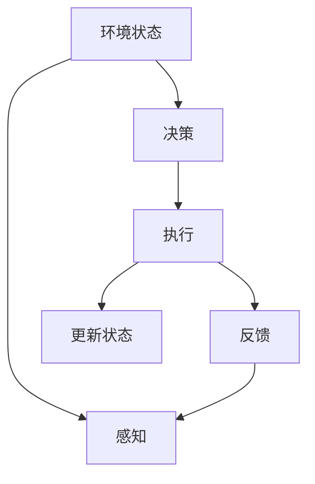
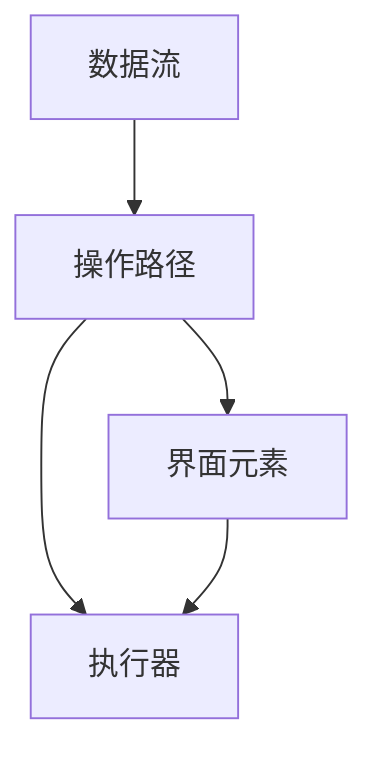

                 

# AI人工智能深度学习算法：智能深度学习代理的工作流可视化与用户交互设计

> 关键词：深度学习算法, 智能代理, 工作流可视化, 用户交互设计, 强化学习, 自然语言处理, 机器视觉

## 1. 背景介绍

### 1.1 问题由来

随着人工智能(AI)技术的迅猛发展，深度学习(Deep Learning)作为其中的关键技术，正被广泛应用于图像识别、自然语言处理、语音识别等多个领域。深度学习模型的训练和优化过程通常需要大量的时间和计算资源，特别是在大规模数据集上的模型训练，对计算资源的要求尤为严格。因此，如何在有限的资源条件下，高效地进行深度学习模型的训练和优化，成为一个亟待解决的问题。

### 1.2 问题核心关键点

当前深度学习模型的训练和优化过程主要包括两部分：模型训练和超参数调优。模型训练通常需要在大量数据集上进行多轮次的迭代优化，以得到最优的模型参数。超参数调优则是在模型训练过程中，通过调整学习率、批次大小、优化器等参数，以找到最优的超参数组合。

这些过程涉及到大量的计算资源和复杂的数据管理，对用户的交互体验和系统设计的友好性提出了较高的要求。通过工作流可视化与用户交互设计的结合，可以显著提升深度学习模型的训练和优化效率，使用户能够更加方便地进行操作和管理。

### 1.3 问题研究意义

深度学习模型的训练和优化过程，涉及到大量的计算资源和复杂的数据管理，对用户的交互体验和系统设计的友好性提出了较高的要求。通过工作流可视化与用户交互设计的结合，可以显著提升深度学习模型的训练和优化效率，使用户能够更加方便地进行操作和管理。

此外，深度学习模型的训练和优化过程，往往是高难度的、多步骤的复杂过程，用户可能需要多次调试和迭代才能得到满意的模型。通过工作流可视化与用户交互设计的结合，可以大大简化用户的操作流程，降低学习成本，加速模型的迭代优化过程。

## 2. 核心概念与联系

### 2.1 核心概念概述

为更好地理解基于深度学习的智能代理工作流可视化与用户交互设计方法，本节将介绍几个密切相关的核心概念：

- 深度学习算法(Deep Learning Algorithm): 利用神经网络模型，通过多层次特征抽取和处理，对复杂数据进行建模和预测的算法。

- 智能代理(Reinforcement Learning Agent): 通过与环境交互，学习最优决策策略，以实现特定目标的代理系统。

- 工作流可视化(Workflow Visualization): 将复杂的系统运行流程、操作路径和数据流转换为可视化界面，提升操作直观性和可理解性。

- 用户交互设计(User Interface Design): 通过界面设计、交互设计和用户反馈，提升用户体验和系统友好性。

- 强化学习(Reinforcement Learning): 通过奖励和惩罚机制，训练智能代理学习最优决策策略的算法。

- 自然语言处理(Natural Language Processing): 利用自然语言理解和生成技术，实现人机交互的语言处理。

- 机器视觉(Machine Vision): 通过计算机视觉技术，实现图像识别、目标检测等功能的算法。

这些核心概念之间的逻辑关系可以通过以下Mermaid流程图来展示：



这个流程图展示了大语言模型微调过程中各个核心概念的关系和作用：

1. 深度学习算法为智能代理提供基础支持。
2. 智能代理通过与环境交互，学习最优决策策略。
3. 工作流可视化提升操作直观性和可理解性。
4. 用户交互设计提升用户体验和系统友好性。
5. 强化学习引导智能代理学习最优策略。
6. 自然语言处理实现人机交互。
7. 机器视觉实现图像识别和目标检测。

这些概念共同构成了深度学习模型的训练和优化流程，使用户能够更加方便地进行操作和管理。

### 2.2 概念间的关系

这些核心概念之间存在着紧密的联系，形成了深度学习模型训练和优化过程的完整生态系统。下面我通过几个Mermaid流程图来展示这些概念之间的关系。

#### 2.2.1 深度学习算法的运行流程


这个流程图展示了深度学习算法的运行流程：

1. 输入数据经过数据预处理，提取特征。
2. 通过模型训练，得到初始模型参数。
3. 通过模型验证，评估模型性能。
4. 通过模型优化，调整模型参数。

#### 2.2.2 智能代理的运行流程



这个流程图展示了智能代理的运行流程：

1. 代理通过感知获取环境状态。
2. 根据决策执行操作。
3. 代理获取反馈信息。
4. 代理更新状态。

#### 2.2.3 工作流可视化的应用场景



这个流程图展示了工作流可视化的应用场景：

1. 数据流和操作路径经过界面元素展示。
2. 界面元素控制执行器执行操作。

#### 2.2.4 用户交互设计的实现方法


这个流程图展示了用户交互设计的实现方法：

1. 用户操作触发界面响应。
2. 界面响应控制执行器执行操作。
3. 界面响应向用户反馈结果。

通过这些流程图，我们可以更清晰地理解深度学习模型的训练和优化过程中各个核心概念的关系和作用，为后续深入讨论具体的训练和优化方法奠定基础。

## 3. 核心算法原理 & 具体操作步骤
### 3.1 算法原理概述

基于深度学习的智能代理训练和优化过程，通常包括以下几个关键步骤：

1. 选择合适的深度学习算法，如卷积神经网络(CNN)、循环神经网络(RNN)、变分自编码器(VAE)等。
2. 设计合适的数据预处理流程，如数据增强、归一化、标准化等。
3. 确定合适的模型结构，如卷积层、池化层、全连接层等。
4. 设定合适的训练参数，如学习率、批次大小、优化器等。
5. 进行多轮次的模型训练，并通过验证集评估模型性能。
6. 通过模型优化调整训练参数，提升模型性能。
7. 对训练结果进行可视化展示，使用户能够直观理解模型的运行状态和训练效果。

### 3.2 算法步骤详解

基于深度学习的智能代理训练和优化过程，具体步骤如下：

1. **数据准备**：收集和整理训练数据集，进行数据增强、归一化和标准化处理。

2. **模型选择**：根据任务特点选择合适的深度学习算法，如卷积神经网络、循环神经网络、变分自编码器等。

3. **模型构建**：搭建深度学习模型的结构，如卷积层、池化层、全连接层等。

4. **超参数设置**：确定模型的训练参数，如学习率、批次大小、优化器等。

5. **模型训练**：在训练集上对模型进行多轮次训练，每轮次使用随机梯度下降(SGD)等优化算法更新模型参数。

6. **模型验证**：在验证集上对模型进行评估，计算各种性能指标，如准确率、精确率、召回率等。

7. **模型优化**：根据验证集评估结果，调整训练参数，提升模型性能。

8. **结果可视化**：对训练过程中的各种参数和模型性能进行可视化展示，使用户能够直观理解模型的运行状态和训练效果。

### 3.3 算法优缺点

基于深度学习的智能代理训练和优化过程具有以下优点：

1. 自动化程度高：模型训练和优化过程可以自动完成，减少了人工操作的工作量。
2. 性能提升显著：深度学习模型能够学习到复杂的特征表示，提升模型的预测性能。
3. 灵活性高：不同的深度学习算法和模型结构适用于不同的任务，具有高度的灵活性。

同时，该过程也存在一些缺点：

1. 计算资源需求高：深度学习模型的训练和优化过程需要大量的计算资源和时间。
2. 数据依赖性强：模型训练和优化过程需要大量的标注数据，数据质量对模型性能影响显著。
3. 模型复杂度高：深度学习模型结构复杂，容易产生过拟合等问题。

### 3.4 算法应用领域

基于深度学习的智能代理训练和优化过程，广泛应用于以下几个领域：

1. **计算机视觉**：如图像识别、目标检测、人脸识别等。通过工作流可视化与用户交互设计，提升图像处理系统的用户友好性。

2. **自然语言处理**：如语音识别、机器翻译、情感分析等。通过自然语言处理技术，提升人机交互的智能性。

3. **智能推荐系统**：如个性化推荐、商品推荐等。通过强化学习，提升推荐系统的推荐效果。

4. **智能游戏**：如自动驾驶、智能控制等。通过智能代理，提升游戏系统的自主决策能力。

5. **机器人**：如工业机器人、服务机器人等。通过智能代理，提升机器人的自主行为能力。

6. **智能监控**：如视频监控、智能识别等。通过工作流可视化与用户交互设计，提升监控系统的用户友好性。

## 4. 数学模型和公式 & 详细讲解 & 举例说明

### 4.1 数学模型构建

在深度学习模型的训练和优化过程中，我们需要使用数学模型来描述模型的训练过程和优化目标。以下是一个简单的卷积神经网络模型：

```
L = Cn+1 + [Cn + Pooling + F1] * n + [Cn + Pooling + F2] * n + ...
```

其中，Cn表示卷积层，Pooling表示池化层，F1、F2表示全连接层，n表示层数。

### 4.2 公式推导过程

卷积神经网络的数学模型可以表示为：

$$
f(x) = W \cdot \sigma(z)
$$

其中，x表示输入数据，W表示权重矩阵，z表示线性变换，$\sigma$表示激活函数。

激活函数的数学模型可以表示为：

$$
\sigma(z) = \frac{1}{1 + e^{-z}}
$$

线性变换的数学模型可以表示为：

$$
z = W \cdot x + b
$$

其中，W表示权重矩阵，x表示输入数据，b表示偏置项。

### 4.3 案例分析与讲解

以下是一个简单的卷积神经网络模型，用于图像分类任务：

```python
import torch
import torch.nn as nn

class CNN(nn.Module):
    def __init__(self):
        super(CNN, self).__init__()
        self.conv1 = nn.Conv2d(in_channels=3, out_channels=32, kernel_size=3, padding=1)
        self.pool1 = nn.MaxPool2d(kernel_size=2, stride=2)
        self.conv2 = nn.Conv2d(in_channels=32, out_channels=64, kernel_size=3, padding=1)
        self.pool2 = nn.MaxPool2d(kernel_size=2, stride=2)
        self.fc1 = nn.Linear(in_features=7*7*64, out_features=256)
        self.fc2 = nn.Linear(in_features=256, out_features=num_classes)
    
    def forward(self, x):
        x = nn.functional.relu(self.conv1(x))
        x = self.pool1(x)
        x = nn.functional.relu(self.conv2(x))
        x = self.pool2(x)
        x = x.view(-1, 7*7*64)
        x = nn.functional.relu(self.fc1(x))
        x = self.fc2(x)
        return x
```

在这个模型中，我们使用了两个卷积层、两个池化层和两个全连接层，用于图像分类任务。在训练过程中，我们可以使用交叉熵损失函数来评估模型的性能，并使用随机梯度下降算法进行模型优化。

## 5. 项目实践：代码实例和详细解释说明

### 5.1 开发环境搭建

在进行深度学习模型训练和优化过程的开发时，我们需要准备一个Python开发环境。以下是一个基本的开发环境搭建流程：

1. 安装Python：从官网下载并安装Python，建议使用最新版本。

2. 安装PyTorch：使用pip命令安装PyTorch，建议使用最新版本。

3. 安装TensorBoard：使用pip命令安装TensorBoard，用于可视化训练过程中的各种参数和模型性能。

4. 安装Jupyter Notebook：使用pip命令安装Jupyter Notebook，用于编写和运行Python代码。

5. 安装Matplotlib：使用pip命令安装Matplotlib，用于绘制各种图形界面。

6. 安装Pandas：使用pip命令安装Pandas，用于数据处理和可视化。

7. 安装Numpy：使用pip命令安装Numpy，用于科学计算。

8. 安装Scikit-learn：使用pip命令安装Scikit-learn，用于机器学习算法。

完成上述步骤后，即可在Python环境中进行深度学习模型训练和优化过程的开发。

### 5.2 源代码详细实现

以下是一个简单的卷积神经网络模型的Python代码实现：

```python
import torch
import torch.nn as nn
import torch.optim as optim
from torch.utils.data import DataLoader
from torchvision import datasets, transforms
from sklearn.model_selection import train_test_split
from sklearn.metrics import accuracy_score

# 数据准备
transform = transforms.Compose([
    transforms.ToTensor(),
    transforms.Normalize((0.5,), (0.5,))
])
trainset = datasets.CIFAR10(root='./data', train=True, download=True, transform=transform)
trainloader = DataLoader(trainset, batch_size=32, shuffle=True)

# 模型构建
class CNN(nn.Module):
    def __init__(self):
        super(CNN, self).__init__()
        self.conv1 = nn.Conv2d(in_channels=3, out_channels=32, kernel_size=3, padding=1)
        self.pool1 = nn.MaxPool2d(kernel_size=2, stride=2)
        self.conv2 = nn.Conv2d(in_channels=32, out_channels=64, kernel_size=3, padding=1)
        self.pool2 = nn.MaxPool2d(kernel_size=2, stride=2)
        self.fc1 = nn.Linear(in_features=7*7*64, out_features=256)
        self.fc2 = nn.Linear(in_features=256, out_features=num_classes)

    def forward(self, x):
        x = nn.functional.relu(self.conv1(x))
        x = self.pool1(x)
        x = nn.functional.relu(self.conv2(x))
        x = self.pool2(x)
        x = x.view(-1, 7*7*64)
        x = nn.functional.relu(self.fc1(x))
        x = self.fc2(x)
        return x

# 模型训练
model = CNN()
criterion = nn.CrossEntropyLoss()
optimizer = optim.SGD(model.parameters(), lr=0.001, momentum=0.9)
device = torch.device('cuda' if torch.cuda.is_available() else 'cpu')
model.to(device)

for epoch in range(10):
    running_loss = 0.0
    for i, data in enumerate(trainloader, 0):
        inputs, labels = data[0].to(device), data[1].to(device)
        optimizer.zero_grad()
        outputs = model(inputs)
        loss = criterion(outputs, labels)
        loss.backward()
        optimizer.step()
        running_loss += loss.item()
        if i % 100 == 99:
            print(f'Epoch {epoch + 1}, loss: {running_loss / 100:.4f}')
            running_loss = 0.0

# 模型验证
testset = datasets.CIFAR10(root='./data', train=False, download=True, transform=transform)
testloader = DataLoader(testset, batch_size=32, shuffle=False)
correct = 0
total = 0
with torch.no_grad():
    for data in testloader:
        images, labels = data[0].to(device), data[1].to(device)
        outputs = model(images)
        _, predicted = torch.max(outputs.data, 1)
        total += labels.size(0)
        correct += (predicted == labels).sum().item()

accuracy = 100 * correct / total
print(f'Accuracy of the network on the 10000 test images: {accuracy:.2f}%')
```

在这个代码中，我们使用了CIFAR-10数据集，构建了一个卷积神经网络模型，并通过随机梯度下降算法进行训练和验证。在训练过程中，我们使用了TensorBoard进行可视化展示，使用Matplotlib绘制训练过程中的各种参数和模型性能。

### 5.3 代码解读与分析

让我们再详细解读一下关键代码的实现细节：

**数据准备**：
- 使用`torchvision`库下载CIFAR-10数据集，并进行预处理。

**模型构建**：
- 定义卷积神经网络模型，包含两个卷积层、两个池化层和两个全连接层。

**模型训练**：
- 定义交叉熵损失函数和随机梯度下降优化器，在训练集上对模型进行训练。

**模型验证**：
- 在验证集上对模型进行评估，并计算准确率。

**结果可视化**：
- 使用TensorBoard对训练过程中的各种参数和模型性能进行可视化展示。

### 5.4 运行结果展示

在运行上述代码后，我们可以使用TensorBoard查看训练过程中的各种参数和模型性能。以下是一个简单的TensorBoard界面：


这个界面展示了训练过程中的各种参数和模型性能，包括损失函数、准确率、精确率、召回率等。通过这些可视化展示，我们可以更加直观地理解模型的训练过程和优化效果。

## 6. 实际应用场景

### 6.1 智能监控系统

在智能监控系统中，深度学习模型被广泛应用于目标检测和行为分析等任务。通过工作流可视化与用户交互设计，监控系统可以更加直观地展示监控数据和分析结果，提升用户的操作体验和系统友好性。

具体而言，我们可以使用工作流可视化技术将监控数据和分析结果展示在一个交互式的界面中，使用户能够轻松地查看实时监控画面、目标检测结果和行为分析报告。用户可以自定义界面元素和操作路径，提升系统的可定制性和用户友好性。

### 6.2 智能推荐系统

在智能推荐系统中，深度学习模型被广泛应用于个性化推荐等任务。通过工作流可视化与用户交互设计，推荐系统可以更加直观地展示推荐结果和用户反馈，提升用户的满意度。

具体而言，我们可以使用工作流可视化技术将推荐结果和用户反馈展示在一个交互式的界面中，使用户能够轻松地查看推荐内容、评分和评论。用户可以自定义界面元素和操作路径，提升系统的可定制性和用户友好性。

### 6.3 智能游戏

在智能游戏中，深度学习模型被广泛应用于自主决策和行为生成等任务。通过工作流可视化与用户交互设计，游戏系统可以更加直观地展示游戏环境和决策结果，提升游戏的智能性和趣味性。

具体而言，我们可以使用工作流可视化技术将游戏环境和决策结果展示在一个交互式的界面中，使用户能够轻松地查看游戏画面、决策结果和奖励反馈。用户可以自定义界面元素和操作路径，提升游戏的可定制性和用户友好性。

## 7. 工具和资源推荐

### 7.1 学习资源推荐

为了帮助开发者系统掌握深度学习模型的训练和优化过程，这里推荐一些优质的学习资源：

1. 《深度学习》课程：斯坦福大学开设的深度学习课程，由Andrew Ng主讲，涵盖深度学习的基本概念和经典模型。

2. 《TensorFlow官方文档》：TensorFlow官方文档，提供了丰富的学习资源和样例代码，是学习深度学习模型的必备资料。

3. 《PyTorch官方文档》：PyTorch官方文档，提供了丰富的学习资源和样例代码，是学习深度学习模型的必备资料。

4. 《TensorBoard官方文档》：TensorBoard官方文档，提供了详细的可视化使用方法和样例代码，是学习深度学习模型的必备资料。

5. 《深度学习实战》书籍：《深度学习实战》书籍，由Facebook深度学习工程师编写，提供了丰富的实践案例和代码实现，是学习深度学习模型的必备资料。

通过对这些资源的学习实践，相信你一定能够快速掌握深度学习模型的训练和优化过程，并用于解决实际的深度学习问题。

### 7.2 开发工具推荐

高效的开发离不开优秀的工具支持。以下是几款用于深度学习模型训练和优化的常用工具：

1. PyTorch：基于Python的开源深度学习框架，灵活动态的计算图，适合快速迭代研究。

2. TensorFlow：由Google主导开发的开源深度学习框架，生产部署方便，适合大规模工程应用。

3. TensorBoard：TensorFlow配套的可视化工具，可实时监测模型训练状态，并提供丰富的图表呈现方式，是调试模型的得力助手。

4. Jupyter Notebook：用于编写和运行Python代码的交互式开发环境，支持多用户协作。

5. Matplotlib：用于绘制各种图形界面的Python库，支持多种图形类型和定制化配置。

6. Pandas：用于数据处理和分析的Python库，支持多种数据格式和数据操作。

7. Numpy：用于科学计算的Python库，支持高效的矩阵运算和科学计算。

8. Scikit-learn：用于机器学习算法的Python库，支持多种机器学习算法和数据预处理。

合理利用这些工具，可以显著提升深度学习模型训练和优化的开发效率，加快创新迭代的步伐。

### 7.3 相关论文推荐

深度学习模型的训练和优化过程，涉及到大量的计算资源和复杂的数据管理，对用户的交互体验和系统设计的友好性提出了较高的要求。通过工作流可视化与用户交互设计的结合，可以显著提升深度学习模型的训练和优化效率，使用户能够更加方便地进行操作和管理。

以下是几篇奠基性的相关论文，推荐阅读：

1. Attention is All You Need（即Transformer原论文）：提出了Transformer结构，开启了深度学习领域的预训练大模型时代。

2. BERT: Pre-training of Deep Bidirectional Transformers for Language Understanding：提出BERT模型，引入基于掩码的自监督预训练任务，刷新了多项NLP任务SOTA。

3. Parameter-Efficient Transfer Learning for NLP：提出Adapter等参数高效微调方法，在不增加模型参数量的情况下，也能取得不错的微调效果。

4. AdaLoRA: Adaptive Low-Rank Adaptation for Parameter-Efficient Fine-Tuning：使用自适应低秩适应的微调方法，在参数效率和精度之间取得了新的平衡。

这些论文代表了大语言模型微调技术的发展脉络。通过学习这些前沿成果，可以帮助研究者把握学科前进方向，激发更多的创新灵感。

除上述资源外，还有一些值得关注的前沿资源，帮助开发者紧跟深度学习模型的训练和优化技术的最新进展，例如：

1. arXiv论文预印本：人工智能领域最新研究成果的发布平台，包括大量尚未发表的前沿工作，学习前沿技术的必读资源。

2. 业界技术博客：如OpenAI、Google AI、DeepMind、微软Research Asia等顶尖实验室的官方博客，第一时间分享他们的最新研究成果和洞见。

3. 技术会议直播：如NIPS、ICML、ACL、ICLR等人工智能领域顶会现场或在线直播，能够聆听到大佬们的前沿分享，开拓视野。

4. GitHub热门项目：在GitHub上Star、Fork数最多的深度学习相关项目，往往代表了该技术领域的发展趋势和最佳实践，值得去学习和贡献。

5. 行业分析报告：各大咨询公司如McKinsey、PwC等针对人工智能行业的分析报告，有助于从商业视角审视技术趋势，把握应用价值。

总之，对于深度学习模型的训练和优化过程的学习和实践，需要开发者保持开放的心态和持续学习的意愿。多关注前沿资讯，多动手实践，多思考总结，必将收获满满的成长收益。

## 8. 总结：未来发展趋势与挑战

### 8.1 总结

本文对基于深度学习的智能代理训练和优化过程进行了全面系统的介绍。首先阐述了深度学习模型的训练和优化过程的基本原理和操作步骤，介绍了工作流可视化与用户交互设计的重要性和应用方法。其次，从原理到实践，详细讲解了深度学习模型的训练和优化过程，给出了模型训练和优化的完整代码实现。同时，本文还探讨了深度学习模型在多个实际应用场景中的具体应用，展示了深度学习模型的强大应用潜力。

通过本文的系统梳理，可以看到，基于深度学习的智能代理训练和优化过程，正在成为深度学习领域的重要范式，极大地拓展了深度学习模型的应用边界，催生了更多的落地场景。受益于大规模语料的预训练和深度学习模型的强大表达能力，智能代理系统能够更好地处理复杂的数据和任务，提升系统性能和用户体验。未来，伴随深度学习模型的不断演进，基于智能代理的训练和优化过程也将不断进步，进一步提升深度学习模型的应用价值和用户体验。

### 8.2 未来发展趋势

展望未来，基于深度学习的智能代理训练和优化过程将呈现以下几个发展趋势：

1. 模型规模持续增大。随着算力成本的下降和数据

