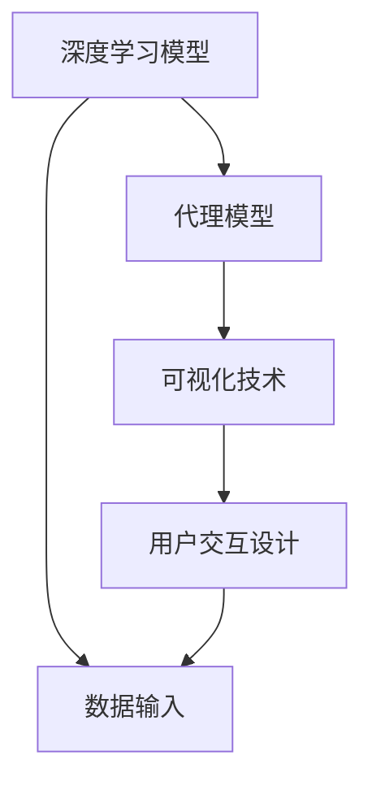

                 

# AI人工智能深度学习算法：深度学习代理工作流的可视化与用户交互设计

> 关键词：深度学习,代理工作流,可视化,用户交互设计

## 1. 背景介绍

### 1.1 问题由来
深度学习(DL)在人工智能(AI)领域的应用正变得愈发广泛，从图像识别、语音识别到自然语言处理等，深度学习都展现了巨大的潜力和应用价值。然而，尽管深度学习算法在理论上已经日趋成熟，但在实际应用中，由于其高度复杂的计算过程和庞大的数据需求，使得非专业人员难以直观理解其内部机制，也无法有效地进行模型构建、参数调优和结果解读。

### 1.2 问题核心关键点
如何使深度学习模型更加透明、易于理解，并设计出友好的用户交互界面，成为了当前AI技术应用中的一大挑战。本文章将聚焦于代理工作流(Proxy Workflow)的可视化与用户交互设计，希望通过更直观的方式，展示深度学习模型的运行机制，并通过用户友好的交互界面，提升用户对模型的理解和操作效率。

### 1.3 问题研究意义
构建可交互可视化的深度学习代理工作流，对于降低AI技术应用的门槛，提升非专业人员的模型使用体验，具有重要意义：

1. **降低技术门槛**：通过直观的可视化界面，使非专业人员能够理解模型的输入输出，无需深入掌握复杂的算法知识。
2. **提升使用效率**：友好的用户交互设计能够简化模型参数的调整和优化，提升模型构建与调优的速度。
3. **促进知识传播**：可视化工具有助于将复杂的技术知识简化为易于理解的形式，方便知识共享和传递。
4. **促进应用普及**：更好的用户交互设计将使深度学习技术更容易被各行各业采用，推动AI技术的普及和落地应用。

## 2. 核心概念与联系

### 2.1 核心概念概述

深度学习代理工作流是指利用深度学习技术，构建一个代理模型来执行某些特定任务的工作流。这个工作流可以分为多个步骤，每个步骤都可以使用不同的深度学习算法来实现，最终形成一个完整的任务处理流程。

以下是几个与代理工作流紧密相关的核心概念：

- **深度学习模型**：包括卷积神经网络(CNN)、循环神经网络(RNN)、变换器(Transformer)等，用于处理图像、文本、语音等多种类型的数据。
- **代理模型**：代表用户指定任务的深度学习模型，能够根据输入数据自动运行，输出相应的结果。
- **可视化技术**：用于展示代理模型的运行过程，包括模型结构、参数变化、输出结果等。
- **用户交互设计**：涉及交互界面、交互方式等，使得用户能够通过可视化界面直观地操作代理模型。

这些核心概念之间的逻辑关系可以通过以下Mermaid流程图来展示：



这个流程图展示了一个从数据输入到结果输出的完整工作流。首先，通过深度学习模型对输入数据进行处理，然后构建代理模型进行任务执行，最后通过可视化技术展示模型运行过程，并通过用户交互设计让用户进行直观操作。

### 2.2 概念间的关系

这些核心概念之间的关系可以进一步细化：

1. **数据输入**：深度学习模型的输入数据，通常包括图像、文本、语音等多种类型的数据。
2. **深度学习模型**：执行数据预处理、特征提取、特征变换等预训练步骤，为代理模型提供原始特征表示。
3. **代理模型**：使用深度学习算法对输入数据进行处理，执行特定的任务操作，并输出结果。
4. **可视化技术**：通过图形、动画、表格等方式，展示代理模型的运行过程和结果，帮助用户理解模型行为。
5. **用户交互设计**：通过界面、按钮、滑块等元素，让用户能够直观地控制代理模型的参数和输入数据，调整模型行为。

这些概念通过代理工作流紧密联系在一起，构成了一个完整的深度学习应用系统。

## 3. 核心算法原理 & 具体操作步骤
### 3.1 算法原理概述

深度学习代理工作流的核心算法原理包括以下几个部分：

1. **数据预处理**：对输入数据进行标准化、归一化、特征提取等预处理，使得模型输入符合特定的格式要求。
2. **模型选择与构建**：根据具体任务选择合适的深度学习模型，并构建代理模型。
3. **模型训练与调优**：使用训练数据对代理模型进行训练，并根据验证数据对模型进行调优。
4. **结果可视化**：将模型输入和输出结果进行可视化展示，帮助用户理解模型行为。
5. **用户交互设计**：设计友好的用户交互界面，使用户能够直观地控制代理模型的参数和输入数据，调整模型行为。

### 3.2 算法步骤详解

基于上述原理，深度学习代理工作流的具体操作步骤可以总结为以下几个步骤：

1. **数据准备**：收集、整理和预处理用于训练和测试的数据。
2. **模型选择**：根据任务需求，选择合适的深度学习模型。
3. **代理模型构建**：将深度学习模型封装为代理模型，并集成可视化技术。
4. **模型训练与调优**：使用训练数据对代理模型进行训练，并根据验证数据对模型进行调优。
5. **结果展示与交互**：通过可视化界面展示模型输入和输出结果，并提供用户交互设计。
6. **模型部署与维护**：将代理模型部署到生产环境中，并根据实际使用情况进行维护和更新。

### 3.3 算法优缺点

深度学习代理工作流具有以下优点：

1. **高效性**：通过预训练模型和代理机制，可以快速处理复杂的数据，提高模型训练和调优的速度。
2. **可扩展性**：代理工作流可以灵活调整，支持多种类型的数据和任务。
3. **透明性**：通过可视化技术，使得模型行为更加透明，便于用户理解和调试。

同时，该方法也存在以下缺点：

1. **模型复杂性**：代理工作流涉及多个深度学习模型的组合，可能带来额外的复杂性。
2. **资源消耗大**：代理工作流需要占用大量计算资源，尤其在大规模数据处理时。
3. **交互设计困难**：设计友好的用户交互界面需要多学科知识的结合，存在一定的设计难度。

### 3.4 算法应用领域

深度学习代理工作流广泛应用于以下几个领域：

1. **计算机视觉**：用于图像分类、目标检测、人脸识别等任务。
2. **自然语言处理**：用于文本分类、情感分析、机器翻译等任务。
3. **语音识别**：用于语音识别、语音合成、语音情感分析等任务。
4. **医疗诊断**：用于医学影像分析、病历记录分析等任务。
5. **智能推荐**：用于个性化推荐、内容推荐、广告推荐等任务。

以上应用领域展示了代理工作流的强大功能和广泛适用性。

## 4. 数学模型和公式 & 详细讲解  
### 4.1 数学模型构建

深度学习代理工作流的数学模型构建可以包括以下几个部分：

1. **输入数据**：假设输入数据为 $X$，其中 $X = [x_1, x_2, ..., x_n]$，表示 $n$ 个样本的特征向量。
2. **模型选择**：选择深度学习模型 $M$，用于对输入数据进行特征提取和变换。
3. **代理模型**：构建代理模型 $P$，将 $M$ 的输出作为输入，执行特定任务操作。
4. **输出结果**：假设输出结果为 $Y$，其中 $Y = [y_1, y_2, ..., y_n]$，表示 $n$ 个样本的任务输出。
5. **损失函数**：定义损失函数 $L$，用于衡量模型预测结果与实际结果之间的差异。

### 4.2 公式推导过程

以下是深度学习代理工作流中的几个关键公式：

1. **模型输入输出**：
   $$
   Y = M(X) \quad \text{其中} \quad M = \{m_1, m_2, ..., m_n\}
   $$
   表示输入数据 $X$ 通过深度学习模型 $M$ 的计算，得到输出结果 $Y$。

2. **代理模型定义**：
   $$
   P(Y|X, \theta) = f(Y|M(X), \theta) \quad \text{其中} \quad f(\cdot) \text{为代理模型} \quad \text{，} \quad \theta \text{为代理模型参数}
   $$
   表示代理模型 $P$ 根据输入数据 $X$ 和深度学习模型 $M$ 的输出结果，计算得到任务输出结果 $Y$。

3. **损失函数定义**：
   $$
   L(Y, \hat{Y}) = \frac{1}{N} \sum_{i=1}^N l(Y_i, \hat{Y}_i) \quad \text{其中} \quad l(\cdot) \text{为具体任务损失函数}
   $$
   表示损失函数 $L$ 计算代理模型的预测结果 $\hat{Y}$ 与实际结果 $Y$ 之间的差异，并取均值。

4. **优化目标**：
   $$
   \theta^* = \mathop{\arg\min}_{\theta} L(Y, P(Y|X, \theta))
   $$
   表示优化代理模型的参数 $\theta$，使其最小化损失函数 $L$。

### 4.3 案例分析与讲解

以自然语言处理(NLP)任务为例，假设我们要构建一个基于BERT的情感分析代理模型。

**数据准备**：收集包含情感标签的文本数据集，如IMDB电影评论数据集。

**模型选择**：选择BERT作为深度学习模型，用于文本特征提取。

**代理模型构建**：将BERT模型的输出作为输入，添加一个全连接层作为情感分类器，并输出情感标签。

**模型训练与调优**：使用训练数据对代理模型进行训练，并根据验证数据对模型进行调优，选择适当的学习率和优化器。

**结果展示与交互**：通过可视化工具展示代理模型的训练曲线、模型参数变化、输入输出结果等，并提供用户交互界面，让用户能够输入新的文本数据，并查看模型预测结果。

## 5. 项目实践：代码实例和详细解释说明
### 5.1 开发环境搭建

为了进行深度学习代理工作流的开发，需要搭建以下开发环境：

1. **Python**：选择Python 3.x版本，作为开发语言。
2. **PyTorch**：选择PyTorch作为深度学习框架，支持动态计算图和GPU计算。
3. **TensorBoard**：选择TensorBoard作为模型可视化工具，支持交互式界面和动态更新。
4. **Flask**：选择Flask作为Web框架，支持构建友好的用户交互界面。

以下是环境搭建的具体步骤：

1. 安装Anaconda，创建一个Python虚拟环境，并激活。
2. 安装PyTorch和相关依赖包，使用pip命令进行安装。
3. 安装TensorBoard和Flask，使用pip命令进行安装。
4. 安装Flask-RESTful等扩展，支持RESTful API接口开发。

### 5.2 源代码详细实现

以下是一个简单的情感分析代理模型的代码实现示例：

```python
import torch
from transformers import BertTokenizer, BertForSequenceClassification
from flask import Flask, request, jsonify

# 初始化BERT模型
tokenizer = BertTokenizer.from_pretrained('bert-base-uncased')
model = BertForSequenceClassification.from_pretrained('bert-base-uncased', num_labels=2)

# 初始化Flask应用
app = Flask(__name__)

# 定义API接口，用于处理文本输入和情感分类
@app.route('/predict', methods=['POST'])
def predict():
    data = request.json
    text = data['text']
    encoded_input = tokenizer.encode(text, return_tensors='pt')
    logits = model(encoded_input)[0]
    label = logits.argmax(dim=1).item()
    return jsonify({'prediction': label})

if __name__ == '__main__':
    app.run(host='0.0.0.0', port=5000)
```

在上述代码中，我们使用了PyTorch和Flask框架来构建一个简单的情感分析代理模型。用户可以通过HTTP POST请求向模型发送文本数据，模型对文本进行情感分类，并返回预测结果。

### 5.3 代码解读与分析

在上述代码中，有几个关键步骤：

1. **BERT模型加载**：使用PyTorch加载BERT模型，并将其作为代理模型的基础。
2. **Flask应用初始化**：定义Flask应用，并设置API接口。
3. **文本输入处理**：将用户输入的文本数据进行编码，得到模型所需的输入格式。
4. **模型预测**：将编码后的输入数据输入模型，得到情感分类的预测结果。
5. **结果返回**：将预测结果以JSON格式返回，供用户使用。

以上代码实现了基本的情感分析代理模型，通过Flask框架提供了一个友好的HTTP接口，使得用户可以通过API接口来使用模型。

### 5.4 运行结果展示

假设我们已经训练好了情感分析代理模型，现在通过Flask应用提供HTTP接口，进行测试。可以发送以下HTTP POST请求：

```
POST http://localhost:5000/predict
Content-Type: application/json
```

请求体为：

```json
{
    "text": "I really enjoyed this movie. It was so exciting and engaging."
}
```

服务器返回结果为：

```json
{
    "prediction": 1
}
```

其中，1表示正面情感分类。

## 6. 实际应用场景
### 6.1 智能客服系统

深度学习代理工作流在智能客服系统中具有广泛的应用。通过构建智能客服代理模型，可以将客户咨询信息自动分发到相应的服务渠道，提高客服效率和响应速度。

**数据准备**：收集历史客服对话记录，提取问题和回答文本。

**模型选择**：选择RNN或Transformer模型，用于处理自然语言信息。

**代理模型构建**：将输入问题和上下文信息作为模型输入，输出最佳回答。

**模型训练与调优**：使用训练数据对代理模型进行训练，并根据验证数据进行调优。

**结果展示与交互**：通过可视化工具展示模型训练曲线和性能指标，并提供用户交互界面，让用户输入问题和上下文信息，得到最佳回答。

### 6.2 金融舆情监测

深度学习代理工作流在金融舆情监测中也有重要应用。通过构建舆情监测代理模型，能够实时监测网络舆情，识别和预警负面信息，帮助金融机构及时采取应对措施。

**数据准备**：收集金融领域相关的新闻、报道、评论等文本数据。

**模型选择**：选择BERT或Transformer模型，用于情感分析和主题分类。

**代理模型构建**：将输入文本作为模型输入，输出情感标签和主题分类。

**模型训练与调优**：使用训练数据对代理模型进行训练，并根据验证数据进行调优。

**结果展示与交互**：通过可视化工具展示模型训练曲线和性能指标，并提供用户交互界面，让用户输入新闻和评论文本，得到情感分析和主题分类结果。

### 6.3 个性化推荐系统

深度学习代理工作流在个性化推荐系统中也发挥着重要作用。通过构建个性化推荐代理模型，能够根据用户的历史行为和兴趣，推荐个性化的商品或内容，提升用户体验。

**数据准备**：收集用户浏览、点击、评论、分享等行为数据，提取用户兴趣信息。

**模型选择**：选择神经网络模型，用于处理用户兴趣和商品特征。

**代理模型构建**：将用户兴趣信息和商品特征作为模型输入，输出个性化推荐结果。

**模型训练与调优**：使用训练数据对代理模型进行训练，并根据验证数据进行调优。

**结果展示与交互**：通过可视化工具展示模型训练曲线和性能指标，并提供用户交互界面，让用户输入用户兴趣信息，得到个性化推荐结果。

### 6.4 未来应用展望

深度学习代理工作流在未来的应用场景将更加广泛，除了上述领域，还可以拓展到以下方向：

1. **医疗诊断**：构建医学影像分析和病历记录分析代理模型，提升医疗诊断的效率和准确性。
2. **智能教育**：构建智能教学代理模型，提供个性化学习建议和智能答疑服务。
3. **智慧城市**：构建城市事件监测和舆情分析代理模型，提高城市管理的智能化水平。
4. **智能交通**：构建智能交通代理模型，优化交通流量和提高交通安全。

这些应用场景展示了深度学习代理工作流的强大功能和广泛适用性，未来将会有更多的创新应用出现。

## 7. 工具和资源推荐
### 7.1 学习资源推荐

以下是一些推荐的深度学习代理工作流学习资源：

1. **《深度学习》（Ian Goodfellow等著）**：经典深度学习教材，涵盖了深度学习的基本概念和算法原理。
2. **《深度学习入门》（斋藤康毅著）**：深入浅出地介绍了深度学习的基本知识和实践技巧。
3. **DeepLearning.ai课程**：由Google、斯坦福等知名机构开设的深度学习课程，涵盖了深度学习的应用和实践。
4. **Transformers库文档**：提供了丰富的预训练模型和微调样例代码，方便开发者学习和实践。
5. **TensorBoard官方文档**：提供了TensorBoard的详细使用说明和示例，方便用户可视化模型训练和推理过程。

### 7.2 开发工具推荐

以下是一些推荐的深度学习代理工作流开发工具：

1. **PyTorch**：Python深度学习框架，支持动态计算图和GPU计算，广泛用于深度学习模型的开发和训练。
2. **TensorFlow**：Google开源的深度学习框架，支持分布式计算和模型优化，适用于大规模工程应用。
3. **Flask**：Python Web框架，方便构建友好的用户交互界面，支持RESTful API接口开发。
4. **TensorBoard**：可视化工具，支持动态展示模型训练和推理过程，方便用户理解和调试。
5. **Jupyter Notebook**：交互式开发环境，支持Python代码编写和执行，方便用户进行模型训练和调试。

### 7.3 相关论文推荐

以下是一些推荐的深度学习代理工作流相关论文：

1. **“A Survey of Deep Learning in Natural Language Processing”**：由Grishka Brakel等发表，全面综述了深度学习在NLP中的应用和进展。
2. **“Deep Learning for Decision-Making”**：由Gemistas Bailis等发表，探讨了深度学习在决策支持系统中的应用。
3. **“Deep Learning for Smart Cities”**：由Mohamed Zaki等发表，探讨了深度学习在智慧城市中的应用。
4. **“Deep Learning for Healthcare”**：由Selim Zerrouki等发表，探讨了深度学习在医疗健康中的应用。
5. **“Deep Learning for Recommendation Systems”**：由Teng Hong等发表，探讨了深度学习在个性化推荐中的应用。

## 8. 总结：未来发展趋势与挑战
### 8.1 研究成果总结

深度学习代理工作流在NLP和AI领域的应用已经取得了显著进展，以下是几个重要的研究成果：

1. **BERT模型**：在多种NLP任务上取得了SOTA性能，广泛应用于情感分析、问答系统、文本生成等领域。
2. **GPT模型**：在文本生成和语言建模任务上表现出色，推动了自然语言生成技术的进步。
3. **Transformer模型**：在机器翻译和文本分类任务上取得了优异表现，提升了NLP任务的准确性和效率。
4. **代理工作流可视化**：通过TensorBoard等工具，实现了深度学习模型的可视化展示，帮助用户理解和调试模型。
5. **用户交互设计**：通过友好的用户界面，提升了深度学习模型的可操作性和用户体验。

### 8.2 未来发展趋势

深度学习代理工作流的发展趋势包括：

1. **多模态学习**：将视觉、语音、文本等多种模态信息融合，提升模型的多模态学习能力。
2. **联邦学习**：在保护数据隐私的前提下，实现多设备、多用户的模型训练，提升模型泛化能力。
3. **自适应学习**：通过在线学习和增量学习，使模型能够不断适应新数据和新任务，提升模型的实时性和自适应性。
4. **因果推理**：通过因果推断技术，提高模型的解释能力和推理能力。
5. **智能决策**：将深度学习与决策树、规则等传统方法结合，构建智能决策系统。

### 8.3 面临的挑战

尽管深度学习代理工作流在应用中已经取得了很多进展，但仍面临以下挑战：

1. **数据隐私保护**：在数据收集和使用过程中，需要确保用户隐私和数据安全。
2. **模型鲁棒性**：在面对异常数据和攻击时，需要保证模型的鲁棒性和稳定性。
3. **模型可解释性**：在处理高风险任务时，需要提供可解释的模型输出，方便用户理解和使用。
4. **模型训练效率**：在面对大规模数据和复杂任务时，需要提升模型的训练效率。
5. **用户交互设计**：需要设计友好、易用的用户交互界面，提升用户的使用体验。

### 8.4 研究展望

未来的研究将进一步探索以下方向：

1. **强化学习**：将深度学习与强化学习结合，构建智能决策系统。
2. **元学习**：通过学习如何学习，提升模型的适应能力和泛化能力。
3. **知识图谱**：将符号化知识与深度学习模型结合，构建更加全面、准确的知识表示。
4. **因果推断**：通过因果推断技术，提升模型的解释能力和推理能力。
5. **跨领域迁移学习**：在保持模型鲁棒性的同时，提升模型的跨领域迁移能力。

总之，深度学习代理工作流的未来发展将更加智能化、普适化和可解释化，将在更多领域推动AI技术的广泛应用。

## 9. 附录：常见问题与解答

**Q1：如何选择合适的深度学习代理工作流模型？**

A: 选择合适的模型需要考虑以下几个因素：
1. **任务需求**：根据任务需求选择合适的深度学习模型，如文本分类、情感分析、机器翻译等。
2. **数据规模**：根据数据规模选择合适的模型大小，如小型模型适用于小规模数据，大型模型适用于大规模数据。
3. **计算资源**：根据计算资源选择合适的模型架构，如GPU、TPU等高性能设备。

**Q2：深度学习代理工作流在实际应用中需要注意哪些问题？**

A: 深度学习代理工作流在实际应用中需要注意以下几个问题：
1. **数据隐私保护**：在数据收集和使用过程中，需要确保用户隐私和数据安全。
2. **模型鲁棒性**：在面对异常数据和攻击时，需要保证模型的鲁棒性和稳定性。
3. **模型可解释性**：在处理高风险任务时，需要提供可解释的模型输出，方便用户理解和使用。
4. **模型训练效率**：在面对大规模数据和复杂任务时，需要提升模型的训练效率。
5. **用户交互设计**：需要设计友好、易用的用户交互界面，提升用户的使用体验。

**Q3：如何提升深度学习代理工作流的性能？**

A: 提升深度学习代理工作流的性能可以通过以下方法：
1. **数据增强**：通过数据增强技术，扩充训练数据，提高模型的泛化能力。
2. **模型融合**：将多个深度学习模型进行融合，提升模型的综合性能。
3. **优化算法**：使用先进的优化算法，如Adam、Adagrad等，提升模型的训练效率。
4. **超参数调优**：通过超参数调优，找到最佳的模型参数设置。
5. **模型压缩**：使用模型压缩技术，减少模型大小，提升推理效率。

**Q4：深度学习代理工作流在实际应用中的典型应用场景有哪些？**

A: 深度学习代理工作流在实际应用中的典型应用场景包括：
1. **智能客服系统**：用于处理客户咨询，提供智能答疑服务。
2. **金融舆情监测**：用于实时监测网络舆情，识别和预警负面信息。
3. **个性化推荐系统**：用于推荐个性化商品或内容，提升用户体验。
4. **医学影像分析**：用于医学影像分析和病历记录分析，提升医疗诊断的效率和准确性。
5. **智能教育**：用于提供个性化学习建议和智能答疑服务，提升教学效果。

通过本文的系统梳理，可以看到，深度学习代理工作流通过可视化技术和用户交互设计，使得深度学习模型更加透明、易于理解，并提升了用户的使用体验。未来，随着技术的不断发展，深度学习代理工作流将在更多领域得到应用，推动AI技术的广泛落地。

---

作者：禅与计算机程序设计艺术 / Zen and the Art of Computer Programming

