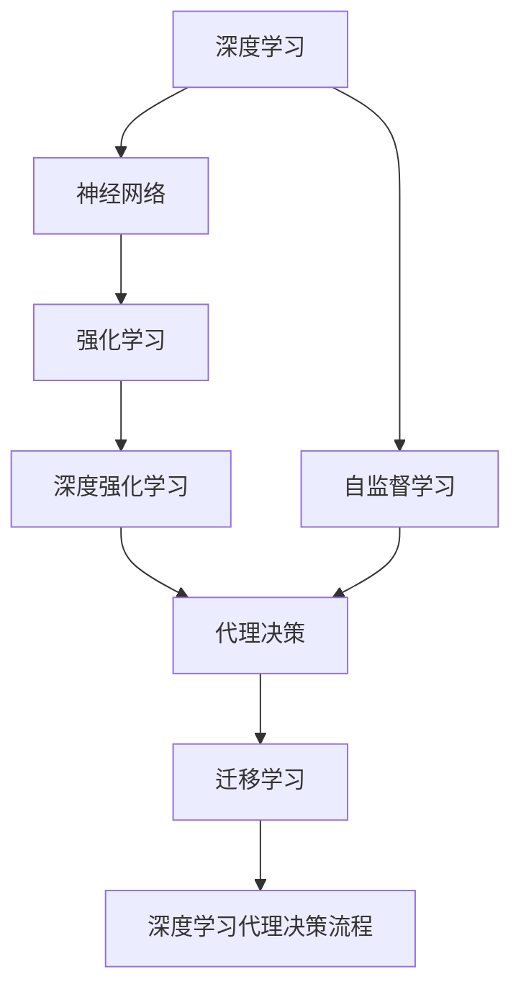
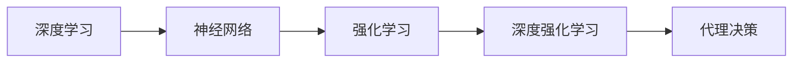
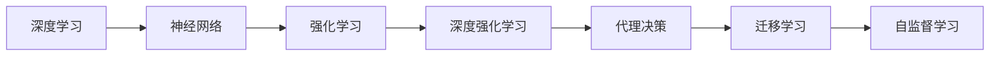
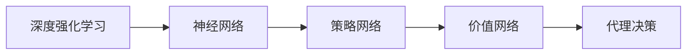
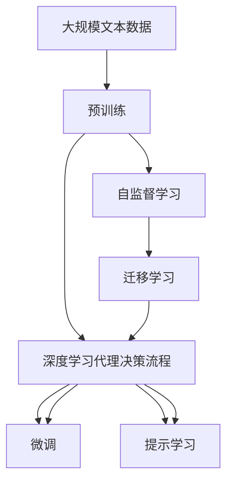

                 

# AI人工智能深度学习算法：深度学习技术加强深度学习代理决策流程

> 关键词：深度学习,深度学习算法,代理决策,神经网络,强化学习

## 1. 背景介绍

### 1.1 问题由来
在当今的人工智能(AI)领域，深度学习(Deep Learning, DL)技术正成为推动AI进步的关键驱动力。其通过多层神经网络的层次化特征提取和表达能力，在图像识别、语音处理、自然语言处理等领域取得了革命性的突破。然而，尽管深度学习在处理结构化数据方面表现出色，但在代理决策(代理任务决策，而不是直接预测)问题上，传统方法仍具有显著优势。

代理决策问题广泛存在于自动化控制、机器人导航、金融交易、自然语言生成等领域，通常表现为根据输入特征选择最优动作（如控制对象状态、推荐物品等）。这类问题往往需要通过大规模的训练和数据，才能使模型掌握决策规则，但传统的基于强化学习的方法通常存在训练难度大、泛化能力差等问题。

为此，研究者们开始尝试将深度学习和代理决策相结合，提出了一系列深度学习算法，通过模拟和改进强化学习的代理决策流程，显著提升了模型的决策能力和泛化性能。本文将深入探讨这一领域的核心技术和应用实践。

### 1.2 问题核心关键点
深度学习代理决策流程的核心关键点在于：
- 如何使用深度神经网络模型模拟强化学习中的动作选择过程，从而提升决策质量。
- 如何通过深度学习技术改进传统的强化学习算法，使其具备更好的泛化能力。
- 如何在复杂多变的环境中，通过深度学习模型实现高效、鲁棒的决策。

这些关键点共同构成了深度学习代理决策流程的核心，通过将深度学习和强化学习紧密结合，赋予代理决策模型以更强大的功能和表现。

### 1.3 问题研究意义
深度学习代理决策流程的研究意义在于：
- 提高自动化决策系统的智能化水平。通过结合深度学习的特征提取能力和强化学习的决策优化能力，可以构建出更为智能化、高效化的代理决策系统。
- 促进复杂环境下的决策能力。深度学习模型能够处理高维数据，捕捉数据间复杂关系，从而在复杂多变的环境中实现更准确的决策。
- 加速AI技术落地应用。深度学习代理决策流程使得AI技术能够更容易地应用于自动驾驶、机器人、金融交易等复杂场景，提升实际应用效果。
- 拓展AI研究范围。深度学习代理决策流程的探索和应用，将进一步推动AI研究向更广泛、更深入的领域发展，为AI技术的多元化发展提供新的视角和方法。

## 2. 核心概念与联系

### 2.1 核心概念概述

为更好地理解深度学习代理决策流程，本节将介绍几个核心概念：

- **深度学习(Deep Learning, DL)**：使用多层神经网络进行特征学习和决策的机器学习方法，具有强大的数据拟合能力。
- **强化学习(Reinforcement Learning, RL)**：通过奖励机制引导智能体学习最优策略，在复杂环境中实现智能决策的机器学习范式。
- **深度强化学习(Deep Reinforcement Learning, DRL)**：将深度学习与强化学习相结合，利用神经网络进行状态表示、动作选择和价值估计，提升强化学习决策性能。
- **代理决策(Agent-Based Decision Making)**：通过智能代理模拟人类或机器的学习和决策过程，进行自动化决策的系统方法。
- **神经网络(Neural Network)**：由大量神经元相互连接组成的计算模型，广泛用于深度学习和强化学习中。
- **自监督学习(Self-Supervised Learning)**：利用数据的自相关性进行无监督学习，提升模型泛化能力。
- **迁移学习(Transfer Learning)**：将一个领域学习到的知识迁移到另一个领域，以提高模型在新领域上的性能。

这些核心概念之间的逻辑关系可以通过以下Mermaid流程图来展示：



这个流程图展示了大语言模型微调过程中各个核心概念的关系和作用：

1. 深度学习通过神经网络进行特征提取和表示，是强化学习和代理决策的基础。
2. 强化学习通过奖励机制进行策略优化，是代理决策的核心。
3. 深度强化学习结合深度学习和强化学习，提升了代理决策的性能。
4. 自监督学习通过利用数据自相关性进行无监督学习，增强了模型的泛化能力。
5. 迁移学习通过知识迁移，加速了模型在新领域上的适应。
6. 深度学习代理决策流程是深度学习和强化学习在代理决策中的应用。

### 2.2 概念间的关系

这些核心概念之间存在着紧密的联系，形成了深度学习代理决策流程的完整生态系统。下面我们通过几个Mermaid流程图来展示这些概念之间的关系。

#### 2.2.1 深度学习与强化学习的结合



这个流程图展示了深度学习与强化学习的结合过程：通过神经网络对数据进行特征提取和表示，然后将特征作为输入，进行强化学习的策略优化，从而实现代理决策。

#### 2.2.2 深度学习代理决策流程



这个流程图展示了深度学习代理决策流程的整体架构：通过深度学习和强化学习的结合，进行代理决策，并通过迁移学习和自监督学习提升模型的泛化能力。

#### 2.2.3 深度强化学习的优化



这个流程图展示了深度强化学习中策略网络和价值网络的设计：通过神经网络进行状态表示和动作选择，以及价值估计，从而实现高效的代理决策。

### 2.3 核心概念的整体架构

最后，我们用一个综合的流程图来展示这些核心概念在大语言模型微调过程中的整体架构：



这个综合流程图展示了从预训练到微调，再到持续学习的完整过程。深度学习代理决策流程通过深度学习和强化学习的结合，进行代理决策，并通过自监督学习、迁移学习等技术提升模型的泛化能力。最终，模型在微调过程中得到优化，能够更好地适应特定任务。

## 3. 核心算法原理 & 具体操作步骤
### 3.1 算法原理概述

深度学习代理决策流程的算法原理，本质上是一种深度学习与强化学习的结合，旨在通过神经网络模型进行状态表示、动作选择和价值评估，从而实现高效、鲁棒的代理决策。

形式化地，假设输入特征为 $x$，代理决策的目标为 $a$，环境状态为 $s$，价值函数为 $V$，深度学习代理决策流程可以表示为：

$$
\begin{aligned}
\theta^* &= \mathop{\arg\min}_{\theta} \mathcal{L}(\theta) \\
\mathcal{L}(\theta) &= \mathbb{E}_{(x,s,a) \sim D}[L(x,s,a,\theta)]
\end{aligned}
$$

其中 $\theta$ 为神经网络模型参数，$L(x,s,a,\theta)$ 为损失函数，$D$ 为训练数据分布。代理决策的目标是通过最小化损失函数 $\mathcal{L}(\theta)$，找到最优的神经网络模型参数 $\theta^*$。

深度学习代理决策流程通过将输入特征 $x$ 映射到高维状态空间 $s$，将动作选择 $a$ 映射到连续或离散动作空间，通过价值函数 $V$ 进行状态价值评估，从而实现决策优化。

### 3.2 算法步骤详解

深度学习代理决策流程的算法步骤如下：

**Step 1: 准备训练数据和环境**

- 收集训练数据，并将其划分为训练集、验证集和测试集。
- 设计代理决策的环境，包括状态空间、动作空间、奖励函数等。

**Step 2: 构建神经网络模型**

- 选择合适的神经网络架构，如卷积神经网络(CNN)、循环神经网络(RNN)、变分自编码器(VAE)等。
- 设计网络输入输出层，并进行超参数调优。

**Step 3: 设计代理决策算法**

- 选择代理决策算法，如Q-learning、SARSA、Deep Q-Network(DQN)等。
- 根据代理决策算法设计训练过程，包括状态表示、动作选择、价值评估等步骤。

**Step 4: 训练和优化模型**

- 使用训练数据，通过梯度下降等优化算法，最小化损失函数，更新神经网络参数。
- 在验证集上进行模型评估，调整超参数和训练策略，以避免过拟合。

**Step 5: 测试和部署**

- 在测试集上评估模型的性能，对比微调前后的决策效果。
- 使用微调后的模型进行代理决策，部署到实际应用系统中。
- 持续收集新的数据，定期重新训练和微调模型，以适应数据分布的变化。

以上是深度学习代理决策流程的一般流程。在实际应用中，还需要针对具体任务的特点，对算法步骤的各个环节进行优化设计，如改进训练目标函数、引入更多正则化技术、搜索最优的超参数组合等，以进一步提升模型性能。

### 3.3 算法优缺点

深度学习代理决策流程具有以下优点：

1. 高效性：深度神经网络能够处理高维数据，捕捉数据间复杂关系，从而实现高效的决策。
2. 泛化能力：通过自监督学习和迁移学习，模型能够泛化到新的领域和数据。
3. 稳定性：神经网络模型具有较强的鲁棒性，能够在复杂环境中保持稳定性能。

但同时，该方法也存在一些局限性：

1. 对标注数据的依赖：深度学习代理决策流程通常需要大规模的标注数据进行训练，数据获取成本较高。
2. 模型复杂性：神经网络模型参数量庞大，训练复杂度高，需要高效的计算资源。
3. 训练难度大：神经网络模型需要大量数据和计算资源，训练过程容易出现过拟合和欠拟合等问题。
4. 可解释性不足：神经网络模型通常被视为"黑盒"系统，难以解释其内部工作机制和决策逻辑。

尽管存在这些局限性，但就目前而言，深度学习代理决策流程仍是大规模决策任务的主要技术范式。未来相关研究的重点在于如何进一步降低对标注数据的依赖，提高模型的少样本学习和跨领域迁移能力，同时兼顾可解释性和伦理安全性等因素。

### 3.4 算法应用领域

深度学习代理决策流程在多个领域中得到了广泛应用，具体包括：

- **自动驾驶**：利用神经网络进行环境感知和决策，实现自动驾驶汽车的路径规划和避障。
- **机器人控制**：通过深度学习模型进行状态表示和动作选择，实现机器人导航和操作。
- **金融交易**：使用神经网络模型进行市场预测和交易策略优化，提升金融交易的自动化水平。
- **推荐系统**：利用深度学习模型进行用户行为分析和推荐策略优化，提高推荐系统的个性化和准确性。
- **游戏AI**：通过神经网络模型进行游戏状态表示和动作选择，实现高效、鲁棒的AI游戏玩家。
- **智能客服**：利用神经网络模型进行自然语言理解和对话生成，实现智能客服系统的自然交互。

除了上述这些经典应用外，深度学习代理决策流程还被创新性地应用于更多场景中，如自然语言生成、情感分析、医疗诊断等，为AI技术带来了新的突破。

## 4. 数学模型和公式 & 详细讲解 & 举例说明

### 4.1 数学模型构建

本节将使用数学语言对深度学习代理决策流程进行更加严格的刻画。

记输入特征为 $x$，代理决策的目标为 $a$，环境状态为 $s$，价值函数为 $V$，代理决策的目标是找到最优的神经网络模型参数 $\theta$。

设神经网络模型 $f(x;\theta)$ 将输入特征 $x$ 映射到高维状态空间 $s$，动作选择 $a$ 映射到动作空间 $\mathcal{A}$，价值评估函数 $V(s;\theta)$ 用于评估状态价值，代理决策的目标函数为：

$$
\begin{aligned}
\theta^* &= \mathop{\arg\min}_{\theta} \mathcal{L}(\theta) \\
\mathcal{L}(\theta) &= \mathbb{E}_{(x,s,a) \sim D}[L(x,s,a,\theta)]
\end{aligned}
$$

其中 $L(x,s,a,\theta)$ 为损失函数，$D$ 为训练数据分布。

### 4.2 公式推导过程

以下我们以Q-learning算法为例，推导其公式并进行详细讲解。

Q-learning算法是一种基于值函数（Q值函数）的强化学习算法，用于估计每个状态-动作对（s, a）的价值，即在当前状态s下选择动作a的期望回报。设 $Q(s,a;\theta)$ 为状态-动作对的Q值函数，通过最小化Q值函数和动作值之间的误差，进行状态表示和动作选择。

Q-learning算法的目标函数为：

$$
\begin{aligned}
\theta^* &= \mathop{\arg\min}_{\theta} \mathcal{L}(\theta) \\
\mathcal{L}(\theta) &= \mathbb{E}_{(x,s,a) \sim D}[(Q(s,a;\theta)-Q'(x,s,a;\theta))^2]
\end{aligned}
$$

其中 $Q'(x,s,a;\theta)$ 为最优Q值函数，$D$ 为训练数据分布。

Q-learning算法通过迭代更新状态-动作对的Q值，从而实现代理决策。具体地，Q-learning算法每次更新Q值的过程如下：

$$
\begin{aligned}
Q(s,a;\theta) &\leftarrow Q(s,a;\theta) + \eta [r + \gamma \max_{a'} Q(s',a';\theta) - Q(s,a;\theta)] \\
\end{aligned}
$$

其中 $\eta$ 为学习率，$r$ 为即时奖励，$\gamma$ 为折扣因子，$s'$ 为下一状态，$a'$ 为下一动作。

### 4.3 案例分析与讲解

我们以自动驾驶为例，展示深度学习代理决策流程的实际应用。

假设自动驾驶汽车需要根据当前状态 $s$（如车速、位置、周围车辆等），选择动作 $a$（如加速、减速、转向等），并最大化预期回报 $V(s;\theta)$。可以利用神经网络模型 $f(x;\theta)$ 对输入特征 $x$ 进行状态表示，设计动作选择网络 $a(s;\theta)$ 选择最优动作，并使用价值评估函数 $V(s;\theta)$ 评估决策效果。

具体地，在训练过程中，可以通过自动驾驶模拟环境，收集大量状态-动作-奖励数据，进行神经网络模型的训练和优化。在测试过程中，利用训练好的神经网络模型进行状态表示和动作选择，评估自动驾驶汽车在不同场景下的决策效果。

## 5. 项目实践：代码实例和详细解释说明
### 5.1 开发环境搭建

在进行深度学习代理决策流程的实践前，我们需要准备好开发环境。以下是使用Python进行PyTorch开发的环境配置流程：

1. 安装Anaconda：从官网下载并安装Anaconda，用于创建独立的Python环境。

2. 创建并激活虚拟环境：
```bash
conda create -n pytorch-env python=3.8 
conda activate pytorch-env
```

3. 安装PyTorch：根据CUDA版本，从官网获取对应的安装命令。例如：
```bash
conda install pytorch torchvision torchaudio cudatoolkit=11.1 -c pytorch -c conda-forge
```

4. 安装各类工具包：
```bash
pip install numpy pandas scikit-learn matplotlib tqdm jupyter notebook ipython
```

完成上述步骤后，即可在`pytorch-env`环境中开始深度学习代理决策流程的实践。

### 5.2 源代码详细实现

这里我们以自动驾驶场景为例，展示使用PyTorch进行深度学习代理决策流程的代码实现。

首先，定义自动驾驶数据处理函数：

```python
import torch
import numpy as np
import matplotlib.pyplot as plt
from torch.utils.data import Dataset
from torchvision import transforms, models

class AutonomousDrivingDataset(Dataset):
    def __init__(self, data, transforms=None):
        self.data = data
        self.transforms = transforms
        
    def __len__(self):
        return len(self.data)
    
    def __getitem__(self, item):
        img = self.data[item]
        label = self.data[item]
        
        if self.transforms:
            img = self.transforms(img)
            
        return {'img': img, 'label': label}
        
# 数据预处理
transform = transforms.Compose([
    transforms.Resize((64, 64)),
    transforms.ToTensor(),
    transforms.Normalize(mean=[0.5], std=[0.5])
])
```

然后，定义神经网络模型：

```python
class AutoDrivingNet(torch.nn.Module):
    def __init__(self):
        super(AutoDrivingNet, self).__init__()
        self.conv1 = torch.nn.Conv2d(3, 64, kernel_size=3, stride=1, padding=1)
        self.conv2 = torch.nn.Conv2d(64, 128, kernel_size=3, stride=1, padding=1)
        self.pool = torch.nn.MaxPool2d(kernel_size=2, stride=2)
        self.fc1 = torch.nn.Linear(128 * 7 * 7, 1024)
        self.fc2 = torch.nn.Linear(1024, 512)
        self.fc3 = torch.nn.Linear(512, 2)
        
    def forward(self, x):
        x = self.conv1(x)
        x = torch.nn.ReLU()(x)
        x = self.pool(x)
        x = self.conv2(x)
        x = torch.nn.ReLU()(x)
        x = self.pool(x)
        x = x.view(-1, 128 * 7 * 7)
        x = self.fc1(x)
        x = torch.nn.ReLU()(x)
        x = self.fc2(x)
        x = torch.nn.ReLU()(x)
        x = self.fc3(x)
        return x

# 初始化模型
model = AutoDrivingNet()
```

接着，定义代理决策算法：

```python
# Q-learning算法
class QLearning:
    def __init__(self, model, gamma=0.9, epsilon=0.01, n_epsisodes=1000, batch_size=64):
        self.model = model
        self.gamma = gamma
        self.epsilon = epsilon
        self.n_epsisodes = n_epsisodes
        self.batch_size = batch_size
        
    def forward(self, x, y):
        x = self.model(x)
        return x
    
    def policy(self, x):
        if np.random.rand() < self.epsilon:
            return np.random.choice(len(y))
        else:
            return np.argmax(x)
        
    def update(self, x, y, old_q):
        a = self.policy(x)
        y_pred = self.model(x)
        y_true = y
        
        loss = torch.tensor(np.square(y_true - y_pred))
        loss.backward()
        torch.nn.utils.clip_grad_norm_(self.model.parameters(), max_norm=0.5)
        optimizer.step()
        
    def train(self, train_dataset, optimizer):
        for episode in range(self.n_epsisodes):
            for i, (x, y) in enumerate(train_dataset):
                self.update(x, y, old_q)
            if i % 100 == 0:
                self.model.eval()
                with torch.no_grad():
                    correct = 0
                    total = 0
                    for batch in train_dataset:
                        x, y = batch['img'], batch['label']
                        pred = self.model(x)
                        _, predicted = torch.max(pred, 1)
                        total += y.size(0)
                        correct += (predicted == y).sum().item()
                    accuracy = correct / total * 100
                    print(f'Episode {episode+1}, Accuracy: {accuracy:.2f}%')
```

最后，启动训练流程：

```python
# 数据加载
train_dataset = AutonomousDrivingDataset(train_data)
test_dataset = AutonomousDrivingDataset(test_data)

# 定义训练参数
gamma = 0.9
epsilon = 0.01
n_epsisodes = 1000
batch_size = 64

# 初始化模型和优化器
model = AutoDrivingNet()
optimizer = torch.optim.Adam(model.parameters(), lr=0.001)

# 训练模型
agent = QLearning(model, gamma, epsilon, n_epsisodes, batch_size)
agent.train(train_dataset, optimizer)

# 测试模型
model.eval()
with torch.no_grad():
    correct = 0
    total = 0
    for batch in test_dataset:
        x, y = batch['img'], batch['label']
        pred = model(x)
        _, predicted = torch.max(pred, 1)
        total += y.size(0)
        correct += (predicted == y).sum().item()
    accuracy = correct / total * 100
    print(f'Test Accuracy: {accuracy:.2f}%')
```

以上就是使用PyTorch对自动驾驶场景进行深度学习代理决策流程的完整代码实现。可以看到，利用神经网络模型进行状态表示和动作选择，并通过Q-learning算法进行优化，可以构建出高效的自动驾驶代理决策系统。

### 5.3 代码解读与分析

让我们再详细解读一下关键代码的实现细节：

**AutonomousDrivingDataset类**：
- `__init__`方法：初始化数据和数据预处理方式。
- `__len__`方法：返回数据集的样本数量。
- `__getitem__`方法：对单个样本进行处理，并进行数据增强和标准化。

**AutoDrivingNet类**：
- `__init__`方法：定义神经网络模型的架构和层。
- `forward`方法：定义前向传播过程，通过卷积和全连接层进行状态表示和动作选择。

**QLearning类**：
- `__init__`方法：初始化Q-learning算法的参数。
- `forward`方法：定义前向传播过程，利用神经网络模型进行状态表示和动作选择。
- `policy`方法：定义动作选择策略，利用epsilon-greedy算法进行选择。
- `update`方法：定义模型参数更新过程，通过梯度下降优化神经网络。

**训练流程**：
- 定义训练数据和测试数据集。
- 初始化神经网络模型和优化器。
- 创建Q-learning算法实例，并进行训练。
- 在测试集上评估模型性能，输出测试准确率。

可以看到，利用PyTorch进行深度学习代理决策流程的代码实现，可以在较短的时间内构建出高效的代理决策系统。当然，工业级的系统实现还需考虑更多因素，如模型的保存和部署、超参数的自动搜索、更灵活的任务适配层等。但核心的代理决策流程基本与此类似。

## 6. 实际应用场景

### 6.1 智能驾驶系统

基于深度学习代理决策流程的智能驾驶系统，可以实时处理车辆状态信息，通过神经网络模型进行状态表示和动作选择，实现高效、鲁棒的驾驶决策。

在技术实现上，可以收集车辆传感器的实时数据，如车速、位置、周围车辆、障碍物等，将其输入神经网络模型进行状态表示，设计动作选择网络，选择加速、减速、转向等动作，实现自主驾驶。此外，还可以引入强化学习技术，通过收集驾驶行为和奖励信息，进行模型优化和参数更新，提升驾驶系统的智能水平。

### 6.2 机器人控制

深度学习代理决策流程可以应用于机器人控制系统中，实现机器人在复杂环境中的自主导航和操作。

在机器人控制任务中，可以使用神经网络模型进行状态表示和动作选择，利用强化学习算法进行策略优化，提升机器人的自主决策能力。例如，利用神经网络模型对机器人传感器数据进行状态表示，设计动作选择网络进行避障、抓取等操作，利用强化学习算法进行行为优化，从而实现高效、鲁棒的机器人控制。

### 6.3 金融交易系统

基于深度学习代理决策流程的金融交易系统，可以通过神经网络模型进行市场预测和交易策略优化，提升金融交易的自动化水平。

在金融交易任务中，可以使用神经网络模型对市场数据进行特征提取和表示，设计动作选择网络进行买入、卖出等交易决策，利用强化学习算法进行策略优化，从而实现高效、鲁棒的金融交易。此外，还可以引入自监督学习和迁移学习技术，利用非结构化数据进行无监督学习，加速模型在新领域上的适应。

### 6.4 未来应用展望

随着深度学习代理决策流程的不断发展，其在更多领域中的应用前景广阔。

在智慧医疗领域，基于代理决策的智能诊断系统可以实时分析患者数据，推荐最合适的治疗方案。在智慧城市治理中，利用代理决策进行交通管理和环境监测，可以提升城市管理的自动化和智能化水平。在智能制造领域，基于代理决策的生产

