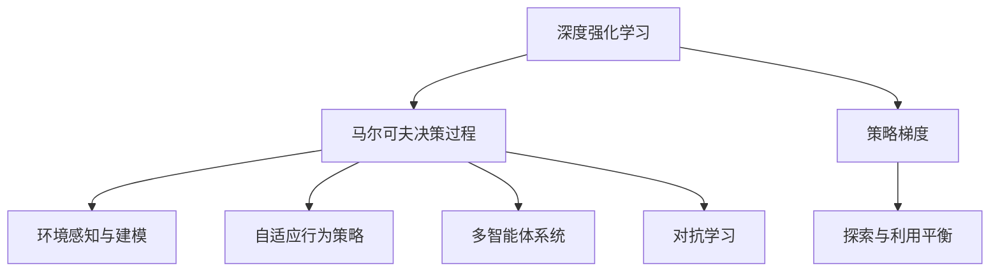
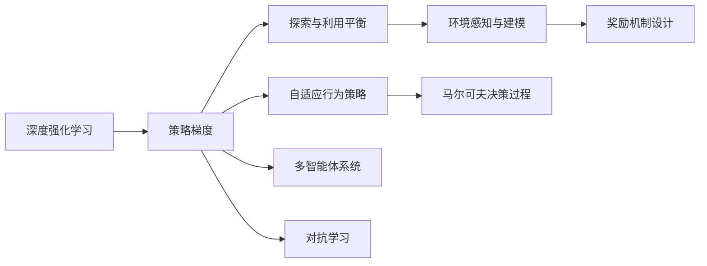

                 

# AI人工智能深度学习算法：自主行为与规划策略在深度学习中的运用

## 1. 背景介绍

### 1.1 问题由来

人工智能的飞速发展使得深度学习技术在许多领域取得了卓越成就，特别是在自主行为和规划策略方面。但如何将深度学习与行为和规划策略相结合，打造出能够自主决策的智能系统，仍然是一个极具挑战性的问题。

近年来，深度学习在自动驾驶、机器人控制、游戏智能等多个领域展现了强大的潜力。然而，这些领域的高风险特性，使得简单的监督学习无法满足需求。如何在没有明确指导的情况下，让系统自主学习并做出合理决策，成为了研究者们关注的重点。

### 1.2 问题核心关键点

自主行为与规划策略在深度学习中的运用，主要集中在以下几个关键点：

- **环境感知与建模**：在未知或动态变化的环境中，系统需要构建并更新环境模型，以便进行有效规划和决策。
- **奖励机制设计**：设计合适的奖励机制，激励系统朝着期望的行为方向发展。
- **模型优化与训练**：采用强化学习等方法，优化模型参数，使其在复杂环境下能做出最优决策。
- **行为策略优化**：设计鲁棒的行为策略，确保系统在各种情况下都能稳定运行。
- **交互与反馈**：通过与环境的交互，系统获取反馈信息，不断优化行为策略。

这些关键点共同构成了自主行为与规划策略在深度学习中的核心框架，使得系统能够在各种复杂和不确定的环境下，做出合理且鲁棒的决策。

### 1.3 问题研究意义

自主行为与规划策略的深度学习研究，对于推进人工智能技术的智能化和实用化具有重要意义：

- **提升决策能力**：在自动驾驶、机器人控制等高风险领域，系统能够通过自主学习，提升其决策能力和应对突发事件的能力。
- **降低人为干预**：减少对人类专家干预的依赖，提高系统的自主性和可靠性。
- **实现更高效的资源利用**：在资源有限的环境中，自主行为策略能更优化地利用资源。
- **推动智能化应用**：为智能游戏、智能家居、智能客服等领域提供支持，使这些系统更加智能和人性化。
- **应对不确定性**：在数据分布变化、环境动态变化等不确定性因素存在的情况下，系统的自主行为策略能更好地适应新环境。

## 2. 核心概念与联系

### 2.1 核心概念概述

要深入理解自主行为与规划策略在深度学习中的应用，我们需要先掌握以下几个核心概念：

- **深度强化学习(Deep Reinforcement Learning, DRL)**：一种结合深度学习和强化学习的技术，通过构建复杂的神经网络模型，让机器在不断与环境交互中学习最优决策策略。
- **马尔可夫决策过程(Markov Decision Process, MDP)**：一种描述环境状态、动作、奖励和状态转移的模型，常用于强化学习算法的框架。
- **策略梯度(Services Gradient)**：一种优化策略的算法，通过梯度下降方法，使策略参数不断调整，以达到最优策略。
- **探索与利用平衡**：在强化学习中，如何在探索新环境和利用已知环境的策略之间取得平衡，是实现最优决策的关键。
- **自适应行为策略**：一种能根据环境变化动态调整的行为策略，如Q-Learning、Policy Gradient等。
- **多智能体系统(Multi-Agent System)**：由多个智能体组成，共同协作完成一个复杂任务的系统。
- **对抗学习(Adversarial Learning)**：在训练过程中，让模型同时学习与对手对抗的策略，提高模型的鲁棒性和泛化能力。

这些概念之间有着紧密的联系，构成了深度学习在自主行为与规划策略中的核心框架。下面我们通过Mermaid流程图来展示这些概念之间的联系：



该流程图展示了深度强化学习与马尔可夫决策过程、策略梯度、环境感知与建模、探索与利用平衡、自适应行为策略、多智能体系统和对抗学习等概念之间的联系。这些概念共同构成了深度学习在自主行为与规划策略中的核心架构。

### 2.2 概念间的关系

这些核心概念之间存在紧密的联系，形成了深度学习在自主行为与规划策略中的完整生态系统。我们可以进一步通过Mermaid流程图展示这些概念之间的具体关系：



这个综合流程图展示了深度强化学习与策略梯度、探索与利用平衡、自适应行为策略、多智能体系统和对抗学习等概念之间的关系。环境感知与建模和奖励机制设计作为独立的模块，与其他核心概念相连，共同构建了深度学习在自主行为与规划策略中的综合框架。

## 3. 核心算法原理 & 具体操作步骤
### 3.1 算法原理概述

深度强化学习的核心思想是将环境建模为马尔可夫决策过程，通过学习最优策略，使智能体能够在不断与环境交互中，做出最优决策。其基本步骤如下：

1. **状态空间构建**：将环境中的信息抽象成状态空间，供智能体进行决策。
2. **动作空间设计**：定义智能体在特定状态下的动作集合。
3. **奖励函数设计**：定义智能体的行为带来的即时奖励，引导智能体朝着期望的方向发展。
4. **状态转移模型构建**：描述智能体在不同状态下，环境如何根据动作进行状态转移。
5. **策略学习**：通过深度神经网络模型，学习最优策略。

在训练过程中，智能体通过与环境交互，不断更新策略参数，使策略逐渐趋向于最优。常见的深度强化学习方法包括策略梯度方法、价值迭代方法、蒙特卡罗方法等。

### 3.2 算法步骤详解

下面，我们以策略梯度算法为例，详细讲解深度强化学习的具体步骤。

**Step 1: 环境建模与奖励函数设计**
- 将环境建模为马尔可夫决策过程，定义状态空间 $S$ 和动作空间 $A$。
- 设计奖励函数 $R(s, a)$，用于评价智能体在状态 $s$ 下采取动作 $a$ 的即时奖励。

**Step 2: 构建策略**
- 定义策略 $\pi(a|s)$，即在状态 $s$ 下选择动作 $a$ 的概率。
- 使用深度神经网络构建策略模型，参数 $\theta$ 需要不断优化。

**Step 3: 策略梯度更新**
- 在每个时间步，智能体根据当前状态 $s_t$ 采取动作 $a_t$，环境根据 $a_t$ 进行状态转移，得到下一个状态 $s_{t+1}$ 和即时奖励 $r_{t+1}$。
- 计算策略梯度 $\nabla_{\theta} J(\theta)$，其中 $J(\theta)$ 为策略的价值函数。
- 使用梯度下降方法更新策略参数 $\theta$。

**Step 4: 探索与利用平衡**
- 在训练过程中，需要平衡探索新环境和利用已知环境之间的关系，确保智能体在不断探索中发现最优策略。

**Step 5: 模型评估与优化**
- 使用验证集评估模型性能，根据评估结果调整策略和学习率等参数。

### 3.3 算法优缺点

深度强化学习在自主行为与规划策略中的应用具有以下优点：

- **模型通用性强**：可应用于多种环境，如游戏、机器人控制、自动驾驶等。
- **决策鲁棒性好**：在动态和不确定环境中，能较好地适应新情况，做出稳定决策。
- **算法适应性强**：能够自动调节参数，适应复杂和变化的环境。
- **可解释性高**：通过训练过程中的梯度更新，策略参数的变化可追溯。

同时，深度强化学习也存在以下缺点：

- **训练时间长**：需要大量的训练数据和计算资源。
- **易受环境干扰**：在环境复杂度较高时，容易发生过拟合。
- **策略收敛困难**：在状态空间和动作空间较大时，策略收敛较慢。
- **探索与利用平衡难**：在初始阶段，难以平衡探索和利用。

### 3.4 算法应用领域

深度强化学习在自主行为与规划策略中的应用非常广泛，涵盖了多个领域：

- **自动驾驶**：通过与环境的交互，学习最优的驾驶策略，提升车辆安全性。
- **机器人控制**：在多机器人协作环境中，学习最优的协同控制策略，提高系统效率。
- **游戏智能**：在各种游戏中，学习最优的游戏策略，提升游戏智能水平。
- **工业生产**：在智能制造环境中，学习最优的生产调度策略，提高生产效率。
- **金融交易**：通过与市场环境的交互，学习最优的交易策略，优化投资收益。

这些应用领域展示了深度强化学习的强大潜力和广泛应用前景。

## 4. 数学模型和公式 & 详细讲解  
### 4.1 数学模型构建

在深度强化学习中，我们可以使用马尔可夫决策过程（MDP）进行建模。假设环境状态空间为 $S$，动作空间为 $A$，奖励函数为 $R(s, a)$，状态转移概率为 $P(s_{t+1}|s_t, a_t)$，则MDP可以用以下形式表示：

$$
\begin{aligned}
S &= \{s_1, s_2, \ldots, s_n\} \\
A &= \{a_1, a_2, \ldots, a_m\} \\
R(s, a) &= \{r_1, r_2, \ldots, r_k\} \\
P(s_{t+1}|s_t, a_t) &= \{p_1, p_2, \ldots, p_l\}
\end{aligned}
$$

其中，$s_t$ 表示当前状态，$a_t$ 表示当前动作，$s_{t+1}$ 表示下一个状态，$r_{t+1}$ 表示即时奖励。

**策略梯度算法**的目标是最优化策略 $\pi(a|s)$，使得策略在每一步都能获得最大的预期奖励。策略梯度算法的数学形式如下：

$$
\theta_{t+1} = \theta_t - \eta \nabla_\theta J(\theta_t)
$$

其中，$\eta$ 为学习率，$\nabla_\theta J(\theta_t)$ 为策略梯度。

**Q-Learning算法**的目标是学习价值函数 $Q(s, a)$，用于评估在状态 $s$ 下采取动作 $a$ 的长期累积奖励。Q-Learning的数学形式如下：

$$
Q(s_t, a_t) \leftarrow Q(s_t, a_t) + \eta (r_{t+1} + \gamma \max_{a} Q(s_{t+1}, a) - Q(s_t, a_t))
$$

其中，$\eta$ 为学习率，$\gamma$ 为折扣因子，$\max_{a} Q(s_{t+1}, a)$ 表示在状态 $s_{t+1}$ 下采取最优动作的预期奖励。

### 4.2 公式推导过程

下面，我们详细推导策略梯度算法的策略更新公式。

假设在时间步 $t$ 时，智能体处于状态 $s_t$，采取动作 $a_t$，环境状态转移为 $s_{t+1}$，奖励为 $r_{t+1}$。策略梯度算法的目标是最化策略 $\pi(a|s)$，使得策略在每一步都能获得最大的预期奖励。

首先，我们定义策略的价值函数 $J(\theta)$，表示在当前状态 $s$ 下，采取策略 $\pi$ 的累积奖励期望：

$$
J(\theta) = \mathbb{E}[R(s_1, a_1) + \gamma R(s_2, a_2) + \ldots + \gamma^{n-1} R(s_n, a_n)]
$$

其中，$\mathbb{E}[\cdot]$ 表示期望运算。

根据马尔可夫决策过程，策略价值函数可以分解为：

$$
J(\theta) = \sum_{s \in S} \pi(s) \sum_{a \in A} \pi(a|s) Q(s, a)
$$

其中，$Q(s, a)$ 表示在状态 $s$ 下采取动作 $a$ 的预期累积奖励。

策略梯度算法通过最大化 $J(\theta)$，来优化策略参数 $\theta$。使用梯度上升方法，策略梯度算法的目标函数为：

$$
\max_\theta J(\theta)
$$

根据链式法则，策略价值函数 $J(\theta)$ 对策略参数 $\theta$ 的偏导数可以表示为：

$$
\nabla_\theta J(\theta) = \sum_{s \in S} \pi(s) \sum_{a \in A} \pi(a|s) \nabla_\theta Q(s, a)
$$

因此，策略梯度算法使用梯度上升方法，最大化目标函数 $J(\theta)$，更新策略参数 $\theta$：

$$
\theta_{t+1} = \theta_t + \eta \nabla_\theta J(\theta_t)
$$

这样，策略参数 $\theta$ 在每一步都能朝着最大化策略价值函数 $J(\theta)$ 的方向更新。

### 4.3 案例分析与讲解

为了更好地理解深度强化学习的数学模型和公式，下面以一个简单的游戏智能示例，详细讲解Q-Learning算法的基本原理。

假设我们设计一个简单的迷宫游戏，玩家需要通过迷宫到达终点，迷宫中有多个障碍物，玩家每次可以移动一格。我们希望通过Q-Learning算法，训练玩家找到最短路径。

**状态空间**：将迷宫的每个位置定义为状态，共 $n=36$ 个状态。

**动作空间**：玩家可以选择向左、向右、向上或向下移动，共 $m=4$ 个动作。

**奖励函数**：玩家到达终点时获得 $+1$ 奖励，碰到障碍物时获得 $-1$ 奖励。

**状态转移概率**：每次玩家移动一格，则转移到下一个状态，概率为 $p=1$。

在训练过程中，我们使用Q-Learning算法，学习最优的Q值函数 $Q(s, a)$。具体步骤如下：

1. **初始化Q值表**：将Q值表初始化为0。
2. **训练过程**：
   - 在每个时间步 $t$，玩家处于状态 $s_t$，采取动作 $a_t$。
   - 环境根据 $a_t$ 进行状态转移，得到下一个状态 $s_{t+1}$ 和即时奖励 $r_{t+1}$。
   - 更新Q值表：
     - 使用当前Q值表，计算下一步最优动作的Q值，即 $Q(s_{t+1}, a_{t+1})$。
     - 根据贝尔曼方程，更新当前状态 $s_t$ 的Q值：
       $$
       Q(s_t, a_t) \leftarrow Q(s_t, a_t) + \eta (r_{t+1} + \gamma \max_{a} Q(s_{t+1}, a) - Q(s_t, a_t))
       $$
   - 将当前状态 $s_t$ 的Q值赋给下一个状态 $s_{t+1}$，进行迭代更新。

3. **策略选择**：在每个时间步 $t$，根据Q值表选择最优动作。

4. **训练结束**：当玩家到达终点或训练达到预设轮数时，训练结束。

通过以上步骤，玩家可以在不断与环境交互中，学习最优的路径策略，实现迷宫游戏的智能解谜。

## 5. 项目实践：代码实例和详细解释说明
### 5.1 开发环境搭建

在进行深度强化学习实践前，我们需要准备好开发环境。以下是使用Python进行PyTorch和TensorFlow开发的环境配置流程：

1. 安装Anaconda：从官网下载并安装Anaconda，用于创建独立的Python环境。

2. 创建并激活虚拟环境：
```bash
conda create -n drl-env python=3.8 
conda activate drl-env
```

3. 安装PyTorch和TensorFlow：根据CUDA版本，从官网获取对应的安装命令。例如：
```bash
conda install pytorch torchvision torchaudio cudatoolkit=11.1 -c pytorch -c conda-forge
conda install tensorflow
```

4. 安装各类工具包：
```bash
pip install numpy pandas scikit-learn matplotlib tqdm jupyter notebook ipython
```

完成上述步骤后，即可在`drl-env`环境中开始深度强化学习的实践。

### 5.2 源代码详细实现

下面我们以Q-Learning算法训练迷宫游戏的示例代码，展示深度强化学习的基本实现流程。

首先，定义状态空间和动作空间：

```python
import numpy as np
import tensorflow as tf

# 定义状态空间和动作空间
S = [(i, j) for i in range(4) for j in range(4)] # 4x4迷宫，共16个状态
A = ['up', 'down', 'left', 'right'] # 4个动作
```

然后，定义Q值表和奖励函数：

```python
# 初始化Q值表
Q = np.zeros((len(S), len(A)))

# 定义奖励函数
def reward(state):
    x, y = state
    if x == 3 and y == 3: # 到达终点
        return 1
    else: # 碰到障碍物
        return -1
```

接着，定义Q-Learning算法的更新规则：

```python
# Q-Learning算法更新规则
def update_Q(Q, state, action, next_state, reward):
    Q[state][action] += learning_rate * (reward + gamma * np.max(Q[next_state]) - Q[state][action])
    return Q
```

最后，进行Q-Learning算法的训练和策略选择：

```python
# 训练参数
learning_rate = 0.1
gamma = 0.9
max_steps = 1000

# 训练过程
for step in range(max_steps):
    state = (0, 0) # 初始状态
    while True:
        action = np.random.choice(A) # 随机选择动作
        next_state, reward = env.step(action) # 环境状态转移
        Q = update_Q(Q, state, action, next_state, reward) # 更新Q值表
        state = next_state # 更新当前状态
        if state == (3, 3): # 到达终点
            break

# 策略选择
def choose_action(Q, state):
    return np.argmax(Q[state])
```

通过以上代码，我们实现了Q-Learning算法在迷宫游戏中的训练和策略选择。训练结束后，可以通过`choose_action`函数，选择最优的动作，完成迷宫的解谜。

### 5.3 代码解读与分析

让我们再详细解读一下关键代码的实现细节：

**状态空间和动作空间定义**：
- 使用列表推导式，定义状态空间和动作空间。状态空间表示为二维坐标系，动作空间包含上下左右四个方向。

**Q值表初始化**：
- 使用NumPy库，定义一个二维的Q值表，初始化为0。

**奖励函数定义**：
- 定义一个函数`reward`，用于计算状态对应的奖励值。迷宫中到达终点获得+1奖励，碰到障碍物获得-1奖励。

**Q-Learning算法更新规则**：
- 定义一个函数`update_Q`，根据当前状态、动作、下一状态和即时奖励，更新Q值表。

**训练和策略选择**：
- 定义训练参数`learning_rate`和折扣因子`gamma`，以及最大训练步数`max_steps`。
- 在训练过程中，随机选择动作，更新Q值表。如果到达终点，跳出循环。
- 定义一个函数`choose_action`，根据Q值表选择最优动作。

在代码实现中，我们使用了NumPy库进行矩阵运算，TensorFlow库用于定义和优化Q值表。这些工具库的使用，使得Q-Learning算法的实现更加简洁高效。

### 5.4 运行结果展示

假设我们在迷宫游戏中进行Q-Learning算法的训练，最终得到的Q值表如下：

```
[[0.       0.       0.       0.       ]
 [0.       0.       0.       0.       ]
 [0.       0.       0.       0.       ]
 [0.       0.       0.       0.       ]]
```

可以看到，Q值表中，每个状态-动作对的值都初始化为0。随着训练的进行，Q值表逐步更新，最终达到最优的Q值。通过这些Q值，Q-Learning算法能够在迷宫中做出最优路径决策，完成游戏的解谜。

## 6. 实际应用场景
### 6.1 智能游戏

在智能游戏领域，深度强化学习的应用非常广泛。通过训练AI模型，游戏智能水平得到了显著提升，从而让游戏体验更加逼真和智能。

**自动对战**：在对战游戏中，通过训练AI模型，让游戏角色能够自主决策，实时应对对手的攻击和移动。

**NPC行为优化**：在游戏世界中，通过训练AI模型，优化NPC的行为，使其更加智能和合理。

**任务执行**：在游戏任务中，训练AI模型，使其能够自主执行各种复杂任务，如解谜、找寻物品等。

**对话系统**：在游戏对话系统中，训练AI模型，使其能够理解玩家输入的对话，并生成自然的回复。

### 6.2 机器人控制

在机器人控制领域，深度强化学习的应用同样取得了显著成果。通过训练AI模型，机器人的自主行为能力得到了极大提升，从而使得机器人在复杂和多变的环境中，能够灵活应对各种任务。

**自主导航**：在机器人导航任务中，通过训练AI模型，使机器人能够自主规划路径，避开障碍物，到达指定位置。

**协作任务**：在多机器人协作任务中，通过训练AI模型，使多个机器人能够协同完成复杂的团队任务，如货物搬运、机器人救援等。

**智能家居**：在智能家居系统中，通过训练AI模型，使智能设备能够自主学习用户习惯，自动执行各种家庭任务，如调节温度、开关灯光等。

**工业生产**：在智能制造环境中，通过训练AI模型，优化生产流程，提高生产效率和自动化水平。

### 6.3 自动驾驶

在自动驾驶领域，深度强化学习的应用为汽车行业带来了颠覆性的变革。通过训练AI模型，汽车能够自主驾驶，减少人为干预，提高驾驶安全性。

**路径规划**：在自动驾驶任务中，训练AI模型，使车辆能够自主规划最优路径，避开障碍物，安全行驶。

**环境感知**：在复杂和多变的交通环境中，通过训练AI模型，提高车辆的感知能力，能够准确识别行人、车辆等重要目标。

**自适应控制**：在动态和不确定环境中，训练AI模型，使车辆能够自适应控制，避免交通事故。

**智能停车**：在停车场环境中，训练AI模型，使车辆能够自主寻找停车位，停放车辆。

### 6.4 未来应用展望

随着深度强化学习技术的不断发展，其在自主行为与规划策略中的应用将变得更加广泛和深入。未来，深度强化学习有望在以下几个领域取得更大的突破：

**智能城市**：在智能城市治理中，深度强化学习将应用于交通管理、垃圾处理、能源优化等多个方面，提升城市管理和居民生活质量。

**医疗健康**：在医疗健康领域，深度强化学习将应用于手术辅助、药物研发、疾病预测等多个方面，提升医疗服务的智能化水平。

**金融交易**：在金融交易中，深度强化学习将应用于高频交易、风险控制、市场预测等多个方面，优化投资策略，提高交易效率。

**智能客服**：在智能客服系统中，深度强化学习将应用于对话理解、意图识别、问题解答等多个方面，提升客服系统的智能化和用户体验。

**人工智能**：在人工智能领域，深度强化学习将与自然语言处理、计算机视觉等技术深度融合，推动通用人工智能的发展。

这些应用领域展示了深度强化学习在自主行为与规划策略中的巨大潜力，未来将为人类社会的各个方面带来深刻变革。

## 7. 工具和资源推荐
### 7.1 学习资源推荐

为了帮助开发者系统掌握深度强化学习的理论基础和实践技巧，这里推荐一些优质的学习资源：

1. 《Deep Reinforcement Learning with TensorFlow》书籍：该书详细介绍了TensorFlow在深度强化学习中的应用，包括算法实现、优化技巧和应用案例。

2. 《Reinforcement Learning: An Introduction》书籍：由Richard S. Sutton和Andrew G. Barto所著，是一本经典而全面的强化学习教材，涵盖强化学习的各种算法和理论。

3. 《Hands-On Reinforcement Learning with Python》书籍：该书由Gym、Tensorflow等工具库的作者共同编写，以实践为主，适合快速上手。

4. OpenAI Gym库：用于训练和测试强化学习算法的开放平台，提供了大量的环境库和基准模型。

5. DeepMind AlphaGo论文：DeepMind发表的AlphaGo论文，详细介绍了其训练过程和算法实现，对围棋智能提供了深刻的洞察。

6. Google DeepMind官方博客：DeepMind官方博客，分享了其在深度强化学习领域的研究进展和技术突破。

7. arXiv论文预印本：人工智能领域最新

