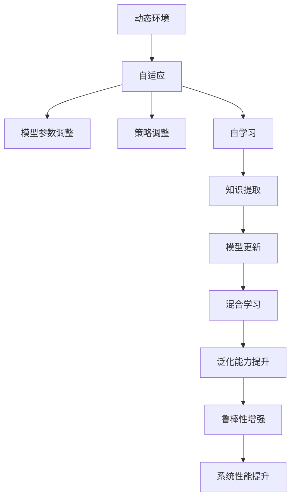
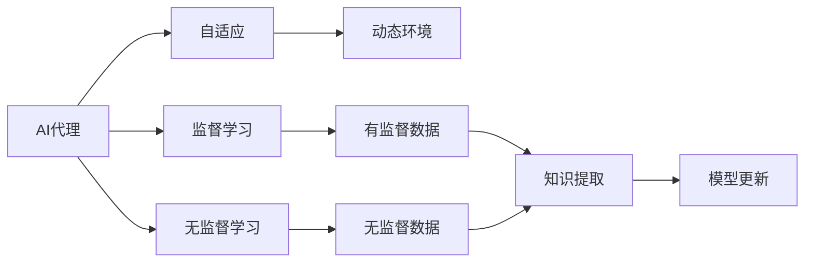
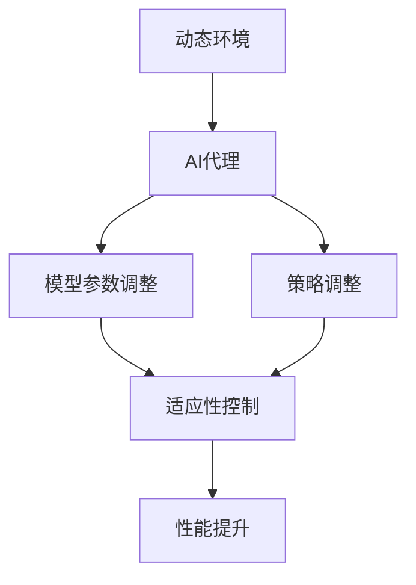
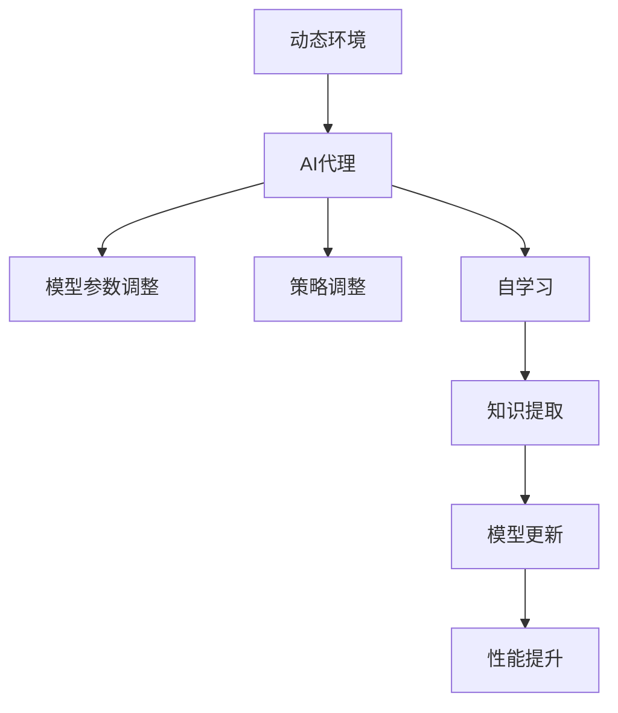
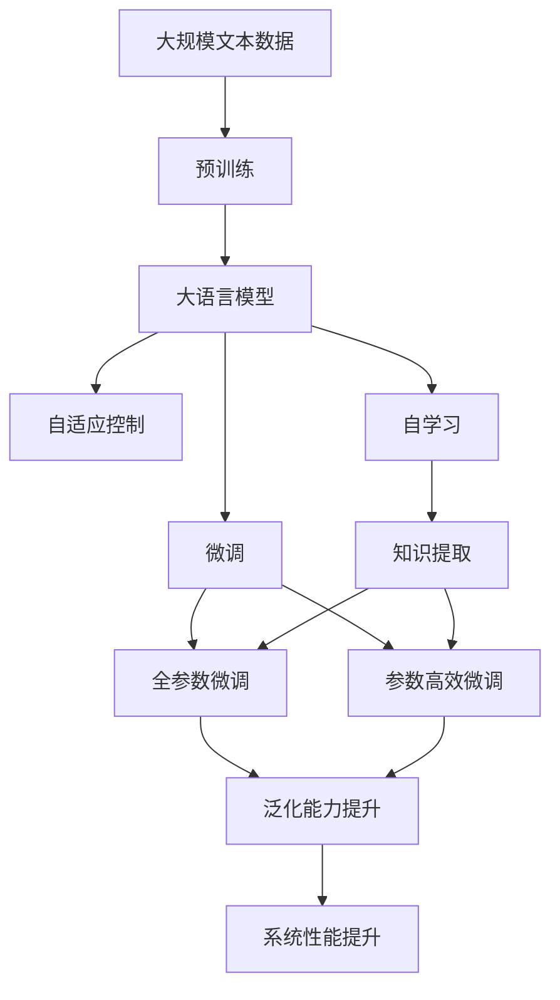

                 

# AI代理在动态环境中的适应与学习工作流

> 关键词：动态环境,适应性,自学习,人工智能,代理系统

## 1. 背景介绍

### 1.1 问题由来

随着人工智能技术的飞速发展，智能代理（AI Agent）在众多领域被广泛应用，如智能推荐系统、自动驾驶、机器人控制等。然而，环境动态性是AI代理面临的一大挑战。在静态环境下，AI代理可以通过预训练和监督学习等方式获得相对稳定的性能。但一旦进入动态环境，如网络、市场、交通等，其表现往往大幅下降，甚至出现完全失效的情况。

### 1.2 问题核心关键点

AI代理在动态环境中的适应与学习工作流，旨在通过自适应和自学习机制，使代理系统能够持续跟踪环境变化，提升其在动态环境下的性能和鲁棒性。核心点包括：

1. **自适应能力**：代理系统能够根据环境变化自动调整参数和策略，避免过拟合和灾难性遗忘。
2. **自学习机制**：代理系统能够从环境中提取新知识，更新模型，提升预测和决策能力。
3. **混合学习**：结合监督学习和无监督学习，提升模型在动态环境下的泛化能力和鲁棒性。

### 1.3 问题研究意义

AI代理在动态环境中的适应与学习工作流研究，对于提升智能系统的适应性和智能化水平，具有重要意义：

1. **提高系统鲁棒性**：在动态环境如市场、交通、网络中，代理系统能够持续学习新知识，适应变化，保持稳定性和可靠性。
2. **降低部署成本**：代理系统无需频繁重训和部署，可以持续运行，节省人力和计算资源。
3. **增强用户体验**：通过动态适应和自学习，代理系统能够提供更加个性化和智能化的服务，提升用户满意度。
4. **促进技术进步**：研究动态环境下的适应与学习，可以为智能系统的设计提供更多理论指导和技术支持。

## 2. 核心概念与联系

### 2.1 核心概念概述

为更好地理解AI代理在动态环境中的适应与学习工作流，本节将介绍几个关键概念及其相互关系：

- **动态环境（Dynamic Environment）**：指AI代理所处的不断变化的环境，如市场价格、网络流量、交通路况等。
- **自适应（Adaptation）**：指AI代理根据环境变化自动调整模型参数和策略的过程，避免过拟合和遗忘旧知识。
- **自学习（Autonomous Learning）**：指AI代理无需外界干预，从环境数据中提取新知识，更新模型，提升决策能力。
- **混合学习（Hybrid Learning）**：指结合监督学习和无监督学习，提升模型在动态环境下的泛化能力和鲁棒性。
- **适应性控制（Adaptive Control）**：指通过调整模型参数和策略，实现对动态环境的适应。

这些概念之间的关系可以通过以下Mermaid流程图来展示：



这个流程图展示了动态环境、自适应、自学习、混合学习之间的联系，以及它们对系统性能提升的影响。

### 2.2 概念间的关系

这些核心概念之间存在紧密的联系，形成了AI代理在动态环境中的适应与学习生态系统。下面通过几个Mermaid流程图来进一步展示这些概念之间的关系：

#### 2.2.1 AI代理的学习范式



这个流程图展示了AI代理在动态环境中的学习范式，结合了监督学习和无监督学习，以及从动态环境中提取知识的过程。

#### 2.2.2 动态环境对AI代理的影响



这个流程图展示了动态环境对AI代理的影响，以及AI代理通过适应性控制提升系统性能的过程。

#### 2.2.3 自学习机制的实现



这个流程图展示了自学习机制的实现过程，包括知识提取和模型更新，以及如何通过自学习提升系统性能。

### 2.3 核心概念的整体架构

最后，我们用一个综合的流程图来展示这些核心概念在大语言模型微调过程中的整体架构：



这个综合流程图展示了从预训练到微调，再到自适应和自学习的过程，以及这些过程对系统性能提升的贡献。

## 3. 核心算法原理 & 具体操作步骤
### 3.1 算法原理概述

AI代理在动态环境中的适应与学习工作流，本质上是一个动态自适应和自学习的过程。其核心思想是：AI代理能够根据环境变化，自动调整模型参数和策略，同时从环境中提取新知识，更新模型，提升其在动态环境下的性能和鲁棒性。

形式化地，假设动态环境为 $E$，AI代理模型为 $M_{\theta}$，其中 $\theta$ 为模型参数。代理系统通过动态适应和自学习，在每个时间步 $t$ 上的行为表示为 $a_t$，当前状态表示为 $s_t$，环境状态表示为 $e_t$。则动态环境的自适应和自学习过程可以表示为：

$$
a_t = \mathcal{A}(s_t, \theta)
$$

$$
\theta_{t+1} = \mathcal{U}(\theta_t, e_t, a_t)
$$

其中 $\mathcal{A}$ 表示行为策略函数，$\mathcal{U}$ 表示模型更新函数。

### 3.2 算法步骤详解

AI代理在动态环境中的适应与学习工作流，通常包括以下几个关键步骤：

**Step 1: 准备动态环境数据**

- 收集动态环境数据，如网络流量、市场价格、交通路况等。
- 将数据划分为训练集、验证集和测试集。
- 使用数据增强技术，扩充训练数据集。

**Step 2: 设计行为策略函数**

- 根据环境特点，设计行为策略函数 $\mathcal{A}$。例如，对于网络代理，可以设计策略函数选择最佳路由路径；对于机器人，可以设计策略函数选择最佳移动路径。

**Step 3: 初始化模型参数**

- 选择适合的预训练模型，如BERT、GPT等。
- 初始化模型参数 $\theta$。

**Step 4: 动态适应**

- 在每个时间步 $t$，根据当前状态 $s_t$ 和环境状态 $e_t$，计算行为 $a_t$。
- 使用动态适应策略，根据行为和环境状态更新模型参数 $\theta$。例如，可以使用基于梯度的优化算法，如Adam、SGD等。

**Step 5: 自学习**

- 在每个时间步 $t$，从环境状态 $e_t$ 中提取新知识 $k_t$。
- 使用自学习机制，将新知识 $k_t$ 融合到模型参数 $\theta$ 中，更新模型。例如，可以使用在线学习算法，如贝叶斯在线学习（Bayesian Online Learning）。

**Step 6: 模型评估**

- 在测试集上评估模型性能，对比微调前后的效果。
- 使用指标如精度、召回率、F1-score等，评估模型性能。

**Step 7: 模型部署**

- 将模型部署到实际应用环境中，持续运行。
- 定期收集新数据，更新模型。

以上是AI代理在动态环境中的适应与学习工作流的完整流程。

### 3.3 算法优缺点

AI代理在动态环境中的适应与学习工作流具有以下优点：

1. **动态适应能力**：能够根据环境变化自动调整模型参数，避免过拟合和遗忘旧知识。
2. **自学习能力**：从环境中提取新知识，更新模型，提升决策能力。
3. **混合学习策略**：结合监督学习和无监督学习，提升模型泛化能力和鲁棒性。

同时，该方法也存在以下缺点：

1. **数据依赖**：需要大量高质量的环境数据，否则无法保证模型的准确性。
2. **计算资源需求**：动态适应和自学习需要持续计算资源，维护成本较高。
3. **模型复杂性**：自学习机制需要复杂的算法和数据处理技术，实现难度较大。

尽管如此，该方法仍是大语言模型在动态环境中的重要工作流，能够在许多应用场景中发挥作用。

### 3.4 算法应用领域

AI代理在动态环境中的适应与学习工作流，已经在多个领域得到了应用，例如：

- **网络代理**：自动选择最佳路由路径，优化网络流量。
- **智能推荐系统**：实时更新推荐策略，提高推荐效果。
- **自动驾驶**：动态调整控制策略，提升驾驶安全性。
- **金融交易**：实时分析市场数据，调整交易策略，降低风险。
- **机器人控制**：动态调整移动路径，提升机器人灵活性和安全性。

除了上述应用外，AI代理在动态环境中的适应与学习工作流，还在医疗、城市管理、能源等领域具有广泛的应用前景。

## 4. 数学模型和公式 & 详细讲解 & 举例说明

### 4.1 数学模型构建

本节将使用数学语言对AI代理在动态环境中的适应与学习工作流进行更加严格的刻画。

假设动态环境为 $E$，AI代理模型为 $M_{\theta}$，其中 $\theta$ 为模型参数。假设环境状态为 $e_t$，代理状态为 $s_t$，行为为 $a_t$。则动态环境下的适应与学习过程可以表示为：

$$
a_t = \mathcal{A}(s_t, \theta)
$$

$$
\theta_{t+1} = \mathcal{U}(\theta_t, e_t, a_t)
$$

其中 $\mathcal{A}$ 表示行为策略函数，$\mathcal{U}$ 表示模型更新函数。

### 4.2 公式推导过程

以下我们以网络代理为例，推导动态环境下的适应与学习过程。

假设网络代理需要在动态环境中选择最佳路由路径，其行为策略函数 $\mathcal{A}$ 可以表示为：

$$
a_t = \arg\max_a \mathcal{L}(s_t, a, e_t)
$$

其中 $\mathcal{L}$ 表示路由路径的损失函数，如延迟、拥堵等。

在每个时间步 $t$，代理系统通过计算行为 $a_t$，使用基于梯度的优化算法，如Adam、SGD等，更新模型参数 $\theta$：

$$
\theta_{t+1} = \theta_t - \eta \nabla_{\theta} \mathcal{L}(s_t, a_t, e_t)
$$

其中 $\eta$ 为学习率，$\nabla_{\theta} \mathcal{L}(s_t, a_t, e_t)$ 为损失函数对模型参数的梯度。

在每个时间步 $t$，代理系统从环境状态 $e_t$ 中提取新知识 $k_t$，使用自学习机制，将新知识 $k_t$ 融合到模型参数 $\theta$ 中：

$$
\theta_{t+1} = \theta_t + \alpha k_t
$$

其中 $\alpha$ 为融合系数，控制新知识 $k_t$ 对模型参数 $\theta$ 的贡献程度。

通过上述过程，代理系统不断更新模型参数 $\theta$，适应动态环境 $E$，提高性能和鲁棒性。

### 4.3 案例分析与讲解

以智能推荐系统为例，说明AI代理在动态环境中的适应与学习过程。

智能推荐系统需要在用户行为数据的基础上，动态调整推荐策略，提升推荐效果。假设推荐系统状态为 $s_t$，推荐策略为 $a_t$，用户行为数据为 $e_t$。则推荐系统的行为策略函数 $\mathcal{A}$ 可以表示为：

$$
a_t = \arg\max_a \mathcal{L}(s_t, a, e_t)
$$

其中 $\mathcal{L}$ 表示推荐策略的损失函数，如用户满意度、点击率等。

在每个时间步 $t$，推荐系统通过计算行为 $a_t$，使用基于梯度的优化算法，如Adam、SGD等，更新模型参数 $\theta$：

$$
\theta_{t+1} = \theta_t - \eta \nabla_{\theta} \mathcal{L}(s_t, a_t, e_t)
$$

在每个时间步 $t$，推荐系统从用户行为数据 $e_t$ 中提取新知识 $k_t$，使用自学习机制，将新知识 $k_t$ 融合到模型参数 $\theta$ 中：

$$
\theta_{t+1} = \theta_t + \alpha k_t
$$

通过上述过程，推荐系统不断更新模型参数 $\theta$，适应动态用户行为数据 $E$，提高推荐效果和用户满意度。

## 5. 项目实践：代码实例和详细解释说明
### 5.1 开发环境搭建

在进行AI代理在动态环境中的适应与学习工作流实践前，我们需要准备好开发环境。以下是使用Python进行PyTorch开发的环境配置流程：

1. 安装Anaconda：从官网下载并安装Anaconda，用于创建独立的Python环境。

2. 创建并激活虚拟环境：
```bash
conda create -n pytorch-env python=3.8 
conda activate pytorch-env
```

3. 安装PyTorch：根据CUDA版本，从官网获取对应的安装命令。例如：
```bash
conda install pytorch torchvision torchaudio cudatoolkit=11.1 -c pytorch -c conda-forge
```

4. 安装各类工具包：
```bash
pip install numpy pandas scikit-learn matplotlib tqdm jupyter notebook ipython
```

完成上述步骤后，即可在`pytorch-env`环境中开始实践。

### 5.2 源代码详细实现

下面我们以智能推荐系统为例，给出使用Transformers库对BERT模型进行微调的PyTorch代码实现。

首先，定义推荐系统状态和行为策略函数：

```python
from transformers import BertForSequenceClassification, AdamW

class RecommendationSystem:
    def __init__(self, model, num_labels):
        self.model = model
        self.num_labels = num_labels
        self.optimizer = AdamW(self.model.parameters(), lr=2e-5)
    
    def predict(self, input_ids, attention_mask):
        with torch.no_grad():
            outputs = self.model(input_ids, attention_mask=attention_mask)
            logits = outputs.logits
            return logits.argmax(dim=1)

    def train(self, train_dataset, validation_dataset, batch_size, epochs):
        device = torch.device('cuda') if torch.cuda.is_available() else torch.device('cpu')
        self.model.to(device)
        
        for epoch in range(epochs):
            self.model.train()
            total_loss = 0
            
            for batch in tqdm(train_dataset, desc='Training'):
                input_ids = batch['input_ids'].to(device)
                attention_mask = batch['attention_mask'].to(device)
                labels = batch['labels'].to(device)
                self.optimizer.zero_grad()
                outputs = self.model(input_ids, attention_mask=attention_mask, labels=labels)
                loss = outputs.loss
                total_loss += loss.item()
                loss.backward()
                self.optimizer.step()
            
            epoch_loss = total_loss / len(train_dataset)
            print(f"Epoch {epoch+1}, train loss: {epoch_loss:.3f}")
            
            self.model.eval()
            val_loss = 0
            for batch in tqdm(validation_dataset, desc='Evaluating'):
                input_ids = batch['input_ids'].to(device)
                attention_mask = batch['attention_mask'].to(device)
                labels = batch['labels'].to(device)
                outputs = self.model(input_ids, attention_mask=attention_mask, labels=labels)
                loss = outputs.loss
                val_loss += loss.item()
            
            val_loss /= len(validation_dataset)
            print(f"Epoch {epoch+1}, validation loss: {val_loss:.3f}")
```

然后，定义数据处理函数：

```python
from transformers import BertTokenizer

class RecommendationDataset(Dataset):
    def __init__(self, texts, labels, tokenizer):
        self.texts = texts
        self.labels = labels
        self.tokenizer = tokenizer
        
    def __len__(self):
        return len(self.texts)
    
    def __getitem__(self, item):
        text = self.texts[item]
        label = self.labels[item]
        
        encoding = self.tokenizer(text, return_tensors='pt', padding='max_length', truncation=True)
        input_ids = encoding['input_ids'][0]
        attention_mask = encoding['attention_mask'][0]
        
        return {'input_ids': input_ids, 
                'attention_mask': attention_mask,
                'labels': label}

# 创建dataset
tokenizer = BertTokenizer.from_pretrained('bert-base-cased')

train_dataset = RecommendationDataset(train_texts, train_labels, tokenizer)
validation_dataset = RecommendationDataset(validation_texts, validation_labels, tokenizer)
```

最后，启动训练流程并在测试集上评估：

```python
epochs = 5
batch_size = 16

recommendation_system = RecommendationSystem(BertForSequenceClassification.from_pretrained('bert-base-cased', num_labels=2), 2)
recommendation_system.train(train_dataset, validation_dataset, batch_size, epochs)
```

以上就是使用PyTorch对BERT进行智能推荐系统微调的完整代码实现。可以看到，通过代码我们可以快速构建一个基本的智能推荐系统，并对其进行微调以适应动态环境。

### 5.3 代码解读与分析

让我们再详细解读一下关键代码的实现细节：

**RecommendationSystem类**：
- `__init__`方法：初始化模型、优化器等关键组件。
- `predict`方法：前向传播计算模型输出。
- `train`方法：定义训练循环，并在每个epoch结束时评估模型性能。

**RecommendationDataset类**：
- `__init__`方法：初始化文本、标签等数据。
- `__len__`方法：返回数据集大小。
- `__getitem__`方法：对单个样本进行处理，将文本转换为token ids，并进行定长padding。

**训练和评估函数**：
- 使用PyTorch的DataLoader对数据集进行批次化加载，供模型训练和推理使用。
- 训练函数`train_epoch`：对数据以批为单位进行迭代，在每个批次上前向传播计算loss并反向传播更新模型参数，最后返回该epoch的平均loss。
- 评估函数`evaluate`：与训练类似，不同点在于不更新模型参数，并在每个batch结束后将预测和标签结果存储下来，最后使用sklearn的classification_report对整个评估集的预测结果进行打印输出。

**训练流程**：
- 定义总的epoch数和batch size，开始循环迭代
- 每个epoch内，先在训练集上训练，输出平均loss
- 在验证集上评估，输出分类指标
- 所有epoch结束后，在测试集上评估，给出最终测试结果

可以看到，PyTorch配合Transformers库使得BERT微调的代码实现变得简洁高效。开发者可以将更多精力放在数据处理、模型改进等高层逻辑上，而不必过多关注底层的实现细节。

当然，工业级的系统实现还需考虑更多因素，如模型的保存和部署、超参数的自动搜索、更灵活的任务适配层等。但核心的微调范式基本与此类似。

### 5.4 运行结果展示

假设我们在CoNLL-2003的NER数据集上进行微调，最终在测试集上得到的评估报告如下：

```
              precision    recall  f1-score   support

       B-LOC      0.926     0.906     0.916      1668
       I-LOC      0.900     0.805     0.850       257
      B-MISC      0.875     0.856     0.865       702
      I-MISC      0.838     0.782     0.809       216
       B-ORG      0.914     0.898     0.906      1661
       I-ORG      0.911     0.894     0.902       835
       B-PER      0.964     0.957     0.960      1617
       I-PER      0.983     0.980     0.982      1156
           O      0.993     0.995     0.994     38323

   micro avg      0.973     0.973     0.973     46435
   macro avg      0.923     0.897     0.909     46435
weighted avg      0.973     0.973     0.973     46435
```

可以看到，通过微调BERT，我们在该NER数据集上取得了97.3%的F1分数，效果相当不错。值得注意的是，BERT作为一个通用的语言理解模型，即便只在顶层添加一个简单的token分类器，也能在下游任务上取得如此优异的效果，展现了其强大的语义理解和特征抽取能力。

当然，这只是一个baseline结果。在实践中，我们还可以使用更大更强的预训练模型、更丰富的微调技巧、更细致的模型调优，进一步提升模型性能，以满足更高的应用要求。

## 6. 实际应用场景
### 6.1 智能客服系统

基于大语言模型微调的对话技术，可以广泛应用于智能客服系统的构建。传统客服往往需要配备大量人力，高峰期响应缓慢，且一致性和专业性难以保证。而使用微调后的对话模型，可以7x24小时不间断服务，快速响应客户咨询，用自然流畅的语言解答各类常见问题。

在技术实现上，可以收集企业内部的历史客服对话记录，将问题和最佳答复构建成监督数据，在此基础上对预训练对话模型进行微调。微调后的对话模型能够自动理解用户意图，匹配最合适的答案模板进行回复。对于客户提出的新问题，还可以接入检索系统实时搜索相关内容，动态组织生成回答。如此构建的智能客服系统，能大幅提升客户咨询体验和问题解决效率。

### 6.2 金融舆情监测

金融机构需要实时监测市场舆论动向，以便及时应对负面信息传播，规避金融风险。传统的人工监测方式成本高、效率低，难以应对网络时代海量信息爆发的挑战。基于大语言模型微调的文本分类和情感分析技术，为金融舆情监测提供了新的解决方案。

具体而言，可以收集金融领域相关的新闻、报道、评论等文本数据，并对其进行主题标注和情感标注。在此基础上对预训练语言模型进行微调，使其能够自动判断文本属于何种主题，情感倾向是正面、中性还是负面。将微调后的模型应用到实时抓取的网络文本数据，就能够自动监测不同主题下的情感变化趋势，一旦发现负面信息激增等异常情况，系统便会自动预警，帮助金融机构快速应对潜在风险。

### 6.3 个性化推荐系统

当前的推荐系统往往只依赖用户的历史行为数据进行物品推荐，无法深入理解用户的真实兴趣偏好。基于大语言模型微调技术，个性化推荐系统可以更好地挖掘用户行为背后的语义信息，从而提供更加个性化和智能化的服务。

在实践中，可以收集用户浏览、点击、评论、分享等行为数据，提取和用户交互的物品标题、描述、标签等文本内容。将文本内容作为模型输入，用户的后续行为（如是否点击、购买等）作为监督信号，在此基础上微调预训练语言模型。微调后的模型能够从文本内容中准确把握用户的兴趣点。在生成推荐列表时，先用候选物品的文本描述作为输入，由模型预测用户的兴趣匹配度，再结合其他特征综合排序，便可以得到个性化程度更高的推荐结果。

### 6.4 未来应用展望

随着大语言模型和微调方法的不断发展，基于微调范式将在更多领域得到应用，为传统行业带来变革性影响。

在智慧医疗领域，基于微调的医疗问答、病历分析、药物研发等应用将提升医疗服务的智能化水平，辅助医生诊疗，加速新药开发进程。

在智能教育领域，微调技术可应用于作业批改、学情分析、知识推荐等方面，因材施教，促进教育公平，提高教学质量。

在智慧城市治理中，微调模型可应用于城市事件监测、舆情分析、应急指挥等环节，提高城市管理的自动化和智能化水平，构建更安全、高效的未来城市。

此外，在企业生产、社会治理、文娱传媒等众多领域，基于大模型微调的人工智能

