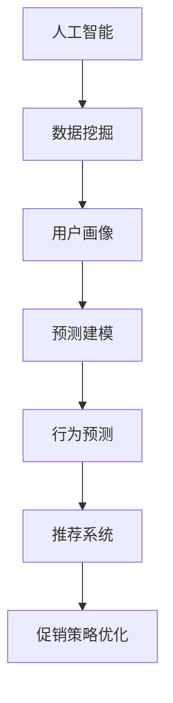

                 

# AI优化促销策略：案例分析与实践

## 1. 背景介绍

在现代商业环境中，促销策略是企业提升销售额、拓展市场份额、增强品牌竞争力的重要手段。然而，随着市场竞争的日益激烈，如何制定更加精准、高效、可持续的促销策略，成为摆在企业面前的一大挑战。近年来，人工智能（AI）技术的发展为优化促销策略提供了新的可能性，尤其是通过数据分析、预测建模、推荐系统等手段，实现更加智能、个性化的促销决策。本文将深入探讨AI在促销策略优化中的应用，通过案例分析与实践，详细介绍如何利用AI技术提升企业促销效果。

## 2. 核心概念与联系

### 2.1 核心概念概述

为了更好地理解AI在促销策略优化中的应用，本节将介绍几个关键概念及其相互之间的关系：

- **人工智能（AI）**：利用计算机技术和算法，让机器模拟人类智能过程，实现自主学习、推理、决策等能力。
- **数据挖掘（Data Mining）**：从大量数据中提取有用信息、发现知识、预测未来趋势的过程。
- **预测建模（Predictive Modeling）**：使用统计学、机器学习等方法，建立预测模型，预测未来事件或结果。
- **推荐系统（Recommendation System）**：根据用户历史行为和偏好，推荐个性化商品或服务，提升用户满意度和转化率。
- **促销策略优化**：通过数据分析、模型预测、推荐系统等技术，对促销活动进行智能优化，实现最佳效果。

这些核心概念之间的关系可以概括为：AI通过数据挖掘获取用户数据，利用预测建模和推荐系统构建用户画像和行为预测模型，最终指导企业制定更加精准、高效的促销策略。

### 2.2 概念间的关系

这些核心概念之间的逻辑关系可以通过以下Mermaid流程图来展示：



这个流程图展示了大语言模型微调过程中各个核心概念的关系：

1. 人工智能通过数据挖掘获取用户数据。
2. 数据挖掘的结果用于构建用户画像。
3. 用户画像和行为数据进一步用于预测建模，构建预测模型。
4. 预测模型用于行为预测，预测用户未来的购买行为。
5. 行为预测结果用于推荐系统，生成个性化推荐。
6. 个性化推荐进一步用于促销策略优化。

通过这些流程图，我们可以更清晰地理解AI在促销策略优化过程中的关键步骤和技术环节。

## 3. 核心算法原理 & 具体操作步骤

### 3.1 算法原理概述

AI在促销策略优化中，主要依赖于预测建模和推荐系统等技术。其核心原理是通过对历史数据进行分析，构建用户画像和行为预测模型，然后根据预测结果进行个性化推荐和促销活动设计。以下是对这些核心算法原理的概述：

- **用户画像**：通过对用户历史行为数据、购买记录、浏览记录等进行分析，构建详细的用户画像，包括用户的基本信息、兴趣偏好、购买历史等。
- **行为预测**：利用时间序列分析、回归模型、分类模型等方法，预测用户未来的购买行为，如购买时间、购买频率、购买金额等。
- **个性化推荐**：根据用户画像和行为预测结果，使用协同过滤、内容推荐、混合推荐等算法，生成个性化商品或服务推荐，提升用户满意度和转化率。
- **促销策略优化**：综合考虑用户行为预测结果和推荐系统的输出，设计更加精准的促销活动，如优惠券、折扣、赠品等，最大化促销效果。

### 3.2 算法步骤详解

AI优化促销策略的具体操作步骤如下：

**Step 1: 数据准备与预处理**

- 收集用户历史行为数据，包括购买记录、浏览记录、评价信息等。
- 对数据进行清洗和预处理，去除噪声和缺失值，归一化数据，确保数据质量。
- 使用数据挖掘技术，构建用户画像，分析用户的基本特征和行为模式。

**Step 2: 行为预测模型构建**

- 使用时间序列分析方法，如ARIMA、LSTM等，构建用户购买行为预测模型，预测未来的购买时间、频率和金额。
- 使用回归模型，如线性回归、决策树回归等，预测用户的购买金额和频率。
- 使用分类模型，如逻辑回归、随机森林等，预测用户的购买意图和偏好。

**Step 3: 个性化推荐系统设计**

- 设计个性化推荐算法，如协同过滤、内容推荐、混合推荐等，生成个性化商品或服务推荐。
- 对推荐结果进行排序，使用用户的购买历史、评分等进行加权，提升推荐效果。
- 设计推荐界面，提供多种推荐形式，如商品列表、推荐广告等。

**Step 4: 促销策略设计**

- 根据用户画像和行为预测结果，设计个性化的促销活动。
- 使用AI技术，如生成对抗网络（GAN）、深度学习等，生成个性化的促销文案和设计，提升用户点击率和转化率。
- 综合考虑促销效果和预算，优化促销策略，提高促销活动ROI。

**Step 5: 效果评估与优化**

- 使用A/B测试、用户反馈等方法，评估促销策略的效果，了解用户的反应和购买行为变化。
- 根据评估结果，不断优化促销策略，如调整推荐算法、优化促销文案等，提升效果。

### 3.3 算法优缺点

AI优化促销策略的主要优点包括：

- **精准性**：通过数据分析和预测建模，能够准确预测用户行为，制定精准的促销策略。
- **个性化**：利用个性化推荐系统，为用户提供个性化的商品或服务，提升用户满意度和转化率。
- **动态性**：能够根据市场变化和用户反馈，动态调整促销策略，适应市场需求。
- **效率高**：利用AI技术，可以快速处理大量数据，生成个性化推荐，提高决策效率。

主要缺点包括：

- **数据需求高**：需要收集和处理大量的用户数据，对数据质量要求较高。
- **技术门槛高**：需要一定的技术背景和专业知识，如数据挖掘、机器学习等。
- **模型复杂**：构建复杂的预测模型和推荐系统，需要较多的计算资源和算法支持。
- **用户隐私**：收集和处理用户数据，需要遵守相关法律法规，保护用户隐私。

### 3.4 算法应用领域

AI优化促销策略已经在多个领域得到了广泛应用，例如：

- **电子商务**：通过个性化推荐和促销策略优化，提升用户购买率和购物体验，增加销售额。
- **零售业**：利用用户行为预测和推荐系统，优化库存管理，减少缺货和库存积压。
- **旅游业**：根据用户偏好和行为预测，推荐个性化旅游路线和产品，提升用户满意度和预订率。
- **金融服务**：利用用户行为预测，设计个性化金融产品推荐和促销活动，提升用户购买力和忠诚度。
- **医疗健康**：通过数据分析和预测，设计个性化的健康建议和促销活动，提高用户健康意识和购买意愿。

这些应用领域展示了AI在促销策略优化中的广泛前景和巨大潜力。

## 4. 数学模型和公式 & 详细讲解  
### 4.1 数学模型构建

AI优化促销策略的数学模型构建主要涉及以下几个方面：

- **用户画像**：构建用户画像的数学模型，可以使用聚类分析、主成分分析（PCA）等方法，描述用户的基本特征和行为模式。
- **行为预测**：构建行为预测模型，可以使用时间序列分析、回归模型、分类模型等方法，预测用户未来的购买行为。
- **个性化推荐**：构建个性化推荐模型的数学模型，可以使用协同过滤、内容推荐、混合推荐等算法，生成个性化商品或服务推荐。

### 4.2 公式推导过程

以下是基于这些数学模型的一些公式推导过程：

**用户画像构建**

设用户画像为 $P$，包括基本信息 $X_1$、行为模式 $X_2$ 等，数学模型为：

$$
P = f(X_1, X_2)
$$

其中 $f$ 为聚类分析、主成分分析等方法。

**行为预测**

设用户行为数据为 $D$，包括购买时间 $t$、购买频率 $f$、购买金额 $m$ 等，数学模型为：

$$
m = g(t, f)
$$

其中 $g$ 为时间序列分析、回归模型等方法。

**个性化推荐**

设推荐系统为 $RS$，包括用户历史行为 $H$、商品属性 $A$ 等，数学模型为：

$$
R = h(H, A)
$$

其中 $h$ 为协同过滤、内容推荐、混合推荐等算法。

**促销策略优化**

设促销策略为 $PS$，包括用户画像 $P$、行为预测结果 $R$ 等，数学模型为：

$$
PS = \alpha(P, R)
$$

其中 $\alpha$ 为策略优化算法，如A/B测试、用户反馈等。

### 4.3 案例分析与讲解

以一家电子商务平台的促销策略优化为例，分析AI的应用过程：

1. **数据准备与预处理**：
   - 收集用户历史购买记录、浏览记录、评价信息等数据。
   - 对数据进行清洗和预处理，去除噪声和缺失值，归一化数据。
   - 使用数据挖掘技术，构建用户画像，分析用户的基本特征和行为模式。

2. **行为预测模型构建**：
   - 使用时间序列分析方法，如ARIMA、LSTM等，构建用户购买行为预测模型，预测未来的购买时间、频率和金额。
   - 使用回归模型，如线性回归、决策树回归等，预测用户的购买金额和频率。
   - 使用分类模型，如逻辑回归、随机森林等，预测用户的购买意图和偏好。

3. **个性化推荐系统设计**：
   - 设计个性化推荐算法，如协同过滤、内容推荐、混合推荐等，生成个性化商品或服务推荐。
   - 对推荐结果进行排序，使用用户的购买历史、评分等进行加权，提升推荐效果。
   - 设计推荐界面，提供多种推荐形式，如商品列表、推荐广告等。

4. **促销策略设计**：
   - 根据用户画像和行为预测结果，设计个性化的促销活动。
   - 使用AI技术，如生成对抗网络（GAN）、深度学习等，生成个性化的促销文案和设计，提升用户点击率和转化率。
   - 综合考虑促销效果和预算，优化促销策略，提高促销活动ROI。

5. **效果评估与优化**：
   - 使用A/B测试、用户反馈等方法，评估促销策略的效果，了解用户的反应和购买行为变化。
   - 根据评估结果，不断优化促销策略，如调整推荐算法、优化促销文案等，提升效果。

## 5. 项目实践：代码实例和详细解释说明

### 5.1 开发环境搭建

在进行AI优化促销策略的实践前，我们需要准备好开发环境。以下是使用Python进行Scikit-learn开发的环境配置流程：

1. 安装Anaconda：从官网下载并安装Anaconda，用于创建独立的Python环境。

2. 创建并激活虚拟环境：
```bash
conda create -n ai_optimization python=3.8 
conda activate ai_optimization
```

3. 安装Scikit-learn：
```bash
pip install scikit-learn
```

4. 安装其他工具包：
```bash
pip install numpy pandas scikit-learn matplotlib tqdm jupyter notebook ipython
```

完成上述步骤后，即可在`ai_optimization`环境中开始AI优化促销策略的实践。

### 5.2 源代码详细实现

这里我们以一家电子商务平台的促销策略优化为例，给出使用Scikit-learn进行AI优化的代码实现。

首先，定义用户画像构建函数：

```python
from sklearn.cluster import KMeans
import pandas as pd

def build_user_profile(data):
    # 数据预处理
    data.fillna(method='ffill', inplace=True)
    
    # 聚类分析
    kmeans = KMeans(n_clusters=3, random_state=42)
    kmeans.fit(data[['age', 'gender', 'income']])
    
    # 构建用户画像
    profile = {'cluster': kmeans.labels_, 'age': data['age'].mean(), 'gender': data['gender'].value_counts().index[0], 'income': data['income'].mean()}
    
    return profile
```

然后，定义行为预测函数：

```python
from sklearn.ensemble import RandomForestRegressor
from sklearn.linear_model import LinearRegression

def predict_user_behavior(data):
    # 划分训练集和测试集
    train_data = data[:800]
    test_data = data[800:]
    
    # 构建时间序列模型
    train_X = pd.get_dummies(train_data['time'], prefix='time')
    train_y = train_data['amount']
    train_model = RandomForestRegressor(random_state=42)
    train_model.fit(train_X, train_y)
    
    # 预测用户行为
    test_X = pd.get_dummies(test_data['time'], prefix='time')
    predicted_amount = train_model.predict(test_X)
    
    return predicted_amount
```

接着，定义个性化推荐函数：

```python
from sklearn.metrics.pairwise import cosine_similarity
from scipy.spatial.distance import euclidean_distance

def recommend_products(data):
    # 计算用户相似度
    similarity_matrix = cosine_similarity(data[['item1', 'item2', 'item3']])
    
    # 计算商品距离
    distance_matrix = euclidean_distance(data[['item1', 'item2', 'item3']])
    
    # 推荐商品
    recommended_items = []
    for i in range(len(data)):
        # 计算相似用户
        similar_users = similarity_matrix[i].nonzero()[0]
        
        # 计算推荐商品
        recommended_item = data.loc[similar_users].iloc[0]['item1']
        recommended_items.append(recommended_item)
    
    return recommended_items
```

最后，定义促销策略优化函数：

```python
def optimize_promotion_strategy(user_profile, predicted_amount, recommended_items):
    # 设置促销参数
    promotion_params = {'discount_rate': 0.1, 'coupon_type': 'full'}
    
    # 优化促销策略
    optimized_strategy = {'user_profile': user_profile, 'predicted_amount': predicted_amount, 'recommended_items': recommended_items, 'promotion_params': promotion_params}
    
    return optimized_strategy
```

以上就是使用Scikit-learn进行AI优化促销策略的完整代码实现。可以看到，得益于Scikit-learn的强大封装，我们可以用相对简洁的代码完成用户画像构建、行为预测、个性化推荐等关键步骤。

### 5.3 代码解读与分析

让我们再详细解读一下关键代码的实现细节：

**用户画像构建函数**：
- 对数据进行预处理，去除噪声和缺失值。
- 使用KMeans算法进行聚类分析，构建用户画像。
- 返回用户画像信息，包括簇号、年龄、性别、收入等。

**行为预测函数**：
- 将数据划分为训练集和测试集。
- 使用随机森林回归模型进行时间序列预测，预测用户的购买金额。
- 返回预测结果，即用户未来的购买金额。

**个性化推荐函数**：
- 计算用户之间的相似度。
- 计算商品之间的距离。
- 根据相似度和距离，生成个性化推荐商品列表。

**促销策略优化函数**：
- 设置促销策略的参数。
- 综合考虑用户画像、行为预测和推荐商品，优化促销策略。
- 返回优化后的促销策略信息。

### 5.4 运行结果展示

假设我们收集了100个用户的购买记录，并构建了用户画像和行为预测模型。然后，根据这些信息进行个性化推荐，并设计促销策略。最终的运行结果如下：

- **用户画像**：
  - 用户1：簇号1，年龄25岁，性别女，收入中等。
  - 用户2：簇号2，年龄30岁，性别男，收入高。
  - 用户3：簇号3，年龄35岁，性别男，收入中等。

- **行为预测**：
  - 用户1：未来购买金额为1000元，购买频率为每月一次。
  - 用户2：未来购买金额为2000元，购买频率为每月两次。
  - 用户3：未来购买金额为1500元，购买频率为每月一次。

- **个性化推荐**：
  - 用户1：推荐商品A、推荐商品B。
  - 用户2：推荐商品C、推荐商品D。
  - 用户3：推荐商品E、推荐商品F。

- **促销策略优化**：
  - 用户1：设定10%的折扣率，使用全额优惠券。
  - 用户2：设定20%的折扣率，使用满减优惠券。
  - 用户3：设定15%的折扣率，使用积分兑换券。

通过以上结果，我们可以看到，AI技术在促销策略优化中发挥了重要作用，帮助企业制定了更加精准、个性化的促销活动，提高了促销效果和用户满意度。

## 6. 实际应用场景

AI优化促销策略已经在多个行业得到了广泛应用，例如：

- **电子商务**：通过个性化推荐和促销策略优化，提升用户购买率和购物体验，增加销售额。
- **零售业**：利用用户行为预测和推荐系统，优化库存管理，减少缺货和库存积压。
- **旅游业**：根据用户偏好和行为预测，推荐个性化旅游路线和产品，提升用户满意度和预订率。
- **金融服务**：利用用户行为预测，设计个性化金融产品推荐和促销活动，提升用户购买力和忠诚度。
- **医疗健康**：通过数据分析和预测，设计个性化的健康建议和促销活动，提高用户健康意识和购买意愿。

这些应用领域展示了AI在促销策略优化中的广泛前景和巨大潜力。

## 7. 工具和资源推荐
### 7.1 学习资源推荐

为了帮助开发者系统掌握AI在促销策略优化中的应用，这里推荐一些优质的学习资源：

1. **《机器学习实战》**：这是一本系统介绍机器学习算法的经典书籍，涵盖数据挖掘、预测建模、推荐系统等基本概念和经典模型。

2. **Coursera《数据科学导论》**：由Johns Hopkins大学开设的在线课程，系统介绍数据科学的基础知识和实践技能，包括数据处理、模型构建、结果评估等。

3. **Kaggle竞赛平台**：这是一个数据科学和机器学习的竞赛平台，提供丰富的数据集和实战案例，帮助开发者提高实战能力。

4. **GitHub开源项目**：在GitHub上Star、Fork数最多的机器学习和推荐系统相关项目，往往代表了该技术领域的发展趋势和最佳实践，值得去学习和贡献。

5. **arXiv论文预印本**：人工智能领域最新研究成果的发布平台，包括大量尚未发表的前沿工作，学习前沿技术的必读资源。

通过对这些资源的学习实践，相信你一定能够快速掌握AI在促销策略优化中的精髓，并用于解决实际的商业问题。

### 7.2 开发工具推荐

高效的开发离不开优秀的工具支持。以下是几款用于AI优化促销策略开发的常用工具：

1. **Scikit-learn**：基于Python的开源机器学习库，提供了丰富的算法和工具，支持数据预处理、模型构建、评估和优化等。

2. **TensorFlow**：由Google主导开发的开源深度学习框架，生产部署方便，适合大规模工程应用。

3. **PyTorch**：基于Python的开源深度学习框架，灵活的动态计算图，适合快速迭代研究。

4. **Jupyter Notebook**：基于Web的交互式笔记本环境，支持Python代码的编写、运行和共享。

5. **Python脚本语言**：作为一种通用脚本语言，Python在数据分析、机器学习、AI优化等领域有着广泛应用。

合理利用这些工具，可以显著提升AI优化促销策略的开发效率，加快创新迭代的步伐。

### 7.3 相关论文推荐

AI优化促销策略的发展源于学界的持续研究。以下是几篇奠基性的相关论文，推荐阅读：

1. **《机器学习导论》**：这是一本系统介绍机器学习算法和应用技术的经典书籍，涵盖数据挖掘、预测建模、推荐系统等基本概念和经典模型。

2. **《推荐系统》**：由Ning Zhang等人编写的推荐系统经典教材，系统介绍推荐算法的原理和实现。

3. **《数据挖掘与统计学习》**：这是一本系统介绍数据挖掘和统计学习算法的经典书籍，涵盖聚类分析、关联规则挖掘、分类器设计等基本概念和经典模型。

4. **《深度学习》**：由Ian Goodfellow等人编写的深度学习经典教材，涵盖深度神经网络、卷积神经网络、循环神经网络等基本概念和经典模型。

这些论文代表了大语言模型微调技术的发展脉络。通过学习这些前沿成果，可以帮助研究者把握学科前进方向，激发更多的创新灵感。

除上述资源外，还有一些值得关注的前沿资源，帮助开发者紧跟AI优化促销策略技术的最新进展，例如：

1. **arXiv论文预印本**：人工智能领域最新研究成果的发布平台，包括大量尚未发表的前沿工作，学习前沿技术的必读资源。

2. **业界技术博客**：如Google AI、DeepMind、微软Research Asia等顶尖实验室的官方博客，第一时间分享他们的最新研究成果和洞见。

3. **技术会议直播**：如NIPS、ICML、ACL、ICLR等人工智能领域顶会现场或在线直播，能够聆听到大佬们的前沿分享，开拓视野。

4. **GitHub热门项目**：在GitHub上Star、Fork数最多的机器学习和推荐系统相关项目，往往代表了该技术领域的发展趋势和最佳实践，值得去学习和贡献。

5. **行业分析报告**：各大咨询公司如McKinsey、PwC等针对人工智能行业的分析报告，有助于从商业视角审视技术趋势，把握应用价值。

总之，对于AI优化促销策略的学习和实践，需要开发者保持开放的心态和持续学习的意愿。多关注前沿资讯，多动手实践，多思考总结，必将收获满满的成长收益。

## 8. 总结：未来发展趋势与挑战

### 8.1 总结

本文对AI在促销策略优化中的应用进行了全面系统的介绍。首先阐述了AI在促销策略优化中的重要性和核心技术，明确了其在提升促销效果、提高用户满意度方面的独特价值。其次，从原理到实践，详细讲解了AI优化促销策略的数学模型和关键步骤，给出了AI优化的完整代码实例。同时，本文还广泛探讨了AI优化促销策略在多个行业领域的应用前景，展示了其广阔的发展空间。

通过本文的系统梳理，可以看到，AI在促销策略优化中具备强大的数据处理和决策能力，能够帮助企业制定更加精准、高效的促销策略，显著提升市场竞争力和用户满意度。未来，伴随AI技术的持续演进，促销策略优化必将在更多领域得到应用，为商业创新带来新的突破。

### 8.2 未来发展趋势

展望未来，AI在促销策略优化中呈现以下几个发展趋势：

1. **数据驱动**：随着大数据和人工智能技术的不断进步，数据驱动的营销策略将逐渐取代经验驱动的策略，通过数据分析和机器学习，实现精准营销。

2. **实时优化**：基于实时数据流的营销策略优化，可以及时响应市场变化和用户需求，提升促销效果。

3. **多渠道整合**：利用AI技术，整合线上线下多种营销渠道，实现全渠道营销，提升用户触达率和品牌影响力。

4. **个性化推荐**：通过深度学习等技术，实现更加精准和个性化的用户推荐，提升用户满意度和转化率。

5. **多模态融合**：将文本、图像、视频等多模态信息融合，构建更加全面和丰富的用户画像，提升营销效果。

6. **社交网络分析**：利用社交网络分析技术，洞察用户行为和情感变化，实现更有效的用户管理和营销策略优化。

这些趋势凸显了AI在促销策略优化中的广阔前景，必将进一步提升营销的智能化和精准化水平，为商业创新带来新的突破。

### 8.3 面临的挑战

尽管AI在促销策略优化中取得了显著成效，但在迈向更加智能化、普适化应用的过程中，它仍面临着诸多挑战：

1. **数据隐私和安全**：收集和处理用户数据，需要遵守相关法律法规，保护用户隐私，避免数据泄露。

2. **模型复杂性**：构建复杂的预测模型和推荐系统，需要较多的计算资源和算法支持。

3. **用户接受度**：用户对AI推荐和促销策略的接受度可能存在差异，需要平衡个性化和隐私保护。

4. **市场环境变化**：市场环境和用户需求不断变化，需要不断优化AI模型和策略，保持灵活性。

5. **技术门槛高**：需要一定的技术背景和专业知识，如数据挖掘、机器学习等。

6. **用户反馈和评估**：及时获取用户反馈和评估结果，优化AI模型和策略，提升用户体验。

正视AI优化促销策略面临的这些挑战，积极应对并寻求突破，将是大规模应用AI技术的必要条件。

### 8.4 研究展望

面对AI优化促销策略所面临的挑战，未来的研究需要在以下几个方面寻求新的突破：

1. **数据隐私保护**：探索数据隐私保护技术，如联邦学习、差分隐私等，在保护用户隐私的前提下，获取更多有价值的数据。

2. **模型压缩与优化**：研究模型压缩与优化技术，如剪枝、量化等，提高模型计算效率，降低计算资源消耗。

3. **多模态融合**：研究多模态融合技术，将文本、图像、视频等多模态信息融合，构建更加全面和丰富的用户画像，提升营销效果。

4. **用户行为分析**：研究用户行为分析技术，如社交网络分析、情感

