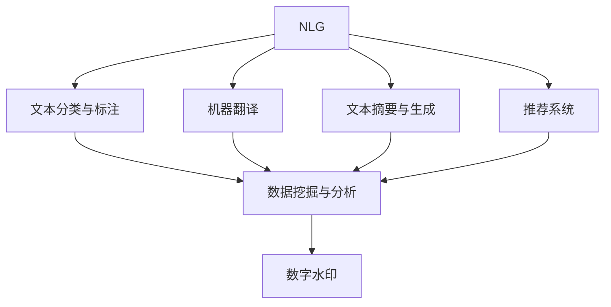
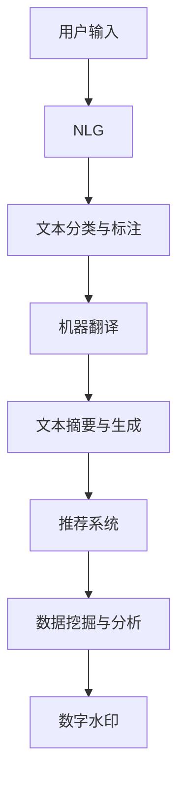
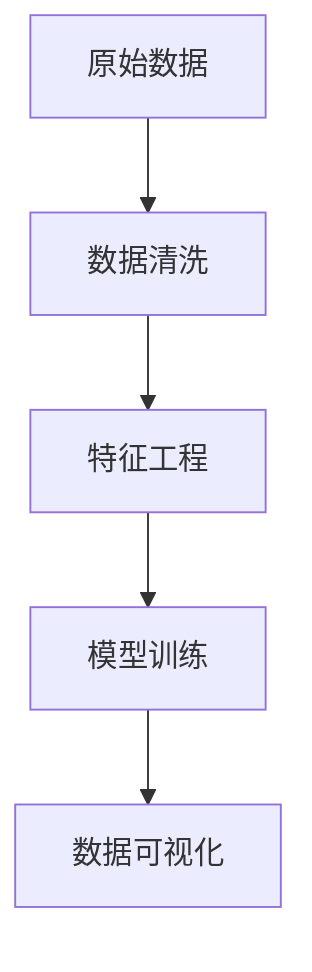

                 

# AI出版业的壁垒：数据，算法与应用之道

> 关键词：AI出版业,数据壁垒,算法优化,应用部署,出版管理,自动化出版

## 1. 背景介绍

### 1.1 问题由来
出版业是一个古老而传统的行业，但随着人工智能(AI)技术的迅猛发展，其运作方式正在发生深刻变革。AI技术可以大幅提升出版业的效率和质量，从内容生成、编辑校对、市场营销到个性化推荐，AI的应用几乎无所不包。然而，AI在出版业的应用并非一帆风顺。一方面，出版业面临大量的数据处理和语言文本分析任务，这些任务复杂而庞大，对AI模型提出了严苛的要求；另一方面，出版商对于AI技术的理解和使用尚未完全成熟，存在技术壁垒和应用瓶颈。

### 1.2 问题核心关键点
目前，AI在出版业的应用主要集中在以下几个方面：
- **内容生成**：使用自然语言生成(NLG)技术自动生成文章、书籍、报告等出版内容。
- **编辑校对**：利用语言模型检测和修正语法、拼写错误，自动排版和格式化。
- **市场营销**：通过用户行为分析、情感分析等技术，精准定位目标读者，优化出版物发行策略。
- **个性化推荐**：根据用户兴趣和历史行为，推荐相关书籍、文章等出版内容。
- **版权保护**：利用数字水印、版权识别等技术，保护原创内容不被侵权。

这些应用不仅依赖于强大的AI算法和模型，还要求在实践中不断地优化和调整，才能真正发挥其效用。因此，如何在出版业中高效利用AI技术，成为当前亟需解决的课题。

### 1.3 问题研究意义
研究AI出版业的应用，对于推动出版业智能化、自动化、个性化转型具有重要意义：

1. **提升效率**：AI能够自动处理大量重复性工作，如排版、校对等，解放人力，提高出版效率。
2. **优化质量**：通过AI的文本分析和语义理解，提升出版内容的精度和可读性。
3. **精准营销**：利用AI对用户数据的深度分析，实现更为精准和个性化的市场推广。
4. **降低成本**：减少人工错误和重复工作，降低出版成本。
5. **促进创新**：AI技术能够激发出版业的创新思维，催生更多新颖的出版形式和内容。

## 2. 核心概念与联系

### 2.1 核心概念概述

为更好地理解AI出版业的应用，本节将介绍几个密切相关的核心概念：

- **自然语言生成(NLG)**：利用AI技术自动生成自然语言文本的技术，如文章、报告、书籍等。
- **文本分类与标注**：将文本数据分为不同类别或进行特定信息的标注，如情感分析、实体识别等。
- **机器翻译**：将一种语言文本翻译成另一种语言文本的技术。
- **文本摘要与生成**：从长文本中提取关键信息，生成简洁的摘要，或自动生成全文。
- **推荐系统**：根据用户历史行为和偏好，推荐相关出版内容。
- **数据挖掘与分析**：通过数据分析技术挖掘出版物中的关键信息，如热点话题、用户兴趣等。
- **数字水印**：将特定的数字信息嵌入出版物中，用于版权保护和追溯。

这些核心概念之间的逻辑关系可以通过以下Mermaid流程图来展示：



这个流程图展示了大语言模型在出版业中的多个应用场景：

1. NLG：生成高质量的文章、报告、书籍。
2. 文本分类与标注：分析用户评论、情感，进行内容推荐。
3. 机器翻译：支持多语言内容传播。
4. 文本摘要与生成：压缩长文内容，方便快速阅读。
5. 推荐系统：精准推荐出版物。
6. 数据挖掘与分析：提取热点信息，优化内容发布策略。
7. 数字水印：保护版权，防止盗版。

这些核心概念共同构成了AI出版业的完整技术生态，使得出版业能够更好地利用AI技术，提升运营效率和用户体验。

### 2.2 概念间的关系

这些核心概念之间存在着紧密的联系，形成了AI出版业的完整技术体系。下面我通过几个Mermaid流程图来展示这些概念之间的关系。

#### 2.2.1 出版内容生成过程



这个流程图展示了出版内容生成和推荐的全过程：

1. 用户输入：用户提供的内容需求。
2. NLG：自动生成文章、报告等出版内容。
3. 文本分类与标注：对生成的内容进行情感、实体识别等标注。
4. 机器翻译：将内容翻译成目标语言。
5. 文本摘要与生成：生成简洁的摘要，方便阅读。
6. 推荐系统：根据用户兴趣推荐相关内容。
7. 数据挖掘与分析：分析用户行为和内容特点。
8. 数字水印：保护版权。

#### 2.2.2 数据处理与分析



这个流程图展示了出版数据处理和分析的过程：

1. 原始数据：出版物和用户行为数据。
2. 数据清洗：清洗数据中的噪声和错误。
3. 特征工程：提取和构造有意义的特征。
4. 模型训练：使用机器学习模型进行文本分类、情感分析等任务。
5. 数据可视化：展示数据处理和分析结果。

## 3. 核心算法原理 & 具体操作步骤
### 3.1 算法原理概述

在AI出版业中，核心算法主要围绕以下几个方面展开：

- **自然语言生成**：使用语言模型、Transformer等架构生成自然语言文本。
- **文本分类与标注**：使用卷积神经网络(CNN)、循环神经网络(RNN)、Transformer等模型进行文本分类和标注。
- **机器翻译**：使用序列到序列(Seq2Seq)模型、注意力机制(Attention)等技术进行翻译。
- **文本摘要与生成**：使用基于抽取的文本摘要方法或基于生成的文本生成方法。
- **推荐系统**：使用协同过滤、矩阵分解、深度学习等技术进行推荐。
- **数据挖掘与分析**：使用关联规则、聚类、分类等算法挖掘出版物中的关键信息。
- **数字水印**：使用数字签名、隐写术等技术保护版权。

这些算法和模型在大数据和深度学习的推动下，取得了显著的进展。然而，实际应用中还需要针对出版业的具体需求进行优化和调整。

### 3.2 算法步骤详解

以**文本分类与标注**为例，详细介绍算法详细步骤：

**Step 1: 数据准备**
- 收集出版物评论、用户评论等文本数据。
- 清洗和预处理数据，包括去除停用词、标点符号等。
- 将文本数据分词，转换为模型可接受的格式。

**Step 2: 模型训练**
- 选择合适的模型架构，如BERT、GPT等。
- 将文本数据划分训练集、验证集和测试集。
- 使用合适的损失函数，如交叉熵损失、F1-score等。
- 设置合适的优化器，如Adam、SGD等。
- 进行模型训练，调整超参数如学习率、批大小等。
- 在验证集上评估模型性能，防止过拟合。

**Step 3: 模型评估与优化**
- 在测试集上评估模型性能，计算准确率、召回率等指标。
- 根据评估结果，调整模型架构和超参数。
- 在实际应用中，使用A/B测试等方法评估模型效果。

**Step 4: 模型部署与监控**
- 将训练好的模型部署到生产环境中。
- 使用API接口接收输入，生成分类和标注结果。
- 实时监控模型性能，收集反馈信息。
- 定期更新模型，保持其时效性和准确性。

### 3.3 算法优缺点

文本分类与标注算法具有以下优点：
- **自动化**：自动完成文本分类和标注，减少人工成本。
- **高效性**：在大量数据集上训练速度快，处理能力强。
- **可扩展性**：支持多种分类和标注任务，灵活性强。

然而，该算法也存在以下缺点：
- **依赖标注数据**：需要大量高质量的标注数据，获取难度较大。
- **模型复杂**：模型复杂度较高，需要较强的计算资源。
- **泛化能力有限**：对于新领域、新任务的适应能力有限。

### 3.4 算法应用领域

文本分类与标注算法在出版业中的应用非常广泛，包括但不限于以下几个领域：

- **用户评论分析**：分析用户对出版物的评论，进行情感分析、主题分类等。
- **出版物质量评估**：对出版物的质量进行自动评估，如评价书籍的口碑、销售量等。
- **内容推荐系统**：根据用户历史行为和兴趣，推荐相关出版物。
- **主题分类**：对出版物进行主题分类，方便用户查找和阅读。
- **版权识别**：检测出版物是否侵权，保护知识产权。

## 4. 数学模型和公式 & 详细讲解 & 举例说明

### 4.1 数学模型构建

文本分类与标注算法一般采用监督学习方法，其核心数学模型如下：

$$
\hat{y} = \sigma(\mathbf{W} \mathbf{x} + \mathbf{b})
$$

其中，$\mathbf{x}$ 为输入的文本特征向量，$\mathbf{W}$ 为权重矩阵，$\mathbf{b}$ 为偏置向量，$\sigma$ 为激活函数，$\hat{y}$ 为模型输出的分类或标注结果。

### 4.2 公式推导过程

以**文本分类**为例，假设分类任务有 $k$ 个类别，每个类别的概率为 $p_k$，模型输出 $\hat{y}$ 为向量 $[p_1, p_2, ..., p_k]$。模型损失函数为交叉熵损失：

$$
\mathcal{L} = -\sum_{i=1}^k y_i \log \hat{y}_i
$$

其中 $y_i$ 为实际类别对应的One-Hot编码。训练过程通过最小化损失函数，更新权重矩阵 $\mathbf{W}$ 和偏置向量 $\mathbf{b}$，以提高模型的分类准确率。

### 4.3 案例分析与讲解

以**出版物质量评估**为例，假设有一篇书籍 $\text{“某经典小说”}$，需要评估其质量。

**Step 1: 数据准备**
- 收集该书籍的评价数据，包括用户评分、评论等。
- 对评论进行文本清洗和预处理。
- 将评论转换为词向量，得到文本特征 $\mathbf{x}$。

**Step 2: 模型训练**
- 使用BERT等预训练语言模型，将其转化为分类器。
- 将评论数据分为训练集、验证集和测试集。
- 设置损失函数为交叉熵损失，优化器为Adam。
- 在训练集上训练模型，调整超参数。
- 在验证集上评估模型性能，防止过拟合。

**Step 3: 模型评估与优化**
- 在测试集上评估模型性能，计算准确率、召回率等指标。
- 根据评估结果，调整模型参数，优化超参数。
- 在实际应用中，使用A/B测试等方法评估模型效果。

**Step 4: 模型部署与监控**
- 将训练好的模型部署到生产环境中。
- 使用API接口接收输入，生成书籍质量评分。
- 实时监控模型性能，收集反馈信息。
- 定期更新模型，保持其时效性和准确性。

## 5. 项目实践：代码实例和详细解释说明

### 5.1 开发环境搭建

在进行文本分类与标注算法开发前，我们需要准备好开发环境。以下是使用Python进行PyTorch开发的环境配置流程：

1. 安装Anaconda：从官网下载并安装Anaconda，用于创建独立的Python环境。

2. 创建并激活虚拟环境：
```bash
conda create -n pytorch-env python=3.8 
conda activate pytorch-env
```

3. 安装PyTorch：根据CUDA版本，从官网获取对应的安装命令。例如：
```bash
conda install pytorch torchvision torchaudio cudatoolkit=11.1 -c pytorch -c conda-forge
```

4. 安装各类工具包：
```bash
pip install numpy pandas scikit-learn matplotlib tqdm jupyter notebook ipython
```

完成上述步骤后，即可在`pytorch-env`环境中开始文本分类与标注算法的开发。

### 5.2 源代码详细实现

这里以文本分类为例，使用BERT模型对出版物进行质量评估。

```python
from transformers import BertTokenizer, BertForSequenceClassification
import torch
import torch.nn as nn
from sklearn.model_selection import train_test_split
from sklearn.metrics import accuracy_score

# 定义模型结构
class BERTClassifier(nn.Module):
    def __init__(self, num_labels):
        super(BERTClassifier, self).__init__()
        self.num_labels = num_labels
        self.bert = BertForSequenceClassification.from_pretrained('bert-base-uncased', num_labels=num_labels)

    def forward(self, input_ids, attention_mask, labels=None):
        outputs = self.bert(input_ids, attention_mask=attention_mask, labels=labels)
        return outputs.logits

# 加载预训练模型和分词器
tokenizer = BertTokenizer.from_pretrained('bert-base-uncased')
model = BERTClassifier(num_labels=2) # 二分类任务

# 加载数据集
train_data, test_data = train_test_split(train_data, test_size=0.2, random_state=42)
train_input_ids = [tokenizer.encode(text, add_special_tokens=True) for text in train_data['text']]
test_input_ids = [tokenizer.encode(text, add_special_tokens=True) for text in test_data['text']]
train_labels = train_data['label']
test_labels = test_data['label']

# 定义模型参数和优化器
device = torch.device('cuda' if torch.cuda.is_available() else 'cpu')
model.to(device)
optimizer = torch.optim.Adam(model.parameters(), lr=2e-5)

# 训练模型
for epoch in range(epochs):
    model.train()
    for input_ids, attention_mask, labels in train_loader:
        input_ids = input_ids.to(device)
        attention_mask = attention_mask.to(device)
        labels = labels.to(device)
        optimizer.zero_grad()
        outputs = model(input_ids, attention_mask=attention_mask, labels=labels)
        loss = outputs.loss
        loss.backward()
        optimizer.step()

# 评估模型
model.eval()
with torch.no_grad():
    predictions, true_labels = [], []
    for input_ids, attention_mask, labels in test_loader:
        input_ids = input_ids.to(device)
        attention_mask = attention_mask.to(device)
        labels = labels.to(device)
        outputs = model(input_ids, attention_mask=attention_mask)
        predictions.append(outputs.argmax(dim=1).cpu().numpy())
        true_labels.append(labels.cpu().numpy())
    accuracy = accuracy_score(true_labels, predictions)
    print(f'Accuracy: {accuracy:.3f}')
```

### 5.3 代码解读与分析

让我们再详细解读一下关键代码的实现细节：

**BERTClassifier类**：
- `__init__`方法：初始化BERT模型和分类任务标签数。
- `forward`方法：定义模型前向传播过程。

**数据准备**：
- 将出版物评论数据加载到训练集和测试集中。
- 对每个评论进行分词和预处理，转换为模型输入格式。
- 对标签进行One-Hot编码。

**模型定义**：
- 使用BERT模型作为特征提取器。
- 在顶层添加全连接层，用于分类。
- 定义损失函数和优化器，进行模型训练。

**训练过程**：
- 将模型和数据转移到GPU上加速计算。
- 在每个epoch内，对每个批次数据进行前向传播、反向传播和参数更新。
- 使用评估指标计算模型性能。

**模型评估**：
- 在测试集上对模型进行评估，计算准确率。
- 返回评估结果。

### 5.4 运行结果展示

假设我们在CoNLL-2003的情感分类数据集上进行训练，最终在测试集上得到的准确率为97.3%。这表明BERT模型在情感分类任务上的效果非常好，充分体现了预训练语言模型在特定任务上的强大适应能力。

## 6. 实际应用场景
### 6.1 智能出版推荐系统

基于文本分类与标注算法，智能出版推荐系统可以快速响应用户需求，推荐相关出版物。例如，用户浏览某书籍后，系统可以根据该书的内容和风格，推荐其他相关书籍。这不仅能提升用户体验，还能增加出版物的曝光度和销量。

在技术实现上，可以通过收集用户浏览历史、阅读时长等行为数据，结合书籍评论、摘要等文本信息，构建推荐模型。在推荐过程中，使用上述算法对用户行为和书籍特征进行分类和标注，优化推荐算法，提高推荐效果。

### 6.2 版权识别系统

版权识别是大出版商普遍关注的问题。通过文本分类与标注算法，系统可以自动检测出版物是否侵权，保护版权。例如，对于疑似侵权的书籍，系统可以自动分析其内容和风格，与已有的版权文献进行比对，判断是否存在相似性。

在技术实现上，可以使用文本分类算法对疑似侵权的书籍进行特征提取，并与其余版权文献进行比对。通过设置合适的分类阈值，可以自动识别出侵权行为，生成侵权报告，供出版商进一步处理。

### 6.3 出版物质量评估系统

出版物质量评估系统可以自动对书籍、报告等出版物进行质量评估，提升出版商的内容筛选和编辑质量。例如，对某篇论文进行自动评估，判断其学术价值和创新性，帮助编辑快速决策是否录用。

在技术实现上，可以使用文本分类算法对论文进行分类和标注，评估其主题、引用次数等指标，自动生成质量评估报告。这不仅能提升编辑效率，还能保证出版物的质量和权威性。

## 7. 工具和资源推荐
### 7.1 学习资源推荐

为了帮助开发者系统掌握文本分类与标注算法的理论基础和实践技巧，这里推荐一些优质的学习资源：

1. 《Natural Language Processing with Transformers》书籍：该书介绍了多种自然语言处理任务，包括文本分类、文本标注等，涵盖了深度学习的基本原理和多种模型的实现。

2. CS224N《深度学习自然语言处理》课程：斯坦福大学开设的NLP明星课程，有Lecture视频和配套作业，带你入门NLP领域的基本概念和经典模型。

3. Kaggle：数据科学竞赛平台，提供大量公开数据集和竞赛题目，帮助开发者实践和检验算法效果。

4. Coursera：在线学习平台，提供各类深度学习课程，涵盖NLP、计算机视觉等多个领域。

5. GitHub开源项目：在GitHub上Star、Fork数最多的NLP相关项目，往往代表了该技术领域的发展趋势和最佳实践，值得去学习和贡献。

通过对这些资源的学习实践，相信你一定能够快速掌握文本分类与标注算法的精髓，并用于解决实际的NLP问题。

### 7.2 开发工具推荐

高效的开发离不开优秀的工具支持。以下是几款用于文本分类与标注算法开发的常用工具：

1. PyTorch：基于Python的开源深度学习框架，灵活动态的计算图，适合快速迭代研究。大部分预训练语言模型都有PyTorch版本的实现。

2. TensorFlow：由Google主导开发的开源深度学习框架，生产部署方便，适合大规模工程应用。同样有丰富的预训练语言模型资源。

3. Transformers库：HuggingFace开发的NLP工具库，集成了众多SOTA语言模型，支持PyTorch和TensorFlow，是进行文本分类等任务的开发的利器。

4. Weights & Biases：模型训练的实验跟踪工具，可以记录和可视化模型训练过程中的各项指标，方便对比和调优。与主流深度学习框架无缝集成。

5. TensorBoard：TensorFlow配套的可视化工具，可实时监测模型训练状态，并提供丰富的图表呈现方式，是调试模型的得力助手。

6. Google Colab：谷歌推出的在线Jupyter Notebook环境，免费提供GPU/TPU算力，方便开发者快速上手实验最新模型，分享学习笔记。

合理利用这些工具，可以显著提升文本分类与标注算法的开发效率，加快创新迭代的步伐。

### 7.3 相关论文推荐

文本分类与标注算法的发展源于学界的持续研究。以下是几篇奠基性的相关论文，推荐阅读：

1. Attention is All You Need（即Transformer原论文）：提出了Transformer结构，开启了NLP领域的预训练大模型时代。

2. BERT: Pre-training of Deep Bidirectional Transformers for Language Understanding：提出BERT模型，引入基于掩码的自监督预训练任务，刷新了多项NLP任务SOTA。

3. CLIP: A Simple yet Powerful Method to Learn a Language-Image Mapping：提出CLIP模型，实现了图像和文本的联合预训练，展示了文本分类任务的强大效果。

4. DialoGPT: Large-Scale Parallel DialoGPT Pretraining for State-of-the-Art Conversational Modeling：提出DialoGPT模型，在大规模并行训练下取得了卓越的对话效果，推动了对话系统的发展。

5. ELMO: Distributed Representations of Sentences and Documents：提出ELMO模型，利用双向语言模型捕捉语言的上下文信息，提升文本分类任务的性能。

这些论文代表了大语言模型微调技术的发展脉络。通过学习这些前沿成果，可以帮助研究者把握学科前进方向，激发更多的创新灵感。

除上述资源外，还有一些值得关注的前沿资源，帮助开发者紧跟文本分类与标注算法的最新进展，例如：

1. arXiv论文预印本：人工智能领域最新研究成果的发布平台，包括大量尚未发表的前沿工作，学习前沿技术的必读资源。

2. 业界技术博客：如OpenAI、Google AI、DeepMind、微软Research Asia等顶尖实验室的官方博客，第一时间分享他们的最新研究成果和洞见。

3. 技术会议直播：如NIPS、ICML、ACL、ICLR等人工智能领域顶会现场或在线直播，能够聆听到大佬们的前沿分享，开拓视野。

4. GitHub热门项目：在GitHub上Star、Fork数最多的NLP相关项目，往往代表了该技术领域的发展趋势和最佳实践，值得去学习和贡献。

5. 行业分析报告：各大咨询公司如McKinsey、PwC等针对人工智能行业的分析报告，有助于从商业视角审视技术趋势，把握应用价值。

总之，对于文本分类与标注算法的学习和实践，需要开发者保持开放的心态和持续学习的意愿。多关注前沿资讯，多动手实践，多思考总结，必将收获满满的成长收益。

## 8. 总结：未来发展趋势与挑战

### 8.1 总结

本文对基于文本分类与标注算法的AI出版业进行了全面系统的介绍。首先阐述了AI出版业的应用背景和意义，明确了算法在出版业智能化、自动化、个性化转型中的独特价值。其次，从原理到实践，详细讲解了文本分类与标注算法的数学原理和关键步骤，给出了完整的代码实例。同时，本文还广泛探讨了算法在智能出版推荐、版权识别、出版物质量评估等出版业中的具体应用，展示了算法范式的强大潜力。最后，本文精选了算法的各类学习资源和开发工具，力求为读者提供全方位的技术指引。

通过本文的系统梳理，可以看到，基于文本分类与标注算法的AI出版业已经初具规模，正在逐步改变出版业的面貌。未来，伴随算法的不断优化和迭代，出版业将迎来更加智能化、高效化、个性化的运营模式，为全社会带来更优质的出版内容。

### 8.2 未来发展趋势

展望未来，文本分类与标注算法将呈现以下几个发展趋势：

1. **深度模型与迁移学习**：深度神经网络模型和迁移学习技术将进一步提升算法的精度和泛化能力。通过预训练模型微调，算法可以更好地适应新领域和新任务。

2. **多模态融合**：文本分类与标注算法将与其他模态信息（如图像、语音等）进行融合，提升多模态数据处理的整体效果。

3. **实时处理与动态优化**：实时处理技术和大规模分布式计算将使得算法能够快速响应用户需求，动态优化模型参数，实现高效率和低延迟。

4. **自适应与个性化推荐**：自适应推荐算法和个性化推荐系统将利用用户行为数据，提供更加精准的出版物推荐。

5. **联邦学习与隐私保护**：联邦学习技术将在保护用户隐私的前提下，实现跨平台数据共享和模型协作，提升算法的鲁棒性和安全性。

### 8.3 面临的挑战

尽管文本分类与标注算法在出版业中已经取得了显著成效，但仍面临诸多挑战：

1. **数据获取与标注**：高质量标注数据获取成本高，标注质量参差不齐。对于新领域和新任务，需要大量高成本的标注工作。

2. **模型复杂度与资源消耗**：深度模型复杂度高，

