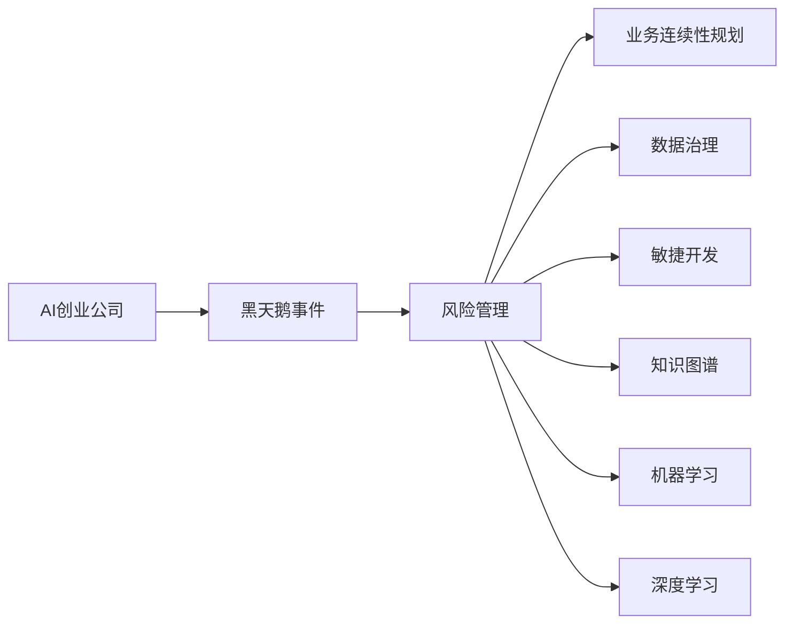

                 

# AI创业公司如何应对黑天鹅事件?

## 1. 背景介绍

在全球化、数字化浪潮的推动下，人工智能（AI）技术正成为各行各业争相追捧的新兴动力。越来越多的初创公司在AI领域崭露头角，通过独特的技术创新和市场定位，构建起差异化的竞争优势。然而，与此同时，AI创业公司也面临着前所未有的市场风险和不确定性。黑天鹅事件（Black Swan Event），作为一种极小概率、高影响的事件，无疑对AI创业公司的生存与发展构成了巨大挑战。本文将深入探讨AI创业公司如何应对黑天鹅事件，助力其在快速变化的市场环境中稳健成长。

### 1.1 黑天鹅事件概述

黑天鹅事件，源自纳西姆·塔勒布（Nassim Nicholas Taleb）在其著作《黑天鹅》中的概念，指那些具有极高影响但几乎无法预测的事件。它们通常具有三个特征：1）罕见性，即其发生概率极低；2）重大影响，即一旦发生，可能带来灾难性后果；3）可解释性事后，即事后人们会认为其“可预见”，但在发生前却无法预料。

在AI创业公司的发展过程中，黑天鹅事件可能来源于多个方面，包括但不限于技术突破、政策变动、市场竞争、自然灾害等。面对这些事件，AI创业公司需要采取一系列应对策略，以确保其长期生存和持续发展。

## 2. 核心概念与联系

### 2.1 核心概念概述

为更好地理解AI创业公司应对黑天鹅事件的策略，本节将介绍几个关键概念及其之间的联系：

- **AI创业公司**：指那些利用人工智能技术，开展创新业务，实现商业价值的创业企业。

- **黑天鹅事件**：指那些影响巨大但极难预测的事件，对企业的生存和发展构成重大威胁。

- **风险管理**：通过评估和控制风险，帮助企业应对不确定性和保护利益。

- **业务连续性规划（BCP）**：制定应对中断事件的计划，确保业务连续运行。

- **数据治理**：通过有效管理数据，提高数据质量和可用性，为决策提供支持。

- **敏捷开发**：强调快速迭代和持续交付，增强企业对市场变化的响应能力。

- **知识图谱**：利用图结构表示知识关系，支持更高效的信息获取和决策。

- **机器学习（ML）**：通过算法学习数据规律，提高决策的自动化和智能化水平。

- **深度学习（DL）**：利用深度神经网络处理复杂非线性问题，提高数据建模和预测能力。

这些概念共同构成了AI创业公司应对黑天鹅事件的基础框架，涵盖了从风险评估、业务连续性保障、数据治理到技术创新等多个维度。

### 2.2 概念间的关系

这些核心概念之间的联系可以通过以下Mermaid流程图来展示：



这个流程图展示了黑天鹅事件对AI创业公司的影响，以及企业如何通过多方面的综合措施来应对这些挑战。通过风险管理，企业能够识别和评估潜在风险，制定应对策略；通过业务连续性规划，企业能够应对突发事件，保持业务连续；通过数据治理，企业能够确保数据质量，支持决策；通过敏捷开发，企业能够快速响应市场变化，灵活调整策略；通过知识图谱、机器学习和深度学习，企业能够提升决策的智能化水平，增强应对黑天鹅事件的能力。

## 3. 核心算法原理 & 具体操作步骤
### 3.1 算法原理概述

AI创业公司应对黑天鹅事件，本质上是一个风险管理和业务连续性的综合决策过程。其核心算法原理可以归纳为以下几点：

- **风险评估**：通过定量分析，识别和量化潜在风险，评估其发生概率和影响程度。
- **决策树**：构建决策树模型，模拟不同情境下的决策路径和结果。
- **蒙特卡洛模拟**：使用蒙特卡洛方法，模拟不确定性因素的变化，评估不同策略的风险和收益。
- **多目标优化**：通过多目标优化算法，平衡风险与收益，选择最优的应对策略。

### 3.2 算法步骤详解

以下是对应黑天鹅事件应对的详细操作步骤：

**Step 1: 风险评估**
- 定义潜在黑天鹅事件。识别可能对企业产生重大影响的各类事件，如技术突破、市场竞争、政策变动等。
- 评估风险发生的概率。通过历史数据和专家判断，评估事件发生的概率。
- 评估风险的潜在影响。根据事件的严重程度，估计其可能带来的财务损失、声誉影响等。

**Step 2: 构建决策树**
- 确定决策节点。根据事件类型，确定可能的决策节点，如接受、拒绝、调整策略等。
- 定义决策条件。为每个决策节点定义具体的决策条件，如风险评估结果、市场反应等。
- 模拟决策路径。通过决策树模型，模拟不同决策条件下的路径和结果。

**Step 3: 蒙特卡洛模拟**
- 设定不确定性因素。选择关键的不确定性因素，如市场需求、成本变化等。
- 构建随机模型。使用随机数生成方法，模拟不确定性因素的变化。
- 评估策略风险。通过多次模拟，评估不同策略的风险和收益，选择最优策略。

**Step 4: 多目标优化**
- 定义优化目标。根据企业的战略目标，定义优化目标，如收益最大化、风险最小化等。
- 构建优化模型。通过多目标优化算法，构建综合评估模型。
- 选择最优策略。根据优化模型结果，选择最优的应对策略。

### 3.3 算法优缺点

AI创业公司应对黑天鹅事件的方法具有以下优点：
- 能够系统化地识别和评估潜在风险，提升决策的科学性。
- 通过模拟和优化，选择最优的应对策略，降低不确定性带来的影响。
- 能够适应不同情境，灵活调整应对措施。

然而，该方法也存在以下局限：
- 需要大量历史数据和专业知识，获取成本较高。
- 模型复杂度高，需要较强的技术实力和计算资源。
- 决策过程可能存在偏差，难以完全避免人为因素影响。

### 3.4 算法应用领域

基于上述算法的黑天鹅事件应对策略，已在多个领域得到应用，例如：

- **金融行业**：评估市场波动、政策变化等风险，制定应对措施。
- **制造业**：预测供应链中断、需求变化等风险，优化生产计划。
- **医疗行业**：应对疫情暴发、药物短缺等风险，保障医疗服务。
- **零售行业**：应对价格波动、竞争压力等风险，优化库存管理。

## 4. 数学模型和公式 & 详细讲解 & 举例说明
### 4.1 数学模型构建

本节将使用数学语言对黑天鹅事件应对的决策过程进行严格刻画。

记潜在黑天鹅事件为 $E$，其发生概率为 $P(E)$，潜在影响为 $I(E)$。风险评估模型为 $R(E) = P(E) \times I(E)$。决策树模型为 $D(E) = \{(d_1, P(d_1 | E), d_2, P(d_2 | d_1), \ldots, d_n, P(d_n | d_{n-1})\}$，其中 $d_i$ 为决策节点，$P(d_i | E)$ 为在事件 $E$ 条件下，选择决策 $d_i$ 的概率。蒙特卡洛模拟模型为 $M = \{X_1, X_2, \ldots, X_k\}$，其中 $X_i$ 为模拟的不确定性因素。多目标优化模型为 $O = \{O_1, O_2, \ldots, O_m\}$，其中 $O_i$ 为第 $i$ 个优化目标函数。

### 4.2 公式推导过程

以下我们以一个简单的金融风险评估为例，推导相关数学公式。

假设一家AI创业公司面临股票市场波动的风险，风险评估模型为 $R(E) = P(E) \times I(E)$，其中 $E$ 表示市场大幅波动事件，$P(E)$ 为市场波动的概率，$I(E)$ 为市场波动对公司业绩的影响。

构建决策树模型 $D(E)$，考虑两种决策：接受风险 $d_1$ 和拒绝风险 $d_2$。在市场波动事件发生时，接受风险的概率为 $P(d_1 | E) = 0.6$，拒绝风险的概率为 $P(d_2 | E) = 0.4$。在市场波动事件不发生时，接受风险的概率为 $P(d_1 | \neg E) = 0.8$，拒绝风险的概率为 $P(d_2 | \neg E) = 0.2$。

蒙特卡洛模拟模型 $M$ 设定关键不确定性因素为市场波动 $X$，其概率分布为 $P(X) = [0.05, 0.5, 0.45]$。通过多次模拟，计算不同策略的风险和收益。

多目标优化模型 $O$ 设定优化目标为收益最大化 $O_1$ 和风险最小化 $O_2$。通过多目标优化算法，选择最优的应对策略。

### 4.3 案例分析与讲解

假设某AI创业公司预测到其核心技术将面临专利诉讼，面临以下两种策略选择：

- **策略1**：接受诉讼并承担损失，立即调整市场策略。
- **策略2**：拒绝诉讼并尝试庭外和解，承担额外的法律费用。

根据历史数据，专利诉讼发生的概率为 $P(E) = 0.02$，对公司业绩的影响为 $I(E) = 0.15$。

构建决策树模型 $D(E)$，在诉讼事件发生时，接受诉讼的概率为 $P(d_1 | E) = 0.8$，拒绝诉讼的概率为 $P(d_2 | E) = 0.2$。在诉讼事件不发生时，接受诉讼的概率为 $P(d_1 | \neg E) = 0.6$，拒绝诉讼的概率为 $P(d_2 | \neg E) = 0.4$。

设定蒙特卡洛模拟模型 $M$，市场波动的概率分布为 $P(X) = [0.05, 0.5, 0.45]$。通过多次模拟，计算不同策略的风险和收益。

设定多目标优化模型 $O$，优化目标为收益最大化 $O_1$ 和风险最小化 $O_2$。通过多目标优化算法，选择最优的应对策略。

## 5. 项目实践：代码实例和详细解释说明
### 5.1 开发环境搭建

在进行黑天鹅事件应对的实践前，我们需要准备好开发环境。以下是使用Python进行R语言开发的环境配置流程：

1. 安装Anaconda：从官网下载并安装Anaconda，用于创建独立的Python环境。

2. 创建并激活虚拟环境：
```bash
conda create -n pytorch-env python=3.8 
conda activate pytorch-env
```

3. 安装PyTorch：根据CUDA版本，从官网获取对应的安装命令。例如：
```bash
conda install pytorch torchvision torchaudio cudatoolkit=11.1 -c pytorch -c conda-forge
```

4. 安装TensorFlow：
```bash
pip install tensorflow
```

5. 安装各类工具包：
```bash
pip install numpy pandas scikit-learn matplotlib tqdm jupyter notebook ipython
```

完成上述步骤后，即可在`pytorch-env`环境中开始微调实践。

### 5.2 源代码详细实现

这里我们以金融风险评估为例，给出使用R语言进行蒙特卡洛模拟的代码实现。

首先，定义金融风险评估的基本参数：

```R
# 设定市场波动概率
P_E <- c(0.05, 0.5, 0.45)

# 设定市场波动对业绩的影响
I_E <- 0.15

# 设定决策树模型
d <- c('接受', '拒绝')
P_d1_E <- c(0.8, 0.2)
P_d2_E <- c(0.6, 0.4)

# 设定蒙特卡洛模拟次数
N_sim <- 10000
```

然后，使用蒙特卡洛模拟方法计算不同策略的风险和收益：

```R
# 初始化结果向量
R_strategy1 <- rep(0, N_sim)
R_strategy2 <- rep(0, N_sim)

# 进行蒙特卡洛模拟
for (i in 1:N_sim) {
    # 随机生成市场波动
    X <- sample(P_E, 1, replace = TRUE)
    # 根据市场波动选择决策
    if (X == 0.05) {
        R_strategy1[i] <- 0.05 * 0.15
        R_strategy2[i] <- 0.2 * 0.15 + 0.05 * 0.5
    } else if (X == 0.5) {
        R_strategy1[i] <- 0.5 * 0.15
        R_strategy2[i] <- 0.4 * 0.15 + 0.5 * 0.45
    } else if (X == 0.45) {
        R_strategy1[i] <- 0.45 * 0.15
        R_strategy2[i] <- 0.6 * 0.15 + 0.45 * 0.5
    }
}

# 计算平均风险和收益
mean_R_strategy1 <- mean(R_strategy1)
mean_R_strategy2 <- mean(R_strategy2)
```

最后，进行多目标优化，选择最优策略：

```R
# 定义优化目标函数
optim_obj <- function(x) {
  # 收益最大化
  O1 <- max(x)
  # 风险最小化
  O2 <- min(x)
  # 返回优化结果
  return(c(O1, O2))
}

# 进行多目标优化
opt_result <- optim(c(0.5), optim_obj)

# 输出最优策略
opt_result$par
```

以上就是使用R语言进行金融风险评估的完整代码实现。可以看到，得益于R语言的强大统计计算能力，我们可以用相对简洁的代码完成金融风险评估的蒙特卡洛模拟和优化。

### 5.3 代码解读与分析

让我们再详细解读一下关键代码的实现细节：

**金融风险评估**：
- `P_E`：市场波动的概率分布。
- `I_E`：市场波动对业绩的影响。
- `d`：决策节点。
- `P_d1_E` 和 `P_d2_E`：不同市场波动下，接受和拒绝诉讼的概率。

**蒙特卡洛模拟**：
- `N_sim`：蒙特卡洛模拟次数。
- `X`：模拟的市场波动。
- `R_strategy1` 和 `R_strategy2`：不同策略下的风险和收益。

**多目标优化**：
- `optim_obj`：定义优化目标函数。
- `opt_result`：进行多目标优化，返回最优策略。
- `opt_result$par`：输出最优策略的决策节点。

可以看到，R语言在统计计算、数据处理和优化分析方面具有天然优势，非常适合进行金融风险评估等决策支持系统开发。当然，在实际应用中，还需要对代码进行进一步的优化和扩展，以满足实际需求。

## 6. 实际应用场景
### 6.1 金融行业

在金融行业中，黑天鹅事件频发，如市场波动、政策变动、技术革新等。AI创业公司可以通过黑天鹅事件应对策略，及时调整投资策略和业务模式，降低风险。

以股票投资为例，AI创业公司可以通过分析市场数据和政策动向，预测市场波动，选择相应的应对策略，如调整仓位、优化配置等，确保投资组合的稳健运行。

### 6.2 制造业

制造业面临供应链中断、市场需求变化等风险，AI创业公司可以通过黑天鹅事件应对策略，灵活应对市场变化，优化生产计划。

例如，在面对原材料价格波动时，AI创业公司可以通过蒙特卡洛模拟，预测价格变化趋势，调整生产计划，减少成本波动对生产的影响。

### 6.3 医疗行业

医疗行业面临疫情暴发、药物短缺等风险，AI创业公司可以通过黑天鹅事件应对策略，保障医疗服务。

例如，在面对新型疫情时，AI创业公司可以通过风险评估模型，评估疫情对医疗服务的影响，制定应对措施，如调整诊疗流程、优化资源配置等，确保医疗服务的正常运行。

## 7. 工具和资源推荐
### 7.1 学习资源推荐

为了帮助开发者系统掌握黑天鹅事件应对的理论基础和实践技巧，这里推荐一些优质的学习资源：

1. **《风险管理与决策分析》**：深入介绍风险评估和决策树模型，适合初学者入门。

2. **《蒙特卡洛方法与应用》**：讲解蒙特卡洛模拟的原理和应用，适合进一步深入学习。

3. **《多目标优化算法》**：详细介绍多目标优化算法，适合掌握优化方法。

4. **Coursera《金融工程》课程**：提供金融风险评估和管理的实战课程，涵盖金融工程和人工智能结合的案例。

5. **Kaggle《金融风险评估竞赛》**：参与实际竞赛，通过实践提升金融风险评估能力。

通过这些资源的学习实践，相信你一定能够快速掌握黑天鹅事件应对的精髓，并用于解决实际的业务问题。

### 7.2 开发工具推荐

高效的开发离不开优秀的工具支持。以下是几款用于黑天鹅事件应对开发的常用工具：

1. **R语言**：以其强大的统计计算能力和丰富的生态系统，非常适合进行蒙特卡洛模拟和多目标优化。

2. **Python**：结合TensorFlow、PyTorch等深度学习框架，可以高效实现数据驱动的决策支持系统。

3. **Jupyter Notebook**：提供交互式编程环境，便于开发者进行数据探索和模型验证。

4. **Wealthfront**：提供金融风险管理工具，支持投资者进行风险评估和资产配置。

5. **OpenAI Codex**：提供代码生成和调试工具，帮助开发者快速编写和优化黑天鹅事件应对算法。

合理利用这些工具，可以显著提升黑天鹅事件应对的开发效率，加快创新迭代的步伐。

### 7.3 相关论文推荐

黑天鹅事件应对技术的发展源于学界的持续研究。以下是几篇奠基性的相关论文，推荐阅读：

1. **《金融风险评估与应对》**：提出金融风险评估的模型和方法，并结合实际案例进行应用。

2. **《蒙特卡洛模拟的理论与实践》**：讲解蒙特卡洛模拟的原理和实际应用，适合进一步深入学习。

3. **《多目标优化算法与应用》**：详细介绍多目标优化算法，适合掌握优化方法。

4. **《黑天鹅事件应对策略》**：提出多种黑天鹅事件应对策略，适合企业实际应用。

这些论文代表了大规模语言模型微调技术的发展脉络。通过学习这些前沿成果，可以帮助研究者把握学科前进方向，激发更多的创新灵感。

除上述资源外，还有一些值得关注的前沿资源，帮助开发者紧跟黑天鹅事件应对技术的最新进展，例如：

1. **arXiv论文预印本**：人工智能领域最新研究成果的发布平台，包括大量尚未发表的前沿工作，学习前沿技术的必读资源。

2. **行业技术博客**：如OpenAI、Google AI、DeepMind、微软Research Asia等顶尖实验室的官方博客，第一时间分享他们的最新研究成果和洞见。

3. **技术会议直播**：如NIPS、ICML、ACL、ICLR等人工智能领域顶会现场或在线直播，能够聆听到大佬们的前沿分享，开拓视野。

4. **GitHub热门项目**：在GitHub上Star、Fork数最多的黑天鹅事件应对相关项目，往往代表了该技术领域的发展趋势和最佳实践，值得去学习和贡献。

5. **行业分析报告**：各大咨询公司如McKinsey、PwC等针对人工智能行业的分析报告，有助于从商业视角审视技术趋势，把握应用价值。

总之，对于黑天鹅事件应对技术的学习和实践，需要开发者保持开放的心态和持续学习的意愿。多关注前沿资讯，多动手实践，多思考总结，必将收获满满的成长收益。

## 8. 总结：未来发展趋势与挑战
### 8.1 总结

本文对黑天鹅事件应对方法进行了全面系统的介绍。首先阐述了黑天鹅事件对AI创业公司生存和发展构成的挑战，明确了风险管理和业务连续性的重要意义。其次，从原理到实践，详细讲解了风险评估、决策树、蒙特卡洛模拟和多目标优化等关键算法，给出了黑天鹅事件应对的完整代码实例。同时，本文还广泛探讨了黑天鹅事件应对在金融、制造、医疗等多个行业领域的应用前景，展示了黑天鹅事件应对方法的广阔前景。此外，本文精选了黑天鹅事件应对技术的各类学习资源，力求为读者提供全方位的技术指引。

通过本文的系统梳理，可以看到，黑天鹅事件应对方法已经成为AI创业公司应对市场风险的重要手段，极大地提升了企业的生存能力和业务韧性。未来，伴随预训练语言模型和微调方法的持续演进，黑天鹅事件应对技术还将不断升级，为AI创业公司提供更全面的风险管理和业务保障。

### 8.2 未来发展趋势

展望未来，黑天鹅事件应对技术将呈现以下几个发展趋势：

1. **数据驱动决策**：随着大数据和人工智能技术的进一步发展，黑天鹅事件应对将更加依赖数据驱动的决策支持。通过实时数据分析和机器学习，能够及时识别和评估潜在风险，提供精准的应对策略。

2. **自动化与智能化**：未来的黑天鹅事件应对将更加注重自动化和智能化。通过引入深度学习等先进技术，能够实现更高效、更精确的风险评估和决策支持。

3. **跨领域融合**：未来的黑天鹅事件应对将更多地与业务流程、供应链管理等进行融合，构建一体化的决策支持系统。通过多学科协同，能够更好地应对复杂多变的市场环境。

4. **动态调整与优化**：未来的黑天鹅事件应对将注重动态调整和优化。通过持续监控市场变化，及时调整风险评估和应对策略，确保企业在市场波动中保持稳健发展。

5. **伦理与社会责任**：未来的黑天鹅事件应对将更加注重伦理与社会责任。在风险评估和决策过程中，需要考虑社会影响和道德约束，确保企业行为的合法性和可接受性。

这些趋势凸显了黑天鹅事件应对技术的广阔前景，也为AI创业公司应对市场风险提供了新的思路和方法。

### 8.3 面临的挑战

尽管黑天鹅事件应对技术已经取得了显著进展，但在迈向更加智能化、普适化应用的过程中，仍面临诸多挑战：

1. **数据获取难度**：高质量、真实的数据是黑天鹅事件应对的基础。然而，获取大规模、多样化的数据往往需要巨大的成本和复杂的技术手段。

2. **模型复杂性**：黑天鹅事件应对涉及复杂的决策树、蒙特卡洛模拟和多目标优化模型，对技术实力和计算资源提出了较高要求。

3. **决策透明度**：黑天鹅事件应对的模型和算法通常较为复杂，决策过程缺乏透明度，难以解释和审计。

4. **伦理和社会责任**：在应对黑天鹅事件时，需要考虑伦理和社会责任，避免决策带来的负面影响。

5. **跨领域应用**：黑天鹅事件应对方法在不同行业中的应用，需要与业务流程和实际需求紧密结合，具有一定难度。

正视黑天鹅事件应对面临的这些挑战，积极应对并寻求突破，将是大语言模型微调走向成熟的必由之路。相信随着学界和产业界的共同努力，这些挑战终将一一被克服，黑天鹅事件应对技术必将在构建安全、可靠、可解释、可控的智能系统中扮演越来越重要的角色。

### 8.4 未来突破

面对黑天鹅事件应对所面临的种种挑战，未来的研究需要在以下几个方面寻求新的突破：

1. **数据融合与治理**：构建统一的数据治理平台，实现数据融合和共享，降低数据获取难度。

2. **模型简化与优化**：优化黑天鹅事件应对模型，降低模型复杂度，提升计算效率。

3. **决策透明度与可解释性**：引入可解释性算法，提升决策过程的透明度和可解释性。

4. **伦理与社会责任**：在风险评估和决策过程中，引入伦理和社会责任指标，确保企业行为的合法性和可接受性。

5. **跨领域应用**：结合不同行业特点，研发适用于特定领域的黑天鹅事件应对模型，实现定制化决策支持。

这些研究方向的探索，必将引领黑天鹅事件应对技术迈向更高的台阶，为AI创业公司提供更全面、更精准的决策支持。面向未来，黑天鹅事件应对技术还需要与其他人工智能技术进行更深入的融合，如知识表示、因果推理、强化学习等，多路径协同发力，共同推动人工智能技术在垂直行业的规模化落地。只有勇于创新、敢于突破，才能不断拓展黑天鹅事件应对的边界，让智能技术更好地造福人类社会。

## 9. 附录：常见问题与解答

**Q1：黑天鹅事件应对是否可以适用于所有行业？**

A: 黑天鹅事件应对方法具有广泛的适用性，适用于金融、制造、医疗、零售等多个行业。然而，不同行业的应用场景和风险特点各异，需要根据实际情况进行模型调整和优化。

**Q2：黑天鹅事件应对是否可以与AI技术结合？**

A: 黑天鹅事件应对与AI技术有紧密的结合空间。通过机器学习、深度学习等技术，可以实现更高效、更精准的风险评估和决策支持。

**Q3：黑天鹅事件应对需要哪些关键数据？**

A: 黑天鹅事件应对需要高质量、真实的数据，包括市场数据、政策动向、业务流程等。获取这些数据的过程，需要与业务部门紧密合作，确保数据的完整性和可靠性。

**

