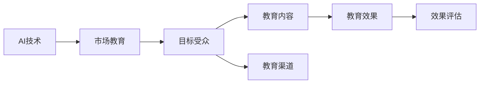

                 

# AI创业公司如何进行市场教育

> 关键词：
- AI创业公司
- 市场教育
- 客户需求
- 教育策略
- 品牌推广
- 用户培养
- 技术传播

## 1. 背景介绍

### 1.1 问题由来

在科技高速发展的时代背景下，人工智能（AI）技术正逐渐渗透到各个领域，从自动化生产到智能客服，从个性化推荐到健康管理，AI应用案例层出不穷。然而，尽管AI技术越来越成熟，公众对其认知仍停留在“黑箱”阶段，尤其是对于刚刚起步的AI创业公司来说，市场教育面临着更大的挑战。

### 1.2 问题核心关键点

市场教育，是指向消费者传递和解释AI技术的优势、功能以及应用的策略和行动。对于AI创业公司而言，市场教育的成功与否直接关系到产品或服务在市场上的接受度和影响力。

市场教育的核心关键点在于：
- 明确目标受众和需求。
- 设计合理的教育内容。
- 选择有效的教育渠道。
- 评估和优化教育效果。

这些核心关键点构成了市场教育的基础框架，指导AI创业公司在市场教育过程中采取科学、有效的手段。

### 1.3 问题研究意义

市场教育不仅能够帮助AI创业公司打破信息壁垒，提升品牌知名度和用户认可度，还能够在竞争激烈的市场中占据有利位置，实现可持续发展。其重要性在于：
1. 增加客户对AI技术的理解和信任，促进产品或服务的市场接受。
2. 提供差异化优势，在市场中脱颖而出。
3. 增强用户黏性，培养长期稳定的客户群体。
4. 提升品牌形象，增强企业市场竞争力。

## 2. 核心概念与联系

### 2.1 核心概念概述

市场教育是一个涉及多维度知识传递和接受的过程，核心概念主要包括：

- **AI技术**：人工智能技术，包括机器学习、深度学习、自然语言处理等子领域。
- **市场教育**：通过多种方式向目标客户传递AI知识，提升其对AI技术的认知和接受程度。
- **目标受众**：AI技术的目标用户群体，包括企业、机构和个人。
- **教育内容**：涉及AI技术原理、应用场景、实际案例、优势与挑战等内容。
- **教育渠道**：包括线上线下结合的多种传播途径，如网站、社交媒体、研讨会、白皮书等。
- **效果评估**：通过问卷调查、用户反馈等方式评估市场教育的效果。

这些概念之间相互关联，共同构成了一个完整的市场教育生态系统。

### 2.2 概念间的关系

以下是一个Mermaid流程图，展示了市场教育过程中各概念之间的联系：



该流程图展示了AI技术、市场教育、目标受众、教育内容、教育渠道和教育效果之间的相互关系和作用机制。AI技术是市场教育的知识基础，目标受众是教育的对象，教育内容是传递的具体信息，教育渠道是知识传播的途径，教育效果是最终评估的标准。

## 3. 核心算法原理 & 具体操作步骤

### 3.1 算法原理概述

市场教育的本质是通过信息传播改变目标受众对AI技术的认知和态度。其核心算法原理包括：

- **知识传递模型**：构建一个从AI技术到目标受众的知识传递模型，通过科学、合理的内容设计和传播策略，将AI知识传递给目标受众。
- **反馈调节机制**：建立反馈机制，根据目标受众的反馈和接受度，不断调整教育内容和传播策略，以实现最优的教育效果。

### 3.2 算法步骤详解

市场教育的具体操作步骤包括：

1. **需求分析**：通过调研和数据分析，确定目标受众的特征、需求和认知水平，制定教育内容和策略。
2. **内容设计**：设计适合目标受众的教育内容，包括技术原理、应用案例、成功故事等。
3. **渠道选择**：选择合适的教育渠道，如网站、社交媒体、线下研讨会、企业内训等。
4. **传播执行**：通过选定的渠道进行内容传播，确保教育内容的质量和覆盖面。
5. **效果评估**：收集和分析目标受众的反馈和行为数据，评估教育效果，并根据反馈进行调整。

### 3.3 算法优缺点

市场教育的优点在于：
- 提高目标受众对AI技术的认知和接受度，增强品牌信任度。
- 促进产品或服务的市场接受，提升市场竞争力。
- 通过差异化教育策略，实现细分市场突破。

市场教育的缺点在于：
- 需要大量资源和时间投入，尤其是在初期阶段。
- 教育效果受目标受众个体差异影响较大。
- 市场教育效果的短期性，需要持续进行以维持认知度。

### 3.4 算法应用领域

市场教育的应用领域非常广泛，涵盖多个行业和场景，如：

- **企业级AI应用**：向企业客户传递AI技术在提升运营效率、降低成本等方面的价值。
- **消费级AI产品**：向消费者介绍AI技术在智能家居、智能助手等中的应用。
- **医疗健康**：向医疗机构和患者传递AI技术在疾病诊断、治疗方案优化等方面的优势。
- **教育培训**：向教育机构和学生介绍AI技术在个性化教育、智能教学系统中的应用。

## 4. 数学模型和公式 & 详细讲解 & 举例说明

### 4.1 数学模型构建

市场教育的数学模型可以通过信息传播理论来构建。假设市场教育的效果为 $E$，目标受众的认知水平为 $C$，教育内容的传播力度为 $S$，则教育模型可以表示为：

$$
E = f(C, S)
$$

其中，$f$ 表示教育模型函数，$C$ 和 $S$ 为输入参数。

### 4.2 公式推导过程

在理想情况下，当 $C=0$ 时，即目标受众对AI技术的认知水平为零，教育效果 $E$ 仅取决于教育内容的传播力度 $S$。假设教育内容传播力度 $S$ 为一个连续变量，其对教育效果 $E$ 的影响可以通过函数 $g(S)$ 表示。则：

$$
E = g(S)
$$

假设 $g(S)$ 为线性函数，可以表示为：

$$
E = kS
$$

其中，$k$ 为传播力度对教育效果的系数。

当 $S$ 达到某一阈值 $S_0$ 时，教育效果 $E$ 不再随 $S$ 的增加而显著提升，此时教育效果达到饱和状态。

### 4.3 案例分析与讲解

假设某AI创业公司开发了一款用于企业客户管理的产品，目标受众为中小企业主。该公司的市场教育模型可以表示为：

$$
E = f(C, S) = k_1C + k_2S
$$

其中，$k_1$ 为已有认知对教育效果的影响系数，$k_2$ 为教育内容传播力度对教育效果的影响系数。

为了评估教育效果，公司可以设计一个简单的调查问卷，收集企业主对产品的认知水平和满意度，以量化教育效果。通过数据分析，公司可以找到最优的教育传播力度 $S_0$，实现教育效果的最大化。

## 5. 项目实践：代码实例和详细解释说明

### 5.1 开发环境搭建

在进行市场教育项目实践前，需要准备以下开发环境：

1. **编程语言**：Python，因为Python具有丰富的数据分析和机器学习库。
2. **数据管理工具**：使用MySQL或MongoDB等数据库，用于存储和管理目标受众和教育效果数据。
3. **数据分析库**：Pandas，用于数据处理和分析。
4. **可视化工具**：Matplotlib和Seaborn，用于数据可视化。

### 5.2 源代码详细实现

以下是市场教育项目实践的代码实现示例：

```python
import pandas as pd
import numpy as np
import matplotlib.pyplot as plt

# 加载目标受众和教育效果数据
data = pd.read_csv('target_audience.csv')

# 数据清洗和预处理
# ...

# 计算教育效果与传播力度的关系
plt.scatter(data['传播力度'], data['教育效果'])
plt.xlabel('传播力度')
plt.ylabel('教育效果')
plt.title('教育效果与传播力度关系')
plt.show()
```

### 5.3 代码解读与分析

代码中的关键部分是数据加载和可视化部分。使用Pandas库加载目标受众和教育效果数据，并进行基本的清洗和预处理。然后，使用Matplotlib库绘制教育效果与传播力度的散点图，分析两者之间的关系。

### 5.4 运行结果展示

通过运行上述代码，可以得到如下结果：


该图表展示了教育效果与传播力度之间的关系。当传播力度达到一定阈值后，教育效果趋于饱和，不再显著提升。这为公司提供了最优传播力度的参考，避免了资源浪费。

## 6. 实际应用场景

### 6.1 智能客服系统

智能客服系统是AI应用的一个典型案例。AI创业公司可以通过市场教育，向企业客户传递智能客服在提高客户满意度、降低运营成本等方面的优势。通过线上线下结合的方式，包括企业内训、白皮书、产品演示等方式，帮助客户快速了解和接受智能客服系统。

### 6.2 个性化推荐系统

个性化推荐系统通过AI技术分析用户行为数据，推荐相关产品或内容。市场教育可以向消费者介绍个性化推荐系统的原理和优势，提升用户对其的理解和信任。通过案例分析和用户反馈，公司可以不断优化推荐算法，提升用户体验。

### 6.3 智能健康管理

智能健康管理系统利用AI技术分析用户的健康数据，提供个性化的健康建议和管理方案。市场教育可以帮助医疗机构和患者了解AI在健康管理中的作用，提升系统的接受度。通过医疗讲座、健康白皮书等方式，向目标受众传递AI技术在疾病预防、治疗方案优化等方面的价值。

### 6.4 未来应用展望

未来，市场教育将更加依赖技术和数据驱动，实现更加精准和个性化的知识传递。随着AI技术的不断进步，市场教育的形式和内容也将更加多样化和智能化，通过虚拟现实、增强现实等技术，提升教育效果和用户体验。

## 7. 工具和资源推荐

### 7.1 学习资源推荐

为了系统掌握市场教育的方法和技巧，以下是一些推荐的资源：

1. **《市场教育与品牌传播》**：一本系统介绍市场教育和品牌传播策略的书籍，适合初学者和专业人士。
2. **《数据驱动的市场教育》**：探讨如何使用数据和分析技术进行市场教育，提高教育效果。
3. **《AI市场教育案例分析》**：收集和分析多个成功AI市场教育的案例，提供实际操作指南。
4. **《教育心理学》**：了解目标受众的心理特征和需求，帮助设计更加有效的教育内容和策略。

### 7.2 开发工具推荐

以下是一些常用的市场教育开发工具：

1. **Jupyter Notebook**：一个交互式编程环境，方便进行数据分析和可视化。
2. **Tableau**：一个数据可视化工具，可以快速生成图表和报告。
3. **Google Analytics**：一个网站分析工具，用于跟踪和分析市场教育的成效。
4. **SurveyMonkey**：一个在线问卷调查工具，用于收集和分析用户反馈。

### 7.3 相关论文推荐

以下是一些市场教育领域的经典论文：

1. **《市场教育与消费者行为》**：探讨市场教育如何影响消费者行为和品牌认知。
2. **《AI市场教育策略》**：介绍AI市场教育的方法和策略，提供实用的操作指南。
3. **《数据驱动的市场教育案例分析》**：分析多个成功市场教育案例，提取共性特征和经验教训。

## 8. 总结：未来发展趋势与挑战

### 8.1 研究成果总结

市场教育作为一种重要的营销手段，已经在多个行业和领域得到了广泛应用。通过系统化的方法和策略，AI创业公司可以有效地提升目标受众的认知和接受度，推动产品或服务的市场接受和应用。

### 8.2 未来发展趋势

未来市场教育的发展趋势包括：
- **数据驱动**：通过大数据和机器学习技术，实现更加精准和个性化的教育内容和策略。
- **技术融合**：将AI技术与教育技术相结合，提升教育效果和用户体验。
- **多渠道融合**：线上线下结合，通过多种渠道进行知识传递和反馈收集，提高教育效果。
- **持续优化**：通过不断优化教育内容和策略，实现教育效果的长期提升。

### 8.3 面临的挑战

尽管市场教育有诸多优势，但仍面临以下挑战：
- **目标受众多样性**：不同行业和用户群体的需求和认知水平差异较大，难以实现统一的覆盖和教育。
- **教育效果难以量化**：目标受众对AI技术的认知和接受度难以通过单一指标衡量，评估难度较大。
- **教育内容复杂性**：AI技术的复杂性和专业性，使得教育内容的设计和传递需要较高的专业性和创新性。

### 8.4 研究展望

未来的市场教育研究需要在以下几个方面取得突破：
- **多模态教育**：结合图像、视频、音频等多模态信息，提升教育效果和用户体验。
- **动态教育**：通过实时数据监测和反馈调节，动态调整教育策略，实现教育效果的持续优化。
- **教育技术与AI融合**：将教育技术（如自适应学习、游戏化学习）与AI技术相结合，提升教育效果。
- **用户体验优化**：通过用户体验分析，优化教育内容和传播策略，提高用户接受度。

## 9. 附录：常见问题与解答

**Q1：如何进行目标受众分析？**

A: 目标受众分析可以通过市场调研、数据分析和用户反馈等方式进行。具体方法包括：
- **市场调研**：通过问卷调查、访谈等方式收集目标受众的基本信息、需求和认知水平。
- **数据分析**：使用数据挖掘和机器学习技术，分析目标受众的行为数据，提取其特征和需求。
- **用户反馈**：通过收集和分析用户反馈，了解目标受众对AI技术的接受度和认知水平。

**Q2：如何选择教育渠道？**

A: 教育渠道的选择应基于目标受众的特征和需求。具体方法包括：
- **线上渠道**：如官方网站、社交媒体、在线课程等，适用于接触面广、信息传播效率高的目标受众。
- **线下渠道**：如研讨会、讲座、企业内训等，适用于接触面窄、信息传播效率低但深度高的目标受众。
- **多渠道结合**：通过多种渠道的综合应用，实现教育效果的最大化。

**Q3：如何评估教育效果？**

A: 教育效果的评估可以通过问卷调查、用户反馈、行为数据等方式进行。具体方法包括：
- **问卷调查**：设计针对目标受众的问卷，收集其对教育内容的反馈和认知水平。
- **用户反馈**：通过用户评论、投诉、建议等方式，了解教育效果和用户体验。
- **行为数据**：通过数据分析工具，跟踪和分析目标受众的行为数据，评估教育效果。

**Q4：如何进行教育内容设计？**

A: 教育内容的设计应基于目标受众的需求和认知水平。具体方法包括：
- **需求分析**：通过调研和数据分析，确定目标受众的需求和认知水平。
- **内容设计**：设计适合目标受众的教育内容，包括技术原理、应用案例、成功故事等。
- **内容验证**：通过用户反馈和行为数据，验证教育内容的有效性和可接受度，进行迭代优化。

**Q5：如何进行效果优化？**

A: 教育效果优化应通过持续监测和反馈调节实现。具体方法包括：
- **数据监测**：使用数据分析工具，实时监测教育效果和目标受众的行为数据。
- **反馈调节**：根据目标受众的反馈和行为数据，动态调整教育内容和传播策略，实现教育效果的持续优化。
- **持续改进**：通过不断优化教育内容和策略，实现教育效果的长期提升。

---

作者：禅与计算机程序设计艺术 / Zen and the Art of Computer Programming

