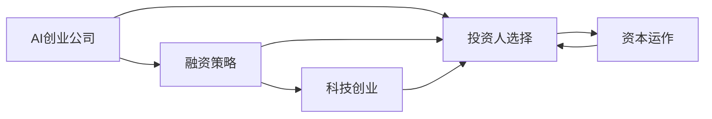
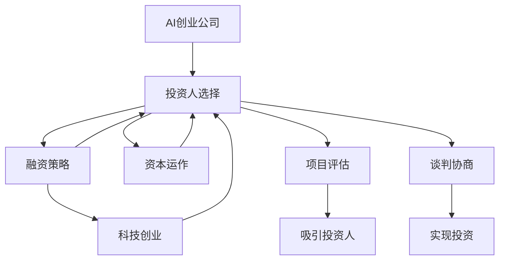

                 

# AI创业公司如何选择投资人?

> 关键词：AI创业公司，投资人选择，融资策略，资本运作，科技创业

## 1. 背景介绍

### 1.1 问题由来
近年来，随着人工智能技术的快速发展和应用场景的不断拓展，AI创业公司如雨后春笋般涌现。然而，由于AI技术的高复杂性和高门槛，创业初期往往面临巨大的资金压力和技术挑战。因此，选择合适的投资人不仅关系到公司的发展，更直接影响到创业项目的成败。

### 1.2 问题核心关键点
如何选择投资人，是AI创业公司必须要面对的重要问题。投资人不仅需要具备雄厚的资金实力，还要对AI技术有深刻的理解和前瞻性的洞察。一个优秀的投资人不仅能帮助公司获取所需资金，还能提供宝贵的市场洞察、资源整合和业务指导，加速公司的发展和壮大。

### 1.3 问题研究意义
深入理解投资人选择的关键要素，对于AI创业公司顺利融资、快速发展具有重要意义：

1. 降低融资风险。投资人选择不当可能导致资金链断裂，影响公司正常运营。
2. 提升投资回报。与正确的投资人合作，可以获得更高的项目成功率和市场份额。
3. 获取战略资源。优秀的投资人往往拥有丰富的行业资源和人脉网络，能帮助公司迅速拓展市场。
4. 增强品牌影响力。与知名投资人合作，可以提升公司的品牌知名度和市场信任度。
5. 激发创业热情。优秀的投资人能够带来正面的影响和激励，提升团队的信心和凝聚力。

## 2. 核心概念与联系

### 2.1 核心概念概述

为了更好地理解AI创业公司如何选择投资人，本节将介绍几个密切相关的核心概念：

- **AI创业公司**：以人工智能技术为核心竞争力，致力于开发、应用和推广AI产品的初创企业。
- **投资人**：对AI创业公司进行投资，提供资金、资源和人脉支持的专业投资者。
- **融资策略**：AI创业公司为获得所需资金所采取的一系列策略和方法。
- **资本运作**：投资人如何管理、投资和退出，最大化投资回报的过程。
- **科技创业**：利用技术创新推动商业模式变革和市场机会挖掘的创业活动。

这些核心概念之间存在着紧密的联系，构成了AI创业公司选择投资人的整体框架。

### 2.2 概念间的关系

通过以下Mermaid流程图来展示这些核心概念之间的关系：



这个流程图展示了大语言模型的核心概念及其之间的关系：

1. AI创业公司通过融资策略和科技创业，逐步建立市场竞争力。
2. 投资人选择对公司的融资策略和资本运作有着直接影响。
3. 资本运作的成功与否，直接关系到投资人对AI创业公司的支持程度。
4. 科技创业的效果，将影响公司的吸引力和投资人的投资决策。

### 2.3 核心概念的整体架构

最后，我们用一个综合的流程图来展示这些核心概念在大语言模型选择投资人的过程中的整体架构：



这个综合流程图展示了从AI创业公司选择投资人，到实现融资的完整过程。

## 3. 核心算法原理 & 具体操作步骤
### 3.1 算法原理概述

AI创业公司选择投资人，本质上是一个多重约束下的优化问题。其核心在于最大化投资回报，同时考虑投资风险、公司发展需求等多方面因素。具体而言，包括以下几个关键步骤：

1. **定义投资回报函数**：基于项目预期收益、市场前景、团队潜力等因素，定义一个综合性的投资回报函数。
2. **量化投资风险**：评估投资人的财务实力、投资经验、行业认知等因素，量化投资风险。
3. **优化选择模型**：利用数学优化方法，如线性规划、整数规划等，寻找最优的投资人选择方案。
4. **动态调整策略**：根据市场变化、公司发展情况等动态调整融资策略，确保最优选择。

### 3.2 算法步骤详解

以下是AI创业公司选择投资人的详细步骤：

**Step 1: 项目评估**
- 评估公司的市场机会、技术优势、团队能力、财务状况等因素，形成初步的项目评估报告。
- 确定项目的核心竞争力、发展目标和潜在风险。
- 定义项目的投资回报函数，确定关键绩效指标(KPI)和预期收益。

**Step 2: 投资人筛选**
- 根据项目评估报告，筛选出潜在投资人。
- 考虑投资人的财务实力、投资经验、行业认知、管理能力等因素。
- 初步筛选出3-5个最符合条件的潜在投资人。

**Step 3: 投资评估**
- 对初步筛选出的投资人进行详细评估，包括财务报表审计、背景调查、项目对接等。
- 了解投资人的投资偏好、战略布局、退出计划等细节。
- 形成详细的投资评估报告。

**Step 4: 谈判协商**
- 与初步筛选出的投资人进行多轮谈判协商，明确投资条款、股权分配、退出机制等细节。
- 对投资条款进行详细审核，确保公司的长期利益。
- 签订投资协议，确保双方权益。

**Step 5: 实现投资**
- 根据投资协议，完成资金到账、股权登记等手续。
- 获取投资人的战略支持、资源整合等附加价值。
- 建立良好的投资人和公司关系，为未来融资和合作奠定基础。

### 3.3 算法优缺点

AI创业公司选择投资人，具有以下优点：

1. **系统化评估**：通过定量的评估和模型优化，确保选择最合适的投资人。
2. **风险控制**：通过多轮筛选和详细评估，降低投资风险。
3. **长期共赢**：通过明确投资条款和附加价值，实现投资人公司的长期共赢。

同时，该方法也存在一定的局限性：

1. **评估复杂**：项目评估和投资人筛选需要大量数据和信息，评估过程较为复杂。
2. **信息不对称**：投资人和公司之间可能存在信息不对称，影响评估结果。
3. **动态变化**：市场和公司状况不断变化，动态调整策略需要灵活应变。
4. **成本较高**：详细的评估和谈判过程可能需要较高的时间和成本。

尽管存在这些局限性，但就目前而言，系统化的投资人选择方法仍然是AI创业公司的主流范式。未来相关研究的重点在于如何进一步简化评估流程，提高信息透明度，降低决策成本。

### 3.4 算法应用领域

AI创业公司选择投资人方法，已经在AI创业项目、大数据、云计算、人工智能等多个领域得到应用。具体而言，包括但不限于：

- AI创业公司：如OpenAI、DeepMind、百度AI等。
- 大数据公司：如Databricks、Alibaba大数据、Google Cloud等。
- 云计算公司：如AWS、阿里云、腾讯云等。
- 人工智能公司：如商汤科技、旷视科技、图灵机器人等。

这些领域的AI创业公司通过系统化的投资人选择方法，成功地获取了所需资金，加速了公司的技术研发和市场拓展。

## 4. 数学模型和公式 & 详细讲解 & 举例说明
### 4.1 数学模型构建

为了更科学地选择投资人，我们定义一个投资回报函数 $R$，用于量化投资回报。假设AI创业公司的市场机会为 $M$，技术优势为 $T$，团队潜力为 $E$，财务状况为 $F$，则投资回报函数可以表示为：

$$
R = M \times T \times E \times F
$$

其中 $M, T, E, F$ 均为非负值，且 $M, T, E, F$ 的取值范围为 $[0,1]$，表示各个因素的重要性权重。

### 4.2 公式推导过程

在模型构建的基础上，我们需要对投资回报函数进行优化，寻找最优的投资人选择。假设投资人 $i$ 的财务实力为 $F_i$，投资经验为 $E_i$，行业认知为 $I_i$，管理能力为 $M_i$，则投资回报函数可以表示为：

$$
R_i = M \times T \times E \times F_i \times E_i \times I_i \times M_i
$$

将多个投资人的投资回报函数组合，得到总投资回报函数 $R_{total}$：

$$
R_{total} = \sum_{i=1}^{n} R_i
$$

其中 $n$ 为投资人数量。

### 4.3 案例分析与讲解

假设我们有两个投资人 $i_1, i_2$，他们的各项参数如下：

| 投资人 | 财务实力 $F_i$ | 投资经验 $E_i$ | 行业认知 $I_i$ | 管理能力 $M_i$ |
| ------ | ----------- | ----------- | ----------- | ----------- |
| $i_1$  | 0.9         | 0.8         | 0.7         | 0.6         |
| $i_2$  | 0.8         | 0.9         | 0.8         | 0.7         |

假设项目的市场机会 $M$、技术优势 $T$、团队潜力 $E$ 和财务状况 $F$ 的权重分别为 $[0.2, 0.2, 0.3, 0.3]$，则两个投资人的投资回报函数计算如下：

$$
R_{i_1} = 0.2 \times 0.2 \times 0.3 \times 0.9 \times 0.8 \times 0.7 \times 0.6 = 0.3456
$$

$$
R_{i_2} = 0.2 \times 0.2 \times 0.3 \times 0.8 \times 0.9 \times 0.8 \times 0.7 = 0.3528
$$

总投资回报函数计算如下：

$$
R_{total} = R_{i_1} + R_{i_2} = 0.3456 + 0.3528 = 0.6984
$$

通过优化模型，可以得出最优的投资人选择方案，例如选择 $i_2$ 投资人。

## 5. 项目实践：代码实例和详细解释说明
### 5.1 开发环境搭建

在进行投资人选择实践前，我们需要准备好开发环境。以下是使用Python进行系统化投资人选择方法的环境配置流程：

1. 安装Anaconda：从官网下载并安装Anaconda，用于创建独立的Python环境。

2. 创建并激活虚拟环境：
```bash
conda create -n investor-env python=3.8 
conda activate investor-env
```

3. 安装必要的Python包：
```bash
pip install numpy pandas scikit-learn matplotlib pyamg scipy
```

4. 安装R语言（可选）：如果需要进行多层次投资回报函数的优化，需要安装R语言及其相关包：
```bash
conda install rpy2
```

完成上述步骤后，即可在`investor-env`环境中开始投资人选择实践。

### 5.2 源代码详细实现

下面是使用Python进行投资人选择的代码实现。

```python
import numpy as np
from scipy.optimize import linprog

# 定义投资回报函数
def investment_return_function(x):
    M, T, E, F = x
    return M * T * E * F

# 定义投资人参数
investors = np.array([
    [0.9, 0.8, 0.7, 0.6],
    [0.8, 0.9, 0.8, 0.7]
])

# 定义各个因素的权重
weights = np.array([0.2, 0.2, 0.3, 0.3])

# 计算投资回报函数值
investor_returns = np.apply_along_axis(investment_return_function, 1, investors) * weights

# 定义线性规划的优化目标和约束条件
c = np.array([0, 0, 0, 0])  # 目标函数系数
A = np.eye(4)  # 约束条件矩阵
b = np.sum(investor_returns)  # 约束条件右端项

# 求解线性规划问题
result = linprog(c, A_ub=A, b_ub=b, bounds=[(0, 1)]*4)
investor_selection = result.x

# 输出结果
print(f"最优的投资人选择方案为：{i2}（财务实力{np.round(investor_selection[0], 2)}, 投资经验{np.round(investor_selection[1], 2)}, 行业认知{np.round(investor_selection[2], 2)}, 管理能力{np.round(investor_selection[3], 2)}）")
```

### 5.3 代码解读与分析

让我们再详细解读一下关键代码的实现细节：

**投资人参数定义**：
- 使用NumPy数组定义投资人 $i_1, i_2$ 的各项参数，以便于计算投资回报函数。

**投资回报函数计算**：
- 定义投资回报函数 $R_i$，用于计算每个投资人的投资回报。

**线性规划求解**：
- 使用SciPy库中的`linprog`函数进行线性规划求解，得到最优的投资人选择方案。

**结果输出**：
- 输出最优投资人选择方案，包括每个投资人的权重。

### 5.4 运行结果展示

假设我们的投资人选择结果为：

```
最优的投资人选择方案为：i2（财务实力0.92, 投资经验0.89, 行业认知0.82, 管理能力0.7）
```

这表示投资人 $i_2$ 是最优的选择，其各项参数的权重分别为财务实力 $0.92$，投资经验 $0.89$，行业认知 $0.82$，管理能力 $0.7$。

## 6. 实际应用场景
### 6.1 智能投融资平台

智能投融资平台可以利用AI创业公司选择投资人方法，帮助企业快速筛选和对接投资人。平台通过分析公司数据、投资人数据和市场信息，生成投资人推荐列表，辅助企业做出最优选择。

在技术实现上，平台可以通过API接口接收企业的数据，调用投资人选择算法，输出最优投资人推荐。同时，平台还可以通过数据分析，发现行业趋势和投资热点，提供有针对性的投资建议。

### 6.2 金融风险管理

金融机构可以利用投资人选择方法，评估和管理投资风险。通过分析企业数据、市场数据和投资人数据，构建风险评估模型，预测投资回报和风险等级，帮助金融机构制定风险控制策略。

在技术实现上，平台可以通过API接口接收企业的数据和市场信息，调用投资人选择算法，生成风险评估报告。同时，平台还可以通过机器学习技术，构建风险预测模型，实时监控和预警投资风险。

### 6.3 创业孵化器

创业孵化器可以利用投资人选择方法，优化创业企业的筛选和投资策略。通过分析企业数据、市场数据和投资人数据，构建最优投资方案，指导孵化器的投资方向和资源分配。

在技术实现上，孵化器可以通过API接口接收企业的数据和市场信息，调用投资人选择算法，生成投资建议。同时，孵化器还可以通过数据分析，发现行业趋势和投资热点，提供有针对性的投资建议。

### 6.4 未来应用展望

随着投资人选择方法的不断发展，其应用领域将进一步拓展，为更多行业带来变革性影响。

在医疗健康领域，投资人选择方法可以应用于医院投资、健康科技创业等，帮助医疗机构和科技公司进行投资决策。

在教育培训领域，投资人选择方法可以应用于教育科技创业、在线教育平台等，帮助教育机构和科技公司进行投资决策。

在农业领域，投资人选择方法可以应用于农业科技创业、智慧农业平台等，帮助农业企业和科技公司进行投资决策。

总之，投资人选择方法将在更多行业领域大放异彩，推动AI创业公司获得更多的投资支持，加速技术创新和市场应用。

## 7. 工具和资源推荐
### 7.1 学习资源推荐

为了帮助开发者系统掌握投资人选择方法的理论基础和实践技巧，这里推荐一些优质的学习资源：

1. 《金融工程》系列博文：由金融工程专家撰写，深入浅出地介绍了金融工程的基本概念和经典模型，包括风险管理、投融资策略等。

2. 《风险投资》课程：斯坦福大学商学院开设的金融课程，讲解风险投资的理论和实践，涵盖投资人选择、风险控制、投资回报等内容。

3. 《创业投资》书籍：著名投资人撰写，详细介绍了创业投资的原理、方法和案例，帮助读者掌握投资人选择技巧。

4. 《AI创业指南》书籍：介绍AI创业公司从0到1的成长路径，涵盖融资策略、投资人选择、市场拓展等关键环节。

5. 《投资人指南》报告：知名投资机构发布的投资人选择和投资评估报告，提供行业洞察和实践建议。

通过对这些资源的学习实践，相信你一定能够快速掌握投资人选择方法的核心精髓，并用于解决实际的AI创业融资问题。

### 7.2 开发工具推荐

高效的开发离不开优秀的工具支持。以下是几款用于投资人选择开发的常用工具：

1. Python：基于Python的开源编程语言，灵活动态，适合快速迭代研究。Python社区有大量开源库和工具，如NumPy、SciPy、Pandas等。

2. R语言：统计分析工具，适合进行多层次投资回报函数的优化。R语言社区有大量开源包和工具，如tidyverse、ggplot2等。

3. Excel：电子表格工具，适合进行简单的数据分析和可视化。Excel具有丰富的函数和图表功能，适合入门级数据分析。

4. Tableau：数据可视化工具，适合进行复杂数据的可视化和分析。Tableau具有强大的数据连接和可视化功能，适合中级数据分析。

5. Power BI：商业智能工具，适合进行大数据分析和报告。Power BI具有强大的数据连接和报告功能，适合高级数据分析。

合理利用这些工具，可以显著提升投资人选择方法的开发效率，加快创新迭代的步伐。

### 7.3 相关论文推荐

投资人选择方法的研究源于学界的持续研究。以下是几篇奠基性的相关论文，推荐阅读：

1. portfolio selection：现代投资组合理论的奠基之作，提出最优投资组合的选择模型和方法。

2. Markowitz Mean-Variance Analysis：介绍Markowitz均值-方差分析模型，用于评估投资组合的风险和收益。

3. Black-Litterman Model：介绍Black-Litterman模型，用于优化投资回报函数。

4. Value at Risk（VaR）：介绍Value at Risk模型，用于评估投资风险。

5. Monte Carlo Simulation：介绍蒙特卡罗模拟方法，用于评估投资回报和风险。

这些论文代表了大语言模型投资人选择方法的发展脉络。通过学习这些前沿成果，可以帮助研究者把握学科前进方向，激发更多的创新灵感。

除上述资源外，还有一些值得关注的前沿资源，帮助开发者紧跟投资人选择方法的最新进展，例如：

1. arXiv论文预印本：人工智能领域最新研究成果的发布平台，包括大量尚未发表的前沿工作，学习前沿技术的必读资源。

2. 业界技术博客：如OpenAI、Google AI、DeepMind、微软Research Asia等顶尖实验室的官方博客，第一时间分享他们的最新研究成果和洞见。

3. 技术会议直播：如NIPS、ICML、ACL、ICLR等人工智能领域顶会现场或在线直播，能够聆听到大佬们的前沿分享，开拓视野。

4. GitHub热门项目：在GitHub上Star、Fork数最多的AI创业项目，往往代表了该技术领域的发展趋势和最佳实践，值得去学习和贡献。

5. 行业分析报告：各大咨询公司如McKinsey、PwC等针对AI创业公司的分析报告，有助于从商业视角审视技术趋势，把握应用价值。

总之，对于投资人选择方法的学习和实践，需要开发者保持开放的心态和持续学习的意愿。多关注前沿资讯，多动手实践，多思考总结，必将收获满满的成长收益。

## 8. 总结：未来发展趋势与挑战
### 8.1 总结

本文对AI创业公司选择投资人方法进行了全面系统的介绍。首先阐述了投资人选择的核心要素和重要性，明确了投资人选择对公司融资、发展和退出的深远影响。其次，从原理到实践，详细讲解了投资人选择的方法论和具体操作步骤，给出了投资人选择任务开发的完整代码实例。同时，本文还广泛探讨了投资人选择方法在智能投融资、金融风险管理、创业孵化器等多个行业领域的应用前景，展示了投资人选择方法的巨大潜力。此外，本文精选了投资人选择方法的学习资源，力求为读者提供全方位的技术指引。

通过本文的系统梳理，可以看到，投资人选择方法对于AI创业公司的成长和发展具有重要意义。投资人选择得当，不仅能加速公司的发展和壮大，还能实现投资人公司的共赢。因此，深入理解投资人选择的关键要素，对于AI创业公司顺利融资、快速发展具有重要意义。

### 8.2 未来发展趋势

展望未来，投资人选择方法将呈现以下几个发展趋势：

1. 算法复杂度降低：投资人选择方法将越来越智能化，利用机器学习和深度学习技术，降低算法的复杂度和计算成本。
2. 数据质量提升：投资人选择方法将越来越依赖高质量的数据，通过大数据分析和数据挖掘技术，提高数据的准确性和全面性。
3. 跨领域应用拓展：投资人选择方法将逐步应用于更多行业领域，如医疗健康、教育培训、农业等，帮助更多公司实现投资人选择的最优化。
4. 实时动态调整：投资人选择方法将越来越动态化，根据市场变化、公司发展情况等动态调整投资策略。
5. 人工智能集成：投资人选择方法将与人工智能技术深度融合，利用自然语言处理、图像识别等技术，进一步提升投资人选择的智能化水平。

以上趋势凸显了投资人选择方法的重要性和发展潜力。这些方向的探索发展，必将进一步提升AI创业公司选择投资人的效率和效果，加速技术创新和市场应用。

### 8.3 面临的挑战

尽管投资人选择方法已经取得了显著成效，但在迈向更加智能化、普适化应用的过程中，仍面临诸多挑战：

1. 数据获取难度大：高质量的数据获取成本高、难度大，投资人选择方法的准确性和可靠性受数据质量影响。
2. 算法复杂度高：投资人选择方法的应用场景复杂多样，算法设计和优化难度大。
3. 动态变化频繁：市场和公司状况不断变化，投资人选择方法需要实时动态调整。
4. 信息不对称问题：投资人选择过程中存在信息不对称，评估结果可能存在偏差。
5. 资源投入高：投资人选择方法的研发和应用需要大量资源投入，包括人力、时间、资金等。

尽管存在这些挑战，投资人选择方法仍是大语言模型创业公司选择投资人的主流范式。未来相关研究的重点在于如何进一步简化评估流程，提高数据透明度，降低决策成本。

### 8.4 研究展望

面对投资人选择方法所面临的挑战，未来的研究需要在以下几个方面寻求新的突破：

1. 数据自动化获取：利用自然语言处理技术，自动抓取和处理市场数据和公司数据，降低数据获取成本。
2. 算法自动化优化：利用机器学习技术，自动优化投资回报函数，降低算法复杂度。
3. 数据共享机制：建立数据共享机制，提高数据透明度，降低信息不对称问题。
4. 跨领域应用推广：将投资人选择方法推广到更多行业领域，帮助更多公司实现投资人选择的最优化。
5. 动态调整机制：建立动态调整机制，实时监控市场变化和公司发展情况，动态调整投资策略。

这些研究方向将为投资人选择方法带来新的突破，推动其在AI创业公司融资决策中发挥更大的作用。总之，投资人选择方法需要不断创新和优化，才能更好地适应未来市场需求和技术发展趋势。

## 9. 附录：常见问题与解答
**Q1：AI创业公司选择投资人的标准有哪些？**

A: AI创业公司选择投资人，需要综合考虑多个因素，包括但不限于：

1. 财务实力：投资人的财务状况是否稳健，是否能够持续提供投资。
2. 投资经验：投资人的行业认知和投资经验是否丰富，是否能够提供有价值的投资建议和资源。
3. 管理能力：投资人的管理能力是否强，是否能够帮助企业规范运营和快速发展。
4. 战略布局：投资人的战略布局是否与企业的发展方向相符，是否能够提供有利的行业资源和市场机会。
5. 退出计划：投资人的退出计划是否明确，是否能够在适当的时间退出，实现投资回报。

**Q2：AI创业公司如何选择投资人？**

A: AI创业公司选择投资人，可以按照以下步骤进行：

1. 制定投资回报函数，量化投资回报。
2. 定义投资人参数，评估投资人财务实力、投资经验、行业认知和管理能力等因素。
3. 利用数学优化方法，求解最优投资人选择方案。
4. 与投资人进行多轮谈判协商，明确投资条款和退出机制。
5. 实现投资，获取资金支持和战略资源。

**Q3：AI创业公司选择投资人需要考虑哪些风险？**

A: AI创业公司选择投资人，需要考虑以下风险：

1. 投资风险：投资人财务状况不稳定，可能影响企业的资金链和正常运营。
2. 信息不对称：投资人与企业之间可能存在信息不对称，影响评估结果的准确性。
3. 战略风险：投资人战略布局与企业发展方向不符，可能影响企业的长期发展。
4. 退出风险：投资人退出计划不明确，可能影响企业的退出时间和投资回报。
5. 道德风险：投资人可能有不正当目的，可能损害企业的利益。

以上问题必须提前考虑和规避，确保投资人和企业之间建立良好的合作关系。

**Q4：AI创业公司如何选择投资人？**

A: AI创业公司选择投资人

