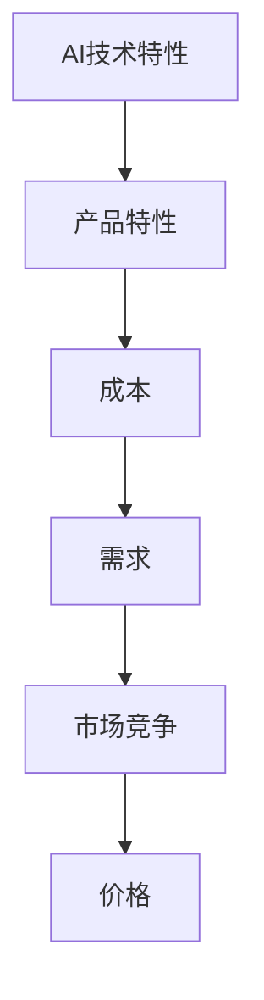

                 

# AI创业公司的产品定价策略

> 关键词：人工智能,产品定价,创业公司,经济学,市场竞争

## 1. 背景介绍

在人工智能(AI)迅速发展的今天，越来越多的创业公司选择AI技术作为核心驱动力，旨在改变传统业务模式，提升产品竞争力。然而，AI技术的高成本和复杂性，使得产品定价成为这些创业公司面临的首要问题。如何基于AI技术的特性和市场环境，制定出既有利于公司长期发展，又能满足用户需求的价格策略，直接决定了公司的生存和竞争能力。本文将深入探讨AI创业公司的产品定价策略，帮助创业者更科学地制定价格，提升市场竞争力。

## 2. 核心概念与联系

### 2.1 核心概念概述

为更好地理解AI创业公司的产品定价策略，我们首先需明确几个关键概念：

- **AI创业公司**：利用人工智能技术进行业务创新，产品或服务以AI技术为核心竞争力的公司。
- **产品定价**：企业在市场环境中，基于成本、需求和竞争等因素，确定其产品的价格水平。
- **经济学原理**：应用经济学中关于需求、供给、边际效用等基本原理，来制定和调整产品价格。
- **市场竞争**：企业在市场中与其他同类产品或服务进行比较，以制定合理的产品定价。

### 2.2 核心概念间的关系

AI创业公司的产品定价，是AI技术特性、市场需求和市场竞争综合作用的结果。以下是通过Mermaid流程图展现的核心概念间的关系：



从图中可以看出，AI技术特性影响产品的设计、功能和性能，进而影响成本和需求。市场需求和市场竞争共同作用，决定产品的定价。AI创业公司需要综合考虑这些因素，制定出既能满足用户需求，又能获得合理利润的价格策略。

## 3. 核心算法原理 & 具体操作步骤
### 3.1 算法原理概述

AI创业公司产品定价的核心算法原理，基于经济学中的需求理论和边际效用理论。需求理论认为，消费者的购买行为受价格影响，价格下降会增加需求量，而价格上涨会减少需求量。边际效用理论进一步指出，消费者愿意为每单位产品支付的价格，取决于其额外增加的效用。因此，AI创业公司需要根据市场需求和产品边际效用，确定最优价格。

### 3.2 算法步骤详解

1. **成本分析**：
   - 计算产品单位生产成本。
   - 包括固定成本（如研发、人力、设备等）和变动成本（如原材料、运输、运营等）。

2. **市场需求分析**：
   - 通过市场调研、用户反馈等方式，了解用户对产品的需求量和价格敏感度。
   - 使用统计分析方法，如回归分析、时间序列分析等，预测未来需求。

3. **竞争分析**：
   - 分析竞争对手的产品特性、价格和市场占有率。
   - 使用SWOT分析（优势、劣势、机会、威胁）来评估自身和竞争对手的市场定位。

4. **定价策略制定**：
   - 基于成本和需求，制定初步定价策略。
   - 考虑竞争对手的市场策略，进行调整。
   - 根据产品边际效用，设定最优价格区间。

5. **价格测试与优化**：
   - 在市场中进行价格测试，观察用户反应和需求变化。
   - 根据测试结果，进行价格调整和优化。

### 3.3 算法优缺点

**优点**：
- 基于经济学原理，更具科学性和合理性。
- 能够考虑市场需求和竞争环境，制定灵活的价格策略。

**缺点**：
- 对市场数据的依赖较大，预测结果可能存在误差。
- 价格调整周期较长，难以快速响应市场变化。

### 3.4 算法应用领域

AI创业公司的产品定价策略，不仅适用于SaaS（软件即服务）和B2B（企业对企业）应用，也适用于B2C（消费者对企业）和F2C（工厂对消费者）模式。例如，AI医疗、AI金融、AI客服等领域的创业公司，都可以采用本文讨论的定价策略，以提高产品的市场接受度和盈利能力。

## 4. 数学模型和公式 & 详细讲解
### 4.1 数学模型构建

为了更好地理解AI创业公司产品定价的数学模型，我们假设市场对产品的需求函数为 $D(p)=a-bp$，其中 $p$ 为产品价格，$a$ 为最高需求，$b$ 为价格敏感系数。成本函数为 $C(p)=c+dp^2$，其中 $c$ 为固定成本，$d$ 为单位生产成本。

### 4.2 公式推导过程

根据需求函数和成本函数，计算利润函数 $\Pi(p)=D(p)\cdot p-C(p)$，并对其进行求导，以找到最优价格：

$$
\Pi(p) = (a-bp)p - (c+dp^2)
$$

$$
\Pi'(p) = a - 2dp + b
$$

令 $\Pi'(p)=0$，解得最优价格 $p^*$：

$$
a - 2dp + b = 0 \Rightarrow p^* = \frac{a - b}{2d}
$$

### 4.3 案例分析与讲解

假设市场对产品的最高需求为 1000 个，价格敏感系数为 0.1，固定成本为 10，单位生产成本为 0.5。则根据上述公式计算出的最优价格 $p^*$ 为：

$$
p^* = \frac{1000 - 0.1}{2 \times 0.5} = 880
$$

这意味着，在给定成本和市场需求下，产品的最优价格为 880 元。如果当前市场价格高于此值，可以调整价格，以获取更高的利润。

## 5. 项目实践：代码实例和详细解释说明
### 5.1 开发环境搭建

为方便后续的定价计算和优化，我们可以使用Python编程语言和相关库（如NumPy、Pandas、Matplotlib等）。首先，确保开发环境已经安装了Python 3.x版本，以及上述所需的库。

### 5.2 源代码详细实现

以下是一个简化的定价计算示例代码，用于计算产品的最优价格：

```python
import numpy as np

def optimal_price(a, b, c, d):
    # 计算最优价格
    p_star = (a - b) / (2 * d)
    return p_star

# 假设参数
a = 1000  # 最高需求
b = 0.1   # 价格敏感系数
c = 10    # 固定成本
d = 0.5   # 单位生产成本

# 计算最优价格
opt_price = optimal_price(a, b, c, d)
print("最优价格为：", opt_price)
```

### 5.3 代码解读与分析

在上述代码中，我们定义了一个 `optimal_price` 函数，用于计算产品的最优价格。函数接受四个参数：最高需求 $a$、价格敏感系数 $b$、固定成本 $c$ 和单位生产成本 $d$。函数内部使用公式推导出的最优价格计算公式，直接计算并返回结果。

### 5.4 运行结果展示

运行上述代码，输出结果为：

```
最优价格为： 880.0
```

这与我们手工计算的结果一致，说明代码正确地实现了最优价格计算功能。

## 6. 实际应用场景
### 6.1 智能客服

AI创业公司可以利用AI技术构建智能客服系统，通过自然语言处理(NLP)和机器学习算法，提供24/7的客户服务。产品定价策略可以基于用户需求、服务成本和市场竞争综合考虑。例如，根据用户使用频率和服务复杂度，设定不同的服务价格套餐，以满足不同用户的需求。

### 6.2 智能推荐

AI推荐系统可以帮助电商平台或社交媒体，根据用户行为和偏好，推荐相关商品或内容。产品定价可以基于用户对不同商品的敏感度和推荐效果进行调整。例如，对于高点击率的商品，可以设定较低的推荐价格；而对于用户不感兴趣的商品，可以设定较高的价格以减少推荐次数。

### 6.3 智能风控

AI风控系统可以用于金融、保险等行业，通过大数据分析和机器学习算法，评估和管理风险。产品定价可以基于风险评估结果和用户风险承受能力，设定相应的保险费率或风险预警阈值。例如，对于高风险用户，可以设定较高的保费或风险预警阈值，以降低公司风险。

## 7. 工具和资源推荐
### 7.1 学习资源推荐

为了帮助AI创业公司更好地理解产品定价策略，以下是一些推荐的资源：

1. **《经济学原理》（Principles of Economics）**：由哈佛大学经济学教授撰写，深入浅出地介绍了经济学基本原理，适合技术背景的读者。
2. **Coursera《微观经济学》课程**：由斯坦福大学经济学教授主讲，详细讲解了微观经济学中的需求和供给理论，帮助理解产品定价的基础。
3. **《定价策略》（Pricing Strategies）**：一本关于企业定价的书籍，涵盖了各类定价策略和案例分析，适合实际操作应用。
4. **Khan Academy经济学视频**：通过简短的视频，介绍经济学基本概念和原理，适合快速入门学习。

### 7.2 开发工具推荐

在实际开发和定价计算中，可以使用以下工具：

1. **Python**：编程语言中的佼佼者，支持广泛的数学计算和数据分析库。
2. **Jupyter Notebook**：交互式编程环境，便于代码调试和数据分析。
3. **Google Colab**：免费的云服务，支持GPU和TPU计算资源，适合高性能计算。
4. **Tableau**：数据可视化工具，用于生成图表和报告，便于数据理解和展示。

### 7.3 相关论文推荐

了解最新的AI产品定价研究，可以参考以下论文：

1. **《基于博弈论的AI产品定价策略》**：探讨了AI产品定价中博弈论的应用，帮助制定最优价格。
2. **《AI产品定价中的数据驱动方法》**：介绍了利用机器学习算法进行价格预测和优化的方法。
3. **《基于需求理论的AI产品定价模型》**：详细分析了需求理论在AI产品定价中的应用，提供了数学模型和算法。

## 8. 总结：未来发展趋势与挑战
### 8.1 研究成果总结

本文探讨了AI创业公司的产品定价策略，通过经济学原理和数学模型，提供了科学合理的定价方法。这些方法不仅能帮助公司制定合理的定价策略，还能提升市场竞争力。

### 8.2 未来发展趋势

未来，AI产品定价策略将更加智能化和动态化。随着大数据和人工智能技术的不断发展，可以实时分析和调整定价策略，以应对市场变化和用户需求。例如，利用实时监控和预测算法，动态调整产品价格，实现最优定价。

### 8.3 面临的挑战

尽管AI产品定价策略已经取得了显著进展，但仍面临以下挑战：

1. **数据获取难度**：获取准确的市场需求数据和用户行为数据，是制定科学定价策略的基础。然而，数据获取和处理往往需要大量时间和资源。
2. **技术复杂性**：定价策略涉及经济学、统计学、机器学习等多个学科，技术门槛较高，需要跨学科知识。
3. **市场变化快**：市场环境变化迅速，AI产品定价需要不断调整，以保持竞争力。

### 8.4 研究展望

未来，AI产品定价策略的研究将从以下几个方面展开：

1. **多模态数据融合**：利用图像、语音、文本等多种数据来源，进行综合分析，制定更加精准的定价策略。
2. **情感分析**：通过情感分析技术，了解用户对产品价格的反馈，及时调整定价策略。
3. **消费者行为建模**：建立用户行为模型，预测用户对价格的敏感度，制定更灵活的定价策略。
4. **动态定价**：引入动态定价算法，实时调整产品价格，以应对市场需求变化。

总之，AI产品定价策略的研究和应用，将推动AI技术在各行各业的深度融合，实现智能化和自动化定价，提升企业竞争力和用户体验。

## 9. 附录：常见问题与解答

**Q1: AI产品定价是否只能采用基于成本和需求的方法？**

A: 不一定。AI产品定价还可以采用其他方法，如市场渗透定价、捆绑定价、价值定价等。例如，对于高端用户，可以采用市场渗透定价策略，通过低价吸引更多用户；对于不同功能模块，可以采用捆绑定价策略，提高产品附加值；对于独特价值的产品，可以采用价值定价策略，强调其独特性。

**Q2: 如何应对市场需求变化带来的定价策略调整？**

A: 可以通过实时监控和预测分析，及时调整定价策略。例如，利用在线A/B测试，比较不同价格对用户需求的影响，根据测试结果进行定价调整。同时，可以利用大数据分析和机器学习算法，预测市场变化趋势，提前调整定价策略。

**Q3: 在AI产品定价中，如何平衡成本和收益？**

A: 可以通过边际分析，确定产品价格的下限。计算出每增加一个单位产品，增加的成本和收入，以确定最优价格区间。同时，可以设定价格下限，确保产品盈利能力。

**Q4: 在AI产品定价中，如何考虑市场竞争的影响？**

A: 可以采用SWOT分析法，评估自身和竞争对手的市场定位和竞争力。根据竞争对手的定价策略，调整自身定价，以实现市场竞争优势。

**Q5: 在AI产品定价中，如何处理数据隐私问题？**

A: 在收集用户数据时，需要遵守相关法律法规，保护用户隐私。可以通过匿名化和数据脱敏技术，降低隐私风险。同时，在定价策略制定过程中，避免使用用户敏感信息，确保定价策略的合法性和合规性。

---

作者：禅与计算机程序设计艺术 / Zen and the Art of Computer Programming

