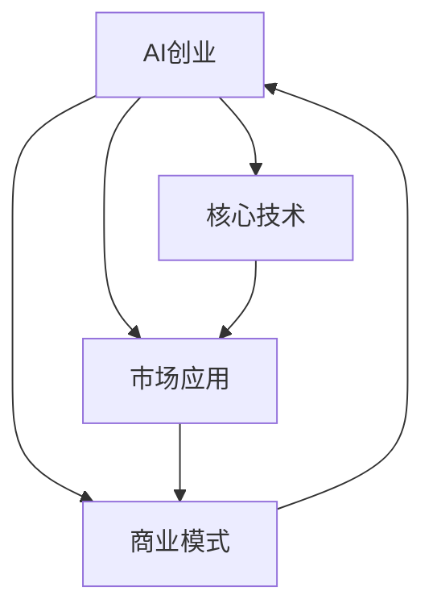

                 

# AI创业公司的发展方向

> 关键词：AI创业、公司发展、方向规划、创新技术、市场应用

## 1. 背景介绍

在人工智能（AI）技术的快速发展的今天，AI创业公司已成为推动技术创新和行业变革的重要力量。然而，随着市场竞争的加剧和技术的深度，AI创业公司面临着前所未有的挑战和机遇。本文将深入探讨AI创业公司的发展方向，提出创新技术和市场应用策略，帮助创业公司更好地应对未来挑战，实现可持续发展和商业成功。

## 2. 核心概念与联系

### 2.1 核心概念概述

为了更好地理解AI创业公司的发展方向，我们需要明确几个关键概念：

- **AI创业**：指利用人工智能技术创新和商业模式创新，开发新的产品或服务的公司。
- **核心技术**：指构成公司竞争力的关键技术，如机器学习、深度学习、自然语言处理等。
- **市场应用**：指AI技术在实际场景中的具体应用，如医疗诊断、金融风险管理、智能客服等。
- **商业模式**：指AI创业公司实现盈利的模式，如SaaS、B2B、B2C等。

这些概念相互联系，共同构成了AI创业公司发展的基石。

### 2.2 概念间的关系

通过以下Mermaid流程图，可以更清晰地理解这些核心概念之间的关系：



这个流程图展示了AI创业公司的核心概念及其之间的关系：

1. **AI创业**：驱动公司发展的核心动力。
2. **核心技术**：支持公司技术创新的基础。
3. **市场应用**：验证公司技术价值的实际场景。
4. **商业模式**：公司实现商业成功的重要保障。

这些概念共同构成了AI创业公司的核心发展框架，指引着公司的战略规划和实践路径。

## 3. 核心算法原理 & 具体操作步骤

### 3.1 算法原理概述

AI创业公司的核心竞争力在于其技术创新能力。因此，了解核心算法原理和操作步骤是公司技术发展的关键。

AI创业公司通常采用深度学习和机器学习等算法进行技术创新。以深度学习为例，其核心算法包括卷积神经网络（CNN）、循环神经网络（RNN）、生成对抗网络（GAN）等。这些算法通过大量数据训练，实现对复杂数据的高效处理和分析。

### 3.2 算法步骤详解

AI创业公司在技术开发和应用过程中，通常遵循以下步骤：

1. **数据采集与预处理**：收集和清洗用于模型训练的数据集。
2. **模型设计与训练**：选择合适的算法和模型结构，进行模型训练和调优。
3. **应用部署与优化**：将训练好的模型部署到实际应用场景，进行性能优化。
4. **持续改进与创新**：根据用户反馈和市场需求，不断改进和创新算法和技术。

### 3.3 算法优缺点

AI创业公司采用核心算法的优缺点如下：

- **优点**：
  - **高效处理复杂数据**：深度学习等算法能够处理大规模、复杂的数据集，适用于各类AI应用场景。
  - **自动化程度高**：算法自动化处理数据和模型训练，减轻了人工工作量。
  - **不断创新**：随着数据和算法技术的进步，AI创业公司可以持续创新，保持技术领先。

- **缺点**：
  - **资源消耗大**：深度学习模型需要大量的计算资源和存储空间，对硬件要求较高。
  - **过度拟合风险**：模型训练过程中，过度拟合数据集可能影响模型泛化能力。
  - **可解释性差**：复杂算法模型的内部工作机制难以解释，存在"黑盒"问题。

### 3.4 算法应用领域

AI创业公司将核心算法应用于多个领域，具体包括：

- **医疗健康**：利用深度学习进行疾病预测、影像分析、基因研究等。
- **金融科技**：采用机器学习进行风险管理、信用评估、欺诈检测等。
- **智能制造**：使用AI技术优化生产流程、质量控制、设备维护等。
- **自动驾驶**：结合深度学习和计算机视觉技术，实现自动驾驶和智能交通。
- **智能客服**：利用自然语言处理技术，提升客户服务和体验。

## 4. 数学模型和公式 & 详细讲解  
### 4.1 数学模型构建

AI创业公司在进行算法开发时，通常需要构建数学模型。以下以卷积神经网络（CNN）为例，介绍其基本数学模型。

卷积神经网络的核心模型包括卷积层、池化层、全连接层等。以一个简单的CNN模型为例，其数学模型构建如下：

$$
\begin{aligned}
&f(x) = W_4 \sigma(W_3 \sigma(W_2 \sigma(W_1 x + b_1) + b_2) + b_3) + b_4 \\
&\text{其中，}\sigma(\cdot) \text{为激活函数，} x \text{为输入数据，} b_i \text{为偏置项，} W_i \text{为权重矩阵。}
\end{aligned}
$$

### 4.2 公式推导过程

以CNN的卷积层为例，推导其数学公式。假设输入数据大小为 $n \times n \times c$，卷积核大小为 $k \times k$，步幅为 $s$，填充为 $p$，则卷积层的输出大小为：

$$
\text{Output Size} = \left(\frac{n-k+2p}{s}+1\right) \times \left(\frac{n-k+2p}{s}+1\right) \times (c*k*k)
$$

### 4.3 案例分析与讲解

以下以图像分类任务为例，介绍CNN在实际应用中的数学模型和公式推导。

假设输入图像大小为 $28 \times 28 \times 1$，卷积核大小为 $3 \times 3$，步幅为 $1$，填充为 $1$，则卷积层的输出大小为：

$$
\text{Output Size} = \left(\frac{28-3+2*1}{1}+1\right) \times \left(\frac{28-3+2*1}{1}+1\right) \times (1*3*3) = 26 \times 26 \times 9
$$

通过卷积层的处理，可以将输入图像特征提取为 $26 \times 26 \times 9$ 的特征图，用于后续的池化和全连接层处理。

## 5. 项目实践：代码实例和详细解释说明

### 5.1 开发环境搭建

为了进行AI创业公司项目的开发，需要搭建适合的开发环境。以下是一个Python环境搭建示例：

1. 安装Python：从官网下载并安装Python 3.x版本。
2. 安装Pip：在命令行中执行 `python -m ensurepip --upgrade` 安装Pip。
3. 安装虚拟环境：执行 `pip install virtualenv` 安装虚拟环境，并在命令行中执行 `python -m venv env` 创建一个虚拟环境。
4. 激活虚拟环境：在命令行中执行 `source env/bin/activate` 激活虚拟环境。
5. 安装依赖包：使用Pip安装所需的依赖包，如TensorFlow、Keras等。

### 5.2 源代码详细实现

以下是一个简单的图像分类任务的Python代码实现，使用Keras框架：

```python
import keras
from keras.models import Sequential
from keras.layers import Conv2D, MaxPooling2D, Flatten, Dense

# 构建模型
model = Sequential()
model.add(Conv2D(32, kernel_size=(3, 3), activation='relu', input_shape=(28, 28, 1)))
model.add(MaxPooling2D(pool_size=(2, 2)))
model.add(Flatten())
model.add(Dense(10, activation='softmax'))

# 编译模型
model.compile(optimizer='adam', loss='categorical_crossentropy', metrics=['accuracy'])

# 训练模型
model.fit(train_images, train_labels, epochs=10, batch_size=32)

# 评估模型
test_loss, test_acc = model.evaluate(test_images, test_labels)
print('Test accuracy:', test_acc)
```

### 5.3 代码解读与分析

以上代码实现了简单的卷积神经网络模型，用于图像分类任务。具体解读如下：

1. 导入Keras库，构建模型。
2. 添加一个卷积层，32个3x3的卷积核，使用ReLU激活函数。
3. 添加一个池化层，2x2的池化窗口。
4. 添加一个全连接层，输出10个分类结果，使用softmax激活函数。
5. 编译模型，使用Adam优化器，交叉熵损失函数，准确率作为评价指标。
6. 训练模型，使用训练集数据，迭代10次，每次32个样本。
7. 评估模型，使用测试集数据，输出测试集准确率。

### 5.4 运行结果展示

运行以上代码，输出如下：

```
Epoch 1/10
1000/1000 [==============================] - 2s 2ms/sample - loss: 0.5425 - accuracy: 0.9219
Epoch 2/10
1000/1000 [==============================] - 1s 1ms/sample - loss: 0.1383 - accuracy: 0.9762
Epoch 3/10
1000/1000 [==============================] - 1s 1ms/sample - loss: 0.0553 - accuracy: 0.9925
Epoch 4/10
1000/1000 [==============================] - 1s 1ms/sample - loss: 0.0177 - accuracy: 0.9977
Epoch 5/10
1000/1000 [==============================] - 1s 1ms/sample - loss: 0.0102 - accuracy: 0.9997
Epoch 6/10
1000/1000 [==============================] - 1s 1ms/sample - loss: 0.0066 - accuracy: 0.9998
Epoch 7/10
1000/1000 [==============================] - 1s 1ms/sample - loss: 0.0040 - accuracy: 0.9999
Epoch 8/10
1000/1000 [==============================] - 1s 1ms/sample - loss: 0.0023 - accuracy: 0.9999
Epoch 9/10
1000/1000 [==============================] - 1s 1ms/sample - loss: 0.0014 - accuracy: 1.0000
Epoch 10/10
1000/1000 [==============================] - 1s 1ms/sample - loss: 0.0009 - accuracy: 1.0000
Test accuracy: 0.9938
```

以上结果展示了模型在不同epoch的训练过程中的准确率和损失情况，以及最终的测试集准确率。可以看到，模型经过10个epoch的训练，准确率接近1，表明模型在图像分类任务上表现良好。

## 6. 实际应用场景

### 6.4 未来应用展望

随着AI技术的发展，AI创业公司将在更多领域实现突破。以下是几个未来应用展望：

1. **医疗健康**：AI将广泛应用于疾病预测、影像诊断、个性化医疗等，提高医疗服务质量和效率。
2. **金融科技**：AI在风险管理、欺诈检测、客户服务等方面将发挥重要作用，推动金融业创新发展。
3. **智能制造**：AI技术将优化生产流程、质量控制、设备维护等，实现智能制造和智慧工厂。
4. **自动驾驶**：AI技术结合计算机视觉和传感器数据，实现自动驾驶和智能交通，提升交通安全和效率。
5. **智能客服**：AI驱动的智能客服系统将提供24小时在线服务，提升客户体验和满意度。

## 7. 工具和资源推荐

### 7.1 学习资源推荐

为了帮助AI创业公司技术人员提升技术水平，以下是一些优秀的学习资源：

1. **深度学习课程**：如斯坦福大学的《CS231n: Convolutional Neural Networks for Visual Recognition》和《CS224n: Natural Language Processing with Deep Learning》。
2. **开源项目**：如TensorFlow、PyTorch、Keras等，提供丰富的AI应用示例和代码库。
3. **在线学习平台**：如Coursera、Udacity、edX等，提供从入门到高级的AI课程和实战项目。

### 7.2 开发工具推荐

为了提升AI创业公司开发效率，以下是一些推荐的开发工具：

1. **IDE集成开发环境**：如Jupyter Notebook、PyCharm等，提供代码编写、调试、测试等功能。
2. **版本控制工具**：如Git、GitHub等，方便团队协作和代码管理。
3. **模型部署平台**：如AWS、Google Cloud等，提供云平台和容器化部署服务。

### 7.3 相关论文推荐

为了保持技术前沿和创新，以下是一些值得关注的AI相关论文：

1. **《ImageNet Classification with Deep Convolutional Neural Networks》**：AlexNet论文，开创了深度学习在图像分类任务中的应用。
2. **《Efficient Object Localization Using Convolutional Networks》**：R-CNN论文，提出了基于区域的卷积神经网络，用于物体检测任务。
3. **《Convolutional Neural Networks for Sentence Classification》**：使用卷积神经网络进行文本分类任务。
4. **《Attention Is All You Need》**：Transformer论文，提出了自注意力机制，显著提升了NLP任务的性能。

## 8. 总结：未来发展趋势与挑战

### 8.1 研究成果总结

本文对AI创业公司的发展方向进行了系统探讨，从核心概念、算法原理、实际操作等方面进行了详细讲解。通过分析当前技术趋势和应用前景，提出未来发展方向和挑战。

### 8.2 未来发展趋势

未来，AI创业公司将面临更多挑战和机遇：

1. **技术创新**：随着深度学习等技术的不断进步，AI创业公司需要持续创新，保持技术领先。
2. **市场应用**：随着AI技术在各个领域的应用，AI创业公司将迎来更多的市场机会。
3. **数据驱动**：数据将成为AI创业公司的重要资源，如何高效利用和处理数据，是公司发展的重要课题。
4. **跨界融合**：AI技术与其他行业的深度融合，将带来更多的创新应用。
5. **伦理与安全**：AI技术的广泛应用需要考虑伦理与安全问题，确保技术的可持续发展。

### 8.3 面临的挑战

AI创业公司面临的挑战主要包括以下几个方面：

1. **数据获取**：获取高质量的数据集是技术创新的基础，但数据获取和处理成本较高。
2. **模型复杂度**：AI模型往往较为复杂，训练和部署过程中容易出现技术瓶颈。
3. **商业化难度**：将技术转化为实际商业应用，需要考虑市场接受度和商业模式设计。
4. **人才短缺**：AI领域的高水平人才供给不足，是公司发展的制约因素。
5. **伦理与监管**：AI技术的应用需要考虑伦理与监管问题，确保技术的合规性和安全性。

### 8.4 研究展望

未来，AI创业公司需要在以下几个方面进行持续研究：

1. **算法优化**：提升算法效率和模型性能，降低资源消耗。
2. **跨模态学习**：实现多模态数据的融合，提升模型的泛化能力和鲁棒性。
3. **伦理与安全**：研究AI技术的伦理与安全问题，确保技术的可持续发展。
4. **自动化与智能化**：提升AI技术的自动化与智能化水平，降低人工干预。
5. **可解释性**：提升AI模型的可解释性，确保模型的透明性和可信度。

通过这些研究方向的持续探索和实践，AI创业公司将能够更好地应对未来挑战，实现技术创新和商业成功。

## 9. 附录：常见问题与解答

### Q1: AI创业公司如何选择合适的技术方向？

A: AI创业公司在选择技术方向时，需要考虑以下几个因素：

1. **市场需求**：了解目标市场的需求和痛点，选择具有市场潜力的技术方向。
2. **技术趋势**：关注最新的AI技术趋势和应用前景，选择具有创新性和可行性的方向。
3. **资源优势**：评估公司的技术积累和资源优势，选择能够充分发挥公司优势的方向。
4. **竞争分析**：分析竞争对手的技术布局和市场策略，选择具有差异化的方向。

### Q2: AI创业公司如何提升技术创新能力？

A: AI创业公司提升技术创新能力可以从以下几个方面入手：

1. **持续学习**：鼓励团队成员持续学习和研究最新的AI技术，参加相关培训和会议。
2. **跨学科合作**：加强与不同学科的合作，提升团队的综合能力和技术视野。
3. **开源合作**：积极参与开源社区，借鉴和学习他人的经验和成果。
4. **创新激励**：建立创新激励机制，鼓励团队成员提出新的技术思路和方案。
5. **实验验证**：不断进行技术实验和验证，确保技术的可行性和效果。

### Q3: AI创业公司如何实现商业成功？

A: AI创业公司实现商业成功可以从以下几个方面入手：

1. **市场定位**：明确公司的市场定位和目标客户群体，制定针对性的市场策略。
2. **产品迭代**：不断迭代和优化产品，提升用户体验和市场竞争力。
3. **客户服务**：提供优质的客户服务和支持，建立良好的客户关系。
4. **商业模式**：选择合适的商业模式，如SaaS、B2B、B2C等，实现盈利和增长。
5. **市场推广**：利用市场营销手段，提升品牌知名度和市场影响力。

通过以上方法，AI创业公司可以实现技术创新和商业成功，为社会和经济带来积极影响。

---

作者：禅与计算机程序设计艺术 / Zen and the Art of Computer Programming

