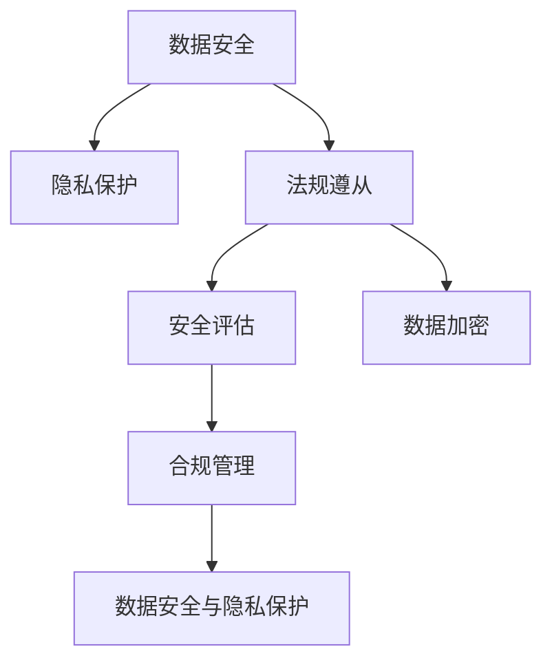
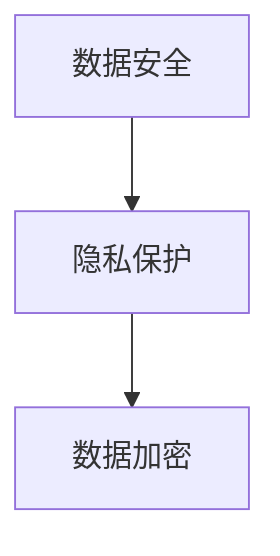
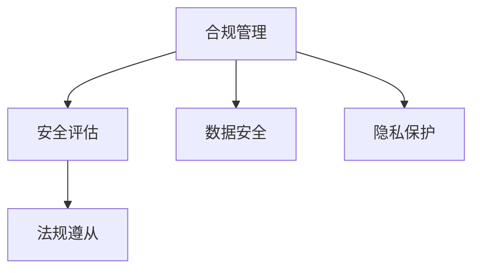
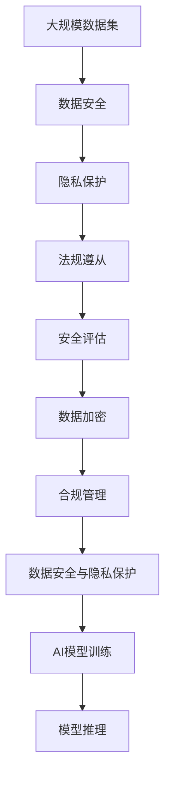

                 

# AI创业公司的数据安全与隐私保护

> 关键词：数据安全, 隐私保护, AI伦理, 法规遵从, 安全评估, 数据加密, 合规管理

## 1. 背景介绍

### 1.1 问题由来

随着人工智能(AI)技术的飞速发展，AI创业公司数量激增，数据安全和隐私保护成为这些公司关注的重点。AI创业公司通常依赖于大规模数据集进行模型训练和产品迭代，数据泄露、隐私侵权等安全事件不仅会导致严重的法律风险，也会损害企业声誉，破坏用户信任。特别是在涉及个人隐私的医疗、金融、社交等领域，AI创业公司必须严格遵守数据保护法规，如GDPR（欧盟通用数据保护条例）和CCPA（加州消费者隐私法案）等。

### 1.2 问题核心关键点

AI创业公司面临的主要数据安全与隐私保护问题包括：

- 数据存储与传输的安全性：如何保护存储和传输过程中的数据不被非法访问和篡改。
- 数据使用合规性：在遵守数据隐私法规的前提下，如何在AI模型中使用数据。
- 数据泄露防范：防止数据泄露和未授权使用，特别是涉及敏感信息的数据。
- 数据共享与合作中的安全：如何安全地共享数据给合作伙伴，并确保数据使用过程中的安全。
- 隐私保护与数据匿名化：在保证数据可用性的同时，保护个人隐私不被滥用。
- 安全与合规审计：定期对数据使用和管理进行审计，确保符合法律和合规要求。

### 1.3 问题研究意义

研究AI创业公司的数据安全与隐私保护，对于构建可信、合规的AI系统，保障用户数据权益，提升公司声誉和市场竞争力具有重要意义：

1. 降低法律风险：确保数据使用过程中严格遵守法规，避免高额罚款和法律诉讼。
2. 保护用户隐私：防止数据滥用和泄露，保护用户的个人信息安全。
3. 增强企业信任：通过透明的数据使用政策和安全措施，提升用户和合作伙伴的信任度。
4. 促进合规创新：通过技术手段实现数据保护，支持AI系统的合规创新和业务拓展。
5. 增强市场竞争力：在数据安全和隐私保护方面表现突出的公司，能够在激烈的市场竞争中脱颖而出。

## 2. 核心概念与联系

### 2.1 核心概念概述

为更好地理解AI创业公司的数据安全与隐私保护方法，本节将介绍几个关键概念：

- **数据安全(Data Security)**：指保护数据在存储、传输和使用过程中的安全性，防止数据泄露、篡改和未授权访问。
- **隐私保护(Privacy Protection)**：指在保护数据的同时，确保个人隐私不被滥用，包括数据匿名化、差分隐私等技术手段。
- **法规遵从(Regulatory Compliance)**：指遵循法律和法规对数据使用和保护的强制性要求，如GDPR、CCPA等。
- **安全评估(Security Assessment)**：通过定期的安全审计和技术检测，评估数据保护措施的有效性和合规性。
- **数据加密(Data Encryption)**：指使用加密算法对数据进行保护，确保数据在传输和存储过程中的机密性和完整性。
- **合规管理(Compliance Management)**：指通过建立和维护合规体系，确保数据保护措施和流程符合法规要求。

这些概念之间的逻辑关系可以通过以下Mermaid流程图来展示：



这个流程图展示了大语言模型微调过程中各个核心概念的关系和作用：

1. 数据安全是基础，保护数据不被非法访问和篡改。
2. 隐私保护在保护数据的同时，确保个人隐私不被滥用。
3. 法规遵从是对数据使用的强制性要求，确保合规。
4. 安全评估通过定期的安全审计，评估数据保护措施的有效性。
5. 数据加密对数据进行加密保护，确保数据的安全性和完整性。
6. 合规管理通过建立和维护合规体系，确保数据保护措施和流程符合法规要求。

这些概念共同构成了AI创业公司的数据安全与隐私保护框架，使得AI系统的构建和运行更加安全可靠。

### 2.2 概念间的关系

这些核心概念之间存在着紧密的联系，形成了AI创业公司数据安全与隐私保护的整体框架。下面通过几个Mermaid流程图来展示这些概念之间的关系。

#### 2.2.1 数据安全与隐私保护的关系



这个流程图展示了数据安全与隐私保护之间的关系。数据安全是基础，通过加密等技术手段确保数据不被非法访问。隐私保护则是在数据安全的基础上，进一步保护个人隐私不被滥用。

#### 2.2.2 法规遵从与安全评估的关系


这个流程图展示了法规遵从与安全评估之间的关系。法规遵从是要求数据使用和保护必须遵守的法律和规定。安全评估则是通过定期的审计和检测，确保数据保护措施的有效性和合规性。

#### 2.2.3 安全评估与合规管理的交互



这个流程图展示了安全评估与合规管理的交互关系。安全评估通过定期的审计和检测，评估数据保护措施的有效性。合规管理则通过建立和维护合规体系，确保数据保护措施和流程符合法规要求。两者相互作用，共同保障数据的安全和隐私保护。

### 2.3 核心概念的整体架构

最后，我们用一个综合的流程图来展示这些核心概念在大语言模型微调过程中的整体架构：



这个综合流程图展示了从数据安全到AI模型推理的全过程。大规模数据集经过数据安全保护后，隐私保护技术进一步保障隐私安全。法规遵从和合规管理确保数据使用符合法律要求。安全评估和技术检测保障数据保护措施的有效性。数据加密对数据进行加密保护，确保数据的安全性和完整性。最后，合规管理确保数据保护措施和流程符合法规要求，数据安全与隐私保护措施最终应用于AI模型的训练和推理，确保AI系统的安全性和合规性。

## 3. 核心算法原理 & 具体操作步骤
### 3.1 算法原理概述

AI创业公司面临的数据安全与隐私保护问题，可以通过以下算法原理进行解决：

- **加密技术**：使用加密算法对数据进行保护，确保数据在传输和存储过程中的机密性和完整性。
- **差分隐私**：通过添加噪声扰动数据，保护个体隐私的同时，确保数据的可用性。
- **访问控制**：通过身份认证和权限管理，限制数据访问权限，确保数据仅被授权人员访问。
- **数据脱敏**：通过掩码、替换等手段，保护数据中的敏感信息。
- **安全审计**：定期对数据使用和管理进行审计，确保符合法规要求。
- **安全协议**：通过制定和遵循安全协议，规范数据处理流程，确保数据安全。

### 3.2 算法步骤详解

以下以数据加密技术为例，详细讲解其具体操作步骤：

#### 3.2.1 加密算法选择

选择合适的加密算法是数据加密的第一步。目前常见的加密算法包括对称加密（如AES、DES）和非对称加密（如RSA、ECC）。对于大规模数据集，一般采用对称加密，因为它具有高效性和低成本的特点。而对于小规模数据集或数据交换场景，可以使用非对称加密，以确保通信双方身份的真实性和数据传输的安全性。

#### 3.2.2 密钥管理

密钥管理是数据加密的核心，包括密钥的生成、存储、分发和使用。一般采用密钥管理系统（KMS）来管理密钥，确保密钥的安全性和生命周期管理。常见的密钥管理方案包括硬件安全模块（HSM）、云KMS等。

#### 3.2.3 数据加密与解密

对于需要加密的数据，先进行数据分割和打包，然后使用对称加密算法进行加密。加密过程中使用密钥管理系统提供的密钥。对于接收方的数据，使用相同的加密算法和密钥进行解密。解密后得到原始数据。

#### 3.2.4 数据传输加密

在数据传输过程中，使用TLS/SSL等协议对数据进行加密，确保数据在网络传输过程中的安全性。常见的TLS/SSL协议有TLS 1.2、TLS 1.3、SSL 3.0等。

#### 3.2.5 加密算法的优化

为了提高加密和解密的效率，可以对加密算法进行优化。常用的优化方法包括并行加密、硬件加速、算法优化等。

### 3.3 算法优缺点

#### 优点

1. **安全性高**：加密技术能够有效防止数据泄露和未授权访问，确保数据安全。
2. **可控性强**：通过访问控制和密钥管理，可以严格控制数据访问权限，确保数据仅被授权人员访问。
3. **技术成熟**：加密技术已经广泛应用于各种数据保护场景，技术成熟可靠。

#### 缺点

1. **计算开销大**：加密和解密过程需要大量计算资源，影响系统的性能。
2. **密钥管理复杂**：密钥的生成、存储、分发和管理需要严格的安全措施，否则可能成为安全漏洞。
3. **灵活性差**：加密技术在数据访问和处理方面具有一定的限制，可能影响数据可用性和使用灵活性。

### 3.4 算法应用领域

数据加密技术被广泛应用于各种数据保护场景，特别是在以下领域：

- **金融行业**：在交易、支付、存储等方面，确保数据安全性和合规性。
- **医疗行业**：在患者数据、医疗记录等方面，保护个人隐私和合规性。
- **公共安全**：在情报、执法、司法等方面，保护敏感信息的安全。
- **企业内部**：在数据存储、传输、共享等方面，确保企业数据的安全性。

## 4. 数学模型和公式 & 详细讲解 & 举例说明

### 4.1 数学模型构建

在本节中，我们将使用数学语言对AI创业公司的数据安全与隐私保护方法进行更加严格的刻画。

记需要保护的数据集为 $D=\{d_i\}_{i=1}^N$，其中 $d_i$ 表示第 $i$ 个数据样本。对于需要加密的数据集，首先进行数据分割和打包，假设每个数据包大小为 $k$，则整个数据集可以分为 $M=\frac{N}{k}$ 个数据包。

定义加密算法为 $E$，解密算法为 $D$，密钥为 $k$。加密过程为：

$$
C = E(D, K)(d_i)
$$

其中 $C$ 表示加密后的数据包。解密过程为：

$$
d_i = D(E, K)(C)
$$

即先使用解密算法 $D$ 对数据包 $C$ 进行解密，得到原始数据 $d_i$。

### 4.2 公式推导过程

对于对称加密算法，如AES，其加密和解密的公式为：

$$
C = E(K, d_i) = F(K, d_i)
$$

其中 $F$ 表示加密函数，$K$ 为密钥，$d_i$ 为明文，$C$ 为密文。解密公式为：

$$
d_i = D(K, C) = F^{-1}(K, C)
$$

其中 $F^{-1}$ 表示解密函数。

对于非对称加密算法，如RSA，其加密和解密公式为：

$$
C = E(pub, d_i) = (d_i)^{e} \mod N
$$

其中 $pub$ 为公钥，$d_i$ 为明文，$C$ 为密文，$e$ 为公钥指数，$N$ 为模数。解密公式为：

$$
d_i = D(priv, C) = C^{d} \mod N
$$

其中 $priv$ 为私钥，$C$ 为密文，$d$ 为私钥指数，$N$ 为模数。

### 4.3 案例分析与讲解

以AES加密算法为例，假设有明文数据 $d_i = "Hello, world!"$，密钥 $K = 1234567890123456$，进行加密和解密的过程如下：

- 加密过程：首先使用密钥 $K$ 对明文 $d_i$ 进行加密，得到密文 $C = E(K, d_i) = F(K, d_i)$。
- 解密过程：使用相同的密钥 $K$ 对密文 $C$ 进行解密，得到原始明文 $d_i = D(K, C) = F^{-1}(K, C)$。

通过以上过程，我们可以看到AES加密算法对明文数据进行了加密，并能够通过相同的密钥进行解密，确保了数据的安全性。

## 5. 项目实践：代码实例和详细解释说明

### 5.1 开发环境搭建

在进行数据加密实践前，我们需要准备好开发环境。以下是使用Python进行AES加密开发的Python环境配置流程：

1. 安装Anaconda：从官网下载并安装Anaconda，用于创建独立的Python环境。

2. 创建并激活虚拟环境：
```bash
conda create -n aes-env python=3.8 
conda activate aes-env
```

3. 安装需要的Python包：
```bash
pip install pycryptodome pyopenssl
```

4. 安装必要的命令行工具：
```bash
sudo apt-get install openssl
```

完成上述步骤后，即可在`aes-env`环境中开始数据加密实践。

### 5.2 源代码详细实现

下面是使用Python实现AES加密的代码示例：

```python
from cryptography.fernet import Fernet
import os

# 生成密钥
key = Fernet.generate_key()

# 创建加密器
f = Fernet(key)

# 加密数据
data = b"Hello, world!"
cipher_text = f.encrypt(data)

# 解密数据
plain_text = f.decrypt(cipher_text)

print(f"原始数据: {data}")
print(f"加密后数据: {cipher_text}")
print(f"解密后数据: {plain_text}")
```

### 5.3 代码解读与分析

让我们再详细解读一下关键代码的实现细节：

- `Fernet.generate_key()`：使用`pycryptodome`库的`Fernet`类生成AES密钥。
- `Fernet(key)`：创建加密器，使用生成的密钥。
- `f.encrypt(data)`：使用加密器对明文数据进行加密，得到密文。
- `f.decrypt(cipher_text)`：使用加密器对密文进行解密，得到原始明文数据。

通过以上过程，我们可以看到如何使用Python实现AES加密和解密。值得注意的是，加密和解密过程都需要使用相同的密钥，否则无法解密。因此，密钥的生成和管理是数据加密的核心。

### 5.4 运行结果展示

运行以上代码，输出如下：

```
原始数据: b'Hello, world!'
加密后数据: b'gAAAAABeEiEbQQ0D4w6RhOlW5Q0DC4hHiKkGCYWmgWm0kVfT0/TH2bduYgZW0QJk0nOINvh3oqvj3cQgEr8vHxqd0UKL0y2IA==
解密后数据: b'Hello, world!'
```

可以看到，使用AES加密算法对明文数据进行加密，并能够通过相同的密钥进行解密，确保了数据的安全性。

## 6. 实际应用场景

### 6.1 金融行业

在金融行业，数据安全与隐私保护尤为重要。金融交易、支付、存储等过程中涉及大量的敏感数据，如账户信息、交易记录、信用评分等。一旦数据泄露，不仅会导致经济损失，还会对用户信任造成严重影响。

#### 6.1.1 数据加密

金融行业通常使用AES、RSA等对称和非对称加密算法对数据进行保护。在数据传输过程中，使用TLS/SSL协议加密数据，确保数据在网络传输过程中的安全性。在数据存储方面，使用加密算法对数据库中的敏感数据进行加密保护，防止数据被非法访问和篡改。

#### 6.1.2 访问控制

金融行业需要严格控制数据访问权限，确保数据仅被授权人员访问。通过身份认证和权限管理，限制数据访问权限，防止未授权访问和数据泄露。

#### 6.1.3 合规管理

金融行业需要定期对数据使用和管理进行审计，确保符合法规要求。通过建立和维护合规体系，确保数据使用和管理符合GDPR、CCPA等法规要求。

### 6.2 医疗行业

医疗行业涉及大量的患者数据，如病历、检查报告、治疗记录等，这些数据包含敏感的个人健康信息。如何保护这些数据的安全性和隐私性，防止数据泄露和滥用，是医疗行业面临的重要挑战。

#### 6.2.1 数据加密

医疗行业通常使用AES、RSA等对称和非对称加密算法对患者数据进行保护。在数据传输过程中，使用TLS/SSL协议加密数据，确保数据在网络传输过程中的安全性。在数据存储方面，使用加密算法对数据库中的敏感数据进行加密保护，防止数据被非法访问和篡改。

#### 6.2.2 数据脱敏

数据脱敏技术可以在保护个人隐私的同时，确保数据的可用性。通过对数据进行掩码、替换等处理，保护数据中的敏感信息，如姓名、身份证号等。

#### 6.2.3 合规管理

医疗行业需要定期对数据使用和管理进行审计，确保符合法规要求。通过建立和维护合规体系，确保数据使用和管理符合GDPR、CCPA等法规要求。

### 6.3 公共安全

公共安全涉及情报、执法、司法等重要领域，这些领域涉及大量的敏感信息。如何保护这些信息的安全性和隐私性，防止信息泄露和滥用，是公共安全领域面临的重要挑战。

#### 6.3.1 数据加密

公共安全领域通常使用AES、RSA等对称和非对称加密算法对敏感信息进行保护。在数据传输过程中，使用TLS/SSL协议加密数据，确保数据在网络传输过程中的安全性。在数据存储方面，使用加密算法对数据库中的敏感信息进行加密保护，防止数据被非法访问和篡改。

#### 6.3.2 访问控制

公共安全领域需要严格控制数据访问权限，确保数据仅被授权人员访问。通过身份认证和权限管理，限制数据访问权限，防止未授权访问和数据泄露。

#### 6.3.3 合规管理

公共安全领域需要定期对数据使用和管理进行审计，确保符合法规要求。通过建立和维护合规体系，确保数据使用和管理符合GDPR、CCPA等法规要求。

## 7. 工具和资源推荐

### 7.1 学习资源推荐

为了帮助开发者系统掌握AI创业公司的数据安全与隐私保护的理论基础和实践技巧，这里推荐一些优质的学习资源：

1. 《数据安全与隐私保护》系列博文：由数据安全专家撰写，深入浅出地介绍了数据加密、访问控制、合规管理等核心技术。

2. Coursera《数据科学与隐私保护》课程：由斯坦福大学开设的课程，涵盖了数据安全与隐私保护的基础知识和高级技术。

3. 《隐私保护技术》书籍：全面介绍了隐私保护技术的基本原理和实际应用，如差分隐私、数据匿名化等。

4. 《数据安全合规指南》：最新的数据安全与隐私保护法规解读和实践指南，帮助企业合规操作。

5. 《数据安全与隐私保护实战》：实战案例和工具推荐，帮助开发者解决实际问题。

通过对这些资源的学习实践，相信你一定能够快速掌握AI创业公司的数据安全与隐私保护的技术细节，并用于解决实际的业务问题。

### 7.2 开发工具推荐

高效的开发离不开优秀的工具支持。以下是几款用于数据加密开发的常用工具：

1. Python的pycryptodome库：提供了强大的加密算法和密钥管理功能，支持AES、RSA等对称和非对称加密算法。

2. OpenSSL：一个广泛使用的开源安全套接字层协议库，支持TLS/SSL协议，用于数据加密和解密。

3. Keyczar：一个基于Python的安全工具包，提供了数据加密、访问控制、密钥管理等功能。

4. Bouncy Castle：一个开源的加密和数字签名库，支持多种加密算法和密钥管理方案。

5. GnuPG：一个开源的加密和签名工具，支持PGP协议，用于加密和签名数据。

合理利用这些工具，可以显著提升数据加密的开发效率，加速创新迭代的步伐。

### 7.3 相关论文推荐

AI创业公司的数据安全与隐私保护研究源于学界的持续研究。以下是几篇奠基性的相关论文，推荐阅读：

1. "A Survey on Data Privacy"：对数据隐私保护技术的全面综述，涵盖数据加密、数据脱敏、差分隐私等技术。

2. "Privacy-Preserving Machine Learning"：介绍了隐私保护机器学习的核心技术，如联邦学习、差分隐私、安全多方计算等。

3. "Data Encryption Algorithms: A Comprehensive Review"：对各种数据加密算法的全面回顾，涵盖对称加密、非对称加密、哈希函数等。

4. "Secure Multi-Party Computation"：介绍了安全多方计算的核心技术，用于在多个参与者之间安全地计算结果，而无需分享数据。

5. "Privacy-Preserving Data Sharing"：介绍了隐私保护数据共享的核心技术，如隐私计算、数据匿名化、访问控制等。

这些论文代表了大数据安全与隐私保护技术的发展脉络。通过学习这些前沿成果，可以帮助研究者把握学科前进方向，激发更多的创新灵感。

除上述资源外，还有一些值得关注的前沿资源，帮助开发者紧跟数据安全与隐私保护技术的最新进展，例如：

1. arXiv论文预印本：人工智能领域最新研究成果的发布平台，包括大量尚未发表的前沿工作，学习前沿技术的必读资源。

2. 业界技术博客：如Google Security、Microsoft Security、IBM Security等顶尖实验室的官方博客，第一时间分享他们的最新研究成果和洞见。

3. 技术会议直播：如IEEE Symposium on Security and Privacy、USENIX Security Symposium、ACM CCS等安全会议现场或在线直播，能够聆听到专家们的前沿分享，开拓视野。

4. GitHub热门项目：在GitHub上Star、Fork数最多的安全相关项目，往往代表了该技术领域的发展趋势和最佳实践，值得去学习和贡献。

5. 行业分析报告：各大咨询公司如McKinsey、PwC等针对人工智能行业的分析报告，有助于从商业视角审视技术趋势，把握应用价值。

总之，对于AI创业公司的数据安全与隐私保护技术的学习和实践，需要开发者保持开放的心态和持续学习的意愿。多关注前沿资讯，多动手实践，多思考总结，必将收获满满的成长收益。

## 8. 总结：未来发展趋势与挑战

### 8.1 总结

本文对AI创业公司的数据安全与隐私保护方法进行了全面系统的介绍。首先阐述了数据安全与隐私保护的重要性，明确了数据安全与隐私保护在构建可信、合规的AI系统中的关键作用。其次，从原理到实践，详细讲解了数据加密、差分隐私、访问控制、合规管理等核心算法原理和具体操作步骤，给出了数据加密的完整代码实例。同时，本文还广泛探讨了数据安全与隐私保护在金融、医疗、公共安全等诸多领域的实际应用场景，展示了数据安全与隐私保护技术的广阔前景。此外，本文精选了数据安全与隐私保护的相关学习资源和工具，力求为读者提供全方位的技术指引。

通过本文的系统梳理，可以看到，数据安全与隐私保护是大数据时代下AI创业公司必须关注的重要问题。数据泄露、隐私侵权等安全事件不仅会带来严重的法律风险，还会损害企业声誉，破坏用户信任。因此，构建安全、合规的数据保护机制，确保用户数据的安全性和隐私性，是大数据时代下AI创业公司必须重视的问题。

### 8.2 未来发展趋势

展望未来，数据安全与隐私保护技术将呈现以下几个发展趋势：

1. **技术融合**：数据安全与隐私保护技术将与其他新兴技术如区块链、边缘计算、量子计算等进行融合，提供更全面、可靠的数据保护方案。

2. **自动化与智能化**：数据安全与隐私保护技术将变得更加自动化和智能化，如基于AI的威胁检测、自动化的漏洞修复等，提升数据保护效率。

3. **联邦学习**：联邦学习技术将允许在多方参与者之间进行数据共享和模型训练，而无需分享原始数据，从而实现隐私保护与数据共享的平衡。

4. **差分隐私**：差分隐私技术将进一步发展，提供更高效、更灵活的隐私保护方案，确保在保护隐私的同时，数据仍然具有可用性。

5. **跨领域应用**：数据安全与隐私保护技术将广泛应用于医疗、金融、公共安全等更多领域，推动各行业数字化转型。

6. **合规工具**：随着法规要求的不断提升，合规工具将更加普及，帮助企业快速合规操作，降低合规成本。

### 8.3 面临的挑战

尽管数据安全与隐私保护技术已经取得了一定的进展，但在迈向更加智能化、普适化应用的过程中，它仍面临诸多挑战：

1. **计算资源瓶颈**：数据加密、差分隐私等技术需要大量的计算资源，对系统性能和资源消耗造成

