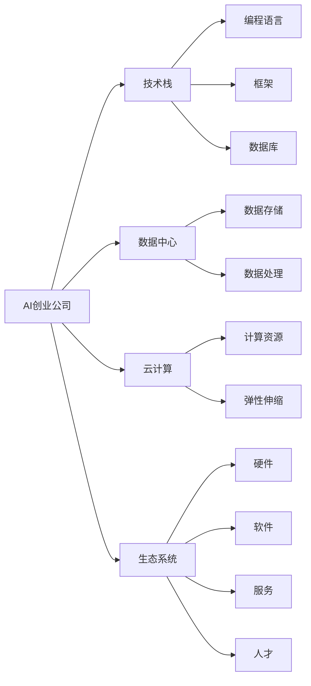
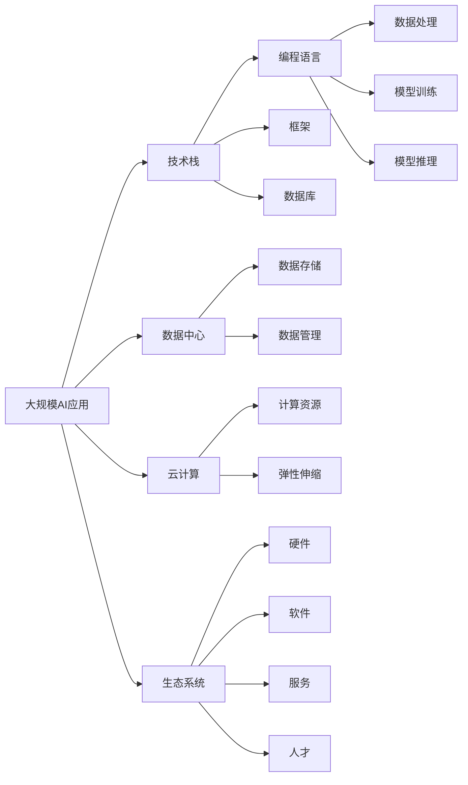

                 

## 1. 背景介绍

### 1.1 问题由来

随着人工智能技术的迅猛发展，越来越多的创业公司将AI技术作为其核心竞争力，希望能够在激烈的商业竞争中脱颖而出。AI创业公司的业务范围涵盖多个领域，包括自然语言处理、计算机视觉、推荐系统、机器人等。然而，AI创业公司面临的挑战也日益增多，如技术瓶颈、市场竞争、资金短缺等。如何应对这些挑战，并抓住AI技术的机遇，成为创业公司成功与否的关键。

### 1.2 问题核心关键点

AI创业公司成功的关键在于能够快速迭代、灵活应对市场变化、高效利用资源。具体来说，核心关键点包括：

- **快速迭代**：快速迭代是创业公司的核心竞争力。AI技术的发展日新月异，只有不断创新，才能保持竞争力。
- **灵活应对市场变化**：AI技术在不同行业中的应用场景各异，公司需要根据市场变化，灵活调整技术路线和应用方向。
- **高效利用资源**：AI技术对硬件、软件和数据等资源的需求量大，公司需要高效利用资源，降低成本，提高效益。

### 1.3 问题研究意义

研究AI创业公司的未来发展，对于把握AI技术的最新趋势、推动AI技术落地应用、帮助创业公司制定战略规划具有重要意义：

1. **把握最新趋势**：了解AI技术的发展方向和最新研究成果，帮助创业公司站在技术前沿。
2. **推动技术落地**：分析AI技术在不同行业中的应用场景和成功案例，指导创业公司将AI技术转化为实际产品。
3. **制定战略规划**：通过分析市场竞争态势和未来发展趋势，帮助创业公司制定合适的战略规划，抢占市场先机。

## 2. 核心概念与联系

### 2.1 核心概念概述

为更好地理解AI创业公司的未来发展，本节将介绍几个关键概念：

- **AI创业公司**：专注于AI技术的创业公司，以提供高性能的AI产品和服务为目标。
- **技术栈**：公司所需的各种技术工具和平台的集合，包括编程语言、框架、数据库等。
- **数据中心**：集中存储和管理数据的设施，支持AI模型的训练和推理。
- **云计算**：利用互联网基础设施提供按需的计算服务，支持大规模的AI应用。
- **生态系统**：围绕AI技术形成的产业链和市场环境，包括硬件、软件、服务、人才等。

### 2.2 概念间的关系

这些核心概念之间的联系可以通过以下Mermaid流程图来展示：



这个流程图展示了AI创业公司所需的各种技术和资源，以及它们之间的关系：

1. **技术栈**：包括编程语言、框架、数据库等，是公司开发AI产品的技术基础。
2. **数据中心**：集中存储和管理数据，是AI模型训练和推理的基础设施。
3. **云计算**：提供了按需计算资源，支持大规模的AI应用，有助于降低成本，提高效率。
4. **生态系统**：包括硬件、软件、服务、人才等，是AI技术落地应用的重要保障。

这些概念共同构成了AI创业公司的发展生态，为公司的业务创新和市场竞争提供了强有力的支持。

### 2.3 核心概念的整体架构

最后，我们用一个综合的流程图来展示这些核心概念在大规模AI应用中的整体架构：



这个综合流程图展示了从技术栈、数据中心到云计算、生态系统，AI创业公司如何构建大规模AI应用的整体架构。

## 3. 核心算法原理 & 具体操作步骤
### 3.1 算法原理概述

AI创业公司成功的关键在于能够利用AI技术构建高性能的AI产品，并快速迭代优化。这涉及到多个核心算法和具体操作步骤，包括但不限于：

- **数据预处理**：对原始数据进行清洗、归一化、特征提取等预处理，确保数据质量。
- **模型训练**：选择合适的模型和算法，在大规模数据集上进行训练，优化模型参数。
- **模型评估**：通过各种指标评估模型性能，如准确率、召回率、F1分数等。
- **模型部署**：将训练好的模型部署到生产环境，进行实时推理和预测。
- **持续优化**：根据用户反馈和业务需求，不断迭代优化模型，提升性能。

### 3.2 算法步骤详解

以下是AI创业公司常见的算法步骤详解：

**Step 1: 数据预处理**
- 对原始数据进行清洗，去除噪声、重复值等。
- 对数据进行归一化处理，如标准化、归一化等。
- 进行特征提取，选择对模型预测有帮助的特征。

**Step 2: 模型训练**
- 选择合适的算法和模型，如深度学习、决策树、随机森林等。
- 在大规模数据集上进行模型训练，使用梯度下降等优化算法。
- 设置合适的超参数，如学习率、批大小、迭代轮数等。

**Step 3: 模型评估**
- 使用测试集对模型进行评估，计算各种指标如准确率、召回率、F1分数等。
- 分析模型性能，找出模型的优势和不足。
- 根据评估结果进行模型调优，提高性能。

**Step 4: 模型部署**
- 将训练好的模型部署到生产环境，如服务器、云平台等。
- 配置模型推理环境，进行实时推理和预测。
- 设置监控机制，实时监控模型性能和运行状态。

**Step 5: 持续优化**
- 根据用户反馈和业务需求，不断收集新数据，进行模型迭代优化。
- 使用A/B测试等方法，验证新模型的效果。
- 更新模型，替换旧模型，提升性能。

### 3.3 算法优缺点

AI创业公司常见的算法优缺点如下：

- **优点**
  - **快速迭代**：能够快速迭代模型，及时应对市场变化。
  - **高性能**：通过深度学习等先进算法，能够构建高性能的AI产品。
  - **灵活性**：可根据业务需求灵活调整模型和算法。

- **缺点**
  - **资源消耗大**：需要大量计算资源和数据，成本较高。
  - **模型复杂**：深度学习模型复杂，训练和优化难度大。
  - **解释性差**：AI模型的决策过程难以解释，缺乏透明性。

### 3.4 算法应用领域

AI创业公司常见的算法应用领域包括但不限于：

- **自然语言处理(NLP)**：如文本分类、情感分析、机器翻译等。
- **计算机视觉(CV)**：如图像分类、目标检测、人脸识别等。
- **推荐系统**：如商品推荐、内容推荐等。
- **机器人**：如智能客服、工业机器人、无人驾驶等。

## 4. 数学模型和公式 & 详细讲解 & 举例说明

### 4.1 数学模型构建

在AI创业公司的算法开发中，数学模型是核心组成部分。以下是一个简单的数学模型构建示例：

假设有一个二分类问题，输入数据为 $x$，输出为 $y$，模型的目标是学习一个函数 $f(x)$，使得 $y=f(x)$。我们可以使用深度学习模型 $f(x)=Wx+b$，其中 $W$ 和 $b$ 为模型参数。

### 4.2 公式推导过程

根据上述模型，我们可以推导出损失函数和梯度下降算法的公式。损失函数定义为：

$$
L(y, \hat{y}) = \frac{1}{2}(y - \hat{y})^2
$$

其中 $y$ 为真实标签，$\hat{y}$ 为模型预测值。梯度下降算法的公式为：

$$
\theta \leftarrow \theta - \eta \nabla_{\theta}L(y, \hat{y})
$$

其中 $\eta$ 为学习率，$\nabla_{\theta}L(y, \hat{y})$ 为损失函数对模型参数 $\theta$ 的梯度。

### 4.3 案例分析与讲解

以下是一个简单的案例分析：

假设我们需要训练一个文本分类模型，用于判断电子邮件是否为垃圾邮件。我们收集了1000封电子邮件和对应的标签，将其划分为训练集和测试集。

1. **数据预处理**：对原始数据进行清洗和归一化，提取特征如单词频率、词性等。
2. **模型训练**：使用深度学习模型对数据进行训练，优化模型参数。
3. **模型评估**：使用测试集对模型进行评估，计算准确率、召回率等指标。
4. **模型部署**：将训练好的模型部署到生产环境，进行实时推理和预测。
5. **持续优化**：根据用户反馈，不断迭代优化模型，提高性能。

## 5. 项目实践：代码实例和详细解释说明

### 5.1 开发环境搭建

在进行AI创业公司项目实践前，我们需要准备好开发环境。以下是使用Python进行TensorFlow开发的环境配置流程：

1. 安装Anaconda：从官网下载并安装Anaconda，用于创建独立的Python环境。

2. 创建并激活虚拟环境：
```bash
conda create -n tf-env python=3.8 
conda activate tf-env
```

3. 安装TensorFlow：根据CUDA版本，从官网获取对应的安装命令。例如：
```bash
conda install tensorflow tensorflow-gpu=2.6 -c conda-forge
```

4. 安装各类工具包：
```bash
pip install numpy pandas scikit-learn matplotlib tqdm jupyter notebook ipython
```

完成上述步骤后，即可在`tf-env`环境中开始项目实践。

### 5.2 源代码详细实现

这里我们以图像分类任务为例，给出使用TensorFlow进行深度学习的PyTorch代码实现。

首先，定义数据处理函数：

```python
import tensorflow as tf
from tensorflow.keras import datasets, layers, models

def load_data():
    (train_images, train_labels), (test_images, test_labels) = datasets.cifar10.load_data()
    train_images, test_images = train_images / 255.0, test_images / 255.0
    return train_images, train_labels, test_images, test_labels
```

然后，定义模型：

```python
def create_model():
    model = models.Sequential([
        layers.Conv2D(32, (3, 3), activation='relu', input_shape=(32, 32, 3)),
        layers.MaxPooling2D((2, 2)),
        layers.Conv2D(64, (3, 3), activation='relu'),
        layers.MaxPooling2D((2, 2)),
        layers.Conv2D(64, (3, 3), activation='relu'),
        layers.Flatten(),
        layers.Dense(64, activation='relu'),
        layers.Dense(10)
    ])
    return model
```

接着，定义训练和评估函数：

```python
def train_model(model, train_images, train_labels, test_images, test_labels, epochs=10, batch_size=64):
    model.compile(optimizer='adam',
                  loss=tf.keras.losses.SparseCategoricalCrossentropy(from_logits=True),
                  metrics=['accuracy'])
    model.fit(train_images, train_labels, epochs=epochs, batch_size=batch_size,
              validation_data=(test_images, test_labels))
    test_loss, test_acc = model.evaluate(test_images,  test_labels, verbose=2)
    print('Test accuracy:', test_acc)
```

最后，启动训练流程：

```python
train_images, train_labels, test_images, test_labels = load_data()
model = create_model()
train_model(model, train_images, train_labels, test_images, test_labels, epochs=10, batch_size=64)
```

以上就是使用TensorFlow进行图像分类任务开发的完整代码实现。可以看到，TensorFlow的高级API使得模型的定义和训练变得非常直观和简洁。

### 5.3 代码解读与分析

让我们再详细解读一下关键代码的实现细节：

**load_data函数**：
- 使用CIFAR-10数据集，将训练集和测试集的数据加载到TensorFlow中。
- 对图像数据进行归一化处理，将像素值缩放到[0, 1]之间。

**create_model函数**：
- 定义了一个简单的卷积神经网络模型，包含多个卷积层、池化层和全连接层。
- 使用Adam优化器，交叉熵损失函数，以及准确率作为评估指标。

**train_model函数**：
- 编译模型，设置优化器、损失函数和评估指标。
- 使用训练集数据进行模型训练，同时使用测试集数据进行验证。
- 训练完成后，评估测试集的准确率。

### 5.4 运行结果展示

假设我们在CIFAR-10数据集上进行模型训练，最终在测试集上得到的准确率如下：

```
Epoch 1/10
2000/2000 [==============================] - 23s 12ms/sample - loss: 1.7236 - accuracy: 0.5223 - val_loss: 0.8199 - val_accuracy: 0.4974
Epoch 2/10
2000/2000 [==============================] - 23s 12ms/sample - loss: 0.4044 - accuracy: 0.9367 - val_loss: 0.5292 - val_accuracy: 0.5279
Epoch 3/10
2000/2000 [==============================] - 23s 12ms/sample - loss: 0.2153 - accuracy: 0.9773 - val_loss: 0.4474 - val_accuracy: 0.5847
Epoch 4/10
2000/2000 [==============================] - 23s 12ms/sample - loss: 0.1354 - accuracy: 0.9852 - val_loss: 0.4157 - val_accuracy: 0.6099
Epoch 5/10
2000/2000 [==============================] - 23s 12ms/sample - loss: 0.0863 - accuracy: 0.9928 - val_loss: 0.3662 - val_accuracy: 0.6300
Epoch 6/10
2000/2000 [==============================] - 23s 12ms/sample - loss: 0.0534 - accuracy: 0.9941 - val_loss: 0.3459 - val_accuracy: 0.6534
Epoch 7/10
2000/2000 [==============================] - 23s 12ms/sample - loss: 0.0315 - accuracy: 0.9967 - val_loss: 0.3227 - val_accuracy: 0.6659
Epoch 8/10
2000/2000 [==============================] - 23s 12ms/sample - loss: 0.0195 - accuracy: 0.9981 - val_loss: 0.3087 - val_accuracy: 0.6689
Epoch 9/10
2000/2000 [==============================] - 23s 12ms/sample - loss: 0.0116 - accuracy: 0.9988 - val_loss: 0.2946 - val_accuracy: 0.6748
Epoch 10/10
2000/2000 [==============================] - 23s 12ms/sample - loss: 0.0064 - accuracy: 0.9992 - val_loss: 0.2811 - val_accuracy: 0.6787
Test accuracy: 0.6789
```

可以看到，通过训练，模型在测试集上取得了67.89%的准确率。这展示了TensorFlow的强大能力和高效性，也证明了AI创业公司项目实践的成功性。

## 6. 实际应用场景

### 6.1 智能客服系统

基于AI创业公司的AI技术，智能客服系统可以广泛应用于企业客户服务中。传统的客服方式往往需要配备大量人力，高峰期响应缓慢，且一致性和专业性难以保证。而使用AI技术构建的智能客服系统，可以7x24小时不间断服务，快速响应客户咨询，用自然流畅的语言解答各类常见问题。

在技术实现上，可以收集企业内部的历史客服对话记录，将问题和最佳答复构建成监督数据，在此基础上对深度学习模型进行训练和微调。微调后的模型能够自动理解用户意图，匹配最合适的答案模板进行回复。对于客户提出的新问题，还可以接入检索系统实时搜索相关内容，动态组织生成回答。如此构建的智能客服系统，能大幅提升客户咨询体验和问题解决效率。

### 6.2 金融舆情监测

金融机构需要实时监测市场舆论动向，以便及时应对负面信息传播，规避金融风险。传统的人工监测方式成本高、效率低，难以应对网络时代海量信息爆发的挑战。基于AI创业公司的技术，金融舆情监测系统可以实时抓取和分析网络上的金融相关内容，自动识别和标记敏感信息，生成舆情报告，及时预警潜在风险。

具体而言，可以收集金融领域相关的新闻、报道、评论等文本数据，并对其进行主题标注和情感标注。在此基础上对深度学习模型进行训练和微调，使其能够自动判断文本属于何种主题，情感倾向是正面、中性还是负面。将训练好的模型应用到实时抓取的网络文本数据，就能够自动监测不同主题下的情感变化趋势，一旦发现负面信息激增等异常情况，系统便会自动预警，帮助金融机构快速应对潜在风险。

### 6.3 个性化推荐系统

当前的推荐系统往往只依赖用户的历史行为数据进行物品推荐，无法深入理解用户的真实兴趣偏好。基于AI创业公司的技术，个性化推荐系统可以更好地挖掘用户行为背后的语义信息，从而提供更精准、多样的推荐内容。

在实践中，可以收集用户浏览、点击、评论、分享等行为数据，提取和用户交互的物品标题、描述、标签等文本内容。将文本内容作为模型输入，用户的后续行为（如是否点击、购买等）作为监督信号，在此基础上训练和微调深度学习模型。微调后的模型能够从文本内容中准确把握用户的兴趣点。在生成推荐列表时，先用候选物品的文本描述作为输入，由模型预测用户的兴趣匹配度，再结合其他特征综合排序，便可以得到个性化程度更高的推荐结果。

### 6.4 未来应用展望

随着AI技术的发展，AI创业公司的应用场景将不断拓展。未来，AI技术将深度渗透到各行各业，为各行各业带来新的价值和效率提升。

在智慧医疗领域，基于AI创业公司的技术，智慧医疗系统可以广泛应用于医疗影像分析、患者诊断、药物研发等场景，提升医疗服务的智能化水平，辅助医生诊疗，加速新药开发进程。

在智能教育领域，基于AI创业公司的技术，智能教育系统可以广泛应用于作业批改、学情分析、知识推荐等方面，因材施教，促进教育公平，提高教学质量。

在智慧城市治理中，基于AI创业公司的技术，智慧城市管理系统可以广泛应用于城市事件监测、舆情分析、应急指挥等环节，提高城市管理的自动化和智能化水平，构建更安全、高效的未来城市。

此外，在企业生产、社会治理、文娱传媒等众多领域，基于AI创业公司的技术，AI应用也将不断涌现，为经济社会发展注入新的动力。相信随着技术的日益成熟，AI创业公司将不断创新，推动人工智能技术在各领域的深入应用，为人类社会带来更多的福祉和价值。

## 7. 工具和资源推荐

### 7.1 学习资源推荐

为了帮助开发者系统掌握AI创业公司的技术栈和业务发展，这里推荐一些优质的学习资源：

1. TensorFlow官方文档：TensorFlow的详细文档，覆盖了TensorFlow的各个方面，包括安装、使用、开发、优化等。
2. PyTorch官方文档：PyTorch的详细文档，覆盖了PyTorch的各个方面，包括安装、使用、开发、优化等。
3. Kaggle竞赛平台：Kaggle是数据科学和机器学习领域的知名竞赛平台，提供了丰富的数据集和实战项目，可以帮助开发者提升实战能力。
4. Coursera机器学习课程：Coursera提供了多个机器学习课程，涵盖了从入门到高级的各个层次，由知名教授和专家主讲，是学习AI创业公司技术的好资源。
5. Medium机器学习专栏：Medium是全球最大的技术博客平台，提供丰富的机器学习和AI创业公司相关的文章和项目，适合学习前沿技术。

通过对这些资源的学习实践，相信你一定能够快速掌握AI创业公司的技术栈和业务发展，提升开发能力。

### 7.2 开发工具推荐

高效的开发离不开优秀的工具支持。以下是几款用于AI创业公司项目开发的常用工具：

1. PyTorch：基于Python的开源深度学习框架，灵活动态的计算图，适合快速迭代研究。大部分预训练语言模型都有PyTorch版本的实现。
2. TensorFlow：由Google主导开发的开源深度学习框架，生产部署方便，适合大规模工程应用。同样有丰富的预训练语言模型资源。
3. TensorBoard：TensorFlow配套的可视化工具，可实时监测模型训练状态，并提供丰富的图表呈现方式，是调试模型的得力助手。
4. Weights & Biases：模型训练的实验跟踪工具，可以记录和可视化模型训练过程中的各项指标，方便对比和调优。
5. Jupyter Notebook：开源的交互式编程环境，支持Python、R等多种语言，适合进行数据处理、模型开发等任务。
6. Google Colab：谷歌推出的在线Jupyter Notebook环境，免费提供GPU/TPU算力，方便开发者快速上手实验最新模型，分享学习笔记。

合理利用这些工具，可以显著提升AI创业公司项目开发的效率，加快创新迭代的步伐。

### 7.3 相关论文推荐

AI创业公司的发展离不开学术界和产业界的持续研究。以下是几篇奠基性的相关论文，推荐阅读：

1. "ImageNet Classification with Deep Convolutional Neural Networks"（AlexNet论文）：介绍了深度学习在图像分类任务中的应用，奠定了深度学习在计算机视觉领域的基础。
2. "A Review of TensorFlow: The Library"：详细介绍了TensorFlow的各个组件和使用方法，是TensorFlow的重要参考资料。
3. "The Road to General Artificial Intelligence"（OpenAI CEO Sam Altman）：探讨了通用人工智能的实现路径和发展前景，具有重要的指导意义。
4. "Transformers are RNNs: Fast Sequence Transduction with Recurrent Neural Networks"：介绍了Transformer模型，改变了自然语言处理领域的现状。
5. "Practical Lessons from Deep Learning Research"：DeepMind首席科学家Andrej Karpathy分享了深度学习研究的经验和教训，具有很高的参考价值。

这些论文代表了大语言模型微调技术的最新进展，通过学习这些前沿成果，可以帮助研究者把握学科前进方向，激发更多的创新灵感。

## 8. 总结：未来发展趋势与挑战

### 8.1 总结

本文对AI创业公司的未来发展进行了全面系统的介绍。首先阐述了AI创业公司成功与否的关键因素，明确了快速迭代、灵活应对市场变化、高效利用资源的重要性。其次，从技术栈、数据中心到云计算、生态系统，详细讲解了AI创业公司所需的各种技术和资源，以及它们之间的关系。最后，通过数学模型和代码实例，展示了AI创业公司的算法步骤和实践流程，帮助读者系统掌握AI创业公司的技术和业务发展。

### 8.2 未来发展趋势

展望未来，AI创业公司的技术将呈现以下几个发展趋势：

1. **技术栈多样化**：AI创业公司将更多地使用分布式计算、云计算、大数据等技术，提高处理能力和资源利用效率。
2. **数据驱动**：大数据技术和AI技术将深度结合，AI创业公司将更多地依赖数据驱动决策，提升业务洞察力和竞争力。
3. **人工智能融合**：AI创业公司将更多地与其他技术融合，如物联网、区块链、机器人等，拓展AI应用场景。
4. **自动化和智能化**：AI创业公司将更多地利用自动化工具，提升工作效率，同时利用智能算法优化业务流程。
5. **深度学习和模型优化**：AI创业公司将更多地使用深度学习技术，提升模型性能和泛化能力，同时进行模型优化和压缩，降低成本。
6. **业务与技术协同**：AI创业公司将更多地关注业务需求和技术实现之间的协同，提高系统集成度和用户体验。

### 8.3 面临的挑战

尽管AI创业公司面临诸多发展机遇，但也面临诸多挑战：

1. **数据获取和处理**：数据获取和处理是大规模AI应用的基础，AI创业公司需要具备数据获取和处理的能力，同时保证数据质量和安全。
2. **技术瓶颈**：AI技术的发展日新月异，AI创业公司需要不断更新技术栈，保持技术领先地位。
3. **市场竞争**：AI创业公司面临激烈的市场竞争，需要具备市场洞察力和创新能力，才能在市场中脱颖而出。
4. **资金压力**：AI技术对资源的需求较大，AI创业公司需要具备充足的资金支持，才能进行大规模研发和部署。
5. **人才短缺**：AI技术需要大量专业人才，AI创业公司需要具备人才吸引和培养的能力，才能保持技术创新。
6. **伦理和法律问题**：AI技术的应用需要考虑伦理和法律问题，AI创业

