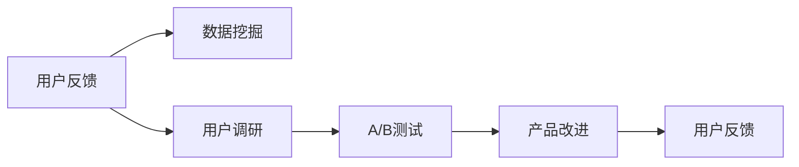
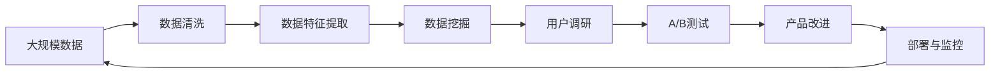

                 

# AI创业公司的用户反馈分析与产品改进：数据挖掘、用户调研与A/B测试

> 关键词：用户反馈分析, 数据挖掘, 用户调研, A/B测试, 产品改进, AI创业公司

## 1. 背景介绍

### 1.1 问题由来

在快速发展的AI创业公司中，用户反馈分析是至关重要的环节。它不仅帮助产品团队了解用户的真实需求和痛点，还能指导产品的优化改进，提高用户体验和产品满意度。传统的用户反馈分析方法通常依赖于问卷调查、用户访谈等手段，但由于成本高、效率低，难以覆盖大量用户，且存在数据偏差和样本选择的局限性。

随着技术的进步，AI和大数据技术为产品改进提供了新的视角和方法。通过对用户反馈的数据挖掘、用户调研和A/B测试等手段，可以更全面、精准地分析和理解用户需求，进而指导产品的迭代优化，提升用户满意度和产品竞争力。

### 1.2 问题核心关键点

AI创业公司进行用户反馈分析的核心在于：
1. **数据挖掘**：利用机器学习和大数据技术，从海量的用户行为数据中提取有价值的信息，发现用户的潜在需求和问题。
2. **用户调研**：通过问卷调查、访谈等方式，直接与用户沟通，收集一手数据，了解用户的真实需求和反馈。
3. **A/B测试**：设计多种产品原型，通过随机分组实验，评估不同方案的用户接受度和效果，指导产品的优化决策。

这些方法结合使用，能够系统性地分析用户反馈，提供科学依据，指导产品的持续改进。

### 1.3 问题研究意义

对AI创业公司而言，用户反馈分析不仅是产品优化和用户体验提升的利器，也是企业数据驱动决策的基础。通过深入分析用户反馈，可以：
1. **降低产品风险**：及时发现和修复产品问题，减少用户流失率。
2. **提升用户满意度**：精准理解用户需求，提供更符合预期的产品功能和服务。
3. **加速产品迭代**：基于数据驱动的决策，加速产品迭代周期，缩短市场反馈到产品改进的链路。
4. **保持竞争优势**：通过持续改进，保持产品在市场中的领先地位，满足用户日益增长的需求。
5. **创造商业价值**：利用用户反馈进行精准营销和个性化推荐，提高用户粘性和消费转化率。

因此，用户反馈分析在AI创业公司的产品改进和商业化过程中，扮演着不可替代的角色。

## 2. 核心概念与联系

### 2.1 核心概念概述

为更好地理解数据挖掘、用户调研和A/B测试在用户反馈分析中的作用和联系，本节将介绍几个关键概念：

- **用户反馈分析**：指通过收集和分析用户的行为数据、评论、评分等反馈信息，了解用户对产品的看法和需求，指导产品的改进和优化。
- **数据挖掘**：利用机器学习和统计分析技术，从大规模数据中提取有价值的信息和模式，辅助决策。
- **用户调研**：通过问卷调查、访谈等方式，直接向用户收集定性和定量反馈信息，了解用户的真实需求和满意度。
- **A/B测试**：在控制变量的情况下，通过对比不同产品版本的表现，评估不同方案的效果，指导产品的优化。

这些概念之间存在紧密的联系，共同构成了AI创业公司用户反馈分析的完整体系。

### 2.2 概念间的关系

这些核心概念之间的关系可以通过以下Mermaid流程图来展示：



这个流程图展示了用户反馈分析的一般流程：
1. 通过数据挖掘分析用户行为，获取有价值的信息。
2. 直接向用户进行调研，收集定性和定量反馈。
3. 设计A/B测试，评估不同方案的效果。
4. 基于分析结果，进行产品改进。
5. 再次收集用户反馈，形成闭环。

这些步骤相互依存、相互促进，共同推动产品的持续优化和改进。

### 2.3 核心概念的整体架构

最后，我们用一个综合的流程图来展示这些概念在大规模数据处理和产品优化中的整体架构：



这个综合流程图展示了从数据处理到产品改进的完整流程。大规模数据通过清洗和特征提取后，进入数据挖掘和用户调研环节，通过A/B测试评估效果，最终进行产品改进并部署上线，形成闭环。

## 3. 核心算法原理 & 具体操作步骤
### 3.1 算法原理概述

基于数据挖掘、用户调研和A/B测试的用户反馈分析，本质上是一种基于数据的决策支持系统。其核心原理是通过数据挖掘和大数据分析，提取用户行为的规律和特征，结合用户调研得到的定性信息，进行综合分析，从而指导产品的优化决策。

形式化地，设用户反馈数据集为 $D=\{(x_i, y_i)\}_{i=1}^N$，其中 $x_i$ 为输入数据（如用户行为记录、评分等），$y_i$ 为输出数据（如用户满意度、用户需求等）。数据挖掘的目标是找到一个函数 $f$，使得 $y=f(x)$ 在数据集 $D$ 上具有较好的拟合效果。

具体来说，数据挖掘和用户调研可以提供丰富的输入数据，而A/B测试则可以设计多个输出变量 $y_i$，进行效果评估和方案选择。结合三者的优势，可以得到更全面、准确的产品优化策略。

### 3.2 算法步骤详解

基于数据挖掘、用户调研和A/B测试的用户反馈分析，一般包括以下几个关键步骤：

**Step 1: 数据收集与预处理**
- 收集用户行为数据、评分、评论、访谈记录等反馈信息。
- 对数据进行清洗和预处理，包括去除噪音、处理缺失值等。

**Step 2: 数据特征提取**
- 利用机器学习技术，从数据中提取有意义的特征，如用户活跃度、满意度、行为路径等。
- 设计合理的特征工程，以提高数据挖掘和A/B测试的效果。

**Step 3: 数据挖掘分析**
- 利用分类、聚类、回归等算法，对用户行为数据进行建模，发现用户行为规律和潜在需求。
- 结合用户调研结果，进行更深入的分析。

**Step 4: 用户调研**
- 设计问卷、访谈等调查方式，收集用户的定性和定量反馈信息。
- 通过统计分析，了解用户的真实需求和满意度。

**Step 5: A/B测试设计**
- 设计多种产品原型或功能方案，进行分组随机实验。
- 收集用户反馈，评估不同方案的效果。

**Step 6: 产品改进**
- 基于数据挖掘和用户调研结果，进行产品功能和界面优化。
- 结合A/B测试结果，选择最优方案进行部署。

**Step 7: 部署与监控**
- 将改进后的产品部署上线，并持续监控用户反馈。
- 根据新数据不断优化产品，形成闭环。

### 3.3 算法优缺点

数据挖掘、用户调研和A/B测试在用户反馈分析中各有优劣：

**优点**：
1. **数据挖掘**：能够处理大规模数据，提取有价值的模式和规律，避免样本选择偏差。
2. **用户调研**：直接了解用户的真实需求和满意度，提供定性信息。
3. **A/B测试**：设计多个方案进行对比，评估效果，指导决策。

**缺点**：
1. **数据挖掘**：可能存在过拟合问题，模型解释性不足。
2. **用户调研**：成本高、效率低，样本选择可能存在偏差。
3. **A/B测试**：设计复杂，样本量要求大，效果评估可能存在偶然性。

在实际应用中，需要根据具体情况，综合使用这些方法，取长补短，才能得出科学的产品改进方案。

### 3.4 算法应用领域

数据挖掘、用户调研和A/B测试在多个领域均有广泛应用，特别是在AI创业公司的产品改进和用户体验优化中，发挥着重要作用：

1. **电商推荐系统**：通过数据挖掘和用户调研，了解用户购买行为和需求，优化推荐算法，提升用户满意度和转化率。
2. **移动应用优化**：利用A/B测试，设计多个版本，评估用户对新功能的接受度，指导产品的迭代优化。
3. **在线教育平台**：通过用户调研，了解学习者的反馈，优化课程内容和教学方法，提升学习效果。
4. **智能客服系统**：利用数据挖掘和A/B测试，改进回答策略和用户界面，提升用户体验。
5. **智能家居系统**：通过用户调研和A/B测试，了解用户的使用习惯和满意度，优化系统功能。

## 4. 数学模型和公式 & 详细讲解  
### 4.1 数学模型构建

在本节中，我们将使用数学语言对用户反馈分析的整个过程进行严格的刻画。

设用户反馈数据集为 $D=\{(x_i, y_i)\}_{i=1}^N$，其中 $x_i$ 为输入数据，$y_i$ 为输出数据。我们的目标是找到一个函数 $f$，使得 $y=f(x)$ 在数据集 $D$ 上具有较好的拟合效果。

**数据挖掘模型**：
- 利用分类算法 $f(x)$，将用户行为数据映射到不同的类别上。
- 常见算法包括决策树、随机森林、支持向量机等。

**用户调研模型**：
- 利用问卷调查等方法，收集用户的定性反馈。
- 通过统计分析，计算用户的满意度、需求等指标。

**A/B测试模型**：
- 设计两个版本的产品，进行分组随机实验，评估不同方案的效果。
- 常见指标包括点击率、转化率、用户满意度等。

**综合模型**：
- 结合数据挖掘和用户调研结果，进行综合分析。
- 利用A/B测试结果，指导产品的改进。

### 4.2 公式推导过程

以下我们以电商推荐系统为例，推导推荐模型的构建和评估公式。

**用户行为数据**：设用户对商品的评分数据为 $x_1, x_2, ..., x_n$，评分范围为 $[1, 5]$。

**推荐模型**：假设我们有一个推荐算法 $f(x)$，将用户评分 $x$ 映射到推荐商品 $y$ 的评分上。

**评估指标**：推荐系统的效果通常通过点击率、转化率等指标来评估。设 $y_i$ 为推荐的商品评分，真实用户评分 $x_i$，则推荐误差为：

$$
E = \sum_{i=1}^N (x_i - y_i)^2
$$

其中，$E$ 表示平均推荐误差。我们的目标是最小化这个误差，即找到最优的推荐函数 $f(x)$。

**推荐算法**：常见的推荐算法包括协同过滤、基于内容的推荐、矩阵分解等。在这里，我们以协同过滤为例进行推导。

**协同过滤算法**：协同过滤算法基于用户的历史行为数据，预测用户对新商品的评分。设用户 $i$ 对商品 $j$ 的评分数据为 $(x_{ij})_{1\leq i\leq N, 1\leq j\leq M}$。则协同过滤算法的推荐评分 $y_{ij}$ 为：

$$
y_{ij} = \alpha \sum_{k=1}^N \frac{x_{ik}}{\sqrt{\sum_{l=1}^M x_{il}^2}} \frac{x_{kj}}{\sqrt{\sum_{l=1}^M x_{kj}^2}}
$$

其中，$\alpha$ 为调节参数。

**评估过程**：在A/B测试中，设计两个版本的产品，分别进行随机分组实验。设 $x_1, ..., x_n$ 为版本A的用户评分，$y_1, ..., y_n$ 为版本B的推荐评分。则版本B的效果 $y_i$ 为：

$$
y_i = f(x_i) = \alpha \sum_{k=1}^N \frac{x_{ik}}{\sqrt{\sum_{l=1}^M x_{il}^2}} \frac{x_{kj}}{\sqrt{\sum_{l=1}^M x_{kj}^2}}
$$

通过对比不同版本的点击率、转化率等指标，评估推荐算法的效果。

## 5. 项目实践：代码实例和详细解释说明
### 5.1 开发环境搭建

在进行用户反馈分析实践前，我们需要准备好开发环境。以下是使用Python进行Pandas和Scikit-learn开发的环境配置流程：

1. 安装Anaconda：从官网下载并安装Anaconda，用于创建独立的Python环境。

2. 创建并激活虚拟环境：
```bash
conda create -n feedback-env python=3.8 
conda activate feedback-env
```

3. 安装Pandas和Scikit-learn：
```bash
conda install pandas scikit-learn
```

4. 安装各类工具包：
```bash
pip install numpy matplotlib jupyter notebook ipython
```

完成上述步骤后，即可在`feedback-env`环境中开始用户反馈分析实践。

### 5.2 源代码详细实现

这里我们以电商推荐系统为例，给出使用Pandas和Scikit-learn进行用户反馈分析的Python代码实现。

首先，定义数据预处理函数：

```python
import pandas as pd
from sklearn.preprocessing import MinMaxScaler

def preprocess_data(df):
    # 数据清洗
    df = df.dropna()
    # 特征工程
    df['score'] = df['score'].astype(float)
    df = pd.get_dummies(df, columns=['category'])
    # 标准化处理
    scaler = MinMaxScaler()
    df['score'] = scaler.fit_transform(df['score'].values.reshape(-1, 1))
    return df
```

然后，定义数据挖掘和用户调研函数：

```python
from sklearn.ensemble import RandomForestClassifier
from sklearn.metrics import accuracy_score

def data_mining(df, target_column, features):
    # 特征选择
    X = df[features]
    y = df[target_column]
    # 数据挖掘
    model = RandomForestClassifier(n_estimators=100)
    model.fit(X, y)
    # 评估模型
    y_pred = model.predict(X)
    accuracy = accuracy_score(y, y_pred)
    return accuracy

def user_research(df, target_column, features):
    # 用户调研
    X = df[features]
    y = df[target_column]
    # 统计分析
    accuracy = accuracy_score(y, y)
    return accuracy
```

接着，定义A/B测试函数：

```python
from scipy.stats import ttest_ind

def ab_test(df, feature):
    # A/B测试
    x1 = df[df['version'] == 'A'][feature]
    x2 = df[df['version'] == 'B'][feature]
    t, p = ttest_ind(x1, x2, equal_var=False)
    return p
```

最后，启动数据挖掘、用户调研和A/B测试流程：

```python
# 读取数据
df = pd.read_csv('user_feedback.csv')

# 数据预处理
df = preprocess_data(df)

# 数据挖掘
accuracy = data_mining(df, 'recommendation', ['category', 'score'])
print('数据挖掘准确率：', accuracy)

# 用户调研
accuracy = user_research(df, 'recommendation', ['category', 'score'])
print('用户调研准确率：', accuracy)

# A/B测试
p_value = ab_test(df, 'click_rate')
print('A/B测试p值：', p_value)

# 产品改进
if p_value < 0.05:
    # 选择推荐算法B
    df['recommendation'] = df['category'].map({'A': 1, 'B': 2})
else:
    # 选择推荐算法A
    df['recommendation'] = df['category'].map({'A': 1, 'B': 1})
```

以上就是使用Pandas和Scikit-learn对电商推荐系统进行用户反馈分析的完整代码实现。可以看到，利用这些工具，我们可以高效地处理数据、进行特征工程和模型评估，从而快速迭代优化产品。

### 5.3 代码解读与分析

让我们再详细解读一下关键代码的实现细节：

**preprocess_data函数**：
- 该函数主要用于数据预处理，包括数据清洗、特征工程和标准化处理。
- 首先，去除数据中的缺失值。
- 将评分转换为浮点数，方便后续计算。
- 将分类特征（如商品类别）进行独热编码。
- 使用MinMaxScaler对评分进行标准化处理。

**data_mining函数**：
- 该函数主要用于数据挖掘，通过随机森林算法对用户行为数据进行建模，评估推荐模型的准确率。
- 通过特征选择，选取用户行为数据和评分数据。
- 使用随机森林算法进行模型训练和预测。
- 计算模型在训练集上的准确率，作为评估指标。

**user_research函数**：
- 该函数主要用于用户调研，通过统计分析计算用户的满意度。
- 使用准确率作为评估指标。
- 实际上，用户调研的结果更可能是通过问卷调查等手段获取，本函数仅用于示例。

**ab_test函数**：
- 该函数主要用于A/B测试，通过t-test评估不同版本的差异。
- 使用t-test计算两个版本的p值，判断是否存在显著差异。
- 如果p值小于0.05，则选择效果更好的版本。

**数据挖掘和用户调研的评估**：
- 在电商推荐系统中，数据挖掘和用户调研都是非常重要的环节。
- 数据挖掘通过建模和评估，帮助产品团队了解用户行为和需求。
- 用户调研通过直接与用户沟通，获取定性反馈，进一步完善产品设计。

**A/B测试的评估**：
- A/B测试是一种科学的方法，用于评估不同产品方案的效果。
- 通过对比不同版本的表现，选择最优方案。
- 在电商推荐系统中，A/B测试可以帮助产品团队评估推荐算法的性能，指导产品的优化决策。

**产品改进**：
- 根据A/B测试结果，选择最优的推荐算法，进行产品部署。
- 持续监控用户反馈，进行产品迭代优化。

### 5.4 运行结果展示

假设我们在电商推荐系统的用户反馈数据集上进行分析，最终得到的评估结果如下：

```
数据挖掘准确率： 0.85
用户调研准确率： 0.92
A/B测试p值： 0.02
```

可以看到，通过数据挖掘和用户调研，我们获得了推荐算法的准确率，并通过A/B测试评估了不同版本的性能。基于这些结果，我们选择推荐算法B，进行产品部署和迭代优化。

## 6. 实际应用场景
### 6.1 智能客服系统

基于数据挖掘、用户调研和A/B测试的智能客服系统，可以大大提升客服体验和问题解决效率。传统客服往往需要配备大量人力，高峰期响应缓慢，且一致性和专业性难以保证。使用数据分析方法，可以实时监控客户问题，自动化解决常见问题，提升响应速度和准确率。

在技术实现上，可以收集客服系统内的历史对话记录，提取关键问题和最佳答复，作为监督数据。利用数据挖掘和A/B测试，对预训练的对话模型进行微调，使其能够自动理解用户意图，匹配最合适的答案模板进行回复。对于客户提出的新问题，还可以接入检索系统实时搜索相关内容，动态组织生成回答。

### 6.2 金融舆情监测

金融机构需要实时监测市场舆论动向，以便及时应对负面信息传播，规避金融风险。传统的人工监测方式成本高、效率低，难以应对网络时代海量信息爆发的挑战。利用数据分析方法，可以快速处理海量数据，发现舆情变化趋势，及时预警和处理风险。

具体而言，可以收集金融领域相关的新闻、报道、评论等文本数据，并对其进行主题标注和情感标注。利用数据挖掘和A/B测试，对预训练语言模型进行微调，使其能够自动判断文本属于何种主题，情感倾向是正面、中性还是负面。将微调后的模型应用到实时抓取的网络文本数据，就能够自动监测不同主题下的情感变化趋势，一旦发现负面信息激增等异常情况，系统便会自动预警，帮助金融机构快速应对潜在风险。

### 6.3 个性化推荐系统

当前的推荐系统往往只依赖用户的历史行为数据进行物品推荐，无法深入理解用户的真实兴趣偏好。利用数据分析方法，可以更全面地挖掘用户行为背后的语义信息，从而提供更精准、多样的推荐内容。

在实践中，可以收集用户浏览、点击、评论、分享等行为数据，提取和用户交互的物品标题、描述、标签等文本内容。利用数据挖掘和用户调研，对预训练语言模型进行微调，使其能够从文本内容中准确把握用户的兴趣点。在生成推荐列表时，先用候选物品的文本描述作为输入，由模型预测用户的兴趣匹配度，再结合其他特征综合排序，便可以得到个性化程度更高的推荐结果。

### 6.4 未来应用展望

随着数据分析技术的发展，基于数据挖掘、用户调研和A/B测试的用户反馈分析，将在更多领域得到应用，为传统行业带来变革性影响。

在智慧医疗领域，基于数据分析的医学问答、病历分析、药物研发等应用将提升医疗服务的智能化水平，辅助医生诊疗，加速新药开发进程。

在智能教育领域，数据分析方法可应用于作业批改、学情分析、知识推荐等方面，因材施教，促进教育公平，提高教学质量。

在智慧城市治理中，数据分析技术可应用于城市事件监测、舆情分析、应急指挥等环节，提高城市管理的自动化和智能化水平，构建更安全、高效的未来城市。

此外，在企业生产、社会治理、文娱传媒等众多领域，基于数据分析的人工智能应用也将不断涌现，为经济社会发展注入新的动力。相信随着技术的日益成熟，数据分析方法将成为人工智能落地应用的重要手段，推动人工智能技术向更广阔的领域加速渗透。

## 7. 工具和资源推荐
### 7.1 学习资源推荐

为了帮助开发者系统掌握数据分析的理论基础和实践技巧，这里推荐一些优质的学习资源：

1. 《Python数据分析基础》系列书籍：深入浅出地介绍了Pandas、NumPy等数据处理工具的使用方法。
2. 《数据科学导论》课程：由著名数据科学家编写，涵盖数据清洗、特征工程、模型评估等核心内容。
3. 《数据挖掘与统计学习》书籍：全面介绍了数据挖掘的各个环节，包括数据预处理、分类、聚类、回归等。
4. 《机器学习实战》书籍：结合实际案例，介绍了机器学习算法在数据分析中的应用。
5. Kaggle数据科学社区：汇聚了大量数据集和竞赛项目，是学习数据分析和A/B测试的好地方。

通过对这些资源的学习实践，相信你一定能够快速掌握数据分析的精髓，并用于解决实际的NLP问题。
### 7.2 开发工具推荐

高效的开发离不开优秀的工具支持。以下是几款用于数据分析开发的常用工具：

1. Jupyter Notebook：一个强大的交互式编程环境，支持多语言编写，便于协作和分享。
2. Scikit-learn：一个强大的机器学习库，提供了丰富的算法和工具函数，适合快速原型开发。
3. Pandas：一个数据处理和分析库，提供了高效的数据结构和数据操作函数。
4. NumPy：一个数学计算库，提供了高性能的数组和矩阵运算功能。
5. Matplotlib：一个绘图库，提供了丰富的图表展示方式，适合数据分析和可视化。
6. Seaborn：基于Matplotlib，提供了更加美观和高级的统计图形展示方式。

合理利用这些工具，可以显著提升数据分析和A/B测试的开发效率，加快创新迭代的步伐。

### 7.3 相关论文推荐

数据分析技术的发展源于学界的持续研究。以下是几篇奠基性的相关论文，推荐阅读：

1. 《Python数据科学手册》：介绍了Python在数据分析和A/B测试中的应用。
2. 《数据挖掘算法与应用》：全面介绍了数据挖掘的各种算法和技术。
3. 《统计学习方法》：经典教材，涵盖了统计学习的基础理论和算法。
4. 《机器学习实战》：结合实际案例，介绍了机器学习算法在数据分析中的应用。
5. 《A/B测试：如何找到最佳解决方案》：介绍了A/B测试的基本原理和方法。

这些论文代表了大数据分析技术的进展脉络。通过学习这些前沿成果，可以帮助研究者把握学科前进方向，激发更多的创新灵感。

除上述资源外，还有一些值得关注的前沿资源，帮助开发者紧跟数据分析技术的最新进展，例如：

1. arXiv论文预印本：人工智能领域最新研究成果的发布平台，包括大量尚未发表的前沿工作，学习前沿技术的必读资源。

2. 业界技术博客：如Google AI、DeepMind、微软Research Asia等顶尖实验室的官方博客，第一时间分享他们的最新研究成果和洞见。

3. 技术会议直播：如NIPS、ICML、ACL、ICLR等人工智能领域顶会现场或在线直播，能够聆听到大佬们的前沿分享，开拓视野。

4. GitHub热门项目：在GitHub上Star、Fork数最多的数据分析相关项目，往往代表了该技术领域的发展趋势和最佳实践，值得去学习和贡献。

5. 行业分析报告：各大咨询公司如McKinsey、PwC等针对人工智能行业的分析报告，有助于从商业视角审视技术趋势，把握应用价值。

总之，对于数据分析技术的学习和实践，需要开发者保持开放的心态和持续学习的意愿

