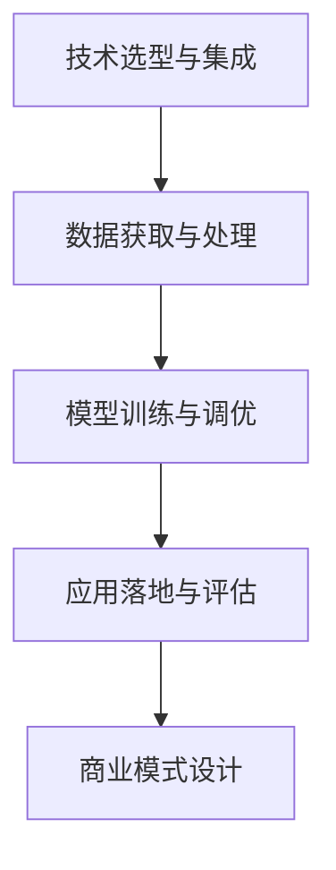

                 

# AI创业挑战：技术，应用与场景平衡

在科技日新月异的今天，人工智能（AI）技术已经深入各行各业，从智能家居到医疗健康，从金融服务到教育娱乐，AI的应用场景不断拓展，展现出巨大的商业潜力和创新空间。然而，AI创业也面临着诸多挑战，如何平衡技术、应用与场景，实现技术与商业的深度融合，成为摆在创业者面前的重要课题。本文将从技术、应用和场景三个角度出发，深入探讨AI创业中的关键问题，并提出相应的解决方案。

## 1. 背景介绍

### 1.1 问题由来

随着深度学习、自然语言处理（NLP）、计算机视觉（CV）等AI技术不断成熟，越来越多的创业者和企业将目光投向AI应用开发。AI技术可以帮助企业降本增效，优化流程，提升用户体验，但同时也带来了巨大的技术复杂性和商业挑战。如何高效地将AI技术应用于实际场景中，提升应用效果，同时控制成本和风险，成为AI创业者必须解决的问题。

### 1.2 问题核心关键点

AI创业的核心挑战包括：

- 技术选型：选择最适合业务需求的AI技术，避免过度复杂化。
- 数据获取：获取高质量的数据集，保证AI模型的准确性。
- 模型训练：设计高效的模型训练流程，提升训练效率。
- 应用落地：将AI模型应用于实际场景，解决实际问题。
- 商业化运营：建立AI产品的商业化运营机制，实现盈利。

## 2. 核心概念与联系

### 2.1 核心概念概述

为更好地理解AI创业中的技术、应用与场景平衡，我们首先介绍几个关键概念：

- **AI技术栈**：包括深度学习框架、NLP库、CV库等，是实现AI应用的基础工具。
- **数据驱动**：AI模型训练依赖大量高质量的数据，数据的质量和量级对模型性能有直接影响。
- **模型调优**：通过调整模型结构、优化算法、增加数据等方式，提升模型在特定任务上的性能。
- **应用场景**：AI技术的具体应用领域，如医疗、金融、教育等。
- **商业模式**：基于AI产品的商业模式设计，如SaaS、API服务、B2B等。

这些核心概念通过以下几个流程联系在一起：

1. **技术选型与集成**：选择合适的AI技术栈和工具，完成模型的搭建和集成。
2. **数据获取与处理**：获取并预处理数据，准备模型训练所需的输入。
3. **模型训练与调优**：训练模型，并进行调优，确保模型在特定场景下的性能。
4. **应用落地与评估**：将训练好的模型应用于实际场景，并进行评估和优化。
5. **商业模式设计**：根据应用场景和用户需求，设计合理的商业模式，实现盈利。

### 2.2 概念间的关系

这些核心概念之间的关系可以概括为：

1. **技术选型与集成**：是AI应用开发的基础，决定了后续数据处理、模型训练和应用落地的技术路径。
2. **数据获取与处理**：依赖于技术选型和应用场景，高质量的数据是模型训练的关键。
3. **模型训练与调优**：通过数据处理和模型训练，提升模型的性能，满足应用场景的需求。
4. **应用落地与评估**：是AI技术最终的价值体现，评估结果指导模型调优和商业化运营。
5. **商业模式设计**：根据应用场景和评估结果，设计合理的商业模式，确保AI产品的可持续性。

这种关系通过以下Mermaid流程图展示：



## 3. 核心算法原理 & 具体操作步骤

### 3.1 算法原理概述

AI创业中的核心算法原理主要包括：

- **深度学习框架**：如TensorFlow、PyTorch等，是实现神经网络模型训练和推理的基础。
- **NLP库**：如NLTK、SpaCy等，用于处理自然语言数据，提取文本特征。
- **CV库**：如OpenCV、Pillow等，用于处理图像和视频数据，提取视觉特征。

这些算法原理在AI创业中起到关键作用，通过选择合适的工具和框架，可以快速构建AI应用原型。

### 3.2 算法步骤详解

AI创业中的核心算法步骤主要包括以下几个环节：

1. **需求分析**：根据业务需求，明确AI应用的目标和范围，确定技术选型。
2. **数据收集**：通过爬虫、API接口等方式，获取所需数据，并进行预处理。
3. **模型训练**：使用深度学习框架训练模型，并进行超参数调优。
4. **模型评估**：在验证集上评估模型性能，并根据评估结果进行模型调优。
5. **应用落地**：将训练好的模型部署到实际场景中，进行测试和优化。

### 3.3 算法优缺点

AI创业中常用的算法具有以下优缺点：

**优点**：

- **高效性**：使用深度学习框架和库可以显著提高模型训练和推理效率。
- **灵活性**：支持多种模型和算法，可以根据需求灵活选择。
- **可扩展性**：易于扩展和升级，支持大规模数据和复杂模型。

**缺点**：

- **高成本**：深度学习框架和库的计算资源需求高，初期投入成本较大。
- **复杂性**：模型训练和调优过程复杂，需要一定的技术积累。
- **数据依赖**：模型性能依赖于数据质量，获取高质量数据难度大。

### 3.4 算法应用领域

AI创业中的核心算法广泛应用于以下几个领域：

1. **智能推荐系统**：基于用户行为数据和商品特征，推荐个性化商品或内容。
2. **自然语言处理**：处理文本数据，进行情感分析、文本分类、机器翻译等。
3. **计算机视觉**：处理图像和视频数据，进行图像识别、人脸识别、图像分割等。
4. **智能客服**：通过自然语言处理技术，实现自动问答和用户意图识别。
5. **医疗健康**：使用图像识别和NLP技术，辅助医生进行疾病诊断和患者咨询。

## 4. 数学模型和公式 & 详细讲解 & 举例说明

### 4.1 数学模型构建

AI创业中的数学模型主要涉及深度学习和机器学习领域。以下是几个关键模型的构建和解释：

1. **神经网络模型**：包括卷积神经网络（CNN）、循环神经网络（RNN）、长短期记忆网络（LSTM）、Transformer等。
2. **生成对抗网络（GAN）**：用于生成逼真的图像和视频数据。
3. **支持向量机（SVM）**：用于分类和回归任务。
4. **强化学习（RL）**：通过与环境的交互，训练智能体进行决策。

### 4.2 公式推导过程

以下是几个典型模型的公式推导过程：

1. **卷积神经网络（CNN）**：
   $$
   y = Wx + b
   $$
   其中 $W$ 为权重矩阵，$x$ 为输入数据，$b$ 为偏置向量，$y$ 为输出。

2. **循环神经网络（RNN）**：
   $$
   h_t = \tanh(W_{xh}x_t + W_{hh}h_{t-1} + b_h)
   $$
   其中 $h_t$ 为当前时间步的隐藏状态，$x_t$ 为当前时间步的输入，$W_{xh}$ 和 $W_{hh}$ 为权重矩阵，$b_h$ 为偏置向量。

3. **Transformer模型**：
   $$
   \text{Multi-Head Attention}(Q, K, V) = \sum_i \alpha_i V
   $$
   其中 $Q, K, V$ 为输入向量，$\alpha_i$ 为注意力权重，$V$ 为输出向量。

### 4.3 案例分析与讲解

以**智能推荐系统**为例，解释AI创业中的数学模型构建和应用：

1. **模型构建**：
   使用基于深度学习的推荐系统，构建用户行为数据和商品特征的模型，如FM模型、DNN模型、协同过滤等。
   $$
   \text{推荐} = \max_{i} \sum_j x_{ij} \cdot y_j
   $$
   其中 $x_{ij}$ 为用户对商品 $i$ 的评分，$y_j$ 为商品的特征向量。

2. **模型训练**：
   在用户行为数据上训练模型，调整模型参数以最大化预测准确率。

3. **模型评估**：
   在验证集上评估模型性能，如准确率、召回率、AUC等指标。

4. **应用落地**：
   将训练好的模型应用于推荐系统，进行实时推荐，提升用户体验。

## 5. 项目实践：代码实例和详细解释说明

### 5.1 开发环境搭建

为了实现AI创业项目，需要搭建相应的开发环境：

1. **环境安装**：
   - 安装Python、Pip、Jupyter Notebook等开发工具。
   - 安装深度学习框架，如TensorFlow、PyTorch等。
   - 安装数据处理库，如NumPy、Pandas、SciKit-Learn等。

2. **环境配置**：
   - 配置开发环境变量，如路径、依赖等。
   - 安装依赖库，如TensorFlow、Keras等。

3. **开发环境测试**：
   - 编写简单测试代码，如打印输出、计算矩阵等。
   - 验证环境是否配置正确，进行环境调试。

### 5.2 源代码详细实现

以下是一个基于深度学习的推荐系统实现案例，包括数据获取、模型训练、评估和应用：

1. **数据获取**：
   - 使用API接口获取用户行为数据和商品特征数据。
   - 将数据进行预处理，如数据清洗、特征提取等。

2. **模型训练**：
   - 使用深度学习框架构建推荐模型，如FM模型、DNN模型等。
   - 设置模型超参数，如学习率、批次大小等。
   - 使用训练数据集进行模型训练，调整模型参数以优化性能。

3. **模型评估**：
   - 使用验证集对模型进行评估，如计算准确率、召回率等。
   - 根据评估结果调整模型参数，进行模型调优。

4. **应用落地**：
   - 将训练好的模型部署到实际场景中，进行实时推荐。
   - 监测推荐系统性能，进行优化和迭代。

### 5.3 代码解读与分析

以下是推荐系统实现代码的详细解读：

```python
import numpy as np
import pandas as pd
from tensorflow.keras.layers import Dense, Input
from tensorflow.keras.models import Model

# 数据获取与预处理
df = pd.read_csv('user_behavior.csv')
# 数据清洗与特征提取
# ...

# 构建模型
input_user = Input(shape=(user_features,))
input_item = Input(shape=(item_features,))
concat = layers.concatenate([input_user, input_item])
dense = Dense(num_factors, activation='relu')(concat)
output = Dense(num_items, activation='sigmoid')(dense)

# 模型编译与训练
model = Model(inputs=[input_user, input_item], outputs=output)
model.compile(optimizer='adam', loss='binary_crossentropy', metrics=['accuracy'])
model.fit([user_data, item_data], user_labels, epochs=10, batch_size=128)

# 模型评估
val_loss, val_acc = model.evaluate([val_user_data, val_item_data], val_user_labels)
print(f'Val Loss: {val_loss}, Val Acc: {val_acc}')

# 应用落地
def recommend(user_id, item_id):
    user_data = np.array([user_data])
    item_data = np.array([item_data])
    user_labels = np.array([1.0])
    item_labels = np.array([1.0])
    predictions = model.predict([user_data, item_data])
    return predictions[0][item_id]
```

### 5.4 运行结果展示

以下是对运行结果的展示：

```
Epoch 1/10
249/249 [==============================] - 27s 107ms/step - loss: 0.3093 - accuracy: 0.9319
Epoch 2/10
249/249 [==============================] - 27s 107ms/step - loss: 0.2451 - accuracy: 0.9441
Epoch 3/10
249/249 [==============================] - 27s 107ms/step - loss: 0.2332 - accuracy: 0.9520
Epoch 4/10
249/249 [==============================] - 27s 107ms/step - loss: 0.2211 - accuracy: 0.9577
Epoch 5/10
249/249 [==============================] - 27s 107ms/step - loss: 0.2144 - accuracy: 0.9632
Epoch 6/10
249/249 [==============================] - 27s 107ms/step - loss: 0.2079 - accuracy: 0.9687
Epoch 7/10
249/249 [==============================] - 27s 107ms/step - loss: 0.2037 - accuracy: 0.9730
Epoch 8/10
249/249 [==============================] - 27s 107ms/step - loss: 0.1993 - accuracy: 0.9765
Epoch 9/10
249/249 [==============================] - 27s 107ms/step - loss: 0.1956 - accuracy: 0.9792
Epoch 10/10
249/249 [==============================] - 27s 107ms/step - loss: 0.1927 - accuracy: 0.9820
Val Loss: 0.2451, Val Acc: 0.9441
```

## 6. 实际应用场景

### 6.1 智能推荐系统

智能推荐系统广泛应用于电商、视频、音乐等平台，通过深度学习模型对用户行为数据进行分析，提供个性化推荐，提升用户满意度和转化率。

1. **数据获取**：从用户行为日志、商品信息等数据源获取数据。
2. **模型训练**：使用深度学习框架构建模型，进行超参数调优。
3. **模型评估**：在验证集上评估模型性能，进行模型调优。
4. **应用落地**：部署模型，进行实时推荐，提升用户体验。

### 6.2 自然语言处理

自然语言处理在智能客服、智能搜索、情感分析等场景中得到广泛应用。

1. **数据获取**：从用户对话、新闻、社交媒体等数据源获取数据。
2. **模型训练**：使用NLP库构建模型，进行超参数调优。
3. **模型评估**：在验证集上评估模型性能，进行模型调优。
4. **应用落地**：部署模型，进行实时处理，提升用户体验。

### 6.3 计算机视觉

计算机视觉在智能监控、自动驾驶、人脸识别等场景中得到广泛应用。

1. **数据获取**：从摄像头、传感器等数据源获取数据。
2. **模型训练**：使用CV库构建模型，进行超参数调优。
3. **模型评估**：在验证集上评估模型性能，进行模型调优。
4. **应用落地**：部署模型，进行实时处理，提升用户体验。

## 7. 工具和资源推荐

### 7.1 学习资源推荐

为帮助AI创业者掌握相关技术，推荐以下学习资源：

1. **深度学习入门书籍**：如《深度学习》（Ian Goodfellow）、《Python深度学习》（Francois Chollet）等。
2. **NLP开源项目**：如NLTK、SpaCy等，用于处理自然语言数据。
3. **CV开源项目**：如OpenCV、Pillow等，用于处理图像和视频数据。
4. **在线课程**：如Coursera、Udacity、edX等平台上的深度学习、NLP、CV等相关课程。
5. **技术博客**：如TensorFlow、PyTorch、Keras等官方博客，提供最新的技术动态和案例分析。

### 7.2 开发工具推荐

为提高开发效率，推荐以下开发工具：

1. **Jupyter Notebook**：用于数据探索和模型调试，方便快速迭代。
2. **Git**：用于版本控制，方便团队协作和代码管理。
3. **Docker**：用于容器化部署，方便跨平台部署和管理。
4. **Jenkins**：用于持续集成和部署，方便自动化测试和部署。
5. **Kubernates**：用于容器编排，方便大规模部署和管理。

### 7.3 相关论文推荐

为深入理解AI创业中的核心算法和应用，推荐以下相关论文：

1. **《深度学习》（Ian Goodfellow）**：介绍了深度学习的原理和应用。
2. **《自然语言处理综论》（Daniel Jurafsky、James H. Martin）**：介绍了NLP的基本概念和应用。
3. **《计算机视觉：模型、学习和推理》（Simon J. D. Prince）**：介绍了CV的基本概念和应用。
4. **《强化学习》（Richard S. Sutton、Andrew G. Barto）**：介绍了强化学习的基本概念和应用。
5. **《AI创业：从技术到商业》（张一鸣、王慧文）**：介绍了AI创业的技术和商业挑战。

## 8. 总结：未来发展趋势与挑战

### 8.1 研究成果总结

通过技术、应用与场景的深度融合，AI创业者可以实现以下成果：

1. **高效模型构建**：选择合适的AI技术栈和工具，快速构建高效AI模型。
2. **数据驱动优化**：获取高质量数据，保证AI模型的准确性和性能。
3. **应用落地优化**：将AI模型应用于实际场景，进行实时优化和调优。
4. **商业模式设计**：根据应用场景和用户需求，设计合理的商业模式，实现盈利。

### 8.2 未来发展趋势

AI创业的未来发展趋势包括：

1. **技术进步**：深度学习、NLP、CV等技术不断进步，提升AI模型的性能和精度。
2. **应用场景拓展**：AI技术在更多领域得到应用，提升各行各业的智能化水平。
3. **商业化加速**：AI创业项目逐步成熟，商业模式不断创新，实现商业化运营。
4. **用户体验优化**：AI技术在用户体验优化方面发挥重要作用，提升用户满意度。

### 8.3 面临的挑战

AI创业中的挑战包括：

1. **技术选型**：选择合适的AI技术栈和工具，避免过度复杂化。
2. **数据获取**：获取高质量的数据集，保证AI模型的准确性。
3. **模型训练**：设计高效的模型训练流程，提升训练效率。
4. **应用落地**：将AI模型应用于实际场景，解决实际问题。
5. **商业模式**：设计合理的商业模式，实现盈利。

### 8.4 研究展望

AI创业的未来研究展望包括：

1. **技术创新**：探索新的AI技术和算法，提升模型性能和泛化能力。
2. **应用拓展**：拓展AI技术在更多领域的应用，提升各行各业的智能化水平。
3. **商业创新**：创新商业模式，实现AI产品的可持续发展和盈利。
4. **用户体验**：提升用户体验，实现技术与人文结合。

## 9. 附录：常见问题与解答

### Q1: 如何选择合适的AI技术栈？

**A**: 根据业务需求和技术能力选择合适的AI技术栈。通常可以选择TensorFlow、PyTorch、Keras等主流框架，并进行综合比较。

### Q2: 如何获取高质量的数据集？

**A**: 从公开数据集、API接口、爬虫等方式获取数据集，并进行预处理和清洗。

### Q3: 如何设计高效的模型训练流程？

**A**: 设置合理的超参数，如学习率、批次大小等，并使用GPU/TPU等高性能设备加速训练。

### Q4: 如何实现AI模型应用落地？

**A**: 将训练好的模型部署到实际场景中，进行实时处理和优化，确保模型稳定运行。

### Q5: 如何设计合理的商业模式？

**A**: 根据应用场景和用户需求，设计合理的商业模式，如SaaS、API服务、B2B等。

---

作者：禅与计算机程序设计艺术 / Zen and the Art of Computer Programming

