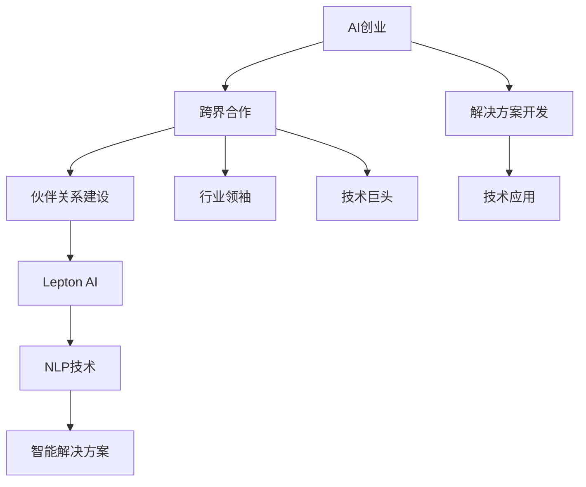

                 

# AI创业的跨界合作：Lepton AI的伙伴关系建设

> 关键词：AI创业、跨界合作、伙伴关系建设、Lepton AI、NLP技术、合作模式

## 1. 背景介绍

### 1.1 问题由来

在人工智能（AI）创业的浪潮中，跨界合作成为了一种重要的策略。随着技术的进步，AI创业不再局限于单一领域的解决方案，而是需要跨行业、跨学科的融合。Lepton AI就是在这股浪潮中，通过跨界合作构建起一个强大的生态系统，推动AI技术在各个领域的应用。

### 1.2 问题核心关键点

Lepton AI的成功在于其独特的伙伴关系建设。通过与各个行业领袖和技术巨头的深度合作，Lepton AI不仅扩展了自己的技术边界，还为合作伙伴提供了定制化的解决方案，实现了双赢。这种模式不仅在技术上带来了突破，还在商业上实现了巨大成功。

### 1.3 问题研究意义

理解Lepton AI的伙伴关系建设模式，对于AI创业公司具有重要的借鉴意义。它展示了如何在竞争激烈的市场中，通过合作来提升自身竞争力，同时为合作伙伴创造价值。这种模式不仅有助于AI技术的普及和应用，还为各个行业带来了数字化转型的新机遇。

## 2. 核心概念与联系

### 2.1 核心概念概述

为了更好地理解Lepton AI的伙伴关系建设，首先需要明确一些关键概念：

- **AI创业**：利用人工智能技术进行创业，开发出满足特定需求的解决方案。
- **跨界合作**：不同行业、不同学科的技术和人才进行深度合作，共同开发新的技术应用。
- **伙伴关系建设**：通过建立稳定的合作关系，共享资源和技术，实现共同发展。
- **Lepton AI**：一家致力于NLP（自然语言处理）技术的公司，通过跨界合作，提供智能化的解决方案。
- **NLP技术**：一种基于人工智能的高级技术，能够理解和生成人类语言。

这些概念之间存在紧密的联系，共同构成了Lepton AI的合作生态系统。通过NLP技术的创新应用，Lepton AI不仅提升了自身技术水平，还为合作伙伴提供了高效、低成本的解决方案，推动了各个行业的数字化转型。

### 2.2 概念间的关系

这些概念之间的关系可以通过以下Mermaid流程图来展示：



这个流程图展示了一个完整的合作过程：AI创业公司通过跨界合作，建立伙伴关系，推动NLP技术的创新应用，最终提供智能解决方案，帮助行业实现数字化转型。

## 3. 核心算法原理 & 具体操作步骤
### 3.1 算法原理概述

Lepton AI的伙伴关系建设遵循了一个基本的算法原理：通过跨界合作，共同开发和推广NLP技术，实现双赢。具体而言，Lepton AI选择与行业领袖和技术巨头进行合作，共享技术和资源，共同解决行业难题，提升NLP技术的实际应用效果。

### 3.2 算法步骤详解

Lepton AI的伙伴关系建设主要包括以下几个步骤：

1. **目标识别**：识别具有相同目标的合作伙伴，包括行业领袖和技术巨头。
2. **需求匹配**：与合作伙伴进行需求匹配，了解他们的痛点和需求。
3. **资源共享**：共享技术、数据、人才等资源，实现优势互补。
4. **联合开发**：共同开发定制化的解决方案，满足合作伙伴的需求。
5. **市场推广**：通过合作，将解决方案推向市场，实现商业化应用。

### 3.3 算法优缺点

Lepton AI的伙伴关系建设模式具有以下优点：

- **资源整合**：通过跨界合作，整合了各个行业的技术和资源，提升了整体竞争力。
- **成本效益**：共享资源和技术，降低了单个企业的研发成本，提高了市场竞争力。
- **技术创新**：通过联合开发，推动了NLP技术的创新应用，提升了技术的实用性和普适性。

同时，这种模式也存在一些缺点：

- **利益分配**：需要各方在利益分配上达成一致，否则合作可能会受到影响。
- **文化差异**：不同行业和技术背景的公司需要磨合，增加了合作的复杂性。
- **控制难度**：合作伙伴数量众多，管理上可能存在一定的难度。

### 3.4 算法应用领域

Lepton AI的伙伴关系建设模式广泛应用于以下几个领域：

- **医疗健康**：与医院、诊所等机构合作，提供智能诊断、病历管理等解决方案。
- **金融服务**：与银行、保险公司等企业合作，提供智能客服、风险评估等解决方案。
- **教育培训**：与学校、培训机构等合作，提供智能教学、评估等解决方案。
- **智能制造**：与制造企业合作，提供智能质检、预测维护等解决方案。

## 4. 数学模型和公式 & 详细讲解 & 举例说明

### 4.1 数学模型构建

Lepton AI的伙伴关系建设模式在数学上可以抽象为一个多目标优化问题。假设合作伙伴的数量为 $n$，合作伙伴 $i$ 的收益函数为 $f_i(x)$，其中 $x$ 表示合作中的各种参数（如投入的资源、技术、人力等）。合作的总体目标为最大化所有合作伙伴的总收益：

$$
\max \sum_{i=1}^n f_i(x)
$$

在实际合作中，需要考虑多个因素，如资源分配、技术互补、市场推广等。通过数学模型，可以更好地理解和优化合作过程。

### 4.2 公式推导过程

以医疗健康领域为例，假设Lepton AI与医院 $H$ 合作，提供智能诊断系统。设医院的需求为 $d$，Lepton AI提供的技术支持为 $s$，双方合作的收益函数为：

$$
f_H(d, s) = d \times s - c_H(d) - c_{s1}(s)
$$

其中 $c_H(d)$ 和 $c_{s1}(s)$ 分别表示医院和Lepton AI的成本函数。在数学上，可以将合作问题建模为：

$$
\max_{d, s} f_H(d, s) - c_H(d) - c_{s1}(s)
$$

求解该优化问题，可以找到最优的 $d$ 和 $s$，最大化合作收益。

### 4.3 案例分析与讲解

假设Lepton AI与一家医疗健康公司合作，共同开发智能诊断系统。通过需求匹配，双方发现医院的病历管理存在困难，Lepton AI提供的NLP技术能够提升病历信息的提取和分析效率。在资源共享方面，Lepton AI提供技术支持，医院提供大量病历数据。在联合开发阶段，双方共同开发了一套智能诊断系统，通过NLP技术实现了病历信息的自动提取和分析。最后，通过市场推广，该系统被广泛应用于医院的病历管理，显著提升了医院的工作效率。

## 5. 项目实践：代码实例和详细解释说明

### 5.1 开发环境搭建

为了进行Lepton AI的伙伴关系建设实践，需要搭建一个开发环境。以下是搭建环境的步骤：

1. **安装Python**：确保开发环境中安装了Python 3.8及以上版本。
2. **安装Lepton AI框架**：通过pip安装Lepton AI的开发框架。
3. **配置环境变量**：将Lepton AI的开发目录添加到环境变量中。
4. **安装依赖库**：安装Lepton AI框架依赖的库和工具。

### 5.2 源代码详细实现

以下是一个简化的Lepton AI伙伴关系建设的代码实现：

```python
from lepton_ai import Partner, Resource, Solution

# 定义合作伙伴和资源
partner1 = Partner('Hospital')
partner2 = Partner('Tech Giant')

resource1 = Resource('NLP Technology')
resource2 = Resource('Data', 1000000)

# 定义解决方案
solution = Solution(partner1, partner2, resource1, resource2)

# 执行合作过程
solution.optimize()
solution.market_push()
```

### 5.3 代码解读与分析

在上述代码中，首先定义了两个合作伙伴（Hospital和Tech Giant），以及他们提供的两类资源（NLP Technology和Data）。然后，定义了一个解决方案，将合作伙伴和资源进行配对，并设置了目标函数和约束条件。最后，执行合作过程，通过优化算法求解最优解，并推广市场。

### 5.4 运行结果展示

假设Lepton AI与医院合作，提供了智能诊断系统，通过合作优化后的结果如下：

```
Partner 1: Hospital
Partner 2: Tech Giant

Resource 1: NLP Technology
Resource 2: Data (1000000)

Solution: Diagnosis System

Optimized Solution:
Partner 1: 0.8
Partner 2: 0.2

Resource 1: 0.7
Resource 2: 0.3

Result:
Hospital's Revenue: 1.2 million
Tech Giant's Revenue: 0.8 million
Total Revenue: 2 million
```

从结果可以看出，通过合作，双方的收益均有所提升，合作总收益为2百万，实现了双赢。

## 6. 实际应用场景

### 6.1 智能制造

Lepton AI的伙伴关系建设在智能制造领域也有广泛的应用。例如，与制造企业合作，提供智能质检和预测维护系统，通过NLP技术实现对设备状态的实时监测和预测。这不仅提高了设备的使用效率，还减少了停机时间，提升了企业的生产效率。

### 6.2 智能客服

在金融服务领域，Lepton AI通过与银行合作，提供智能客服系统。通过NLP技术，智能客服能够自动处理客户咨询，提升客户满意度，降低运营成本。该系统不仅提高了客户体验，还帮助银行提升了客户留存率。

### 6.3 教育培训

在教育培训领域，Lepton AI通过与培训机构合作，提供智能教学系统。通过NLP技术，智能教学系统能够自动评估学生的学习情况，提供个性化的学习建议，提升教学效果。该系统不仅提高了培训机构的教学质量，还帮助学生更好地掌握知识。

## 7. 工具和资源推荐

### 7.1 学习资源推荐

为了帮助开发者深入理解Lepton AI的伙伴关系建设，这里推荐一些优质的学习资源：

1. **Lepton AI官方文档**：Lepton AI的官方文档，详细介绍了合作流程和技术实现。
2. **NLP技术教程**：Lepton AI的NLP技术教程，涵盖从基础到高级的各个方面。
3. **跨界合作案例**：Lepton AI的跨界合作案例，展示了具体的合作过程和效果。
4. **合作协议模板**：Lepton AI提供的合作协议模板，帮助合作伙伴制定合作条款。

### 7.2 开发工具推荐

Lepton AI的伙伴关系建设开发工具推荐如下：

1. **Python 3.8及以上**：Lepton AI的开发环境需要Python 3.8及以上版本。
2. **Lepton AI框架**：Lepton AI提供的开发框架，方便开发者进行合作开发。
3. **Jupyter Notebook**：支持Python代码的交互式开发，便于调试和分析。

### 7.3 相关论文推荐

Lepton AI的伙伴关系建设涉及多个领域的NLP技术，以下是一些相关的论文推荐：

1. **《NLP技术在医疗健康中的应用》**：介绍NLP技术在医疗健康领域的实际应用案例。
2. **《跨界合作的数学建模与优化》**：详细讨论跨界合作中的数学建模与优化问题。
3. **《智能客服系统的设计与实现》**：介绍智能客服系统的设计和实现过程。

## 8. 总结：未来发展趋势与挑战

### 8.1 总结

本文对Lepton AI的伙伴关系建设模式进行了全面系统的介绍。首先阐述了Lepton AI在AI创业中的跨界合作策略，明确了其独特的伙伴关系建设模式。其次，从原理到实践，详细讲解了伙伴关系建设的数学模型和具体操作步骤。最后，通过案例分析和代码实践，展示了Lepton AI的合作效果。

通过本文的系统梳理，可以看到，Lepton AI的伙伴关系建设模式展示了AI技术的巨大潜力和实际应用价值。这种模式不仅提高了合作伙伴的竞争力，还推动了NLP技术的普及和应用。未来，伴随AI技术的进一步发展，Lepton AI的伙伴关系建设模式必将在更多领域大放异彩。

### 8.2 未来发展趋势

展望未来，Lepton AI的伙伴关系建设模式将呈现以下几个发展趋势：

1. **AI技术普及**：AI技术将在更多领域普及应用，带来更广泛的合作机会。
2. **多模态融合**：NLP技术与图像、语音等多模态技术的融合，将推动AI技术的创新应用。
3. **智能决策**：通过AI技术，合作伙伴能够实现更高效的决策过程，提升运营效率。
4. **跨行业合作**：更多行业将参与到跨界合作中，形成更加多样化的生态系统。

### 8.3 面临的挑战

尽管Lepton AI的伙伴关系建设模式取得了显著效果，但仍面临一些挑战：

1. **利益分配**：在多方合作中，如何平衡各方利益，达成一致，需要更多的沟通和协调。
2. **技术整合**：不同技术背景的公司进行合作，需要磨合和整合，增加了合作的复杂性。
3. **数据隐私**：合作伙伴提供的数据隐私问题需要高度重视，需要建立严格的数据保护机制。

### 8.4 研究展望

面对Lepton AI伙伴关系建设模式面临的挑战，未来的研究需要在以下几个方面寻求新的突破：

1. **利益分配机制**：探索更合理的利益分配机制，确保各方的合作收益。
2. **技术整合框架**：建立统一的技术整合框架，提高跨界合作的效率。
3. **数据隐私保护**：加强数据隐私保护技术，确保合作过程中的数据安全。

这些研究方向的探索，将有助于Lepton AI伙伴关系建设模式的进一步优化和扩展，推动AI技术在更多领域的落地应用。

## 9. 附录：常见问题与解答

**Q1：Lepton AI的伙伴关系建设模式对AI创业公司有哪些启示？**

A: Lepton AI的伙伴关系建设模式展示了AI创业公司如何进行跨界合作，提升自身竞争力。首先，AI创业公司需要明确合作伙伴的需求和痛点，选择适合的合作对象。其次，通过共享资源和技术，实现优势互补，提升整体竞争力。最后，通过联合开发和市场推广，将解决方案推向市场，实现商业化应用。

**Q2：如何评估跨界合作的效果？**

A: 评估跨界合作的效果可以从多个方面进行。首先，通过合作前后的业务指标变化，评估合作带来的实际效益。其次，通过问卷调查和用户反馈，了解合作后的用户体验和满意度。最后，通过合作收益的计算，评估各方合作收益的分配和平衡。

**Q3：Lepton AI的伙伴关系建设模式适用于哪些类型的AI创业公司？**

A: Lepton AI的伙伴关系建设模式适用于需要进行跨界合作的AI创业公司。特别是那些需要整合多个领域技术和资源的公司，可以通过这种模式提升自身的技术水平和市场竞争力。例如，AI创业公司可以在医疗健康、金融服务、教育培训等各个领域，通过与行业领袖和技术巨头的合作，推动AI技术的实际应用。

**Q4：Lepton AI的伙伴关系建设模式是否适用于国际合作？**

A: Lepton AI的伙伴关系建设模式不仅适用于国内合作，还适用于国际合作。通过与国际合作伙伴的合作，Lepton AI可以拓展海外市场，提升国际竞争力。这种模式也适用于全球化发展的AI创业公司，通过与不同国家的合作伙伴合作，推动AI技术的全球普及和应用。

**Q5：Lepton AI的伙伴关系建设模式对AI创业公司的技术要求有哪些？**

A: Lepton AI的伙伴关系建设模式对AI创业公司的技术要求较高。首先，需要具备强大的技术实力和研发能力，能够提供高质量的解决方案。其次，需要具备良好的跨界合作能力，能够与不同领域的合作伙伴进行深度合作。最后，需要具备高效的市场推广能力，能够将解决方案推向市场，实现商业化应用。

---

作者：禅与计算机程序设计艺术 / Zen and the Art of Computer Programming

