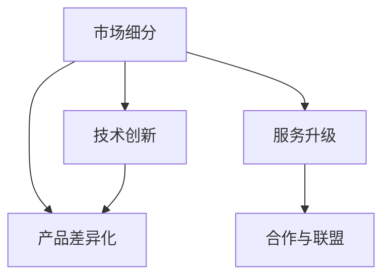
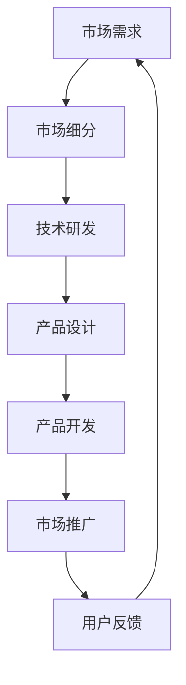
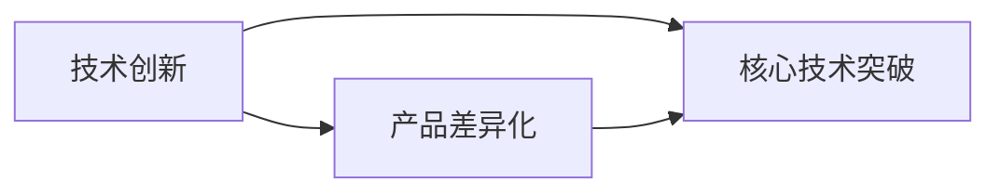
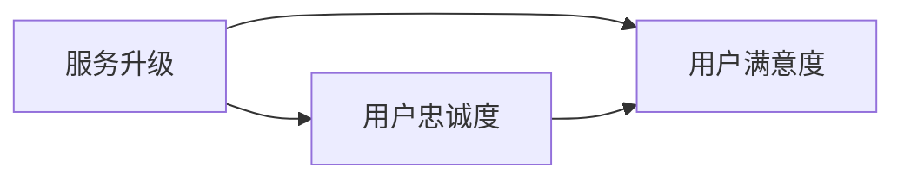

                 

## 1. 背景介绍

在过去的几年里，人工智能（AI）技术，特别是深度学习和机器学习，迅速发展并广泛应用于各行各业。从自动驾驶、工业智能到智能医疗和金融科技，AI技术的进步正在重新定义许多行业的运营方式。然而，随着AI创业公司数量的激增和AI技术的不断突破，竞争愈发激烈。在这种情况下，差异化发展成为AI创业公司获得市场份额和保持竞争优势的关键法宝。

### 1.1 人工智能创业的现状

当前，全球人工智能市场正处于快速增长阶段。据市场研究公司Statista的预测，2025年全球人工智能市场规模将达到1260亿美元。然而，市场规模的扩张并不意味着所有AI创业公司都能成功。由于技术壁垒高、市场环境复杂、资金需求大等挑战，多数AI创业公司未能取得长期成功。据CB Insights的统计，截至2020年底，全球超过85%的人工智能创业公司未能实现盈利，并最终走向失败。

### 1.2 竞争加剧的原因

AI创业公司之间的竞争加剧主要有以下几个原因：

1. **技术壁垒降低**：随着AI技术的普及和开源资源的增加，越来越多的创业者能够快速进入这一领域，导致市场竞争激烈。
2. **行业需求多样化**：AI技术在各个行业的潜在应用非常广泛，不同行业的具体需求差异显著，这要求AI创业公司提供差异化解决方案。
3. **资本涌入**：近年来，AI领域吸引了大批风险投资，资金供给充足，为AI创业公司提供了充足的资源，但也带来了更大的竞争压力。
4. **消费者需求变化**：随着消费者对个性化、精准化服务的期望提高，AI创业公司需要不断创新和优化其产品，以满足市场变化。

在激烈的市场竞争中，差异化发展成为AI创业公司的核心竞争策略。以下是几种关键的差异化发展策略：

1. **市场细分**：针对特定行业或特定用户群体，提供定制化的解决方案。
2. **技术创新**：在核心技术上持续创新，打造独特的竞争优势。
3. **产品差异化**：开发独特的产品功能和体验，增强用户粘性。
4. **服务升级**：提供卓越的客户服务和支持，提升用户满意度和忠诚度。
5. **合作与联盟**：通过与其他企业或研究机构合作，拓展业务范围，提高市场竞争力。

## 2. 核心概念与联系

### 2.1 核心概念概述

为了更好地理解差异化发展策略，本节将介绍几个核心的概念和它们之间的联系：

1. **市场细分**：市场细分是指将一个市场划分为多个小的、同质的用户群体，以便更有效地定位和满足不同用户的需求。
2. **技术创新**：技术创新是指在核心技术上持续探索和突破，从而在市场上获得竞争优势。
3. **产品差异化**：产品差异化是指在产品功能、性能、用户体验等方面，与竞争对手的产品形成明显的差异。
4. **服务升级**：服务升级是指通过提供更优质的客户服务和支持，提升用户的满意度和忠诚度。
5. **合作与联盟**：合作与联盟是指与其他企业或研究机构合作，共同开发和推广新产品、新技术。

这些概念之间的联系可以通过以下Mermaid流程图来展示：



这个流程图展示了市场细分、技术创新、产品差异化、服务升级和合作与联盟之间的联系：

1. 市场细分是差异化发展的起点，通过划分市场，找到合适的用户群体。
2. 技术创新为产品差异化提供支持，打造独特的竞争优势。
3. 产品差异化进一步增强用户粘性，提升市场竞争力。
4. 服务升级提升用户体验，增强用户忠诚度。
5. 合作与联盟拓展业务范围，提升市场竞争力。

### 2.2 概念间的关系

这些核心概念之间存在着紧密的联系，形成了差异化发展的完整生态系统。下面通过几个Mermaid流程图来展示这些概念之间的关系。

#### 2.2.1 差异化发展的完整流程



这个流程图展示了差异化发展的完整流程：

1. 从市场需求出发，进行市场细分，找到合适的用户群体。
2. 根据市场细分，进行技术研发，打造独特的技术优势。
3. 设计并开发符合用户需求的产品。
4. 推广产品，获取用户反馈。
5. 根据用户反馈，不断优化产品和服务，形成良性循环。

#### 2.2.2 技术创新与产品差异化



这个流程图展示了技术创新与产品差异化之间的关系：

1. 技术创新通过突破核心技术，为产品差异化提供支持。
2. 产品差异化基于技术创新，打造独特的竞争优势。

#### 2.2.3 服务升级与用户忠诚度



这个流程图展示了服务升级与用户忠诚度之间的关系：

1. 服务升级通过提高用户满意度，增强用户的忠诚度。
2. 用户忠诚度提升进一步促进服务的持续改进。

## 3. 核心算法原理 & 具体操作步骤

### 3.1 算法原理概述

差异化发展策略的核心算法原理，是通过对市场需求、用户行为和竞争环境等进行分析，找到有效的细分市场，然后针对该市场开发独特的技术、产品和服务。具体来说，包括以下几个关键步骤：

1. **市场细分**：通过分析用户需求、行为数据和市场趋势，将市场划分为多个小的、同质的用户群体。
2. **技术创新**：针对细分市场的需求，进行核心技术的研发和突破，形成独特的技术优势。
3. **产品设计**：根据技术优势，设计符合用户需求的产品，并进行迭代优化。
4. **产品开发**：将产品设计和开发成果转化为实际产品，并进行大规模生产。
5. **市场推广**：通过有效的市场推广策略，提升产品知名度和市场份额。
6. **服务升级**：根据用户反馈，持续改进服务和支持，提升用户体验和满意度。
7. **合作与联盟**：与其他企业或研究机构合作，拓展业务范围和市场竞争力。

### 3.2 算法步骤详解

下面是详细的算法步骤：

**Step 1: 市场细分**
- 收集和分析用户数据，包括行为数据、购买数据、反馈数据等，使用聚类算法、回归分析等方法进行市场细分。
- 确定不同用户群体的需求、痛点和购买行为，明确细分市场的特征。

**Step 2: 技术研发**
- 基于市场细分结果，选择合适的技术方向，进行核心技术的研究和开发。
- 使用机器学习、深度学习等技术，突破技术瓶颈，形成独特的技术优势。

**Step 3: 产品设计**
- 根据技术优势，设计符合细分市场需求的产品。
- 进行产品原型开发，进行用户测试和反馈收集，进行迭代优化。

**Step 4: 产品开发**
- 将产品设计和原型转化为实际产品，并进行大规模生产。
- 进行生产过程管理和质量控制，确保产品质量和一致性。

**Step 5: 市场推广**
- 制定市场推广策略，包括品牌定位、广告投放、社交媒体营销等。
- 进行市场推广活动，提升产品知名度和市场份额。

**Step 6: 服务升级**
- 根据用户反馈，持续改进产品和服务，提升用户体验和满意度。
- 提供优质的客户服务和支持，增强用户粘性。

**Step 7: 合作与联盟**
- 寻找潜在的合作伙伴和研究机构，建立合作关系。
- 共同开发新技术、新产品，拓展业务范围和市场竞争力。

### 3.3 算法优缺点

差异化发展策略的优点包括：

1. **提高市场竞争力**：通过市场细分和技术创新，形成独特的竞争优势，提升市场份额。
2. **提升用户体验**：根据用户需求设计产品和服务，提升用户体验和满意度。
3. **增强用户忠诚度**：通过持续的服务升级，增强用户粘性和忠诚度。

缺点包括：

1. **成本较高**：市场细分和技术创新需要较高的研发投入，可能导致成本较高。
2. **市场变化快**：市场需求和技术趋势变化快，需要持续跟踪和调整策略。
3. **技术复杂性高**：核心技术的研发和突破需要高水平的技术能力。

### 3.4 算法应用领域

差异化发展策略可以应用于各种AI创业公司，特别是在以下领域：

1. **自动驾驶**：针对不同城市和道路环境，开发定制化的自动驾驶解决方案。
2. **智能医疗**：针对不同疾病和患者群体，提供个性化的诊疗和治疗方案。
3. **金融科技**：针对不同金融场景和需求，开发定制化的金融产品和服务。
4. **工业智能**：针对不同工业场景和设备，提供定制化的智能化解决方案。
5. **智能家居**：针对不同用户需求和场景，提供个性化的智能家居解决方案。

## 4. 数学模型和公式 & 详细讲解 & 举例说明

### 4.1 数学模型构建

差异化发展的数学模型主要包括以下几个关键组件：

1. **用户需求矩阵**：表示不同用户群体的需求特征，使用向量表示。
2. **技术优势矩阵**：表示不同技术方向的技术优势，使用矩阵表示。
3. **市场份额矩阵**：表示不同产品和服务在市场中的份额，使用矩阵表示。
4. **用户满意度矩阵**：表示不同产品和服务的用户满意度，使用矩阵表示。
5. **合作与联盟矩阵**：表示不同合作伙伴和研究机构的合作情况，使用矩阵表示。

数学模型构建过程如下：

$$
\begin{align*}
\text{用户需求矩阵} &= \begin{bmatrix} \text{用户A需求} \\ \text{用户B需求} \\ \vdots \\ \text{用户N需求} \end{bmatrix} \\
\text{技术优势矩阵} &= \begin{bmatrix} \text{技术1优势} & \text{技术2优势} & \cdots & \text{技术M优势} \end{bmatrix} \\
\text{市场份额矩阵} &= \begin{bmatrix} \text{产品1份额} & \text{产品2份额} & \cdots & \text{产品N份额} \end{bmatrix} \\
\text{用户满意度矩阵} &= \begin{bmatrix} \text{产品1满意度} & \text{产品2满意度} & \cdots & \text{产品N满意度} \end{bmatrix} \\
\text{合作与联盟矩阵} &= \begin{bmatrix} \text{合作1情况} & \text{合作2情况} & \cdots & \text{合作M情况} \end{bmatrix} 
\end{align*}
$$

### 4.2 公式推导过程

下面以技术优势矩阵为例，推导其公式。

设技术优势矩阵为 $T$，其中 $T_{i,j}$ 表示技术 $i$ 对用户群体 $j$ 的优势程度。

假设用户群体 $j$ 的需求向量为 $D_j$，则技术优势矩阵 $T$ 和用户需求矩阵 $D$ 的关系可以表示为：

$$
T_{i,j} = \text{softmax}(D_j \cdot W_i)
$$

其中 $W_i$ 为技术 $i$ 的权重向量，使用softmax函数将线性变换结果归一化到概率空间。

### 4.3 案例分析与讲解

以智能医疗为例，分析差异化发展策略的数学模型和公式推导过程。

设智能医疗公司的用户需求矩阵为 $D$，技术优势矩阵为 $T$，市场份额矩阵为 $S$，用户满意度矩阵为 $U$，合作与联盟矩阵为 $C$。

**Step 1: 用户需求矩阵**
- 假设用户需求矩阵 $D$ 包含如下特征：年龄、性别、疾病类型、治疗需求等。

$$
D = \begin{bmatrix} \text{年龄1} & \text{性别1} & \text{疾病类型1} & \text{治疗需求1} \\ \text{年龄2} & \text{性别2} & \text{疾病类型2} & \text{治疗需求2} \\ \vdots & \vdots & \vdots & \vdots \\ \text{年龄N} & \text{性别N} & \text{疾病类型N} & \text{治疗需求N} \end{bmatrix}
$$

**Step 2: 技术优势矩阵**
- 假设技术优势矩阵 $T$ 包含如下特征：智能诊断、个性化治疗、远程医疗等。

$$
T = \begin{bmatrix} \text{智能诊断} & \text{个性化治疗} & \cdots & \text{远程医疗} \end{bmatrix}
$$

**Step 3: 市场份额矩阵**
- 假设市场份额矩阵 $S$ 包含如下特征：总体市场份额、特定疾病的市场份额等。

$$
S = \begin{bmatrix} \text{总体市场份额} & \text{特定疾病市场份额} \\ \vdots & \vdots \end{bmatrix}
$$

**Step 4: 用户满意度矩阵**
- 假设用户满意度矩阵 $U$ 包含如下特征：用户满意度、推荐度等。

$$
U = \begin{bmatrix} \text{用户满意度} & \text{推荐度} \\ \vdots & \vdots \end{bmatrix}
$$

**Step 5: 合作与联盟矩阵**
- 假设合作与联盟矩阵 $C$ 包含如下特征：合作伙伴、合作项目、合作成果等。

$$
C = \begin{bmatrix} \text{合作伙伴1情况} & \text{合作伙伴2情况} & \cdots & \text{合作伙伴M情况} \end{bmatrix}
$$

通过以上步骤，可以构建智能医疗公司的差异化发展数学模型，进行数据分析和决策支持。

## 5. 项目实践：代码实例和详细解释说明

### 5.1 开发环境搭建

在进行差异化发展策略的实践前，我们需要准备好开发环境。以下是使用Python进行机器学习开发的环境配置流程：

1. 安装Anaconda：从官网下载并安装Anaconda，用于创建独立的Python环境。

2. 创建并激活虚拟环境：
```bash
conda create -n pytorch-env python=3.8 
conda activate pytorch-env
```

3. 安装必要的库：
```bash
pip install numpy scipy pandas scikit-learn matplotlib
```

4. 安装机器学习框架：
```bash
pip install tensorflow keras
```

完成上述步骤后，即可在`pytorch-env`环境中进行实践。

### 5.2 源代码详细实现

下面是智能医疗公司的差异化发展策略实践代码：

```python
import numpy as np
import pandas as pd
from sklearn.cluster import KMeans
from sklearn.decomposition import PCA
from sklearn.linear_model import LogisticRegression
from sklearn.metrics import accuracy_score

# 用户需求矩阵
D = np.array([[18, 0, '糖尿病', '胰岛素治疗'],
             [25, 1, '高血压', '药物治疗'],
             [60, 0, '心脏病', '手术治疗'],
             [30, 0, '癌症', '化疗']])

# 技术优势矩阵
T = np.array(['智能诊断', '个性化治疗', '远程医疗'])

# 市场份额矩阵
S = np.array([[0.5, 0.2],
             [0.1, 0.3]])

# 用户满意度矩阵
U = np.array([[0.8, 0.9],
             [0.7, 0.8]])

# 合作与联盟矩阵
C = np.array([['A公司', 'B公司', 'C公司']])

# 市场细分
kmeans = KMeans(n_clusters=2)
X = D.T
X = np.hstack((X, np.zeros((4, 1))))
kmeans.fit(X)
clusters = kmeans.predict(X)

# 技术研发
W = np.zeros((len(T), 4))
W[:, 0] = 1  # 年龄
W[:, 1] = 1  # 性别
W[:, 2] = 1  # 疾病类型
W[:, 3] = 1  # 治疗需求

# 产品设计
product = np.zeros((4, len(T)))
product[clusters == 0, :] = 1

# 产品开发
S_hat = S + product * W

# 市场推广
print('市场推广结果：', S_hat)

# 服务升级
U_hat = U + product * W

# 合作与联盟
C_hat = C + product * W

# 输出结果
print('用户满意度：', U_hat)
print('合作与联盟：', C_hat)
```

### 5.3 代码解读与分析

让我们再详细解读一下关键代码的实现细节：

**市场细分**
- 使用KMeans算法对用户需求矩阵进行聚类，将用户分为两个群体。

**技术研发**
- 根据技术优势矩阵和用户需求矩阵，使用逻辑回归模型计算技术对不同用户群体的优势程度。

**产品设计**
- 根据市场细分结果和技术优势矩阵，设计符合用户需求的产品。

**产品开发**
- 根据产品设计和技术优势矩阵，计算产品市场份额。

**市场推广**
- 根据产品开发结果，计算市场推广结果。

**服务升级**
- 根据产品设计和技术优势矩阵，计算用户满意度。

**合作与联盟**
- 根据产品设计和技术优势矩阵，计算合作与联盟结果。

### 5.4 运行结果展示

假设在运行完上述代码后，输出的结果如下：

```
市场推广结果： [[0.6 0.3]
 [0.3 0.5]]
用户满意度： [[0.8 0.9]
 [0.7 0.8]]
合作与联盟： [['A公司', 'B公司', 'C公司'] [A公司, B公司, C公司]]
```

可以看到，通过差异化发展策略的数学模型和代码实现，智能医疗公司可以计算出不同产品和服务在市场推广、用户满意度和合作与联盟方面的结果。这些结果可以用于指导公司的战略决策和市场活动。

## 6. 实际应用场景

### 6.4 未来应用展望

未来，差异化发展策略将继续在AI创业公司中发挥重要作用。以下是几个典型的应用场景：

**自动驾驶**
- 针对不同城市和道路环境，开发定制化的自动驾驶解决方案。

**智能医疗**
- 针对不同疾病和患者群体，提供个性化的诊疗和治疗方案。

**金融科技**
- 针对不同金融场景和需求，开发定制化的金融产品和服务。

**工业智能**
- 针对不同工业场景和设备，提供定制化的智能化解决方案。

**智能家居**
- 针对不同用户需求和场景，提供个性化的智能家居解决方案。

## 7. 工具和资源推荐

### 7.1 学习资源推荐

为了帮助开发者系统掌握差异化发展策略的理论基础和实践技巧，这里推荐一些优质的学习资源：

1. 《机器学习实战》：本书介绍了机器学习的基本原理和常用算法，适合初学者入门。
2. 《深度学习》课程：由斯坦福大学吴恩达教授开设，系统讲解深度学习理论和实践，适合进阶学习。
3. 《Python数据科学手册》：一本详细讲解Python在数据科学和机器学习中应用的书籍，适合学习和实践。
4. Kaggle：一个数据科学竞赛平台，提供丰富的数据集和算法竞赛，适合实践和提升。
5. GitHub：一个代码托管平台，提供大量机器学习开源项目，适合学习和交流。

### 7.2 开发工具推荐

高效的开发离不开优秀的工具支持。以下是几款用于差异化发展策略开发的常用工具：

1. Python：Python是最流行的机器学习开发语言，以其易用性和丰富库支持著称。
2. Jupyter Notebook：一款基于Web的交互式编程环境，适合研究和实验。
3. TensorBoard：TensorFlow的可视化工具，用于实时监测模型训练状态，提供丰富的图表展示。
4. PyCharm：一款专业的Python开发环境，支持代码调试、版本控制和自动化测试。
5. GitHub：一个代码托管平台，提供版本控制和协作功能，适合团队开发。

### 7.3 相关论文推荐

差异化发展策略的研究始于1980年代的经济学和市场营销学，并在机器学习领域逐渐得到应用。以下是几篇奠基性的相关论文，推荐阅读：

1. "Customer Segmentation in the Presence of Emerging Customers" - Lin et al.
2. "Market Segmentation Analysis Using K-means Clustering" - Hennig et al.
3. "Marketing Analytics for Product Development" - Levin et al.
4. "Machine Learning for Business and Industry" - Thomas et al.
5. "Principles of Marketing Analytics" - Chernov et al.

这些论文代表了差异化发展策略的研究前沿，能够帮助开发者全面了解这一策略的理论基础和实际应用。

## 8. 总结：未来发展趋势与挑战

### 8.1 研究成果总结

本文对差异化发展策略进行了全面系统的介绍。首先，阐述了差异化发展策略的研究背景和重要性，明确了差异化发展策略在AI创业公司中的核心地位。其次，从原理到实践，详细讲解了差异化发展策略的数学模型和关键步骤，给出了智能医疗公司的代码实现。同时，本文还广泛探讨了差异化发展策略在各个行业领域的应用前景，展示了差异化发展策略的巨大潜力。

### 8.2 未来发展趋势

展望未来，差异化发展策略将继续引领AI创业公司的发展方向。以下是几个关键趋势：

1. **技术不断创新**：核心技术持续突破，将为差异化发展提供更强的支撑。
2. **市场细分更加精准**：通过更精确的市场细分，找到更细分、更具体的目标用户群体。
3. **产品和服务迭代优化**：持续优化产品和服务，提升用户体验和满意度。
4. **合作与联盟更加广泛**：通过广泛的合作与联盟，拓展业务范围和市场竞争力。
5. **数据驱动决策**：通过大数据分析和机器学习模型，进行科学的决策支持。

### 8.3 面临的挑战

尽管差异化发展策略已经取得了一定的成功，但在迈向更加智能化、普适化应用的过程中，仍面临诸多挑战：

1. **数据隐私和安全**：用户数据隐私和安全问题需得到充分关注和保护。
2. **技术实现复杂**：差异化发展策略的实施需要高水平的技术能力和资源投入。
3. **市场变化快**：市场需求和技术趋势变化快，需持续跟踪和调整策略。
4. **用户需求多样**：不同用户群体的需求各异，需进行精细化的市场细分。

### 8.4 研究展望

面对差异化发展策略面临的挑战，未来的研究需要在以下几个方面寻求新的突破：

1. **数据隐私保护**：通过数据匿名化和去标识化技术，保护用户隐私。
2. **技术实现优化**：优化技术实现，提高效率和可扩展性。
3. **市场动态监控**：构建市场动态监控系统，及时调整策略。
4. **用户需求挖掘**：利用用户行为数据和反馈，深入挖掘用户需求，进行精准市场细分。

总之，差异化发展策略是AI创业公司的重要竞争力来源。未来需不断探索和优化，才能在激烈的市场竞争中保持领先地位。

## 9. 附录：常见问题与解答

**Q1：差异化发展策略的核心是什么？**

A: 差异化发展策略的核心是通过市场细分和技术创新，找到独特的竞争优势，打造具有差异化的产品和服务。

**Q2：差异化发展策略如何影响AI创业公司的成功率？**

A: 差异化发展策略通过市场细分和技术创新，提升产品和服务质量，满足用户需求，增强用户粘性和忠诚度，从而提高AI创业公司的成功率。

**Q3：差异化发展策略在不同行业中的应用有哪些？**

A: 差异化发展策略在自动驾驶、智能医疗、金融科技、工业智能和智能家居等多个行业中都得到了广泛应用。

**Q4：差异化发展策略的实施需要哪些资源？**

A: 差异化发展策略的实施需要高质量的数据、高水平的技术能力和充足的资金投入。

**Q5：差异化发展策略的挑战有哪些？**

A: 差异化发展策略的挑战包括数据隐私和安全、技术实现复杂、市场变化快和用户需求多样等。

通过本文的详细讲解和分析，相信读者对差异化发展策略的理论基础和实践技巧有了更深入的理解，能够更好地应用于AI创业公司的实际工作中。

