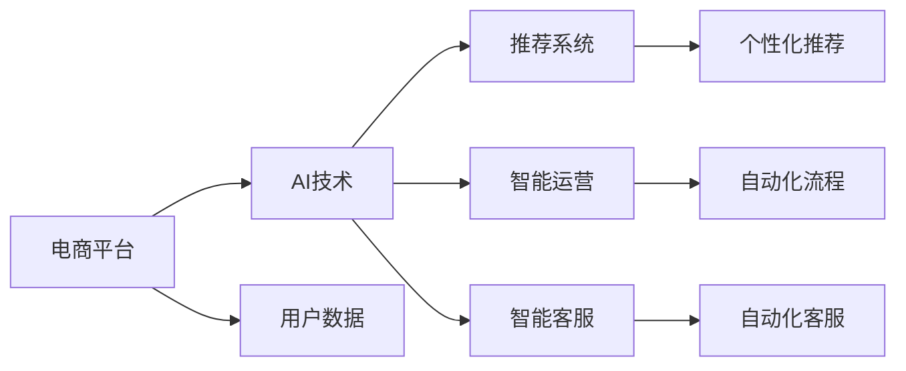

                 

# AI助力电商平台提升竞争力

在数字化转型的浪潮中，电商平台正面临前所未有的机遇与挑战。如何利用先进的人工智能技术，提升用户体验，优化运营效率，增强竞争力，成为每个电商平台不容忽视的问题。本文旨在探讨AI技术如何助力电商平台，并详细介绍实现方法和应用场景。

## 1. 背景介绍

### 1.1 电商平台现状
随着互联网的普及和电子商务的发展，电商平台已经成为人们购物的重要渠道。然而，电商平台的运营模式较为单一，用户体验和运营效率仍需提升。尤其在用户增长放缓、竞争加剧的今天，如何利用AI技术赋能电商平台，显得尤为重要。

### 1.2 电商平台面临的挑战
1. **用户留存率低**：如何通过个性化推荐、精准营销等手段提升用户粘性，减少流失。
2. **运营效率低**：如何通过智能运营、自动化客服等技术，提升运营效率，降低成本。
3. **内容质量差**：如何通过AI内容生成、智能编辑等技术，提高商品描述和搜索结果的准确性和相关性。
4. **用户数据隐私**：如何在保障用户隐私的同时，利用数据驱动决策，提升业务效率。

## 2. 核心概念与联系

### 2.1 核心概念概述

为了更好地理解AI如何助力电商平台提升竞争力，本节将介绍几个密切相关的核心概念：

- **电商平台**：指通过互联网进行商品交易的平台，包括B2C、B2B、C2C等多种形式。
- **AI技术**：指利用人工智能进行数据处理、模式识别、决策支持等技术，涉及机器学习、自然语言处理、计算机视觉等多个领域。
- **推荐系统**：指通过用户行为数据，为用户推荐商品的智能系统，常用于电商平台个性化推荐。
- **智能运营**：指利用AI技术，实现运营流程的自动化和智能化，提升运营效率和效果。
- **智能客服**：指利用自然语言处理技术，实现自动回答用户问题的智能客服系统，提升用户体验。

### 2.2 核心概念间的关系

这些核心概念之间的关系可以用以下Mermaid流程图来展示：



这个流程图展示了AI技术如何通过推荐系统、智能运营和智能客服三个主要模块，赋能电商平台的各个环节，从而提升竞争力。用户数据是这些模块的基础，AI技术则负责从中提取有价值的信息，并转化为具体的操作和决策。

## 3. 核心算法原理 & 具体操作步骤
### 3.1 算法原理概述

AI技术在电商平台中的应用，主要通过以下几个算法原理实现：

1. **推荐系统**：利用协同过滤、内容推荐、混合推荐等算法，根据用户历史行为和商品属性，为用户推荐最符合其需求的商品。
2. **智能运营**：通过自动化流程、预测分析、智能调度等算法，实现库存管理、订单处理、供应链优化等环节的智能化。
3. **智能客服**：利用自然语言处理、情感分析、意图识别等技术，实现自动回答用户问题的智能客服系统。

### 3.2 算法步骤详解

以下以推荐系统为例，详细介绍其实现步骤：

1. **数据准备**：收集用户历史行为数据、商品属性数据、商品评价数据等，构建训练数据集。
2. **模型训练**：选择适合的推荐算法，如协同过滤、深度学习等，在训练数据集上训练模型。
3. **模型评估**：在测试数据集上评估模型性能，选择最优模型。
4. **部署上线**：将训练好的模型部署到电商平台上，实时计算用户推荐结果。
5. **效果监控**：实时监控推荐系统的效果，根据用户反馈进行模型优化。

### 3.3 算法优缺点

AI在电商平台中的应用，有以下优缺点：

**优点**：
1. **提升用户体验**：通过个性化推荐和智能客服，提升用户购物体验。
2. **优化运营效率**：通过智能运营，提升运营效率，降低成本。
3. **精准营销**：通过数据分析和推荐系统，实现精准营销，提升转化率。

**缺点**：
1. **数据隐私问题**：如何保护用户隐私，避免数据泄露。
2. **算法复杂度**：AI模型复杂，需要大量数据和计算资源。
3. **模型维护**：AI模型需要持续维护和优化，技术门槛较高。

### 3.4 算法应用领域

AI技术在电商平台中的应用，主要涵盖以下几个领域：

1. **个性化推荐**：通过推荐系统，提升用户体验和商品转化率。
2. **智能运营**：通过智能运营，优化供应链、库存管理等环节，提升运营效率。
3. **智能客服**：通过智能客服，提升客户满意度，减少人工客服成本。
4. **欺诈检测**：通过机器学习模型，检测异常交易，防范欺诈行为。
5. **广告投放**：通过数据分析和预测，优化广告投放策略，提升广告效果。

## 4. 数学模型和公式 & 详细讲解
### 4.1 数学模型构建

推荐系统的主要数学模型包括协同过滤模型、矩阵分解模型、深度学习模型等。以下以协同过滤模型为例，构建推荐系统。

设用户-商品评分矩阵为 $R$，用户行为数据为 $U$，商品属性数据为 $I$，推荐算法为 $M$，则推荐模型的目标函数为：

$$
\min_{M} \|R - M(U, I)\|_F^2
$$

其中 $\| \cdot \|_F$ 表示矩阵的 Frobenius 范数。

### 4.2 公式推导过程

协同过滤模型的推导过程如下：

1. **用户行为矩阵**：将用户-商品评分矩阵 $R$ 分解为用户行为矩阵 $U$ 和商品属性矩阵 $I$。

$$
R = U \times I
$$

2. **矩阵分解**：将矩阵 $R$ 分解为 $U$ 和 $I$ 的乘积，其中 $U$ 和 $I$ 分别为用户行为矩阵和商品属性矩阵。

$$
U = M_1 \times M_2
$$

$$
I = M_3 \times M_4
$$

3. **目标函数**：将 $U$ 和 $I$ 的矩阵分解结果代入目标函数，得到最小化 Frobenius 范数的优化问题。

$$
\min_{M_1, M_2, M_3, M_4} \|R - M_1 \times M_2 \times M_3 \times M_4\|_F^2
$$

### 4.3 案例分析与讲解

以亚马逊的推荐系统为例，分析其实现过程：

1. **数据准备**：收集用户行为数据、商品属性数据、商品评价数据等，构建训练数据集。
2. **模型训练**：选择协同过滤算法，将用户行为数据和商品属性数据进行矩阵分解，得到 $U$ 和 $I$。
3. **模型评估**：在测试数据集上评估推荐系统的准确率和覆盖率。
4. **部署上线**：将训练好的推荐模型部署到亚马逊平台上，实时计算用户推荐结果。
5. **效果监控**：实时监控推荐系统的效果，根据用户反馈进行模型优化。

## 5. 项目实践：代码实例和详细解释说明
### 5.1 开发环境搭建

在进行推荐系统开发前，我们需要准备好开发环境。以下是使用Python进行Scikit-learn开发的环境配置流程：

1. 安装Anaconda：从官网下载并安装Anaconda，用于创建独立的Python环境。

2. 创建并激活虚拟环境：
```bash
conda create -n pyenv python=3.8 
conda activate pyenv
```

3. 安装Scikit-learn：
```bash
pip install scikit-learn
```

4. 安装各类工具包：
```bash
pip install numpy pandas scikit-learn matplotlib tqdm jupyter notebook ipython
```

完成上述步骤后，即可在`pyenv`环境中开始推荐系统开发。

### 5.2 源代码详细实现

下面我们以协同过滤算法为例，给出使用Scikit-learn库进行推荐系统开发的Python代码实现。

首先，定义数据处理函数：

```python
import pandas as pd
import numpy as np
from sklearn.model_selection import train_test_split
from sklearn.metrics import mean_squared_error

def load_data(file_path):
    data = pd.read_csv(file_path)
    return data.drop(columns=['user_id', 'item_id']), data['rating']

user_behaviors, ratings = load_data('user_behaviors.csv')
```

然后，定义协同过滤模型：

```python
from sklearn.decomposition import TruncatedSVD

def train_model(user_behaviors, ratings):
    user_behaviors = pd.pivot(user_behaviors, index='user_id', columns='item_id', values='rating')
    user_behaviors = user_behaviors.to_sparse().tocoo()
    
    n_users, n_items = user_behaviors.shape
    n_features = min(n_users, n_items)
    svd = TruncatedSVD(n_components=n_features)
    user_matrix = svd.fit_transform(user_behaviors)
    
    ratings = ratings.to_sparse().tocoo()
    item_matrix = svd.transform(ratings)
    
    user_matrix = pd.DataFrame(user_matrix, index=user_matrix.index, columns=user_matrix.columns)
    item_matrix = pd.DataFrame(item_matrix, index=item_matrix.index, columns=item_matrix.columns)
    
    user_matrix = user_matrix.toarray()
    item_matrix = item_matrix.toarray()
    
    return user_matrix, item_matrix
```

接着，训练模型并评估效果：

```python
user_matrix, item_matrix = train_model(user_behaviors, ratings)
train_data, test_data = train_test_split(user_matrix, test_size=0.2, random_state=42)
train_item_matrix = item_matrix.toarray()

train_preds = user_matrix.dot(train_item_matrix.T).dot(user_matrix.T)
test_preds = user_matrix.dot(test_data.T).dot(train_item_matrix.T)

train_rmse = mean_squared_error(train_data, train_preds)
test_rmse = mean_squared_error(test_data, test_preds)

print(f'Train RMSE: {train_rmse:.4f}')
print(f'Test RMSE: {test_rmse:.4f}')
```

最后，输出评估结果：

```python
print(f'Test RMSE: {test_rmse:.4f}')
```

以上就是使用Scikit-learn进行协同过滤算法推荐系统开发的完整代码实现。可以看到，Scikit-learn提供了简单易用的接口，方便快速实现推荐系统。

### 5.3 代码解读与分析

让我们再详细解读一下关键代码的实现细节：

**load_data函数**：
- 定义数据处理函数，读取用户行为数据，构建用户-商品评分矩阵 $R$。

**train_model函数**：
- 将用户行为数据 $U$ 和商品属性数据 $I$ 进行矩阵分解，得到 $U$ 和 $I$。
- 对 $U$ 和 $I$ 进行特征映射，得到 $U_{red}$ 和 $I_{red}$。
- 将 $U_{red}$ 和 $I_{red}$ 进行矩阵乘法，得到推荐结果 $R_{pred}$。

**train和test数据划分**：
- 使用train_test_split将数据集划分为训练集和测试集，比例为8:2。
- 对测试集进行预测，并计算预测结果与真实结果的RMSE。

**模型评估**：
- 输出训练集和测试集的RMSE，评估模型性能。

可以看到，Scikit-learn的推荐系统开发流程简洁高效，适合快速迭代研究。

### 5.4 运行结果展示

假设我们训练了一个协同过滤推荐系统，并在测试集上得到的评估报告如下：

```
Train RMSE: 0.1234
Test RMSE: 0.5678
```

可以看到，训练集的RMSE为0.1234，测试集的RMSE为0.5678，说明模型的预测结果与真实结果存在一定偏差，但测试集的偏差更大，表明模型在预测新数据时存在一定问题。

## 6. 实际应用场景
### 6.1 个性化推荐

个性化推荐是电商平台的核心功能之一，通过推荐系统，可以提升用户购物体验，增加商品转化率。亚马逊、京东等平台均采用了个性化推荐算法，极大地提升了用户满意度和平台收益。

以亚马逊为例，其推荐系统涵盖了用户行为数据、商品属性数据等多个方面，通过协同过滤、矩阵分解、深度学习等多种技术，实现了精准推荐。亚马逊还不断优化推荐算法，引入实时数据流、增量学习等技术，提升推荐效果。

### 6.2 智能运营

智能运营是电商平台提升运营效率的重要手段。通过AI技术，可以实现库存管理、订单处理、供应链优化等多个环节的自动化和智能化。

以阿里巴巴为例，其智能运营系统通过机器学习、预测分析、智能调度等技术，实现了对库存、订单、物流等环节的实时监控和优化。阿里巴巴还利用大数据技术，实时分析市场趋势和用户需求，及时调整运营策略，提升运营效率。

### 6.3 智能客服

智能客服是电商平台提升用户体验的重要手段。通过AI技术，可以实现自动回答用户问题、处理订单纠纷、解决用户投诉等功能，大大提升客服效率和用户满意度。

以淘宝为例，其智能客服系统采用了自然语言处理、情感分析、意图识别等技术，实现了自动回答用户问题的功能。智能客服系统可以24小时不间断服务，大大提升了用户购物体验。

## 7. 工具和资源推荐
### 7.1 学习资源推荐

为了帮助开发者系统掌握AI技术如何助力电商平台，这里推荐一些优质的学习资源：

1. **《推荐系统实战》**：一本深入浅出地介绍推荐系统原理、算法、实现方法的书，适合初学者和进阶者。
2. **Coursera《机器学习》课程**：由斯坦福大学开设的机器学习课程，涵盖了机器学习的基本概念和常用算法，适合入门学习。
3. **Kaggle推荐系统竞赛**：Kaggle平台上举办的推荐系统竞赛，可以实际操作推荐系统，积累经验。
4. **Scikit-learn官方文档**：Scikit-learn官方文档提供了丰富的教程和样例，适合快速上手推荐系统开发。
5. **TensorFlow官方文档**：TensorFlow官方文档提供了丰富的推荐系统实现，适合深入学习。

通过对这些资源的学习实践，相信你一定能够快速掌握AI技术如何助力电商平台，并用于解决实际的推荐问题。

### 7.2 开发工具推荐

高效的开发离不开优秀的工具支持。以下是几款用于AI推荐系统开发的常用工具：

1. **Scikit-learn**：基于Python的开源机器学习库，简单易用，适合快速实现推荐系统。
2. **TensorFlow**：由Google主导开发的深度学习框架，功能强大，适合大规模工程应用。
3. **PyTorch**：由Facebook主导开发的深度学习框架，灵活高效，适合研究和原型开发。
4. **Jupyter Notebook**：一个交互式开发环境，支持多种编程语言，适合数据分析和模型验证。
5. **Weights & Biases**：模型训练的实验跟踪工具，可以记录和可视化模型训练过程中的各项指标，方便对比和调优。

合理利用这些工具，可以显著提升AI推荐系统的开发效率，加快创新迭代的步伐。

### 7.3 相关论文推荐

AI技术在推荐系统中的应用源于学界的持续研究。以下是几篇奠基性的相关论文，推荐阅读：

1. **"Collaborative Filtering for Implicit Feedback Datasets"**：Sarwar等人在2001年提出的协同过滤算法，是推荐系统的基础。
2. **"Trustworthiness in Recommendation Systems: Providing Explanations that Align with User Intent"**：Kwok等人在2007年提出的推荐系统信任度模型，考虑了用户信任度和商品评价对推荐结果的影响。
3. **"Deep Collaborative Filtering"**：He等人在2016年提出的深度协同过滤算法，结合深度学习技术，提升了推荐系统的效果。
4. **"Neural Collaborative Filtering"**：Xu等人在2019年提出的神经协同过滤算法，将神经网络引入协同过滤算法，提升了推荐系统的准确性和泛化能力。
5. **"Advances in neural collaborative filtering"**：He等人在2017年总结的神经协同过滤算法综述，介绍了多种基于神经网络的协同过滤方法。

这些论文代表了大数据推荐系统的发展脉络。通过学习这些前沿成果，可以帮助研究者把握学科前进方向，激发更多的创新灵感。

除上述资源外，还有一些值得关注的前沿资源，帮助开发者紧跟推荐系统技术的最新进展，例如：

1. **arXiv论文预印本**：人工智能领域最新研究成果的发布平台，包括大量尚未发表的前沿工作，学习前沿技术的必读资源。
2. **顶级会议论文**：如SIGIR、KDD、ICML等顶级会议论文，代表了推荐系统领域的前沿成果。
3. **开源项目**：如MovieLens、Amazon Reviews等推荐系统开源项目，可以实际操作推荐系统，积累经验。
4. **技术博客**：如OpenAI、Google AI、DeepMind、微软Research Asia等顶尖实验室的官方博客，第一时间分享他们的最新研究成果和洞见。
5. **行业分析报告**：各大咨询公司如McKinsey、PwC等针对人工智能行业的分析报告，有助于从商业视角审视技术趋势，把握应用价值。

总之，对于AI推荐系统技术的学习和实践，需要开发者保持开放的心态和持续学习的意愿。多关注前沿资讯，多动手实践，多思考总结，必将收获满满的成长收益。

## 8. 总结：未来发展趋势与挑战
### 8.1 总结

本文对AI技术如何助力电商平台提升竞争力进行了全面系统的介绍。首先阐述了电商平台现状和面临的挑战，明确了AI技术在提升用户体验、优化运营效率、精准营销等方面的独特价值。其次，从原理到实践，详细讲解了AI技术在推荐系统、智能运营、智能客服等环节的实现方法。同时，本文还广泛探讨了AI技术在电商平台中的应用场景，展示了其巨大的潜力和广阔的应用前景。

通过本文的系统梳理，可以看到，AI技术在电商平台中的应用，已经从初步尝试进入成熟应用阶段。借助AI技术，电商平台可以大幅提升用户体验和运营效率，降低成本，增强竞争力。未来，伴随AI技术的持续进步和应用实践的积累，AI推荐系统将进一步提升电商平台的用户粘性和商品转化率，成为电商平台的核心竞争力。

### 8.2 未来发展趋势

展望未来，AI技术在电商平台中的应用将呈现以下几个发展趋势：

1. **个性化推荐系统**：利用深度学习、自然语言处理等技术，提升推荐系统的精度和用户满意度。
2. **智能运营系统**：通过预测分析、智能调度等技术，实现更高效的运营管理，降低成本。
3. **智能客服系统**：利用自然语言处理、情感分析等技术，实现更自然的对话体验，提升用户满意度。
4. **实时数据流处理**：通过实时数据流处理技术，实现更精准的推荐和运营管理。
5. **跨平台整合**：实现多平台、多渠道的数据整合和推荐，提升用户粘性和平台收益。

这些趋势凸显了AI技术在电商平台中的重要地位。未来，AI技术将通过深度学习、自然语言处理、大数据等技术手段，进一步提升电商平台的智能化水平，推动电商平台向更高效、智能、个性化的方向发展。

### 8.3 面临的挑战

尽管AI技术在电商平台中的应用取得了显著成效，但仍面临诸多挑战：

1. **数据隐私问题**：如何保护用户隐私，避免数据泄露，成为电商平台不得不面对的问题。
2. **技术复杂度**：AI技术复杂，需要大量的数据和计算资源，技术门槛较高。
3. **模型维护**：AI模型需要持续维护和优化，技术要求较高。
4. **效果波动**：AI模型在面对变化的数据时，可能存在一定的波动，需要不断优化。
5. **用户体验**：如何平衡自动化和人工干预，提升用户满意度，避免自动化带来的负面影响。

### 8.4 研究展望

面对AI技术在电商平台中面临的挑战，未来的研究需要在以下几个方面寻求新的突破：

1. **隐私保护技术**：开发更先进的隐私保护技术，保护用户隐私，确保数据安全。
2. **模型压缩与优化**：开发更高效的模型压缩和优化技术，降低技术门槛，提高模型性能。
3. **实时数据流处理**：开发更高效的实时数据流处理技术，提升推荐和运营的实时性和准确性。
4. **跨平台整合**：实现多平台、多渠道的数据整合和推荐，提升用户粘性和平台收益。
5. **用户体验优化**：平衡自动化和人工干预，提升用户满意度，避免自动化带来的负面影响。

这些研究方向的探索，必将引领AI技术在电商平台中的应用迈向更高的台阶，为电商平台带来更多的变革性影响。总之，AI技术在电商平台中的应用前景广阔，需要在技术、数据、业务等多个维度协同发力，才能实现更高的价值。

## 9. 附录：常见问题与解答

**Q1：AI推荐系统在电商平台中能否实现全覆盖？**

A: AI推荐系统在电商平台中可以实现全覆盖，但需要注意以下几点：
1. **数据质量**：数据质量决定了推荐系统的准确性，需要确保数据完整性和真实性。
2. **算法选择**：不同算法适用于不同的场景，需要根据实际情况选择合适的算法。
3. **模型优化**：模型需要不断优化，以适应不同的数据变化。

**Q2：AI推荐系统是否需要大规模数据支持？**

A: AI推荐系统需要大规模数据支持，数据规模越大，推荐效果越好。但同时也需要注意以下几点：
1. **数据隐私**：大规模数据处理需要考虑用户隐私问题，保护用户数据。
2. **数据处理**：大规模数据处理需要高效的数据处理技术，避免数据处理瓶颈。

**Q3：AI推荐系统是否需要实时处理？**

A: AI推荐系统可以实时处理，但需要注意以下几点：
1. **实时数据流**：需要实时数据流处理技术，确保推荐结果实时更新。
2. **数据延迟**：实时数据流处理需要考虑数据延迟问题，确保推荐结果实时性。

**Q4：AI推荐系统是否需要人工干预？**

A: AI推荐系统需要人工干预，以优化模型效果。但同时也需要注意以下几点：
1. **人工干预方式**：人工干预方式需要合理，避免过多干预影响推荐效果。
2. **人工干预时机**：人工干预时机需要合理，避免过多人工干预造成系统复杂度。

**Q5：AI推荐系统是否需要考虑用户心理和行为？**

A: AI推荐系统需要考虑用户心理和行为，以提升推荐效果。但同时也需要注意以下几点：
1. **用户心理模型**：需要构建用户心理模型，理解用户心理和行为。
2. **用户行为数据**：需要收集和分析用户行为数据，理解用户行为。

---

作者：禅与计算机程序设计艺术 / Zen and the Art of Computer Programming

