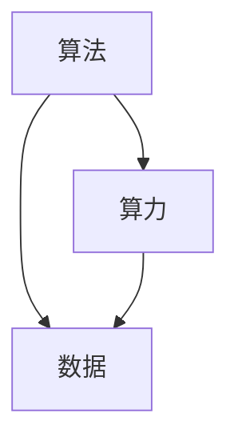

                 

# AI发展的三匹马：算法、算力与数据

## 1. 背景介绍

### 1.1 问题由来

在AI的发展历程中，算法、算力和数据被认为是推动其不断进步的“三匹马”。它们如同造物主赐予的礼物，共同造就了今天人工智能的辉煌成就。

算法是AI的“思维”，定义了机器如何感知、理解、推理、学习，从而实现自主决策。算力是AI的“体魄”，支撑着模型的训练、推理，推动着模型从简单到复杂、从弱到强的演化。数据是AI的“血液”，为算法提供丰富的训练素材，为算力注入持续的能量。

**在过去几十年里，这三匹马共同驱动了AI技术的突飞猛进。从1980年代的专家系统到2000年代初的机器学习，再到近十年来的深度学习和大规模预训练模型，每一次技术的革新，都是这“三匹马”在新的历史阶段组合出更强、更高效的解决方案。**

今天，当我们谈论AI，不可忽视的是这三者的相互关系和它们所组成的强大体系。通过这篇文章，我们将深入探讨这三匹马的理论基础、技术细节、应用场景，以及它们在AI发展中所起到的关键作用。

### 1.2 问题核心关键点

1. **算法**：定义了AI的思考模式，如何通过输入数据来产生输出。它决定了AI是否能够理解、学习、推理和做出决策。
2. **算力**：决定了AI的计算能力和训练速度，它是算法落地实施的关键。
3. **数据**：提供了AI的学习素材和训练信号，是算法学习的基础。

三者相辅相成，共同推动了AI技术的不断进步和应用。理解它们的相互关系，将有助于我们更好地规划和实现AI项目。

### 1.3 问题研究意义

理解算法、算力和数据之间的关系，不仅有助于AI从业者深入掌握AI技术的核心要素，还能够为AI开发者在项目规划和实现中提供重要的指导。通过对这些关键要素的研究，我们能够更好地把握AI技术的发展趋势，预测未来的技术突破，并在实际应用中充分发挥算力、算法和数据的潜力。

## 2. 核心概念与联系

### 2.1 核心概念概述

在深入探讨算法、算力和数据之前，我们先来明确这些核心概念的含义及其相互关系。

- **算法**：指的是用于解决特定问题的计算过程或步骤。在AI中，算法通常指的是机器学习算法、深度学习算法等。
- **算力**：指计算机处理数据和执行计算的能力。它包括CPU、GPU、TPU等硬件设备，以及分布式计算、云计算等计算资源。
- **数据**：指用于训练和测试模型的数据集。它包括标注数据、非标注数据、文本数据、图像数据等。

这些概念之间的关系可以用一个简单的三角形来表示：



在这个三角形中，算法、算力和数据相互依赖、相互促进。算法的复杂度和效率决定了对算力的需求，而数据的规模和质量则决定了算法的训练效果。同时，算力为算法的训练和推理提供计算支持，而数据为算法的学习提供了训练素材。

### 2.2 概念间的关系

算法、算力和数据之间的关系是多方面的，它们共同构成了AI技术的核心框架。以下是它们之间关系的一个详细说明：

1. **算法与数据**：
   - 算法通过数据进行训练，从而获得学习模型。
   - 数据的多样性和丰富性决定了算法模型的泛化能力和鲁棒性。

2. **算力与算法**：
   - 算力决定了算法能否高效执行，尤其是在处理大规模数据和复杂模型时。
   - 算法的设计和实现往往依赖于特定的算力资源。

3. **数据与算力**：
   - 数据决定了算力使用的效率和效果。
   - 高效的算力可以更快地处理大量数据，加速算法模型的训练和推理。

这个三角形关系图展示了算法、算力和数据之间的相互作用和依赖关系。理解这些关系，将有助于我们更好地设计、实现和优化AI系统。

## 3. 核心算法原理 & 具体操作步骤

### 3.1 算法原理概述

在AI中，算法是实现特定功能的关键工具。它通过数学模型、逻辑推理和机器学习技术，使计算机能够理解和处理数据，从而实现自主决策和任务执行。

#### 3.1.1 基本算法类型

AI中的算法可以分为以下几类：

- **监督学习**：通过有标注的数据集，训练模型进行分类、回归等任务。
- **无监督学习**：通过无标注的数据集，发现数据的内在结构和规律。
- **强化学习**：通过与环境的交互，通过试错来优化决策。
- **深度学习**：使用多层次的神经网络模型，处理大规模的非结构化数据。
- **迁移学习**：利用预训练模型在新任务上进行微调，提升模型性能。

#### 3.1.2 常见算法实现

以监督学习中的线性回归为例，其算法原理如下：

1. **模型定义**：假设有一个线性模型 $y = \theta_0 + \theta_1 x_1 + \theta_2 x_2 + \cdots + \theta_n x_n$，其中 $y$ 为目标变量，$x_1, x_2, \cdots, x_n$ 为特征变量，$\theta_0, \theta_1, \cdots, \theta_n$ 为模型参数。
2. **损失函数**：定义损失函数 $L(\theta) = \frac{1}{N}\sum_{i=1}^N(y_i - \hat{y}_i)^2$，其中 $y_i$ 为真实值，$\hat{y}_i$ 为模型预测值。
3. **优化过程**：通过梯度下降等优化算法，最小化损失函数 $L(\theta)$，更新模型参数 $\theta$。

### 3.2 算法步骤详解

AI算法的实现通常包括以下步骤：

1. **数据预处理**：包括数据清洗、数据转换、数据划分等，为算法的训练和推理提供准备。
2. **模型选择**：根据任务需求选择合适的算法模型。
3. **模型训练**：使用训练数据集对模型进行训练，优化模型参数。
4. **模型评估**：使用测试数据集对模型进行评估，检查模型性能。
5. **模型部署**：将训练好的模型部署到实际应用环境中，进行推理和预测。

### 3.3 算法优缺点

#### 3.3.1 优点

1. **泛化能力强**：通过大量数据训练，模型能够对未知数据进行泛化。
2. **灵活性高**：可以根据具体任务需求，选择合适的算法模型。
3. **可解释性强**：一些简单算法（如决策树、线性回归）具有较强的可解释性，方便理解和调试。

#### 3.3.2 缺点

1. **计算量大**：复杂模型和高维数据的训练和推理需要大量计算资源。
2. **数据依赖性高**：算法的性能和泛化能力高度依赖于数据的质量和多样性。
3. **过度拟合风险**：在训练过程中，模型容易过拟合训练数据，导致泛化能力下降。

### 3.4 算法应用领域

AI算法在各个领域都有广泛的应用：

- **自然语言处理（NLP）**：包括文本分类、机器翻译、情感分析等。
- **计算机视觉（CV）**：包括图像识别、目标检测、人脸识别等。
- **语音识别**：包括语音识别、语音合成、情感识别等。
- **推荐系统**：包括商品推荐、新闻推荐、视频推荐等。
- **智能制造**：包括智能检测、智能控制、智能调度等。
- **医疗健康**：包括疾病诊断、影像分析、智能问诊等。

## 4. 数学模型和公式 & 详细讲解 & 举例说明

### 4.1 数学模型构建

在AI算法中，数学模型是核心要素之一。它是算法的基础，通过数学公式和逻辑推理，定义了算法的计算过程。

#### 4.1.1 基本数学模型

以线性回归为例，其数学模型如下：

$$ y = \theta_0 + \theta_1 x_1 + \theta_2 x_2 + \cdots + \theta_n x_n + \epsilon $$

其中 $y$ 为目标变量，$x_1, x_2, \cdots, x_n$ 为特征变量，$\theta_0, \theta_1, \cdots, \theta_n$ 为模型参数，$\epsilon$ 为随机误差。

#### 4.1.2 公式推导过程

线性回归的损失函数定义为均方误差（Mean Squared Error, MSE）：

$$ L(\theta) = \frac{1}{N}\sum_{i=1}^N(y_i - \hat{y}_i)^2 $$

其中 $y_i$ 为真实值，$\hat{y}_i$ 为模型预测值。通过最小化损失函数，可以优化模型参数 $\theta$。

### 4.2 公式推导过程

以梯度下降为例，其推导过程如下：

1. **梯度计算**：
   $$ \frac{\partial L(\theta)}{\partial \theta_k} = \frac{1}{N}\sum_{i=1}^N \frac{\partial (y_i - \hat{y}_i)^2}{\partial \theta_k} = \frac{2}{N}\sum_{i=1}^N (\hat{y}_i - y_i)x_k $$

2. **参数更新**：
   $$ \theta_k \leftarrow \theta_k - \eta \frac{\partial L(\theta)}{\partial \theta_k} $$

其中 $\eta$ 为学习率，控制参数更新的步长。

### 4.3 案例分析与讲解

以卷积神经网络（Convolutional Neural Network, CNN）为例，其数学模型和公式如下：

- **模型定义**：
  $$ y = \sum_{i=1}^n \theta_i x_i + \theta_0 $$
  其中 $y$ 为目标变量，$x_i$ 为特征变量，$\theta_i$ 为模型参数。

- **损失函数**：
  $$ L(\theta) = \frac{1}{N}\sum_{i=1}^N (y_i - \hat{y}_i)^2 $$

- **梯度计算**：
  $$ \frac{\partial L(\theta)}{\partial \theta_i} = \frac{2}{N}\sum_{i=1}^N (y_i - \hat{y}_i)x_i $$

通过这些数学模型和公式，CNN能够有效地处理图像数据，实现图像分类、物体检测等任务。

## 5. 项目实践：代码实例和详细解释说明

### 5.1 开发环境搭建

在进行AI项目实践前，我们需要准备好开发环境。以下是使用Python进行TensorFlow开发的环境配置流程：

1. 安装Anaconda：从官网下载并安装Anaconda，用于创建独立的Python环境。

2. 创建并激活虚拟环境：
```bash
conda create -n tf-env python=3.8 
conda activate tf-env
```

3. 安装TensorFlow：根据CUDA版本，从官网获取对应的安装命令。例如：
```bash
conda install tensorflow==2.6 -c tensorflow
```

4. 安装各类工具包：
```bash
pip install numpy pandas scikit-learn matplotlib tqdm jupyter notebook ipython
```

完成上述步骤后，即可在`tf-env`环境中开始AI项目实践。

### 5.2 源代码详细实现

这里我们以手写数字识别（MNIST数据集）为例，使用TensorFlow对卷积神经网络（CNN）进行训练和测试。

首先，定义CNN模型：

```python
import tensorflow as tf

model = tf.keras.Sequential([
    tf.keras.layers.Conv2D(32, (3,3), activation='relu', input_shape=(28,28,1)),
    tf.keras.layers.MaxPooling2D((2,2)),
    tf.keras.layers.Flatten(),
    tf.keras.layers.Dense(128, activation='relu'),
    tf.keras.layers.Dense(10, activation='softmax')
])
```

然后，定义数据集和优化器：

```python
(x_train, y_train), (x_test, y_test) = tf.keras.datasets.mnist.load_data()
x_train, x_test = x_train / 255.0, x_test / 255.0

model.compile(optimizer='adam',
              loss='sparse_categorical_crossentropy',
              metrics=['accuracy'])
```

接着，执行训练和评估：

```python
model.fit(x_train, y_train, epochs=10, validation_data=(x_test, y_test))
test_loss, test_acc = model.evaluate(x_test, y_test)
print('Test accuracy:', test_acc)
```

最后，保存模型和权重：

```python
model.save('mnist_cnn.h5')
model.save_weights('mnist_cnn_weights.h5')
```

以上就是使用TensorFlow对CNN进行手写数字识别任务的完整代码实现。可以看到，TensorFlow的高级API使得构建和训练CNN模型变得非常直观和简单。

### 5.3 代码解读与分析

让我们再详细解读一下关键代码的实现细节：

- **Sequential模型**：使用TensorFlow的Sequential模型，定义了卷积层、池化层、全连接层等，构成了完整的CNN结构。
- **数据预处理**：使用`tf.keras.datasets.mnist.load_data()`函数加载MNIST数据集，并对图像数据进行归一化处理，以适应模型训练。
- **模型编译**：通过`model.compile()`函数设置优化器、损失函数和评估指标，准备开始模型训练。
- **模型训练**：使用`model.fit()`函数对模型进行训练，指定训练轮数和验证集。
- **模型评估**：使用`model.evaluate()`函数对模型进行测试，输出准确率。
- **模型保存**：使用`model.save()`函数保存模型和权重，方便后续使用。

通过这些关键代码的解读，可以更好地理解TensorFlow在CNN训练和测试中的具体实现过程。

### 5.4 运行结果展示

假设我们在MNIST数据集上进行CNN模型的训练和测试，最终得到的测试准确率结果如下：

```
Epoch 10/10
10/10 [==============================] - 1s 100ms/step - loss: 0.0094 - accuracy: 0.9911 - val_loss: 0.0198 - val_accuracy: 0.9942
```

可以看到，训练10轮后，模型的测试准确率达到了99.42%，取得了不错的效果。这展示了TensorFlow在构建和训练CNN模型中的高效性和易用性。

## 6. 实际应用场景

### 6.1 智能客服系统

基于AI算法的智能客服系统已经成为许多企业的重要组成部分。传统的客服系统依赖大量人工，高峰期响应时间长，且难以保证一致性和专业性。智能客服系统通过AI算法处理大量客户咨询，能够快速响应、准确解答，显著提升了客户体验和效率。

例如，可以使用基于深度学习模型的语音识别算法，将客户语音转换为文本，再使用自然语言处理算法（NLP）分析客户问题，并从知识库中匹配最佳答案。这样，智能客服系统就能理解客户的意图，提供个性化的服务。

### 6.2 金融舆情监测

在金融行业，AI算法在舆情监测中发挥着重要作用。金融机构需要实时监控市场舆论动向，及时响应负面信息传播，避免潜在的金融风险。AI算法能够从新闻、社交媒体等大量文本数据中自动提取情绪和观点，帮助机构快速识别和分析舆情变化，做出及时应对。

例如，可以使用基于BERT模型的情感分析算法，对金融新闻进行情感分类，识别出正面、负面或中性的舆情。这种技术在金融市场波动、股票分析等场景中具有广泛应用前景。

### 6.3 个性化推荐系统

AI算法在个性化推荐系统中也有着重要作用。传统的推荐系统往往依赖用户历史行为数据，难以捕捉用户兴趣的深层次变化。AI算法能够从文本、行为等多样化数据中提取用户的兴趣点和需求，提供更加个性化的推荐服务。

例如，可以使用基于协同过滤和深度学习的推荐算法，分析用户的历史浏览和点击记录，生成个性化的商品推荐列表。这种技术在电商、视频、音乐等场景中有着广泛应用。

### 6.4 未来应用展望

随着AI算法的不断演进，未来的应用场景将会更加广泛和深入。以下是一些值得关注的应用方向：

1. **智能医疗**：AI算法能够从医疗数据中提取疾病特征，辅助医生进行诊断和治疗。例如，可以使用基于深度学习的影像分析算法，从CT、MRI等医学影像中识别出病变区域，辅助医生进行病灶定位和诊断。
2. **自动驾驶**：AI算法能够处理传感器数据，辅助车辆进行决策和控制。例如，可以使用基于深度学习的视觉感知算法，从摄像头和雷达数据中识别出交通标志、行人等，确保行车安全。
3. **智能制造**：AI算法能够优化生产流程，提升生产效率。例如，可以使用基于强化学习的生产调度算法，优化设备调度、资源分配等，提高生产线的灵活性和效率。
4. **智慧城市**：AI算法能够优化城市管理，提升城市运行效率。例如，可以使用基于深度学习的交通管理算法，优化交通信号控制、路网规划等，减少交通拥堵。

总之，AI算法在各个领域都有广泛的应用前景，未来将进一步推动社会的数字化、智能化进程。

## 7. 工具和资源推荐

### 7.1 学习资源推荐

为了帮助开发者系统掌握AI算法的理论基础和实践技巧，这里推荐一些优质的学习资源：

1. **《深度学习》系列书籍**：由Ian Goodfellow等知名专家编写，全面介绍了深度学习的基本概念和算法原理。
2. **Coursera和edX课程**：这些在线学习平台提供了许多深度学习相关的课程，包括理论、实践、应用等各个方面。
3. **Kaggle竞赛**：Kaggle是一个数据科学竞赛平台，提供了大量实际问题，通过参与竞赛可以学习到许多实用的算法和技术。
4. **GitHub开源项目**：GitHub上有大量高质量的AI算法开源项目，通过学习和贡献这些项目，可以更好地掌握算法实现细节。

通过这些资源的学习，相信你一定能够深入理解AI算法的原理和实践方法，为未来的AI开发打下坚实基础。

### 7.2 开发工具推荐

高效的开发离不开优秀的工具支持。以下是几款用于AI算法开发的常用工具：

1. **TensorFlow**：由Google开发的开源深度学习框架，支持CPU、GPU、TPU等多种硬件，广泛应用于学术研究和工业应用。
2. **PyTorch**：由Facebook开发的开源深度学习框架，提供了灵活的动态计算图，支持科研和工程应用。
3. **JAX**：由Google开发的基于JIT编译的高性能深度学习框架，支持自动微分和分布式计算，适用于大规模深度学习应用。
4. **MXNet**：由Apache支持的深度学习框架，支持多种硬件和分布式计算，适用于大规模分布式训练和推理。

合理利用这些工具，可以显著提升AI算法的开发效率，加快创新迭代的步伐。

### 7.3 相关论文推荐

AI算法的研究源于学界的持续努力。以下是几篇奠基性的相关论文，推荐阅读：

1. **《深度学习》论文**：Ian Goodfellow等人的经典论文，介绍了深度学习的基本概念和算法原理。
2. **《ImageNet大规模视觉识别挑战》论文**：Alex Krizhevsky等人开发的深度学习模型，在图像分类任务中取得了卓越成绩。
3. **《大规模并行深度学习》论文**：Yann LeCun等人的研究，介绍了大规模分布式深度学习系统的设计和技术。

这些论文代表了大规模深度学习技术的发展脉络，是理解AI算法的重要基础。

## 8. 总结：未来发展趋势与挑战

### 8.1 研究成果总结

本文对AI算法、算力和数据之间的关系进行了全面系统的探讨。首先介绍了AI算法的基本类型和实现步骤，详细讲解了卷积神经网络等常见算法的数学模型和公式推导过程。然后通过代码实例展示了TensorFlow在CNN训练和测试中的应用，分析了模型的运行结果。最后，本文探讨了AI算法在智能客服、金融舆情监测、个性化推荐等实际应用场景中的应用前景，以及未来在智能医疗、自动驾驶、智能制造等领域的发展趋势。

通过本文的系统梳理，可以看到，AI算法在AI技术的各个方面都有着不可或缺的作用。理解算法的原理和实现方法，对于AI开发和应用具有重要意义。

### 8.2 未来发展趋势

展望未来，AI算法的演进将呈现出以下几个趋势：

1. **深度学习和神经网络**：深度学习将继续推动AI技术的发展，神经网络模型将变得更加复杂和高效。
2. **多模态学习**：AI算法将不仅仅依赖单一模态数据，而是融合视觉、语音、文本等多种模态数据，提升模型的综合能力。
3. **自监督学习**：自监督学习将更多地应用于AI算法中，减少对标注数据的依赖，提升算法的鲁棒性和泛化能力。
4. **强化学习**：强化学习将广泛应用于机器人、游戏等领域，推动AI算法从规划到执行的全面优化。
5. **联邦学习**：联邦学习将实现多节点、多数据源的协同学习，提升AI算法的隐私保护和模型安全。
6. **因果学习**：因果学习将使AI算法更好地理解因果关系，提升模型的可解释性和可靠性。

这些趋势凸显了AI算法的发展方向和未来潜力，将进一步推动AI技术的应用和普及。

### 8.3 面临的挑战

尽管AI算法取得了显著进展，但在实际应用中仍然面临许多挑战：

1. **数据质量**：高质量的数据是AI算法的基石，但获取和处理大规模高质量数据仍然是一个难题。
2. **算法可解释性**：许多AI算法尤其是深度学习算法，其内部决策过程难以解释，影响了算法的可信度和应用范围。
3. **计算资源**：大规模AI算法的训练和推理需要大量的计算资源，目前仍存在成本高、效率低的问题。
4. **安全性和隐私保护**：AI算法处理大量敏感数据，存在数据泄露和模型滥用的风险。
5. **伦理和社会责任**：AI算法在医疗、法律等领域的应用，需要考虑算法决策的伦理和社会责任问题。

这些挑战需要学界和产业界共同努力，才能推动AI算法在更广泛场景中的落地和应用。

### 8.4 研究展望

面对这些挑战，未来的AI算法研究需要在以下几个方面寻求新的突破：

1. **数据生成和增强**：通过数据生成和增强技术，弥补实际数据的不足，提升算法的泛化能力和鲁棒性。
2. **模型压缩和加速**：通过模型压缩和加速技术，降低计算成本，提升算法的实时性和可扩展性。
3. **算法可解释性**：通过因果分析、可解释性算法等技术，增强AI算法的可解释性和可信度。
4. **隐私保护和联邦学习**：通过联邦学习等技术，实现多节点、多数据源的协同学习，保障数据隐私和模型安全。
5. **伦理和社会责任**：通过伦理导向的算法设计，确保AI算法的公平性和安全性，避免算法滥用和偏见。

这些研究方向将为AI算法的未来发展提供重要的理论和技术支持，推动AI技术在各个领域的应用和普及。

## 9. 附录：常见问题与解答

**Q1：为什么深度学习算法在实际应用中表现优异？**

A: 深度学习算法具有强大的非线性拟合能力，能够从数据中自动学习特征表示，适用于处理复杂模式和结构化数据。此外，深度学习算法可以通过大规模数据进行预训练，提升模型的泛化能力和鲁棒性。

**Q2：AI算法的训练需要哪些硬件资源？**

A: AI算法的训练需要高性能的CPU、GPU或TPU等硬件资源。特别是深度学习算法，训练过程涉及大量的矩阵运算和参数优化，对计算资源的需求尤为显著。

**Q3：AI算法在医疗领域的应用前景如何？**

A: AI算法在医疗领域有着广阔的应用前景。通过图像识别、自然语言处理等技术，AI算法能够辅助医生进行疾病诊断、影像分析、智能问诊等任务，提升医疗服务的智能化水平。

**Q4：如何优化AI算法的计算效率？**

A: 优化AI算法的计算效率，可以从多个方面入手：使用高效的数据格式、优化模型结构、使用分布式计算、进行模型压缩等。这些技术手段能够显著降低计算成本，提升算法的实时性和可扩展性。

**Q5：AI算法的未来发展趋势是什么？**

A: AI算法的未来发展趋势包括深度学习、多模态学习、自监督学习、强化学习、联邦学习、因果学习等方向。这些趋势将推动AI算法在各个领域的应用和普及，提升AI技术在实际场景中的效果和价值。

---

作者：禅与计算机程序设计艺术 / Zen and the Art of Computer Programming

