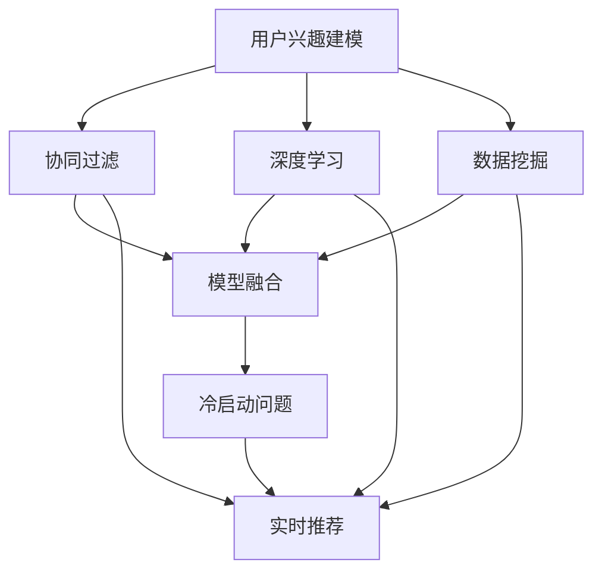

                 

# AI在个性化推荐中的创新应用

> 关键词：
  - 人工智能
  - 推荐系统
  - 深度学习
  - 数据挖掘
  - 协同过滤
  - 用户行为分析
  - 模型融合
  - 实时推荐
  - 冷启动问题
  - 模型泛化

## 1. 背景介绍

### 1.1 问题由来

随着互联网技术的发展，信息过载已成为我们面临的主要问题之一。人们每天接收的信息量已经远远超出了其处理能力。推荐系统便应运而生，通过个性化的推荐，帮助用户在海量信息中快速找到自己感兴趣的内容，提高信息获取的效率和质量。

推荐系统是一种以用户行为数据为依据，通过算法对用户进行分析和预测，并为其提供个性化推荐的技术。它已经成为现代互联网应用中不可或缺的一部分，广泛应用于电商、新闻、社交媒体、视频等众多领域。

### 1.2 问题核心关键点

推荐系统的核心在于准确捕捉用户兴趣，并提供与用户需求匹配的推荐内容。具体问题包括：

- **用户兴趣建模**：如何通过用户行为数据建立用户兴趣模型？
- **推荐内容选择**：如何选择与用户兴趣最相关的推荐内容？
- **推荐效果评估**：如何衡量推荐系统的推荐效果？
- **冷启动问题**：如何在没有足够用户数据的情况下进行推荐？
- **实时推荐**：如何快速更新推荐内容以适应用户兴趣的变化？

这些问题不仅关系到推荐系统的效率和效果，也直接影响到用户体验和平台收入。因此，寻找更高效、更准确的推荐算法，以及如何优化推荐系统的各个环节，是推荐系统研究的重要方向。

### 1.3 问题研究意义

推荐系统在电商、新闻、社交媒体、视频等众多领域得到了广泛应用，极大地提升了用户体验和平台收益。通过推荐系统，用户可以快速找到自己感兴趣的内容，平台则能够通过个性化推荐提高用户粘性和转化率。

推荐系统作为人工智能技术的重要应用场景，具有以下研究意义：

- **提升用户体验**：通过个性化推荐，用户能够更快找到相关信息，减少搜索时间，提升使用满意度。
- **优化平台收益**：个性化推荐可以提高用户参与度和转化率，增加平台收入。
- **促进数据挖掘与分析**：推荐系统需要大量的数据挖掘和分析，能够推动数据科学和人工智能领域的研究进展。
- **推动互联网创新**：推荐系统技术已经成为互联网技术的重要组成部分，推动了互联网行业的创新发展。
- **提供行为分析工具**：推荐系统可以提供用户行为分析工具，帮助平台更好地了解用户需求，进行产品改进和市场营销。

因此，深入研究推荐系统算法和优化方法，对于提升用户满意度、优化平台运营、推动技术创新具有重要意义。

## 2. 核心概念与联系

### 2.1 核心概念概述

推荐系统作为人工智能技术的重要应用领域，涉及到多个核心概念。以下是其中几个关键概念的介绍及其相互联系。

- **用户兴趣建模**：通过用户行为数据（如浏览历史、购买记录、评分等）建立用户兴趣模型，描述用户对不同内容的偏好。
- **协同过滤**：基于用户行为数据和物品属性数据，通过相似度计算推荐内容。协同过滤是推荐系统中最常用的方法之一。
- **深度学习**：利用神经网络模型进行用户兴趣建模和推荐内容选择，可以处理高维度的数据，提升推荐效果。
- **数据挖掘**：通过分析用户数据和物品属性数据，发现潜在的用户兴趣和物品属性特征，构建推荐模型。
- **模型融合**：将多个推荐模型进行融合，提升推荐效果和模型鲁棒性。
- **实时推荐**：通过实时更新推荐模型，根据用户最新行为数据进行推荐，提升推荐时效性。
- **冷启动问题**：在用户行为数据不足的情况下，如何为新用户提供推荐内容。

这些概念之间相互联系，构成了推荐系统的核心架构。以下是一个Mermaid流程图，展示这些概念之间的联系：



### 2.2 概念间的关系

推荐系统的各个核心概念之间存在着紧密的联系。通过用户兴趣建模，协同过滤可以更准确地推荐内容。深度学习和数据挖掘方法能够提供更丰富的用户兴趣描述，协同过滤则能够基于这些描述进行更有效的推荐。模型融合和实时推荐可以提高推荐系统的灵活性和时效性，冷启动问题则是推荐系统需要解决的重要挑战之一。

这些概念共同构成了一个完整的推荐系统架构，帮助平台为用户提供个性化推荐服务。

## 3. 核心算法原理 & 具体操作步骤
### 3.1 算法原理概述

推荐系统算法分为多种，包括基于内容的推荐、协同过滤、混合推荐等。其中，协同过滤是推荐系统中最为常用的一种算法，基于用户行为数据和物品属性数据，通过相似度计算推荐内容。以下以协同过滤为例，介绍推荐系统算法的原理。

协同过滤算法分为基于用户的协同过滤和基于物品的协同过滤两种。基于用户的协同过滤算法通过计算用户之间的相似度，推荐与用户最相似的用户的推荐内容。基于物品的协同过滤算法通过计算物品之间的相似度，推荐与物品最相似的其他物品。

协同过滤算法的核心在于计算相似度。常见的方法包括余弦相似度、皮尔逊相关系数、Jaccard相似度等。

### 3.2 算法步骤详解

协同过滤算法的基本步骤如下：

1. **数据预处理**：将原始数据进行预处理，包括去重、归一化、缺失值填充等操作。
2. **用户或物品建模**：通过用户行为数据或物品属性数据，构建用户兴趣模型或物品属性模型。
3. **相似度计算**：基于用户或物品模型，计算用户或物品之间的相似度。
4. **推荐选择**：根据相似度结果，选择与用户最相似的用户或物品，进行推荐。
5. **模型评估**：评估推荐模型的效果，并进行优化。

以基于用户的协同过滤算法为例，具体步骤如下：

1. **用户建模**：通过用户的历史行为数据（如浏览历史、评分等），构建用户兴趣模型。
2. **相似度计算**：计算用户之间的相似度，通常使用余弦相似度或皮尔逊相关系数。
3. **推荐选择**：根据相似度结果，选择与用户最相似的其他用户，并将这些用户推荐的内容推荐给用户。

### 3.3 算法优缺点

协同过滤算法具有以下优点：

- **准确性高**：协同过滤算法能够充分利用用户行为数据，准确捕捉用户兴趣，进行推荐。
- **适应性强**：协同过滤算法适用于多种推荐场景，如电商、新闻、社交媒体等。
- **鲁棒性好**：协同过滤算法对数据稀疏性不敏感，能够处理大量缺失数据。

协同过滤算法也存在一些缺点：

- **冷启动问题**：新用户或新物品的相似度无法计算，导致推荐效果较差。
- **数据稀疏性**：用户行为数据和物品属性数据往往存在稀疏性，影响推荐效果。
- **计算复杂度**：相似度计算和推荐选择过程复杂，计算量较大。

### 3.4 算法应用领域

协同过滤算法已经在电商、新闻、社交媒体、视频等多个领域得到了广泛应用。以下是一些具体的应用场景：

- **电商推荐**：根据用户浏览历史和购买记录，推荐相关商品。
- **新闻推荐**：根据用户阅读历史和评分，推荐相关新闻文章。
- **社交媒体推荐**：根据用户互动记录，推荐相关内容或用户。
- **视频推荐**：根据用户观看历史和评分，推荐相关视频内容。

## 4. 数学模型和公式 & 详细讲解 & 举例说明

### 4.1 数学模型构建

推荐系统中的协同过滤算法可以通过数学模型进行描述。以下是一个简单的协同过滤模型：

$$
R_{ui} = \sum_{j=1}^M a_{uj}b_{ji}
$$

其中，$R_{ui}$表示用户$u$对物品$i$的评分，$a_{uj}$和$b_{ji}$分别表示用户$u$对物品$i$的兴趣和物品$i$对用户$u$的兴趣。

### 4.2 公式推导过程

协同过滤算法中最常用的相似度计算方法为余弦相似度，公式如下：

$$
\text{similarity}(u,v) = \frac{\sum_{i=1}^N a_{ui}b_{vi}}{\sqrt{\sum_{i=1}^N a_{ui}^2}\sqrt{\sum_{i=1}^N b_{vi}^2}}
$$

其中，$a_{ui}$和$b_{vi}$分别表示用户$u$对物品$i$的评分和物品$i$对用户$v$的评分。

协同过滤算法的推荐选择过程如下：

1. 对用户$u$计算与其他用户$v$的相似度。
2. 选择与用户$u$最相似的用户$v$。
3. 将用户$v$的评分$R_{vi}$作为用户$u$对物品$i$的评分，即$R_{ui} = R_{vi}$。
4. 重复以上步骤，直到推荐完成。

### 4.3 案例分析与讲解

假设我们有一个包含100个用户和100个物品的推荐系统，用户和物品的评分矩阵为：

$$
\begin{bmatrix}
1 & 1 & 2 & 1 \\
3 & 2 & 0 & 0 \\
2 & 3 & 0 & 1 \\
1 & 2 & 3 & 0
\end{bmatrix}
$$

我们计算用户1和用户4之间的相似度：

$$
\text{similarity}(1,4) = \frac{1 \times 3 + 1 \times 0 + 2 \times 1 + 1 \times 0}{\sqrt{1^2 + 1^2 + 2^2 + 1^2}\sqrt{3^2 + 2^2 + 0^2 + 0^2}} = 0.6
$$

根据相似度结果，我们可以推荐与用户1最相似的用户4的评分给用户1，即用户1对物品3的评分。

## 5. 项目实践：代码实例和详细解释说明

### 5.1 开发环境搭建

在进行推荐系统开发前，我们需要准备好开发环境。以下是使用Python进行Scikit-learn开发的推荐系统环境配置流程：

1. 安装Anaconda：从官网下载并安装Anaconda，用于创建独立的Python环境。

2. 创建并激活虚拟环境：
```bash
conda create -n recsys-env python=3.8 
conda activate recsys-env
```

3. 安装Scikit-learn：
```bash
conda install scikit-learn
```

4. 安装NumPy：
```bash
conda install numpy
```

5. 安装Pandas：
```bash
conda install pandas
```

6. 安装Matplotlib：
```bash
conda install matplotlib
```

完成上述步骤后，即可在`recsys-env`环境中开始推荐系统开发。

### 5.2 源代码详细实现

这里我们以基于用户的协同过滤算法为例，使用Scikit-learn实现推荐系统。

首先，定义用户-物品评分矩阵：

```python
import numpy as np
import pandas as pd
from sklearn.metrics.pairwise import cosine_similarity

# 构建用户-物品评分矩阵
matrix = np.array([
    [1, 1, 2, 1],
    [3, 2, 0, 0],
    [2, 3, 0, 1],
    [1, 2, 3, 0]
])

# 计算余弦相似度
similarity_matrix = cosine_similarity(matrix)
```

然后，定义推荐函数：

```python
def recommend_user(matrix, user_index, top_n=10):
    similarity = similarity_matrix[user_index]
    scores = matrix.dot(similarity)
    sorted_indices = np.argsort(scores)[-top_n:]
    return sorted_indices[::-1]
```

最后，测试推荐函数：

```python
user_index = 0
recommended_items = recommend_user(matrix, user_index)
print(recommended_items)
```

## 6. 实际应用场景

### 6.1 电商推荐

电商推荐是推荐系统应用最为广泛的场景之一。电商平台通过分析用户购买历史、浏览历史、评价等数据，为用户推荐相关商品，提升用户体验和平台收益。

在电商推荐中，推荐系统通常使用协同过滤算法进行推荐。电商推荐系统可以包括以下模块：

- **用户行为分析**：收集用户浏览、购买、评价等行为数据，进行分析处理。
- **商品属性挖掘**：挖掘商品的属性特征，如价格、品牌、类别等。
- **推荐模型训练**：使用协同过滤算法训练推荐模型，预测用户对商品的评分。
- **推荐结果生成**：根据评分预测结果，生成推荐列表。
- **推荐结果展示**：将推荐结果展示给用户，并根据用户反馈进行优化。

电商推荐系统可以帮助用户发现潜在的需求，提升平台的用户粘性和转化率，增加平台收入。

### 6.2 新闻推荐

新闻推荐系统通过分析用户阅读历史、评分等数据，为用户推荐相关新闻文章，提高用户阅读兴趣和平台流量。

在新闻推荐中，推荐系统通常使用协同过滤算法进行推荐。新闻推荐系统可以包括以下模块：

- **用户行为分析**：收集用户阅读历史、评分等行为数据，进行分析处理。
- **文章属性挖掘**：挖掘文章的属性特征，如标题、作者、内容等。
- **推荐模型训练**：使用协同过滤算法训练推荐模型，预测用户对文章的评分。
- **推荐结果生成**：根据评分预测结果，生成推荐列表。
- **推荐结果展示**：将推荐结果展示给用户，并根据用户反馈进行优化。

新闻推荐系统可以帮助用户发现感兴趣的新闻内容，提升用户阅读体验和平台流量。

### 6.3 社交媒体推荐

社交媒体推荐系统通过分析用户互动数据，为用户推荐相关内容或用户，提升用户活跃度和平台粘性。

在社交媒体推荐中，推荐系统通常使用协同过滤算法进行推荐。社交媒体推荐系统可以包括以下模块：

- **用户行为分析**：收集用户互动数据，如点赞、评论、分享等。
- **内容属性挖掘**：挖掘内容的属性特征，如发布时间、内容类型、标签等。
- **推荐模型训练**：使用协同过滤算法训练推荐模型，预测用户对内容的评分。
- **推荐结果生成**：根据评分预测结果，生成推荐列表。
- **推荐结果展示**：将推荐结果展示给用户，并根据用户反馈进行优化。

社交媒体推荐系统可以帮助用户发现感兴趣的内容或用户，提升用户活跃度和平台粘性。

### 6.4 视频推荐

视频推荐系统通过分析用户观看历史、评分等数据，为用户推荐相关视频内容，提升用户观看体验和平台流量。

在视频推荐中，推荐系统通常使用协同过滤算法进行推荐。视频推荐系统可以包括以下模块：

- **用户行为分析**：收集用户观看历史、评分等行为数据，进行分析处理。
- **视频属性挖掘**：挖掘视频的属性特征，如发布时间、类别、标签等。
- **推荐模型训练**：使用协同过滤算法训练推荐模型，预测用户对视频的评分。
- **推荐结果生成**：根据评分预测结果，生成推荐列表。
- **推荐结果展示**：将推荐结果展示给用户，并根据用户反馈进行优化。

视频推荐系统可以帮助用户发现感兴趣的视频内容，提升用户观看体验和平台流量。

## 7. 工具和资源推荐

### 7.1 学习资源推荐

为了帮助开发者系统掌握推荐系统算法，这里推荐一些优质的学习资源：

1. 《推荐系统实战》一书：作者为Wesley Chun，通过实践项目和代码示例，全面介绍了推荐系统开发的全过程，适合初学者入门。
2. 《Python推荐系统》一书：作者为Elad Yariv，介绍了推荐系统的基本原理和算法，包括协同过滤、深度学习等，适合有一定基础的学习者。
3. 《深度学习与推荐系统》一书：作者为王斌、朱文明，涵盖了深度学习在推荐系统中的应用，适合研究者深入学习。
4. 《推荐系统导论》一书：作者为Yangqing Jia，介绍了推荐系统的基本原理、算法和应用，适合研究者深入学习。
5. Coursera推荐系统课程：由斯坦福大学开设的推荐系统课程，有Lecture视频和配套作业，适合学习推荐系统的基本原理和算法。

通过对这些资源的学习实践，相信你一定能够快速掌握推荐系统的核心思想和算法。

### 7.2 开发工具推荐

高效的推荐系统开发离不开优秀的工具支持。以下是几款用于推荐系统开发的常用工具：

1. Scikit-learn：基于Python的机器学习库，支持多种算法，包括协同过滤、深度学习等。
2. TensorFlow：由Google主导开发的深度学习框架，支持分布式训练和部署，适合大规模工程应用。
3. PyTorch：由Facebook主导开发的深度学习框架，灵活易用，适合快速迭代研究。
4. NumPy：基于Python的科学计算库，支持高效的数组操作和矩阵运算。
5. Pandas：基于Python的数据处理库，支持数据清洗、处理和分析。

合理利用这些工具，可以显著提升推荐系统开发效率，加快创新迭代的步伐。

### 7.3 相关论文推荐

推荐系统作为人工智能技术的重要应用领域，近年来得到了众多研究者的关注。以下是几篇奠基性的推荐系统论文，推荐阅读：

1. "BellKor算法"：提出了基于矩阵分解的推荐算法，通过低秩矩阵分解来计算用户和物品的相似度。
2. "ALS算法"：提出了基于矩阵分解的推荐算法，通过交替最小化算法来计算用户和物品的相似度。
3. "Netflix Prize竞赛"：推荐系统领域最著名的竞赛，通过大型的推荐系统竞赛推动了推荐系统技术的发展。
4. "DeepFM算法"：提出了基于深度学习和矩阵分解的推荐算法，在Kaggle竞赛中取得了优异成绩。
5. "Universal Approximation Theorem"：提出了神经网络具有逼近任意非线性函数的能力，奠定了深度学习在推荐系统中的应用基础。

这些论文代表了大规模推荐系统的发展脉络。通过学习这些前沿成果，可以帮助研究者把握学科前进方向，激发更多的创新灵感。

## 8. 总结：未来发展趋势与挑战

### 8.1 研究成果总结

推荐系统作为人工智能技术的重要应用领域，近年来得到了广泛研究。通过协同过滤、深度学习、数据挖掘等多种技术手段，推荐系统在电商、新闻、社交媒体、视频等多个领域取得了显著成果。

推荐系统的发展离不开用户数据的积累和技术手段的进步。通过大量用户数据的积累和深度学习等技术手段的不断优化，推荐系统在推荐精度、推荐效率和推荐效果等方面取得了显著进展。

### 8.2 未来发展趋势

推荐系统未来发展的趋势主要包括：

1. **深度学习的应用**：深度学习在推荐系统中的应用将越来越广泛，通过神经网络模型提升推荐精度和效果。
2. **多模态融合**：通过融合用户行为数据、物品属性数据、社会网络数据等多模态数据，提升推荐系统的准确性和鲁棒性。
3. **实时推荐**：通过实时更新推荐模型，根据用户最新行为数据进行推荐，提升推荐的时效性和精准性。
4. **冷启动问题解决**：通过用户行为预测、物品属性推荐等技术手段，解决新用户和新物品的推荐问题。
5. **跨领域推荐**：通过领域间的迁移学习，实现跨领域推荐，提升推荐系统的泛化能力。

这些趋势将推动推荐系统技术的发展，带来更加智能、精准、实时的推荐服务。

### 8.3 面临的挑战

推荐系统虽然在推荐精度和效果方面取得了显著进展，但还面临以下挑战：

1. **数据隐私问题**：用户数据的收集和处理过程中，如何保护用户隐私，是一个重要的问题。
2. **模型鲁棒性**：推荐系统需要具备一定的鲁棒性，避免对数据的过拟合，提升模型的泛化能力。
3. **计算效率**：推荐系统通常需要处理大量数据，计算效率是一个重要的问题。
4. **推荐公平性**：推荐系统需要保证公平性，避免对某些用户的偏见和歧视。
5. **推荐解释性**：推荐系统的推荐结果需要具备一定的解释性，帮助用户理解推荐理由。

这些挑战需要研究者不断探索和解决，才能实现推荐系统的广泛应用。

### 8.4 研究展望

面对推荐系统面临的诸多挑战，未来的研究需要在以下几个方面寻求新的突破：

1. **隐私保护技术**：研究如何在保证推荐效果的同时，保护用户数据隐私。
2. **鲁棒性优化技术**：研究如何提升推荐模型的鲁棒性，避免对数据的过拟合。
3. **高效计算技术**：研究如何提升推荐系统的计算效率，适应大规模数据处理需求。
4. **公平性优化技术**：研究如何保证推荐系统的公平性，避免对某些用户的偏见和歧视。
5. **推荐解释性技术**：研究如何提升推荐系统的解释性，帮助用户理解推荐理由。

这些研究方向的探索，将推动推荐系统技术的进一步发展，带来更加智能、精准、实时的推荐服务。

## 9. 附录：常见问题与解答

**Q1：推荐系统如何解决冷启动问题？**

A: 推荐系统解决冷启动问题的方法多种多样，包括基于内容的推荐、基于矩阵分解的推荐、基于协同过滤的推荐等。常用的方法包括：

- **基于内容的推荐**：通过分析物品的属性特征，推荐与新用户最相似的物品。
- **基于矩阵分解的推荐**：通过低秩矩阵分解，预测新用户对物品的评分。
- **基于协同过滤的推荐**：通过分析新用户的兴趣模型，推荐与新用户最相似的用户，进而推荐其评分。

这些方法通过不同方式，利用已有数据和新数据，提升了推荐系统的冷启动效果。

**Q2：推荐系统的评估指标有哪些？**

A: 推荐系统的评估指标包括多种，常用的有：

- **准确率（Accuracy）**：推荐系统预测结果与真实结果相符的比例。
- **召回率（Recall）**：真实结果中被推荐系统预测到的比例。
- **F1分数（F1 Score）**：综合考虑准确率和召回率，衡量推荐系统的效果。
- **均方根误差（RMSE）**：预测结果与真实结果之间的平均误差。
- **平均绝对误差（MAE）**：预测结果与真实结果之间的平均绝对误差。

这些评估指标可以从不同角度衡量推荐系统的推荐效果，帮助研究者进行模型优化。

**Q3：推荐系统的实时性如何保障？**

A: 推荐系统的实时性可以通过以下方式保障：

- **数据流处理**：通过实时数据流处理技术，对用户行为数据进行实时处理，快速更新推荐模型。
- **缓存技术**：通过缓存用户历史行为数据，减少计算量和响应时间。
- **异步计算**：通过异步计算技术，将推荐模型部署在多台服务器上，提升计算效率。
- **分布式存储**：通过分布式存储技术，存储大量用户行为数据，提升数据处理效率。

这些技术手段可以保障推荐系统的实时性，提升用户的使用体验。

**Q4：推荐系统的推荐结果是否可解释？**

A: 推荐系统的推荐结果通常具有一定的不透明性，难以解释其内部的决策过程。为了提升推荐系统的解释性，可以采取以下措施：

- **特征重要性分析**：通过分析模型中特征的重要性，帮助用户理解推荐结果。
- **用户反馈收集**：通过收集用户反馈，了解用户对推荐结果的满意度，优化推荐模型。
- **可视化技术**：通过可视化技术，展示推荐模型的决策过程，帮助用户理解推荐理由。

这些措施可以帮助提升推荐系统的解释性，增强用户对推荐系统的信任度。

总之，推荐系统作为人工智能技术的重要应用领域，具有广阔的应用前景。通过不断的技术创新和优化，推荐系统将为用户的日常生活、学习、工作带来更多便利，推动人工智能技术的发展。未来，推荐系统还将不断融合新的技术和理念，提升推荐精度和效果，满足用户不断变化的需求。

