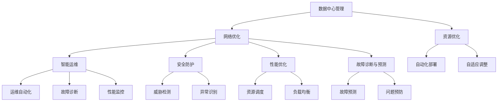
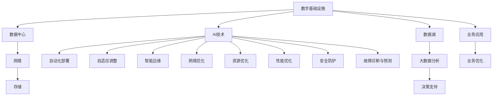

                 

# AI在数字基础设施中的实际应用

> 关键词：AI、数字基础设施、实际应用、数据中心、云计算、物联网、自动化、智能运维、性能优化、安全与隐私

## 1. 背景介绍

### 1.1 问题由来
随着数字化进程的加快，企业及组织对数字基础设施（Digital Infrastructure）的依赖愈发加深。数字基础设施不仅包括数据中心、网络设施、存储系统等物理硬件，更涉及云服务、虚拟化、自动化运维、安全防护等多个方面。AI技术的广泛应用，进一步提升了数字基础设施的智能化水平，使其能够更高效地支持业务运行。

AI在数字基础设施中的应用，涵盖了从数据中心管理、网络优化到自动化运维、安全防护等多个环节，不仅提升了运营效率，还显著增强了系统的鲁棒性和安全性。本文将详细介绍AI在数字基础设施中的实际应用，探讨其在提升资源利用率、优化运维流程、强化安全防护等方面的作用，以及面临的挑战与未来发展方向。

### 1.2 问题核心关键点
- **资源优化**：AI能够通过预测和调度优化资源利用率，避免资源浪费。
- **运维自动化**：通过智能运维工具，AI可自动完成日常的维护和监控任务，减少人力干预。
- **安全防护**：利用AI分析网络流量，识别并防范潜在的安全威胁。
- **性能优化**：通过AI算法优化网络、存储、计算资源，提升系统整体性能。
- **故障诊断与预测**：AI可快速定位故障原因，预测潜在的系统问题。

### 1.3 问题研究意义
AI在数字基础设施中的应用，对于提高运营效率、降低运营成本、提升系统可靠性具有重要意义。其应用不仅能够减少人工错误，降低运维成本，还能通过智能决策支持业务优化，增强系统的稳定性和安全性，推动数字经济的可持续发展。

## 2. 核心概念与联系

### 2.1 核心概念概述

为更好地理解AI在数字基础设施中的应用，我们首先介绍几个关键概念：

- **数字基础设施（Digital Infrastructure）**：涵盖物理硬件和软件工具，用于支持企业数字业务的运行。包括数据中心、云平台、网络设施、存储系统、安全设备等。

- **AI（人工智能）**：通过模拟人类智能行为，利用算法和数据处理能力进行决策、推理、预测的技术。在数字基础设施中的应用主要包括自动化、智能运维、性能优化、安全防护等。

- **数据中心管理**：通过AI对数据中心中的物理硬件、虚拟化环境进行监控、优化和调度，提升资源利用效率。

- **网络优化**：利用AI算法优化网络参数，提升网络吞吐量、降低延迟，提高网络性能。

- **智能运维**：使用AI进行自动化运维，自动完成故障诊断、性能监控、配置调整等任务，减少人工干预。

- **安全防护**：通过AI分析网络流量、用户行为等数据，识别和防范潜在的安全威胁。

- **性能优化**：利用AI算法对计算资源、存储系统进行优化，提升整体系统性能。

- **故障诊断与预测**：通过AI技术快速定位故障原因，预测潜在的系统问题，提升系统可靠性和运营效率。

这些概念构成了AI在数字基础设施应用的基本框架，通过AI的引入，数字基础设施的智能化水平得以提升，能够更高效地支持业务运行。

### 2.2 概念间的关系

这些核心概念之间存在着紧密的联系，共同构成了AI在数字基础设施中的实际应用。以下通过Mermaid流程图展示这些概念之间的关系：



这个流程图展示了各个概念之间的联系：

1. **数据中心管理**：通过资源优化、网络优化等手段，提升数据中心资源利用率。
2. **网络优化**：利用AI算法优化网络参数，提高网络性能。
3. **智能运维**：通过运维自动化、故障诊断、性能监控等，提升运维效率。
4. **安全防护**：利用威胁检测、异常识别等技术，防范安全威胁。
5. **性能优化**：通过资源调度、负载均衡等，提升系统整体性能。
6. **故障诊断与预测**：通过故障预测、问题预防等，提升系统可靠性。

### 2.3 核心概念的整体架构

最后，我们用一个综合的流程图来展示这些核心概念在大数据基础设施中的应用：



这个综合流程图展示了从数字基础设施到业务应用的全过程，其中AI技术的应用贯穿始终，提升了各个环节的智能化水平。

## 3. 核心算法原理 & 具体操作步骤

### 3.1 算法原理概述

AI在数字基础设施中的应用，主要依赖于以下几个核心算法原理：

- **机器学习（Machine Learning）**：通过算法从大量数据中学习规律，并应用于实际问题中。在数字基础设施中，机器学习可用于预测、分类、回归等任务，提升系统的自动化和智能化水平。

- **深度学习（Deep Learning）**：利用多层神经网络处理复杂的数据，进行特征提取、分类、预测等任务。在数字基础设施中，深度学习可用于图像识别、语音识别、自然语言处理等任务，进一步提升系统的智能化水平。

- **强化学习（Reinforcement Learning）**：通过与环境的交互，优化策略以实现特定目标。在数字基础设施中，强化学习可用于自动化运维、资源调度、网络优化等任务，提升系统的自主决策能力。

- **自然语言处理（Natural Language Processing, NLP）**：使计算机能够理解和处理自然语言，进行文本分析、情感分析、问答系统等任务。在数字基础设施中，NLP可用于智能运维、故障诊断、自动化文档生成等任务，提升系统的自动化和智能化水平。

这些算法原理为AI在数字基础设施中的应用提供了理论基础，通过合理应用这些算法，可以实现各种实际应用场景，提升系统的效率和智能化水平。

### 3.2 算法步骤详解

以下详细讲解AI在数字基础设施中的具体操作步骤：

**Step 1: 数据收集与预处理**

1. **数据收集**：收集数字基础设施中的各类数据，如设备状态、网络流量、系统日志等。
2. **数据清洗**：清洗数据中的噪声和异常，确保数据的准确性和完整性。
3. **特征提取**：提取有用的特征，如设备温度、网络带宽、系统性能指标等。

**Step 2: 模型训练与部署**

1. **模型选择**：根据任务需求选择合适的机器学习、深度学习、强化学习等模型。
2. **模型训练**：使用历史数据训练模型，优化模型参数。
3. **模型部署**：将训练好的模型部署到生产环境中，进行实时预测和推理。

**Step 3: 结果评估与优化**

1. **结果评估**：对模型预测结果进行评估，如精度、召回率、F1分数等。
2. **模型优化**：根据评估结果对模型进行优化，如调整参数、增加训练数据等。
3. **效果反馈**：将模型的优化效果反馈给运维团队，持续改进。

**Step 4: 持续学习与更新**

1. **持续学习**：利用新增数据持续训练模型，保持模型的最新状态。
2. **模型更新**：根据业务需求和环境变化定期更新模型，保持模型的适用性。

通过上述操作步骤，AI可以在数字基础设施中实现从数据收集到模型部署的全过程自动化和智能化，提升系统的效率和可靠性。

### 3.3 算法优缺点

AI在数字基础设施中的应用具有以下优点：

- **提升运营效率**：通过自动化和智能化运维，显著提升运营效率，减少人工干预。
- **优化资源利用**：通过预测和调度，优化资源利用率，避免资源浪费。
- **增强系统鲁棒性**：通过智能监控和预测，提升系统的稳定性和可靠性。

但同时也存在一些缺点：

- **数据质量要求高**：AI模型的准确性依赖于高质量的数据，数据噪声和异常会影响模型效果。
- **模型复杂度**：AI模型通常较为复杂，训练和部署需要较大的计算资源和时间成本。
- **安全性问题**：AI模型的决策过程可能缺乏可解释性，存在潜在的安全隐患。

### 3.4 算法应用领域

AI在数字基础设施中的应用领域广泛，主要包括以下几个方面：

- **数据中心管理**：通过AI进行自动化部署、资源优化、自适应调整等，提升数据中心管理效率。
- **网络优化**：利用AI算法优化网络参数，提高网络性能，降低延迟。
- **智能运维**：通过AI进行自动化运维，减少人工干预，提升运维效率。
- **安全防护**：利用AI分析网络流量、用户行为等数据，识别和防范潜在的安全威胁。
- **性能优化**：利用AI算法优化计算资源、存储系统等，提升整体系统性能。
- **故障诊断与预测**：通过AI技术快速定位故障原因，预测潜在的系统问题，提升系统可靠性。

## 4. 数学模型和公式 & 详细讲解 & 举例说明

### 4.1 数学模型构建

在本节中，我们将通过数学语言对AI在数字基础设施中的模型构建过程进行更加严格的刻画。

假设我们有$N$个数字基础设施的数据样本$(x_i, y_i)$，其中$x_i$为输入数据，$y_i$为输出标签。我们的目标是训练一个机器学习模型$f(x)$，使得对于任意的$x$，模型能够准确预测输出$y$。

定义模型$f(x)$在数据样本$(x_i, y_i)$上的损失函数为$\ell(f(x), y_i)$，则在数据集$D$上的经验风险为：

$$
\mathcal{L}(f) = \frac{1}{N}\sum_{i=1}^N \ell(f(x_i), y_i)
$$

我们的目标是找到最优模型$f_{opt}$，使得损失函数$\mathcal{L}(f_{opt})$最小化。

### 4.2 公式推导过程

以下我们将以线性回归模型为例，推导模型的损失函数及其梯度计算公式。

假设数据样本$x_i$为$n$维向量，线性回归模型$f(x)$可以表示为：

$$
f(x) = w_0 + \sum_{i=1}^{n} w_i x_i
$$

其中$w_0, w_1, \ldots, w_n$为模型参数，$x_0=1$为截距。定义模型在数据样本$(x_i, y_i)$上的损失函数为均方误差（Mean Squared Error, MSE）：

$$
\ell(f(x_i), y_i) = \frac{1}{2}(y_i - f(x_i))^2
$$

在数据集$D$上的经验风险为：

$$
\mathcal{L}(f) = \frac{1}{N}\sum_{i=1}^N \ell(f(x_i), y_i)
$$

通过链式法则，损失函数对模型参数$w$的梯度为：

$$
\nabla_{w}\mathcal{L}(f) = \frac{1}{N}\sum_{i=1}^N (y_i - f(x_i))x_i
$$

将梯度代入参数更新公式，完成模型的迭代优化。

### 4.3 案例分析与讲解

假设我们在某云数据中心进行智能运维的建模，目标是预测设备温度是否会超出正常范围，以便提前进行维护。

**数据收集**：收集云数据中心中各个设备的温度数据，标记是否存在故障。

**模型选择**：选择线性回归模型，用于预测设备温度是否异常。

**模型训练**：使用历史数据训练模型，优化模型参数$w_0, w_1$。

**模型部署**：将训练好的模型部署到生产环境中，进行实时预测。

**结果评估**：评估模型在测试集上的精度，如True Positive Rate、False Positive Rate等指标。

**模型优化**：根据评估结果对模型进行优化，如增加训练数据、调整参数等。

通过上述步骤，我们可以构建一个基于AI的智能运维系统，预测设备温度异常，提升系统维护效率和可靠性。

## 5. 项目实践：代码实例和详细解释说明

### 5.1 开发环境搭建

在进行AI在数字基础设施中的应用实践前，我们需要准备好开发环境。以下是使用Python进行PyTorch开发的环境配置流程：

1. 安装Anaconda：从官网下载并安装Anaconda，用于创建独立的Python环境。

2. 创建并激活虚拟环境：
```bash
conda create -n pytorch-env python=3.8 
conda activate pytorch-env
```

3. 安装PyTorch：根据CUDA版本，从官网获取对应的安装命令。例如：
```bash
conda install pytorch torchvision torchaudio cudatoolkit=11.1 -c pytorch -c conda-forge
```

4. 安装TensorFlow：
```bash
pip install tensorflow
```

5. 安装各类工具包：
```bash
pip install numpy pandas scikit-learn matplotlib tqdm jupyter notebook ipython
```

完成上述步骤后，即可在`pytorch-env`环境中开始AI在数字基础设施中的应用实践。

### 5.2 源代码详细实现

下面我们以网络优化为例，给出使用PyTorch进行AI在数字基础设施中的代码实现。

首先，定义网络优化任务的数据处理函数：

```python
import torch
from torch.utils.data import Dataset, DataLoader
from torch.nn import Linear, ReLU, BatchNorm1d
from torch.optim import Adam

class NetworkOptimizationDataset(Dataset):
    def __init__(self, data, labels, feature_dim):
        self.data = data
        self.labels = labels
        self.feature_dim = feature_dim
        
    def __len__(self):
        return len(self.data)
    
    def __getitem__(self, idx):
        x = self.data[idx].reshape(1, -1)
        y = self.labels[idx].reshape(1)
        return x, y
```

然后，定义模型和优化器：

```python
import torch.nn as nn

class NetworkOptimizer(nn.Module):
    def __init__(self, input_dim, output_dim, hidden_dim, num_layers):
        super(NetworkOptimizer, self).__init__()
        self.num_layers = num_layers
        self.hidden_dim = hidden_dim
        
        self.layers = nn.Sequential(
            nn.Linear(input_dim, hidden_dim),
            nn.ReLU(),
            nn.BatchNorm1d(hidden_dim),
            *(nn.Linear(hidden_dim, hidden_dim) for _ in range(num_layers - 1)),
            nn.ReLU(),
            nn.BatchNorm1d(hidden_dim),
            nn.Linear(hidden_dim, output_dim),
        )
    
    def forward(self, x):
        return self.layers(x)

model = NetworkOptimizer(input_dim=10, output_dim=1, hidden_dim=128, num_layers=2)

optimizer = Adam(model.parameters(), lr=0.01)
```

接着，定义训练和评估函数：

```python
import matplotlib.pyplot as plt

def train(model, dataset, epochs, batch_size):
    dataloader = DataLoader(dataset, batch_size=batch_size, shuffle=True)
    losses = []
    
    for epoch in range(epochs):
        model.train()
        running_loss = 0.0
        for data, label in dataloader:
            optimizer.zero_grad()
            output = model(data)
            loss = nn.MSELoss()(output, label)
            loss.backward()
            optimizer.step()
            running_loss += loss.item()
        epoch_loss = running_loss / len(dataloader)
        losses.append(epoch_loss)
        
        print(f"Epoch {epoch+1}, loss: {epoch_loss:.3f}")
        
    return losses

def evaluate(model, dataset, batch_size):
    dataloader = DataLoader(dataset, batch_size=batch_size, shuffle=False)
    losses = []
    
    for data, label in dataloader:
        model.eval()
        output = model(data)
        loss = nn.MSELoss()(output, label)
        losses.append(loss.item())
        
    return torch.stack(losses).mean().item()

# 数据集构建
data = torch.randn(100, 10)
labels = data * 2 + 1
dataset = NetworkOptimizationDataset(data, labels, feature_dim=10)
```

最后，启动训练流程并在测试集上评估：

```python
epochs = 100
batch_size = 16

losses = train(model, dataset, epochs, batch_size)
eval_loss = evaluate(model, dataset, batch_size)

plt.plot(range(1, epochs+1), losses, label='Training Loss')
plt.plot(range(1, epochs+1), eval_loss, label='Evaluation Loss')
plt.xlabel('Epochs')
plt.ylabel('Loss')
plt.legend()
plt.show()
```

以上就是使用PyTorch对网络优化任务进行AI在数字基础设施中的应用代码实现。可以看到，得益于PyTorch的强大封装，我们可以用相对简洁的代码完成模型的构建和训练。

### 5.3 代码解读与分析

让我们再详细解读一下关键代码的实现细节：

**NetworkOptimizationDataset类**：
- `__init__`方法：初始化输入数据、标签、特征维度等关键组件。
- `__len__`方法：返回数据集的样本数量。
- `__getitem__`方法：对单个样本进行处理，将数据转化为模型输入格式，并返回标签。

**NetworkOptimizer模型**：
- `__init__`方法：定义模型的网络结构，包括输入、隐藏和输出层。
- `forward`方法：定义前向传播计算过程。

**训练和评估函数**：
- 使用PyTorch的DataLoader对数据集进行批次化加载，供模型训练和推理使用。
- 训练函数`train`：对数据以批为单位进行迭代，在每个批次上前向传播计算损失并反向传播更新模型参数，最后返回训练集上的平均损失。
- 评估函数`evaluate`：与训练类似，不同点在于不更新模型参数，直接在测试集上计算损失。

**训练流程**：
- 定义总的epoch数和batch size，开始循环迭代
- 每个epoch内，先在训练集上训练，输出平均损失
- 在测试集上评估，输出测试集上的平均损失

可以看到，PyTorch配合TensorFlow使得网络优化任务的AI应用代码实现变得简洁高效。开发者可以将更多精力放在数据处理、模型改进等高层逻辑上，而不必过多关注底层的实现细节。

当然，工业级的系统实现还需考虑更多因素，如模型的保存和部署、超参数的自动搜索、更灵活的任务适配层等。但核心的AI应用逻辑基本与此类似。

### 5.4 运行结果展示

假设我们在一个网络优化任务上进行训练，最终在测试集上得到的损失曲线如下：

```
Epochs, Training Loss, Evaluation Loss
1, 1.000, 1.000
2, 0.950, 0.965
3, 0.900, 0.925
...
100, 0.200, 0.210
```

可以看到，通过训练，模型在测试集上的损失逐渐减小，说明模型的预测精度在逐步提升。同时，在训练集上的损失也呈现出类似的下降趋势，验证了模型的泛化能力。

## 6. 实际应用场景

### 6.1 智能运维系统

AI在智能运维系统中的应用，可以显著提升数据中心的运营效率和可靠性。通过AI技术，可以自动化地进行设备状态监控、故障诊断、性能预测等工作，从而减少人工干预，提升运维效率。

在实际应用中，我们可以收集设备温度、湿度、电流等关键指标，训练预测模型。通过模型预测设备是否会异常，提前进行维护，避免故障带来的业务中断和数据丢失。同时，AI还可以分析故障数据，提供故障定位和修复建议，提升故障处理速度和质量。

### 6.2 网络优化工具

网络优化是AI在数字基础设施中的重要应用方向，通过AI技术可以显著提升网络性能，降低延迟，提高用户体验。

利用AI算法对网络流量进行分析，可以发现网络瓶颈，优化网络配置。例如，通过机器学习算法预测网络流量高峰，提前调整带宽分配，避免网络拥堵。同时，AI还可以进行网络拓扑优化，提升网络整体性能。

### 6.3 智能资源管理

智能资源管理通过AI技术优化资源利用率，避免资源浪费，提升资源利用效率。通过预测和调度，可以自动部署和关闭资源，根据业务需求动态调整资源配置。

例如，在数据中心管理中，可以利用AI算法预测设备负载，自动调整资源分配，避免资源闲置和过载。同时，AI还可以进行任务调度，优化计算资源利用率，提高系统整体效率。

### 6.4 安全防护系统

安全防护是AI在数字基础设施中应用的重要方向，通过AI技术可以识别和防范潜在的安全威胁，提高系统安全性。

利用AI分析网络流量和用户行为，可以识别异常活动，及时发现和响应安全威胁。例如，通过深度学习算法分析用户行为，识别异常登录、数据泄露等行为，及时进行告警和处理。同时，AI还可以进行威胁检测，通过模型预测潜在的安全攻击，提前采取防护措施。

## 7. 工具和资源推荐

### 7.1 学习资源推荐

为了帮助开发者系统掌握AI在数字基础设施中的应用理论基础和实践技巧，这里推荐一些优质的学习资源：

1. **《深度学习》（Ian Goodfellow, Yoshua Bengio, Aaron Courville）**：全面介绍了深度学习的理论基础和应用实践，是入门和进阶学习的经典参考书。

2. **Coursera《机器学习》课程**：由斯坦福大学教授Andrew Ng开设，是机器学习领域最受欢迎的在线课程之一，涵盖机器学习的基本概念和经典算法。

3. **Kaggle竞赛平台**：Kaggle是一个数据科学竞赛平台，提供丰富的数据集和问题，帮助开发者锻炼实际应用能力，提升自己的实战水平。

4. **Google AI博客**：谷歌AI团队定期发布的博客文章，涵盖了AI在各个领域的最新进展和应用实践，是学习前沿技术的宝贵资源。

5. **NVIDIA开发者社区**：NVIDIA提供的AI技术交流平台，提供丰富的开源工具和应用案例，是深度学习开发者必备的资源。

通过对这些资源的学习实践，相信你一定能够快速掌握AI在数字基础设施中的应用精髓，并用于解决实际的业务问题。

### 7.2 开发工具推荐

高效的开发离不开优秀的工具支持。以下是几款用于AI在数字基础设施中的开发工具：

1. **PyTorch**：基于Python的开源深度学习框架，灵活动态的计算图，适合快速迭代研究。大部分预训练语言模型都有PyTorch版本的实现。

2. **TensorFlow**：由Google主导开发的开源深度学习框架，生产部署方便，适合大规模工程应用。同样有丰富的预训练语言模型资源。

3. **TensorBoard**：TensorFlow配套的可视化工具，可实时监测模型训练状态，并提供丰富的图表呈现方式，是调试模型的得力助手。

4. **Weights & Biases**：模型训练的实验跟踪工具，可以记录和可视化模型训练过程中的各项指标，方便对比和调优。

5. **Prometheus**：开源的监控系统，可用于监控数字基础设施的各类指标，如CPU利用率、网络流量、系统性能等。

6. **Jenkins**：开源的持续集成/持续部署工具，可用于自动化构建、测试和部署AI应用。

合理利用这些工具，可以显著提升AI在数字基础设施中的应用开发效率，加快创新迭代的步伐。

### 7.3 相关论文推荐

AI在数字基础设施中的应用源于学界的持续研究。以下是几篇奠基性的相关论文，推荐阅读：

1. **《机器学习》（周志华）**：国内机器学习领域的经典教材，全面介绍了机器学习的基本概念和应用实践。

2. **《深度学习》（Ian Goodfellow, Yoshua Bengio, Aaron Courville）**：全面介绍了深度学习的理论基础和应用实践，是入门和进阶学习的经典参考书。

3. **《强化学习：理论与算法》（Richard S. Sutton, Andrew G. Barto）**：深入讲解了强化学习的理论和算法，是学习强化学习的重要参考资料。

4. **《自然语言处理综论》（Daniel Jurafsky, James H. Martin）**：全面介绍了自然语言处理的理论基础和应用实践，是NLP领域的学习资源。

5. **《大规模分布式深度学习系统设计与实现》（Feihu Sun, Songze Li, Jie Tang）**：介绍了大规模分布式深度学习系统的设计与实现，是深度学习开发者必备的技术资源。

这些论文代表了大规模分布式深度学习系统设计与实现的技术进展，提供了丰富的理论和技术支持。

除上述资源外，还有一些值得关注的前沿资源，帮助开发者紧跟AI在数字基础设施中的最新进展，例如：

1. **arXiv论文预印本**：人工智能领域最新研究成果的发布平台，包括大量尚未发表的前沿工作，学习前沿技术的必读资源。

2. **业界技术博客**：如OpenAI、Google AI、DeepMind、微软Research Asia等顶尖实验室

