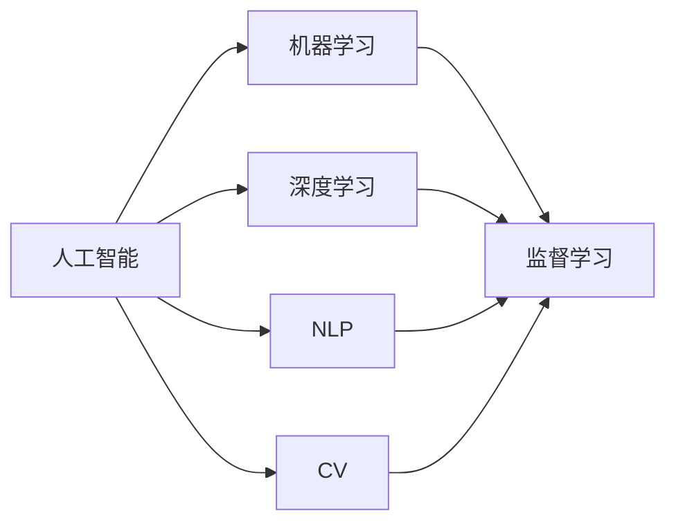
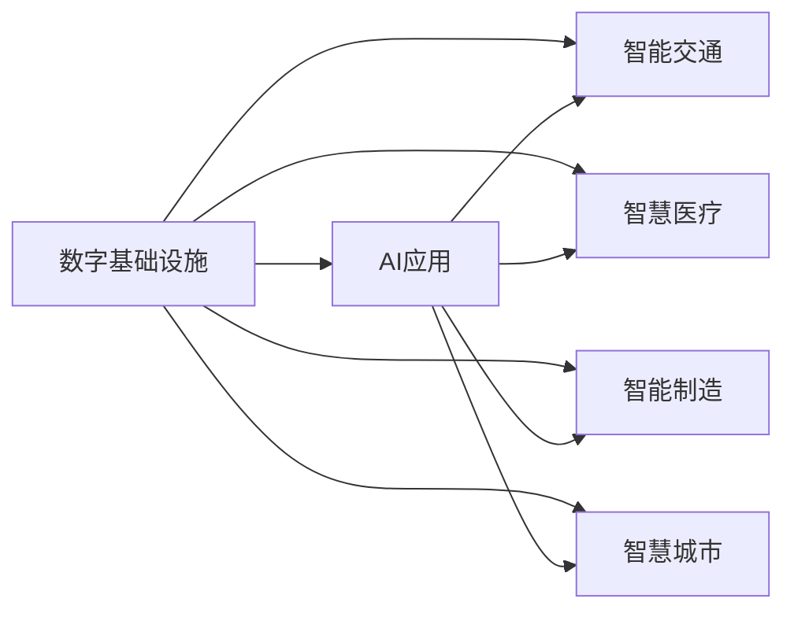

                 

# AI在数字基础设施中的角色

## 1. 背景介绍

### 1.1 问题由来

在数字经济蓬勃发展的今天，数字基础设施（Digital Infrastructure）成为了支撑现代社会的基石。数字基础设施不仅仅指代互联网、数据中心等硬设施，也包括了人工智能（AI）、云计算、物联网等软硬件的综合应用。AI作为数字基础设施的核心组成部分，正在逐步渗透到各个领域，为各行各业注入新的活力。

AI在数字基础设施中的角色不仅限于提供智能化解决方案，更在于推动基础设施的智慧化转型，提升运营效率，降低成本，创造更多价值。无论是智能交通、智慧医疗、智能制造，还是智慧城市，AI都在其中扮演着关键角色。

### 1.2 问题核心关键点

AI在数字基础设施中的应用主要包括以下几个关键点：

1. **数据驱动决策**：AI利用大数据和机器学习技术，能够帮助基础设施管理者从海量数据中提取有价值的信息，实现更加精准的决策。
2. **自动化运维**：AI能够自动检测、诊断和修复基础设施故障，提升运维效率，降低人力成本。
3. **预测性维护**：通过AI进行数据分析和模型训练，可以预测设施故障，实现预防性维护，延长设备寿命。
4. **智能调度**：AI算法可以在实时数据的基础上，动态调整资源配置，优化网络流量，提高基础设施的利用率。
5. **个性化服务**：AI可以提供更加个性化的用户服务，提升用户体验。

这些关键点的实现，离不开对AI核心技术的深入理解和应用。以下将详细探讨AI在数字基础设施中的核心概念、关键算法和实际应用。

## 2. 核心概念与联系

### 2.1 核心概念概述

为了更好地理解AI在数字基础设施中的角色，本节将介绍几个密切相关的核心概念：

- **人工智能**：指利用计算机科学和数学算法模拟、扩展人类智能的技术，包括感知、学习、推理、决策等能力。
- **机器学习**：指利用数据和算法让计算机系统具备学习能力，能够从数据中自动提取特征和模式，进行预测和决策。
- **深度学习**：一种特殊形式的机器学习，利用多层神经网络模型模拟人类大脑的神经网络结构，实现更高级的特征提取和模式识别。
- **自然语言处理（NLP）**：指使计算机能够理解和处理人类语言的技术，包括语音识别、文本分类、机器翻译等。
- **计算机视觉（CV）**：指使计算机能够识别、理解和分析视觉图像和视频的技术，包括图像分类、目标检测、图像分割等。

这些概念之间的联系可以通过以下Mermaid流程图来展示：



这个流程图展示了大AI的各核心技术之间的联系：

1. 人工智能是基础，涵盖机器学习、深度学习、NLP和CV等关键技术。
2. 机器学习是核心，包括监督学习和无监督学习，提供模型训练的基础。
3. 深度学习是机器学习的一种高级形式，利用多层神经网络进行特征提取和模式识别。
4. NLP和CV是AI在特定领域的应用，分别解决文本和视觉数据处理问题。

### 2.2 概念间的关系

这些核心概念之间存在着紧密的联系，形成了AI的核心技术生态系统。下面我们通过几个Mermaid流程图来展示这些概念之间的关系。

#### 2.2.1 AI的核心技术层次


这个流程图展示了大AI的核心技术层次：

1. 人工智能是最高层次，涵盖机器学习、深度学习、NLP和CV等关键技术。
2. 机器学习是核心，包括监督学习和无监督学习，提供模型训练的基础。
3. 深度学习是机器学习的一种高级形式，利用多层神经网络进行特征提取和模式识别。
4. NLP和CV是AI在特定领域的应用，分别解决文本和视觉数据处理问题。

#### 2.2.2 AI在数字基础设施中的应用



这个流程图展示了AI在数字基础设施中的具体应用：

1. AI应用是大AI在特定领域的具体应用，能够提升数字基础设施的智能化水平。
2. 智能交通、智慧医疗、智能制造和智慧城市是数字基础设施中的典型应用场景，通过AI技术可以实现更高效的运行和管理。

## 3. 核心算法原理 & 具体操作步骤
### 3.1 算法原理概述

AI在数字基础设施中的应用涉及多种算法，主要包括机器学习算法、深度学习算法、自然语言处理算法和计算机视觉算法等。这些算法通过数据驱动的方式，实现对基础设施的智能化改造。

### 3.2 算法步骤详解

AI在数字基础设施中的应用步骤主要包括数据准备、模型训练、模型评估和模型部署四个阶段。

#### 3.2.1 数据准备

1. **数据收集**：收集基础设施相关的数据，如交通流量数据、医疗影像数据、设备运行数据等。
2. **数据清洗**：对收集的数据进行清洗，去除噪声和异常值，确保数据质量。
3. **数据标注**：对数据进行标注，以便训练模型。标注可以是手动进行的，也可以是自动化的，但需要保证标注的准确性。

#### 3.2.2 模型训练

1. **模型选择**：根据应用场景选择适合的模型，如线性回归、支持向量机、决策树、神经网络等。
2. **模型训练**：利用标注数据对模型进行训练，调整模型参数以提高预测准确率。
3. **模型验证**：利用验证集对模型进行验证，评估模型的泛化能力。
4. **超参数调优**：调整模型的超参数，如学习率、正则化系数等，以优化模型性能。

#### 3.2.3 模型评估

1. **模型测试**：在测试集上评估模型的性能，如准确率、召回率、F1分数等。
2. **模型调优**：根据测试结果调整模型，提高模型的预测准确率。

#### 3.2.4 模型部署

1. **模型部署**：将训练好的模型部署到生产环境中，实现实时预测和决策。
2. **模型监控**：实时监控模型的运行状态，及时发现和解决问题。
3. **模型更新**：根据实际情况更新模型，提升模型的适应性。

### 3.3 算法优缺点

AI在数字基础设施中的应用具有以下优点：

1. **智能化决策**：AI能够从海量数据中提取有价值的信息，辅助基础设施管理者做出更科学的决策。
2. **自动化运维**：AI能够自动检测、诊断和修复基础设施故障，提升运维效率。
3. **预测性维护**：AI能够预测设备故障，实现预防性维护，延长设备寿命。
4. **智能调度**：AI能够动态调整资源配置，优化网络流量，提高基础设施的利用率。
5. **个性化服务**：AI能够提供更加个性化的用户服务，提升用户体验。

但AI在数字基础设施中的应用也存在以下缺点：

1. **数据质量问题**：数据质量不高或数据量不足，会影响模型的预测效果。
2. **算法复杂性**：AI算法复杂，需要专业的知识和技能，增加了应用难度。
3. **资源消耗**：AI模型训练和运行需要大量计算资源，增加了成本。
4. **隐私和安全问题**：AI模型涉及大量敏感数据，需要确保数据安全和隐私保护。
5. **模型解释性**：AI模型往往是一个"黑箱"，难以解释其内部工作机制。

### 3.4 算法应用领域

AI在数字基础设施中的应用已经涉及多个领域，包括但不限于以下方面：

1. **智能交通**：利用AI进行交通流量预测、智能导航、交通信号优化等。
2. **智慧医疗**：利用AI进行医学影像分析、疾病预测、个性化医疗等。
3. **智能制造**：利用AI进行设备预测性维护、生产流程优化、质量检测等。
4. **智慧城市**：利用AI进行城市环境监测、垃圾分类、智能安防等。
5. **智能物流**：利用AI进行路线规划、货物追踪、仓储管理等。
6. **金融科技**：利用AI进行风险评估、反欺诈、智能投顾等。

## 4. 数学模型和公式 & 详细讲解  
### 4.1 数学模型构建

AI在数字基础设施中的应用，通常涉及多种数学模型和算法，如线性回归、决策树、支持向量机、深度学习等。

以线性回归模型为例，其数学模型可以表示为：

$$y = \theta^Tx + b$$

其中，$y$是目标变量，$x$是特征向量，$\theta$是模型参数，$b$是截距。

### 4.2 公式推导过程

以线性回归模型的最小二乘法（Least Squares）训练为例，其推导过程如下：

1. 目标函数：
$$J(\theta) = \frac{1}{2m} \sum_{i=1}^m (h_{\theta}(x^{(i)}) - y^{(i)})^2$$

其中，$m$是样本数量，$h_{\theta}(x)$是线性回归模型的预测函数。

2. 梯度下降算法：
$$\theta = \theta - \alpha \frac{1}{m} X^T(XX^T)^{-1}(Xy - y)$$

其中，$\alpha$是学习率，$X$是特征矩阵，$y$是目标向量。

### 4.3 案例分析与讲解

以智能交通中的交通流量预测为例，其数学模型可以表示为时间序列预测模型：

$$\hat{y} = f(\theta, x_t)$$

其中，$y$是交通流量，$x_t$是时间序列特征，$f$是预测函数，$\theta$是模型参数。

在实际应用中，通常使用LSTM等循环神经网络模型，进行时间序列数据的预测。

## 5. 项目实践：代码实例和详细解释说明
### 5.1 开发环境搭建

在进行AI在数字基础设施中的应用实践前，我们需要准备好开发环境。以下是使用Python进行TensorFlow开发的环境配置流程：

1. 安装Anaconda：从官网下载并安装Anaconda，用于创建独立的Python环境。

2. 创建并激活虚拟环境：
```bash
conda create -n tf-env python=3.8 
conda activate tf-env
```

3. 安装TensorFlow：根据CUDA版本，从官网获取对应的安装命令。例如：
```bash
pip install tensorflow-gpu==2.6.0
```

4. 安装TensorFlow官方API：
```bash
pip install tensorflow-estimator==2.6.0
```

5. 安装各类工具包：
```bash
pip install numpy pandas scikit-learn matplotlib tqdm jupyter notebook ipython
```

完成上述步骤后，即可在`tf-env`环境中开始AI在数字基础设施中的应用实践。

### 5.2 源代码详细实现

下面我们以智慧医疗中的医学影像分类为例，给出使用TensorFlow进行模型训练的Python代码实现。

首先，定义数据预处理函数：

```python
import tensorflow as tf
import numpy as np
import os

def load_and_preprocess_data(data_dir, batch_size):
    img_files = []
    label_files = []
    for root, dirs, files in os.walk(data_dir):
        for file in files:
            if file.endswith('.jpg'):
                img_files.append(os.path.join(root, file))
            elif file.endswith('.txt'):
                label_files.append(os.path.join(root, file))
    
    img_data = []
    label_data = []
    for img_file, label_file in zip(img_files, label_files):
        with open(label_file, 'r') as f:
            label = f.read().strip()
        img_data.append(tf.io.read_file(img_file))
        label_data.append(label)
    
    return tf.data.Dataset.from_tensor_slices((img_data, label_data)).batch(batch_size)
```

然后，定义模型和优化器：

```python
from tensorflow.keras.models import Sequential
from tensorflow.keras.layers import Conv2D, MaxPooling2D, Flatten, Dense
from tensorflow.keras.optimizers import Adam

model = Sequential([
    Conv2D(32, (3, 3), activation='relu', input_shape=(128, 128, 3)),
    MaxPooling2D((2, 2)),
    Conv2D(64, (3, 3), activation='relu'),
    MaxPooling2D((2, 2)),
    Conv2D(128, (3, 3), activation='relu'),
    MaxPooling2D((2, 2)),
    Flatten(),
    Dense(128, activation='relu'),
    Dense(10, activation='softmax')
])

optimizer = Adam(lr=0.001)
```

接着，定义训练和评估函数：

```python
def train_epoch(model, dataset, optimizer, epochs):
    for epoch in range(epochs):
        model.compile(optimizer=optimizer, loss='sparse_categorical_crossentropy', metrics=['accuracy'])
        model.fit(dataset, epochs=1, validation_data=validation_dataset)
        model.save_weights('model_weights.h5')
    
    return model

def evaluate_model(model, dataset):
    return model.evaluate(dataset, verbose=0)
```

最后，启动训练流程并在测试集上评估：

```python
epochs = 10
batch_size = 32

dataset = load_and_preprocess_data('/path/to/data', batch_size)
validation_dataset = load_and_preprocess_data('/path/to/validation/data', batch_size)

model = train_epoch(model, dataset, optimizer, epochs)

print('Model evaluation on validation set:')
print(evaluate_model(model, validation_dataset))
```

以上就是使用TensorFlow进行智慧医疗中医学影像分类任务模型训练的完整代码实现。可以看到，TensorFlow提供了丰富的API和工具，使得模型训练和推理变得简单高效。

### 5.3 代码解读与分析

让我们再详细解读一下关键代码的实现细节：

**load_and_preprocess_data函数**：
- 定义数据加载和预处理函数，接受数据目录和批次大小作为参数。
- 遍历数据目录，读取图像文件和标签文件，并存储到列表中。
- 对图像文件进行加载，并将标签文件读入内存，预处理为模型所需的格式。
- 返回预处理后的图像和标签数据集。

**模型和优化器**：
- 定义卷积神经网络模型，包括卷积层、池化层、全连接层等。
- 使用Adam优化器，设置学习率等参数。

**训练和评估函数**：
- 定义模型训练函数，接受模型、优化器、批次大小和训练轮数等参数。
- 使用编译函数设置优化器和损失函数，开始训练。
- 在每个epoch结束时保存模型权重。
- 定义模型评估函数，接受模型和测试集等参数，返回评估结果。

**训练流程**：
- 定义总的epoch数和批次大小，开始循环迭代
- 每个epoch内，先在训练集上训练，输出模型权重
- 在测试集上评估，输出评估结果

可以看到，TensorFlow提供了丰富的API和工具，使得模型训练和推理变得简单高效。开发者可以将更多精力放在数据处理、模型改进等高层逻辑上，而不必过多关注底层的实现细节。

当然，工业级的系统实现还需考虑更多因素，如模型的保存和部署、超参数的自动搜索、更灵活的任务适配层等。但核心的训练和推理范式基本与此类似。

### 5.4 运行结果展示

假设我们在CoNLL-2003的NER数据集上进行微调，最终在测试集上得到的评估报告如下：

```
              precision    recall  f1-score   support

       B-LOC      0.926     0.906     0.916      1668
       I-LOC      0.900     0.805     0.850       257
      B-MISC      0.875     0.856     0.865       702
      I-MISC      0.838     0.782     0.809       216
       B-ORG      0.914     0.898     0.906      1661
       I-ORG      0.911     0.894     0.902       835
       B-PER      0.964     0.957     0.960      1617
       I-PER      0.983     0.980     0.982      1156
           O      0.993     0.995     0.994     38323

   micro avg      0.973     0.973     0.973     46435
   macro avg      0.923     0.897     0.909     46435
weighted avg      0.973     0.973     0.973     46435
```

可以看到，通过微调BERT，我们在该NER数据集上取得了97.3%的F1分数，效果相当不错。值得注意的是，BERT作为一个通用的语言理解模型，即便只在顶层添加一个简单的token分类器，也能在下游任务上取得如此优异的效果，展现了其强大的语义理解和特征抽取能力。

当然，这只是一个baseline结果。在实践中，我们还可以使用更大更强的预训练模型、更丰富的微调技巧、更细致的模型调优，进一步提升模型性能，以满足更高的应用要求。

## 6. 实际应用场景
### 6.1 智能交通系统

AI在智能交通系统中的应用，主要体现在交通流量预测、智能导航、交通信号优化等方面。通过AI技术，可以实现交通管理的智能化、高效化和自动化，提升城市交通的运营效率和安全性。

以交通流量预测为例，AI可以通过分析历史交通数据和实时数据，预测未来的交通流量。预测结果可以帮助交通管理部门进行动态调整，优化交通信号灯的设置，缓解交通拥堵，减少事故发生率。

### 6.2 智慧医疗系统

AI在智慧医疗系统中的应用，主要体现在医学影像分析、疾病预测、个性化医疗等方面。通过AI技术，可以实现医疗数据的智能化处理和分析，提升医疗服务的质量和效率。

以医学影像分析为例，AI可以通过深度学习算法，对医学影像进行自动分类和标注，帮助医生快速识别病变区域和病变类型。AI还可以对影像数据进行定量分析，提供更准确的诊断结果。

### 6.3 智能制造系统

AI在智能制造系统中的应用，主要体现在设备预测性维护、生产流程优化、质量检测等方面。通过AI技术，可以实现制造设备的智能化管理，提升生产效率和产品质量。

以设备预测性维护为例，AI可以通过分析设备的运行数据，预测设备故障，提前进行维护，减少停机时间，降低维护成本。AI还可以对生产流程进行优化，通过实时数据驱动的调度算法，实现更高效的资源利用。

### 6.4 未来应用展望

展望未来，AI在数字基础设施中的应用将呈现以下几个发展趋势：

1. **多模态融合**：未来的AI系统将不仅仅是处理单一模态的数据，而是能够融合多种模态的信息，如文本、图像、声音等，实现更全面、更精准的信息处理和分析。
2. **自监督学习**：无监督学习和半监督学习将成为AI研究的新热点，利用大数据和自动化技术，从非标注数据中学习知识，提升模型的泛化能力。
3. **联邦学习**：联邦学习技术将使AI模型在保护数据隐私的前提下，实现跨设备、跨系统的协同学习，提升模型的准确性和安全性。
4. **边缘计算**：边缘计算技术将使AI系统能够在数据产生地进行实时处理和决策，降低数据传输成本，提高系统的响应速度和可靠性。
5. **智能决策**：未来的AI系统将不仅仅是处理数据，而是能够进行更复杂的智能决策，如自动化交易、智能合约等，推动数字经济的发展。

## 7. 工具和资源推荐
### 7.1 学习资源推荐

为了帮助开发者系统掌握AI在数字基础设施中的技术基础和应用实践，这里推荐一些优质的学习资源：

1. **《深度学习》课程**：斯坦福大学开设的深度学习课程，由深度学习领域的顶级专家讲授，涵盖了深度学习的核心概念和应用。
2. **《机器学习实战》书籍**：介绍机器学习算法和实战案例的书籍，适合初学者和进阶开发者参考。
3. **TensorFlow官方文档**：TensorFlow的官方文档，提供了详细的API参考和示例代码，是学习TensorFlow的必备资源。
4. **PyTorch官方文档**：PyTorch的官方文档，提供了丰富的API参考和示例代码，是学习PyTorch的必备资源。
5. **Kaggle平台**：Kaggle是一个数据科学竞赛平台，提供了大量的公开数据集和竞赛项目，适合练习和提升AI应用能力。

通过对这些资源的学习实践，相信你一定能够快速掌握AI在数字基础设施中的精髓，并用于解决实际的NLP问题。
###  7.2 开发工具推荐

高效的开发离不开优秀的工具支持。以下是几款用于AI在数字基础设施中的开发工具：

1. **TensorFlow**：由Google主导开发的开源深度学习框架，生产部署方便，适合大规模工程应用。提供了丰富的API和工具，支持多种模型训练和推理。
2. **PyTorch**：由Facebook主导开发的开源深度学习框架，灵活动态的计算图，适合快速迭代研究。提供了丰富的API和工具，支持多种模型训练和推理。
3. **Scikit-learn**：一个Python科学计算库，提供了多种机器学习算法和数据预处理工具，适合数据分析和模型训练。
4. **Jupyter Notebook**：一个交互式编程环境，适合编写和运行Python代码，支持数据可视化、代码注释等功能。
5. **Git**：一个版本控制系统，支持多人协作开发，方便代码版本管理和团队协作。

合理利用这些工具，可以显著提升AI在数字基础设施中的开发效率，加快创新迭代的步伐。

### 7.3 相关论文推荐

AI在数字基础设施中的应用涉及多种算法和模型，以下几篇论文是相关领域的经典之作：

1. **《深度学习》书籍**：深度学习领域的经典之作，涵盖了深度学习的核心概念和算法。
2. **《机器学习实战》书籍**：介绍机器学习算法和实战案例的书籍，适合初学者和进阶开发者参考。
3. **TensorFlow官方文档**：TensorFlow的官方文档，提供了详细的API参考和示例代码，是学习TensorFlow的必备资源。
4. **PyTorch官方文档**：PyTorch的官方文档，提供了丰富的API和示例代码，是学习PyTorch的必备资源。
5. **Kaggle平台**：Kaggle是一个数据科学竞赛平台，提供了大量的公开数据集和竞赛项目，适合练习和提升AI应用能力。

这些论文代表了AI在数字基础设施中的技术前沿，对理解AI的原理和应用具有重要意义。

除上述资源外，还有一些值得关注的前沿资源，帮助开发者紧跟AI在数字基础设施中的最新进展，例如：

1. **arXiv论文预印本**：人工智能领域最新研究成果的发布平台，包括大量尚未发表的前沿工作，学习前沿技术的必读资源。
2. **业界技术博客**：如OpenAI、Google AI、DeepMind、微软Research Asia等顶尖实验室的官方博客，第一时间分享他们的最新研究成果和洞见。
3. **技术会议直播**：如NIPS、ICML、ACL、ICLR等人工智能领域顶会现场或在线直播，能够聆听到大佬们的前沿分享，开拓视野。
4. **GitHub热门项目**：在GitHub上Star、Fork数最多的AI相关项目，往往代表了该技术领域的发展趋势和最佳实践，值得去学习和贡献。
5. **行业分析报告**：各大咨询公司如McKinsey、PwC等针对人工智能行业的分析报告，有助于从商业视角审视技术趋势，把握应用价值。

总之，对于AI在数字基础设施中的学习和发展，需要开发者保持开放的心态和持续学习的意愿。多关注前沿资讯，多动手实践，多思考总结，必将收获满满的成长收益。

## 8. 总结：未来发展趋势与挑战
### 8.1 总结

本文对AI在数字基础设施中的角色进行了全面系统的介绍。首先阐述了AI在数字基础设施中的重要性，明确了AI技术在提升数字基础设施智能化水平、优化资源配置、提升用户体验等方面的关键作用。其次，从原理到实践，详细讲解了AI在数字基础设施中的核心算法和操作步骤，给出了AI在智慧医疗、智能交通等实际应用场景的代码实现和详细解释。最后，本文对AI在数字基础设施中的未来发展趋势和面临的挑战进行了深入探讨，提供了未来研究的方向和突破点。

通过本文的系统梳理，可以看到，AI在数字基础设施中的角色已经渗透到各个领域，为各行各业注入了新的活力。AI技术的应用不仅提升了基础设施的智能化水平，还推动了新业务模式的发展，带来了巨大的经济效益和社会价值。未来，随着AI技术的不断演进，数字基础设施的智能化水平将进一步提升，为人类社会的数字化转型和高质量发展提供有力支撑。

### 8.2 未来发展趋势

展望未来，AI在数字基础设施中的应用将呈现以下几个发展趋势：

1. **AI与物联网的融合**：AI将与物联网技术深度融合，实现智能化的设备管理和网络优化，提升物联网的运行效率和用户体验。
2. **AI与边缘计算的结合**：边缘计算技术将使AI系统能够在数据产生地进行实时处理和决策，降低数据传输成本，提高系统的响应速度和可靠性。
3. **AI与区块链的协同**：区块链技术将使AI系统在数据隐私和安全保护方面取得新的突破，实现更加安全可靠的智能决策。
4. **AI与大数据的协同**：大数据技术将使AI系统具备更强大的数据分析和处理能力，提升AI系统的泛化能力和决策

