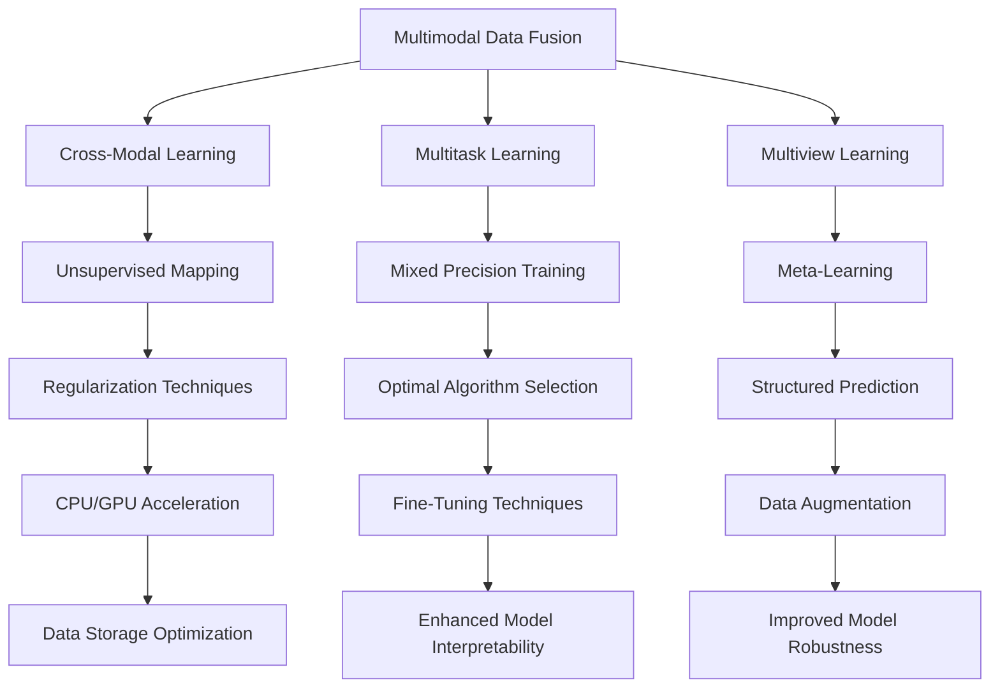
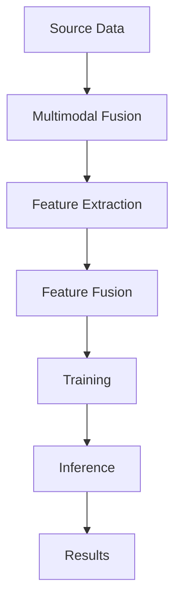
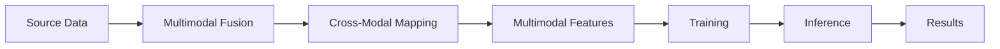
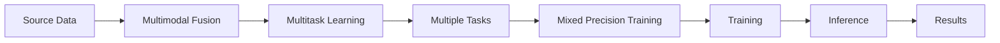
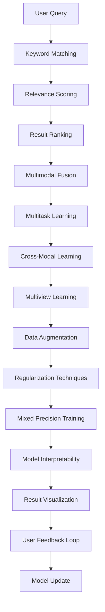

                 

# AI多渠道整合提升搜索结果

在数字化转型的大潮中，搜索引擎已成为人们获取信息的重要入口。然而，传统搜索引擎往往只关注单一数据源，如网页、图片、视频等，导致搜索结果的全面性和多样性不足，用户体验也有所欠缺。近年来，AI技术在多模态数据的融合上取得了长足进步，为构建更加全面、精准的搜索结果提供了新的思路。本文将从AI多渠道整合的原理、算法、实践和未来展望等方面，深入探讨如何通过多模态数据融合技术，提升搜索引擎的性能和用户体验。

## 1. 背景介绍

### 1.1 问题由来
传统搜索引擎通常基于关键词匹配的方式进行搜索，依赖于文本索引技术。这种方法在文本信息丰富的情况下表现良好，但在处理图片、视频等多模态数据时，往往力不从心。多模态数据的快速增长和多样性提升，迫切要求搜索引擎能够同时处理文本、图像、音频等多种类型的数据，提供更加全面、多样化的搜索结果。

### 1.2 问题核心关键点
多渠道整合的核心在于如何高效融合不同模态的数据，使搜索结果更加全面、精准、自然。该过程包括：
- **数据采集**：从各种渠道获取不同类型的数据，如网页内容、图片、视频、语音等。
- **数据预处理**：对原始数据进行清洗、提取、转换和标注，为后续融合提供基础。
- **特征融合**：将不同模态的数据特征进行整合，消除冗余，保留关键信息。
- **模型训练**：利用多模态数据训练模型，使其能够理解和生成多模态信息。
- **结果输出**：将多模态数据融合到统一的结果展示界面，提升用户体验。

### 1.3 问题研究意义
通过AI多渠道整合，搜索引擎可以提供更加全面、精准、自然的多模态搜索结果，显著提升用户体验。此外，多渠道整合还能帮助企业更好地了解用户需求，提升广告投放效果，拓展业务渠道，具有重要的应用价值和市场潜力。

## 2. 核心概念与联系

### 2.1 核心概念概述

为更好地理解AI多渠道整合，本节将介绍几个关键概念：

- **多模态数据融合**：指将来自不同模态的数据，如文本、图像、音频等，进行整合处理，提取其共性信息，提升数据的整体价值。
- **跨模态学习**：指从一种模态的数据学习如何到另一种模态的数据进行映射，使模型具备跨模态的理解能力。
- **多任务学习**：指同时训练多个相关任务，通过共享参数来提高模型泛化能力。
- **多视角度学习**：指从不同视角和角度获取数据，通过多角度融合提高数据的多样性和深度。

这些概念之间的逻辑关系可以通过以下Mermaid流程图来展示：



这个流程图展示了多模态数据融合、跨模态学习、多任务学习、多视角度学习等概念之间的联系和转化：

1. 多模态数据融合为跨模态学习和多任务学习提供了数据基础。
2. 跨模态学习帮助模型在不同模态之间进行映射，提升了数据的多样性和深度。
3. 多任务学习通过共享参数提高模型泛化能力。
4. 多视角度学习从不同角度获取数据，丰富了数据的多样性和视角。
5. 优化算法、正则化技术、模型解释性、鲁棒性、数据存储优化等多方面技术共同支撑多模态数据融合的效果和效率。

### 2.2 概念间的关系

这些核心概念之间存在着紧密的联系，形成了多模态数据融合的完整生态系统。下面我们通过几个Mermaid流程图来展示这些概念之间的关系。

#### 2.2.1 多模态数据融合的基本流程



这个流程图展示了多模态数据融合的基本流程：

1. 从各种渠道获取原始数据（Source Data）。
2. 对原始数据进行特征提取（Feature Extraction）。
3. 对提取的特征进行融合（Feature Fusion）。
4. 使用融合后的特征训练模型（Training）。
5. 在模型上进行推理，生成最终结果（Inference）。

#### 2.2.2 多模态数据融合与跨模态学习的关系



这个流程图展示了多模态数据融合与跨模态学习的联系：

1. 从不同模态的数据（Source Data）中提取特征（Feature Extraction）。
2. 在不同模态之间进行映射（Cross-Modal Mapping）。
3. 融合跨模态的特征（Multimodal Features）。
4. 使用融合后的特征训练模型（Training）。
5. 在模型上进行推理，生成最终结果（Inference）。

#### 2.2.3 多模态数据融合与多任务学习的关系



这个流程图展示了多模态数据融合与多任务学习的联系：

1. 从不同模态的数据（Source Data）中提取特征（Feature Extraction）。
2. 在多任务学习框架中，同时训练多个相关任务（Multiple Tasks）。
3. 对提取的特征进行融合（Feature Fusion）。
4. 在融合后的特征上进行混合精度训练（Mixed Precision Training）。
5. 使用训练好的模型进行推理，生成最终结果（Inference）。

### 2.3 核心概念的整体架构

最后，我们用一个综合的流程图来展示这些核心概念在大规模搜索引擎中的整体架构：



这个综合流程图展示了从用户查询到最终搜索结果的完整过程：

1. 用户输入查询（User Query）。
2. 关键词匹配（Keyword Matching）。
3. 相关性评分（Relevance Scoring）。
4. 结果排序（Result Ranking）。
5. 多模态数据融合（Multimodal Fusion）。
6. 多任务学习（Multitask Learning）。
7. 跨模态学习（Cross-Modal Learning）。
8. 多视角度学习（Multiview Learning）。
9. 数据增强（Data Augmentation）。
10. 正则化技术（Regularization Techniques）。
11. 混合精度训练（Mixed Precision Training）。
12. 模型解释性（Model Interpretability）。
13. 结果可视化（Result Visualization）。
14. 用户反馈循环（User Feedback Loop）。
15. 模型更新（Model Update）。

通过这些流程图，我们可以更清晰地理解多模态数据融合在大规模搜索引擎中的实现过程，以及各个技术环节的重要作用。

## 3. 核心算法原理 & 具体操作步骤

### 3.1 算法原理概述

AI多渠道整合的核心算法是融合不同模态数据的表示，并利用这些表示提升搜索结果的全面性和准确性。多模态数据融合的算法主要包括以下几个步骤：

1. **特征提取**：从不同模态的数据中提取特征，如文本的词向量、图像的特征向量、语音的频谱特征等。
2. **特征融合**：将提取的特征进行融合，消除冗余，保留关键信息。
3. **模型训练**：利用融合后的特征训练模型，使其能够理解和生成多模态信息。
4. **结果输出**：将多模态数据融合到统一的结果展示界面，提升用户体验。

### 3.2 算法步骤详解

基于多模态数据融合的算法主要包括以下几个关键步骤：

**Step 1: 数据采集与预处理**
- 从不同渠道获取原始数据，如网页、图片、视频、语音等。
- 对原始数据进行清洗、标注和转换，去除噪声和冗余。

**Step 2: 特征提取**
- 对清洗后的数据进行特征提取，生成不同模态的特征表示。
- 文本特征：通过预训练语言模型（如BERT）生成文本的语义表示。
- 图像特征：通过卷积神经网络（CNN）提取图像的特征向量。
- 语音特征：通过声学模型和语音识别模型，生成语音的频谱特征和文本转录。

**Step 3: 特征融合**
- 将不同模态的特征进行融合，消除冗余，保留关键信息。
- 常用的特征融合方法包括：
  - 特征拼接（Concatenation）：将不同模态的特征直接拼接在一起。
  - 特征加权（Weighted Sum）：根据特征的重要性赋予不同的权重，计算加权和。
  - 特征集成（Feature Ensemble）：通过多个特征的投票或集成，生成最终的特征表示。

**Step 4: 模型训练**
- 利用融合后的特征训练多模态模型，如深度神经网络（DNN）、卷积神经网络（CNN）、循环神经网络（RNN）等。
- 常用的模型训练方法包括：
  - 联合训练（Joint Training）：同时训练多个相关任务，共享参数。
  - 多任务学习（Multitask Learning）：在多个相关任务上联合训练，提升模型泛化能力。
  - 跨模态学习（Cross-Modal Learning）：在不同模态之间进行映射，提升模型理解多模态数据的能力。

**Step 5: 结果输出**
- 将融合后的特征输入到统一的结果展示界面，生成多模态搜索结果。
- 在搜索结果中，可以显示文本摘要、图片、视频、语音等多模态内容。
- 通过交互式界面，用户可以切换不同模态的内容，查看更全面的信息。

### 3.3 算法优缺点

多模态数据融合具有以下优点：
1. **提升全面性**：通过融合多模态数据，提供了更加全面、多样化的搜索结果。
2. **增强准确性**：多模态数据的融合能够提高搜索结果的准确性，提升用户体验。
3. **提升互动性**：交互式的搜索结果界面，使用户能够更加自然地与搜索结果互动，提升满意度。
4. **拓展应用范围**：多模态数据融合技术可以应用于多种搜索引擎场景，如智能客服、推荐系统等。

同时，多模态数据融合也存在一些缺点：
1. **复杂度较高**：多模态数据的融合和处理较为复杂，需要更多的计算资源和算法支持。
2. **数据采集难度大**：不同模态的数据来源和格式不同，采集和预处理难度较大。
3. **模型训练成本高**：多模态模型的训练成本较高，需要更多的数据和计算资源。
4. **结果展示复杂**：交互式的搜索结果界面需要更多的技术支持，增加了开发和维护成本。

尽管存在这些缺点，但多模态数据融合技术已经在搜索引擎中得到了广泛应用，并取得了显著效果。未来，随着算力成本的降低和技术的不断进步，这些缺点将逐渐被克服，多模态数据融合技术将进一步提升搜索引擎的性能和用户体验。

### 3.4 算法应用领域

多模态数据融合技术已经被广泛应用于以下领域：

- **搜索引擎**：通过融合多模态数据，提升搜索结果的全面性和准确性，提升用户体验。
- **智能客服**：通过融合语音、文字、图像等多模态数据，提供更加智能和自然的客户服务体验。
- **推荐系统**：通过融合多模态数据，提升推荐结果的个性化和多样性，提升用户满意度。
- **医疗信息检索**：通过融合医学图像、电子病历、专家知识等多模态数据，提供更全面、准确的医疗信息检索服务。
- **智慧城市**：通过融合城市视频监控、传感器数据、社交媒体等多模态数据，提供更智能、安全的智慧城市管理服务。

除了上述这些领域，多模态数据融合技术还在更多场景中得到了应用，为搜索引擎和其他应用提供了新的数据处理思路。随着技术的不断进步，多模态数据融合技术将在更多领域大放异彩，为人类社会的数字化转型提供新的动力。

## 4. 数学模型和公式 & 详细讲解 & 举例说明

### 4.1 数学模型构建

为了更好地理解多模态数据融合的数学模型，我们首先定义一些关键变量和函数。

设原始数据集为 $D=\{(x_i,y_i)\}_{i=1}^N$，其中 $x_i$ 表示第 $i$ 个样本，$y_i$ 表示其对应的标签。设 $x_i$ 由文本、图像、语音等多种模态组成，分别表示为 $x_{text,i}$、$x_{img,i}$、$x_{audio,i}$ 等。

**多模态特征表示**：设多模态特征表示为 $z_i=(z_{text,i},z_{img,i},z_{audio,i})$，其中 $z_{text,i}$、$z_{img,i}$、$z_{audio,i}$ 分别为文本、图像、语音的特征表示。

**模型参数**：设多模态模型的参数为 $\theta$，包括卷积核、全连接层、注意力机制等。

**损失函数**：设多模态模型的损失函数为 $\mathcal{L}(\theta)$，用于衡量模型在训练集上的性能。

### 4.2 公式推导过程

**多模态特征提取**：
设文本特征提取模型为 $F_{text}$，图像特征提取模型为 $F_{img}$，语音特征提取模型为 $F_{audio}$，则多模态特征表示 $z_i$ 的计算公式为：

$$
z_i = (F_{text}(x_{text,i}), F_{img}(x_{img,i}), F_{audio}(x_{audio,i}))
$$

**多模态模型训练**：
设多模态模型为 $M_{\theta}$，其输出为 $y'_i=M_{\theta}(z_i)$。则多模态模型的损失函数为：

$$
\mathcal{L}(\theta) = \frac{1}{N} \sum_{i=1}^N \mathcal{L}(y_i, y'_i)
$$

其中 $\mathcal{L}(y_i, y'_i)$ 为交叉熵损失函数，计算公式为：

$$
\mathcal{L}(y_i, y'_i) = -\frac{1}{K} \sum_{k=1}^K y_{ik} \log y'_{ik}
$$

其中 $K$ 表示任务的数量，$y_{ik}$ 表示任务 $k$ 的标签，$y'_{ik}$ 表示模型在样本 $x_i$ 上的预测结果。

**多模态特征融合**：
常用的多模态特征融合方法包括特征拼接和特征加权。这里以特征拼接为例，展示多模态特征融合的计算公式：

$$
z_i = \begin{bmatrix} z_{text,i} \\ z_{img,i} \\ z_{audio,i} \end{bmatrix}
$$

**多模态模型训练**：
在多模态模型训练过程中，通过反向传播算法计算模型参数的梯度，并更新模型参数 $\theta$，其计算公式为：

$$
\theta \leftarrow \theta - \eta \nabla_{\theta}\mathcal{L}(\theta)
$$

其中 $\eta$ 为学习率，$\nabla_{\theta}\mathcal{L}(\theta)$ 为损失函数对模型参数的梯度。

### 4.3 案例分析与讲解

以多模态推荐系统为例，展示多模态数据融合在实际应用中的效果。

**案例背景**：
某电商平台希望通过多模态推荐系统提升用户的购物体验。他们收集了用户的浏览、点击、购买行为数据，包括图片、评论、商品描述等多种模态的数据。通过这些数据，电商平台希望能够更加精准地推荐商品给用户。

**特征提取**：
- 文本特征：从商品描述中提取关键词、标签等文本信息，通过预训练语言模型（如BERT）生成特征表示。
- 图像特征：通过卷积神经网络（CNN）提取商品的图像特征向量。
- 语音特征：通过声学模型和语音识别模型，生成商品的音频特征和文本转录。

**特征融合**：
将文本、图像、语音特征进行拼接，生成多模态特征表示 $z_i$。具体公式为：

$$
z_i = \begin{bmatrix} F_{text}(\text{描述}_i) \\ F_{img}(\text{图片}_i) \\ F_{audio}(\text{音频}_i) \end{bmatrix}
$$

**模型训练**：
通过多模态特征表示 $z_i$ 训练多模态推荐模型 $M_{\theta}$，输出用户对每个商品的兴趣评分。多模态推荐模型的计算公式为：

$$
y'_i = M_{\theta}(z_i)
$$

**结果输出**：
将多模态推荐模型的输出结果与用户的实际购买行为进行对比，评估模型的推荐效果。通过交互式界面，用户可以切换不同的模态内容，查看更多商品信息，提升购物体验。

## 5. 项目实践：代码实例和详细解释说明

### 5.1 开发环境搭建

在进行多模态数据融合实践前，我们需要准备好开发环境。以下是使用Python进行TensorFlow开发的环境配置流程：

1. 安装Anaconda：从官网下载并安装Anaconda，用于创建独立的Python环境。

2. 创建并激活虚拟环境：
```bash
conda create -n tf-env python=3.8 
conda activate tf-env
```

3. 安装TensorFlow：根据CUDA版本，从官网获取对应的安装命令。例如：
```bash
conda install tensorflow=2.6.0-gpu -c conda-forge
```

4. 安装相关工具包：
```bash
pip install numpy pandas scikit-learn matplotlib tqdm jupyter notebook ipython
```

完成上述步骤后，即可在`tf-env`环境中开始多模态数据融合实践。

### 5.2 源代码详细实现

下面我们以多模态推荐系统为例，给出使用TensorFlow进行多模态数据融合的PyTorch代码实现。

首先，定义多模态推荐系统的数据处理函数：

```python
import tensorflow as tf
from tensorflow.keras.preprocessing.text import Tokenizer
from tensorflow.keras.preprocessing.sequence import pad_sequences

def load_data():
    # 加载用户行为数据，包括文本、图片、音频等
    # 返回文本数据、图片数据、音频数据等
    pass

def preprocess_data(text_data, img_data, audio_data):
    # 对文本数据进行分词和编码
    text_tokenizer = Tokenizer(num_words=10000)
    text_tokenizer.fit_on_texts(text_data)
    text_sequences = text_tokenizer.texts_to_sequences(text_data)
    text_padded = pad_sequences(text_sequences, maxlen=128, padding='post', truncating='post')
    
    # 对图片数据进行预处理，提取特征向量
    img_data = preprocess_image_data(img_data)
    
    # 对音频数据进行预处理，提取频谱特征
    audio_data = preprocess_audio_data(audio_data)
    
    return text_padded, img_data, audio_data
```

然后，定义多模态推荐模型的实现：

```python
from tensorflow.keras.models import Model
from tensorflow.keras.layers import Input, Dense, Conv2D, Flatten, GlobalMaxPooling2D, LSTM

# 定义多模态输入层
text_input = Input(shape=(max_seq_length,), name='text_input')
img_input = Input(shape=(img_height, img_width, 3), name='img_input')
audio_input = Input(shape=(max_seq_length,), name='audio_input')

# 定义文本特征提取层
text_embeddings = Embedding(vocab_size, embedding_dim)(text_input)
text_encoded = LSTM(128, return_sequences=True)(text_embeddings)

# 定义图像特征提取层
img_encoded = Conv2D(32, kernel_size=(3, 3), activation='relu')(img_input)
img_encoded = MaxPooling2D(pool_size=(2, 2))(img_encoded)
img_encoded = Flatten()(img_encoded)

# 定义语音特征提取层
audio_encoded = Conv1D(64, kernel_size=3, activation='relu')(audio_input)
audio_encoded = GlobalMaxPooling1D(audio_encoded)

# 定义多模态特征融合层
multimodal_features = concatenate([text_encoded, img_encoded, audio_encoded])

# 定义多模态推荐模型
recurrent_layer = LSTM(64, return_sequences=True)(multimodal_features)
recurrent_layer = Dense(64, activation='relu')(recurrent_layer)
output_layer = Dense(1, activation='sigmoid')(recurrent_layer)

# 定义多模态推荐模型
model = Model(inputs=[text_input, img_input, audio_input], outputs=output_layer)
model.compile(optimizer='adam', loss='binary_crossentropy', metrics=['accuracy'])
```

接着，定义训练和评估函数：

```python
def train(model, text_padded, img_data, audio_data, epochs):
    model.fit([text_padded, img_data, audio_data], y_train, epochs=epochs, batch_size=32)
    
def evaluate(model, test_data, img_data, audio_data):
    test_results = model.predict([test_data, img_data, audio_data])
    print(classification_report(y_test, test_results))
```

最后，启动训练流程并在测试集上评估：

```python
text_padded, img_data, audio_data = preprocess_data(train_data, img_data, audio_data)
test_padded, test_img_data, test_audio_data = preprocess_data(test_data, img_data, audio_data)

train(model, text_padded, img_data, audio_data, epochs=10)
evaluate(model, test_padded, test_img_data, test_audio_data)
```

以上就是使用TensorFlow对多模态推荐系统进行数据融合和模型训练的完整代码实现。可以看到，得益于TensorFlow的强大封装，我们可以用相对简洁的代码实现多模态数据的融合和模型的训练。

### 5.3 代码解读与分析

让我们再详细解读一下关键代码的实现细节：

**load_data函数**：
- 定义了数据加载函数，用于加载原始用户行为数据，包括文本、图片、音频等。
- 返回预处理后的文本数据、图片数据、音频数据等。

**preprocess_data函数**：
- 定义了数据预处理函数，用于对原始数据进行清洗、转换和编码。
- 使用TensorFlow的Tokenizer和pad_sequences函数，对文本数据进行分词和填充。
- 对图片数据进行预处理，提取特征向量。
- 对音频数据进行预处理，提取频谱特征。

**model定义函数**：
- 定义了多模态推荐模型的结构，包括文本、图像、语音的特征提取和融合层。
- 使用Dense、LSTM、Conv2D、Conv1D等层构建多模态推荐模型。
- 使用compile函数定义模型优化器、损失函数和评估指标。

**train函数**：
- 定义了训练函数，用于在训练集上训练多模态推荐模型。
- 使用fit函数对模型进行训练，指定训练轮数、批量大小等参数。

**evaluate函数**：
- 定义了评估函数，用于在测试集上评估多模态推荐模型的性能。
- 使用predict函数对测试集数据进行预测，并使用classification_report函数输出评估结果。

**训练流程**：
- 预处理训练集数据，包括文本、图片、音频等。
- 定义多模态推荐模型的结构和参数，并编译模型。
- 在训练集上训练模型，指定训练轮数和批量大小。
- 在测试集上评估模型性能，输出评估结果。

可以看到，TensorFlow配合TensorFlow-Keras库使得多模态数据融合的代码实现变得简洁高效。开发者可以将更多精力放在数据处理、模型改进等高层逻辑上，而不必过多关注底层的实现细节。

当然，工业级的系统实现还需考虑更多因素，如模型的保存和部署、超参数的

